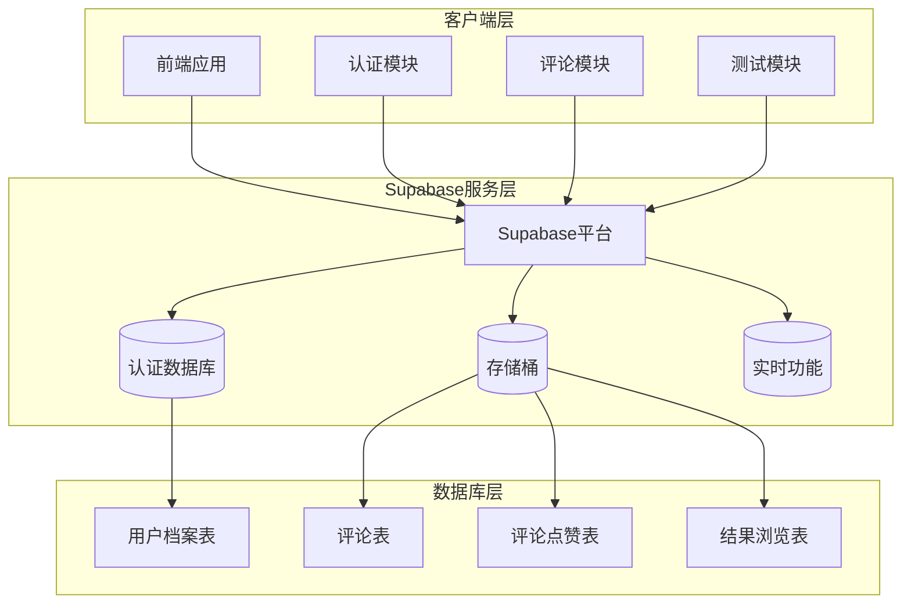
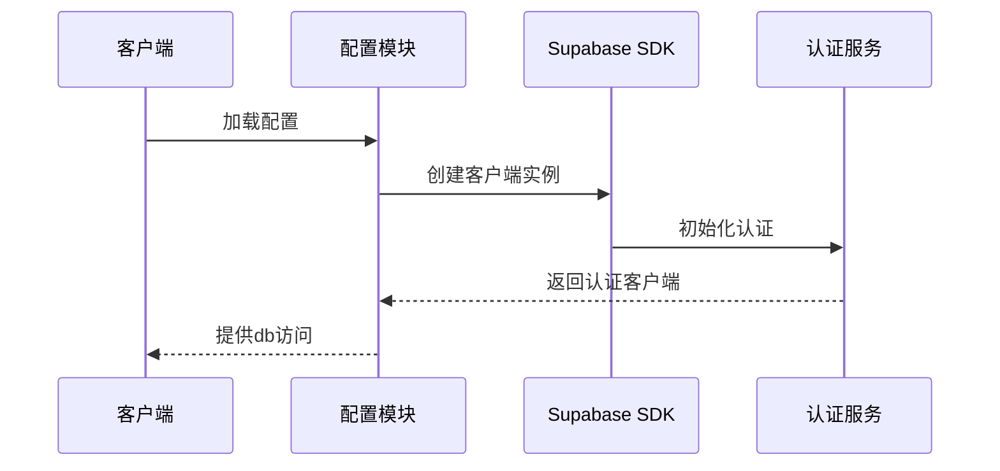
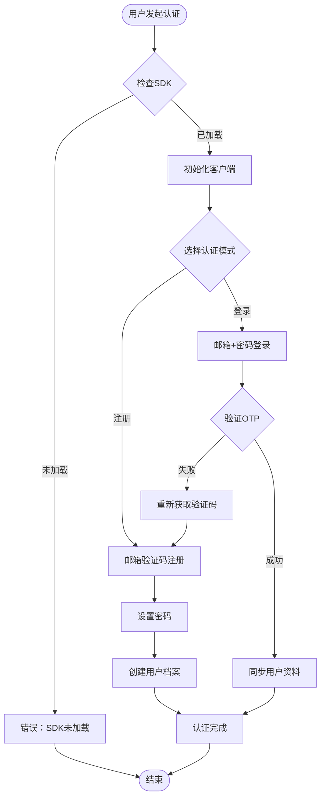
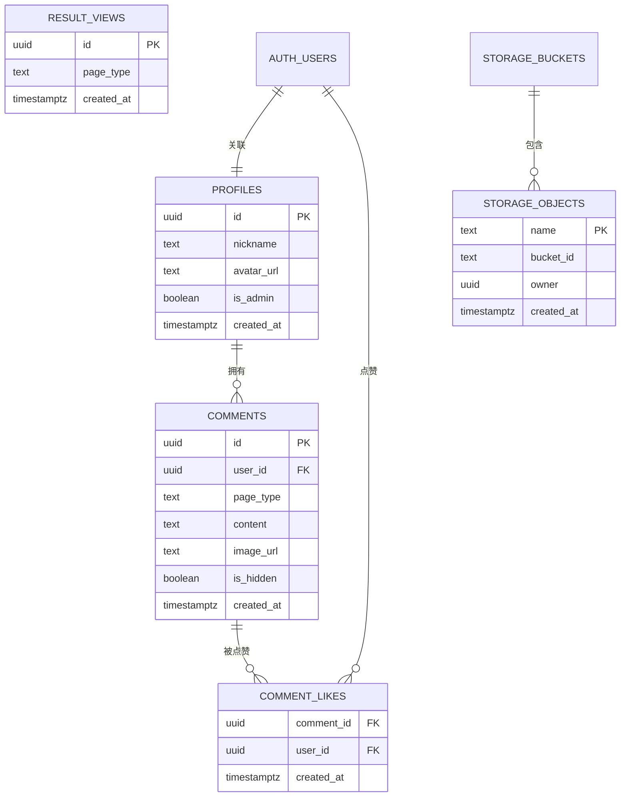
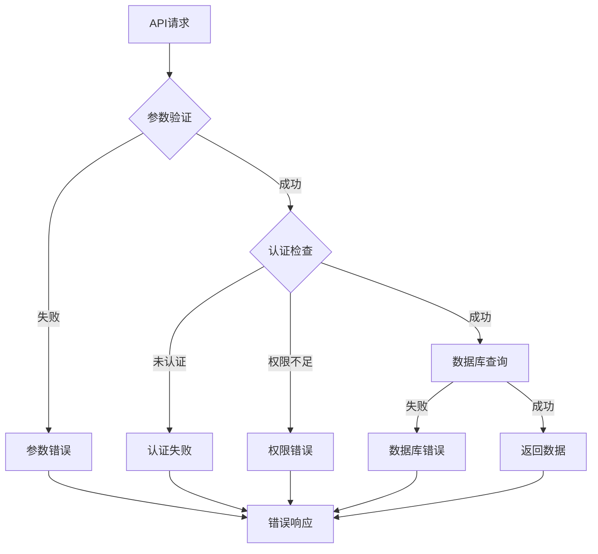

# API接口文档

<cite>
**本文档引用的文件**
- [supabase-config.js](file://shared/supabase-config.js)
- [auth.js](file://shared/auth.js)
- [comments.js](file://shared/comments.js)
- [app.js (ObjTest)](file://ObjTest/app.js)
- [app.js (SoulLab)](file://SoulLab/app.js)
- [index.html (admin)](file://admin/index.html)
- [supabase-schema.sql](file://supabase-schema.sql)
- [supabase-community-upgrade.sql](file://supabase-community-upgrade.sql)
- [supabase-result-views.sql](file://supabase-result-views.sql)
- [supabase-admin-delete-user.sql](file://supabase-admin-delete-user.sql)
- [questions.js (ObjTest)](file://ObjTest/questions.js)
- [questions.js (SoulLab)](file://SoulLab/questions.js)
</cite>

## 目录
1. [项目概述](#项目概述)
2. [系统架构](#系统架构)
3. [认证API](#认证api)
4. [测试数据API](#测试数据api)
5. [评论系统API](#评论系统api)
6. [管理后台API](#管理后台api)
7. [数据库设计](#数据库设计)
8. [错误处理](#错误处理)
9. [性能与安全](#性能与安全)
10. [部署指南](#部署指南)

## 项目概述

本项目是一个基于Supabase的全栈应用，包含用户认证、测试评估、评论系统和管理后台等功能模块。系统采用前端JavaScript + Supabase后端的服务架构，提供了完整的用户交互体验。

## 系统架构



**图表来源**
- [supabase-config.js:9-21](file://shared/supabase-config.js#L9-L21)
- [supabase-schema.sql:6-87](file://supabase-schema.sql#L6-L87)

## 认证API

### 基础配置

系统通过全局配置初始化Supabase客户端：



**图表来源**
- [supabase-config.js:5-25](file://shared/supabase-config.js#L5-L25)

### 认证流程



**图表来源**
- [auth.js:522-677](file://shared/auth.js#L522-L677)

### 认证API规范

#### 用户登录
- **方法**: POST
- **路径**: `/auth/sign_in_with_password`
- **请求参数**:
  - email: 邮箱地址 (必填)
  - password: 密码 (必填)
- **响应**:
  - 成功: 返回用户信息和会话数据
  - 失败: 返回错误信息

#### 邮箱验证码登录
- **方法**: POST
- **路径**: `/auth/send_magiclink`
- **请求参数**:
  - email: 邮箱地址 (必填)
- **响应**:
  - 成功: 返回成功状态
  - 失败: 返回错误信息

#### 设置密码
- **方法**: POST
- **路径**: `/auth/update_user`
- **请求参数**:
  - password: 新密码 (必填，最少6位)
- **响应**:
  - 成功: 返回更新后的用户信息
  - 失败: 返回错误信息

**章节来源**
- [auth.js:522-677](file://shared/auth.js#L522-L677)

## 测试数据API

### 客体化测试API

#### 获取题目列表
- **方法**: GET
- **路径**: `/questions/objtest`
- **响应**: 返回40道测试题目数组
- **字段说明**:
  - id: 题目编号
  - text: 题目内容
  - options: 选项数组
    - text: 选项文本
    - score: 对应分数

#### 提交测试结果
- **方法**: POST
- **路径**: `/results/objtest`
- **请求参数**:
  - answers: 答案数组
  - totalScore: 总分
  - page_type: 'objtest'
- **响应**: 返回计算后的结果和建议

**章节来源**
- [questions.js (ObjTest):1-403](file://ObjTest/questions.js#L1-L403)
- [app.js (ObjTest):207-242](file://ObjTest/app.js#L207-L242)

### 灵魂解剖测试API

#### 获取题目列表
- **方法**: GET
- **路径**: `/questions/soullab`
- **响应**: 返回33道测试题目数组
- **字段说明**:
  - id: 题目编号
  - text: 题目内容
  - options: 选项数组
    - label: 选项标识 (A/B/C/D)
    - text: 选项文本
    - scores: 各人格类型的得分

#### 提交测试结果
- **方法**: POST
- **路径**: `/results/soullab`
- **请求参数**:
  - answers: 答案数组
  - scores: 各人格类型得分
  - page_type: 'soullab'
- **响应**: 返回人格类型和详细描述

**章节来源**
- [questions.js (SoulLab):20-352](file://SoulLab/questions.js#L20-L352)
- [app.js (SoulLab):334-405](file://SoulLab/app.js#L334-L405)

## 评论系统API

### 评论管理API

#### 获取评论列表
- **方法**: GET
- **路径**: `/comments/{page_type}`
- **查询参数**:
  - page_type: 页面类型 (soullab | objtest)
  - limit: 返回数量 (默认120)
  - offset: 偏移量
- **响应**: 返回评论数组，包含用户信息和点赞状态

#### 发布评论
- **方法**: POST
- **路径**: `/comments`
- **请求参数**:
  - user_id: 用户ID (认证获取)
  - page_type: 页面类型
  - content: 评论内容 (最多500字符)
  - image_url: 图片URL (可选)
  - parent_comment_id: 父评论ID (可选)
- **响应**: 返回创建的评论对象

#### 删除评论
- **方法**: DELETE
- **路径**: `/comments/{comment_id}`
- **权限**: 评论作者或管理员
- **响应**: 返回删除成功状态

### 点赞系统API

#### 点赞评论
- **方法**: POST
- **路径**: `/comment_likes`
- **请求参数**:
  - comment_id: 评论ID
  - user_id: 用户ID
- **响应**: 返回点赞记录

#### 取消点赞
- **方法**: DELETE
- **路径**: `/comment_likes/{comment_id}/{user_id}`
- **响应**: 返回取消成功状态

**章节来源**
- [comments.js:309-643](file://shared/comments.js#L309-L643)
- [comments.js:645-688](file://shared/comments.js#L645-L688)

## 管理后台API

### 管理员认证

#### 管理员登录
- **方法**: POST
- **路径**: `/auth/sign_in_with_password`
- **请求参数**:
  - email: 管理员邮箱
  - password: 管理员密码
- **响应**: 返回管理员会话信息

### 用户管理API

#### 获取用户列表
- **方法**: GET
- **路径**: `/profiles`
- **查询参数**:
  - limit: 返回数量
  - offset: 偏移量
- **响应**: 返回用户档案数组

#### 设置管理员权限
- **方法**: PATCH
- **路径**: `/profiles/{user_id}`
- **请求参数**:
  - is_admin: 是否设置为管理员
- **响应**: 返回更新后的用户信息

#### 删除用户账户
- **方法**: POST
- **路径**: `/rpc/admin_delete_user`
- **请求参数**:
  - target_user_id: 目标用户ID
- **响应**: 返回删除成功状态

### 评论管理API

#### 获取评论统计
- **方法**: GET
- **路径**: `/comments/stats`
- **响应**: 返回评论总数、分类统计

#### 批量管理评论
- **方法**: PATCH
- **路径**: `/comments/{comment_id}`
- **请求参数**:
  - is_hidden: 是否隐藏
- **响应**: 返回更新后的评论状态

**章节来源**
- [index.html (admin):398-427](file://admin/index.html#L398-L427)
- [index.html (admin):506-592](file://admin/index.html#L506-L592)
- [supabase-admin-delete-user.sql:1-29](file://supabase-admin-delete-user.sql#L1-L29)

## 数据库设计

### 核心表结构



**图表来源**
- [supabase-schema.sql:6-87](file://supabase-schema.sql#L6-L87)
- [supabase-community-upgrade.sql:9-14](file://supabase-community-upgrade.sql#L9-L14)

### 行级安全策略

系统采用行级安全(RLS)策略控制数据访问：

- **用户档案表**: 任何人都可以读取，本人只能更新自己的资料
- **评论表**: 未隐藏评论公开读取，本人可删除自己的评论
- **评论点赞表**: 公开读取，认证用户可插入和删除自己的点赞
- **存储桶**: 登录用户可上传，公开可读

**章节来源**
- [supabase-schema.sql:15-80](file://supabase-schema.sql#L15-L80)
- [supabase-community-upgrade.sql:49-76](file://supabase-community-upgrade.sql#L49-L76)

## 错误处理

### 错误码定义

| 错误码 | 描述 | 处理建议 |
|--------|------|----------|
| 400 | 请求参数错误 | 检查必填字段和数据格式 |
| 401 | 未认证 | 检查用户会话和认证状态 |
| 403 | 权限不足 | 验证用户角色和权限 |
| 404 | 资源不存在 | 检查资源ID和路径 |
| 429 | 请求过于频繁 | 实现重试机制和限流 |
| 500 | 服务器内部错误 | 检查数据库连接和API调用 |

### 常见错误场景



**图表来源**
- [auth.js:115-147](file://shared/auth.js#L115-L147)
- [comments.js:334-344](file://shared/comments.js#L334-L344)

**章节来源**
- [auth.js:115-147](file://shared/auth.js#L115-L147)
- [comments.js:47-65](file://shared/comments.js#L47-L65)

## 性能与安全

### 性能优化

#### 缓存策略
- 用户头像和资料缓存
- 评论列表分页加载
- 图片懒加载和压缩

#### 数据库优化
- 评论索引优化 (page_type, parent_comment_id, created_at)
- 点赞表复合索引
- 存储桶访问控制

### 安全防护

#### 认证安全
- JWT令牌有效期管理
- 密码强度验证
- 邮箱验证机制

#### 数据安全
- 行级安全策略
- SQL注入防护
- XSS攻击防护

#### 速率限制
- API请求频率限制
- 文件上传大小限制 (5MB)
- 并发请求控制

**章节来源**
- [comments.js:714-718](file://shared/comments.js#L714-L718)
- [supabase-schema.sql:83-97](file://supabase-schema.sql#L83-L97)

## 部署指南

### 环境配置

1. **Supabase项目设置**
   - 创建新的Supabase项目
   - 配置认证服务
   - 设置存储桶权限

2. **数据库初始化**
   ```sql
   -- 运行基础架构脚本
   supabase-schema.sql
   
   -- 运行社区功能升级
   supabase-community-upgrade.sql
   
   -- 运行结果统计功能
   supabase-result-views.sql
   
   -- 运行管理员函数
   supabase-admin-delete-user.sql
   ```

3. **前端配置**
   - 更新Supabase URL和密钥
   - 配置环境变量
   - 部署静态资源

### 监控与维护

- **日志监控**: 记录API调用和错误信息
- **性能监控**: 监控数据库查询和响应时间
- **备份策略**: 定期备份数据库和存储内容
- **安全审计**: 定期检查权限和访问日志

**章节来源**
- [supabase-schema.sql:1-97](file://supabase-schema.sql#L1-L97)
- [supabase-community-upgrade.sql:1-77](file://supabase-community-upgrade.sql#L1-L77)
- [supabase-result-views.sql:1-32](file://supabase-result-views.sql#L1-L32)
- [supabase-admin-delete-user.sql:1-29](file://supabase-admin-delete-user.sql#L1-L29)