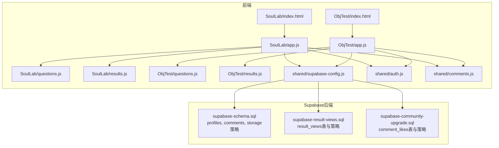
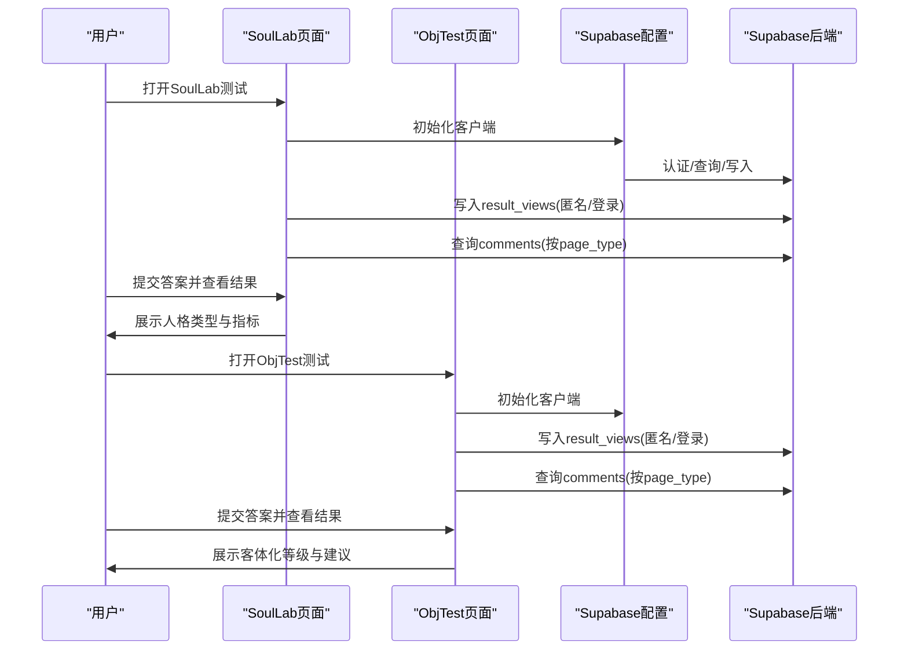
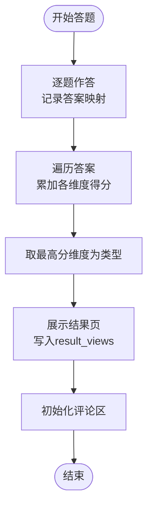
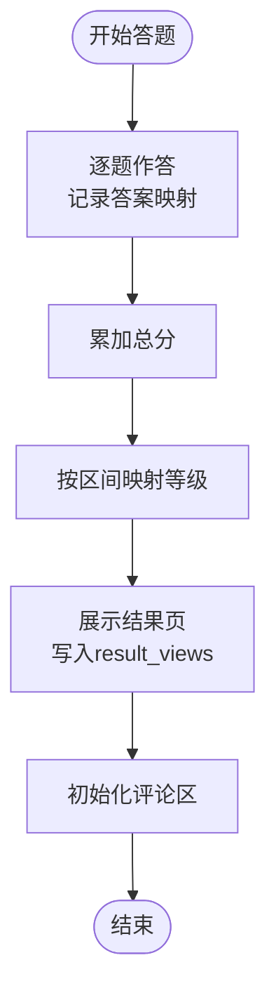
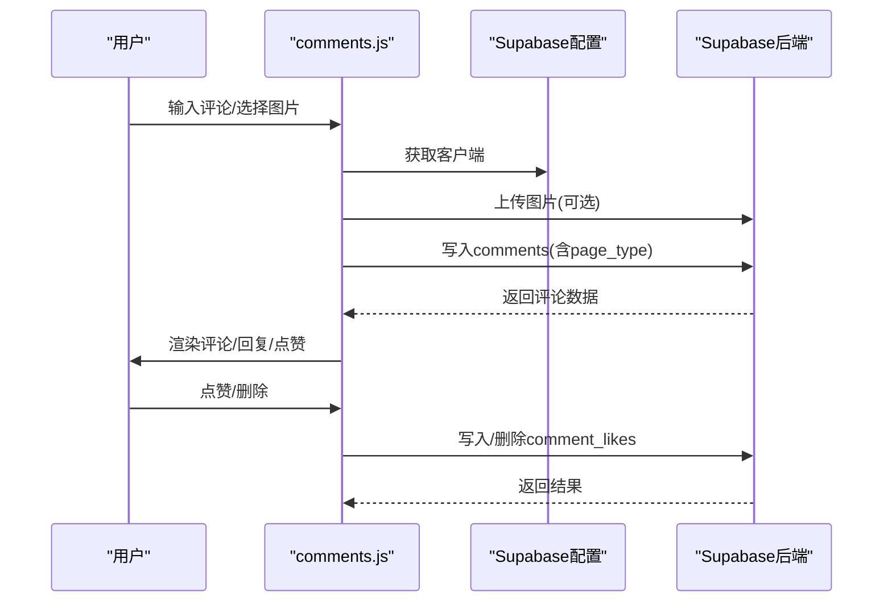
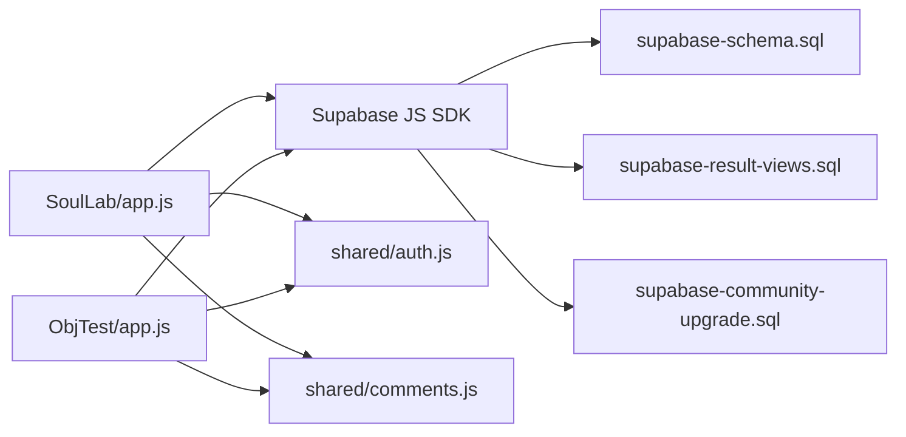

# 测试数据API

<cite>
**本文引用的文件**
- [supabase-schema.sql](file://supabase-schema.sql)
- [supabase-result-views.sql](file://supabase-result-views.sql)
- [supabase-community-upgrade.sql](file://supabase-community-upgrade.sql)
- [shared/supabase-config.js](file://shared/supabase-config.js)
- [shared/auth.js](file://shared/auth.js)
- [shared/comments.js](file://shared/comments.js)
- [SoulLab/index.html](file://SoulLab/index.html)
- [SoulLab/app.js](file://SoulLab/app.js)
- [SoulLab/questions.js](file://SoulLab/questions.js)
- [SoulLab/results.js](file://SoulLab/results.js)
- [SoulLab/types.js](file://SoulLab/types.js)
- [ObjTest/index.html](file://ObjTest/index.html)
- [ObjTest/app.js](file://ObjTest/app.js)
- [ObjTest/questions.js](file://ObjTest/questions.js)
- [ObjTest/results.js](file://ObjTest/results.js)
</cite>

## 目录
1. [简介](#简介)
2. [项目结构](#项目结构)
3. [核心组件](#核心组件)
4. [架构总览](#架构总览)
5. [详细组件分析](#详细组件分析)
6. [依赖关系分析](#依赖关系分析)
7. [性能考量](#性能考量)
8. [故障排查指南](#故障排查指南)
9. [结论](#结论)
10. [附录](#附录)

## 简介
本文件面向心理测试数据API，系统化梳理“SoulLab人格测试”与“ObjTest客体化测试”的数据结构、评分算法、结果展示与交互流程，并给出基于Supabase的存储、查询、分析与扩展接口规范。内容覆盖：
- 测试进度与结果的前端状态管理与持久化策略
- 参与人数统计与结果浏览追踪
- 评论与互动生态的权限与数据模型
- 数据校验、完整性检查与迁移升级方案
- 性能监控、数据备份与隐私保护建议

## 项目结构
项目采用“前端静态页面 + Supabase后端服务”的架构，测试页面通过共享的认证与评论模块与后端交互。

图表来源
- [SoulLab/index.html:1-271](file://SoulLab/index.html#L1-L271)
- [SoulLab/app.js:1-613](file://SoulLab/app.js#L1-L613)
- [ObjTest/index.html:1-170](file://ObjTest/index.html#L1-L170)
- [ObjTest/app.js:1-327](file://ObjTest/app.js#L1-L327)
- [shared/supabase-config.js:1-26](file://shared/supabase-config.js#L1-L26)
- [supabase-schema.sql:1-97](file://supabase-schema.sql#L1-L97)
- [supabase-result-views.sql:1-32](file://supabase-result-views.sql#L1-L32)
- [supabase-community-upgrade.sql:1-77](file://supabase-community-upgrade.sql#L1-L77)

章节来源
- [SoulLab/index.html:1-271](file://SoulLab/index.html#L1-L271)
- [ObjTest/index.html:1-170](file://ObjTest/index.html#L1-L170)
- [shared/supabase-config.js:1-26](file://shared/supabase-config.js#L1-L26)

## 核心组件
- Supabase基础表与策略
  - profiles：用户档案，含昵称、头像、管理员标记与RLS策略
  - comments：测试评论，含page_type分类、隐藏字段与RLS策略
  - storage：评论图片桶与策略
- 结果浏览追踪
  - result_views：匿名/登录均可写入，按page_type统计参与人数
- 社区功能升级
  - comment_likes：点赞表，含RLS策略与索引
- 共享认证与评论模块
  - auth.js：登录/注册/头像/资料同步
  - comments.js：评论列表、回复、点赞、图片上传

章节来源
- [supabase-schema.sql:6-97](file://supabase-schema.sql#L6-L97)
- [supabase-result-views.sql:1-32](file://supabase-result-views.sql#L1-L32)
- [supabase-community-upgrade.sql:1-77](file://supabase-community-upgrade.sql#L1-L77)
- [shared/auth.js:1-800](file://shared/auth.js#L1-L800)
- [shared/comments.js:1-769](file://shared/comments.js#L1-L769)

## 架构总览
前端通过Supabase JS SDK访问后端，认证与评论模块统一接入。测试页面负责答题、评分与结果展示，同时记录结果浏览次数并初始化评论区。

图表来源
- [SoulLab/app.js:33-74](file://SoulLab/app.js#L33-L74)
- [ObjTest/app.js:23-64](file://ObjTest/app.js#L23-L64)
- [shared/supabase-config.js:5-26](file://shared/supabase-config.js#L5-L26)
- [supabase-schema.sql:42-97](file://supabase-schema.sql#L42-L97)
- [supabase-result-views.sql:1-32](file://supabase-result-views.sql#L1-L32)

## 详细组件分析

### 1) SoulLab人格测试数据流
- 数据结构
  - 问题集：questions.js包含33道题，每题若干选项，选项携带多个人格维度的加权分值
  - 评分算法：遍历已选答案，累加各维度得分，取最高分维度作为最终类型
  - 结果展示：results.js定义12种人格画像、指标与描述
- 前端状态管理
  - 当前题号、答案映射、各维度累计分数
  - 加载页与结果页的动画与延迟展示
- 结果浏览追踪
  - 每次进入结果页写入result_views(page_type='soullab')
  - 统计参与人数：优先查询result_views，失败则回退到comments数量

图表来源
- [SoulLab/app.js:334-405](file://SoulLab/app.js#L334-L405)
- [SoulLab/questions.js:20-352](file://SoulLab/questions.js#L20-L352)
- [SoulLab/results.js:6-139](file://SoulLab/results.js#L6-L139)
- [SoulLab/app.js:33-74](file://SoulLab/app.js#L33-L74)

章节来源
- [SoulLab/app.js:1-613](file://SoulLab/app.js#L1-L613)
- [SoulLab/questions.js:1-352](file://SoulLab/questions.js#L1-L352)
- [SoulLab/results.js:1-140](file://SoulLab/results.js#L1-L140)

### 2) ObjTest客体化测试数据流
- 数据结构
  - 问题集：questions.js包含40道题，每题1-4分，总分0-120
  - 评分算法：累加总分，按区间映射到5个等级（健康/轻度/中度/重度/极重度）
- 前端状态管理
  - 当前题号、答案映射、总分
  - 加载页与结果页的动画与延迟展示
- 结果浏览追踪
  - 每次进入结果页写入result_views(page_type='objtest')

图表来源
- [ObjTest/app.js:207-242](file://ObjTest/app.js#L207-L242)
- [ObjTest/questions.js:1-403](file://ObjTest/questions.js#L1-L403)
- [ObjTest/results.js:8-55](file://ObjTest/results.js#L8-L55)
- [ObjTest/app.js:23-64](file://ObjTest/app.js#L23-L64)

章节来源
- [ObjTest/app.js:1-327](file://ObjTest/app.js#L1-L327)
- [ObjTest/questions.js:1-403](file://ObjTest/questions.js#L1-L403)
- [ObjTest/results.js:1-55](file://ObjTest/results.js#L1-L55)

### 3) 评论与互动生态
- 数据模型
  - comments：按page_type分类（'soullab'/'objtest'），支持父评论id实现回复
  - comment_likes：点赞表，RLS策略限定读写权限
- 权限策略
  - profiles：公开读取、本人更新/插入
  - comments：公开读取未隐藏、登录发表、本人删除、管理员全部读取/隐藏/删除
  - comment_likes：公开读取、认证用户点赞/取消
  - storage：登录用户上传、公开读取
- 前端交互
  - 发布评论（支持文本+图片）、回复、点赞、删除
  - 乐观更新与错误回滚
  - @提及高亮

图表来源
- [shared/comments.js:511-643](file://shared/comments.js#L511-L643)
- [shared/comments.js:645-688](file://shared/comments.js#L645-L688)
- [shared/supabase-config.js:5-26](file://shared/supabase-config.js#L5-L26)
- [supabase-schema.sql:42-97](file://supabase-schema.sql#L42-L97)
- [supabase-community-upgrade.sql:9-23](file://supabase-community-upgrade.sql#L9-L23)

章节来源
- [shared/comments.js:1-769](file://shared/comments.js#L1-L769)
- [supabase-schema.sql:42-97](file://supabase-schema.sql#L42-L97)
- [supabase-community-upgrade.sql:1-77](file://supabase-community-upgrade.sql#L1-L77)

### 4) 认证与资料管理
- 支持邮箱验证码登录/注册，密码重置
- 头像支持emoji与图片上传，兼容旧字段
- 用户资料同步与RLS策略适配

章节来源
- [shared/auth.js:522-799](file://shared/auth.js#L522-L799)
- [supabase-schema.sql:6-21](file://supabase-schema.sql#L6-L21)

## 依赖关系分析
- 前端依赖
  - Supabase JS SDK（CDN引入）
  - 共享模块：认证、评论、Supabase配置
- 后端依赖
  - 表与策略：profiles、comments、comment_likes、storage
  - 索引：result_views按(page_type, created_at)排序；comments按(page_type,parent_comment_id,created_at)排序；comment_likes按(comment_id,user_id)排序

图表来源
- [SoulLab/app.js:1-18](file://SoulLab/app.js#L1-L18)
- [ObjTest/app.js:1-15](file://ObjTest/app.js#L1-L15)
- [shared/supabase-config.js:5-26](file://shared/supabase-config.js#L5-L26)
- [supabase-schema.sql:1-97](file://supabase-schema.sql#L1-L97)
- [supabase-result-views.sql:1-32](file://supabase-result-views.sql#L1-L32)
- [supabase-community-upgrade.sql:1-77](file://supabase-community-upgrade.sql#L1-L77)

章节来源
- [SoulLab/app.js:1-18](file://SoulLab/app.js#L1-L18)
- [ObjTest/app.js:1-15](file://ObjTest/app.js#L1-L15)
- [shared/supabase-config.js:1-26](file://shared/supabase-config.js#L1-L26)

## 性能考量
- 前端
  - 使用html2canvas生成海报时的跨域与缩放策略，失败时降级重试
  - 评论列表分页与懒加载，减少DOM渲染压力
- 后端
  - 为result_views与comments建立复合索引，优化统计与查询
  - 通过RLS减少不必要的过滤逻辑，提升查询效率
- 缓存与CDN
  - 图片资源使用Supabase Storage公共URL，结合浏览器缓存策略

章节来源
- [SoulLab/app.js:446-546](file://SoulLab/app.js#L446-L546)
- [ObjTest/app.js:259-303](file://ObjTest/app.js#L259-L303)
- [shared/comments.js:365-381](file://shared/comments.js#L365-L381)
- [supabase-result-views.sql:7-8](file://supabase-result-views.sql#L7-L8)
- [supabase-community-upgrade.sql:6-23](file://supabase-community-upgrade.sql#L6-L23)

## 故障排查指南
- 评论功能未启用
  - 现象：提示“评论功能未完成升级”
  - 处理：执行社区升级SQL，创建comment_likes表并应用RLS策略
- 评论表缺失
  - 现象：加载失败，提示表不存在
  - 处理：执行基础schema SQL创建表与策略
- 头像上传失败
  - 现象：上传超时或权限不足
  - 处理：检查storage策略与网络，确认桶名称与权限
- 结果浏览统计异常
  - 现象：参与人数显示为0或报错
  - 处理：检查result_views写入与索引，必要时回退到comments计数

章节来源
- [shared/comments.js:333-344](file://shared/comments.js#L333-L344)
- [shared/comments.js:548-551](file://shared/comments.js#L548-L551)
- [shared/comments.js:634-638](file://shared/comments.js#L634-L638)
- [SoulLab/app.js:33-74](file://SoulLab/app.js#L33-L74)
- [ObjTest/app.js:23-64](file://ObjTest/app.js#L23-L64)

## 结论
本项目通过简洁的前端状态管理与Supabase的RLS策略，实现了心理测试的完整数据生命周期：答题、评分、结果展示、浏览统计与评论互动。建议后续在后端增加专门的结果表以支持更复杂的分析与导出，同时完善数据迁移与备份策略，确保长期稳定性与可维护性。

## 附录

### A. 接口规范（基于现有实现的扩展建议）

- 参与人数统计
  - GET /tables/result_views/count
  - 查询条件：page_type='soullab'或'objtest'
  - 返回：count整数
  - 备注：若查询失败，回退到comments表count

- 结果浏览追踪
  - POST /tables/result_views
  - 请求体：{ page_type: 'soullab'|'objtest' }
  - 返回：写入记录

- 评论列表
  - GET /tables/comments
  - 查询参数：page_type, limit, offset
  - 返回：评论数组（含用户头像、点赞数、回复树）

- 发布评论
  - POST /tables/comments
  - 请求体：{ user_id, page_type, content, image_url?, parent_comment_id? }
  - 返回：评论对象

- 点赞/取消点赞
  - POST /tables/comment_likes
  - DELETE /tables/comment_likes/{comment_id}/{user_id}

- 头像上传
  - POST /storage/comment-images/{path}
  - 返回：publicUrl

- 数据迁移与升级
  - 执行顺序：基础schema → 社区升级 → 结果浏览视图
  - 升级脚本：supabase-schema.sql → supabase-community-upgrade.sql → supabase-result-views.sql

章节来源
- [supabase-schema.sql:1-97](file://supabase-schema.sql#L1-L97)
- [supabase-community-upgrade.sql:1-77](file://supabase-community-upgrade.sql#L1-L77)
- [supabase-result-views.sql:1-32](file://supabase-result-views.sql#L1-L32)
- [shared/comments.js:509-643](file://shared/comments.js#L509-L643)