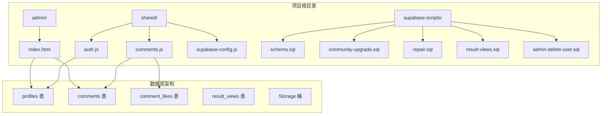
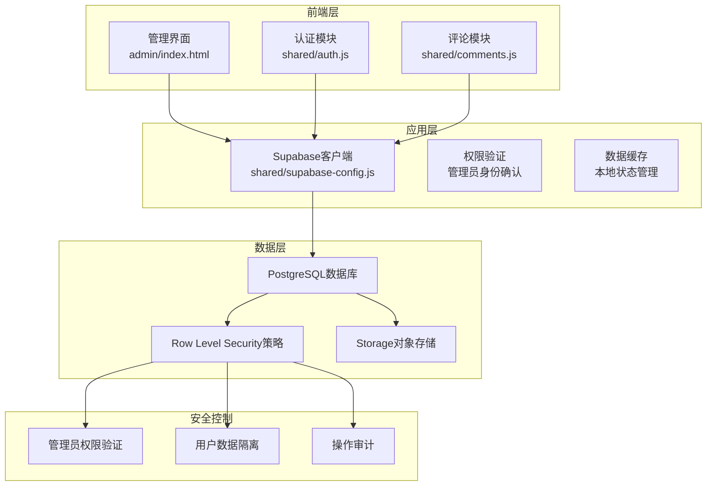
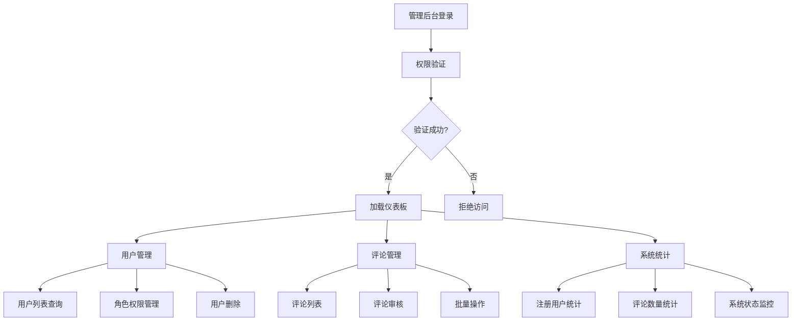
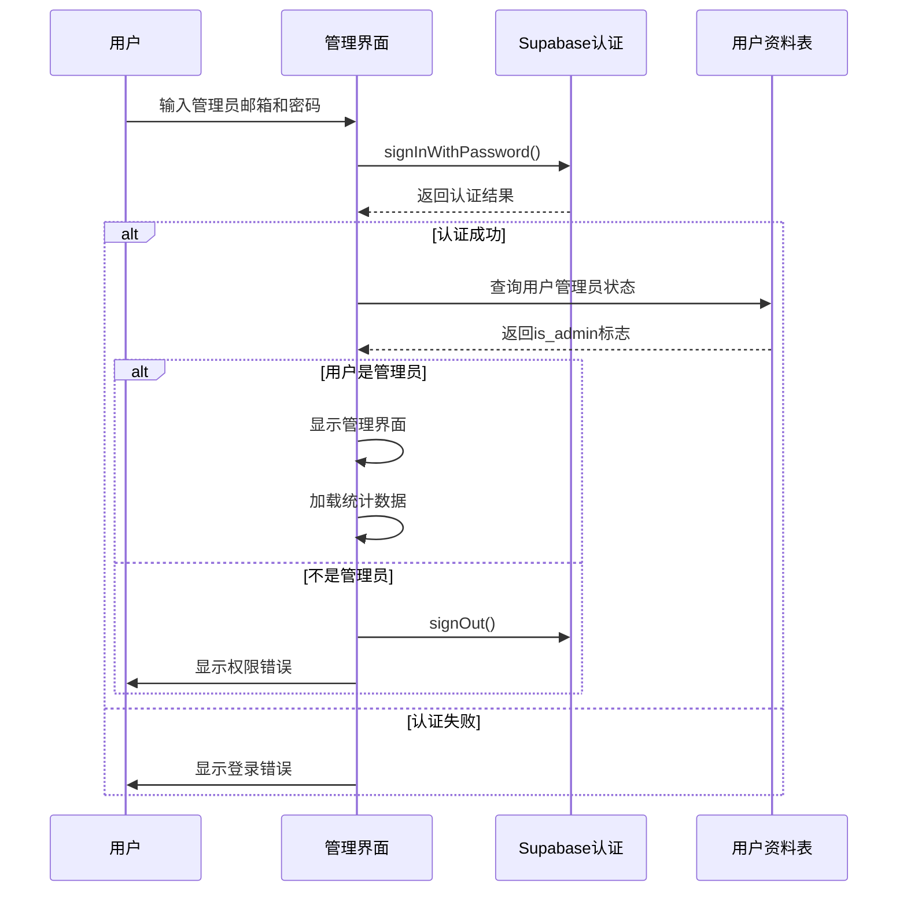
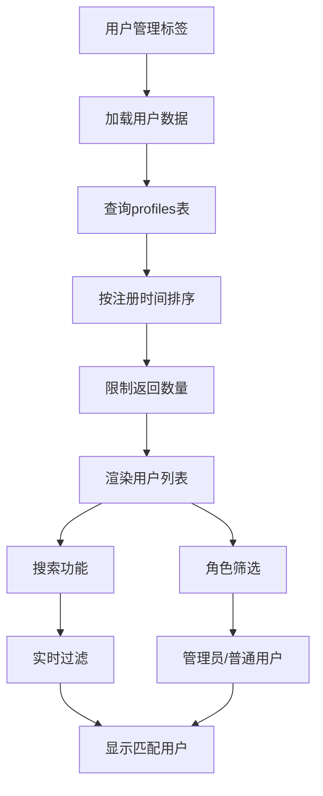
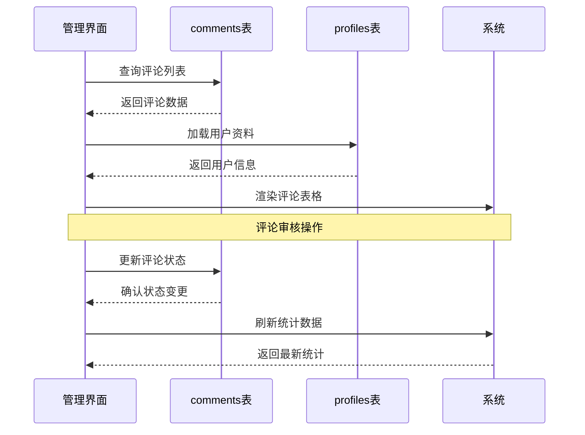
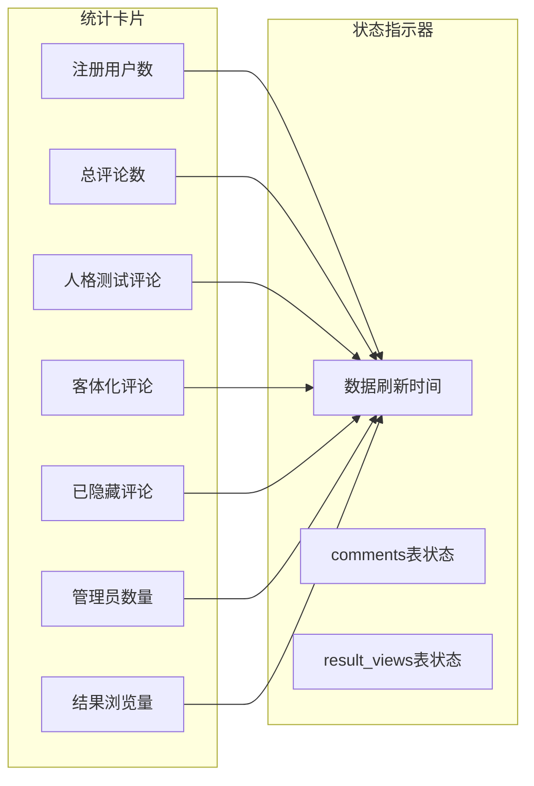
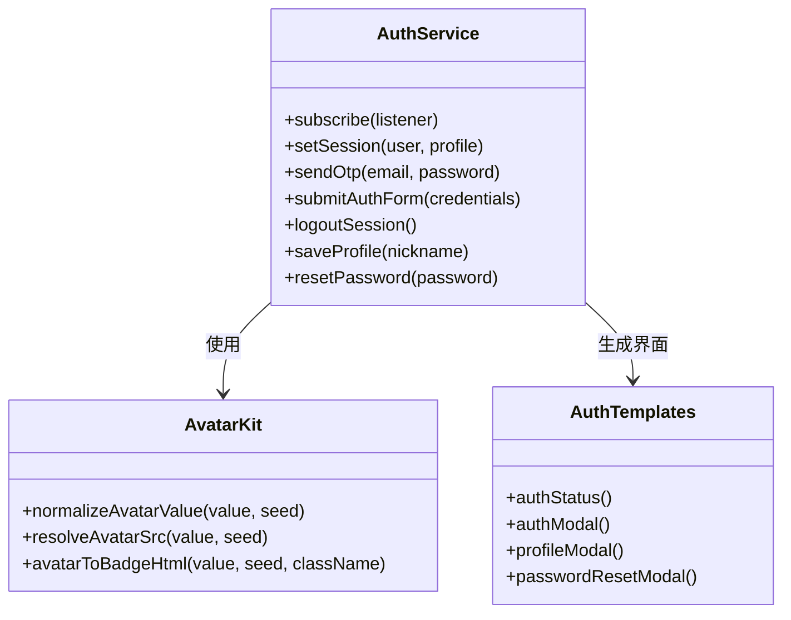
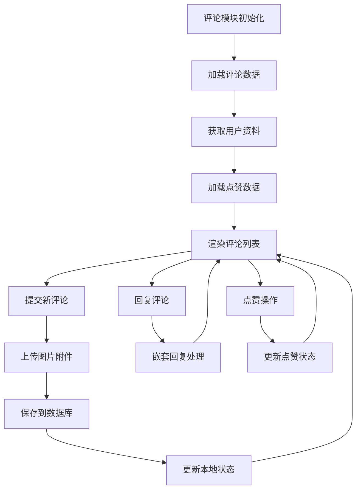
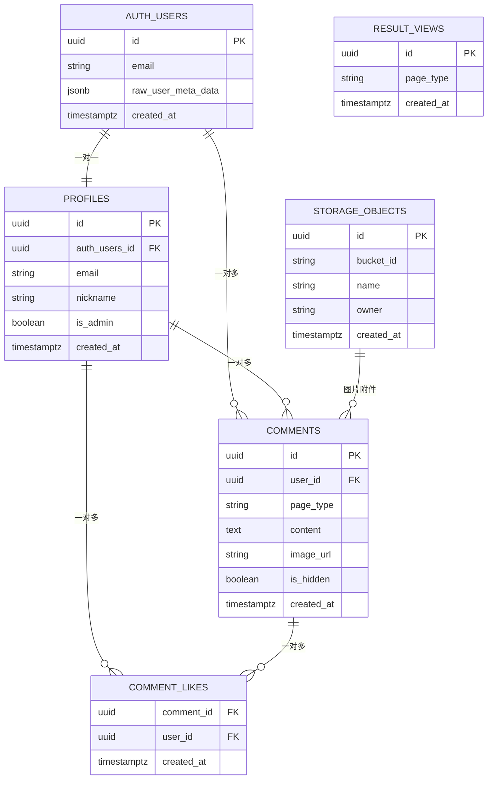

# 管理后台API

<cite>
**本文档引用的文件**
- [supabase-schema.sql](file://supabase-schema.sql)
- [supabase-admin-delete-user.sql](file://supabase-admin-delete-user.sql)
- [supabase-community-upgrade.sql](file://supabase-community-upgrade.sql)
- [supabase-repair.sql](file://supabase-repair.sql)
- [supabase-result-views.sql](file://supabase-result-views.sql)
- [admin/index.html](file://admin/index.html)
- [shared/auth.js](file://shared/auth.js)
- [shared/comments.js](file://shared/comments.js)
- [shared/supabase-config.js](file://shared/supabase-config.js)
</cite>

## 目录
1. [简介](#简介)
2. [项目结构](#项目结构)
3. [核心组件](#核心组件)
4. [架构概览](#架构概览)
5. [详细组件分析](#详细组件分析)
6. [依赖关系分析](#依赖关系分析)
7. [性能考虑](#性能考虑)
8. [故障排除指南](#故障排除指南)
9. [结论](#结论)

## 简介

这是一个基于Supabase构建的管理后台系统，专为"觉醒诗社"网站设计。该系统提供了完整的用户管理、内容审核和系统配置功能，支持管理员权限验证、用户列表查询、评论审核和系统统计等核心管理功能。

系统采用前后端分离架构，前端使用原生JavaScript和HTML/CSS构建管理界面，后端基于Supabase的PostgreSQL数据库和Row Level Security（RLS）策略实现数据安全控制。

## 项目结构

项目采用模块化组织方式，主要包含以下核心目录和文件：



**图表来源**
- [admin/index.html:1-688](file://admin/index.html#L1-L688)
- [supabase-schema.sql:1-97](file://supabase-schema.sql#L1-L97)

**章节来源**
- [admin/index.html:1-688](file://admin/index.html#L1-L688)
- [supabase-schema.sql:1-97](file://supabase-schema.sql#L1-L97)

## 核心组件

### 数据库架构

系统基于Supabase的PostgreSQL数据库，采用Row Level Security策略实现数据访问控制：

#### 用户管理系统
- **profiles表**：存储用户基本信息，包括昵称、头像URL、管理员标识等
- **用户权限**：通过RLS策略控制用户资料的读写权限

#### 评论管理系统
- **comments表**：存储用户评论内容，支持图片附件和分页功能
- **评论层次结构**：支持嵌套回复，最多3层深度
- **评论状态管理**：管理员可隐藏/显示评论内容

#### 社区功能扩展
- **comment_likes表**：支持用户对评论进行点赞操作
- **result_views表**：跟踪测试页面的浏览统计

**章节来源**
- [supabase-schema.sql:6-81](file://supabase-schema.sql#L6-L81)
- [supabase-community-upgrade.sql:9-77](file://supabase-community-upgrade.sql#L9-L77)
- [supabase-result-views.sql:1-32](file://supabase-result-views.sql#L1-L32)

## 架构概览

系统采用三层架构设计，确保安全性、可扩展性和易维护性：



**图表来源**
- [admin/index.html:304-311](file://admin/index.html#L304-L311)
- [shared/auth.js:35-40](file://shared/auth.js#L35-L40)
- [shared/comments.js:20-25](file://shared/comments.js#L20-L25)

### 管理后台功能模块



**图表来源**
- [admin/index.html:398-449](file://admin/index.html#L398-L449)
- [admin/index.html:594-660](file://admin/index.html#L594-L660)

## 详细组件分析

### 管理后台登录与权限验证

#### 登录流程



**图表来源**
- [admin/index.html:398-427](file://admin/index.html#L398-L427)
- [admin/index.html:380-396](file://admin/index.html#L380-L396)

#### 权限验证机制

系统采用多层权限验证确保安全性：

1. **认证层**：基于Supabase的邮箱密码认证
2. **授权层**：检查profiles表中的is_admin字段
3. **策略层**：通过Row Level Security策略限制数据访问

**章节来源**
- [admin/index.html:398-427](file://admin/index.html#L398-L427)
- [admin/index.html:380-396](file://admin/index.html#L380-L396)

### 用户管理功能

#### 用户列表查询



**图表来源**
- [admin/index.html:594-643](file://admin/index.html#L594-L643)
- [admin/index.html:610-617](file://admin/index.html#L610-L617)

#### 用户权限管理

管理员可以执行以下用户管理操作：

1. **角色切换**：将普通用户提升为管理员或撤销管理员权限
2. **用户删除**：通过RPC函数删除用户及其关联数据
3. **批量操作**：支持批量权限变更和状态更新

**章节来源**
- [admin/index.html:645-660](file://admin/index.html#L645-L660)
- [supabase-admin-delete-user.sql:1-29](file://supabase-admin-delete-user.sql#L1-L29)

### 评论审核功能

#### 评论管理流程



**图表来源**
- [admin/index.html:506-581](file://admin/index.html#L506-L581)
- [admin/index.html:583-592](file://admin/index.html#L583-L592)

#### 评论审核特性

1. **实时过滤**：支持按内容、来源页面类型和状态进行实时搜索
2. **状态管理**：管理员可随时隐藏或恢复评论
3. **批量操作**：支持批量删除和状态变更
4. **图片预览**：支持评论图片的缩略图预览

**章节来源**
- [admin/index.html:528-581](file://admin/index.html#L528-L581)
- [admin/index.html:583-592](file://admin/index.html#L583-L592)

### 系统统计功能

#### 统计面板设计



**图表来源**
- [admin/index.html:481-504](file://admin/index.html#L481-L504)
- [admin/index.html:491-503](file://admin/index.html#L491-L503)

#### 统计数据来源

系统提供以下关键统计数据：

1. **用户统计**：总注册用户数、管理员数量
2. **内容统计**：总评论数、各页面类型评论分布、隐藏评论数量
3. **参与度统计**：测试页面结果浏览量
4. **系统状态**：数据表完整性检测和错误提示

**章节来源**
- [admin/index.html:451-504](file://admin/index.html#L451-L504)

### 认证与会话管理

#### 认证模块架构



**图表来源**
- [shared/auth.js:419-800](file://shared/auth.js#L419-L800)
- [shared/auth.js:292-417](file://shared/auth.js#L292-L417)

#### 头像管理系统

系统支持多种头像格式和自定义选项：

1. **表情符号头像**：随机选择表情符号作为默认头像
2. **自定义图片头像**：支持用户上传个人头像图片
3. **DiceBear集成**：使用DiceBear API生成AI头像
4. **头像缓存**：优化头像加载性能

**章节来源**
- [shared/auth.js:107-113](file://shared/auth.js#L107-L113)
- [shared/auth.js:68-97](file://shared/auth.js#L68-L97)

### 评论系统集成

#### 评论模块功能



**图表来源**
- [shared/comments.js:208-281](file://shared/comments.js#L208-L281)
- [shared/comments.js:511-643](file://shared/comments.js#L511-L643)

#### 评论功能特性

1. **嵌套回复**：支持最多3层的评论回复结构
2. **实时预览**：提交评论时提供乐观更新体验
3. **图片支持**：支持评论图片上传和预览
4. **权限控制**：用户只能删除自己的评论，管理员有完全权限

**章节来源**
- [shared/comments.js:388-497](file://shared/comments.js#L388-L497)
- [shared/comments.js:645-688](file://shared/comments.js#L645-L688)

## 依赖关系分析

### 数据库依赖关系



**图表来源**
- [supabase-schema.sql:6-97](file://supabase-schema.sql#L6-L97)
- [supabase-result-views.sql:1-32](file://supabase-result-views.sql#L1-L32)

### 前端依赖关系

```mermaid
graph TB
subgraph "管理界面依赖"
A[admin/index.html] --> B[Supabase SDK]
A --> C[认证模块]
A --> D[评论模块]
end
subgraph "共享模块"
C --> E[auth.js]
D --> F[comments.js]
E --> G[supabase-config.js]
F --> G
end
subgraph "外部依赖"
B --> H[@supabase/supabase-js CDN]
G --> I[全局Supabase配置]
end
```

**图表来源**
- [admin/index.html:304-311](file://admin/index.html#L304-L311)
- [shared/supabase-config.js:5-26](file://shared/supabase-config.js#L5-L26)

**章节来源**
- [admin/index.html:304-311](file://admin/index.html#L304-L311)
- [shared/supabase-config.js:5-26](file://shared/supabase-config.js#L5-L26)

## 性能考虑

### 数据库性能优化

1. **索引策略**：
   - 评论表按页面类型、父评论ID和创建时间建立复合索引
   - 评论点赞表按评论ID和用户ID建立索引
   - 用户昵称建立唯一索引确保数据一致性

2. **查询优化**：
   - 限制查询结果数量避免大数据集加载
   - 使用分页机制处理大量数据
   - 缓存用户资料映射减少重复查询

3. **存储优化**：
   - 评论图片使用CDN缓存
   - 头像图片压缩和尺寸优化

### 前端性能优化

1. **懒加载**：
   - 评论图片延迟加载
   - 无限滚动分页加载

2. **状态缓存**：
   - 本地缓存用户资料和评论数据
   - 乐观更新提升用户体验

3. **资源优化**：
   - 图标和样式内联减少HTTP请求
   - 响应式设计适配不同设备

## 故障排除指南

### 常见问题及解决方案

#### 数据库表缺失

**问题症状**：管理界面显示"comments表缺失"或功能不可用

**解决步骤**：
1. 在Supabase SQL Editor中运行`supabase-repair.sql`
2. 执行`supabase-community-upgrade.sql`升级社区功能
3. 验证表结构和权限配置

**章节来源**
- [admin/index.html:514-519](file://admin/index.html#L514-L519)
- [admin/index.html:497-499](file://admin/index.html#L497-L499)

#### RPC函数调用失败

**问题症状**：删除用户功能报错"请先执行管理员SQL脚本"

**解决步骤**：
1. 运行`supabase-admin-delete-user.sql`创建RPC函数
2. 确保管理员账户具有执行权限
3. 验证函数的Row Level Security策略

**章节来源**
- [admin/index.html:653-657](file://admin/index.html#L653-L657)
- [supabase-admin-delete-user.sql:1-29](file://supabase-admin-delete-user.sql#L1-L29)

#### 认证模块初始化失败

**问题症状**：登录界面无法正常工作，显示认证模块错误

**解决步骤**：
1. 检查Supabase SDK是否正确加载
2. 验证全局配置参数
3. 确认CDN连接可用性

**章节来源**
- [shared/supabase-config.js:12-17](file://shared/supabase-config.js#L12-L17)

### 错误处理机制

系统实现了多层次的错误处理：

1. **前端错误处理**：捕获API调用错误并显示友好提示
2. **数据库错误处理**：区分不同类型的数据库错误并提供具体解决方案
3. **权限错误处理**：明确区分权限不足和数据访问错误
4. **网络错误处理**：处理超时和连接失败情况

## 结论

这个管理后台系统展现了现代Web应用的最佳实践，通过以下关键特性实现了高效、安全的管理功能：

### 技术优势

1. **安全性**：基于Row Level Security的细粒度权限控制
2. **可扩展性**：模块化设计支持功能扩展和维护
3. **用户体验**：响应式界面和实时交互提升管理效率
4. **数据完整性**：完善的数据库约束和索引策略

### 功能完整性

系统提供了完整的管理功能，包括：
- 用户生命周期管理
- 内容审核和治理
- 系统监控和统计
- 权限管理和审计

### 改进建议

1. **API文档化**：建议为管理API添加详细的REST API文档
2. **自动化测试**：增加单元测试和集成测试覆盖
3. **监控告警**：实现更完善的系统监控和异常告警机制
4. **备份策略**：制定定期数据备份和灾难恢复计划

该系统为类似的内容管理平台提供了优秀的参考实现，通过合理的架构设计和技术选型，成功平衡了功能需求、性能要求和安全考虑。