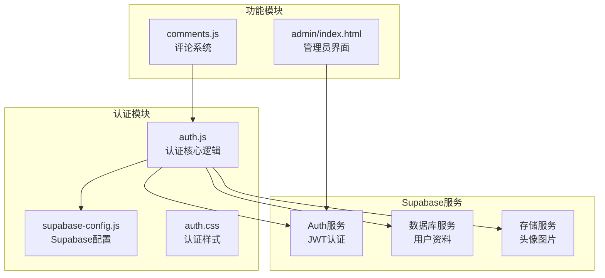
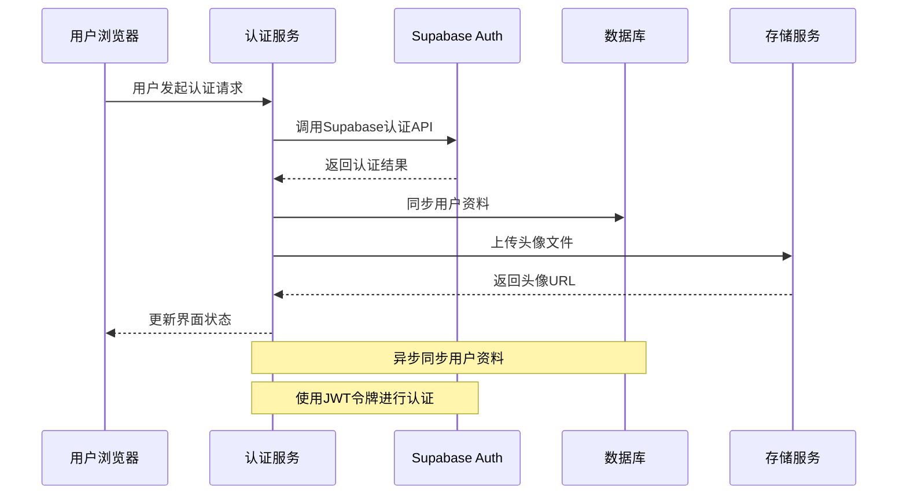
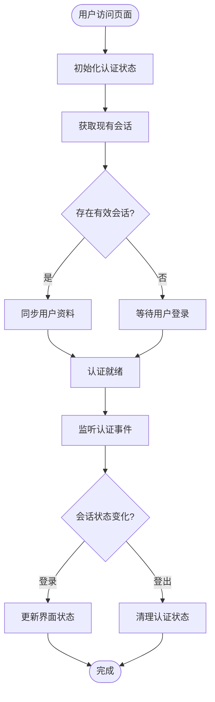
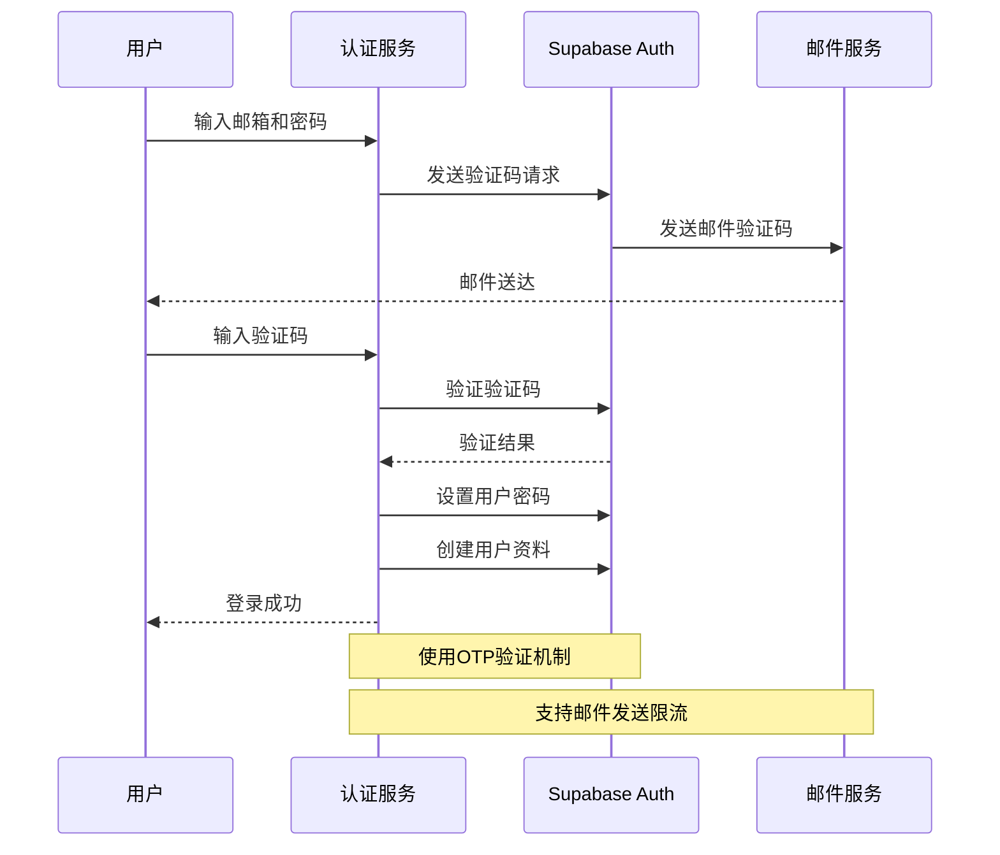
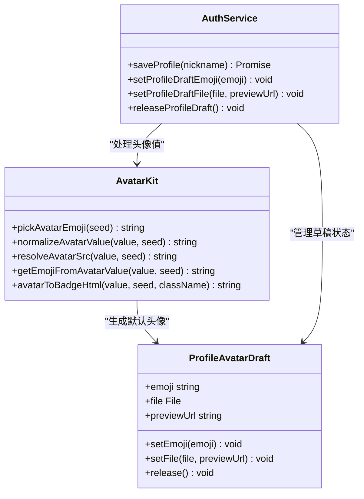
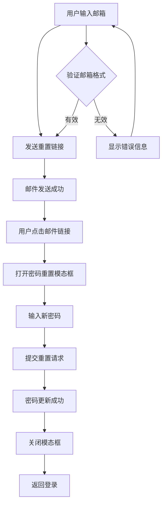
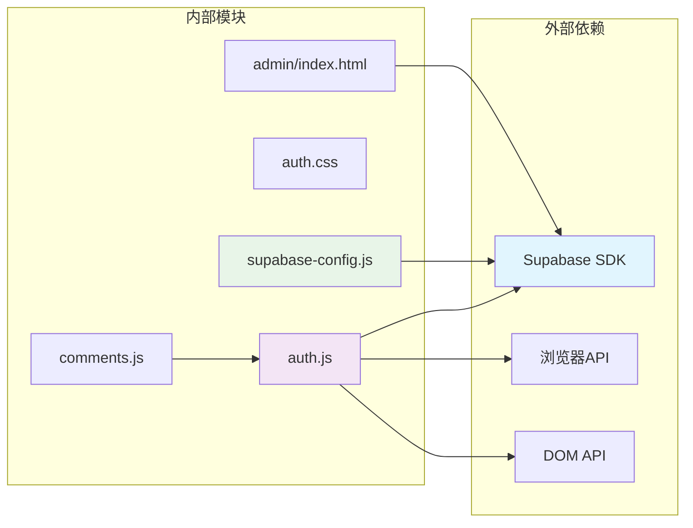

# 认证API

<cite>
**本文档引用的文件**
- [shared/auth.js](file://shared/auth.js)
- [shared/auth.css](file://shared/auth.css)
- [shared/supabase-config.js](file://shared/supabase-config.js)
- [shared/comments.js](file://shared/comments.js)
- [admin/index.html](file://admin/index.html)
</cite>

## 目录
1. [简介](#简介)
2. [项目结构](#项目结构)
3. [核心组件](#核心组件)
4. [架构概览](#架构概览)
5. [详细组件分析](#详细组件分析)
6. [依赖关系分析](#依赖关系分析)
7. [性能考虑](#性能考虑)
8. [故障排除指南](#故障排除指南)
9. [结论](#结论)

## 简介

本项目是一个基于 Supabase Auth 的认证系统，提供了完整的用户注册、登录、登出和账户管理功能。系统支持邮箱验证码登录、头像管理和密码重置等特性，采用 JWT 令牌认证机制确保安全性。

## 项目结构

项目采用模块化设计，主要包含以下核心模块：

**图表来源**
- [shared/auth.js:1-1470](file://shared/auth.js#L1-L1470)
- [shared/supabase-config.js:1-26](file://shared/supabase-config.js#L1-L26)

**章节来源**
- [shared/auth.js:1-1470](file://shared/auth.js#L1-L1470)
- [shared/supabase-config.js:1-26](file://shared/supabase-config.js#L1-L26)

## 核心组件

### 认证服务 (AuthService)

认证服务是整个系统的中枢，负责处理所有认证相关的业务逻辑：

- **用户状态管理**: 维护当前用户会话状态
- **注册流程**: 支持邮箱验证码注册
- **登录流程**: 支持密码登录和验证码登录
- **会话管理**: 处理会话状态变化和持久化
- **资料同步**: 自动同步用户资料到数据库

### 头像管理系统 (AvatarKit)

提供完整的头像处理功能：

- **头像类型支持**: 支持 Emoji、URL 和本地上传三种头像类型
- **头像标准化**: 统一头像格式和存储方式
- **头像预览**: 实时预览头像变更效果
- **兼容性处理**: 自动适配不同数据库字段结构

### 用户界面 (AuthUI)

提供直观的用户界面组件：

- **登录模态框**: 支持登录和注册两种模式
- **个人资料编辑**: 允许用户修改昵称和头像
- **密码重置**: 提供密码重置功能
- **响应式设计**: 适配各种屏幕尺寸

**章节来源**
- [shared/auth.js:419-800](file://shared/auth.js#L419-L800)
- [shared/auth.js:107-113](file://shared/auth.js#L107-L113)

## 架构概览

系统采用分层架构设计，确保各组件职责清晰：

**图表来源**
- [shared/auth.js:948-986](file://shared/auth.js#L948-L986)
- [shared/auth.js:679-692](file://shared/auth.js#L679-L692)

## 详细组件分析

### JWT 令牌认证机制

系统使用 Supabase Auth 的 JWT 令牌进行身份验证：

**图表来源**
- [shared/auth.js:948-986](file://shared/auth.js#L948-L986)

### 邮箱验证码登录流程

验证码登录提供了更安全的注册体验：

**图表来源**
- [shared/auth.js:522-677](file://shared/auth.js#L522-L677)

### 头像管理系统

头像系统支持多种头像类型和智能处理：

**图表来源**
- [shared/auth.js:107-113](file://shared/auth.js#L107-L113)
- [shared/auth.js:484-520](file://shared/auth.js#L484-L520)

**章节来源**
- [shared/auth.js:87-113](file://shared/auth.js#L87-L113)
- [shared/auth.js:484-520](file://shared/auth.js#L484-L520)

### 密码重置流程

密码重置功能确保用户能够安全地恢复账户访问：

**图表来源**
- [shared/auth.js:1219-1440](file://shared/auth.js#L1219-L1440)

**章节来源**
- [shared/auth.js:552-565](file://shared/auth.js#L552-L565)
- [shared/auth.js:1417-1440](file://shared/auth.js#L1417-L1440)

## 依赖关系分析

系统依赖关系清晰，各模块职责明确：

**图表来源**
- [shared/auth.js:35-40](file://shared/auth.js#L35-L40)
- [shared/supabase-config.js:9-25](file://shared/supabase-config.js#L9-L25)

**章节来源**
- [shared/auth.js:35-40](file://shared/auth.js#L35-L40)
- [shared/supabase-config.js:9-25](file://shared/supabase-config.js#L9-L25)

## 性能考虑

### 网络超时处理

系统实现了完善的网络超时处理机制：

- **认证超时**: 12秒超时限制
- **验证码验证**: 20秒超时限制  
- **头像上传**: 12秒超时限制
- **自动重试**: 关键操作支持自动重试

### 缓存策略

- **会话缓存**: 本地缓存用户会话状态
- **头像缓存**: 使用浏览器缓存头像资源
- **配置缓存**: 避免重复初始化 Supabase 客户端

### 错误处理优化

- **渐进式降级**: 即使数据库操作失败，认证功能仍可正常工作
- **用户友好提示**: 将技术错误转换为用户可理解的消息
- **状态恢复**: 自动处理认证状态异常

## 故障排除指南

### 常见问题及解决方案

| 问题类型 | 症状 | 解决方案 |
|---------|------|----------|
| 认证初始化失败 | 控制台显示"认证模块初始化失败" | 检查 Supabase SDK 加载状态 |
| 邮件发送失败 | 注册验证码发送超时 | 检查邮件服务配置和网络连接 |
| 头像上传失败 | 头像保存超时 | 检查存储服务权限和文件大小限制 |
| 会话丢失 | 页面刷新后需要重新登录 | 检查浏览器 Cookie 设置 |

### 调试技巧

1. **启用开发模式**: 在控制台中查看详细的错误信息
2. **检查网络请求**: 使用浏览器开发者工具监控 API 调用
3. **验证配置**: 确认 Supabase URL 和密钥配置正确
4. **测试环境**: 在测试环境中验证认证流程

**章节来源**
- [shared/auth.js:115-147](file://shared/auth.js#L115-L147)
- [shared/auth.js:287-290](file://shared/auth.js#L287-L290)

## 结论

本认证系统提供了完整的用户认证解决方案，具有以下优势：

- **安全性**: 基于 JWT 的标准认证机制，支持多种认证方式
- **易用性**: 直观的用户界面和流畅的用户体验
- **可靠性**: 完善的错误处理和状态管理机制
- **扩展性**: 模块化设计便于功能扩展和维护

系统通过 Supabase Auth 实现了云端认证服务，结合本地状态管理，为用户提供了一致且安全的认证体验。头像管理和密码重置等功能进一步增强了系统的实用性。