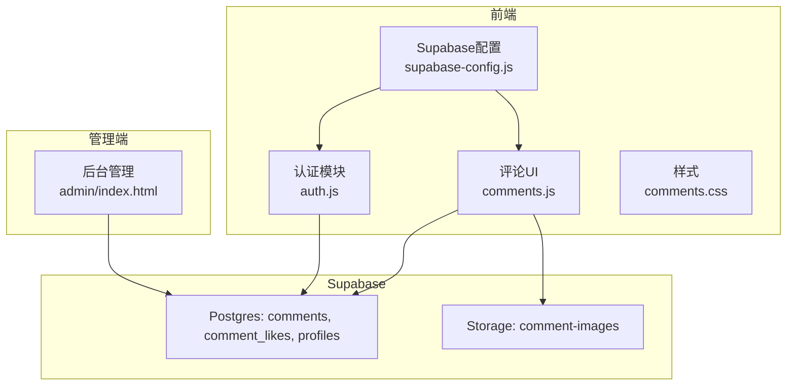
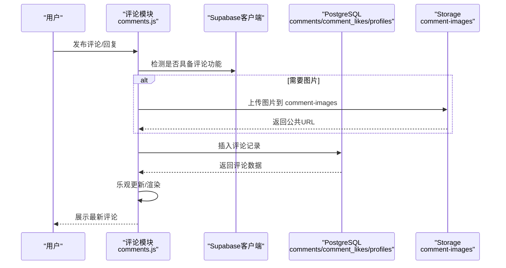
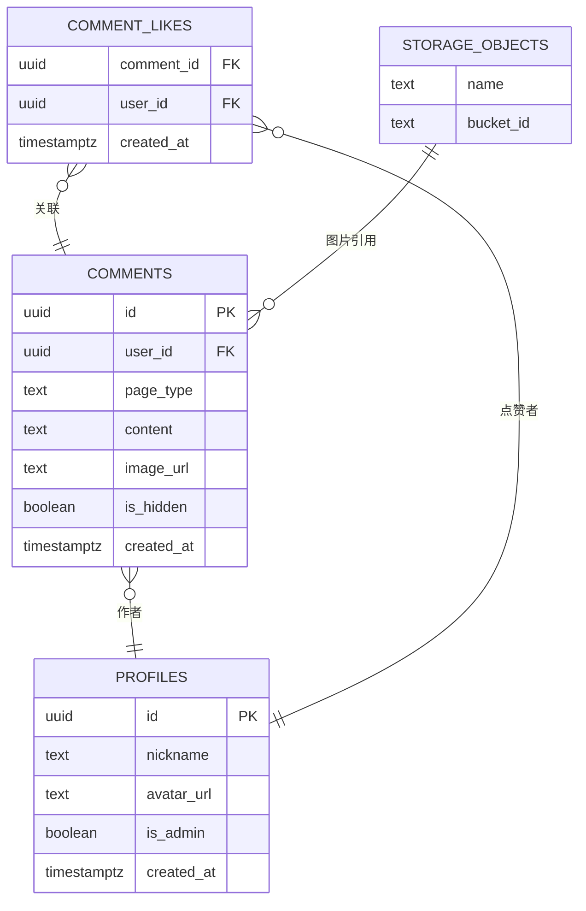
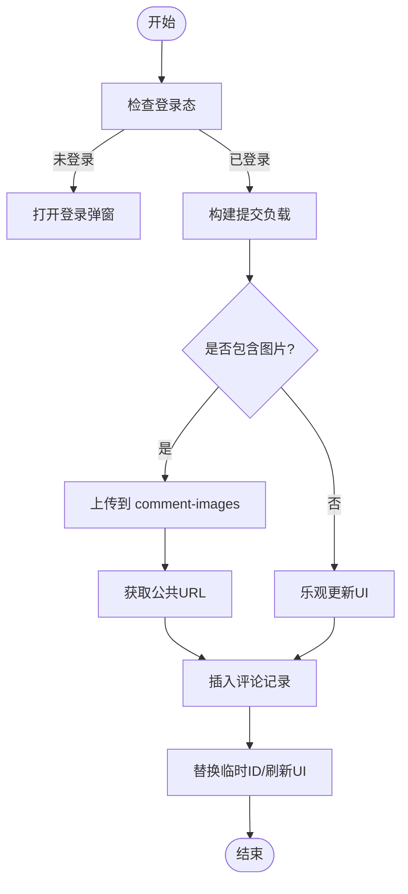
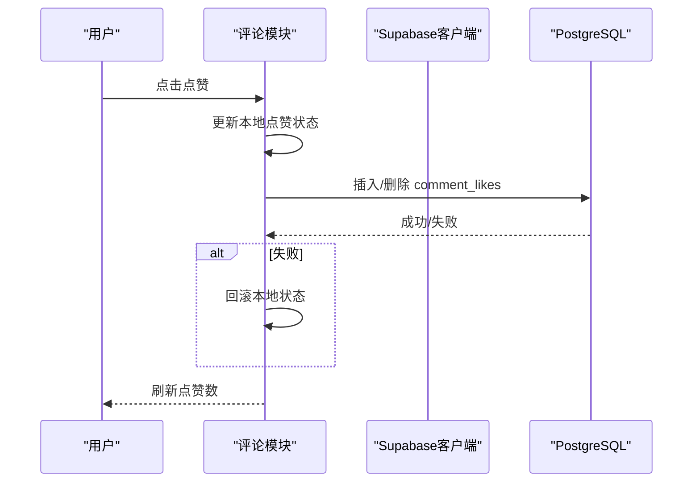
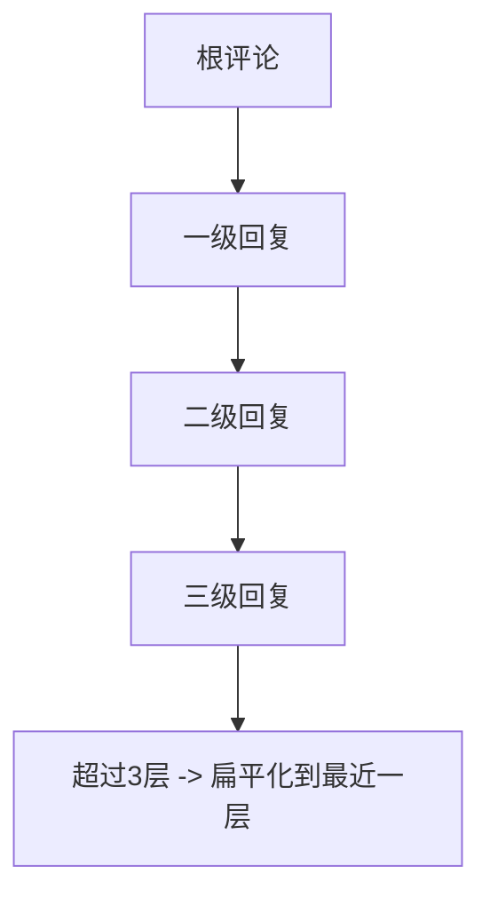
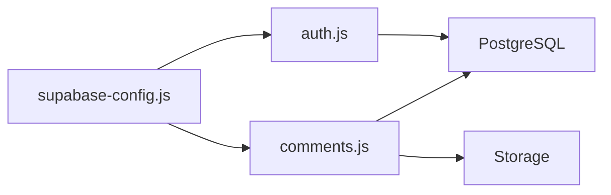

# 评论API

<cite>
**本文档引用的文件**
- [comments.js](file://shared/comments.js)
- [comments.css](file://shared/comments.css)
- [auth.js](file://shared/auth.js)
- [supabase-config.js](file://shared/supabase-config.js)
- [supabase-schema.sql](file://supabase-schema.sql)
- [supabase-community-upgrade.sql](file://supabase-community-upgrade.sql)
- [supabase-repair.sql](file://supabase-repair.sql)
- [admin/index.html](file://admin/index.html)
</cite>

## 目录
1. [简介](#简介)
2. [项目结构](#项目结构)
3. [核心组件](#核心组件)
4. [架构总览](#架构总览)
5. [详细组件分析](#详细组件分析)
6. [依赖关系分析](#依赖关系分析)
7. [性能考虑](#性能考虑)
8. [故障排查指南](#故障排查指南)
9. [结论](#结论)

## 简介
本文件为“评论系统”的完整API与实现文档，覆盖评论发布、编辑、删除、点赞、图片上传、分页查询、嵌套回复、权限控制、实时同步与内容过滤等能力。文档基于仓库中的前端模块与Supabase数据库脚本进行梳理，提供接口规范、数据模型、流程图与最佳实践建议，帮助开发者快速集成与扩展。

## 项目结构
评论系统由以下关键部分组成：
- 前端模块：评论渲染与交互逻辑、样式、认证与头像工具
- 数据库：Supabase Postgres + Storage，含评论表、点赞表、存储桶
- 管理端：后台评论管理界面，支持筛选、隐藏/删除等操作

图表来源
- [comments.js:20-25](file://shared/comments.js#L20-L25)
- [auth.js:35-40](file://shared/auth.js#L35-L40)
- [supabase-config.js:9-25](file://shared/supabase-config.js#L9-L25)
- [supabase-schema.sql:42-87](file://supabase-schema.sql#L42-L87)

章节来源
- [comments.js:208-281](file://shared/comments.js#L208-L281)
- [supabase-schema.sql:42-87](file://supabase-schema.sql#L42-L87)

## 核心组件
- 评论模块（comments.js）：负责评论列表渲染、提交、回复、点赞、删除、图片上传、@提及高亮、嵌套层级计算与展开/折叠、乐观更新与错误处理。
- 认证模块（auth.js）：提供登录态管理、头像解析与生成、用户资料同步、注册/重置密码流程。
- Supabase配置（supabase-config.js）：初始化Supabase客户端，提供统一访问入口。
- 数据库脚本（supabase-schema.sql、supabase-community-upgrade.sql、supabase-repair.sql）：定义评论表、点赞表、存储桶及RLS策略。
- 管理端（admin/index.html）：评论列表、筛选、状态变更与批量操作。

章节来源
- [comments.js:108-206](file://shared/comments.js#L108-L206)
- [auth.js:419-482](file://shared/auth.js#L419-L482)
- [supabase-schema.sql:42-87](file://supabase-schema.sql#L42-L87)

## 架构总览
评论系统采用前后端分离架构，前端通过Supabase JS SDK调用PostgreSQL与Storage服务，实现评论的增删改查、点赞、图片上传与权限控制；管理端通过RLS策略与存储策略实现管理员可见性与操作权限。

图表来源
- [comments.js:511-643](file://shared/comments.js#L511-L643)
- [supabase-schema.sql:83-97](file://supabase-schema.sql#L83-L97)

## 详细组件分析

### 数据模型与表结构
- 评论表（comments）
  - 字段：id、user_id、page_type、content、image_url、is_hidden、created_at
  - 策略：公开读取未隐藏评论；登录用户发表评论；本人删除评论；管理员全部读取/隐藏/删除
- 点赞表（comment_likes）
  - 字段：comment_id、user_id、created_at
  - 策略：公开读取点赞；认证用户可点赞/取消点赞
- 存储桶（comment-images）
  - 策略：登录用户上传；公开读取

图表来源
- [supabase-schema.sql:42-87](file://supabase-schema.sql#L42-L87)
- [supabase-community-upgrade.sql:9-23](file://supabase-community-upgrade.sql#L9-L23)
- [supabase-schema.sql:83-97](file://supabase-schema.sql#L83-L97)

章节来源
- [supabase-schema.sql:42-87](file://supabase-schema.sql#L42-L87)
- [supabase-community-upgrade.sql:9-23](file://supabase-community-upgrade.sql#L9-L23)
- [supabase-repair.sql:94-158](file://supabase-repair.sql#L94-L158)

### 评论发布与图片上传
- 支持文本与图片混合发布，图片上传至Storage桶，返回公共URL写入评论记录。
- 提交前进行乐观更新，若上传图片则延迟替换为真实数据，否则立即替换临时ID。
- 错误处理：schema缺失、权限不足、网络超时等场景提示用户执行SQL升级或重试。

图表来源
- [comments.js:544-643](file://shared/comments.js#L544-L643)
- [supabase-schema.sql:83-97](file://supabase-schema.sql#L83-L97)

章节来源
- [comments.js:544-643](file://shared/comments.js#L544-L643)

### 点赞与取消点赞
- 点击点赞按钮后，前端先更新本地状态，再异步请求后端；取消点赞同理。
- 若点赞表缺失或权限不足，提示执行SQL升级或重新执行升级脚本。

图表来源
- [comments.js:645-688](file://shared/comments.js#L645-L688)
- [supabase-community-upgrade.sql:49-76](file://supabase-community-upgrade.sql#L49-L76)

章节来源
- [comments.js:645-688](file://shared/comments.js#L645-L688)

### 删除评论
- 仅评论作者或管理员可删除；删除时会同时清理其所有回复。
- 删除前进行快照，失败时回滚UI状态。

章节来源
- [comments.js:690-708](file://shared/comments.js#L690-L708)

### 嵌套回复与树形结构
- 支持最多3层嵌套回复；超过3层的回复会被扁平化到最近一层并标记。
- 展开/折叠通过点击“回复数”区域实现，回复列表按时间升序排列。

图表来源
- [comments.js:132-164](file://shared/comments.js#L132-L164)
- [comments.js:388-409](file://shared/comments.js#L388-L409)

章节来源
- [comments.js:132-164](file://shared/comments.js#L132-L164)
- [comments.js:388-409](file://shared/comments.js#L388-L409)

### 分页查询与排序
- 前端默认加载最近120条评论，按创建时间倒序。
- 根评论分页显示，每页固定数量；支持“加载更多”。

章节来源
- [comments.js:309-345](file://shared/comments.js#L309-L345)
- [comments.js:347-386](file://shared/comments.js#L347-L386)

### 实时同步与内容过滤
- 当前实现为前端乐观更新与轮询式加载；未见WebSocket订阅或实时事件监听代码。
- 内容过滤：@提及高亮、图片懒加载、头像emoji回退、空闲状态提示。

章节来源
- [comments.js:499-504](file://shared/comments.js#L499-L504)
- [comments.js:454-456](file://shared/comments.js#L454-L456)

### 管理员审核与举报
- 管理员可通过后台评论管理界面筛选、隐藏/恢复、删除评论。
- 举报流程：当前未见专门的举报API或UI，可在管理端通过隐藏/删除实现内容治理。

章节来源
- [admin/index.html:506-565](file://admin/index.html#L506-L565)

## 依赖关系分析
- comments.js依赖Supabase客户端（从全局或window对象注入），通过from()访问PostgreSQL，通过storage访问Storage。
- auth.js提供头像解析、登录态同步与用户资料更新，供评论模块渲染头像与昵称。
- supabase-config.js提供统一的Supabase实例，确保各模块共享同一客户端。

图表来源
- [supabase-config.js:9-25](file://shared/supabase-config.js#L9-L25)
- [comments.js:20-25](file://shared/comments.js#L20-L25)
- [auth.js:35-40](file://shared/auth.js#L35-L40)

章节来源
- [supabase-config.js:9-25](file://shared/supabase-config.js#L9-L25)
- [comments.js:20-25](file://shared/comments.js#L20-L25)
- [auth.js:35-40](file://shared/auth.js#L35-L40)

## 性能考虑
- 前端渲染优化
  - 乐观更新：无图片时立即渲染，减少等待时间。
  - 本地点赞状态：避免频繁网络往返。
  - 图片懒加载：提升首屏渲染速度。
- 数据库索引
  - 评论表按page_type、parent_comment_id、created_at建立复合索引，有利于分页与排序。
  - 点赞表按comment_id、user_id建立索引，提高查询与去重效率。
- 缓存策略
  - 本地缓存：评论列表、点赞映射、用户头像映射。
  - Storage缓存：图片URL带缓存控制，减少重复下载。
- 并发控制
  - 单次提交按钮禁用，防止重复提交。
  - 登录态变化时统一通知，避免竞态。

章节来源
- [comments.js:183-206](file://shared/comments.js#L183-L206)
- [supabase-community-upgrade.sql:6-7](file://supabase-community-upgrade.sql#L6-L7)
- [supabase-community-upgrade.sql:19-23](file://supabase-community-upgrade.sql#L19-L23)

## 故障排查指南
- 评论功能未启用
  - 现象：提示需执行SQL升级。
  - 排查：确认comments表与RLS策略存在；执行升级脚本。
- 点赞功能异常
  - 现象：提示点赞表缺失或权限不足。
  - 排查：执行社区升级脚本，确保comment_likes表与RLS策略生效。
- 图片上传失败
  - 现象：上传超时或权限不足。
  - 排查：确认Storage策略允许登录用户上传，检查文件大小限制与网络状况。
- 管理端无法加载评论
  - 现象：提示comments表缺失。
  - 排查：执行修复脚本，确保表与策略存在。

章节来源
- [comments.js:47-65](file://shared/comments.js#L47-L65)
- [comments.js:634-638](file://shared/comments.js#L634-L638)
- [supabase-schema.sql:83-97](file://supabase-schema.sql#L83-L97)
- [admin/index.html:514-521](file://admin/index.html#L514-L521)

## 结论
本评论系统以Supabase为核心，结合前端乐观更新与RLS策略，实现了完整的评论生命周期管理。当前版本侧重于前端体验与基础功能，后续可考虑引入实时事件订阅、更完善的举报与审核流程以及更细粒度的权限控制，以进一步提升可维护性与用户体验。