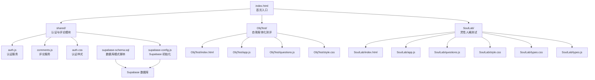
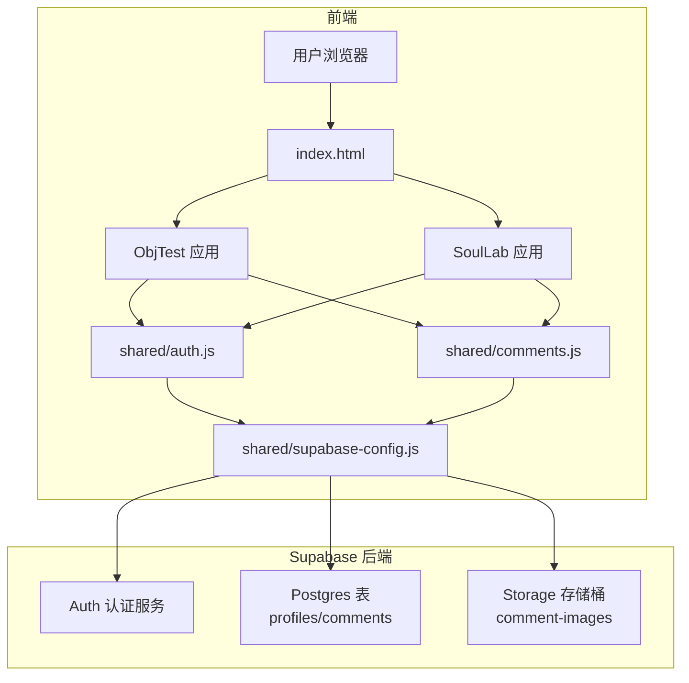
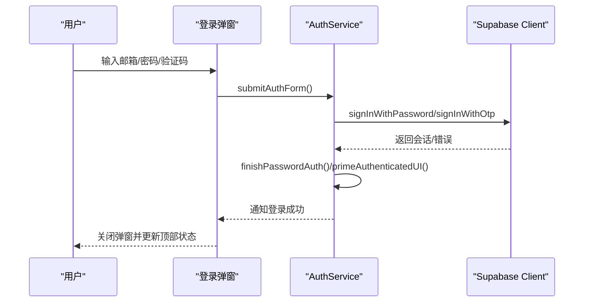
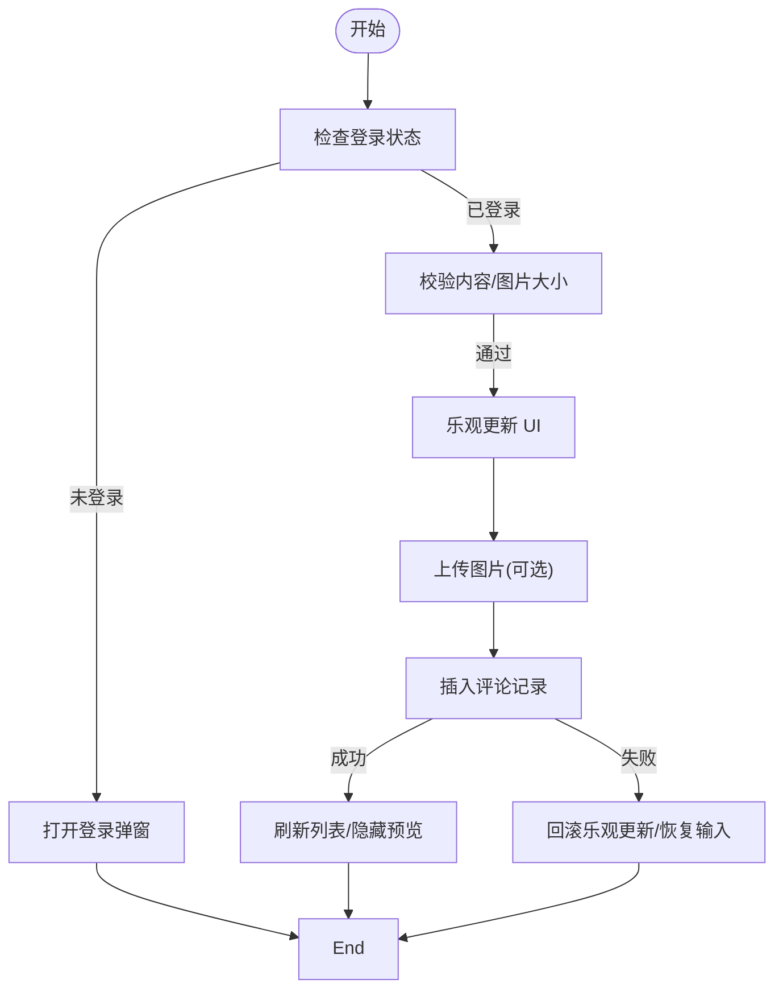
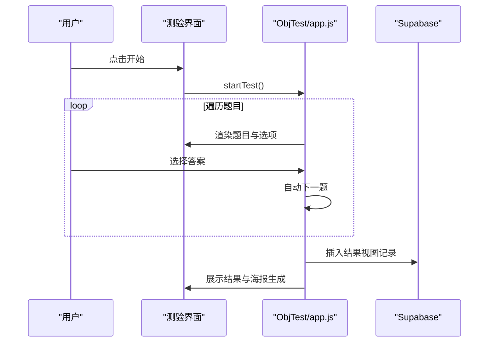
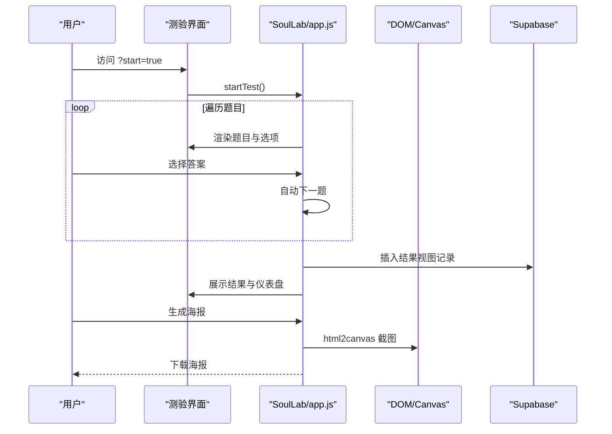
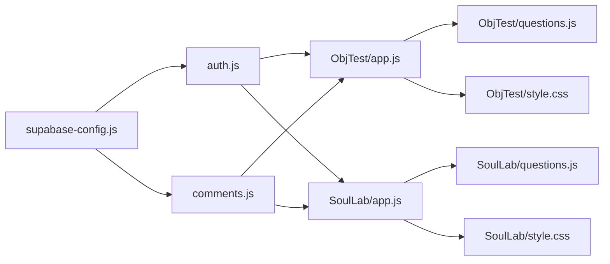

# 开发指南

<cite>
**本文档引用的文件**
- [index.html](file://index.html)
- [supabase-schema.sql](file://supabase-schema.sql)
- [shared/supabase-config.js](file://shared/supabase-config.js)
- [shared/auth.js](file://shared/auth.js)
- [shared/auth.css](file://shared/auth.css)
- [shared/comments.js](file://shared/comments.js)
- [ObjTest/index.html](file://ObjTest/index.html)
- [ObjTest/app.js](file://ObjTest/app.js)
- [ObjTest/questions.js](file://ObjTest/questions.js)
- [ObjTest/style.css](file://ObjTest/style.css)
- [SoulLab/index.html](file://SoulLab/index.html)
- [SoulLab/app.js](file://SoulLab/app.js)
- [SoulLab/questions.js](file://SoulLab/questions.js)
- [SoulLab/style.css](file://SoulLab/style.css)
- [SoulLab/types.css](file://SoulLab/types.css)
- [SoulLab/types.js](file://SoulLab/types.js)
</cite>

## 目录
1. [简介](#简介)
2. [项目结构](#项目结构)
3. [核心组件](#核心组件)
4. [架构概览](#架构概览)
5. [详细组件分析](#详细组件分析)
6. [依赖分析](#依赖分析)
7. [性能考虑](#性能考虑)
8. [故障排查指南](#故障排查指南)
9. [结论](#结论)
10. [附录](#附录)

## 简介
本开发指南面向希望参与“觉醒诗社”项目的开发者，提供从本地环境搭建、代码结构规范、调试技巧，到 Git 工作流程、分支管理策略、代码评审标准、性能优化、安全编码实践与测试策略的完整指引。项目采用前端静态页面与 Supabase 数据库结合的方式，提供用户认证、评论系统与两个在线测评模块。

## 项目结构
项目采用按功能模块划分的目录组织方式：
- 根目录包含首页入口与数据库脚本
- shared 目录存放跨模块共享的认证与评论模块
- ObjTest 与 SoulLab 目录分别提供两个独立的在线测评应用
- admin 目录预留后台管理入口
- Supabase 相关 SQL 脚本位于根目录

图表来源
- [index.html](file://index.html)
- [shared/supabase-config.js](file://shared/supabase-config.js)
- [shared/auth.js](file://shared/auth.js)
- [shared/comments.js](file://shared/comments.js)
- [ObjTest/index.html](file://ObjTest/index.html)
- [ObjTest/app.js](file://ObjTest/app.js)
- [ObjTest/questions.js](file://ObjTest/questions.js)
- [ObjTest/style.css](file://ObjTest/style.css)
- [SoulLab/index.html](file://SoulLab/index.html)
- [SoulLab/app.js](file://SoulLab/app.js)
- [SoulLab/questions.js](file://SoulLab/questions.js)
- [SoulLab/style.css](file://SoulLab/style.css)
- [SoulLab/types.css](file://SoulLab/types.css)
- [SoulLab/types.js](file://SoulLab/types.js)

章节来源
- [index.html](file://index.html)
- [shared/supabase-config.js](file://shared/supabase-config.js)
- [shared/auth.js](file://shared/auth.js)
- [shared/comments.js](file://shared/comments.js)
- [ObjTest/index.html](file://ObjTest/index.html)
- [ObjTest/app.js](file://ObjTest/app.js)
- [ObjTest/questions.js](file://ObjTest/questions.js)
- [ObjTest/style.css](file://ObjTest/style.css)
- [SoulLab/index.html](file://SoulLab/index.html)
- [SoulLab/app.js](file://SoulLab/app.js)
- [SoulLab/questions.js](file://SoulLab/questions.js)
- [SoulLab/style.css](file://SoulLab/style.css)
- [SoulLab/types.css](file://SoulLab/types.css)
- [SoulLab/types.js](file://SoulLab/types.js)

## 核心组件
- Supabase 初始化与全局配置：负责在页面加载时初始化 Supabase 客户端，并暴露统一访问入口供其他模块使用。
- 认证模块（Auth Service）：提供登录/注册、OTP 验证、用户资料更新、头像处理、密码重置等功能；通过模板函数渲染登录弹窗与个人资料编辑界面。
- 评论模块（Comments Service）：负责评论列表加载、点赞、回复、图片上传与展示、提及高亮等；具备对数据库表缺失与权限错误的容错处理。
- 测评模块（ObjTest/SoulLab）：分别提供自我客体化测评与灵性人格测试，包含题目数据、答题逻辑、结果计算与海报生成等。

章节来源
- [shared/supabase-config.js](file://shared/supabase-config.js)
- [shared/auth.js](file://shared/auth.js)
- [shared/comments.js](file://shared/comments.js)
- [ObjTest/app.js](file://ObjTest/app.js)
- [SoulLab/app.js](file://SoulLab/app.js)

## 架构概览
系统采用前端静态页面 + Supabase 后端的架构。认证与评论功能通过 Supabase Auth 与 Postgres 表实现；存储桶用于评论图片上传与公开访问。

图表来源
- [index.html](file://index.html)
- [shared/supabase-config.js](file://shared/supabase-config.js)
- [shared/auth.js](file://shared/auth.js)
- [shared/comments.js](file://shared/comments.js)
- [ObjTest/index.html](file://ObjTest/index.html)
- [SoulLab/index.html](file://SoulLab/index.html)
- [supabase-schema.sql](file://supabase-schema.sql)

## 详细组件分析

### 认证模块（Auth Service）
- 设计要点
  - 使用模板函数生成登录弹窗与个人资料编辑界面，支持切换登录/注册模式与 OTP 发送。
  - 提供头像标准化与 Emoji 头像生成，兼容多种头像存储格式。
  - 通过 withTimeout 包装异步调用，统一超时与错误提示。
  - 订阅机制通知 UI 状态变更，保证登录态与资料同步。
- 关键流程（登录/注册）

图表来源
- [shared/auth.js](file://shared/auth.js)

章节来源
- [shared/auth.js](file://shared/auth.js)
- [shared/auth.css](file://shared/auth.css)

### 评论模块（Comments Service）
- 设计要点
  - 支持评论列表加载、点赞、回复、图片上传与展示；具备对表缺失与权限错误的降级处理。
  - 通过乐观更新提升交互体验，失败时回滚并提示。
  - 对 @提及进行高亮处理，增强可读性。
- 关键流程（提交评论）

图表来源
- [shared/comments.js](file://shared/comments.js)

章节来源
- [shared/comments.js](file://shared/comments.js)

### 测评模块（ObjTest）
- 设计要点
  - 题目数据集中于 questions.js，答题逻辑在 app.js 中实现，结果计算与海报生成在同文件中完成。
  - 支持键盘导航与自动前进，加载页提供进度提示。
  - 通过 Supabase 计数表统计参与人数，支持结果海报下载。
- 关键流程（答题与结果）

图表来源
- [ObjTest/app.js](file://ObjTest/app.js)
- [ObjTest/questions.js](file://ObjTest/questions.js)
- [ObjTest/index.html](file://ObjTest/index.html)

章节来源
- [ObjTest/app.js](file://ObjTest/app.js)
- [ObjTest/questions.js](file://ObjTest/questions.js)
- [ObjTest/index.html](file://ObjTest/index.html)
- [ObjTest/style.css](file://ObjTest/style.css)

### 测评模块（SoulLab）
- 设计要点
  - 题目数据与结果映射在 questions.js 与 results.js 中，app.js 实现答题、加载与结果展示。
  - 支持粒子背景、进度条、结果仪表盘与海报生成，具备跨域图片处理与截图优化。
  - 通过 URL 参数支持自动开始测试。
- 关键流程（答题与海报生成）

图表来源
- [SoulLab/app.js](file://SoulLab/app.js)
- [SoulLab/questions.js](file://SoulLab/questions.js)
- [SoulLab/index.html](file://SoulLab/index.html)
- [SoulLab/style.css](file://SoulLab/style.css)

章节来源
- [SoulLab/app.js](file://SoulLab/app.js)
- [SoulLab/questions.js](file://SoulLab/questions.js)
- [SoulLab/index.html](file://SoulLab/index.html)
- [SoulLab/style.css](file://SoulLab/style.css)
- [SoulLab/types.css](file://SoulLab/types.css)
- [SoulLab/types.js](file://SoulLab/types.js)

## 依赖分析
- Supabase 依赖
  - 通过 shared/supabase-config.js 初始化客户端，供认证与评论模块共享使用。
  - 数据库模式由 supabase-schema.sql 定义，包含 profiles、comments 表与 Storage 桶。
- 模块耦合
  - ObjTest 与 SoulLab 依赖 shared/auth.js 与 shared/comments.js，形成跨模块复用。
  - 两个测评模块各自维护独立的题目数据与样式文件，降低耦合度。
- 外部资源
  - 测评模块通过 CDN 引入 Supabase JS SDK 与 html2canvas，注意网络稳定性与跨域策略。

图表来源
- [shared/supabase-config.js](file://shared/supabase-config.js)
- [shared/auth.js](file://shared/auth.js)
- [shared/comments.js](file://shared/comments.js)
- [ObjTest/app.js](file://ObjTest/app.js)
- [ObjTest/questions.js](file://ObjTest/questions.js)
- [ObjTest/style.css](file://ObjTest/style.css)
- [SoulLab/app.js](file://SoulLab/app.js)
- [SoulLab/questions.js](file://SoulLab/questions.js)
- [SoulLab/style.css](file://SoulLab/style.css)

章节来源
- [shared/supabase-config.js](file://shared/supabase-config.js)
- [shared/auth.js](file://shared/auth.js)
- [shared/comments.js](file://shared/comments.js)
- [ObjTest/app.js](file://ObjTest/app.js)
- [ObjTest/questions.js](file://ObjTest/questions.js)
- [ObjTest/style.css](file://ObjTest/style.css)
- [SoulLab/app.js](file://SoulLab/app.js)
- [SoulLab/questions.js](file://SoulLab/questions.js)
- [SoulLab/style.css](file://SoulLab/style.css)

## 性能考虑
- 图片与资源优化
  - 评论图片上传使用缓存控制与公共访问策略，建议在前端限制最大尺寸并提供预览裁剪。
  - 海报生成使用 html2canvas，建议在低内存设备上降低 scale 并延迟生成。
- 网络请求优化
  - 使用 withTimeout 包装关键请求，避免长时间阻塞 UI。
  - 乐观更新减少等待时间，失败时快速回滚。
- 样式与动画
  - 避免过度使用复杂滤镜与阴影，移动端优先使用 transform 与 opacity 动画。
  - 评论列表分页与懒加载，减少一次性渲染压力。

## 故障排查指南
- Supabase 初始化失败
  - 确认 Supabase URL 与密钥正确，检查 CDN 加载状态。
  - 若出现“SDK 未加载”提示，检查网络与跨域设置。
- 认证相关错误
  - 常见错误包括邮箱格式、密码长度、验证码过期/无效、速率限制等；模块内置错误消息映射，便于定位问题。
  - 锁竞争错误（Lock steal）需重试或提示用户稍后操作。
- 评论功能异常
  - 当提示“表不存在”或“权限不足”，需先执行数据库升级脚本。
  - 图片上传失败检查存储桶策略与文件大小限制。
- 海报生成失败
  - 跨域图片需预加载并转换为 dataURL，若失败则回退到较低 scale。
  - 截图超时或内存不足时，提示用户重试或使用系统截图。

章节来源
- [shared/supabase-config.js](file://shared/supabase-config.js)
- [shared/auth.js](file://shared/auth.js)
- [shared/comments.js](file://shared/comments.js)
- [SoulLab/app.js](file://SoulLab/app.js)

## 结论
本项目通过模块化设计与 Supabase 快速实现认证、评论与测评功能。建议在开发过程中遵循统一的代码风格与错误处理规范，关注性能与安全细节，确保跨模块协作顺畅与用户体验稳定。

## 附录

### 本地开发环境搭建
- 前置条件
  - 现代浏览器与本地 Web 服务器（如 Live Server）
  - Supabase 账户与数据库实例
- 步骤
  1) 在 Supabase Dashboard 中执行数据库模式脚本，创建 profiles、comments 表与 Storage 桶。
  2) 在 shared/supabase-config.js 中配置 Supabase URL 与匿名密钥。
  3) 在浏览器中打开 index.html 启动项目。
  4) 如需评论功能，确保 Storage 策略允许登录用户上传与公开读取。

章节来源
- [supabase-schema.sql](file://supabase-schema.sql)
- [shared/supabase-config.js](file://shared/supabase-config.js)
- [index.html](file://index.html)

### 代码结构规范
- 文件命名与目录
  - 模块化文件按功能命名，如 app.js、questions.js、style.css。
  - 共享模块置于 shared 目录，避免重复代码。
- JavaScript 规范
  - 使用模块化封装（IIFE 或模板对象），避免全局污染。
  - 统一错误处理与超时控制，提供用户友好的提示。
- CSS 规范
  - 使用变量与主题色，确保暗色主题一致性。
  - 为移动端提供响应式适配与触摸交互优化。

章节来源
- [shared/auth.js](file://shared/auth.js)
- [shared/comments.js](file://shared/comments.js)
- [ObjTest/style.css](file://ObjTest/style.css)
- [SoulLab/style.css](file://SoulLab/style.css)

### 调试技巧
- 浏览器开发者工具
  - 使用 Network 面板监控 Supabase 请求与响应状态。
  - 使用 Console 查看错误日志与警告信息。
- 断点与日志
  - 在关键流程（登录、评论提交、海报生成）设置断点，逐步跟踪状态变化。
- 网络与缓存
  - 清除浏览器缓存与 Service Worker，确保脚本与样式为最新版本。

章节来源
- [shared/auth.js](file://shared/auth.js)
- [shared/comments.js](file://shared/comments.js)
- [SoulLab/app.js](file://SoulLab/app.js)

### Git 工作流程与分支管理
- 分支策略
  - main：稳定发布分支
  - develop：集成开发分支
  - feature/*：功能开发分支
  - hotfix/*：紧急修复分支
- 提交规范
  - 使用清晰的提交信息描述变更内容与影响范围
  - 每次提交聚焦单一功能或修复，便于回滚与审查
- 合并与审查
  - Pull Request 必须包含测试说明与风险评估
  - 至少一名同事审查通过后方可合并

### 代码评审标准
- 正确性
  - 功能符合需求文档，边界条件与异常处理完备
- 可读性
  - 命名规范、注释清晰、模块职责单一
- 性能与安全
  - 避免性能瓶颈与安全漏洞（XSS、CSRF、速率限制）
- 兼容性
  - 跨浏览器与跨平台兼容性验证

### 性能优化建议
- 资源加载
  - 使用 CDN 缓存静态资源，合理设置缓存头
  - 图片懒加载与压缩，减少首屏体积
- 交互优化
  - 使用虚拟滚动与分页，避免一次性渲染大量节点
  - 事件节流与防抖，提升滚动与输入体验
- 数据访问
  - 合理使用乐观更新与批量请求，减少网络往返

### 安全编码实践
- 输入验证
  - 对用户输入进行严格校验与转义，防止注入攻击
- 权限控制
  - 使用 Supabase RLS 策略限制数据访问
  - 存储桶策略仅允许授权用户上传与公开读取
- 传输安全
  - 使用 HTTPS 与安全的 Cookie 设置
  - 避免在前端暴露敏感密钥

### 测试策略
- 单元测试
  - 对认证与评论的关键函数编写单元测试，覆盖正常与异常路径
- 集成测试
  - 模拟 Supabase 环境，验证端到端流程（登录、评论、上传）
- 用户验收测试
  - 在多设备与浏览器上验证交互与视觉一致性