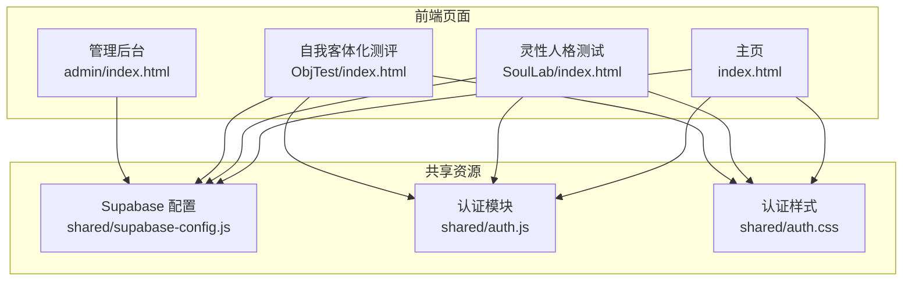
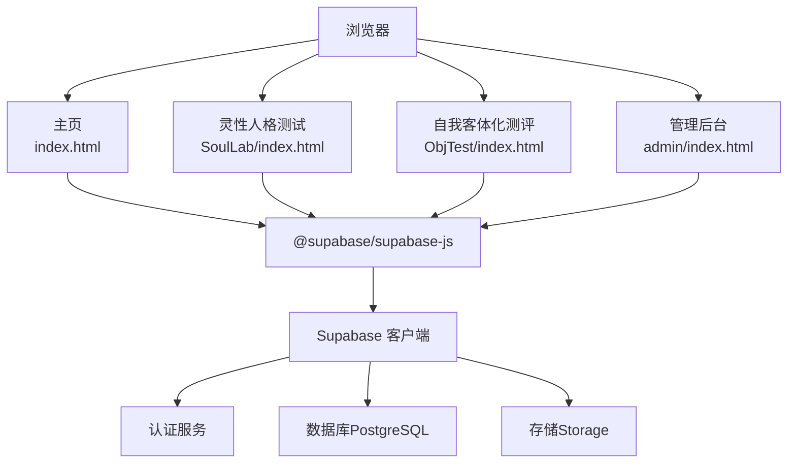
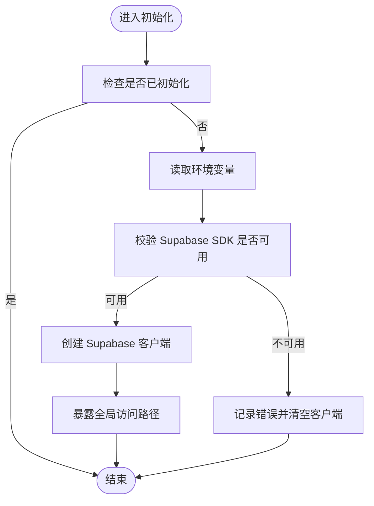
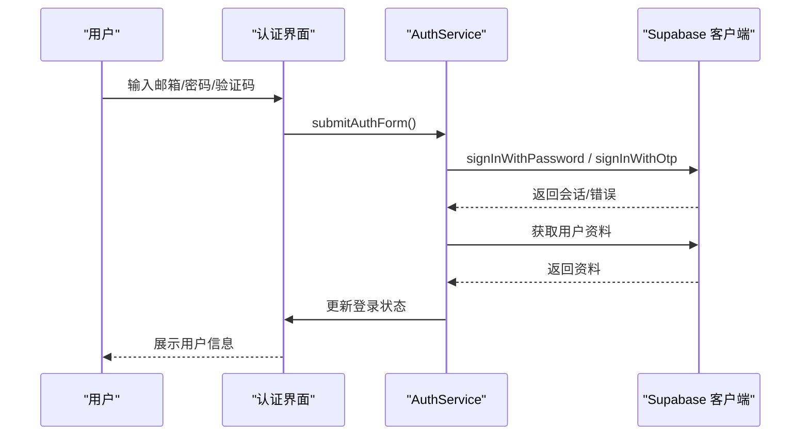
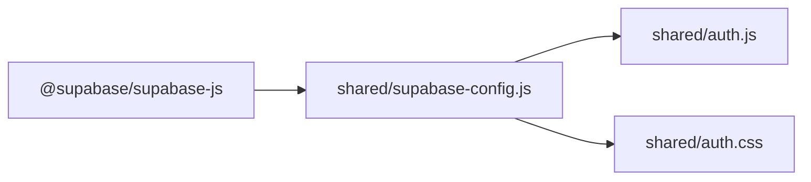

# 快速开始

<cite>
**本文引用的文件**
- [README.md](file://README.md)
- [index.html](file://index.html)
- [shared/supabase-config.js](file://shared/supabase-config.js)
- [shared/auth.js](file://shared/auth.js)
- [shared/auth.css](file://shared/auth.css)
- [SoulLab/index.html](file://SoulLab/index.html)
- [ObjTest/index.html](file://ObjTest/index.html)
- [admin/index.html](file://admin/index.html)
- [supabase-schema.sql](file://supabase-schema.sql)
- [supabase-community-upgrade.sql](file://supabase-community-upgrade.sql)
</cite>

## 目录
1. [简介](#简介)
2. [项目结构](#项目结构)
3. [核心组件](#核心组件)
4. [架构概览](#架构概览)
5. [详细组件分析](#详细组件分析)
6. [依赖分析](#依赖分析)
7. [性能考虑](#性能考虑)
8. [故障排除指南](#故障排除指南)
9. [结论](#结论)
10. [附录](#附录)

## 简介
本指南面向开发者，帮助您快速部署和运行「觉醒诗社」项目。项目包含多个前端模块（主页、灵性人格测试、自我客体化测评、管理后台），以及基于 Supabase 的认证、数据库和存储服务。通过本指南，您将完成环境准备、Supabase 数据库配置、项目依赖安装和本地开发服务器启动，并掌握常见问题的排查方法。

## 项目结构
项目采用多页面静态网站结构，核心模块如下：
- 主页：展示项目介绍与入口，集成登录状态与认证 UI
- 灵性人格测试：33 题人格测评，结果页包含评论区
- 自我客体化测评：40 题测评，结果页包含评论区
- 管理后台：评论与用户管理，支持隐藏/删除评论、设置管理员等

图表来源
- [index.html:1-1171](file://index.html#L1-L1171)
- [SoulLab/index.html:1-271](file://SoulLab/index.html#L1-L271)
- [ObjTest/index.html:1-170](file://ObjTest/index.html#L1-L170)
- [admin/index.html:1-688](file://admin/index.html#L1-L688)
- [shared/supabase-config.js:1-26](file://shared/supabase-config.js#L1-L26)
- [shared/auth.js:1-1470](file://shared/auth.js#L1-L1470)
- [shared/auth.css:1-462](file://shared/auth.css#L1-L462)

章节来源
- [README.md:1-26](file://README.md#L1-L26)
- [index.html:1-1171](file://index.html#L1-L1171)
- [SoulLab/index.html:1-271](file://SoulLab/index.html#L1-L271)
- [ObjTest/index.html:1-170](file://ObjTest/index.html#L1-L170)
- [admin/index.html:1-688](file://admin/index.html#L1-L688)

## 核心组件
- Supabase 配置：集中初始化 Supabase 客户端，提供全局访问路径
- 认证模块：登录/注册、用户状态管理、头像处理、密码重置等
- 认证样式：登录弹窗、用户信息展示、资料编辑等 UI 样式
- 页面入口：主页、测试页、结果页均复用认证与 Supabase 配置

章节来源
- [shared/supabase-config.js:1-26](file://shared/supabase-config.js#L1-L26)
- [shared/auth.js:1-1470](file://shared/auth.js#L1-L1470)
- [shared/auth.css:1-462](file://shared/auth.css#L1-L462)
- [index.html:1-1171](file://index.html#L1-L1171)
- [SoulLab/index.html:1-271](file://SoulLab/index.html#L1-L271)
- [ObjTest/index.html:1-170](file://ObjTest/index.html#L1-L170)

## 架构概览
项目前端通过 Supabase JS SDK 与后端服务通信，认证与数据访问统一由 Supabase 提供。页面通过共享模块实现一致的登录体验与数据交互。

图表来源
- [index.html:1-1171](file://index.html#L1-L1171)
- [SoulLab/index.html:1-271](file://SoulLab/index.html#L1-L271)
- [ObjTest/index.html:1-170](file://ObjTest/index.html#L1-L170)
- [admin/index.html:1-688](file://admin/index.html#L1-L688)
- [shared/supabase-config.js:1-26](file://shared/supabase-config.js#L1-L26)

## 详细组件分析

### Supabase 配置组件
- 初始化逻辑：确保仅初始化一次，避免重复创建客户端
- SDK 校验：检测 Supabase SDK 是否可用，否则记录错误
- 全局访问：提供 window.supabaseClient 与 window.db 两种访问方式

图表来源
- [shared/supabase-config.js:1-26](file://shared/supabase-config.js#L1-L26)

章节来源
- [shared/supabase-config.js:1-26](file://shared/supabase-config.js#L1-L26)

### 认证模块组件
- 用户状态：维护当前用户与资料，支持订阅监听
- 登录/注册：支持邮箱验证码登录与密码登录
- 资料编辑：支持头像 Emoji 选择与图片上传，头像值标准化
- 错误处理：对常见错误进行友好提示与超时控制

图表来源
- [shared/auth.js:567-677](file://shared/auth.js#L567-L677)

章节来源
- [shared/auth.js:1-1470](file://shared/auth.js#L1-L1470)

### 页面入口组件
- 主页：集成登录状态栏、欢迎动画与导航
- 测试页：包含开始页、答题页、加载页与结果页
- 结果页：展示测评结果、生成分享海报、嵌入评论区

章节来源
- [index.html:1-1171](file://index.html#L1-L1171)
- [SoulLab/index.html:1-271](file://SoulLab/index.html#L1-L271)
- [ObjTest/index.html:1-170](file://ObjTest/index.html#L1-L170)

## 依赖分析
- 前端依赖：@supabase/supabase-js（CDN 引入）
- 共享模块：supabase-config.js、auth.js、auth.css
- 页面依赖：各页面 HTML 文件引入共享模块与 Supabase 配置

图表来源
- [SoulLab/index.html:249-255](file://SoulLab/index.html#L249-L255)
- [ObjTest/index.html:160-166](file://ObjTest/index.html#L160-L166)
- [index.html:1-1171](file://index.html#L1-L1171)
- [shared/supabase-config.js:1-26](file://shared/supabase-config.js#L1-L26)
- [shared/auth.js:1-1470](file://shared/auth.js#L1-L1470)
- [shared/auth.css:1-462](file://shared/auth.css#L1-L462)

章节来源
- [SoulLab/index.html:1-271](file://SoulLab/index.html#L1-L271)
- [ObjTest/index.html:1-170](file://ObjTest/index.html#L1-L170)
- [index.html:1-1171](file://index.html#L1-L1171)

## 性能考虑
- 资源加载：合理使用 preload 与懒加载，减少首屏阻塞
- 动画优化：CSS 动画与 GPU 加速结合，提升流畅度
- 网络请求：对认证与数据请求设置超时与重试策略
- 存储上传：限制图片尺寸与格式，使用 CDN 缓存

## 故障排除指南
- Supabase SDK 未加载
  - 现象：控制台提示 SDK 未加载
  - 处理：检查 CDN 链接可用性，确认网络环境
  - 参考：[shared/supabase-config.js:12-17](file://shared/supabase-config.js#L12-L17)
- 登录失败
  - 现象：邮箱或密码错误、验证码无效、超时
  - 处理：检查邮箱格式、验证码时效、网络状态；查看错误提示
  - 参考：[shared/auth.js:115-147](file://shared/auth.js#L115-L147)
- 评论功能异常
  - 现象：评论列表为空或无法提交
  - 处理：确认数据库表存在与策略配置；检查 Storage 权限
  - 参考：[supabase-schema.sql:42-81](file://supabase-schema.sql#L42-L81)
- 管理后台权限不足
  - 现象：登录后提示非管理员
  - 处理：确认用户资料中 is_admin 字段或 app_metadata 标记
  - 参考：[admin/index.html:351-357](file://admin/index.html#L351-L357)

章节来源
- [shared/supabase-config.js:1-26](file://shared/supabase-config.js#L1-L26)
- [shared/auth.js:115-147](file://shared/auth.js#L115-L147)
- [supabase-schema.sql:1-97](file://supabase-schema.sql#L1-L97)
- [admin/index.html:351-357](file://admin/index.html#L351-L357)

## 结论
通过本指南，您可以完成从环境准备到本地运行的全流程部署。项目以 Supabase 为核心，结合共享认证模块与页面入口，形成统一的用户体验。遇到问题时，可依据故障排除指南快速定位并解决。

## 附录

### 环境准备与本地开发
- 系统要求：现代浏览器（Chrome/Firefox/Edge）
- 本地服务器：使用任意静态文件服务器（如 http-server、Live Server 等）
- 启动步骤：
  1) 在项目根目录启动本地服务器
  2) 在浏览器打开主页 [index.html:1-1171](file://index.html#L1-L1171)
  3) 使用登录弹窗进行认证体验

### Supabase 数据库配置
- 数据库模式导入
  - 在 Supabase 控制台的 SQL Editor 中运行以下脚本：
    - [supabase-schema.sql:1-97](file://supabase-schema.sql#L1-L97)
    - [supabase-community-upgrade.sql:1-77](file://supabase-community-upgrade.sql#L1-L77)
- 认证配置
  - 启用 Email/Password 与 Otp 登录方式
  - 配置邮箱模板（如需）
- 存储桶设置
  - 创建名为 comment-images 的公开存储桶
  - 配置上传与读取策略

### 在线预览与演示
- 在线预览地址：https://qingye520.xyz/
- 在线文档与知识库：https://ncnra455tpou.feishu.cn/wiki/R4y5wdFngiviwWkz1uQcYSDInmh
- 在线赏雪：https://qingye520.xyz/Snow/

章节来源
- [README.md:1-26](file://README.md#L1-L26)
- [supabase-schema.sql:1-97](file://supabase-schema.sql#L1-L97)
- [supabase-community-upgrade.sql:1-77](file://supabase-community-upgrade.sql#L1-L77)