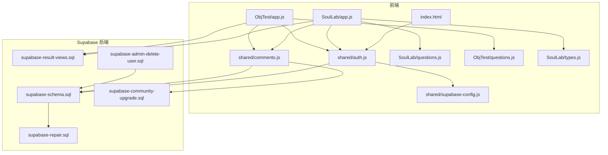
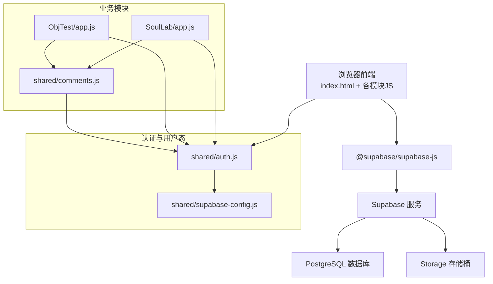
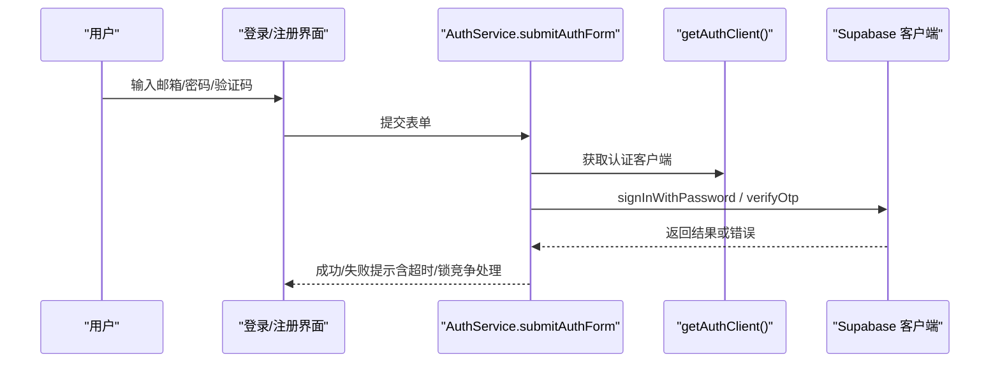
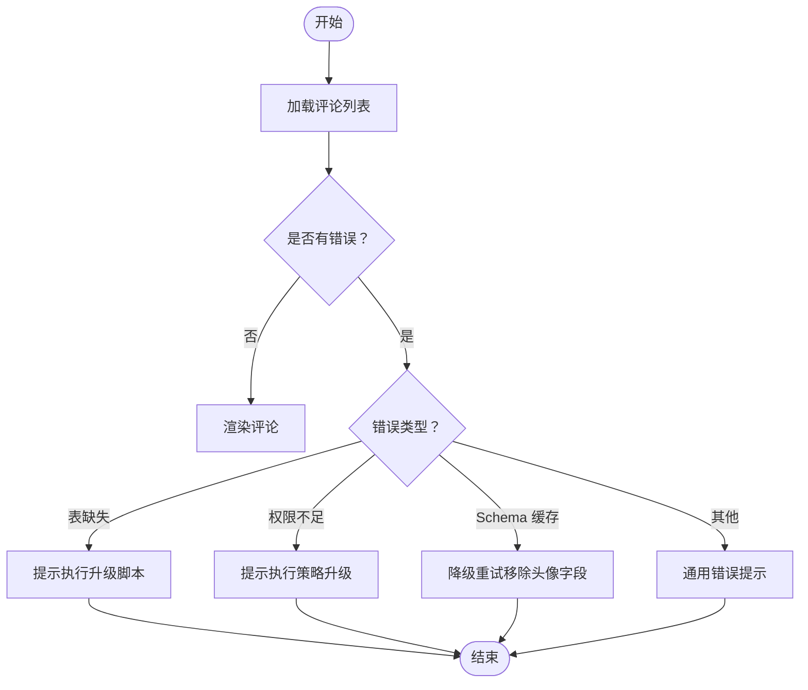
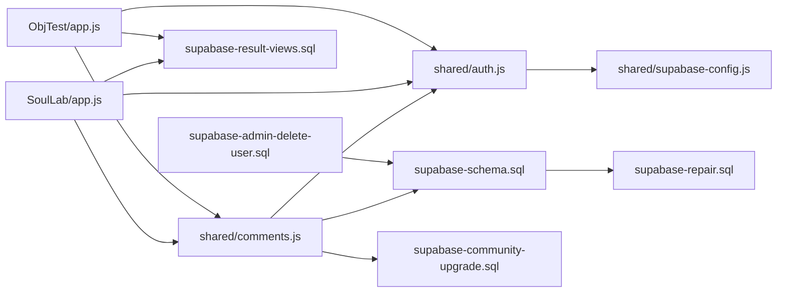

# 故障排除

<cite>
**本文引用的文件**
- [shared/auth.js](file://shared/auth.js)
- [shared/supabase-config.js](file://shared/supabase-config.js)
- [shared/comments.js](file://shared/comments.js)
- [SoulLab/app.js](file://SoulLab/app.js)
- [ObjTest/app.js](file://ObjTest/app.js)
- [supabase-schema.sql](file://supabase-schema.sql)
- [supabase-result-views.sql](file://supabase-result-views.sql)
- [supabase-community-upgrade.sql](file://supabase-community-upgrade.sql)
- [supabase-repair.sql](file://supabase-repair.sql)
- [supabase-admin-delete-user.sql](file://supabase-admin-delete-user.sql)
- [SoulLab/questions.js](file://SoulLab/questions.js)
- [ObjTest/questions.js](file://ObjTest/questions.js)
- [SoulLab/types.js](file://SoulLab/types.js)
- [index.html](file://index.html)
</cite>

## 目录
1. [简介](#简介)
2. [项目结构](#项目结构)
3. [核心组件](#核心组件)
4. [架构总览](#架构总览)
5. [详细组件分析](#详细组件分析)
6. [依赖分析](#依赖分析)
7. [性能考量](#性能考量)
8. [故障排除指南](#故障排除指南)
9. [结论](#结论)
10. [附录](#附录)

## 简介
本故障排除文档聚焦于认证失败、数据库连接异常、API 调用错误与性能问题等常见场景，结合代码库中的实际实现，提供系统化的诊断方法、日志分析技巧、问题定位策略、错误代码参考、调试工具使用与监控指标解读，并给出紧急情况处理预案与系统恢复方案。读者可依据本文快速定位并解决问题。

## 项目结构
该项目采用前端静态页面 + Supabase 后端的架构，核心模块包括：
- 认证与用户态管理：shared/auth.js、shared/supabase-config.js
- 评论系统：shared/comments.js
- 两个测试应用：SoulLab/app.js、ObjTest/app.js
- 数据库模式与升级脚本：supabase-schema.sql、supabase-result-views.sql、supabase-community-upgrade.sql、supabase-repair.sql、supabase-admin-delete-user.sql
- 测试题目数据：SoulLab/questions.js、ObjTest/questions.js
- 类型详情页：SoulLab/types.js
- 入口页面：index.html

图表来源
- [index.html](file://index.html)
- [shared/auth.js](file://shared/auth.js)
- [shared/supabase-config.js](file://shared/supabase-config.js)
- [shared/comments.js](file://shared/comments.js)
- [SoulLab/app.js](file://SoulLab/app.js)
- [ObjTest/app.js](file://ObjTest/app.js)
- [SoulLab/questions.js](file://SoulLab/questions.js)
- [ObjTest/questions.js](file://ObjTest/questions.js)
- [SoulLab/types.js](file://SoulLab/types.js)
- [supabase-schema.sql](file://supabase-schema.sql)
- [supabase-result-views.sql](file://supabase-result-views.sql)
- [supabase-community-upgrade.sql](file://supabase-community-upgrade.sql)
- [supabase-repair.sql](file://supabase-repair.sql)
- [supabase-admin-delete-user.sql](file://supabase-admin-delete-user.sql)

章节来源
- [index.html](file://index.html)
- [shared/auth.js](file://shared/auth.js)
- [shared/supabase-config.js](file://shared/supabase-config.js)
- [shared/comments.js](file://shared/comments.js)
- [SoulLab/app.js](file://SoulLab/app.js)
- [ObjTest/app.js](file://ObjTest/app.js)
- [supabase-schema.sql](file://supabase-schema.sql)
- [supabase-result-views.sql](file://supabase-result-views.sql)
- [supabase-community-upgrade.sql](file://supabase-community-upgrade.sql)
- [supabase-repair.sql](file://supabase-repair.sql)
- [supabase-admin-delete-user.sql](file://supabase-admin-delete-user.sql)

## 核心组件
- 认证模块：负责登录/注册、OTP 验证、密码重置、用户资料同步、头像处理、超时与错误消息本地化。
- Supabase 配置：统一初始化客户端，兼容旧版访问路径，提供全局可用的 db/supabaseClient。
- 评论模块：加载/提交/点赞/删除评论，处理头像渲染、@提及高亮、乐观更新与错误分支。
- 测试应用：SoulLab 与 ObjTest 的问答流程、结果页、参与人数统计、海报生成等。
- 数据库脚本：模式定义、策略、索引、存储桶与升级修复脚本。

章节来源
- [shared/auth.js](file://shared/auth.js)
- [shared/supabase-config.js](file://shared/supabase-config.js)
- [shared/comments.js](file://shared/comments.js)
- [SoulLab/app.js](file://SoulLab/app.js)
- [ObjTest/app.js](file://ObjTest/app.js)
- [supabase-schema.sql](file://supabase-schema.sql)
- [supabase-result-views.sql](file://supabase-result-views.sql)
- [supabase-community-upgrade.sql](file://supabase-community-upgrade.sql)
- [supabase-repair.sql](file://supabase-repair.sql)
- [supabase-admin-delete-user.sql](file://supabase-admin-delete-user.sql)

## 架构总览
前端通过 Supabase JS SDK 与后端交互，认证与业务数据分离，评论与结果统计分别使用不同的表与策略。升级脚本确保数据库结构与策略一致，修复脚本用于生产环境补丁。

图表来源
- [shared/auth.js](file://shared/auth.js)
- [shared/supabase-config.js](file://shared/supabase-config.js)
- [shared/comments.js](file://shared/comments.js)
- [SoulLab/app.js](file://SoulLab/app.js)
- [ObjTest/app.js](file://ObjTest/app.js)

## 详细组件分析

### 认证模块（shared/auth.js）
- 关键职责
  - 提供登录/注册、OTP 发送与验证、密码重置、登出、用户资料保存与同步。
  - 统一错误消息本地化与超时控制。
  - 头像字段兼容与缓存字段解析。
- 诊断要点
  - 认证初始化失败：检查 Supabase SDK 是否加载、URL/密钥是否正确、全局客户端是否可用。
  - OTP/验证码超时：检查网络与服务端超时阈值。
  - 锁竞争错误：处理“另一个请求抢占”类错误，避免重复提交。
  - 资料同步失败：区分本地与远端错误，必要时降级重试。
- 常见错误与提示
  - “认证模块初始化失败，请刷新页面后重试”
  - “发送验证码超时/登录超时/设置密码超时/保存资料超时”
  - “验证码无效/验证码已过期/未开启邮箱验证码登录”
  - “邮箱或密码错误/邮箱未验证/站点暂未开放注册/站点认证配置异常”
  - “密码强度不足/密码长度不足”
  - “用户已注册/该邮箱已注册”

图表来源
- [shared/auth.js](file://shared/auth.js)

章节来源
- [shared/auth.js](file://shared/auth.js)

### Supabase 配置（shared/supabase-config.js）
- 关键职责
  - 初始化 Supabase 客户端，提供 window.supabaseClient 与 window.db 兼容访问。
  - 若 SDK 未加载，记录错误并置空客户端。
- 诊断要点
  - CDN 加载失败：检查 @supabase/supabase-js 是否可用。
  - URL/密钥错误：核对环境变量与配置常量。
  - 多实例冲突：确保仅初始化一次。

章节来源
- [shared/supabase-config.js](file://shared/supabase-config.js)

### 评论模块（shared/comments.js）
- 关键职责
  - 加载评论、用户资料映射、点赞状态；支持回复、@提及高亮、图片上传与乐观更新。
  - 错误分支：表缺失、策略缺失、权限不足、Schema 缓存不一致。
- 诊断要点
  - 表缺失：检查 supabase-community-upgrade.sql 是否执行。
  - 权限不足：检查 comment_likes 策略与授权角色。
  - Schema 缓存：当出现列不在缓存中时，触发降级重试。
  - 上传失败：检查 Storage 策略与 Bucket 名称。

图表来源
- [shared/comments.js](file://shared/comments.js)
- [supabase-community-upgrade.sql](file://supabase-community-upgrade.sql)

章节来源
- [shared/comments.js](file://shared/comments.js)
- [supabase-community-upgrade.sql](file://supabase-community-upgrade.sql)

### SoulLab 应用（SoulLab/app.js）
- 关键职责
  - 问答流程、进度与结果页、参与人数统计、结果浏览计数、海报生成。
  - 使用 getAppSupabaseClient() 获取客户端，兼容多访问路径。
- 诊断要点
  - 参与人数统计：优先查询 result_views，若失败回退 comments 表。
  - 结果浏览计数：插入失败时记录日志并继续。
  - 海报生成：html2canvas 跨域与图片加载失败时的降级处理。

章节来源
- [SoulLab/app.js](file://SoulLab/app.js)
- [supabase-result-views.sql](file://supabase-result-views.sql)

### ObjTest 应用（ObjTest/app.js）
- 关键职责
  - 问答流程、分数计算、结果页、参与人数统计、海报保存。
- 诊断要点
  - 与 SoulLab 类似，使用 getAppSupabaseClient() 并回退逻辑。

章节来源
- [ObjTest/app.js](file://ObjTest/app.js)
- [supabase-result-views.sql](file://supabase-result-views.sql)

### 数据库模式与升级（supabase-schema.sql、supabase-result-views.sql、supabase-community-upgrade.sql、supabase-repair.sql、supabase-admin-delete-user.sql）
- 关键职责
  - 定义 profiles、comments、result_views 表与策略。
  - 为评论系统增加回复字段、点赞表与索引。
  - 生产修复补丁与管理员删除用户函数。
- 诊断要点
  - 策略缺失：执行相应策略创建片段。
  - 索引缺失：执行索引创建语句。
  - 存储桶缺失：确认 comment-images Bucket 已创建。
  - 管理员删除：确保调用者具备管理员权限。

章节来源
- [supabase-schema.sql](file://supabase-schema.sql)
- [supabase-result-views.sql](file://supabase-result-views.sql)
- [supabase-community-upgrade.sql](file://supabase-community-upgrade.sql)
- [supabase-repair.sql](file://supabase-repair.sql)
- [supabase-admin-delete-user.sql](file://supabase-admin-delete-user.sql)

## 依赖分析
- 认证依赖 Supabase 配置与 SDK，需保证 CDN 正常与密钥有效。
- 评论依赖数据库表与策略、Storage 策略与 Bucket。
- 测试应用依赖 Supabase 客户端与结果浏览计数表。
- 升级脚本之间存在依赖关系：先执行基础模式，再执行社区升级，最后执行修复补丁。

图表来源
- [shared/auth.js](file://shared/auth.js)
- [shared/supabase-config.js](file://shared/supabase-config.js)
- [shared/comments.js](file://shared/comments.js)
- [SoulLab/app.js](file://SoulLab/app.js)
- [ObjTest/app.js](file://ObjTest/app.js)
- [supabase-schema.sql](file://supabase-schema.sql)
- [supabase-result-views.sql](file://supabase-result-views.sql)
- [supabase-community-upgrade.sql](file://supabase-community-upgrade.sql)
- [supabase-repair.sql](file://supabase-repair.sql)
- [supabase-admin-delete-user.sql](file://supabase-admin-delete-user.sql)

章节来源
- [shared/auth.js](file://shared/auth.js)
- [shared/supabase-config.js](file://shared/supabase-config.js)
- [shared/comments.js](file://shared/comments.js)
- [SoulLab/app.js](file://SoulLab/app.js)
- [ObjTest/app.js](file://ObjTest/app.js)
- [supabase-schema.sql](file://supabase-schema.sql)
- [supabase-result-views.sql](file://supabase-result-views.sql)
- [supabase-community-upgrade.sql](file://supabase-community-upgrade.sql)
- [supabase-repair.sql](file://supabase-repair.sql)
- [supabase-admin-delete-user.sql](file://supabase-admin-delete-user.sql)

## 性能考量
- 网络超时与重试
  - 认证与资料同步使用 withTimeout 包裹，建议在前端增加重试与退避策略。
- 图片与海报生成
  - html2canvas 跨域与大图加载失败时，采用降级与提示策略。
- 查询优化
  - 评论与结果浏览计数表已建立索引，确保高频查询性能。
- 存储策略
  - Storage Bucket 与策略已配置，注意缓存控制与上传并发。

[本节为通用指导，无需特定文件引用]

## 故障排除指南

### 一、认证失败
- 症状
  - 登录/注册失败、验证码发送失败、密码重置失败、退出登录超时。
- 诊断步骤
  1) 检查 Supabase SDK 是否加载（CDN 可用性）。
  2) 核对 URL 与密钥配置。
  3) 查看网络超时与错误消息本地化提示。
  4) 检查邮箱验证状态与站点注册策略。
  5) 处理锁竞争与重复提交。
- 常见错误与处理
  - “认证模块初始化失败”：刷新页面，确认 SDK 加载。
  - “发送验证码超时/登录超时/设置密码超时/保存资料超时”：检查网络与服务端超时阈值。
  - “验证码无效/已过期/未开启邮箱验证码登录”：重新获取验证码或开启验证码登录。
  - “邮箱或密码错误/邮箱未验证/站点暂未开放注册/站点认证配置异常”：修正凭据或联系管理员。
  - “密码强度不足/长度不足”：提升密码复杂度。
  - “用户已注册/该邮箱已注册”：直接登录。
- 相关实现参考
  - [shared/auth.js](file://shared/auth.js)

章节来源
- [shared/auth.js](file://shared/auth.js)
- [shared/supabase-config.js](file://shared/supabase-config.js)

### 二、数据库连接异常
- 症状
  - 评论加载失败、点赞失败、资料同步失败、表缺失、策略缺失。
- 诊断步骤
  1) 确认 Supabase 服务可用与网络可达。
  2) 检查数据库策略与索引是否完整。
  3) 核对 Storage Bucket 与策略。
  4) 对照升级脚本逐项执行。
- 常见错误与处理
  - “Could not find the table 'public.comments' / PGRST205”：执行社区升级脚本。
  - “permission denied/new row violates row-level security policy”：执行策略升级脚本。
  - “column of 'comments' in the schema cache / PGRST204”：触发降级重试（移除头像字段）。
  - “Could not find the table 'public.comment_likes'”：执行社区升级脚本。
- 相关实现参考
  - [shared/comments.js](file://shared/comments.js)
  - [supabase-community-upgrade.sql](file://supabase-community-upgrade.sql)
  - [supabase-schema.sql](file://supabase-schema.sql)

章节来源
- [shared/comments.js](file://shared/comments.js)
- [supabase-community-upgrade.sql](file://supabase-community-upgrade.sql)
- [supabase-schema.sql](file://supabase-schema.sql)

### 三、API 调用错误
- 症状
  - 插入/更新/删除失败、查询返回错误对象、跨域图片加载失败。
- 诊断步骤
  1) 检查请求参数与权限（RLS 策略）。
  2) 核对表结构与字段类型。
  3) 处理乐观更新与回滚。
- 常见错误与处理
  - 插入评论失败：检查内容长度、图片大小与上传策略。
  - 点赞失败：检查点赞表是否存在与权限策略。
  - 删除评论失败：确认拥有者权限。
- 相关实现参考
  - [shared/comments.js](file://shared/comments.js)
  - [supabase-community-upgrade.sql](file://supabase-community-upgrade.sql)

章节来源
- [shared/comments.js](file://shared/comments.js)
- [supabase-community-upgrade.sql](file://supabase-community-upgrade.sql)

### 四、性能问题
- 症状
  - 页面卡顿、海报生成缓慢、图片加载失败。
- 诊断步骤
  1) 检查 html2canvas 跨域与图片加载策略。
  2) 优化图片尺寸与缓存控制。
  3) 降低并发请求与重试次数。
- 相关实现参考
  - [SoulLab/app.js](file://SoulLab/app.js)
  - [ObjTest/app.js](file://ObjTest/app.js)
  - [shared/comments.js](file://shared/comments.js)

章节来源
- [SoulLab/app.js](file://SoulLab/app.js)
- [ObjTest/app.js](file://ObjTest/app.js)
- [shared/comments.js](file://shared/comments.js)

### 五、紧急情况处理预案
- 认证异常
  - 刷新页面、切换网络、检查 SDK CDN。
  - 临时关闭 OTP 登录开关，使用密码登录。
- 数据库异常
  - 执行 supabase-repair.sql 修复缺失表与策略。
  - 如需清理用户，使用 supabase-admin-delete-user.sql（仅管理员）。
- 评论异常
  - 降级重试（移除头像字段）、提示执行升级脚本。
- 监控与恢复
  - 记录错误日志与堆栈，定期核对策略与索引。
  - 对关键接口增加超时与重试策略。

章节来源
- [supabase-repair.sql](file://supabase-repair.sql)
- [supabase-admin-delete-user.sql](file://supabase-admin-delete-user.sql)
- [shared/comments.js](file://shared/comments.js)

## 结论
本项目通过模块化设计与完善的错误处理机制，能够有效应对认证、数据库、API 与性能方面的常见问题。建议在部署后持续执行升级脚本、监控策略与索引、优化图片与网络请求，并建立标准化的故障排查流程与应急预案，以保障系统稳定运行。

[本节为总结，无需特定文件引用]

## 附录

### A. 错误代码与消息参考
- 认证相关
  - “认证模块初始化失败，请刷新页面后重试”
  - “发送验证码超时/登录超时/设置密码超时/保存资料超时”
  - “验证码无效/验证码已过期/未开启邮箱验证码登录”
  - “邮箱或密码错误/邮箱未验证/站点暂未开放注册/站点认证配置异常”
  - “密码强度不足/密码长度不足/用户已注册/该邮箱已注册”
- 数据库相关
  - “Could not find the table 'public.comments' / PGRST205”
  - “permission denied/new row-level security policy”
  - “column of 'comments' in the schema cache / PGRST204”
  - “Could not find the table 'public.comment_likes'”
- 评论相关
  - “评论功能未完成升级，请先执行 SQL 脚本”
  - “点赞功能未完成升级，请先执行 supabase-community-upgrade.sql”
  - “点赞功能数据库权限未完成升级，请重新执行 supabase-community-upgrade.sql”

章节来源
- [shared/auth.js](file://shared/auth.js)
- [shared/comments.js](file://shared/comments.js)
- [supabase-community-upgrade.sql](file://supabase-community-upgrade.sql)

### B. 调试工具与监控指标
- 调试工具
  - 浏览器开发者工具 Network/Console。
  - Supabase Dashboard SQL Editor 执行脚本与查看策略。
- 监控指标
  - 认证成功率、超时率、错误分布。
  - 评论加载耗时、点赞/删除成功率。
  - 海报生成成功率与失败原因分类。

章节来源
- [shared/auth.js](file://shared/auth.js)
- [shared/comments.js](file://shared/comments.js)
- [supabase-schema.sql](file://supabase-schema.sql)
- [supabase-result-views.sql](file://supabase-result-views.sql)