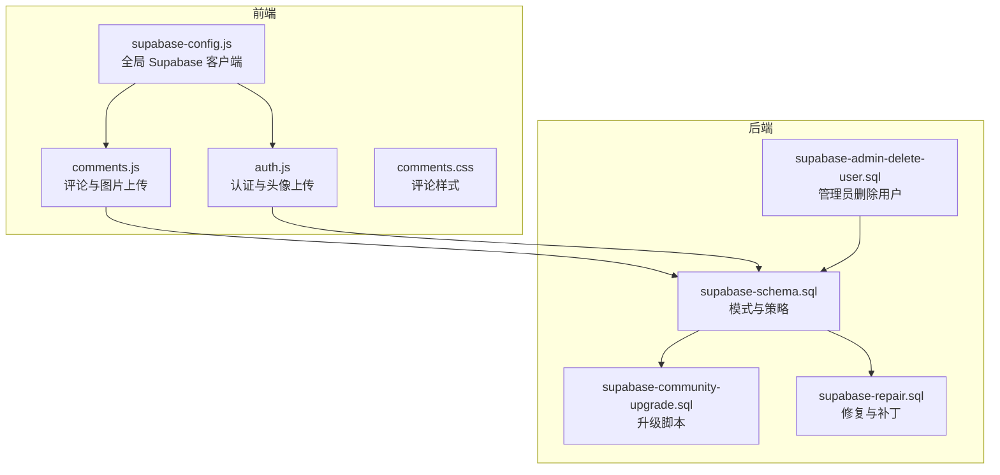
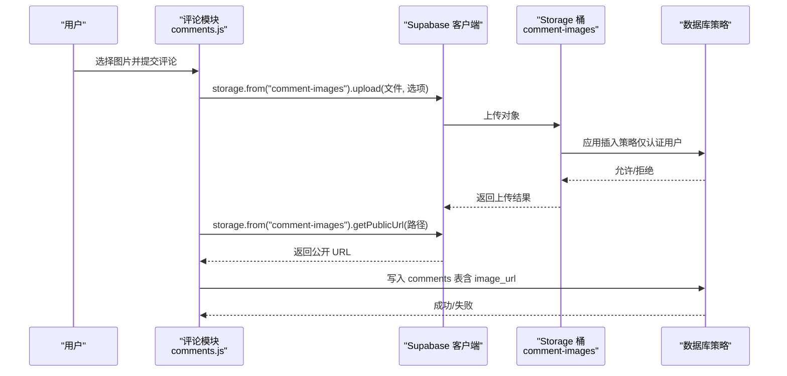
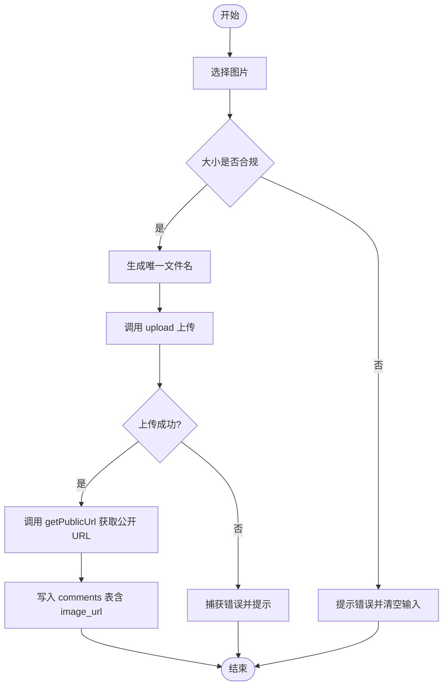
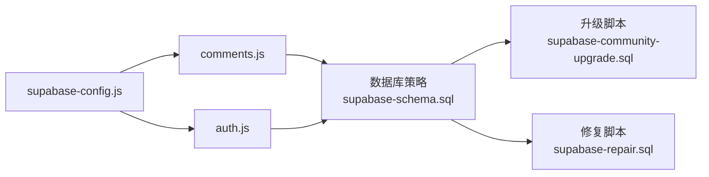

# 存储桶配置

<cite>
**本文引用的文件**
- [supabase-config.js](file://shared/supabase-config.js)
- [comments.js](file://shared/comments.js)
- [comments.css](file://shared/comments.css)
- [auth.js](file://shared/auth.js)
- [supabase-schema.sql](file://supabase-schema.sql)
- [supabase-community-upgrade.sql](file://supabase-community-upgrade.sql)
- [supabase-repair.sql](file://supabase-repair.sql)
- [supabase-admin-delete-user.sql](file://supabase-admin-delete-user.sql)
</cite>

## 目录
1. [简介](#简介)
2. [项目结构](#项目结构)
3. [核心组件](#核心组件)
4. [架构总览](#架构总览)
5. [详细组件分析](#详细组件分析)
6. [依赖关系分析](#依赖关系分析)
7. [性能考量](#性能考量)
8. [故障排查指南](#故障排查指南)
9. [结论](#结论)
10. [附录](#附录)

## 简介
本文件围绕 Supabase Storage 的存储桶配置与文件管理展开，重点说明 comment-images 存储桶的创建、访问权限与安全策略，以及评论图片上传流程、URL 生成机制与访问控制策略。同时覆盖存储桶生命周期管理、文件清理策略与存储配额限制的实践建议，并提供前端实现示例、后端处理逻辑与错误处理机制，帮助开发者通过 Storage API 进行文件操作与权限验证。

## 项目结构
本仓库中与 Supabase Storage 相关的关键文件分布如下：
- 全局 Supabase 初始化与客户端配置：shared/supabase-config.js
- 评论模块（含图片上传与 URL 展示）：shared/comments.js
- 评论模块样式：shared/comments.css
- 用户认证与头像上传（复用 comment-images 桶）：shared/auth.js
- 数据库模式与策略定义：supabase-schema.sql、supabase-community-upgrade.sql、supabase-repair.sql
- 管理员删除用户（含评论清理）：supabase-admin-delete-user.sql

**图表来源**
- [supabase-config.js:1-26](file://shared/supabase-config.js#L1-L26)
- [comments.js:1-769](file://shared/comments.js#L1-L769)
- [auth.js:1-899](file://shared/auth.js#L1-L899)
- [supabase-schema.sql:83-96](file://supabase-schema.sql#L83-L96)
- [supabase-community-upgrade.sql:1-77](file://supabase-community-upgrade.sql#L1-L77)
- [supabase-repair.sql:160-183](file://supabase-repair.sql#L160-L183)
- [supabase-admin-delete-user.sql:1-29](file://supabase-admin-delete-user.sql#L1-L29)

**章节来源**
- [supabase-config.js:1-26](file://shared/supabase-config.js#L1-L26)
- [comments.js:1-769](file://shared/comments.js#L1-L769)
- [auth.js:1-899](file://shared/auth.js#L1-L899)
- [supabase-schema.sql:83-96](file://supabase-schema.sql#L83-L96)
- [supabase-community-upgrade.sql:1-77](file://supabase-community-upgrade.sql#L1-L77)
- [supabase-repair.sql:160-183](file://supabase-repair.sql#L160-L183)
- [supabase-admin-delete-user.sql:1-29](file://supabase-admin-delete-user.sql#L1-L29)

## 核心组件
- Supabase 全局配置与客户端
  - 初始化 Supabase 客户端，提供 window.supabaseClient 与兼容的 window.db 访问路径，供评论与认证模块共享使用。
- 评论模块（含图片上传）
  - 支持文本+图片评论，图片上传至 comment-images 桶；上传成功后生成公开 URL 并持久化到 comments 表。
- 认证模块（含头像上传）
  - 用户可上传头像至 comment-images 桶，生成公开 URL 并回写用户元数据与 profiles 表。
- 数据库策略与模式
  - 定义 comment-images 桶、插入策略（仅认证用户）、选择策略（公开读取），并提供升级与修复脚本确保策略一致性。

**章节来源**
- [supabase-config.js:5-25](file://shared/supabase-config.js#L5-L25)
- [comments.js:511-643](file://shared/comments.js#L511-L643)
- [auth.js:703-717](file://shared/auth.js#L703-L717)
- [supabase-schema.sql:83-96](file://supabase-schema.sql#L83-L96)
- [supabase-repair.sql:160-183](file://supabase-repair.sql#L160-L183)

## 架构总览
前端通过 Supabase 客户端调用 Storage API 完成文件上传与 URL 获取；后端通过数据库策略控制访问权限。评论与头像上传均使用同一存储桶，统一管理与鉴权。

**图表来源**
- [comments.js:589-598](file://shared/comments.js#L589-L598)
- [supabase-schema.sql:89-96](file://supabase-schema.sql#L89-L96)
- [supabase-repair.sql:164-183](file://supabase-repair.sql#L164-L183)

## 详细组件分析

### 存储桶：comment-images
- 创建方式
  - 通过 SQL 插入 storage.buckets，名称与 ID 均为 comment-images，且设为 public。
- 访问权限
  - 插入策略：仅认证用户可向该桶插入对象。
  - 选择策略：公开可读。
- 生命周期管理
  - 桶本身无自动过期时间；对象的生命周期由应用业务决定（如评论删除时清理）。
- 存储配额
  - 仓库未提供具体配额限制；实际配额取决于 Supabase 计划与资源限制。

**章节来源**
- [supabase-schema.sql:83-96](file://supabase-schema.sql#L83-L96)
- [supabase-repair.sql:160-183](file://supabase-repair.sql#L160-L183)

### 文件上传流程（评论图片）
- 前端实现要点
  - 选择文件后校验大小（示例：不超过 5MB）。
  - 生成唯一文件名（用户 ID + 时间戳 + 扩展名）。
  - 调用 storage.upload，设置缓存控制与 upsert 选项。
  - 上传成功后调用 getPublicUrl 获取公开 URL。
  - 将 URL 与评论内容一并写入 comments 表。
- 错误处理
  - 上传失败时抛出错误并提示用户。
  - 对于 schema 缺失或权限不足等场景，前端给出明确提示并引导执行升级脚本。

**图表来源**
- [comments.js:710-730](file://shared/comments.js#L710-L730)
- [comments.js:589-607](file://shared/comments.js#L589-L607)

**章节来源**
- [comments.js:589-643](file://shared/comments.js#L589-L643)
- [comments.js:710-730](file://shared/comments.js#L710-L730)

### URL 生成机制与访问控制
- URL 生成
  - 使用 getPublicUrl 获取公开 URL，用于在评论中直接展示图片。
- 访问控制
  - 选择策略允许公开读取，但插入策略限制为认证用户。
- 安全建议
  - 若需私有访问，应将桶设为非公开并通过签名 URL 或服务端代理访问。
  - 对敏感内容建议采用服务端签名 URL 或基于角色的访问控制。

**章节来源**
- [comments.js:596-598](file://shared/comments.js#L596-L598)
- [supabase-schema.sql:89-96](file://supabase-schema.sql#L89-L96)
- [supabase-repair.sql:164-183](file://supabase-repair.sql#L164-L183)

### 文件清理策略（生命周期管理）
- 评论删除时清理
  - 删除评论记录时，可在应用层同步删除对应对象（若需要），避免垃圾数据累积。
- 管理员操作
  - 提供管理员函数删除用户及其评论，间接清理相关对象。
- 存储配额与容量监控
  - 建议定期评估桶内对象数量与总容量，必要时引入归档或压缩策略。

**章节来源**
- [supabase-admin-delete-user.sql:1-29](file://supabase-admin-delete-user.sql#L1-L29)
- [comments.js:690-708](file://shared/comments.js#L690-L708)

### 前端实现示例与最佳实践
- 图片预览与校验
  - 使用 FileReader 实现本地预览；限制文件大小以提升用户体验与后端稳定性。
- 上传与回显
  - 上传成功后立即回显图片，失败时保留原文本并提示错误。
- 样式与交互
  - 提供清晰的上传按钮、计数器与删除预览功能，增强可用性。

**章节来源**
- [comments.css:169-193](file://shared/comments.css#L169-L193)
- [comments.js:710-740](file://shared/comments.js#L710-L740)

### 后端处理逻辑与权限验证
- 客户端侧
  - 通过 Supabase 客户端直接调用 Storage API，遵循策略限制。
- 服务端侧
  - 数据库策略保证插入与读取行为符合预期；升级与修复脚本确保策略一致性。
- 权限验证
  - 仅认证用户可上传；公开桶允许任何人读取。

**章节来源**
- [supabase-schema.sql:89-96](file://supabase-schema.sql#L89-L96)
- [supabase-community-upgrade.sql:49-77](file://supabase-community-upgrade.sql#L49-L77)
- [supabase-repair.sql:164-183](file://supabase-repair.sql#L164-L183)

## 依赖关系分析
- 前端依赖
  - comments.js 与 auth.js 依赖 shared/supabase-config.js 提供的全局客户端实例。
  - 两者均通过 client.storage.from('comment-images') 访问同一桶。
- 后端依赖
  - 数据库策略依赖 storage.buckets 与 storage.objects 表，确保桶存在与策略生效。
  - 升级与修复脚本负责创建桶与策略，保证系统一致性。

**图表来源**
- [supabase-config.js:5-25](file://shared/supabase-config.js#L5-L25)
- [comments.js:20-25](file://shared/comments.js#L20-L25)
- [auth.js:35-40](file://shared/auth.js#L35-L40)
- [supabase-schema.sql:83-96](file://supabase-schema.sql#L83-L96)
- [supabase-community-upgrade.sql:49-77](file://supabase-community-upgrade.sql#L49-L77)
- [supabase-repair.sql:160-183](file://supabase-repair.sql#L160-L183)

**章节来源**
- [supabase-config.js:5-25](file://shared/supabase-config.js#L5-L25)
- [comments.js:20-25](file://shared/comments.js#L20-L25)
- [auth.js:35-40](file://shared/auth.js#L35-L40)
- [supabase-schema.sql:83-96](file://supabase-schema.sql#L83-L96)
- [supabase-community-upgrade.sql:49-77](file://supabase-community-upgrade.sql#L49-L77)
- [supabase-repair.sql:160-183](file://supabase-repair.sql#L160-L183)

## 性能考量
- 缓存控制
  - 上传时设置 cacheControl，有助于 CDN 与浏览器缓存，减少重复请求。
- 文件大小与并发
  - 前端限制单张图片大小，降低网络与存储压力；对多图上传建议分批处理。
- URL 直链与签名
  - 公开直链便于展示，但对敏感内容建议使用签名 URL 或服务端代理，避免滥用。

**章节来源**
- [comments.js:590-594](file://shared/comments.js#L590-L594)
- [auth.js:706-716](file://shared/auth.js#L706-L716)

## 故障排查指南
- 常见错误与定位
  - Schema 缺失：提示表或列不存在，需执行社区升级脚本。
  - 权限不足：提示权限被拒绝或违反行级安全策略，需确认用户认证状态与策略。
  - 上传失败：检查文件大小、类型与网络状况；查看返回的错误信息。
- 建议流程
  - 确认 Supabase SDK 已正确加载与初始化。
  - 确认 comment-images 桶与策略已创建（优先执行修复脚本）。
  - 在开发工具中观察 Network 面板与 Console 日志，定位具体错误来源。

**章节来源**
- [comments.js:47-65](file://shared/comments.js#L47-L65)
- [comments.js:627-643](file://shared/comments.js#L627-L643)
- [supabase-repair.sql:164-183](file://supabase-repair.sql#L164-L183)

## 结论
通过统一的 comment-images 存储桶与严格的数据库策略，项目实现了“认证用户上传、公开读取”的图片管理能力。前端在上传前进行预览与大小校验，后端通过策略保障访问安全。配合升级与修复脚本，可确保策略一致性与系统稳定性。建议在生产环境中结合签名 URL 与容量监控，进一步强化安全性与可维护性。

## 附录
- 前端实现参考
  - 图片上传与 URL 获取：[comments.js:589-607](file://shared/comments.js#L589-L607)
  - 头像上传与 URL 获取：[auth.js:706-716](file://shared/auth.js#L706-L716)
- 后端策略参考
  - 桶与策略定义：[supabase-schema.sql:83-96](file://supabase-schema.sql#L83-L96)
  - 策略补丁与修复：[supabase-repair.sql:160-183](file://supabase-repair.sql#L160-L183)
- 生命周期与清理
  - 管理员删除用户与评论：[supabase-admin-delete-user.sql:1-29](file://supabase-admin-delete-user.sql#L1-L29)