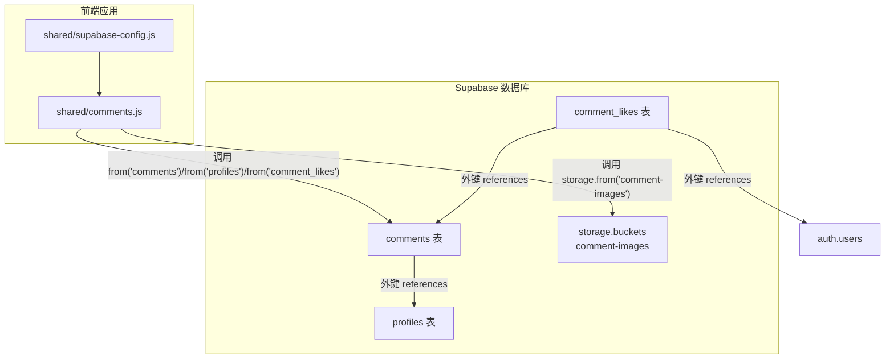
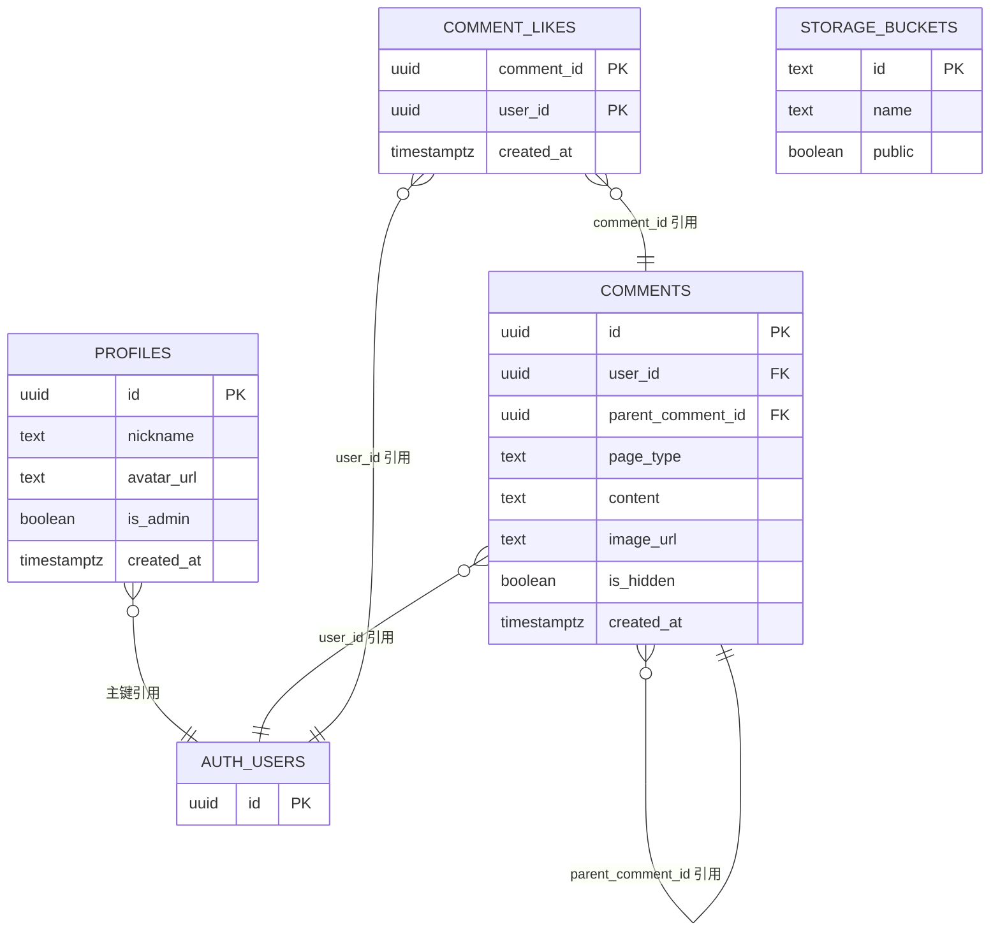
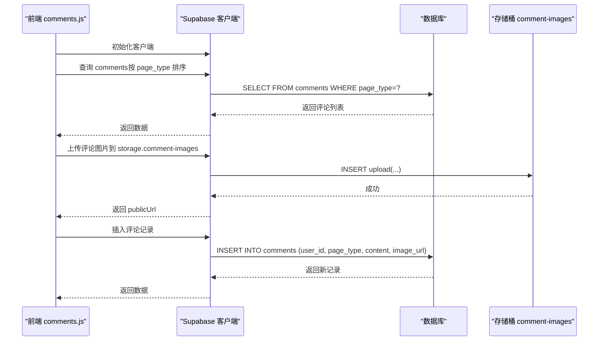

# 数据库表结构

<cite>
**本文引用的文件**
- [supabase-schema.sql](file://supabase-schema.sql)
- [supabase-community-upgrade.sql](file://supabase-community-upgrade.sql)
- [supabase-repair.sql](file://supabase-repair.sql)
- [supabase-result-views.sql](file://supabase-result-views.sql)
- [comments.js](file://shared/comments.js)
- [supabase-config.js](file://shared/supabase-config.js)
</cite>

## 目录
1. [简介](#简介)
2. [项目结构](#项目结构)
3. [核心组件](#核心组件)
4. [架构总览](#架构总览)
5. [详细组件分析](#详细组件分析)
6. [依赖关系分析](#依赖关系分析)
7. [性能考量](#性能考量)
8. [故障排查指南](#故障排查指南)
9. [结论](#结论)
10. [附录](#附录)

## 简介
本文件系统性梳理 Supabase 数据库中的表结构与关系，重点覆盖以下内容：
- profiles 用户档案表：字段定义、数据类型、约束与默认值、RLS 策略与触发器
- comments 评论表：字段定义、数据类型、约束与默认值、RLS 策略与索引
- comment_likes 点赞表：字段定义、主键、外键、RLS 策略与索引
- 存储桶 comment-images 的策略与使用
- 表间外键关系、索引设计与性能考虑
- 表创建语句逐行解析与业务意义说明
- 表结构示例与数据类型对照表

## 项目结构
本项目通过 SQL 脚本在 Supabase 上创建与维护数据库结构，并通过前端模块与 Supabase 客户端交互实现评论功能。关键文件如下：
- supabase-schema.sql：初始表结构与策略定义
- supabase-community-upgrade.sql：评论树形结构、点赞表与索引升级
- supabase-repair.sql：修复与补全现有表结构与策略
- supabase-result-views.sql：结果浏览统计表（作为参考）
- shared/comments.js：前端评论模块，调用 Supabase API 与存储桶
- shared/supabase-config.js：Supabase 客户端初始化

图表来源
- [supabase-schema.sql:1-97](file://supabase-schema.sql#L1-L97)
- [supabase-community-upgrade.sql:1-77](file://supabase-community-upgrade.sql#L1-L77)
- [supabase-repair.sql:1-183](file://supabase-repair.sql#L1-L183)
- [comments.js:20-25](file://shared/comments.js#L20-L25)

章节来源
- [supabase-schema.sql:1-97](file://supabase-schema.sql#L1-L97)
- [supabase-community-upgrade.sql:1-77](file://supabase-community-upgrade.sql#L1-L77)
- [supabase-repair.sql:1-183](file://supabase-repair.sql#L1-L183)
- [supabase-result-views.sql:1-32](file://supabase-result-views.sql#L1-L32)
- [comments.js:20-25](file://shared/comments.js#L20-L25)
- [supabase-config.js:1-26](file://shared/supabase-config.js#L1-L26)

## 核心组件
本节聚焦三张核心表及其关联关系，结合 SQL 脚本逐行解析字段、约束、默认值与业务含义。

- profiles 用户档案表
  - 主键：id（uuid，引用 auth.users，级联删除）
  - 字段与默认值：
    - nickname：文本，默认“匿名觉者”
    - avatar_url：文本，默认空字符串
    - is_admin：布尔，默认 false
    - created_at：带时区时间戳，默认当前时间
  - 约束与策略：
    - 启用 RLS
    - 公开读取；仅本人可更新；仅本人可插入
    - 自动触发器：新用户注册时自动创建档案
  - 业务意义：承载用户基本信息与权限标识，支持匿名与管理员场景

- comments 评论表
  - 主键：id（uuid，默认随机生成）
  - 关联字段：
    - user_id（uuid，引用 auth.users，级联删除）：评论作者
    - parent_comment_id（uuid，引用自身 id，级联删除）：用于树形回复
  - 字段与默认值：
    - page_type：文本，枚举值为 'soullab' 或 'objectification'
    - content：文本，默认空字符串
    - image_url：文本，默认空
    - is_hidden：布尔，默认 false（管理员可隐藏）
    - created_at：带时区时间戳，默认当前时间
  - 索引：
    - 复合索引：page_type, parent_comment_id, created_at（降序）
  - 约束与策略：
    - 启用 RLS
    - 公开读取未隐藏评论
    - 登录用户可插入（校验 user_id）
    - 本人可删除
    - 管理员可读取全部（含隐藏）、可更新隐藏状态、可删除
  - 业务意义：承载评论内容、图片、层级关系与可见性控制

- comment_likes 点赞表
  - 主键：(comment_id, user_id)
  - 字段与约束：
    - comment_id（uuid，引用 comments.id，级联删除）
    - user_id（uuid，引用 auth.users.id，级联删除）
    - created_at：带时区时间戳，默认当前时间
  - 索引：
    - comment_id + created_at（降序）
    - user_id + created_at（降序）
  - 策略：
    - 公开读取
    - 已认证用户可插入（校验 user_id）
    - 仅本人可删除
  - 业务意义：记录用户对评论的点赞关系，支持按评论或用户维度查询

章节来源
- [supabase-schema.sql:6-21](file://supabase-schema.sql#L6-L21)
- [supabase-schema.sql:42-80](file://supabase-schema.sql#L42-L80)
- [supabase-community-upgrade.sql:3-7](file://supabase-community-upgrade.sql#L3-L7)
- [supabase-community-upgrade.sql:9-23](file://supabase-community-upgrade.sql#L9-L23)
- [supabase-repair.sql:6-27](file://supabase-repair.sql#L6-L27)
- [supabase-repair.sql:129-158](file://supabase-repair.sql#L129-L158)
- [supabase-repair.sql:160-183](file://supabase-repair.sql#L160-L183)

## 架构总览
下图展示表结构、外键关系与前端交互路径：

图表来源
- [supabase-schema.sql:6-21](file://supabase-schema.sql#L6-L21)
- [supabase-schema.sql:42-80](file://supabase-schema.sql#L42-L80)
- [supabase-community-upgrade.sql:3-14](file://supabase-community-upgrade.sql#L3-L14)
- [supabase-repair.sql:6-27](file://supabase-repair.sql#L6-L27)
- [supabase-repair.sql:160-183](file://supabase-repair.sql#L160-L183)

## 详细组件分析

### profiles 表
- 字段与约束
  - id：uuid，主键，引用 auth.users，删除级联
  - nickname：文本，默认“匿名觉者”
  - avatar_url：文本，默认空字符串
  - is_admin：布尔，默认 false
  - created_at：带时区时间戳，默认当前时间
- RLS 策略
  - 公开读取
  - 本人可更新
  - 本人可插入（校验 auth.uid() = id）
- 触发器
  - 新用户注册时自动创建档案，填充 id、nickname、avatar_url
- 业务意义
  - 统一用户身份与头像来源，支持匿名与管理员标识

章节来源
- [supabase-schema.sql:6-21](file://supabase-schema.sql#L6-L21)
- [supabase-schema.sql:23-39](file://supabase-schema.sql#L23-L39)
- [supabase-repair.sql:6-27](file://supabase-repair.sql#L6-L27)

### comments 表
- 字段与约束
  - id：uuid，默认随机生成，主键
  - user_id：uuid，引用 auth.users，删除级联
  - parent_comment_id：uuid，引用自身 id，删除级联（支持树形回复）
  - page_type：文本，枚举值为 'soullab' 或 'objectification'
  - content：文本，默认空字符串
  - image_url：文本，默认空
  - is_hidden：布尔，默认 false（管理员可隐藏）
  - created_at：带时区时间戳，默认当前时间
- 索引
  - 复合索引：page_type, parent_comment_id, created_at（降序）
- RLS 策略
  - 公开读取未隐藏评论
  - 登录用户可插入（校验 user_id）
  - 本人可删除
  - 管理员可读取全部（含隐藏）、可更新隐藏状态、可删除
- 业务意义
  - 承载评论内容、图片、层级关系与可见性控制，支持按页面类型分组查询

章节来源
- [supabase-schema.sql:42-80](file://supabase-schema.sql#L42-L80)
- [supabase-community-upgrade.sql:3-7](file://supabase-community-upgrade.sql#L3-L7)
- [supabase-repair.sql:129-158](file://supabase-repair.sql#L129-L158)

### comment_likes 表
- 字段与约束
  - comment_id：uuid，引用 comments.id，删除级联
  - user_id：uuid，引用 auth.users.id，删除级联
  - created_at：带时区时间戳，默认当前时间
  - 主键：(comment_id, user_id)
- 索引
  - comment_id + created_at（降序）
  - user_id + created_at（降序）
- RLS 策略
  - 公开读取
  - 已认证用户可插入（校验 user_id）
  - 仅本人可删除
- 业务意义
  - 记录用户对评论的点赞关系，支持按评论或用户维度查询

章节来源
- [supabase-community-upgrade.sql:9-23](file://supabase-community-upgrade.sql#L9-L23)

### 存储桶与图片策略
- 存储桶：comment-images（公开）
- 策略
  - 登录用户可上传（校验 bucket_id 与 auth.role()）
  - 公开可读
- 前端使用
  - 评论图片上传至该桶，生成公开访问链接

章节来源
- [supabase-schema.sql:83-96](file://supabase-schema.sql#L83-L96)
- [supabase-repair.sql:160-183](file://supabase-repair.sql#L160-L183)

### 表创建语句逐行解析
- profiles
  - 主键与外键：id 引用 auth.users，删除级联
  - 默认值：nickname、avatar_url、is_admin、created_at
  - RLS 与策略：启用 RLS，公开读取，本人更新/插入
  - 触发器：新用户自动创建档案
- comments
  - 主键：id
  - 外键：user_id 引用 auth.users，parent_comment_id 引用自身
  - 默认值：page_type、content、image_url、is_hidden、created_at
  - 索引：page_type, parent_comment_id, created_at（降序）
  - RLS 与策略：公开读取未隐藏；登录用户插入；本人删除；管理员全部读取/隐藏/删除
- comment_likes
  - 主键：(comment_id, user_id)
  - 外键：comment_id 引用 comments.id，user_id 引用 auth.users.id
  - 默认值：created_at
  - 索引：comment_id + created_at；user_id + created_at
  - RLS 与策略：公开读取；已认证用户插入；本人删除
- 存储桶与策略
  - 插入存储桶：comment-images（公开）
  - 策略：登录用户上传；公开读取

章节来源
- [supabase-schema.sql:6-21](file://supabase-schema.sql#L6-L21)
- [supabase-schema.sql:23-39](file://supabase-schema.sql#L23-L39)
- [supabase-schema.sql:42-80](file://supabase-schema.sql#L42-L80)
- [supabase-community-upgrade.sql:3-23](file://supabase-community-upgrade.sql#L3-L23)
- [supabase-schema.sql:83-96](file://supabase-schema.sql#L83-L96)

## 依赖关系分析
- 外键依赖
  - profiles.id → auth.users.id（删除级联）
  - comments.user_id → auth.users.id（删除级联）
  - comments.parent_comment_id → comments.id（删除级联）
  - comment_likes.comment_id → comments.id（删除级联）
  - comment_likes.user_id → auth.users.id（删除级联）
- 前端依赖
  - comments.js 通过 Supabase 客户端调用 from('comments')/from('profiles')/from('comment_likes')
  - 使用 storage.from('comment-images') 上传与读取图片
- 策略与权限
  - RLS 策略与角色（anon/authenticated）共同决定访问范围
  - 管理员通过 profiles.is_admin 判断是否拥有更高权限

图表来源
- [comments.js:309-345](file://shared/comments.js#L309-L345)
- [comments.js:592-613](file://shared/comments.js#L592-L613)
- [supabase-schema.sql:83-96](file://supabase-schema.sql#L83-L96)

章节来源
- [comments.js:20-25](file://shared/comments.js#L20-L25)
- [comments.js:309-345](file://shared/comments.js#L309-L345)
- [comments.js:592-613](file://shared/comments.js#L592-L613)
- [supabase-config.js:19-25](file://shared/supabase-config.js#L19-L25)

## 性能考量
- 索引设计
  - comments：page_type, parent_comment_id, created_at（降序）——优化按页面类型与层级排序查询
  - comment_likes：comment_id + created_at（降序）、user_id + created_at（降序）——优化按评论或用户维度的点赞查询
- RLS 开销
  - RLS 策略会增加每条查询的评估成本，建议在高频查询上尽量减少不必要的策略判断
- 存储与网络
  - 图片上传使用公共存储桶，注意缓存控制与访问频率，避免频繁上传
- 数据量与分页
  - 前端采用固定数量分页（如每页 10 条），避免一次性加载过多数据

章节来源
- [supabase-community-upgrade.sql:6-7](file://supabase-community-upgrade.sql#L6-L7)
- [supabase-community-upgrade.sql:19-23](file://supabase-community-upgrade.sql#L19-L23)
- [comments.js:16-18](file://shared/comments.js#L16-L18)
- [comments.js:365-381](file://shared/comments.js#L365-L381)

## 故障排查指南
- 评论表缺失
  - 现象：前端提示“评论功能未完成升级，请先执行 SQL 脚本”
  - 处理：执行 supabase-community-upgrade.sql 完成表结构与索引升级
- 点赞表缺失或权限不足
  - 现象：点赞失败，提示“点赞功能未完成升级”或“权限不足”
  - 处理：执行 supabase-community-upgrade.sql 完成点赞表与策略升级
- 配置问题
  - 现象：Supabase SDK 未加载或客户端未初始化
  - 处理：确认 shared/supabase-config.js 正常加载，URL 与密钥正确

章节来源
- [comments.js:47-65](file://shared/comments.js#L47-L65)
- [comments.js:634-638](file://shared/comments.js#L634-L638)
- [comments.js:680-687](file://shared/comments.js#L680-L687)
- [supabase-config.js:12-17](file://shared/supabase-config.js#L12-L17)

## 结论
本数据库模型围绕用户档案、评论与点赞三大核心实体构建，配合 RLS 策略与存储桶策略，实现了从匿名到管理员的多层级访问控制。通过合理的索引与前端分页策略，兼顾了查询性能与用户体验。建议在生产环境中持续关注 RLS 对性能的影响，并根据实际访问模式调整索引与查询策略。

## 附录

### 表结构示例
- profiles
  - id: uuid（主键，引用 auth.users）
  - nickname: 文本（默认“匿名觉者”）
  - avatar_url: 文本（默认空）
  - is_admin: 布尔（默认 false）
  - created_at: 时间戳（默认当前时间）

- comments
  - id: uuid（主键）
  - user_id: uuid（外键，引用 auth.users）
  - parent_comment_id: uuid（外键，引用 comments.id）
  - page_type: 文本（枚举：'soullab' | 'objectification'）
  - content: 文本（默认空）
  - image_url: 文本（默认空）
  - is_hidden: 布尔（默认 false）
  - created_at: 时间戳（默认当前时间）

- comment_likes
  - comment_id: uuid（主键，外键，引用 comments.id）
  - user_id: uuid（主键，外键，引用 auth.users.id）
  - created_at: 时间戳（默认当前时间）

### 数据类型对照表
- uuid：唯一标识符，常用于主键与外键
- text：可变长度文本，适合描述性字段
- boolean：布尔值，适合开关类字段
- timestamptz：带时区的时间戳，适合记录创建/更新时间