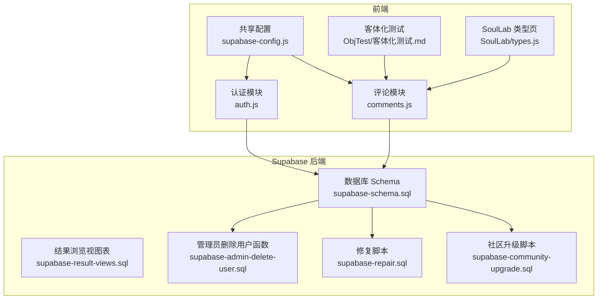
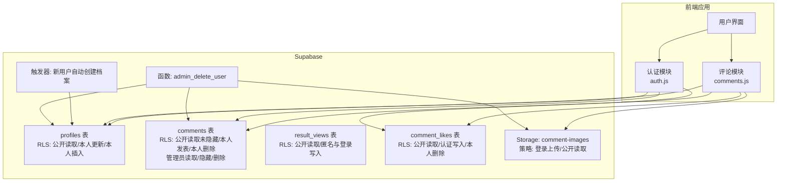
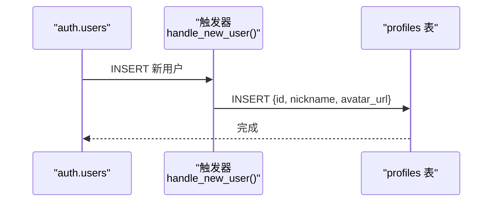
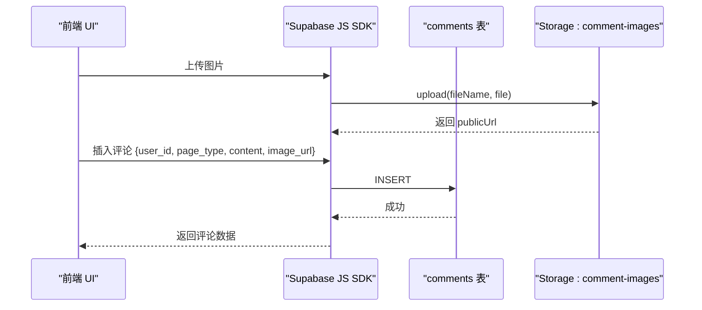
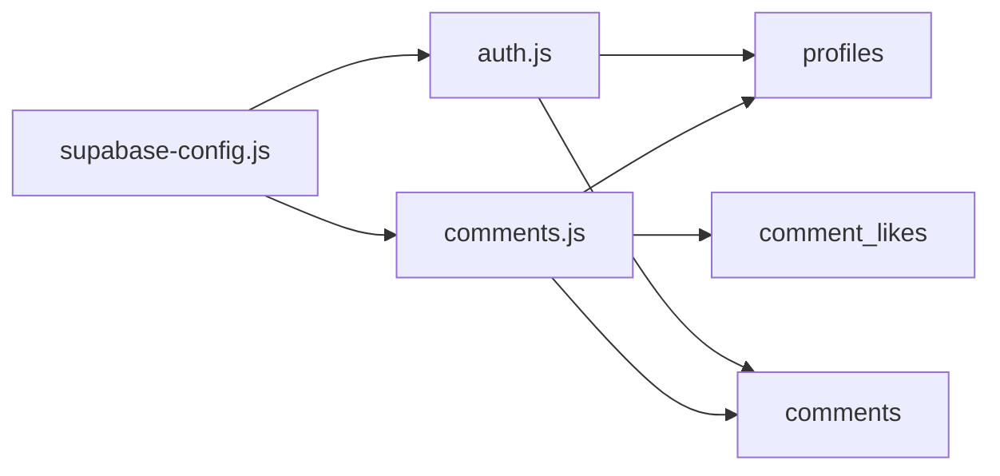
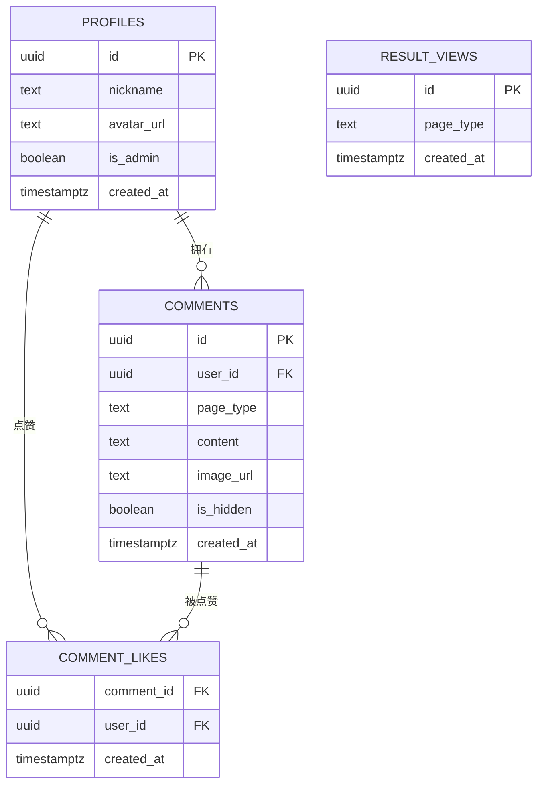
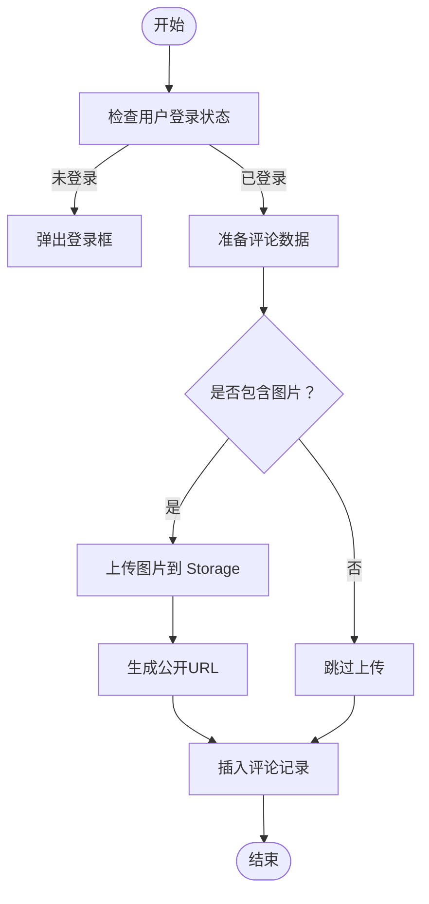

# 数据库设计

<cite>
**本文引用的文件**
- [supabase-schema.sql](file://supabase-schema.sql)
- [supabase-result-views.sql](file://supabase-result-views.sql)
- [supabase-community-upgrade.sql](file://supabase-community-upgrade.sql)
- [supabase-repair.sql](file://supabase-repair.sql)
- [supabase-admin-delete-user.sql](file://supabase-admin-delete-user.sql)
- [supabase-config.js](file://shared/supabase-config.js)
- [comments.js](file://shared/comments.js)
- [auth.js](file://shared/auth.js)
- [客体化测试.md](file://ObjTest/客体化测试.md)
- [types.js](file://SoulLab/types.js)
</cite>

## 目录
1. [简介](#简介)
2. [项目结构](#项目结构)
3. [核心组件](#核心组件)
4. [架构总览](#架构总览)
5. [详细组件分析](#详细组件分析)
6. [依赖分析](#依赖分析)
7. [性能考量](#性能考量)
8. [故障排查指南](#故障排查指南)
9. [结论](#结论)
10. [附录](#附录)

## 简介
本文件面向Supabase数据库的数据库设计文档，系统梳理用户档案、测试结果浏览、评论与点赞、存储桶及权限控制等核心表结构与策略。文档同时覆盖：
- 表结构与关系模型
- Row Level Security（RLS）策略与权限控制
- 数据访问流程与前端集成
- 数据库迁移脚本说明、版本升级策略与修复脚本
- ER图与数据流图，帮助开发者快速理解数据模型与业务逻辑

## 项目结构
本仓库采用“前端静态资源 + Supabase后端”的混合架构，数据库层通过SQL脚本在Supabase Dashboard中执行，前端通过Supabase JS SDK进行数据访问与鉴权。

**图表来源**
- [supabase-config.js:1-26](file://shared/supabase-config.js#L1-L26)
- [comments.js:1-697](file://shared/comments.js#L1-L697)
- [auth.js:1-800](file://shared/auth.js#L1-L800)
- [supabase-schema.sql:1-97](file://supabase-schema.sql#L1-L97)
- [supabase-result-views.sql:1-32](file://supabase-result-views.sql#L1-L32)
- [supabase-community-upgrade.sql:1-77](file://supabase-community-upgrade.sql#L1-L77)
- [supabase-repair.sql:1-184](file://supabase-repair.sql#L1-L184)
- [supabase-admin-delete-user.sql:1-29](file://supabase-admin-delete-user.sql#L1-L29)

**章节来源**
- [supabase-config.js:1-26](file://shared/supabase-config.js#L1-L26)
- [supabase-schema.sql:1-97](file://supabase-schema.sql#L1-L97)
- [supabase-result-views.sql:1-32](file://supabase-result-views.sql#L1-L32)
- [supabase-community-upgrade.sql:1-77](file://supabase-community-upgrade.sql#L1-L77)
- [supabase-repair.sql:1-184](file://supabase-repair.sql#L1-L184)
- [supabase-admin-delete-user.sql:1-29](file://supabase-admin-delete-user.sql#L1-L29)

## 核心组件
- 用户档案表（profiles）
  - 主键：用户ID（关联auth.users）
  - 字段：昵称、头像URL、是否管理员、创建时间
  - RLS：公开读取；本人可更新；本人可插入
  - 触发器：新用户注册时自动创建档案
- 评论表（comments）
  - 主键：UUID
  - 字段：用户ID、页面类型（soullab/objtest）、内容、图片URL、是否隐藏、创建时间
  - RLS：公开读取未隐藏；登录用户可发表；本人可删除；管理员可读取/隐藏/删除
  - 存储桶：comment-images（公开读取，登录用户上传）
- 结果浏览表（result_views）
  - 主键：UUID
  - 字段：页面类型（soullab/objtest）、创建时间
  - RLS：公开读取；匿名与登录用户可写入
  - 索引：按页面类型+创建时间倒序
- 评论点赞表（comment_likes）
  - 复合主键：评论ID+用户ID
  - 字段：评论ID、用户ID、创建时间
  - RLS：公开读取；认证用户可插入；本人可删除
  - 索引：按评论ID/用户ID+创建时间倒序
- 管理员删除用户函数（admin_delete_user）
  - 仅管理员可调用，级联删除用户评论、档案与auth用户

**章节来源**
- [supabase-schema.sql:6-40](file://supabase-schema.sql#L6-L40)
- [supabase-schema.sql:42-81](file://supabase-schema.sql#L42-L81)
- [supabase-result-views.sql:1-32](file://supabase-result-views.sql#L1-L32)
- [supabase-community-upgrade.sql:9-77](file://supabase-community-upgrade.sql#L9-L77)
- [supabase-admin-delete-user.sql:1-29](file://supabase-admin-delete-user.sql#L1-L29)

## 架构总览
Supabase数据库通过RLS策略与存储策略实现细粒度的数据访问控制，前端通过SDK按策略进行查询、插入、删除等操作。管理员具备额外权限，支持对评论进行隐藏与删除，并可批量清理用户数据。

**图表来源**
- [supabase-schema.sql:6-81](file://supabase-schema.sql#L6-L81)
- [supabase-result-views.sql:1-32](file://supabase-result-views.sql#L1-L32)
- [supabase-community-upgrade.sql:9-77](file://supabase-community-upgrade.sql#L9-L77)
- [supabase-admin-delete-user.sql:1-29](file://supabase-admin-delete-user.sql#L1-L29)

## 详细组件分析

### 用户档案表（profiles）
- 设计要点
  - 主键为用户ID，外键约束关联auth.users，删除级联保证一致性
  - 默认昵称为“匿名觉者”，头像默认生成DiceBear头像种子
  - is_admin字段用于管理员权限判定
- RLS策略
  - 公开读取：允许任何用户读取档案
  - 本人更新：仅档案所属用户可更新
  - 本人插入：仅新用户注册时由触发器写入
- 触发器
  - 新用户插入auth.users后，自动在profiles中创建记录，避免重复与遗漏

**图表来源**
- [supabase-schema.sql:24-40](file://supabase-schema.sql#L24-L40)

**章节来源**
- [supabase-schema.sql:6-40](file://supabase-schema.sql#L6-L40)

### 评论表（comments）
- 设计要点
  - 主键UUID，page_type区分页面类型（soullab/objtest），is_hidden用于管理员隐藏
  - 支持图片URL，图片上传至comment-images存储桶
- RLS策略
  - 公开读取未隐藏评论
  - 登录用户发表评论（校验user_id与auth.uid一致）
  - 本人删除评论
  - 管理员可读取所有评论（含隐藏），可隐藏/删除
- 存储策略
  - 登录用户可上传图片至comment-images
  - 公开可读

**图表来源**
- [supabase-schema.sql:42-97](file://supabase-schema.sql#L42-L97)
- [comments.js:514-541](file://shared/comments.js#L514-L541)

**章节来源**
- [supabase-schema.sql:42-97](file://supabase-schema.sql#L42-L97)
- [comments.js:1-697](file://shared/comments.js#L1-L697)

### 结果浏览表（result_views）
- 设计要点
  - 记录页面类型与创建时间，用于统计浏览行为
  - 索引优化按页面类型+创建时间倒序查询
- RLS策略
  - 公开读取
  - 匿名与登录用户均可写入（限定page_type）

**章节来源**
- [supabase-result-views.sql:1-32](file://supabase-result-views.sql#L1-L32)

### 评论点赞表（comment_likes）
- 设计要点
  - 复合主键（comment_id, user_id），记录点赞关系
  - 索引优化按评论ID与用户ID查询
- RLS策略
  - 公开读取
  - 认证用户可插入（校验user_id与auth.uid一致）
  - 本人可删除（取消点赞）

**章节来源**
- [supabase-community-upgrade.sql:9-77](file://supabase-community-upgrade.sql#L9-L77)

### 管理员删除用户函数（admin_delete_user）
- 设计要点
  - 仅管理员可调用，校验auth.uid为管理员
  - 级联删除用户评论、档案与auth用户
- 权限控制
  - 仅authenticated角色可执行该函数

**章节来源**
- [supabase-admin-delete-user.sql:1-29](file://supabase-admin-delete-user.sql#L1-L29)

## 依赖分析
- 前端依赖Supabase JS SDK，通过全局配置对象进行初始化
- 评论模块依赖profiles与comment_likes表，用于展示用户头像与点赞数
- 认证模块依赖profiles表，用于头像字段兼容与昵称管理

**图表来源**
- [supabase-config.js:1-26](file://shared/supabase-config.js#L1-L26)
- [comments.js:1-697](file://shared/comments.js#L1-L697)
- [auth.js:1-800](file://shared/auth.js#L1-L800)

**章节来源**
- [supabase-config.js:1-26](file://shared/supabase-config.js#L1-L26)
- [comments.js:1-697](file://shared/comments.js#L1-L697)
- [auth.js:1-800](file://shared/auth.js#L1-L800)

## 性能考量
- 索引优化
  - comments表：按page_type+created_at倒序索引，提升分页与排序效率
  - comment_likes表：按comment_id与user_id分别建立索引，支持点赞统计与取消点赞
  - result_views表：按page_type+created_at倒序索引，便于统计浏览趋势
- 查询限制
  - 评论列表限制返回条数，避免一次性加载过多数据
- 存储策略
  - 图片上传使用缓存控制与公共存储桶，减少跨域与鉴权开销

**章节来源**
- [supabase-schema.sql:6-81](file://supabase-schema.sql#L6-L81)
- [supabase-community-upgrade.sql:6-23](file://supabase-community-upgrade.sql#L6-L23)
- [supabase-result-views.sql:7-8](file://supabase-result-views.sql#L7-L8)
- [comments.js:280-284](file://shared/comments.js#L280-L284)

## 故障排查指南
- 评论功能未启用
  - 现象：评论列表提示“评论功能未完成升级”
  - 原因：缺少comments或comment_likes表
  - 处理：先执行社区升级脚本，再执行修复脚本
- 权限不足
  - 现象：点赞/删除失败，提示权限不足或违反RLS策略
  - 原因：未完成RLS授权或schema缓存未更新
  - 处理：重新执行社区升级脚本，确保RLS策略创建
- 存储桶问题
  - 现象：图片上传失败
  - 原因：comment-images存储桶未创建或策略未生效
  - 处理：在Supabase Dashboard创建存储桶或执行修复脚本
- 管理员操作失败
  - 现象：admin_delete_user报错
  - 原因：非管理员调用或未授予函数执行权限
  - 处理：确认调用者为管理员并检查函数权限

**章节来源**
- [comments.js:42-60](file://shared/comments.js#L42-L60)
- [comments.js:562-567](file://shared/comments.js#L562-L567)
- [supabase-community-upgrade.sql:49-77](file://supabase-community-upgrade.sql#L49-L77)
- [supabase-repair.sql:160-184](file://supabase-repair.sql#L160-L184)
- [supabase-admin-delete-user.sql:8-19](file://supabase-admin-delete-user.sql#L8-L19)

## 结论
本数据库设计围绕RLS与存储策略构建，实现了用户档案、评论、点赞与浏览统计的完整闭环。通过迁移脚本与修复脚本，系统具备良好的演进能力与容错能力。前端模块与数据库策略紧密配合，既保障了用户体验，也确保了数据安全与合规。

## 附录

### ER图（实体-关系）

**图表来源**
- [supabase-schema.sql:6-97](file://supabase-schema.sql#L6-L97)
- [supabase-result-views.sql:1-5](file://supabase-result-views.sql#L1-L5)
- [supabase-community-upgrade.sql:9-14](file://supabase-community-upgrade.sql#L9-L14)

### 数据流图（评论发布）

**图表来源**
- [comments.js:439-571](file://shared/comments.js#L439-L571)
- [supabase-schema.sql:83-97](file://supabase-schema.sql#L83-L97)

### 版本升级与修复策略
- 初始化脚本
  - 执行supabase-schema.sql创建基础表与RLS策略
- 社区升级
  - 执行supabase-community-upgrade.sql新增评论点赞、索引与RLS策略
- 生产修复
  - 执行supabase-repair.sql修复缺失列、策略与触发器
- 管理员操作
  - 使用supabase-admin-delete-user.sql删除用户及其数据

**章节来源**
- [supabase-schema.sql:1-97](file://supabase-schema.sql#L1-L97)
- [supabase-community-upgrade.sql:1-77](file://supabase-community-upgrade.sql#L1-L77)
- [supabase-repair.sql:1-184](file://supabase-repair.sql#L1-L184)
- [supabase-admin-delete-user.sql:1-29](file://supabase-admin-delete-user.sql#L1-L29)