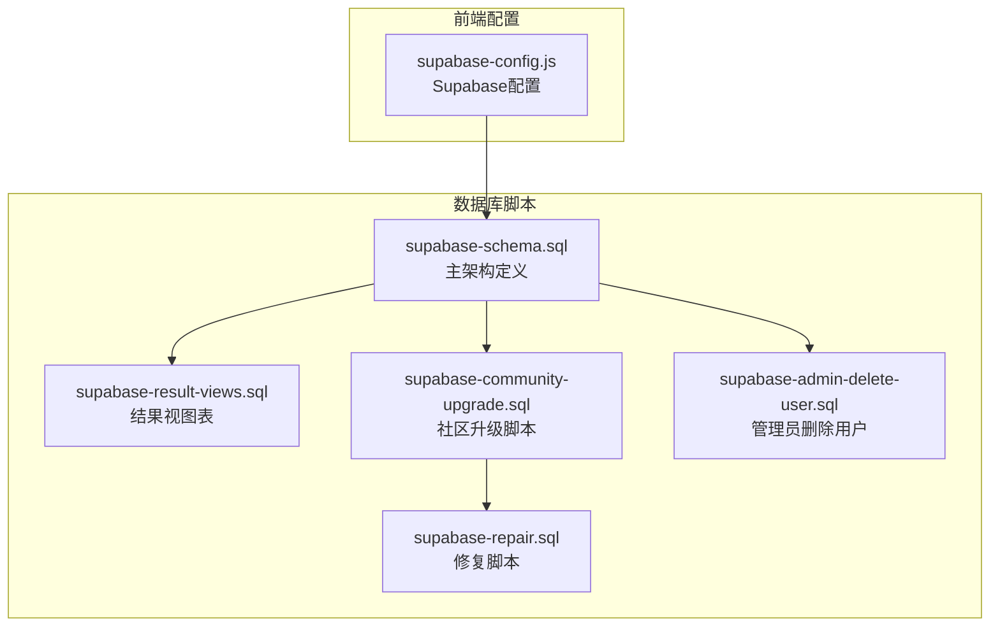
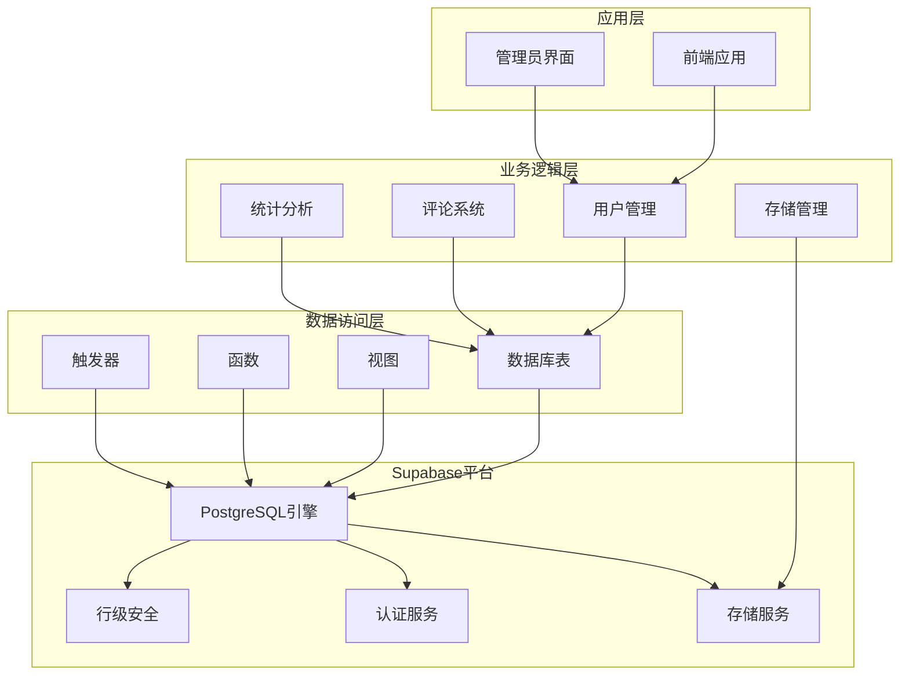
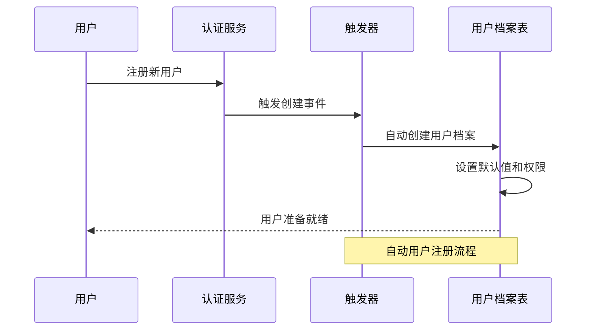
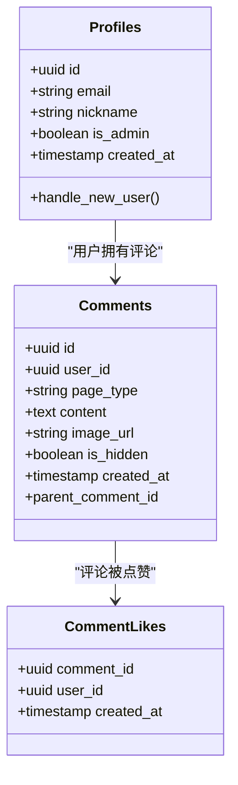
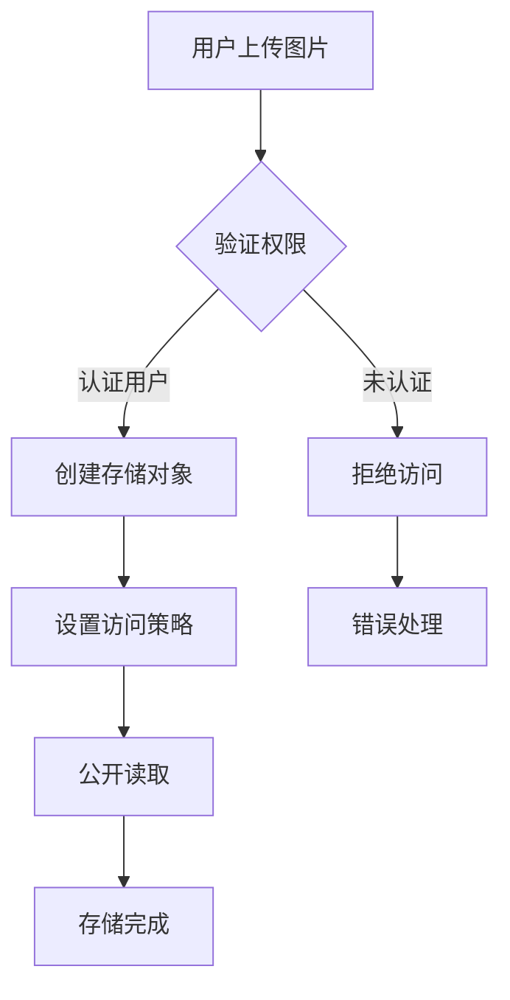
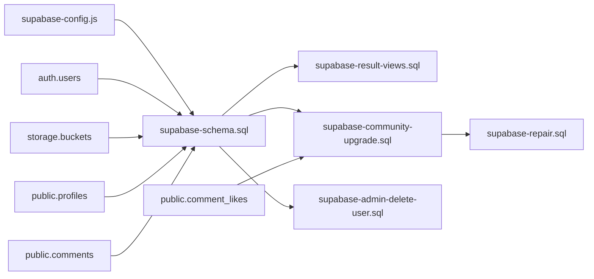
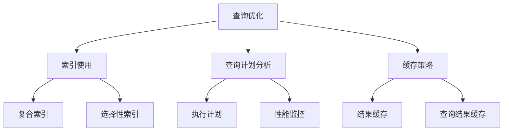
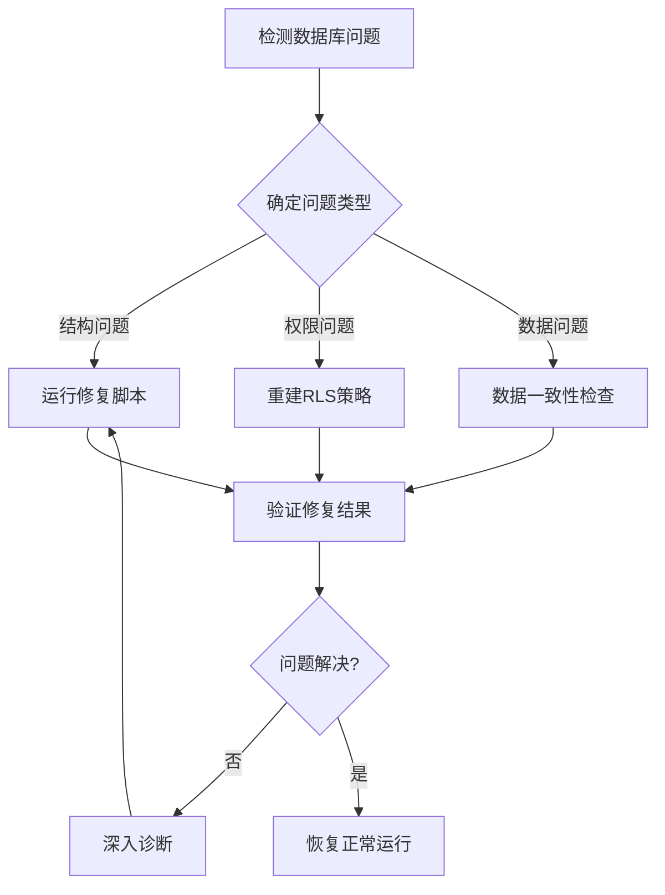

# 数据库迁移

<cite>
**本文档引用的文件**
- [supabase-schema.sql](file://supabase-schema.sql)
- [supabase-result-views.sql](file://supabase-result-views.sql)
- [supabase-community-upgrade.sql](file://supabase-community-upgrade.sql)
- [supabase-repair.sql](file://supabase-repair.sql)
- [supabase-admin-delete-user.sql](file://supabase-admin-delete-user.sql)
- [supabase-config.js](file://shared/supabase-config.js)
</cite>

## 目录
1. [简介](#简介)
2. [项目结构](#项目结构)
3. [核心组件](#核心组件)
4. [架构概览](#架构概览)
5. [详细组件分析](#详细组件分析)
6. [依赖关系分析](#依赖关系分析)
7. [性能考虑](#性能考虑)
8. [故障排除指南](#故障排除指南)
9. [结论](#结论)

## 简介

本项目是一个基于Supabase的数据库迁移和维护系统，专门为"觉醒诗社"网站(qingye520.xyz)设计。该系统包含了完整的数据库架构定义、用户管理、评论系统、存储管理和管理员功能。本文档详细说明了Supabase数据库的版本管理和升级策略，涵盖主架构脚本、结果视图表、管理员操作脚本和修复脚本的功能和使用场景。

## 项目结构

项目采用模块化的文件组织方式，每个SQL脚本负责特定的功能域：

**图表来源**
- [supabase-schema.sql:1-97](file://supabase-schema.sql#L1-L97)
- [supabase-result-views.sql:1-32](file://supabase-result-views.sql#L1-L32)
- [supabase-community-upgrade.sql:1-77](file://supabase-community-upgrade.sql#L1-L77)
- [supabase-repair.sql:1-184](file://supabase-repair.sql#L1-L184)
- [supabase-admin-delete-user.sql:1-29](file://supabase-admin-delete-user.sql#L1-L29)

**章节来源**
- [supabase-schema.sql:1-97](file://supabase-schema.sql#L1-L97)
- [supabase-result-views.sql:1-32](file://supabase-result-views.sql#L1-L32)
- [supabase-community-upgrade.sql:1-77](file://supabase-community-upgrade.sql#L1-L77)
- [supabase-repair.sql:1-184](file://supabase-repair.sql#L1-L184)
- [supabase-admin-delete-user.sql:1-29](file://supabase-admin-delete-user.sql#L1-L29)

## 核心组件

### 主架构脚本 (supabase-schema.sql)

主架构脚本定义了整个数据库的基础结构，包括用户管理、评论系统和存储配置。

**主要功能模块：**
- **用户档案表 (Profiles)**：存储用户基本信息和权限
- **评论表 (Comments)**：支持页面类型分类和隐藏功能
- **存储桶配置**：评论图片的存储策略
- **行级安全策略**：细粒度的数据访问控制

**关键特性：**
- 自动用户注册触发器
- 完整的RLS策略体系
- 存储桶权限管理
- 多层次的访问控制

**章节来源**
- [supabase-schema.sql:6-87](file://supabase-schema.sql#L6-L87)

### 结果视图表 (supabase-result-views.sql)

专门用于记录用户结果浏览行为的统计表，支持性能优化和数据分析。

**核心功能：**
- 结果浏览追踪
- 性能索引优化
- 匿名和认证用户访问
- 行级安全策略

**章节来源**
- [supabase-result-views.sql:1-32](file://supabase-result-views.sql#L1-L32)

### 社区升级脚本 (supabase-community-upgrade.sql)

增强社区功能的升级脚本，添加评论点赞和用户昵称管理功能。

**新增功能：**
- **评论点赞系统**：支持用户对评论进行点赞
- **用户昵称规范化**：自动生成唯一且有意义的昵称
- **索引优化**：为查询性能优化创建索引
- **权限管理**：细化的点赞权限控制

**章节来源**
- [supabase-community-upgrade.sql:3-77](file://supabase-community-upgrade.sql#L3-L77)

### 修复脚本 (supabase-repair.sql)

生产环境修复脚本，用于解决现有数据库中的不一致状态。

**修复能力：**
- 表结构完整性检查
- 数据一致性修复
- 权限策略重建
- 触发器重新创建

**章节来源**
- [supabase-repair.sql:1-184](file://supabase-repair.sql#L1-L184)

### 管理员操作脚本 (supabase-admin-delete-user.sql)

提供管理员级别的用户管理功能。

**管理功能：**
- 用户删除权限验证
- 关联数据级联删除
- 安全性保障机制

**章节来源**
- [supabase-admin-delete-user.sql:1-29](file://supabase-admin-delete-user.sql#L1-L29)

## 架构概览

系统采用分层架构设计，确保数据的一致性和安全性：

**图表来源**
- [supabase-schema.sql:24-39](file://supabase-schema.sql#L24-L39)
- [supabase-community-upgrade.sql:9-14](file://supabase-community-upgrade.sql#L9-L14)
- [supabase-result-views.sql:1-32](file://supabase-result-views.sql#L1-L32)

## 详细组件分析

### 用户管理系统

用户管理系统是整个应用的核心，通过自动触发器实现用户注册时的自动配置。

**图表来源**
- [supabase-schema.sql:24-39](file://supabase-schema.sql#L24-L39)

**章节来源**
- [supabase-schema.sql:24-39](file://supabase-schema.sql#L24-L39)

### 评论系统架构

评论系统支持多页面类型和复杂的权限控制：

**图表来源**
- [supabase-schema.sql:43-80](file://supabase-schema.sql#L43-L80)
- [supabase-community-upgrade.sql:9-14](file://supabase-community-upgrade.sql#L9-L14)

**章节来源**
- [supabase-schema.sql:43-80](file://supabase-schema.sql#L43-L80)
- [supabase-community-upgrade.sql:9-14](file://supabase-community-upgrade.sql#L9-L14)

### 存储管理策略

存储管理通过Supabase的Storage服务实现，支持评论图片的上传和访问控制。

**图表来源**
- [supabase-schema.sql:83-97](file://supabase-schema.sql#L83-L97)

**章节来源**
- [supabase-schema.sql:83-97](file://supabase-schema.sql#L83-L97)

## 依赖关系分析

系统各组件之间存在清晰的依赖关系：

**图表来源**
- [supabase-schema.sql:7-87](file://supabase-schema.sql#L7-L87)
- [supabase-community-upgrade.sql:3-14](file://supabase-community-upgrade.sql#L3-L14)
- [supabase-admin-delete-user.sql:1-29](file://supabase-admin-delete-user.sql#L1-L29)

**章节来源**
- [supabase-schema.sql:7-87](file://supabase-schema.sql#L7-L87)
- [supabase-community-upgrade.sql:3-14](file://supabase-community-upgrade.sql#L3-L14)
- [supabase-admin-delete-user.sql:1-29](file://supabase-admin-delete-user.sql#L1-L29)

## 性能考虑

### 索引优化策略

系统实现了多层次的索引优化来提升查询性能：

**核心索引策略：**
- `idx_result_views_page_type_created_at`：按页面类型和时间排序的结果视图
- `idx_comments_page_parent_created_at`：支持评论树结构的复合索引
- `idx_comment_likes_comment_id`：评论点赞的快速查找
- `idx_profiles_nickname_unique`：确保昵称唯一性的索引

**章节来源**
- [supabase-result-views.sql:7-8](file://supabase-result-views.sql#L7-L8)
- [supabase-community-upgrade.sql:6-7](file://supabase-community-upgrade.sql#L6-L7)
- [supabase-community-upgrade.sql:19-23](file://supabase-community-upgrade.sql#L19-L23)
- [supabase-community-upgrade.sql:46-47](file://supabase-community-upgrade.sql#L46-L47)

### 查询性能优化

## 故障排除指南

### 常见问题诊断

**问题1：用户无法创建档案**
- 检查触发器是否正确创建
- 验证auth.users表的连接
- 确认handle_new_user函数的权限

**问题2：评论权限异常**
- 检查RLS策略的完整性
- 验证管理员权限设置
- 确认用户身份验证状态

**问题3：存储访问失败**
- 检查存储桶权限策略
- 验证用户认证状态
- 确认存储策略配置

**章节来源**
- [supabase-repair.sql:29-51](file://supabase-repair.sql#L29-L51)
- [supabase-repair.sql:103-158](file://supabase-repair.sql#L103-L158)
- [supabase-repair.sql:164-183](file://supabase-repair.sql#L164-L183)

### 数据库修复流程

**章节来源**
- [supabase-repair.sql:1-184](file://supabase-repair.sql#L1-L184)

## 结论

本数据库迁移系统提供了完整的Supabase数据库管理解决方案，具有以下特点：

**优势：**
- 模块化设计，便于维护和扩展
- 完善的权限控制和安全策略
- 性能优化的索引设计
- 全面的故障恢复机制

**最佳实践建议：**
- 始终在测试环境中验证迁移脚本
- 使用版本控制管理数据库变更
- 定期备份生产数据
- 实施渐进式部署策略
- 建立完善的监控和告警机制

该系统为"觉醒诗社"网站提供了稳定可靠的数据基础，支持用户管理、社区互动和内容管理等核心功能。