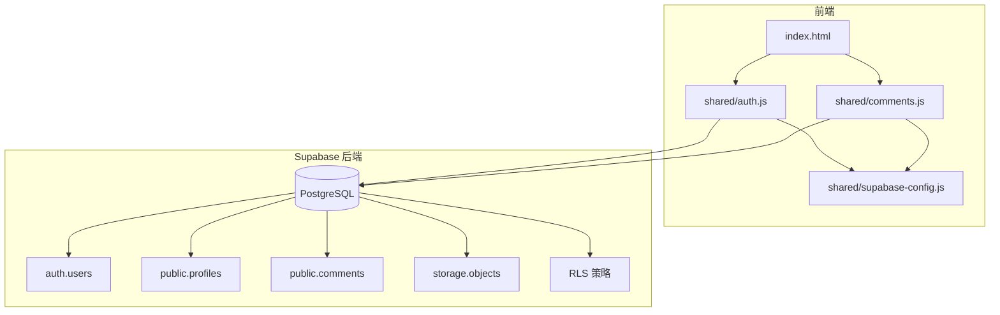
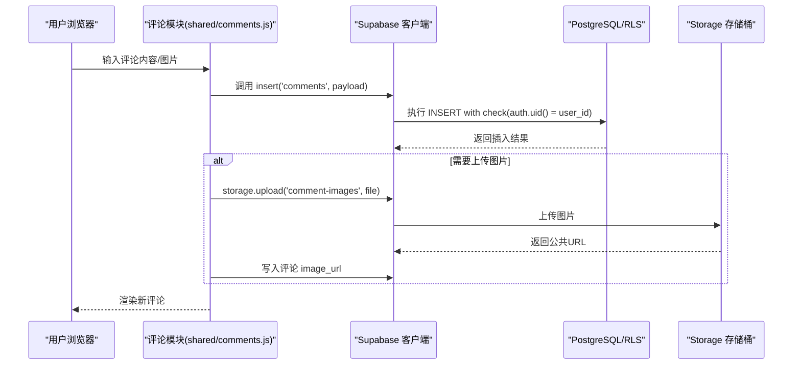
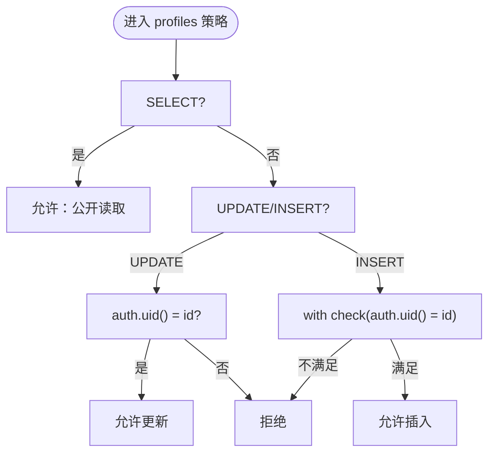
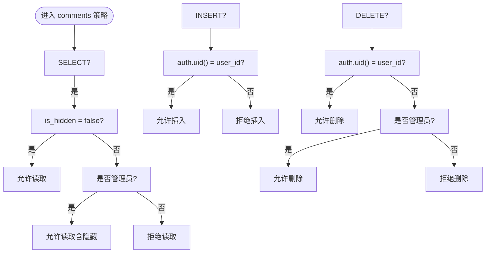
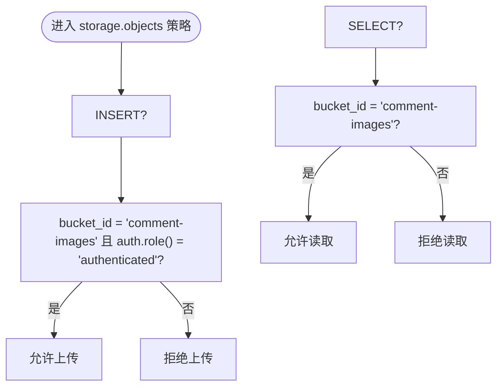
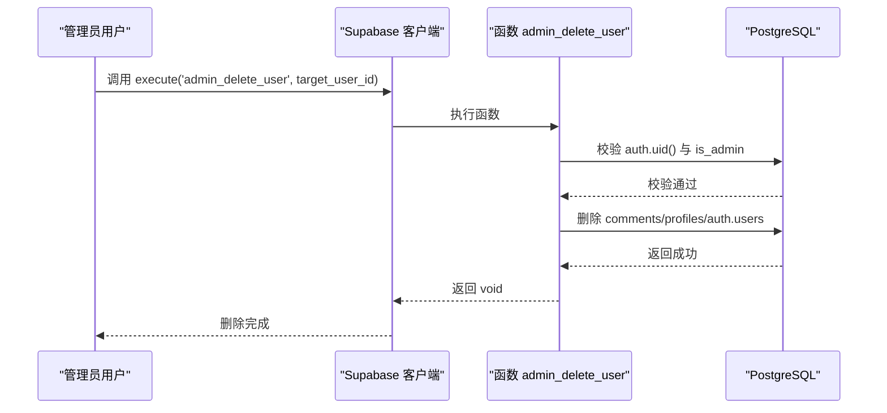
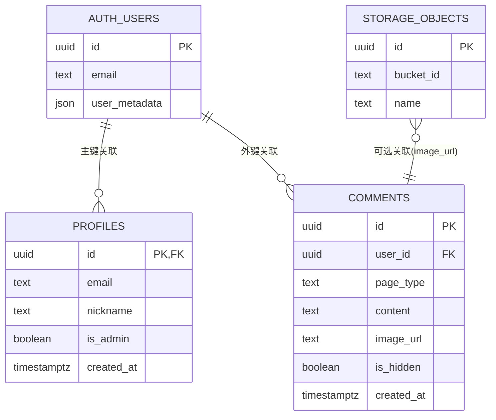

# 行级安全策略

<cite>
**本文档引用的文件**
- [supabase-schema.sql](file://supabase-schema.sql)
- [supabase-community-upgrade.sql](file://supabase-community-upgrade.sql)
- [supabase-repair.sql](file://supabase-repair.sql)
- [supabase-result-views.sql](file://supabase-result-views.sql)
- [supabase-admin-delete-user.sql](file://supabase-admin-delete-user.sql)
- [shared/supabase-config.js](file://shared/supabase-config.js)
- [shared/auth.js](file://shared/auth.js)
- [shared/comments.js](file://shared/comments.js)
</cite>

## 目录
1. [简介](#简介)
2. [项目结构](#项目结构)
3. [核心组件](#核心组件)
4. [架构总览](#架构总览)
5. [详细组件分析](#详细组件分析)
6. [依赖关系分析](#依赖关系分析)
7. [性能考量](#性能考量)
8. [故障排除指南](#故障排除指南)
9. [结论](#结论)
10. [附录](#附录)

## 简介
本文件系统性梳理了 Supabase 行级安全（Row Level Security, RLS）在该项目中的实现与配置，重点覆盖以下方面：
- profiles 表与 comments 表的安全策略设计原理与权限边界
- JWT 令牌验证机制、auth.uid() 与 auth.role() 的使用场景
- 管理员权限模型与“本人”权限模型的组合
- 策略编写最佳实践、权限继承与安全漏洞防范
- 实际 SQL 策略示例与权限测试方法

RLS 是 Supabase 的核心安全能力，通过在数据库层面为每条记录定义访问规则，确保应用层即使被绕过也能受控访问。本项目采用“公开读取 + 本人更新 + 管理员全权”的三层权限模型，并结合存储桶策略实现图片资源的公开读取与登录上传。

## 项目结构
项目采用前端静态页面 + Supabase 后端的架构，前端通过 Supabase JS SDK 与后端交互；数据库侧通过 SQL 脚本初始化表结构、启用 RLS 并创建策略；同时提供修复与升级脚本以保证生产环境一致性。

图表来源
- [supabase-schema.sql:1-97](file://supabase-schema.sql#L1-L97)
- [shared/supabase-config.js:1-26](file://shared/supabase-config.js#L1-L26)
- [shared/auth.js:1-800](file://shared/auth.js#L1-L800)
- [shared/comments.js:1-769](file://shared/comments.js#L1-L769)

章节来源
- [supabase-schema.sql:1-97](file://supabase-schema.sql#L1-L97)
- [shared/supabase-config.js:1-26](file://shared/supabase-config.js#L1-L26)
- [shared/auth.js:1-800](file://shared/auth.js#L1-L800)
- [shared/comments.js:1-769](file://shared/comments.js#L1-L769)

## 核心组件
- 数据库层
  - profiles 表：用户档案，启用 RLS，策略包括公开读取、本人更新、本人插入
  - comments 表：评论内容，启用 RLS，策略包括公开读取未隐藏评论、登录用户发表、本人删除、管理员全读取/隐藏/删除
  - storage.objects：评论图片存储，策略包括登录用户上传、公开读取
- 前端层
  - Supabase 配置：初始化客户端
  - 认证模块：登录/注册/登出、用户状态管理、头像处理
  - 评论模块：评论列表渲染、发布/回复/删除、点赞、图片上传

章节来源
- [supabase-schema.sql:6-97](file://supabase-schema.sql#L6-L97)
- [shared/supabase-config.js:1-26](file://shared/supabase-config.js#L1-L26)
- [shared/auth.js:1-800](file://shared/auth.js#L1-L800)
- [shared/comments.js:1-769](file://shared/comments.js#L1-L769)

## 架构总览
下面的序列图展示了“登录用户发布评论”的典型流程，以及 RLS 如何在数据库层进行权限判定。

图表来源
- [shared/comments.js:511-643](file://shared/comments.js#L511-L643)
- [supabase-schema.sql:56-64](file://supabase-schema.sql#L56-L64)
- [supabase-schema.sql:89-96](file://supabase-schema.sql#L89-L96)

## 详细组件分析

### profiles 表的 RLS 策略
- 设计目标
  - 公开读取：任何用户（含匿名）可读取他人档案
  - 本人更新：仅档案拥有者可更新
  - 本人插入：新用户注册时由触发器自动创建
- 关键点
  - 使用 auth.uid() 与记录主键 id 进行匹配
  - 触发器 on_auth_user_created 自动同步用户元数据

图表来源
- [supabase-schema.sql:15-21](file://supabase-schema.sql#L15-L21)
- [supabase-schema.sql:24-39](file://supabase-schema.sql#L24-L39)

章节来源
- [supabase-schema.sql:6-21](file://supabase-schema.sql#L6-L21)
- [supabase-schema.sql:24-39](file://supabase-schema.sql#L24-L39)

### comments 表的 RLS 策略
- 设计目标
  - 公开读取未隐藏评论：匿名与登录用户可见非隐藏内容
  - 登录用户发表评论：仅 auth.uid() 与 user_id 匹配时允许插入
  - 本人删除评论：仅评论作者可删除
  - 管理员全读取/隐藏/删除：通过 profiles.is_admin 判断
- 关键点
  - 管理员策略使用 exists(select ...) 查询 profiles 表
  - is_hidden 字段用于内容审核与隐藏

图表来源
- [supabase-schema.sql:56-80](file://supabase-schema.sql#L56-L80)

章节来源
- [supabase-schema.sql:42-80](file://supabase-schema.sql#L42-L80)

### Storage 对象的 RLS 策略
- 设计目标
  - 登录用户上传：仅 authenticated 角色可上传至指定存储桶
  - 公开读取：任意用户可读取存储桶内对象
- 关键点
  - 使用 auth.role() 判断角色
  - bucket_id 限定范围

图表来源
- [supabase-schema.sql:89-96](file://supabase-schema.sql#L89-L96)

章节来源
- [supabase-schema.sql:83-96](file://supabase-schema.sql#L83-L96)

### 管理员权限与安全函数
- admin_delete_user 函数
  - 仅 authenticated 用户可调用
  - 仅 is_admin 为 true 的用户可执行删除
  - 删除顺序：评论 -> profiles -> auth.users
- 最佳实践
  - 使用 security definer 与明确的权限回收
  - 严格校验 auth.uid() 与 is_admin

图表来源
- [supabase-admin-delete-user.sql:1-29](file://supabase-admin-delete-user.sql#L1-L29)

章节来源
- [supabase-admin-delete-user.sql:1-29](file://supabase-admin-delete-user.sql#L1-L29)

### 前端集成与权限测试
- Supabase 初始化
  - shared/supabase-config.js 提供全局客户端实例
- 认证与用户状态
  - shared/auth.js 管理登录/注册/登出、用户资料同步、头像上传
- 评论功能
  - shared/comments.js 负责评论列表加载、发布、删除、点赞、图片上传
  - 错误处理包含策略缺失与权限不足的提示

章节来源
- [shared/supabase-config.js:1-26](file://shared/supabase-config.js#L1-L26)
- [shared/auth.js:1-800](file://shared/auth.js#L1-L800)
- [shared/comments.js:1-769](file://shared/comments.js#L1-L769)

## 依赖关系分析
- 表间依赖
  - comments.user_id 引用 auth.users(id)，并受外键约束
  - profiles.id 引用 auth.users(id)，作为主键
- 策略依赖
  - comments 管理员策略依赖 profiles.is_admin
  - Storage 策略依赖 bucket_id 与 auth.role()
- 前端依赖
  - comments.js 依赖 Supabase 客户端与 auth.js 提供的用户状态

图表来源
- [supabase-schema.sql:6-51](file://supabase-schema.sql#L6-L51)
- [supabase-schema.sql:83-96](file://supabase-schema.sql#L83-L96)

章节来源
- [supabase-schema.sql:6-51](file://supabase-schema.sql#L6-L51)
- [supabase-schema.sql:83-96](file://supabase-schema.sql#L83-L96)

## 性能考量
- 索引优化
  - comments 建议按 page_type、parent_comment_id、created_at 排序索引，提升分页与时间线查询性能
  - comment_likes 建议 comment_id 与 user_id 的复合索引，提升点赞查询与去重性能
- 查询模式
  - 读多写少场景优先考虑缓存与分页，避免一次性加载过多评论
  - 使用 LIMIT 与排序字段减少扫描范围
- 存储策略
  - 图片上传使用带缓存控制的策略，避免频繁重复上传

章节来源
- [supabase-community-upgrade.sql:6-23](file://supabase-community-upgrade.sql#L6-L23)
- [supabase-repair.sql:62-82](file://supabase-repair.sql#L62-L82)

## 故障排除指南
- 策略缺失或未生效
  - profiles/评论/Storage 策略缺失时，前端会收到“权限不足”或“表不存在”的错误提示
  - 解决：运行对应升级/修复脚本
- 用户资料列缺失
  - profiles 列变化导致的 schema 缓存问题，前端会检测并回退兼容路径
- 权限不足错误码
  - 42501 或“new row violates row-level security policy”表示策略阻止了操作
  - 解决：确认 auth.uid() 与 user_id 匹配，或管理员身份验证

章节来源
- [shared/comments.js:47-65](file://shared/comments.js#L47-L65)
- [shared/comments.js:634-638](file://shared/comments.js#L634-L638)
- [supabase-community-upgrade.sql:49-76](file://supabase-community-upgrade.sql#L49-L76)

## 结论
本项目通过清晰的三层权限模型（公开读取、本人更新、管理员全权）与严格的 RLS 策略，实现了评论系统的安全与可用性平衡。配合前端的错误处理与兼容逻辑，能够在策略缺失或列变更时保持稳健运行。建议持续维护索引与策略，定期运行修复脚本以确保生产一致性。

## 附录

### RLS 策略清单与示例路径
- profiles 表
  - 公开读取策略：[supabase-schema.sql:19](file://supabase-schema.sql#L19)
  - 本人更新策略：[supabase-schema.sql:20](file://supabase-schema.sql#L20)
  - 本人插入策略：[supabase-schema.sql:21](file://supabase-schema.sql#L21)
- comments 表
  - 公开读取未隐藏评论：[supabase-schema.sql:57-58](file://supabase-schema.sql#L57-L58)
  - 登录用户发表评论：[supabase-schema.sql:60-61](file://supabase-schema.sql#L60-L61)
  - 本人删除评论：[supabase-schema.sql:63-64](file://supabase-schema.sql#L63-L64)
  - 管理员全部读取：[supabase-schema.sql:67-70](file://supabase-schema.sql#L67-L70)
  - 管理员隐藏评论：[supabase-schema.sql:72-75](file://supabase-schema.sql#L72-L75)
  - 管理员删除评论：[supabase-schema.sql:77-80](file://supabase-schema.sql#L77-L80)
- Storage 对象
  - 登录用户上传图片：[supabase-schema.sql:90-93](file://supabase-schema.sql#L90-L93)
  - 公开读取图片：[supabase-schema.sql:95-96](file://supabase-schema.sql#L95-L96)

### 权限测试方法
- 公开读取测试
  - 使用匿名会话访问 comments 表，验证仅返回 is_hidden=false 的记录
- 本人更新测试
  - 使用用户 A 登录，尝试更新用户 B 的 profiles，应被拒绝
- 管理员权限测试
  - 将某用户 profiles.is_admin 设为 true，验证其可读取/隐藏/删除所有评论
- 存储上传测试
  - authenticated 角色上传图片，匿名读取图片，验证策略生效

### 最佳实践清单
- 策略编写规范
  - 使用 with check 与 using 明确区分写入校验与读取条件
  - 管理员策略统一通过 exists(select ...) 查询 profiles.is_admin
- 权限继承
  - 将“本人”权限与“管理员”权限分离，避免交叉授权
- 安全漏洞防范
  - 不在策略中暴露敏感字段或逻辑
  - 使用安全函数（如 admin_delete_user）并回收默认权限
  - 定期审计策略与索引，防止性能退化引发的绕过风险