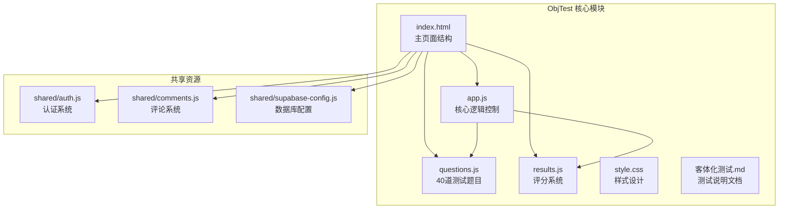
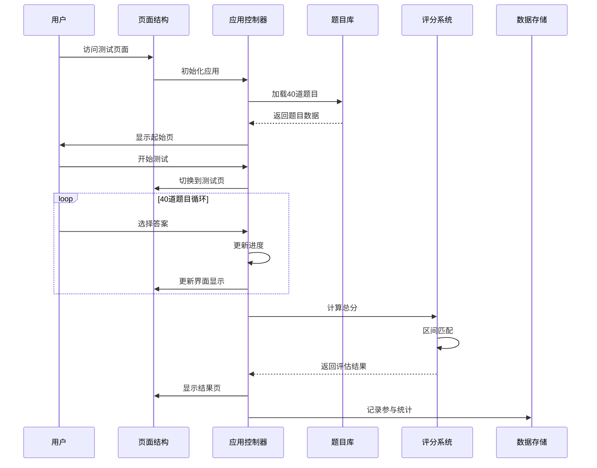
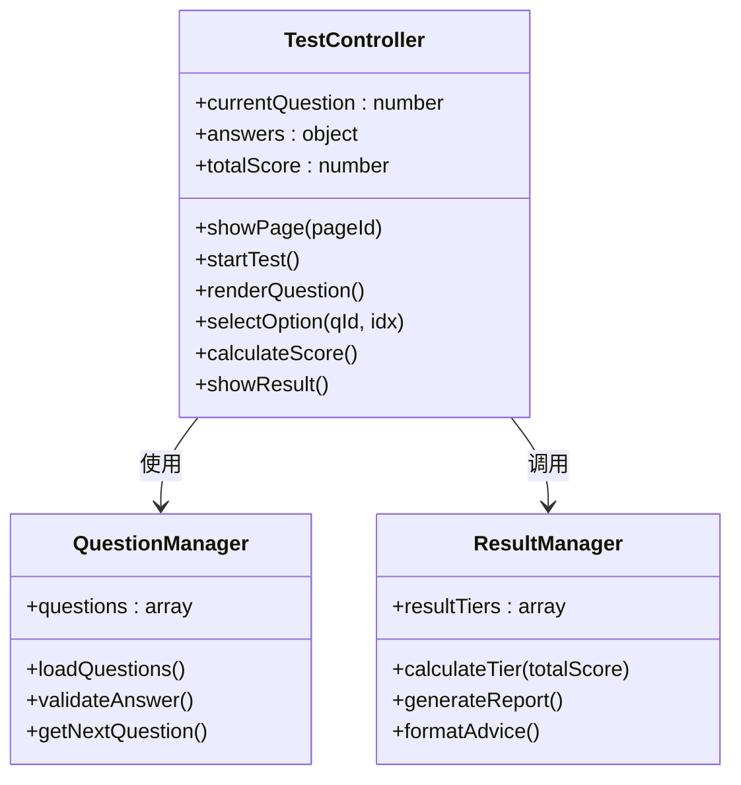
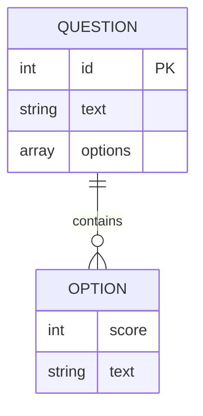
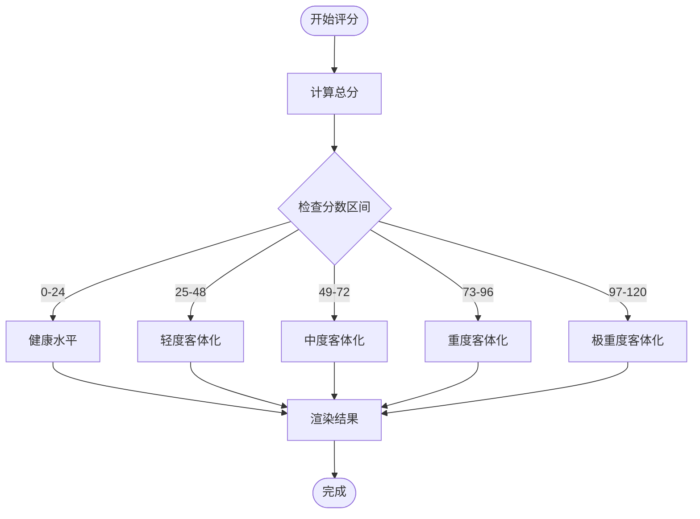
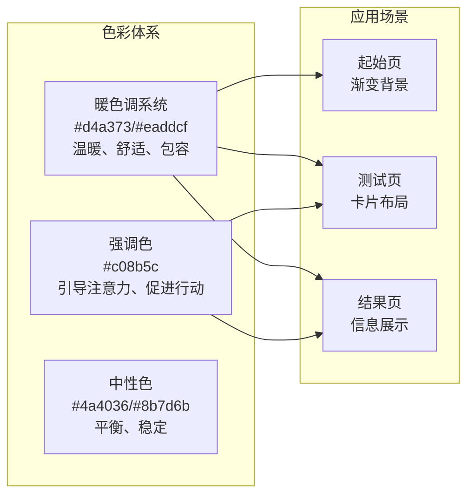
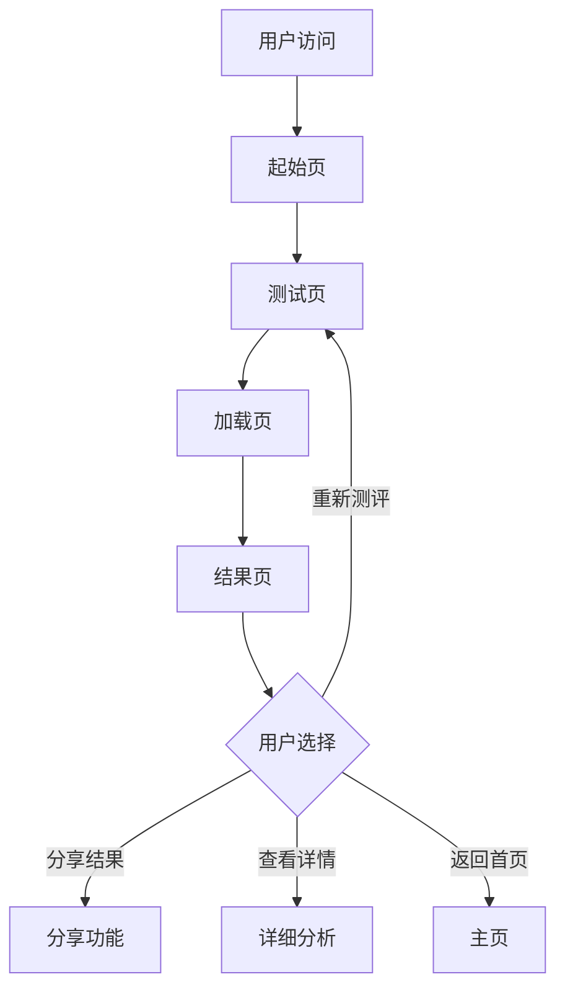
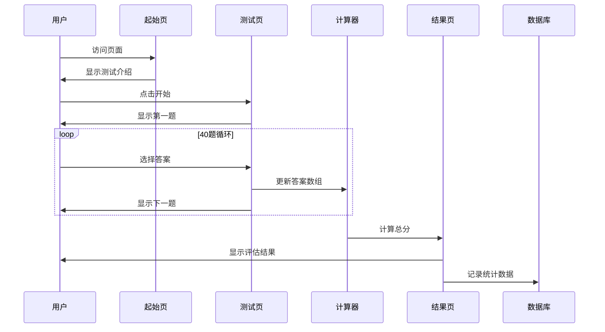
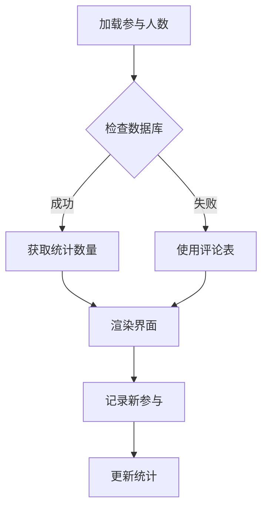

# ObjTest 客体化测试模块

<cite>
**本文档引用的文件**
- [app.js](file://ObjTest/app.js)
- [index.html](file://ObjTest/index.html)
- [questions.js](file://ObjTest/questions.js)
- [style.css](file://ObjTest/style.css)
- [results.js](file://ObjTest/results.js)
- [客体化测试.md](file://ObjTest/客体化测试.md)
</cite>

## 目录
1. [简介](#简介)
2. [项目结构](#项目结构)
3. [核心组件](#核心组件)
4. [架构概览](#架构概览)
5. [详细组件分析](#详细组件分析)
6. [评分系统与结果分析](#评分系统与结果分析)
7. [界面设计与用户体验](#界面设计与用户体验)
8. [数据流与处理逻辑](#数据流与处理逻辑)
9. [性能考虑](#性能考虑)
10. [故障排除指南](#故障排除指南)
11. [结论](#结论)

## 简介

ObjTest客体化测试模块是一个基于Web的心理测评工具，专门用于评估个体的自我客体化程度。该模块包含40道精心设计的核心题目，采用传统的心理测量学方法，通过量化分析个体在人际关系、自我认知、边界设定等方面的表现，提供个性化的心理状态评估和建议。

客体化测试的核心理念是识别和评估个体将自身视为工具、物品或他人实现目的手段的倾向程度。这种现象在现代高压社会环境中尤为常见，可能导致心理健康问题和人际关系困扰。

## 项目结构

ObjTest模块采用简洁而高效的前端架构，主要由以下核心文件组成：

**图表来源**
- [index.html:1-170](file://ObjTest/index.html#L1-L170)
- [app.js:1-327](file://ObjTest/app.js#L1-L327)

**章节来源**
- [index.html:1-170](file://ObjTest/index.html#L1-L170)
- [app.js:1-327](file://ObjTest/app.js#L1-L327)

## 核心组件

### 测试题目系统

测试包含40道精心设计的单选题，覆盖以下关键维度：

- **自我价值认知**：评估个体对自身价值的内在认知程度
- **边界设定能力**：测量个人边界意识和维护能力
- **关系模式**：分析在各种关系中的主体性表现
- **情绪表达**：评估真实情感表达的自由度
- **身份认同**：识别自我身份的清晰度和稳定性

每个题目提供四个选项，分别对应不同的分数值（0-3分），总分为0-120分。

### 评分算法系统

评分系统采用区间划分法，将总分划分为五个等级：

| 分数区间 | 等级 | 特征描述 |
|---------|------|----------|
| 0-24分 | 健康水平 | 稳定的自我价值感，清晰的边界 |
| 25-48分 | 轻度客体化 | 偶尔过度在意他人评价 |
| 49-72分 | 中度客体化 | 显著依赖外部评价 |
| 73-96分 | 重度客体化 | 严重依赖他人认可 |
| 97-120分 | 极重度客体化 | 完全失去主体性 |

### 用户界面组件

系统采用三页式界面设计：
- **起始页**：介绍测试目的、计分规则和免责声明
- **测试页**：40道题目的交互式答题界面
- **结果页**：个性化的评估报告和建议

**章节来源**
- [questions.js:1-403](file://ObjTest/questions.js#L1-L403)
- [results.js:8-54](file://ObjTest/results.js#L8-L54)

## 架构概览

ObjTest采用模块化的前端架构，实现了清晰的关注点分离：

**图表来源**
- [app.js:86-242](file://ObjTest/app.js#L86-L242)
- [questions.js:1-403](file://ObjTest.questions.js#L1-L403)
- [results.js:8-54](file://ObjTest/results.js#L8-L54)

## 详细组件分析

### 应用控制器（app.js）

应用控制器是整个模块的核心，负责协调各个组件的工作流程：

#### 核心状态管理

**图表来源**
- [app.js:1-327](file://ObjTest/app.js#L1-L327)

#### 页面导航系统

应用实现了流畅的页面切换机制，支持三种状态页面：

- **起始页（landing）**：提供测试介绍和开始按钮
- **测试页（quiz）**：40道题目的答题界面
- **结果页（result）**：个性化的评估报告

页面切换通过CSS类名控制，配合平滑的过渡动画提升用户体验。

#### 交互逻辑设计

系统支持多种交互方式：
- **鼠标点击**：标准的触摸屏操作
- **键盘导航**：使用方向键和数字键快速答题
- **进度跟踪**：实时显示答题进度和剩余题目

**章节来源**
- [app.js:71-84](file://ObjTest/app.js#L71-L84)
- [app.js:147-169](file://ObjTest/app.js#L147-L169)
- [app.js:306-325](file://ObjTest/app.js#L306-L325)

### 题目管理系统（questions.js）

题目系统采用JSON格式存储，确保了数据的可读性和可维护性：

#### 题目结构设计

**图表来源**
- [questions.js:1-403](file://ObjTest.questions.js#L1-L403)

#### 题目分类体系

题目按照心理学理论框架进行分类：

| 维度类别 | 题目数量 | 关键特征 |
|---------|---------|----------|
| 自我价值认知 | 8题 | 价值来源、自我评价、成就动机 |
| 边界设定能力 | 8题 | 个人边界、拒绝能力、边界侵犯 |
| 关系模式 | 10题 | 亲密关系、权力平衡、角色定位 |
| 情绪表达 | 6题 | 情感真实性、情绪需求、情绪价值 |
| 身份认同 | 8题 | 自我认知、角色混淆、存在意义 |

**章节来源**
- [questions.js:1-403](file://ObjTest.questions.js#L1-L403)

### 评分系统（results.js）

评分系统采用层次化的评估框架：

#### 结果分级机制

**图表来源**
- [app.js:207-242](file://ObjTest/app.js#L207-L242)
- [results.js:8-54](file://ObjTest/results.js#L8-L54)

#### 结果报告结构

每个评估级别包含三个核心部分：

1. **主要特征**：详细的症状描述和行为表现
2. **心理状态**：当前的心理健康状况分析
3. **建议与行动**：具体的改善建议和行动计划

**章节来源**
- [results.js:8-54](file://ObjTest/results.js#L8-L54)

## 评分系统与结果分析

### 评分算法原理

评分系统基于传统的心理测量学原理，采用以下设计原则：

#### 分数分配策略

- **线性评分**：每个题目提供0-3分的连续评分尺度
- **累积计算**：所有题目的分数直接相加得到总分
- **区间划分**：将0-120分的范围划分为五个等级区间

#### 等级划分依据

等级划分不仅考虑分数高低，更重要的是反映心理状态的严重程度：

| 等级 | 分数范围 | 心理状态特征 | 建议干预强度 |
|------|----------|-------------|-------------|
| 健康 | 0-24分 | 自我价值稳定，边界清晰 | 自我观察 |
| 轻度 | 25-48分 | 偶尔依赖他人评价 | 日常调节 |
| 中度 | 49-72分 | 显著依赖外部认可 | 专业咨询 |
| 重度 | 73-96分 | 严重心理危机 | 紧急干预 |
| 极重度 | 97-120分 | 危险心理状态 | 立即救援 |

### 结果分析机制

#### 多维度分析框架

系统采用多维度分析方法，从以下角度评估个体状况：

1. **认知层面**：自我价值认知、身份认同清晰度
2. **行为层面**：边界设定、关系模式、情绪表达
3. **情感层面**：空虚感、焦虑、抑郁倾向
4. **社交层面**：人际关系质量、社会支持系统

#### 动态风险评估

系统能够识别潜在的心理健康风险信号，特别是对于高危群体提供及时预警。

**章节来源**
- [app.js:207-242](file://ObjTest/app.js#L207-L242)
- [客体化测试.md:431-521](file://ObjTest/客体化测试.md#L431-L521)

## 界面设计与用户体验

### 视觉设计系统

ObjTest采用温暖的心理学主题色彩，营造舒适的测评环境：

#### 色彩心理学应用

**图表来源**
- [style.css:1-28](file://ObjTest/style.css#L1-L28)

#### 响应式设计

系统支持从手机到桌面端的完整设备适配：

- **移动优先**：针对小屏幕优化的触摸交互
- **平板适配**：横向布局和字体调整
- **桌面优化**：最大化信息密度和操作效率

### 交互体验设计

#### 导航设计

系统采用简洁直观的导航模式：

**图表来源**
- [index.html:34-158](file://ObjTest/index.html#L34-L158)

#### 反馈机制

系统提供多层次的即时反馈：

- **视觉反馈**：按钮状态变化、进度条更新
- **触觉反馈**：点击效果、滑动动画
- **语音反馈**：加载过程中的状态提示

**章节来源**
- [style.css:577-612](file://ObjTest/style.css#L577-L612)
- [app.js:94-145](file://ObjTest/app.js#L94-L145)

## 数据流与处理逻辑

### 测评流程

**图表来源**
- [app.js:86-242](file://ObjTest/app.js#L86-L242)

### 数据持久化

系统集成了Supabase数据库，实现数据的云端存储：

#### 参与统计功能

**图表来源**
- [app.js:23-64](file://ObjTest/app.js#L23-L64)

#### 结果追踪机制

系统能够追踪用户的测试参与情况，为后续研究和改进提供数据支持。

**章节来源**
- [app.js:23-64](file://ObjTest/app.js#L23-L64)
- [app.js:53-64](file://ObjTest/app.js#L53-L64)

## 性能考虑

### 前端性能优化

系统采用了多项性能优化措施：

#### 资源加载策略

- **按需加载**：JavaScript文件采用延迟加载
- **缓存策略**：静态资源设置合理的缓存头
- **压缩优化**：CSS和JavaScript文件经过压缩处理

#### 内存管理

- **状态清理**：测试结束后清理内存占用
- **事件监听**：合理管理DOM事件绑定
- **垃圾回收**：避免内存泄漏的代码模式

### 用户体验优化

#### 加载体验

系统提供了丰富的加载状态反馈：

- **进度指示**：详细的进度条和百分比显示
- **状态提示**：动态的加载文本变化
- **防重复提交**：防止用户重复提交测试

#### 错误处理

系统具备完善的错误处理机制：

- **网络异常**：优雅降级到本地功能
- **数据异常**：提供默认值和回退方案
- **用户错误**：友好的错误提示和恢复路径

## 故障排除指南

### 常见问题诊断

#### 测试无法开始

**可能原因**：
- JavaScript文件加载失败
- 网络连接异常
- 浏览器兼容性问题

**解决方案**：
- 检查浏览器控制台错误信息
- 确认网络连接稳定
- 尝试使用最新版本的浏览器

#### 结果无法显示

**可能原因**：
- 数据库连接失败
- 评分计算异常
- DOM元素加载顺序问题

**解决方案**：
- 检查Supabase配置
- 验证评分算法逻辑
- 确认DOM元素正确加载

#### 移动端适配问题

**可能原因**：
- 触摸事件处理不当
- 字体大小适配问题
- 屏幕旋转响应异常

**解决方案**：
- 检查触摸事件监听器
- 验证媒体查询设置
- 测试不同设备的响应性

### 开发调试技巧

#### 调试工具使用

- **浏览器开发者工具**：监控网络请求和JavaScript执行
- **控制台日志**：添加详细的调试信息输出
- **性能分析**：使用性能面板分析运行时开销

#### 单元测试建议

虽然当前项目未包含单元测试，但建议在扩展开发时加入：

- **函数测试**：验证评分计算的准确性
- **UI测试**：确保界面交互的正确性
- **集成测试**：测试完整的用户流程

**章节来源**
- [app.js:47-50](file://ObjTest/app.js#L47-L50)
- [app.js:291-299](file://ObjTest/app.js#L291-L299)

## 结论

ObjTest客体化测试模块是一个设计精良的心理测评工具，具有以下突出特点：

### 技术优势

1. **架构清晰**：采用模块化设计，职责分离明确
2. **用户体验优秀**：界面友好，交互流畅
3. **数据驱动**：基于科学的心理测量学原理
4. **可扩展性强**：易于维护和功能扩展

### 实用价值

1. **科学性**：基于成熟的心理学理论框架
2. **实用性**：提供具体可行的改进建议
3. **可及性**：在线免费使用，覆盖面广
4. **安全性**：保护用户隐私，提供心理危机预警

### 发展前景

该模块为心理健康领域的数字化转型提供了良好的范例，未来可以在以下方面进一步完善：

- **AI辅助分析**：引入机器学习算法提供更精准的评估
- **个性化推荐**：根据评估结果提供定制化的干预方案
- **社区支持**：建立用户社区，提供同伴支持
- **专业集成**：与医疗机构系统对接，提供专业的转介服务

通过持续的技术创新和内容优化，ObjTest客体化测试模块有望成为心理健康自助测评领域的重要工具，为更多用户提供及时、便捷、专业的心理支持服务。