# SoulLab 人格测试模块

<cite>
**本文档引用的文件**
- [index.html](file://SoulLab/index.html)
- [app.js](file://SoulLab/app.js)
- [questions.js](file://SoulLab/questions.js)
- [results.js](file://SoulLab/results.js)
- [style.css](file://SoulLab/style.css)
- [types.html](file://SoulLab/types.html)
- [types.js](file://SoulLab/types.js)
- [types.css](file://SoulLab/types.css)
</cite>

## 目录
1. [简介](#简介)
2. [项目结构](#项目结构)
3. [核心组件](#核心组件)
4. [架构概览](#架构概览)
5. [详细组件分析](#详细组件分析)
6. [依赖关系分析](#依赖关系分析)
7. [性能考虑](#性能考虑)
8. [故障排除指南](#故障排除指南)
9. [结论](#结论)
10. [附录](#附录)

## 简介

SoulLab 人格测试模块是一个融合灵性觉醒、MBTI与SBTI恶搞体系的33道深度心理问题测试系统。该模块包含12种独特的人格类型，通过精心设计的心理学题目和评分算法，为用户提供个性化的心理画像。

该测试模块采用现代化的前端技术栈，实现了流畅的用户体验、响应式设计和丰富的视觉效果。系统支持实时进度跟踪、智能评分计算、动态结果展示和社交分享功能。

## 项目结构

SoulLab模块采用清晰的文件组织结构，主要包含以下核心文件：

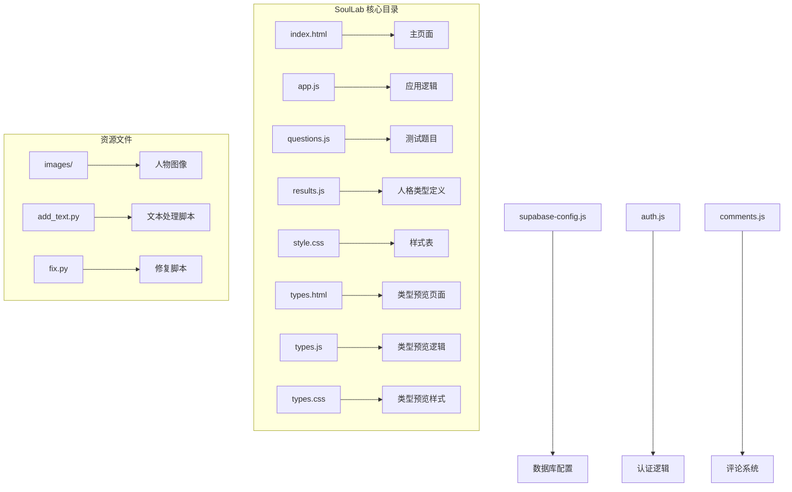

**图表来源**
- [index.html:1-271](file://SoulLab/index.html#L1-L271)
- [app.js:1-613](file://SoulLab/app.js#L1-L613)
- [types.html:1-125](file://SoulLab/types.html#L1-L125)

**章节来源**
- [index.html:1-271](file://SoulLab/index.html#L1-L271)
- [types.html:1-125](file://SoulLab/types.html#L1-L125)

## 核心组件

### 12种独特人格类型系统

系统定义了12种融合灵性觉醒、MBTI和SBTI元素的独特人格类型：

| 人格类型 | 缩写 | 核心特征 | 主要标签 |
|---------|------|----------|----------|
| 精致面具者 | mask | 表面优雅，内心恐惧 | 面具大师、优雅防御、渴望认可 |
| 知识囤积者 | hoard | 理论至上，拒绝实践 | 理论派、永远在学习、概念收集器 |
| 浪漫逃避者 | escape | 用修行逃离现实 | 乌托邦信徒、自卑驱动、逃避虚无 |
| 愤世解构者 | rebel | 反抗权威，内心恐惧 | 拆台专家、反骨青年、愤世嫉俗 |
| 边缘观察者 | edge | 超越常人视角 | 灵魂局外人、过早觉醒、孤独感知者 |
| 绝望坠落者 | crash | 世界观崩塌后的重生 | 世界观崩塌、死而重生、深渊潜水员 |
| 佛系摆烂者 | chill | 极致躺平的哲学 | 极致摆烂、佛系统治、躺平禅师 |
| 社交小丑者 | clown | 幽默作为防御机制 | 气氛担当、段子手、笑中带泪 |
| 操心圣母者 | mama | 过度共情的治愈者 | 人间解药、情感充电宝、自我牺牲 |
| 极简游离者 | hustle | 理智至上的情感隔离者 | 绝对理智、情感断舍离、高冷旁观 |
| 混沌野草者 | chaos | 野生求生的自由主义者 | 不可被杀死、荒野求生、快乐原住民 |
| 恒久觉察者 | awake | 超越角色认同的觉者 | 无我状态、真相极客、灵魂裸奔 |

**章节来源**
- [results.js:6-139](file://SoulLab/results.js#L6-L139)

### 评分系统和算法

每个题目包含3-4个选项，每个选项对不同人格类型有不同的分数权重。评分算法采用累加计算：

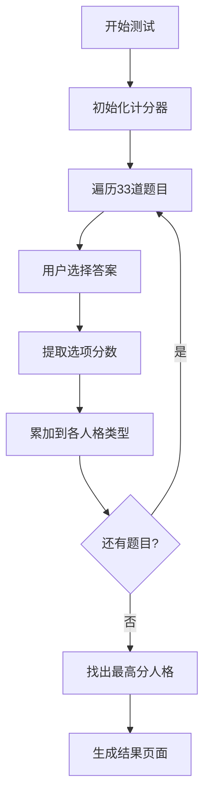

**图表来源**
- [app.js:334-351](file://SoulLab/app.js#L334-L351)

**章节来源**
- [questions.js:20-351](file://SoulLab/questions.js#L20-L351)
- [app.js:334-351](file://SoulLab/app.js#L334-L351)

## 架构概览

SoulLab采用模块化的前端架构，主要分为以下几个层次：

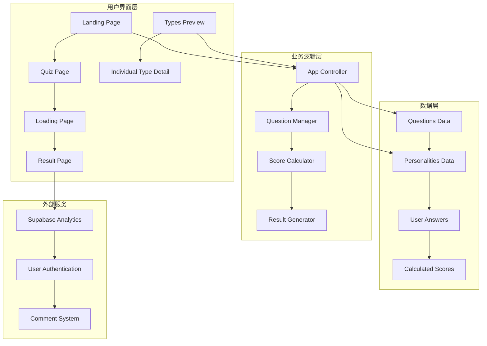

**图表来源**
- [index.html:43-238](file://SoulLab/index.html#L43-L238)
- [app.js:1-613](file://SoulLab/app.js#L1-L613)

### 数据流架构

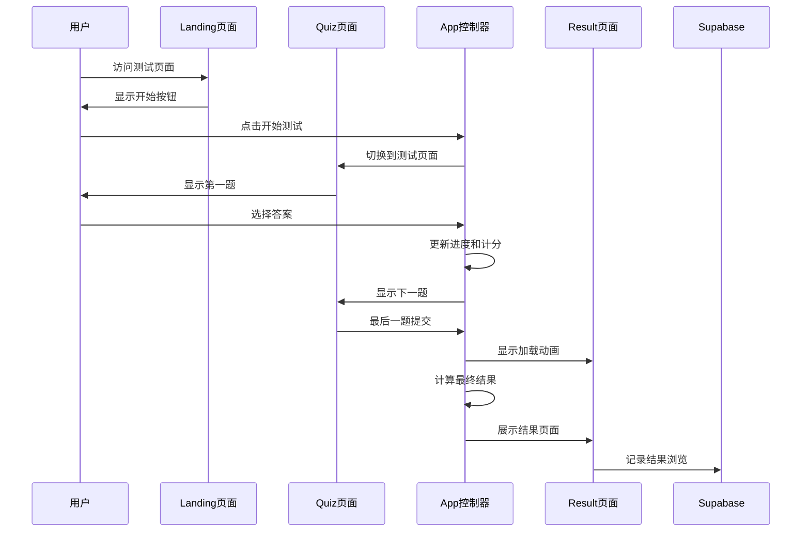

**图表来源**
- [app.js:182-405](file://SoulLab/app.js#L182-L405)

**章节来源**
- [app.js:1-613](file://SoulLab/app.js#L1-L613)

## 详细组件分析

### 测试流程实现

#### 进度跟踪系统

测试流程采用完整的进度跟踪机制：

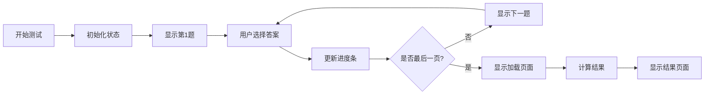

**图表来源**
- [app.js:193-235](file://SoulLab/app.js#L193-L235)
- [app.js:278-299](file://SoulLab/app.js#L278-L299)

#### 选项处理机制

每个题目包含多个选项，采用统一的处理模板：

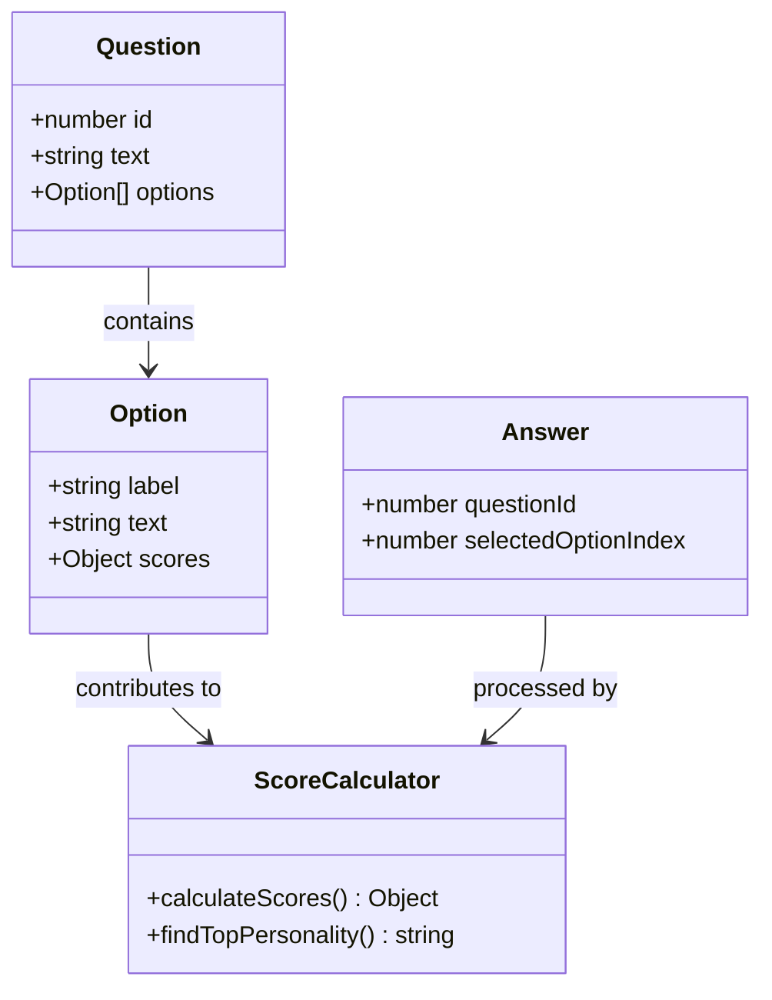

**图表来源**
- [questions.js:20-351](file://SoulLab/questions.js#L20-L351)
- [app.js:334-351](file://SoulLab/app.js#L334-L351)

**章节来源**
- [app.js:193-273](file://SoulLab/app.js#L193-L273)

### 结果计算算法

#### 核心评分算法

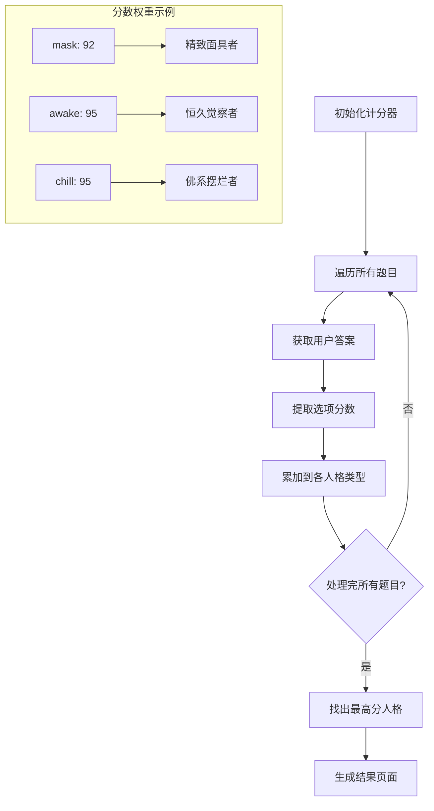

**图表来源**
- [app.js:334-405](file://SoulLab/app.js#L334-L405)
- [results.js:6-139](file://SoulLab/results.js#L6-L139)

#### 仪表盘动画系统

结果页面包含四个关键指标的动画展示：

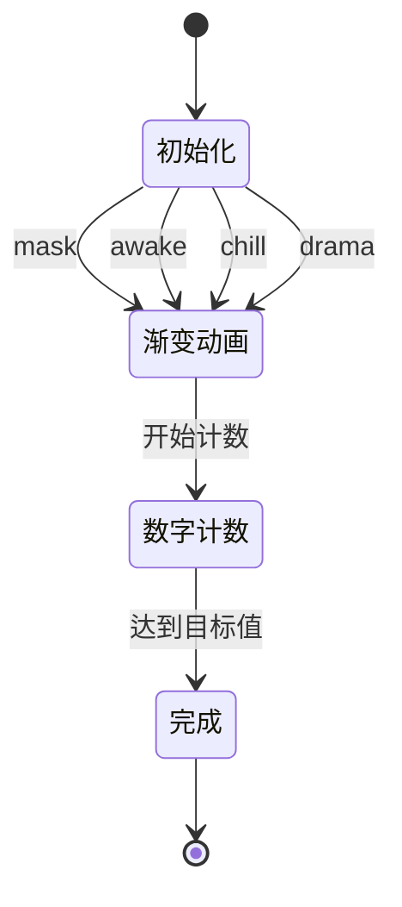

**图表来源**
- [app.js:407-424](file://SoulLab/app.js#L407-L424)

**章节来源**
- [app.js:334-424](file://SoulLab/app.js#L334-L424)

### 人格类型系统

#### 分类标准和特征描述

每种人格类型都有独特的分类标准：

| 分类维度 | 定义 | 特征表现 |
|---------|------|----------|
| **面具厚度** | 表面表现与真实自我的差距 | 0-100%，数值越高表示越依赖社会面具 |
| **灵魂清醒度** | 对现实和自我的认知程度 | 0-100%，数值越高表示越接近真实自我 |
| **摆烂指数** | 对生活的投入程度 | 0-100%，数值越高表示越不关心外界 |
| **内心戏浓度** | 内在思维活动的丰富程度 | 0-100%，数值越高表示越容易自我对话 |

#### 视觉呈现方式

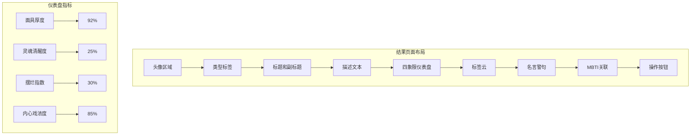

**图表来源**
- [index.html:142-238](file://SoulLab/index.html#L142-L238)
- [results.js:6-139](file://SoulLab/results.js#L6-L139)

**章节来源**
- [results.js:6-139](file://SoulLab/results.js#L6-L139)

### 类型预览系统

#### 网格布局和详情展示

类型预览页面采用响应式网格布局：

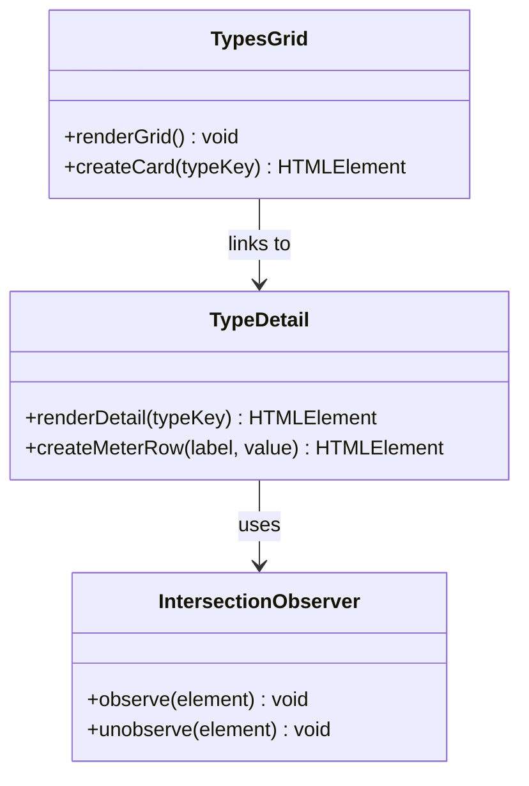

**图表来源**
- [types.js:71-231](file://SoulLab/types.js#L71-L231)

#### 滚动交互机制

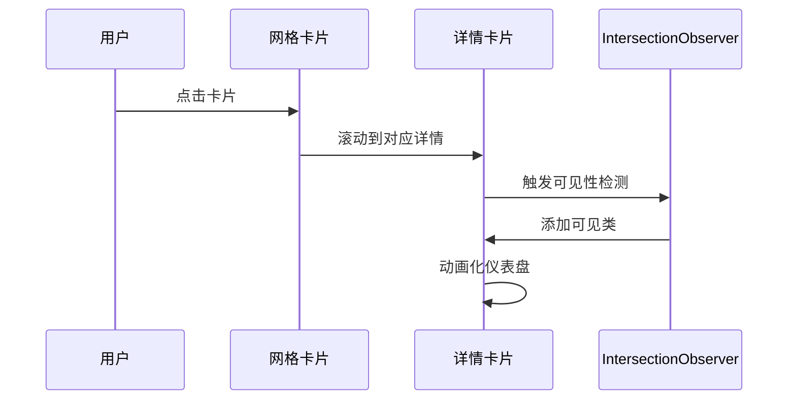

**图表来源**
- [types.js:155-177](file://SoulLab/types.js#L155-L177)
- [types.js:182-214](file://SoulLab/types.js#L182-L214)

**章节来源**
- [types.js:71-231](file://SoulLab/types.js#L71-L231)

## 依赖关系分析

### 核心依赖关系

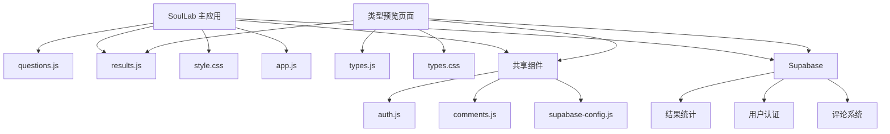

**图表来源**
- [index.html:249-255](file://SoulLab/index.html#L249-L255)
- [types.html:120-121](file://SoulLab/types.html#L120-L121)

### 外部依赖和服务集成

系统集成了多个外部服务：

| 服务 | 用途 | 配置位置 |
|------|------|----------|
| Supabase | 数据库和用户管理 | supabase-config.js |
| 百度统计 | 用户行为分析 | index.html |
| html2canvas | 结果海报生成 | app.js |
| Firebase | 用户认证 | shared/auth.js |

**章节来源**
- [index.html:4-12](file://SoulLab/index.html#L4-L12)
- [app.js:436-546](file://SoulLab/app.js#L436-L546)

## 性能考虑

### 前端性能优化

系统采用了多项性能优化策略：

1. **懒加载和延迟加载**
   - 图片使用 `loading="lazy"` 属性
   - 评论系统按需加载
   - 结果海报生成使用延迟执行

2. **内存管理**
   - 使用 `IntersectionObserver` 管理滚动事件
   - 及时清理定时器和事件监听器
   - 合理的DOM节点复用

3. **渲染优化**
   - CSS3硬件加速动画
   - 减少重绘和重排
   - 合理的z-index层级管理

### 数据处理优化

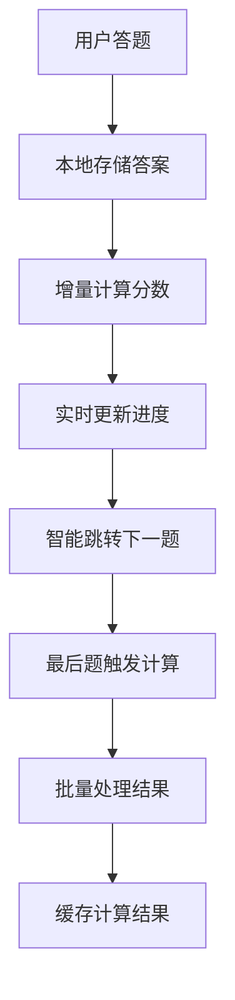

**图表来源**
- [app.js:240-257](file://SoulLab/app.js#L240-L257)
- [app.js:334-351](file://SoulLab/app.js#L334-L351)

## 故障排除指南

### 常见问题和解决方案

#### 测试无法开始
**症状**: 点击开始按钮无响应
**可能原因**:
- JavaScript文件加载失败
- DOM元素未正确初始化
- 浏览器兼容性问题

**解决方案**:
1. 检查浏览器控制台错误
2. 确认所有JavaScript文件正确加载
3. 清除浏览器缓存后重试

#### 结果计算异常
**症状**: 测试完成后显示空白或错误结果
**可能原因**:
- 评分算法错误
- 人格数据缺失
- 本地存储问题

**解决方案**:
1. 检查 `results.js` 中的人格定义
2. 验证 `questions.js` 中的分数权重
3. 清除浏览器本地存储

#### 图片加载失败
**症状**: 人物头像或背景图片显示为占位符
**可能原因**:
- 图片路径错误
- CORS跨域问题
- 服务器配置问题

**解决方案**:
1. 检查图片文件是否存在
2. 验证图片路径和权限
3. 检查服务器CORS配置

**章节来源**
- [app.js:548-554](file://SoulLab/app.js#L548-L554)
- [app.js:518-527](file://SoulLab/app.js#L518-L527)

## 结论

SoulLab人格测试模块是一个设计精良、功能完整的人格评估系统。该模块成功地将复杂的心理学概念转化为易于理解和互动的数字体验。

### 主要优势

1. **设计理念先进**: 融合灵性觉醒、MBTI和SBTI元素，创造独特的12种人格类型
2. **用户体验优秀**: 流畅的动画效果、响应式设计和直观的操作界面
3. **技术实现成熟**: 模块化架构、良好的性能优化和完善的错误处理
4. **扩展性强**: 清晰的数据结构和算法，便于添加新类型和题目

### 改进建议

1. **增加个性化定制**: 允许用户调整题目难度或选择特定主题
2. **增强社交功能**: 添加好友对比、排行榜等社交元素
3. **完善数据分析**: 提供更详细的个人发展建议和成长轨迹
4. **移动端优化**: 针对移动设备进一步优化触摸交互体验

## 附录

### 测试题目扩展指南

#### 新增题目步骤

1. **分析题目类型**: 确定题目涉及的心理学维度
2. **设计选项权重**: 为每个选项分配不同人格类型的分数
3. **验证逻辑一致性**: 确保题目与现有类型体系协调
4. **测试题目质量**: 进行小范围测试验证题目有效性

#### 新增人格类型步骤

1. **定义类型特征**: 明确新类型的核心特征和表现
2. **设计评分权重**: 为新类型设计合理的分数分布
3. **编写描述文本**: 创建吸引人的类型描述和标签
4. **测试类型有效性**: 验证新类型与其他类型的区分度

### 自定义样式实现方案

#### 主题定制

系统支持通过CSS变量进行主题定制：

```css
:root {
  --bg-primary: #0a0a1a;        /* 主背景色 */
  --bg-secondary: #12122a;       /* 次背景色 */
  --accent-1: #a78bfa;          /* 强调色1 */
  --accent-2: #818cf8;          /* 强调色2 */
  --text-primary: #f1f0ff;      /* 主文字色 */
}
```

#### 响应式设计

系统采用移动优先的设计策略，支持多种屏幕尺寸：

- **移动端**: 320px-480px
- **平板**: 768px-1024px  
- **桌面端**: 1024px+

#### 动画效果

系统包含丰富的CSS动画效果：

- **页面切换**: 淡入淡出动画
- **按钮交互**: 悬停和点击反馈
- **进度指示**: 流畅的进度条动画
- **仪表盘**: 数字计数和渐变动画