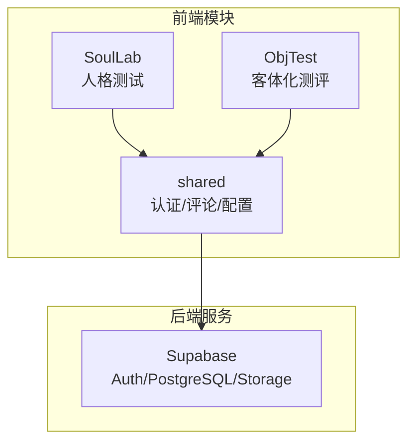
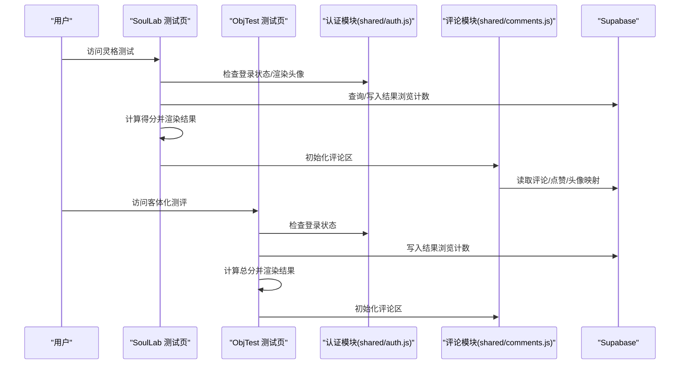
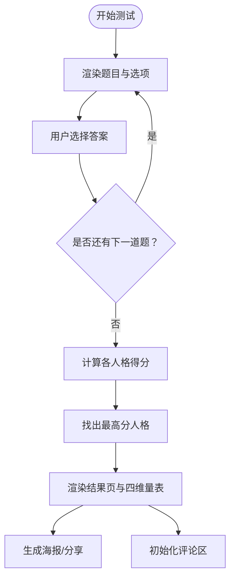
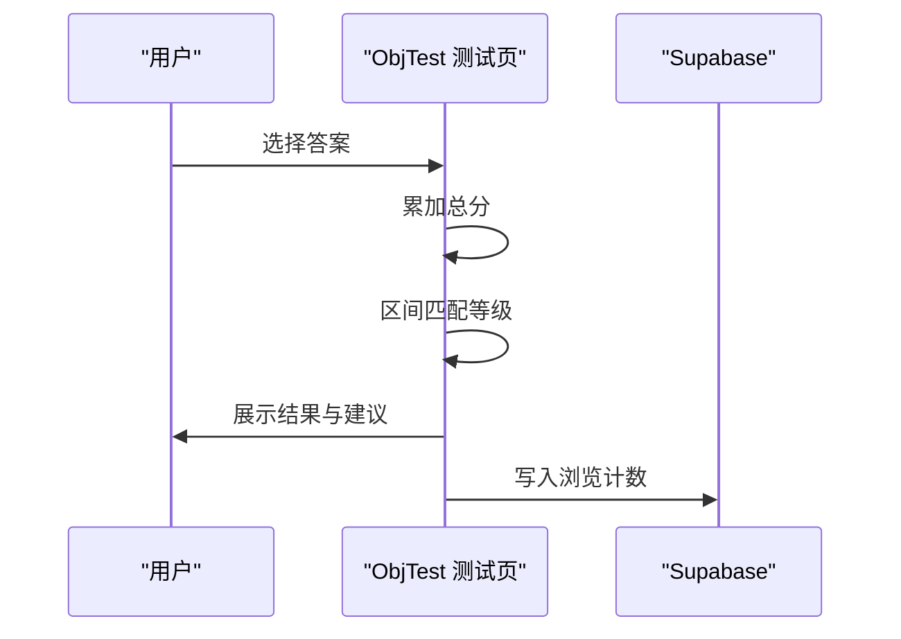
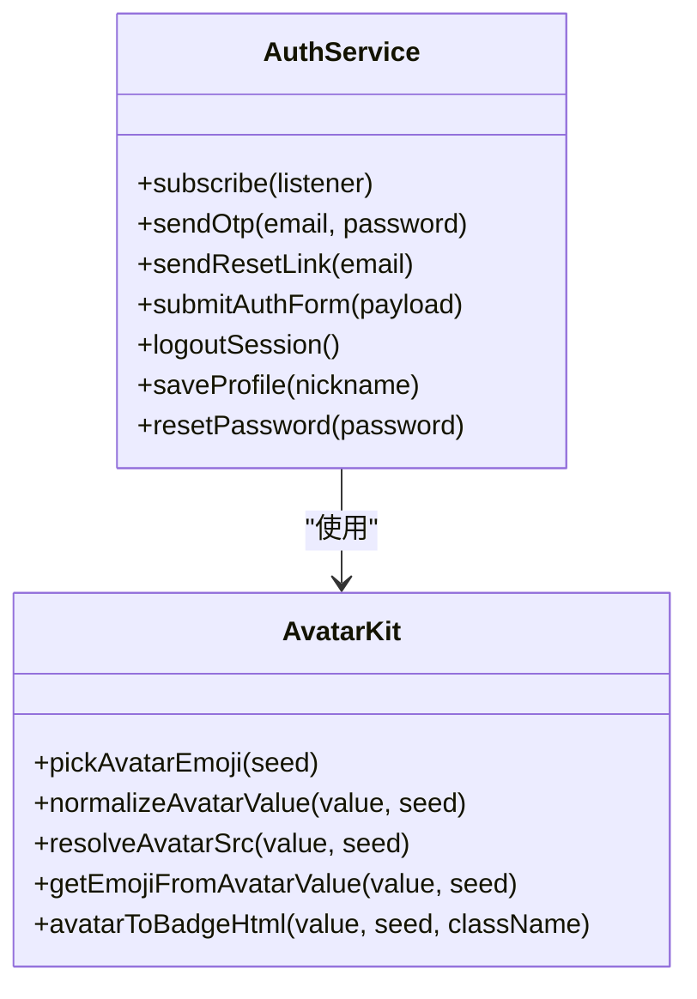
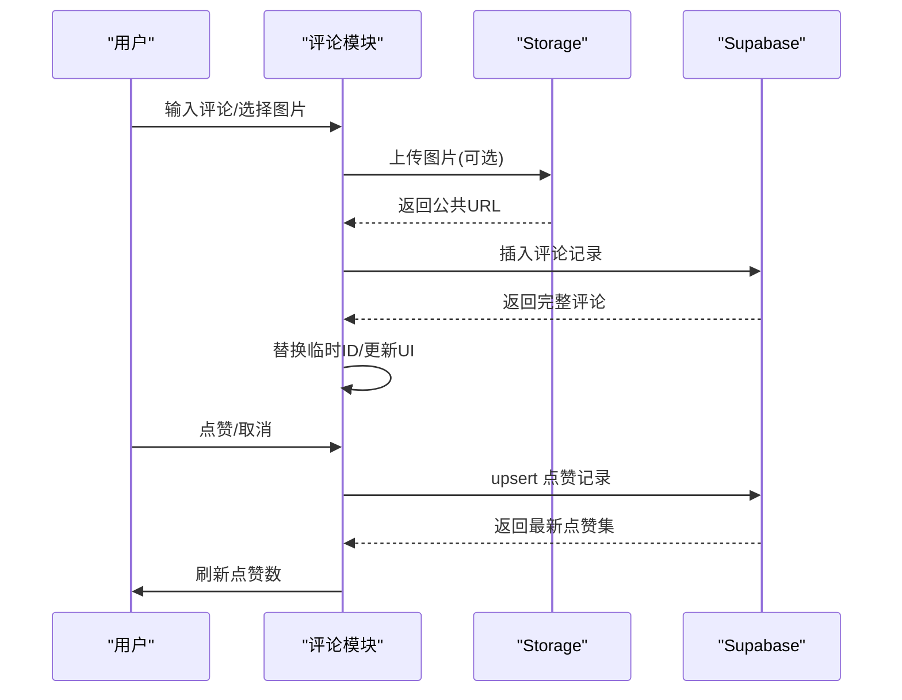
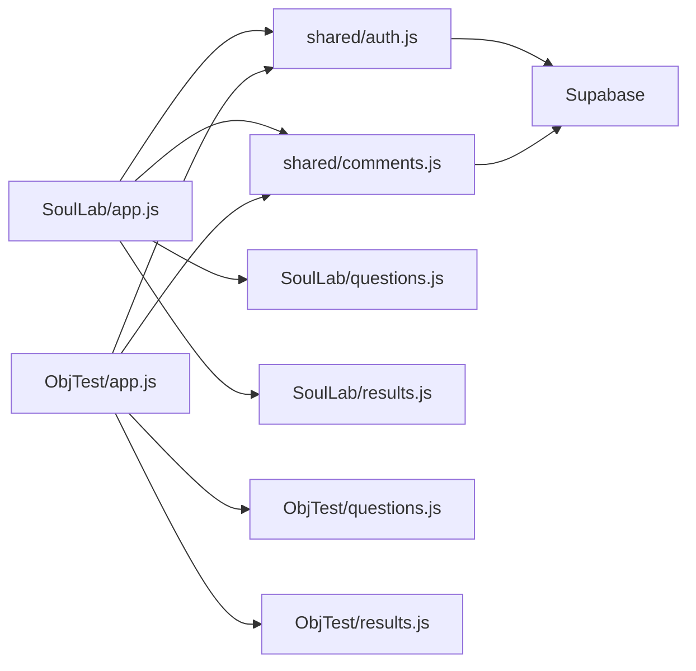

# 核心模块

<cite>
**本文引用的文件**
- [SoulLab/index.html](file://SoulLab/index.html)
- [SoulLab/app.js](file://SoulLab/app.js)
- [SoulLab/questions.js](file://SoulLab/questions.js)
- [SoulLab/results.js](file://SoulLab/results.js)
- [SoulLab/types.html](file://SoulLab/types.html)
- [SoulLab/types.js](file://SoulLab/types.js)
- [SoulLab/style.css](file://SoulLab/style.css)
- [ObjTest/index.html](file://ObjTest/index.html)
- [ObjTest/app.js](file://ObjTest/app.js)
- [ObjTest/questions.js](file://ObjTest/questions.js)
- [ObjTest/results.js](file://ObjTest/results.js)
- [ObjTest/style.css](file://ObjTest/style.css)
- [shared/auth.js](file://shared/auth.js)
- [shared/comments.js](file://shared/comments.js)
- [shared/supabase-config.js](file://shared/supabase-config.js)
- [supabase-schema.sql](file://supabase-schema.sql)
</cite>

## 目录
1. [简介](#简介)
2. [项目结构](#项目结构)
3. [核心组件](#核心组件)
4. [架构总览](#架构总览)
5. [详细组件分析](#详细组件分析)
6. [依赖关系分析](#依赖关系分析)
7. [性能考量](#性能考量)
8. [故障排查指南](#故障排查指南)
9. [结论](#结论)
10. [附录](#附录)

## 简介
本文件面向开发者与维护者，系统梳理“觉醒诗社”的核心模块，重点覆盖：
- 灵格（SoulLab）人格测试模块：33题融合灵性与MBTI/SBTI的12型人格解析
- 自我客体化（ObjTest）测评模块：40题评估自我客体化程度
- 用户认证系统：基于 Supabase Auth 的登录/注册/资料管理
- 社区互动系统：评论、点赞、图片附件与权限控制

文档从设计理念、实现逻辑、关键算法、数据流与状态管理、模块协作与扩展建议等维度展开，帮助快速理解与二次开发。

## 项目结构
项目采用按功能域划分的目录结构：
- SoulLab：灵格人格测试（主页、测试页、结果页、类型预览）
- ObjTest：自我客体化测评（主页、测试页、结果页）
- shared：跨模块共享的认证、评论与 Supabase 配置
- 根目录：Supabase 数据库结构与升级脚本

图表来源
- [SoulLab/index.html:1-271](file://SoulLab/index.html#L1-L271)
- [ObjTest/index.html:1-170](file://ObjTest/index.html#L1-L170)
- [shared/supabase-config.js:1-26](file://shared/supabase-config.js#L1-L26)

章节来源
- [SoulLab/index.html:1-271](file://SoulLab/index.html#L1-L271)
- [ObjTest/index.html:1-170](file://ObjTest/index.html#L1-L170)
- [shared/supabase-config.js:1-26](file://shared/supabase-config.js#L1-L26)

## 核心组件
- 灵格人格测试（SoulLab）
  - 33题问答，逐题评分，汇总12型人格，展示四维量表与MBTI标签
  - 支持海报生成、结果浏览计数、评论区联动
- 自我客体化测评（ObjTest）
  - 40题问答，累计计分，分级解读与建议
  - 支持结果截图保存、评论区联动
- 用户认证系统（shared/auth.js）
  - OTP 登录/注册、密码重置、头像与昵称管理、状态订阅
- 社区互动系统（shared/comments.js）
  - 评论列表、回复、点赞、图片上传、权限策略
- Supabase 数据层（supabase-schema.sql）
  - 用户资料、评论、存储桶与 RLS 策略

章节来源
- [SoulLab/app.js:1-613](file://SoulLab/app.js#L1-L613)
- [SoulLab/questions.js:1-352](file://SoulLab/questions.js#L1-L352)
- [SoulLab/results.js:1-140](file://SoulLab/results.js#L1-L140)
- [ObjTest/app.js:1-327](file://ObjTest/app.js#L1-L327)
- [ObjTest/questions.js:1-403](file://ObjTest/questions.js#L1-L403)
- [ObjTest/results.js:1-55](file://ObjTest/results.js#L1-L55)
- [shared/auth.js:1-800](file://shared/auth.js#L1-L800)
- [shared/comments.js:1-697](file://shared/comments.js#L1-L697)
- [supabase-schema.sql:1-97](file://supabase-schema.sql#L1-L97)

## 架构总览
整体采用“静态页面 + 前端路由/状态 + Supabase 后端”的前后端分离架构。认证与评论模块通过共享脚本注入，统一使用 Supabase 客户端访问数据库与存储。

图表来源
- [SoulLab/app.js:33-80](file://SoulLab/app.js#L33-L80)
- [ObjTest/app.js:23-70](file://ObjTest/app.js#L23-L70)
- [shared/auth.js:292-417](file://shared/auth.js#L292-L417)
- [shared/comments.js:169-242](file://shared/comments.js#L169-L242)

## 详细组件分析

### 灵格（SoulLab）人格测试模块
- 设计理念
  - 以“33道直击灵魂的拷问”构建人格画像，融合灵性觉醒、MBTI与SBTI元素，形成12种独特类型
  - 通过四维量表（面具厚度、灵魂清醒度、摆烂指数、内心戏浓度）可视化结果
- 实现逻辑
  - 问答渲染：逐题展示、进度条、选项选择与自动前进
  - 计分策略：每题多选项对应不同人格的加权分，最终取最高分者
  - 结果页：展示类型名、标签、描述、金句、MBTI标签、四维量表动画
  - 分享与统计：支持生成专属海报、结果浏览计数
- 关键算法
  - 计分聚合：遍历题目答案，累加各人格得分
  - 量表动画：数值递增动画，提升结果呈现体验
- 数据与状态
  - 本地状态：当前题号、答案映射、各人格总分
  - 远端状态：浏览计数、评论区数据
- 扩展建议
  - 可增加“跳过/收藏/历史记录”等本地持久化
  - 可引入“结果导出/对比”功能

图表来源
- [SoulLab/app.js:193-351](file://SoulLab/app.js#L193-L351)
- [SoulLab/questions.js:20-352](file://SoulLab/questions.js#L20-L352)
- [SoulLab/results.js:6-139](file://SoulLab/results.js#L6-L139)

章节来源
- [SoulLab/index.html:43-238](file://SoulLab/index.html#L43-L238)
- [SoulLab/app.js:1-613](file://SoulLab/app.js#L1-L613)
- [SoulLab/questions.js:1-352](file://SoulLab/questions.js#L1-L352)
- [SoulLab/results.js:1-140](file://SoulLab/results.js#L1-L140)
- [SoulLab/types.html:1-125](file://SoulLab/types.html#L1-L125)
- [SoulLab/types.js:1-266](file://SoulLab/types.js#L1-L266)
- [SoulLab/style.css:1-800](file://SoulLab/style.css#L1-L800)

### 自我客体化测评（ObjTest）模块
- 设计理念
  - 通过40道题评估“自我客体化”程度，提供健康到极重度的五级解读与建议
- 实现逻辑
  - 问答流程与灵格类似，支持键盘导航
  - 计算总分并映射到等级区间，渲染标题、描述、心理状态与建议
  - 支持结果截图保存为图片
- 关键算法
  - 分数区间映射：遍历等级区间，定位当前等级
  - 截图保存：html2canvas + 图片下载
- 数据与状态
  - 本地状态：当前题号、答案映射、总分
  - 远端状态：浏览计数、评论区数据

图表来源
- [ObjTest/app.js:107-217](file://ObjTest/app.js#L107-L217)
- [ObjTest/results.js:8-54](file://ObjTest/results.js#L8-L54)

章节来源
- [ObjTest/index.html:33-158](file://ObjTest/index.html#L33-L158)
- [ObjTest/app.js:1-327](file://ObjTest/app.js#L1-L327)
- [ObjTest/questions.js:1-403](file://ObjTest/questions.js#L1-L403)
- [ObjTest/results.js:1-55](file://ObjTest/results.js#L1-L55)
- [ObjTest/style.css:1-612](file://ObjTest/style.css#L1-L612)

### 用户认证系统（shared/auth.js）
- 设计理念
  - 提供登录/注册（OTP）、密码重置、头像与昵称管理、状态订阅与UI渲染
- 实现逻辑
  - OTP 登录：发送验证码、校验、设置密码、同步资料
  - 密码登录：标准用户名/密码登录
  - 资料管理：昵称、头像（emoji 或上传图片）、本地草稿与远程同步
  - 错误处理：统一消息映射与超时控制
- 关键算法
  - 头像规范化与emoji映射
  - 字段兼容性探测（profiles 表字段差异）
- 数据与状态
  - 当前用户、个人资料、头像草稿、注册流程状态、倒计时
- 扩展建议
  - 支持第三方登录（微信/Google等）
  - 增加“忘记密码”流程与安全提示

图表来源
- [shared/auth.js:419-800](file://shared/auth.js#L419-L800)
- [shared/auth.js:107-113](file://shared/auth.js#L107-L113)

章节来源
- [shared/auth.js:1-800](file://shared/auth.js#L1-L800)
- [shared/supabase-config.js:1-26](file://shared/supabase-config.js#L1-L26)

### 社区互动系统（shared/comments.js）
- 设计理念
  - 提供评论列表、回复、点赞、图片上传与权限控制，支持实时性与乐观更新
- 实现逻辑
  - 评论加载：按页面类型筛选、头像与点赞映射
  - 发布评论：支持文本与图片，上传后回填URL
  - 点赞：本地乐观更新，失败回滚
  - 权限：RLS策略控制读写与管理员操作
- 关键算法
  - 乐观提交：临时ID占位，成功后替换
  - 交叉引用：用户资料、点赞集合
- 数据与状态
  - 评论列表、点赞映射、回复面板状态、图片预览
- 扩展建议
  - 支持“举报/屏蔽/折叠低质量内容”
  - 增加“@提及”与“富文本/Markdown”

图表来源
- [shared/comments.js:472-571](file://shared/comments.js#L472-L571)
- [shared/comments.js:573-616](file://shared/comments.js#L573-L616)

章节来源
- [shared/comments.js:1-697](file://shared/comments.js#L1-L697)
- [supabase-schema.sql:42-97](file://supabase-schema.sql#L42-L97)

## 依赖关系分析
- 模块耦合
  - SoulLab 与 ObjTest 共享认证与评论模块，降低重复代码
  - 评论模块依赖认证模块提供的用户上下文
- 外部依赖
  - Supabase SDK：认证、数据库、存储
  - html2canvas：截图生成（海报/结果）
- 数据依赖
  - 问答数据（questions.js）与结果定义（results.js）在各自模块内维护
  - 评论与点赞依赖数据库表与RLS策略

图表来源
- [SoulLab/app.js:1-613](file://SoulLab/app.js#L1-L613)
- [ObjTest/app.js:1-327](file://ObjTest/app.js#L1-L327)
- [shared/auth.js:1-800](file://shared/auth.js#L1-L800)
- [shared/comments.js:1-697](file://shared/comments.js#L1-L697)

章节来源
- [SoulLab/app.js:1-613](file://SoulLab/app.js#L1-L613)
- [ObjTest/app.js:1-327](file://ObjTest/app.js#L1-L327)
- [shared/auth.js:1-800](file://shared/auth.js#L1-L800)
- [shared/comments.js:1-697](file://shared/comments.js#L1-L697)

## 性能考量
- 前端性能
  - html2canvas 截图：限制图片尺寸与重试策略，避免阻塞主线程
  - 评论列表：虚拟滚动与懒加载（当前实现为有限数量，可按需扩展）
- 后端性能
  - Supabase 查询：按 page_type 过滤、限制数量、合理索引
  - 存储上传：控制图片大小与缓存策略
- 优化建议
  - 对大量图片场景启用 CDN 与压缩
  - 评论列表分页与增量加载
  - 本地缓存用户头像与昵称映射

## 故障排查指南
- 认证相关
  - OTP 发送/验证失败：检查网络超时、速率限制与邮箱格式
  - 头像上传失败：确认存储桶权限与文件大小限制
- 评论相关
  - 评论/点赞未显示：检查 RLS 策略与表结构升级
  - 图片预览失败：检查 CORS 与跨域策略
- 数据库升级
  - 若出现“表不存在/列缺失”，需执行数据库升级脚本

章节来源
- [shared/auth.js:115-147](file://shared/auth.js#L115-L147)
- [shared/comments.js:42-61](file://shared/comments.js#L42-L61)
- [supabase-schema.sql:1-97](file://supabase-schema.sql#L1-L97)

## 结论
本项目以模块化方式实现了“人格测试 + 客体化测评 + 认证 + 评论”的完整闭环。通过共享模块与 Supabase 的组合，既保证了开发效率，也便于后续扩展。建议在保持现有架构稳定的基础上，逐步引入更多个性化与社交功能，并完善数据库与前端的性能与可维护性。

## 附录
- Supabase 数据模型概览
  - profiles：用户资料（昵称、头像、管理员标记）
  - comments：评论（关联用户、页面类型、图片URL、隐藏标记）
  - storage.comment-images：评论图片存储桶
- 开发与部署建议
  - 使用版本化资源与缓存策略
  - 为测试页与结果页增加 SEO 元信息
  - 为管理员提供后台管理入口（可结合 Supabase Dashboard）