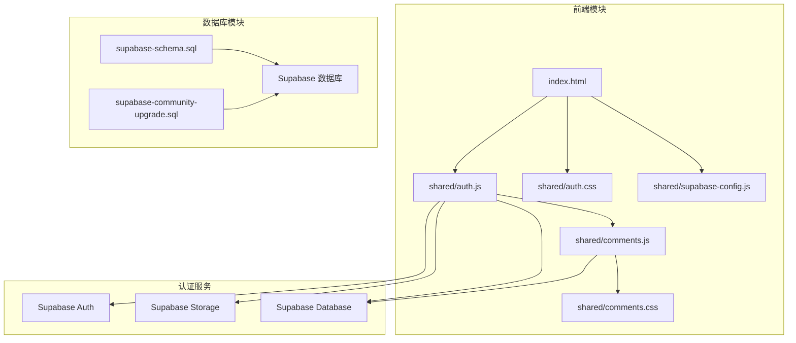
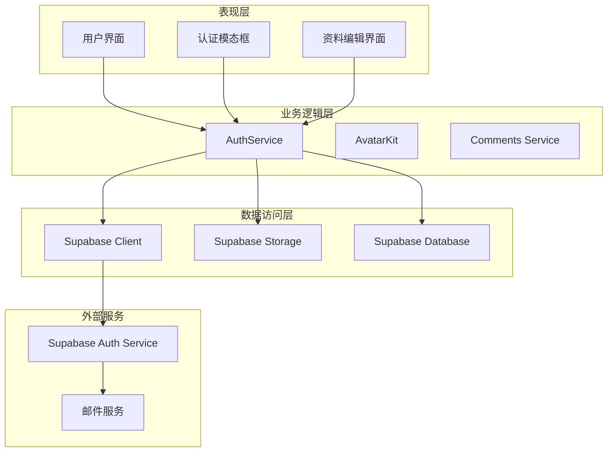
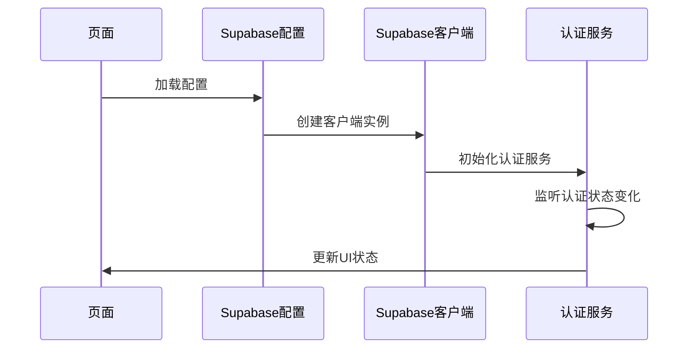
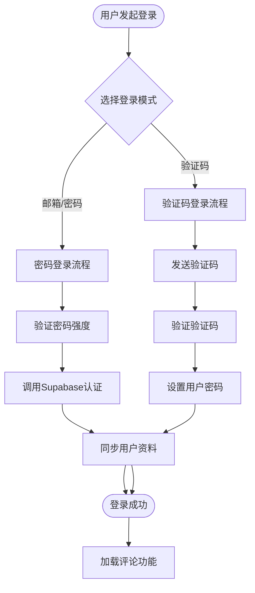
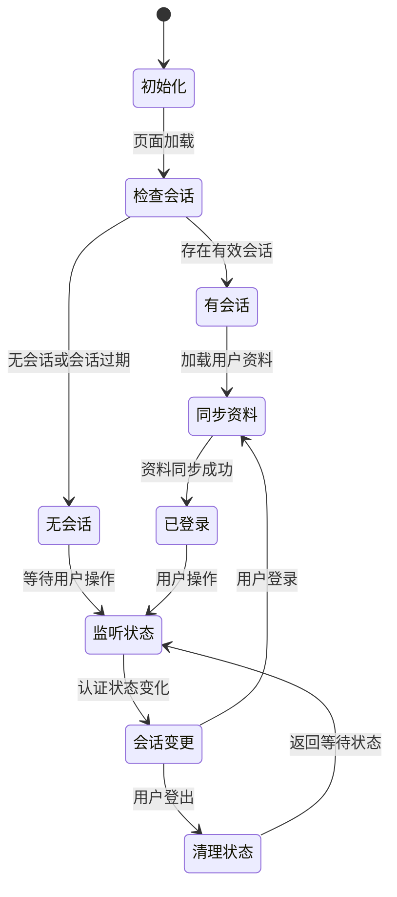
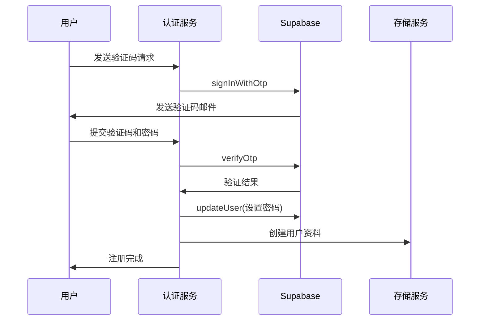
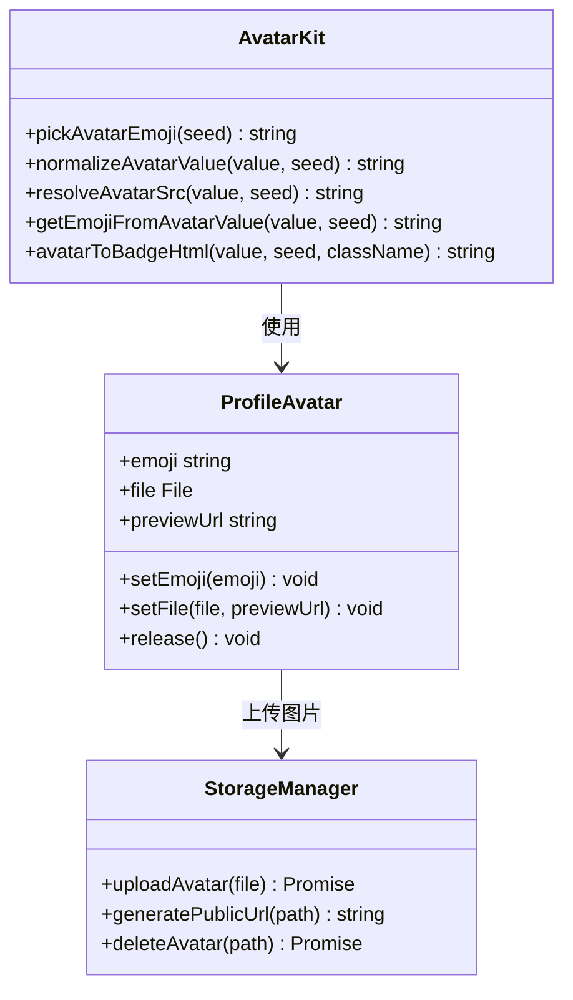
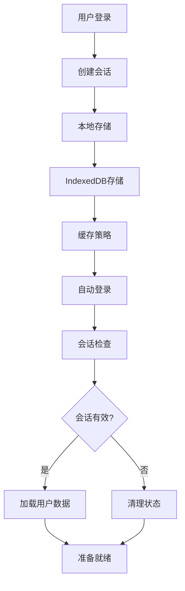
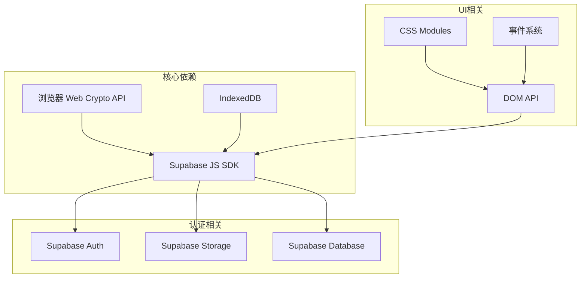

# 用户认证系统

<cite>
**本文档引用的文件**
- [shared/supabase-config.js](file://shared/supabase-config.js)
- [shared/auth.js](file://shared/auth.js)
- [shared/auth.css](file://shared/auth.css)
- [shared/comments.js](file://shared/comments.js)
- [shared/comments.css](file://shared/comments.css)
- [supabase-schema.sql](file://supabase-schema.sql)
- [supabase-community-upgrade.sql](file://supabase-community-upgrade.sql)
- [index.html](file://index.html)
</cite>

## 目录
1. [简介](#简介)
2. [项目结构](#项目结构)
3. [核心组件](#核心组件)
4. [架构概览](#架构概览)
5. [详细组件分析](#详细组件分析)
6. [依赖关系分析](#依赖关系分析)
7. [性能考虑](#性能考虑)
8. [故障排除指南](#故障排除指南)
9. [结论](#结论)
10. [附录](#附录)

## 简介

这是一个基于 Supabase 的用户认证系统，提供了完整的多模式登录体验，包括邮箱/密码登录和验证码登录两种方式。系统集成了用户会话管理、头像系统（emoji/图片）、资料管理、JWT 令牌使用、权限验证和安全机制等功能。

该认证系统采用模块化设计，通过事件驱动的状态管理机制，实现了响应式的用户界面更新和流畅的用户体验。系统支持自动登录、登出处理、认证状态持久化等特性。

## 项目结构

项目采用模块化组织方式，主要文件分布如下：

**图表来源**
- [index.html:1136-1171](file://index.html#L1136-L1171)
- [shared/supabase-config.js:1-26](file://shared/supabase-config.js#L1-L26)

**章节来源**
- [index.html:1-1171](file://index.html#L1-L1171)
- [shared/supabase-config.js:1-26](file://shared/supabase-config.js#L1-L26)

## 核心组件

### Supabase 配置模块

系统通过全局配置模块初始化 Supabase 客户端，确保认证功能的正常运行。

### 认证服务模块 (AuthService)

提供完整的认证功能，包括：
- 用户登录/注册
- 会话管理
- 密码重置
- 用户资料管理
- 头像系统

### 认证 UI 模块 (AuthUI)

负责用户界面的渲染和交互，包括：
- 登录/注册模态框
- 用户状态显示
- 资料编辑界面
- 密码重置界面

### 头像系统 (AvatarKit)

提供灵活的头像解决方案，支持 emoji 和图片两种形式。

**章节来源**
- [shared/auth.js:1-800](file://shared/auth.js#L1-L800)
- [shared/auth.css:1-462](file://shared/auth.css#L1-L462)

## 架构概览

系统采用分层架构设计，各组件职责明确：

**图表来源**
- [shared/auth.js:419-800](file://shared/auth.js#L419-L800)
- [shared/supabase-config.js:5-25](file://shared/supabase-config.js#L5-L25)

## 详细组件分析

### Supabase 认证集成

系统通过全局配置模块统一管理 Supabase 客户端实例：

**图表来源**
- [shared/supabase-config.js:5-25](file://shared/supabase-config.js#L5-L25)
- [shared/auth.js:948-986](file://shared/auth.js#L948-L986)

### 多模式登录实现

系统支持两种登录模式：

#### 邮箱/密码登录
- 直接使用邮箱和密码进行身份验证
- 适用于已有账户的用户
- 支持密码强度验证

#### 验证码登录
- 通过邮箱发送验证码
- 适用于新用户注册
- 验证码有效期管理

**图表来源**
- [shared/auth.js:522-677](file://shared/auth.js#L522-L677)
- [shared/auth.js:1151-1159](file://shared/auth.js#L1151-L1159)

**章节来源**
- [shared/auth.js:522-677](file://shared/auth.js#L522-L677)
- [shared/auth.js:1151-1159](file://shared/auth.js#L1151-L1159)

### 用户会话管理机制

系统实现了完整的会话生命周期管理：

**图表来源**
- [shared/auth.js:948-986](file://shared/auth.js#L948-L986)
- [shared/auth.js:446-450](file://shared/auth.js#L446-L450)

**章节来源**
- [shared/auth.js:948-986](file://shared/auth.js#L948-L986)
- [shared/auth.js:446-450](file://shared/auth.js#L446-L450)

### 用户注册流程

注册流程包含多个验证步骤：

**图表来源**
- [shared/auth.js:522-660](file://shared/auth.js#L522-L660)

**章节来源**
- [shared/auth.js:522-660](file://shared/auth.js#L522-L660)

### 邮箱验证机制

系统实现了完善的邮箱验证流程：

- 验证码生成和发送
- 验证码有效期管理（默认60秒）
- 验证码重发限制
- 邮箱格式验证
- 验证状态持久化

**章节来源**
- [shared/auth.js:522-550](file://shared/auth.js#L522-L550)

### 头像系统（emoji/图片）

头像系统提供了灵活的头像管理方案：

#### Emoji 头像
- 内置丰富的表情符号集合
- 基于用户 ID 的哈希算法生成一致性头像
- 自动转换为 SVG 数据 URL

#### 图片头像
- 支持本地文件上传
- 自动缩放和缓存控制
- 公共 URL 生成
- 文件类型和大小限制

**图表来源**
- [shared/auth.js:9-113](file://shared/auth.js#L9-L113)
- [shared/auth.js:175-232](file://shared/auth.js#L175-L232)

**章节来源**
- [shared/auth.js:9-113](file://shared/auth.js#L9-L113)
- [shared/auth.js:175-232](file://shared/auth.js#L175-L232)

### 资料管理系统

系统提供了完整的用户资料管理功能：

- 昵称管理（唯一性验证）
- 头像设置（emoji/图片）
- 用户元数据同步
- 资料变更通知

**章节来源**
- [shared/auth.js:694-755](file://shared/auth.js#L694-L755)

### JWT 令牌使用和权限验证

系统通过 Supabase 的内置认证机制实现安全的令牌管理和权限验证：

#### JWT 令牌管理
- 自动令牌刷新
- 会话状态持久化
- 安全的令牌存储

#### 权限验证
- Row Level Security (RLS) 策略
- 用户角色权限控制
- 资源访问权限验证

**章节来源**
- [supabase-schema.sql:15-21](file://supabase-schema.sql#L15-L21)
- [supabase-schema.sql:56-80](file://supabase-schema.sql#L56-L80)

### 认证状态持久化

系统实现了多种认证状态持久化机制：

**图表来源**
- [shared/auth.js:948-986](file://shared/auth.js#L948-L986)

**章节来源**
- [shared/auth.js:948-986](file://shared/auth.js#L948-L986)

### 自动登录和登出处理

系统提供了智能的自动登录和安全的登出机制：

#### 自动登录
- 页面加载时自动检查会话状态
- 异步加载用户资料
- 错误恢复机制

#### 安全登出
- 清理本地存储
- 断开服务器连接
- 重置认证状态

**章节来源**
- [shared/auth.js:679-692](file://shared/auth.js#L679-L692)

## 依赖关系分析

系统的关键依赖关系如下：

**图表来源**
- [shared/supabase-config.js:9-21](file://shared/supabase-config.js#L9-L21)
- [index.html:1136-1137](file://index.html#L1136-L1137)

**章节来源**
- [shared/supabase-config.js:9-21](file://shared/supabase-config.js#L9-L21)
- [index.html:1136-1137](file://index.html#L1136-L1137)

## 性能考虑

### 会话管理优化
- 异步会话检查避免阻塞主线程
- 缓存策略减少重复请求
- 智能超时处理

### 头像加载优化
- SVG 头像减少网络请求
- 图片懒加载机制
- 缓存策略优化

### 数据同步策略
- 批量操作减少数据库往返
- 增量更新避免全量同步
- 错误重试机制

## 故障排除指南

### 常见问题及解决方案

#### 认证初始化失败
**症状**: 控制台显示 "Supabase SDK 未加载"
**原因**: CDN 资源加载失败
**解决**: 检查网络连接和 CDN 可用性

#### 会话同步超时
**症状**: "读取用户资料超时"
**原因**: 网络延迟或服务器响应慢
**解决**: 增加超时时间或检查服务器状态

#### 验证码发送失败
**症状**: "邮件发送超时"
**原因**: 邮件服务不可用或速率限制
**解决**: 检查邮件配置和重试机制

#### 头像上传失败
**症状**: "头像上传超时"
**原因**: 文件过大或存储服务问题
**解决**: 检查文件大小限制和存储配置

**章节来源**
- [shared/auth.js:115-147](file://shared/auth.js#L115-L147)

### 调试工具和技巧

#### 开发者工具
- 使用浏览器开发者工具监控网络请求
- 检查认证状态变化事件
- 监控存储使用情况

#### 日志记录
- 认证流程日志
- 错误信息追踪
- 性能指标监控

## 结论

该用户认证系统是一个功能完整、架构清晰的现代认证解决方案。系统的主要优势包括：

1. **多模式支持**: 同时支持邮箱/密码和验证码两种登录方式
2. **模块化设计**: 清晰的组件分离和职责划分
3. **用户体验**: 流畅的交互和响应式界面
4. **安全性**: 基于 Supabase 的企业级安全机制
5. **可扩展性**: 灵活的架构支持功能扩展

系统在头像管理、资料同步、会话持久化等方面表现出色，为后续的功能扩展奠定了良好的基础。

## 附录

### 扩展方法

#### 添加自定义字段
1. 修改数据库模式定义
2. 更新认证服务的数据模型
3. 扩展现有 UI 组件
4. 实现数据验证逻辑

#### 第三方认证集成
1. 配置 Supabase 第三方认证提供商
2. 扩展认证服务处理逻辑
3. 更新 UI 组件支持新认证方式
4. 实现用户资料合并机制

#### 权限系统扩展
1. 定义新的用户角色
2. 配置数据库 RLS 策略
3. 扩展权限验证逻辑
4. 更新 UI 权限控制

### 最佳实践

#### 安全最佳实践
- 始终验证用户输入
- 使用 HTTPS 协议
- 实施适当的速率限制
- 定期审计权限配置

#### 性能优化
- 实现智能缓存策略
- 优化数据库查询
- 使用异步加载机制
- 监控关键性能指标

#### 用户体验优化
- 提供清晰的错误反馈
- 实现优雅的降级处理
- 保持界面响应性
- 提供进度指示器