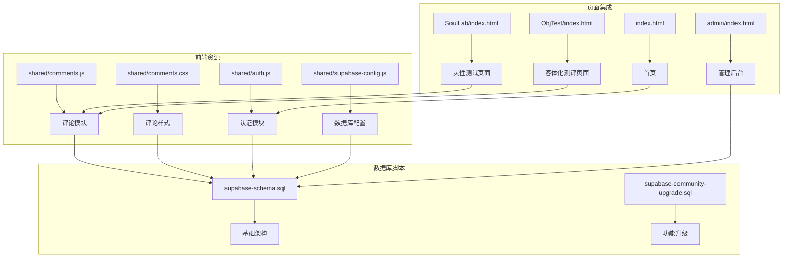
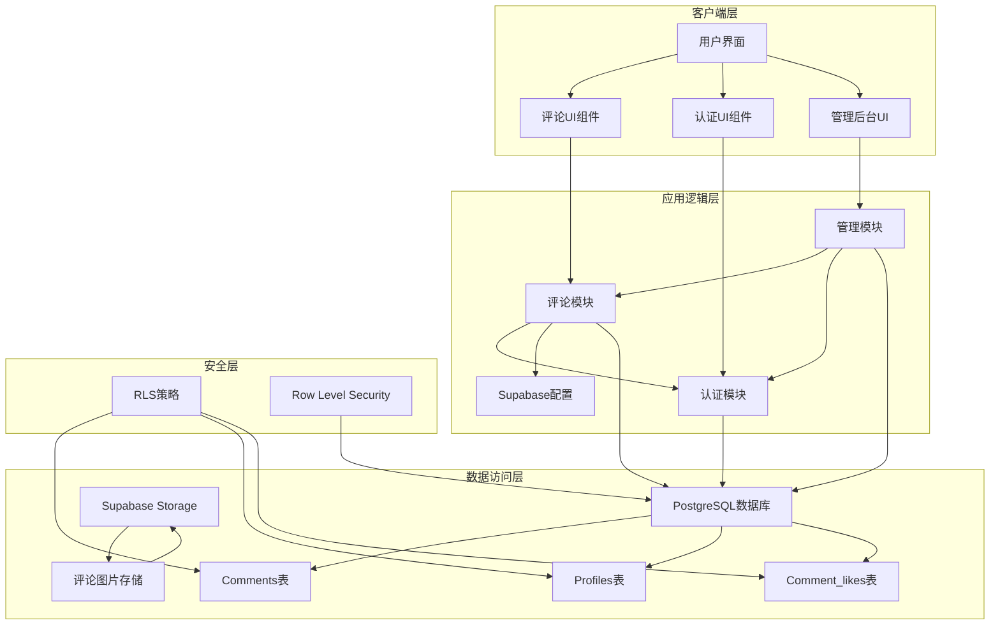
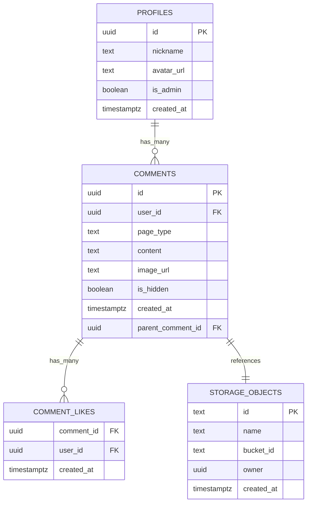
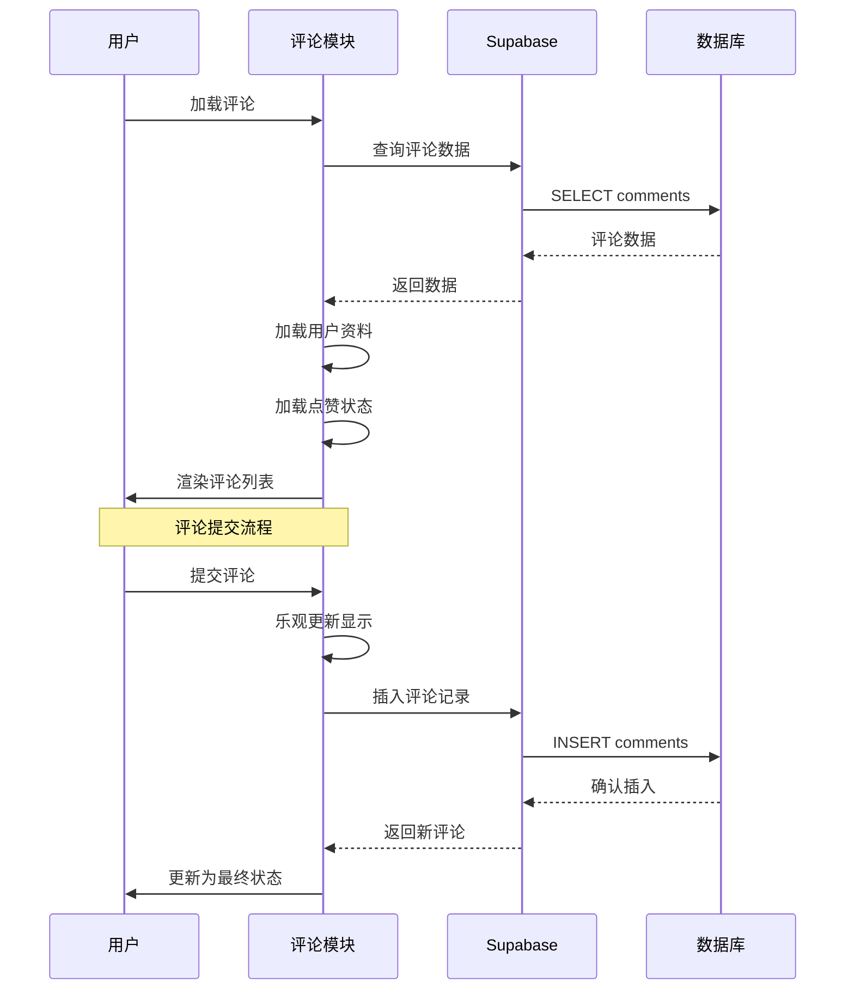
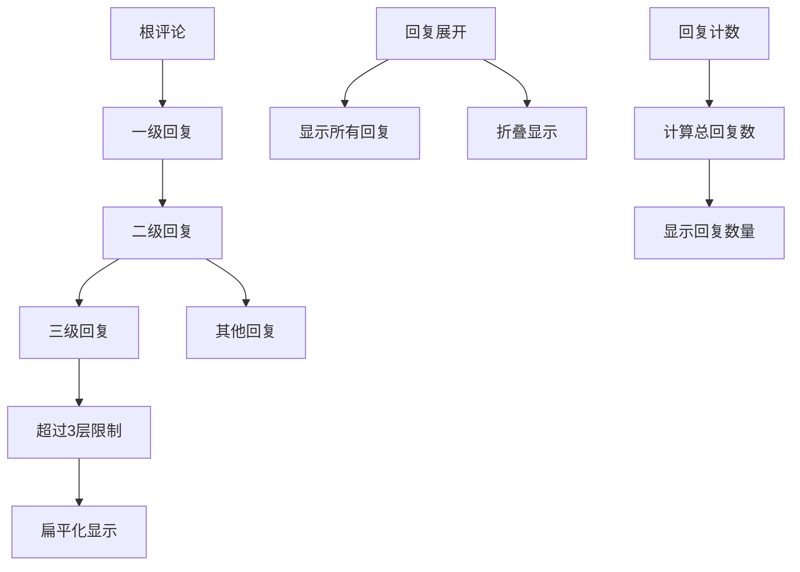
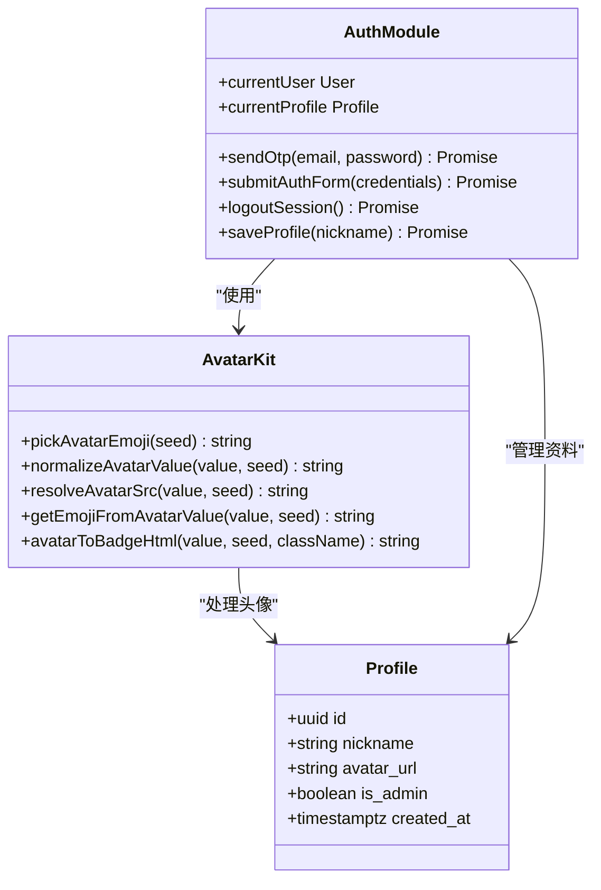
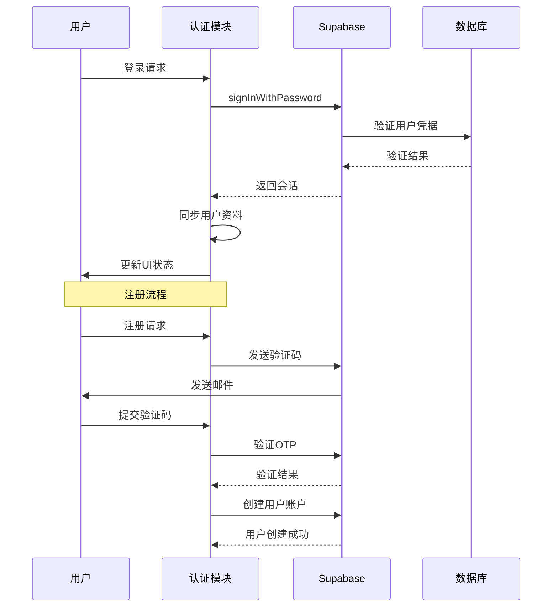
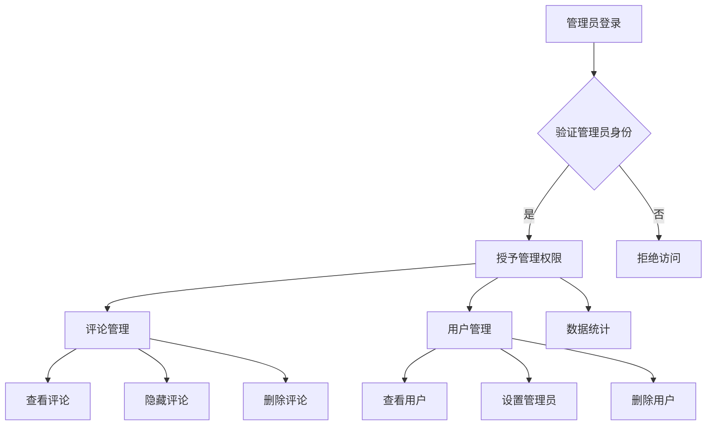
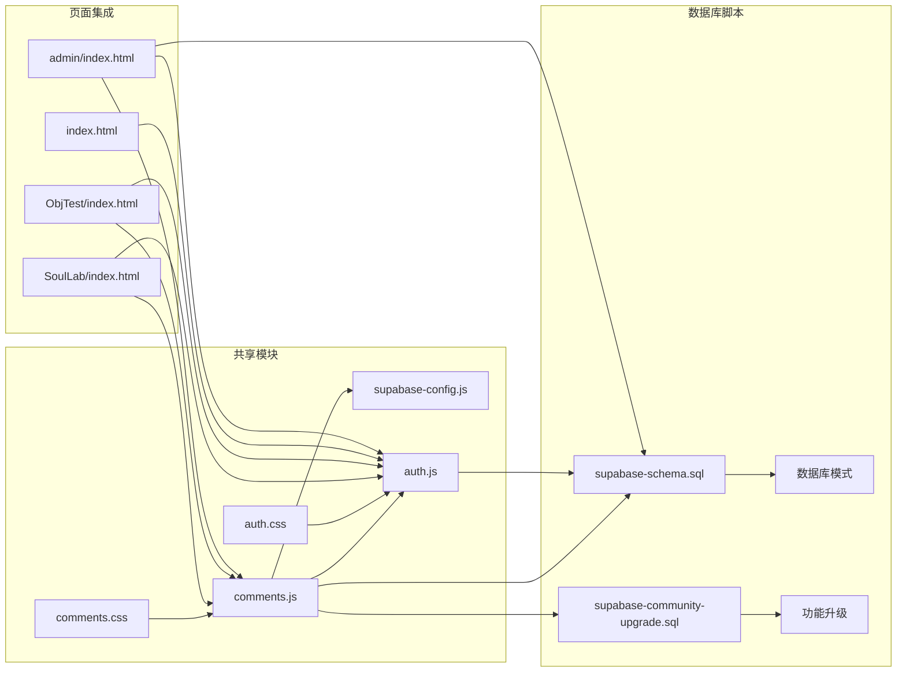
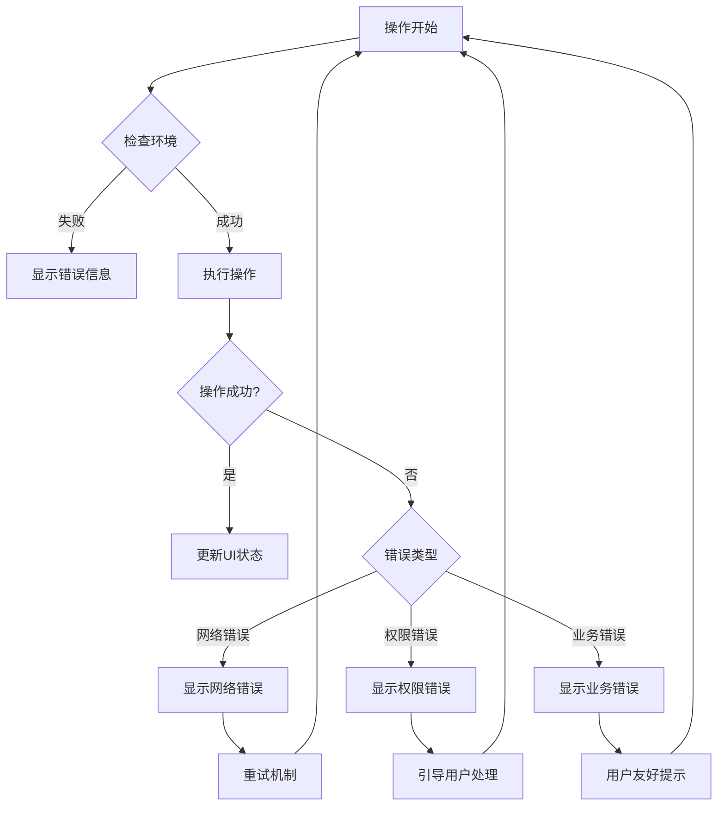

# 社区互动系统

<cite>
**本文档引用的文件**
- [shared/comments.js](file://shared/comments.js)
- [shared/comments.css](file://shared/comments.css)
- [shared/supabase-config.js](file://shared/supabase-config.js)
- [shared/auth.js](file://shared/auth.js)
- [supabase-schema.sql](file://supabase-schema.sql)
- [supabase-community-upgrade.sql](file://supabase-community-upgrade.sql)
- [index.html](file://index.html)
- [SoulLab/index.html](file://SoulLab/index.html)
- [ObjTest/index.html](file://ObjTest/index.html)
- [admin/index.html](file://admin/index.html)
</cite>

## 目录
1. [简介](#简介)
2. [项目结构](#项目结构)
3. [核心组件](#核心组件)
4. [架构概览](#架构概览)
5. [详细组件分析](#详细组件分析)
6. [依赖关系分析](#依赖关系分析)
7. [性能考虑](#性能考虑)
8. [故障排除指南](#故障排除指南)
9. [结论](#结论)
10. [附录](#附录)

## 简介

社区互动系统是一个基于 Supabase 构建的实时评论平台，专为"觉醒诗社"网站设计。该系统提供了完整的评论功能，包括实时更新、图片上传、多级回复、点赞系统、管理员审核等功能。系统采用前后端分离架构，前端使用原生 JavaScript 和 CSS，后端基于 Supabase 的 PostgreSQL 数据库和存储服务。

## 项目结构

项目采用模块化组织方式，主要分为以下几部分：

**图表来源**
- [shared/comments.js:1-769](file://shared/comments.js#L1-L769)
- [shared/comments.css:1-704](file://shared/comments.css#L1-L704)
- [shared/auth.js:1-800](file://shared/auth.js#L1-L800)
- [supabase-schema.sql:1-97](file://supabase-schema.sql#L1-L97)

**章节来源**
- [shared/comments.js:1-769](file://shared/comments.js#L1-L769)
- [shared/comments.css:1-704](file://shared/comments.css#L1-L704)
- [shared/auth.js:1-800](file://shared/auth.js#L1-L800)
- [supabase-schema.sql:1-97](file://supabase-schema.sql#L1-L97)

## 核心组件

### 评论模块 (Comments Module)

评论模块是整个系统的核心，负责处理所有评论相关的功能：

- **实时评论加载**：支持按页面类型分类加载评论
- **多级回复系统**：支持最多3层嵌套回复
- **图片上传**：支持评论中插入图片，最大5MB限制
- **点赞功能**：用户可以对评论进行点赞和取消点赞
- **乐观更新**：提交评论时立即显示，等待服务器确认
- **响应式设计**：适配各种屏幕尺寸

### 认证模块 (Auth Module)

提供完整的用户认证和授权功能：

- **邮箱验证码登录**：支持邮箱验证码注册和登录
- **密码重置**：通过邮箱重置密码
- **头像系统**：支持 Emoji 头像和自定义图片头像
- **会话管理**：处理用户登录状态和会话持久化
- **权限控制**：基于 Supabase RLS 实现细粒度权限控制

### 管理后台 (Admin Panel)

为管理员提供的完整管理界面：

- **评论管理**：查看、隐藏、删除评论
- **用户管理**：管理用户权限和状态
- **数据统计**：显示系统统计数据
- **实时监控**：监控系统状态和性能

**章节来源**
- [shared/comments.js:208-769](file://shared/comments.js#L208-L769)
- [shared/auth.js:1-800](file://shared/auth.js#L1-L800)
- [admin/index.html:1-688](file://admin/index.html#L1-L688)

## 架构概览

系统采用三层架构设计，确保了良好的可维护性和扩展性：

**图表来源**
- [shared/comments.js:20-25](file://shared/comments.js#L20-L25)
- [shared/supabase-config.js:5-25](file://shared/supabase-config.js#L5-L25)
- [supabase-schema.sql:42-81](file://supabase-schema.sql#L42-L81)

系统的关键特性包括：

- **实时性**：通过 Supabase 的实时订阅功能实现实时更新
- **安全性**：基于 PostgreSQL 的 Row Level Security (RLS) 实现细粒度权限控制
- **可扩展性**：模块化设计，易于添加新功能
- **响应式**：完全适配移动设备和桌面设备

**章节来源**
- [supabase-schema.sql:15-81](file://supabase-schema.sql#L15-L81)
- [shared/supabase-config.js:1-26](file://shared/supabase-config.js#L1-L26)

## 详细组件分析

### 评论系统核心架构

#### 数据模型设计

**图表来源**
- [supabase-schema.sql:6-87](file://supabase-schema.sql#L6-L87)

#### 评论渲染流程

**图表来源**
- [shared/comments.js:309-345](file://shared/comments.js#L309-L345)
- [shared/comments.js:544-643](file://shared/comments.js#L544-L643)

#### 多级回复系统

系统支持最多3层嵌套回复，通过递归算法实现：

**图表来源**
- [shared/comments.js:144-164](file://shared/comments.js#L144-L164)
- [shared/comments.js:411-417](file://shared/comments.js#L411-L417)

**章节来源**
- [shared/comments.js:132-164](file://shared/comments.js#L132-L164)
- [shared/comments.js:388-497](file://shared/comments.js#L388-L497)

### 认证系统设计

#### 用户头像系统

系统支持多种头像类型，通过统一的头像处理机制：

**图表来源**
- [shared/auth.js:107-113](file://shared/auth.js#L107-L113)
- [shared/auth.js:195-232](file://shared/auth.js#L195-L232)

#### 认证流程

**图表来源**
- [shared/auth.js:567-677](file://shared/auth.js#L567-L677)
- [shared/auth.js:215-232](file://shared/auth.js#L215-L232)

**章节来源**
- [shared/auth.js:107-113](file://shared/auth.js#L107-L113)
- [shared/auth.js:567-677](file://shared/auth.js#L567-L677)

### 管理后台架构

#### 管理员权限控制

**图表来源**
- [admin/index.html:398-449](file://admin/index.html#L398-L449)
- [supabase-schema.sql:66-80](file://supabase-schema.sql#L66-L80)

#### 数据安全策略

系统通过多种安全措施保护数据安全：

- **RLS策略**：每个表都启用了 Row Level Security
- **权限分离**：普通用户只能访问自己的数据
- **管理员特权**：管理员可以访问所有数据
- **数据加密**：敏感信息通过加密传输

**章节来源**
- [admin/index.html:398-449](file://admin/index.html#L398-L449)
- [supabase-schema.sql:15-81](file://supabase-schema.sql#L15-L81)

## 依赖关系分析

### 前端依赖关系

**图表来源**
- [SoulLab/index.html:249-255](file://SoulLab/index.html#L249-L255)
- [ObjTest/index.html:160-166](file://ObjTest/index.html#L160-L166)
- [admin/index.html:304-311](file://admin/index.html#L304-L311)

### 数据库依赖关系

系统依赖于 Supabase 的多个服务：

- **PostgreSQL数据库**：存储用户资料、评论、点赞等数据
- **Supabase Storage**：存储评论图片和用户头像
- **Auth服务**：处理用户认证和授权
- **Realtime服务**：提供实时数据同步能力

**章节来源**
- [shared/supabase-config.js:5-25](file://shared/supabase-config.js#L5-L25)
- [supabase-schema.sql:83-97](file://supabase-schema.sql#L83-L97)

## 性能考虑

### 数据库性能优化

系统采用了多项性能优化策略：

- **索引优化**：为常用查询字段建立索引
  - `idx_comments_page_parent_created_at`：按页面类型和时间排序
  - `idx_comment_likes_comment_id`：快速查找用户点赞
  - `idx_profiles_nickname_unique`：确保昵称唯一性

- **查询优化**：限制查询结果数量，避免全表扫描
- **缓存策略**：在前端缓存用户资料和点赞状态
- **懒加载**：评论列表采用分页加载

### 前端性能优化

- **虚拟滚动**：大量评论时使用虚拟滚动技术
- **图片懒加载**：评论图片使用懒加载减少初始加载时间
- **事件节流**：输入事件和滚动事件进行节流处理
- **内存管理**：及时清理不再使用的DOM元素和事件监听器

### 网络性能优化

- **CDN加速**：静态资源通过CDN分发
- **压缩传输**：启用Gzip压缩减少传输体积
- **连接复用**：复用HTTP连接减少握手开销
- **预连接**：预连接Supabase服务提高响应速度

## 故障排除指南

### 常见问题及解决方案

#### 评论功能无法使用

**症状**：评论区域显示"评论功能未完成升级"

**原因**：
- 数据库缺少必要的表或列
- RLS策略配置不正确
- Supabase Storage权限问题

**解决方案**：
1. 运行 `supabase-community-upgrade.sql` 脚本
2. 检查数据库表结构是否完整
3. 验证RLS策略配置
4. 确认Storage权限设置

#### 图片上传失败

**症状**：上传图片时出现错误提示

**原因**：
- 文件大小超过限制（5MB）
- 文件格式不支持
- Storage权限不足

**解决方案**：
1. 检查文件大小是否超过5MB
2. 确认文件格式为图片格式
3. 验证用户是否有上传权限
4. 检查Storage桶配置

#### 认证问题

**症状**：登录或注册失败

**原因**：
- 网络连接问题
- 邮箱验证码过期
- 密码不符合要求

**解决方案**：
1. 检查网络连接状态
2. 重新获取邮箱验证码
3. 确认密码长度至少6位
4. 验证邮箱格式正确性

**章节来源**
- [shared/comments.js:47-65](file://shared/comments.js#L47-L65)
- [shared/comments.js:714-718](file://shared/comments.js#L714-L718)
- [shared/auth.js:115-147](file://shared/auth.js#L115-L147)

### 错误处理机制

系统实现了完善的错误处理机制：

**图表来源**
- [shared/comments.js:627-643](file://shared/comments.js#L627-L643)
- [shared/auth.js:115-147](file://shared/auth.js#L115-L147)

## 结论

社区互动系统是一个功能完整、架构清晰的实时评论平台。系统的主要优势包括：

**技术优势**：
- 基于 Supabase 构建，无需服务器端代码
- 完整的实时功能，支持多用户同时在线
- 细粒度的权限控制和数据安全
- 模块化设计，易于维护和扩展

**用户体验优势**：
- 响应式设计，适配各种设备
- 丰富的交互效果和动画
- 直观的用户界面和操作流程
- 即时反馈和状态提示

**扩展性优势**：
- 支持添加新功能而无需修改核心代码
- 灵活的数据模型支持未来需求变化
- 清晰的模块边界便于团队协作

系统目前的功能已经能够满足社区互动的基本需求，但仍有一些改进空间，如增加举报机制、内容审核流程、社区治理策略等功能。

## 附录

### 数据库迁移脚本

系统提供了完整的数据库迁移脚本，用于初始化和升级数据库结构：

- `supabase-schema.sql`：初始化数据库结构
- `supabase-community-upgrade.sql`：升级评论功能

### 配置参数

系统支持多种配置参数：

- **评论分页大小**：默认每页10条评论
- **图片大小限制**：最大5MB
- **字符长度限制**：评论最多500字符，回复最多300字符
- **嵌套层级限制**：最多3层回复

### API接口规范

系统通过 Supabase 提供RESTful API接口：

- `GET /rest/v1/comments`：获取评论列表
- `POST /rest/v1/comments`：创建评论
- `DELETE /rest/v1/comments?id=eq.{id}`：删除评论
- `GET /rest/v1/comment_likes`：获取点赞列表
- `POST /rest/v1/comment_likes`：创建点赞
- `DELETE /rest/v1/comment_likes?comment_id=eq.{comment_id}&user_id=eq.{user_id}`：取消点赞