# ObjTest客体化测试系统

<cite>
**本文档引用的文件**
- [index.html](file://ObjTest/index.html)
- [app.js](file://ObjTest/app.js)
- [questions.js](file://ObjTest/questions.js)
- [results.js](file://ObjTest/results.js)
- [style.css](file://ObjTest/style.css)
- [客体化测试.md](file://ObjTest/客体化测试.md)
</cite>

## 目录
1. [项目概述](#项目概述)
2. [系统架构](#系统架构)
3. [核心组件分析](#核心组件分析)
4. [量化评分系统](#量化评分系统)
5. [测试界面设计](#测试界面设计)
6. [结果报告生成](#结果报告生成)
7. [数据导出功能](#数据导出功能)
8. [用户交互体验](#用户交互体验)
9. [移动端适配](#移动端适配)
10. [扩展开发指南](#扩展开发指南)
11. [性能优化](#性能优化)
12. [故障排除](#故障排除)
13. [总结](#总结)

## 项目概述

ObjTest客体化测试系统是一个基于Web的心理测评工具，专门用于评估个体的自我客体化程度。该系统通过40道精心设计的问题，量化分析用户将自身视为工具、物品或他人实现目的手段的程度，并提供详细的个性化报告和建议。

### 系统特点
- **科学性**：基于心理学理论构建的40项标准化量表
- **易用性**：简洁直观的用户界面设计
- **实时性**：即时评分和结果生成
- **可分享性**：支持结果图片导出和社交分享
- **可扩展性**：模块化的架构设计便于功能扩展

## 系统架构

系统采用前后端分离的架构设计，前端使用纯JavaScript实现，后端通过Supabase数据库提供数据存储和统计功能。

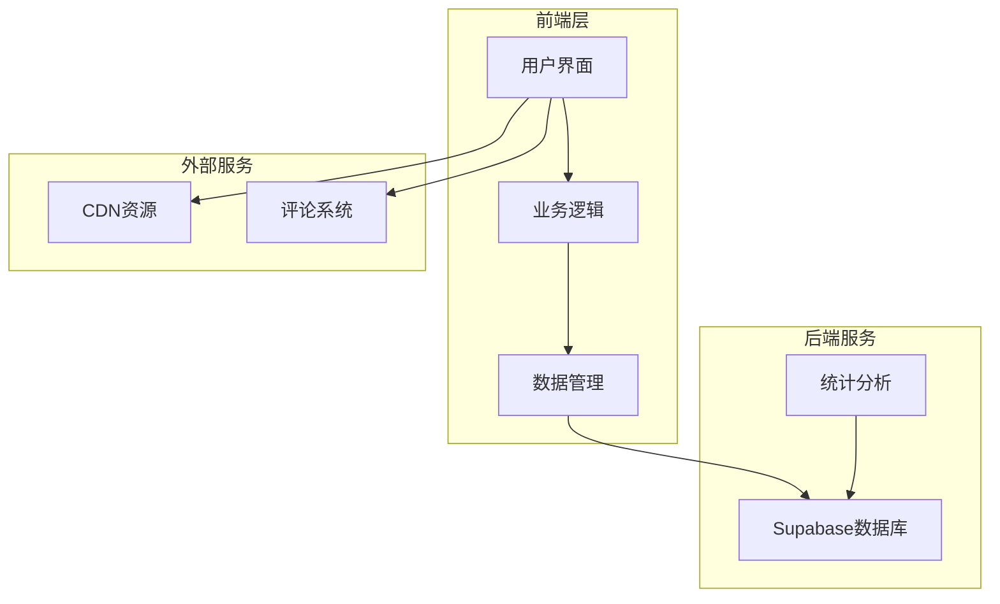

**图表来源**
- [index.html:160-166](file://ObjTest/index.html#L160-L166)
- [app.js:10-15](file://ObjTest/app.js#L10-L15)

### 核心模块划分

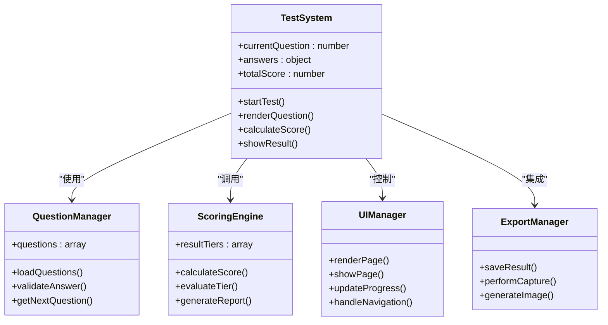

**图表来源**
- [app.js:1-327](file://ObjTest/app.js#L1-L327)
- [questions.js:1-403](file://ObjTest/questions.js#L1-L403)
- [results.js:1-55](file://ObjTest/results.js#L1-L55)

**章节来源**
- [index.html:1-170](file://ObjTest/index.html#L1-L170)
- [app.js:1-327](file://ObjTest/app.js#L1-L327)

## 核心组件分析

### 应用程序主控制器

应用程序的核心逻辑集中在`app.js`文件中，实现了完整的测试流程管理。

#### 核心变量管理
- `currentQuestion`: 当前题目索引
- `answers`: 用户答案存储对象
- `totalScore`: 总分累计值

#### 页面导航系统
系统采用多页面架构，通过CSS类切换实现页面间的平滑过渡：

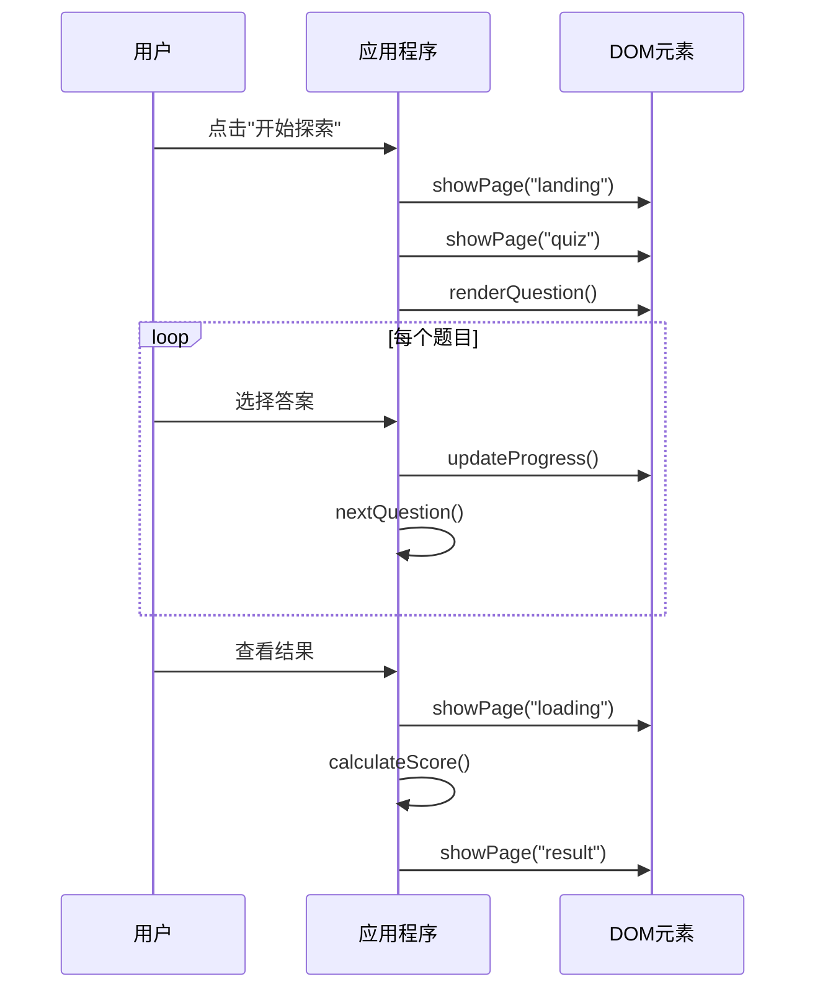

**图表来源**
- [app.js:86-187](file://ObjTest/app.js#L86-L187)

**章节来源**
- [app.js:1-327](file://ObjTest/app.js#L1-L327)

### 问题数据结构

问题数据采用JSON格式存储，每个问题包含标准的结构化信息：

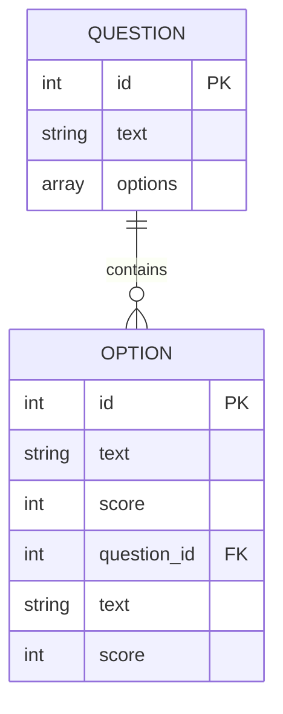

**图表来源**
- [questions.js:1-403](file://ObjTest/questions.js#L1-L403)

每个问题的标准结构：
- `id`: 问题唯一标识符
- `text`: 问题描述文本
- `options`: 四个选项数组，每个选项包含文本和分数

**章节来源**
- [questions.js:1-403](file://ObjTest/questions.js#L1-L403)

### 结果分级系统

结果分级通过`results.js`文件定义，采用五级评分体系：

| 分数区间 | 等级 | 颜色 | 特征 |
|---------|------|------|------|
| 0-24 | 健康水平 | ✅ 绿色 | 稳定的自我价值感 |
| 25-48 | 轻度客体化 | ⚠️ 黄色 | 偶尔过度在意评价 |
| 49-72 | 中度客体化 | 🔶 橙色 | 显著依赖外部评价 |
| 73-96 | 重度客体化 | 🔴 红色 | 严重依赖他人 |
| 97-120 | 极重度客体化 | 👑 深红色 | 完全失去主体性 |

**章节来源**
- [results.js:8-54](file://ObjTest/results.js#L8-L54)

## 量化评分系统

### 评分算法设计

评分系统采用累加式算法，每个问题的选项都有对应的数值权重：

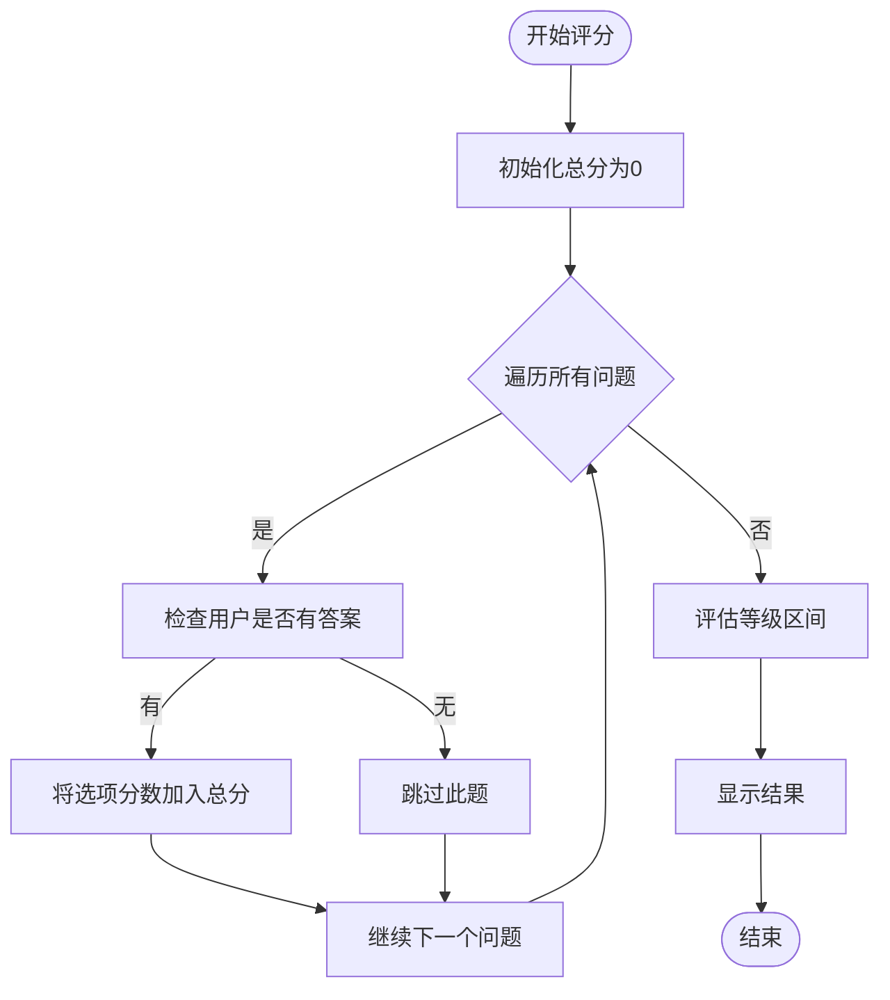

**图表来源**
- [app.js:207-217](file://ObjTest/app.js#L207-L217)

### 分数计算逻辑

```javascript
// 评分计算核心算法
function calculateScore() {
    totalScore = 0;
    questions.forEach(q => {
        const aidx = answers[q.id];
        if (aidx !== undefined) {
            totalScore += q.options[aidx].score;
        }
    });
    showResult();
}
```

### 等级判定机制

系统通过线性搜索的方式确定用户所属的等级区间：

```javascript
function showResult() {
    let tier = resultTiers[0];
    for(let i=0; i<resultTiers.length; i++) {
        if (totalScore >= resultTiers[i].minScore && 
            totalScore <= resultTiers[i].maxScore) {
            tier = resultTiers[i];
            break;
        }
    }
    // 更新结果显示
}
```

**章节来源**
- [app.js:207-242](file://ObjTest/app.js#L207-L242)
- [results.js:8-54](file://ObjTest/results.js#L8-L54)

## 测试界面设计

### 页面布局架构

系统采用响应式设计，支持桌面端和移动端的完美适配：

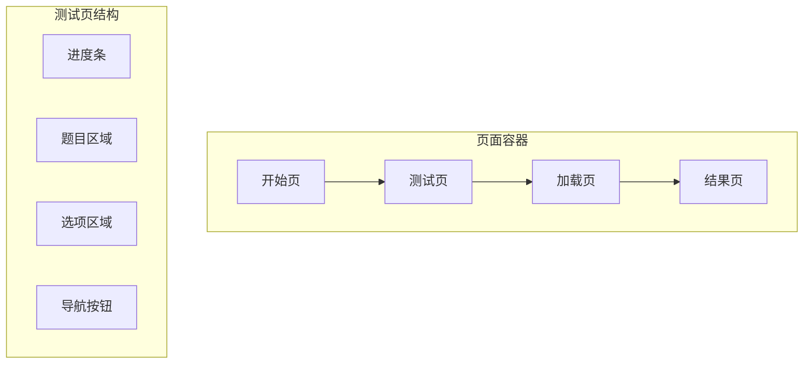

**图表来源**
- [index.html:34-158](file://ObjTest/index.html#L34-L158)

### 用户交互设计

#### 选项选择机制
- 点击选择：鼠标点击选项进行选择
- 键盘导航：支持方向键和数字键快速选择
- 视觉反馈：选中状态通过样式变化体现

#### 导航控制
- 上一题/下一题按钮
- 进度指示器
- 返回主页功能

**章节来源**
- [index.html:62-99](file://ObjTest/index.html#L62-L99)
- [app.js:147-169](file://ObjTest/app.js#L147-L169)

### 视觉设计系统

系统采用温暖的心理学配色方案：

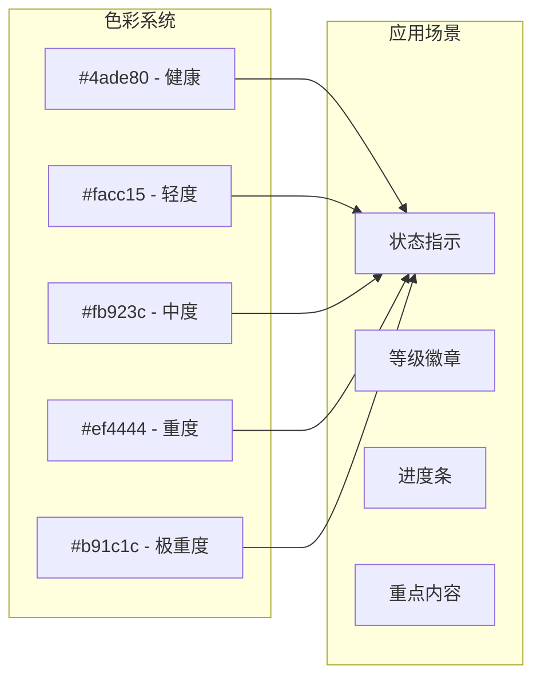

**图表来源**
- [results.js:16-52](file://ObjTest/results.js#L16-L52)
- [style.css:1-28](file://ObjTest/style.css#L1-L28)

**章节来源**
- [style.css:1-612](file://ObjTest/style.css#L1-L612)

## 结果报告生成

### 报告结构设计

结果页面采用三段式布局，提供全面的评估信息：

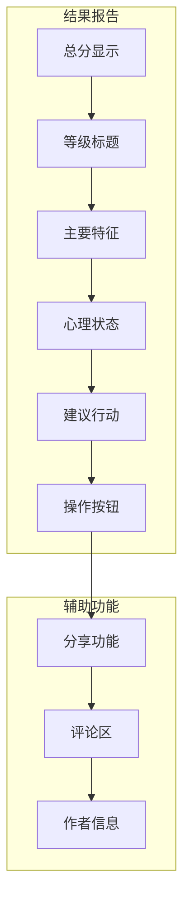

**图表来源**
- [index.html:110-158](file://ObjTest/index.html#L110-L158)

### 个性化内容生成

系统根据用户的总分自动匹配相应的等级描述：

```javascript
function showResult() {
    // 确定用户等级
    let tier = resultTiers[0];
    for(let i=0; i<resultTiers.length; i++) {
        if (totalScore >= resultTiers[i].minScore && 
            totalScore <= resultTiers[i].maxScore) {
            tier = resultTiers[i];
            break;
        }
    }
    
    // 动态更新页面内容
    document.getElementById('score-value').textContent = totalScore;
    document.getElementById('result-title').textContent = tier.title;
    document.getElementById('result-title').style.color = tier.color;
    document.getElementById('result-description').innerHTML = tier.description;
    document.getElementById('result-psych').innerHTML = tier.psychState;
    document.getElementById('result-advice').innerHTML = tier.advice;
}
```

**章节来源**
- [app.js:219-242](file://ObjTest/app.js#L219-L242)
- [results.js:8-54](file://ObjTest/results.js#L8-L54)

## 数据导出功能

### 图片导出机制

系统集成了html2canvas库实现结果页面的截图导出功能：

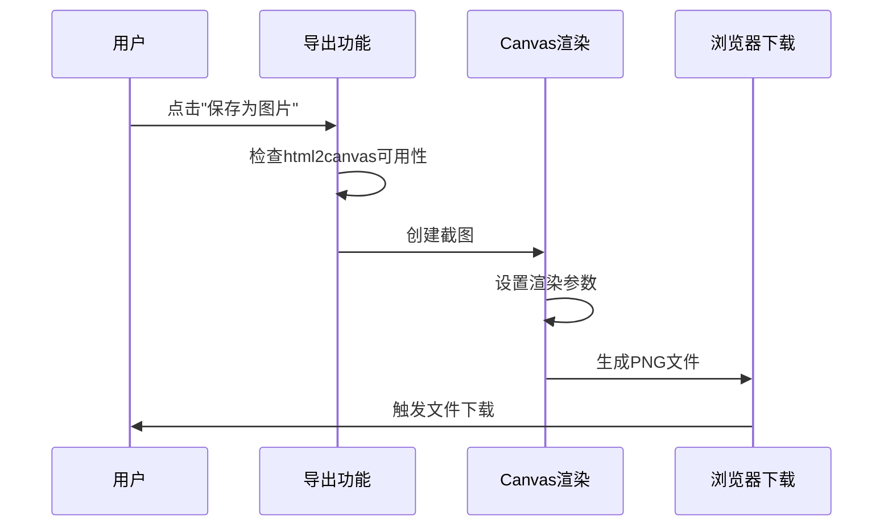

**图表来源**
- [app.js:248-303](file://ObjTest/app.js#L248-L303)

### 导出功能实现细节

```javascript
function saveResult() {
    if (typeof html2canvas === 'undefined') {
        // 动态加载html2canvas库
        const script = document.createElement('script');
        script.src = 'https://cdnjs.cloudflare.com/ajax/libs/html2canvas/1.4.1/html2canvas.min.js';
        script.onload = () => performCapture();
        document.head.appendChild(script);
    } else {
        performCapture();
    }
}

function performCapture() {
    const target = document.getElementById('capture-area');
    // 临时隐藏操作按钮
    const actions = target.querySelector('.result-actions');
    const originalDisplay = actions.style.display;
    actions.style.display = 'none';
    
    // 执行截图捕获
    html2canvas(target, {
        useCORS: true,
        allowTaint: false,
        scale: 2,
        backgroundColor: '#fdfbf7',
        logging: false
    }).then(canvas => {
        // 恢复按钮显示
        actions.style.display = originalDisplay;
        
        // 创建下载链接
        const link = document.createElement('a');
        const timestamp = new Date().toISOString().replace(/[:.]/g, '');
        link.download = `测评结果_${timestamp}.png`;
        link.href = canvas.toDataURL('image/png');
        link.click();
    });
}
```

**章节来源**
- [app.js:248-303](file://ObjTest/app.js#L248-L303)

## 用户交互体验

### 多模态输入支持

系统支持多种用户输入方式，提升交互便利性：

#### 鼠标交互
- 点击选项进行选择
- 悬停效果增强视觉反馈
- 按钮状态变化提示操作结果

#### 键盘导航
```javascript
document.addEventListener('keydown', (e) => {
    if(e.key === 'ArrowRight' || e.key === 'Enter') {
        // 下一题
    } else if (e.key === 'ArrowLeft') {
        // 上一题
    } else if (e.key >= '1' && e.key <= '4') {
        // 数字键选择选项
    }
});
```

#### 触摸设备优化
- 大尺寸点击区域
- 触摸友好的选项布局
- 响应式字体大小调整

**章节来源**
- [app.js:305-325](file://ObjTest/app.js#L305-L325)

### 进度跟踪与反馈

系统提供实时的进度反馈机制：

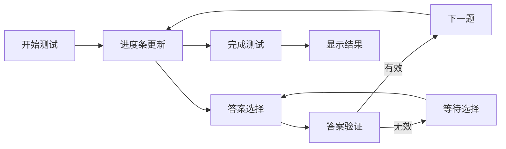

**图表来源**
- [app.js:94-145](file://ObjTest/app.js#L94-L145)

## 移动端适配

### 响应式设计策略

系统采用移动优先的设计理念，确保在各种设备上的最佳体验：

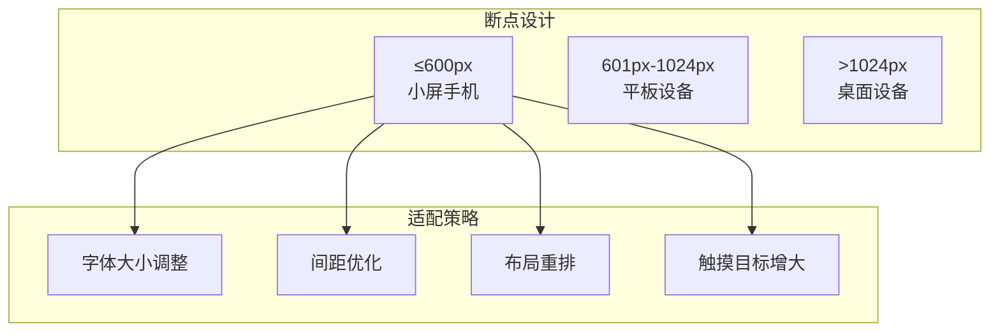

**图表来源**
- [style.css:576-611](file://ObjTest/style.css#L576-L611)

### 移动端特定优化

#### 触摸交互优化
- 最小点击区域：44px × 44px
- 触摸反馈：即时视觉反馈
- 屏幕旋转适配

#### 性能优化
- 图片懒加载
- CSS动画优化
- JavaScript异步处理

**章节来源**
- [style.css:576-611](file://ObjTest/style.css#L576-L611)

## 扩展开发指南

### 新问题类型添加

要添加新的问题类型，需要修改多个文件：

#### 1. 问题数据结构扩展
在`questions.js`中添加新的问题对象：

```javascript
{
    "id": 41,
    "text": "新问题描述",
    "options": [
        { "text": "选项1", "score": 0 },
        { "text": "选项2", "score": 1 },
        { "text": "选项3", "score": 2 },
        { "text": "选项4", "score": 3 }
    ]
}
```

#### 2. 结果分级调整
在`results.js`中更新评分区间：

```javascript
{
    minScore: 0,
    maxScore: 120,
    title: "新等级名称",
    description: "新等级描述",
    psychState: "心理状态描述",
    advice: "建议内容",
    color: "#color-code"
}
```

#### 3. 界面适配
根据新问题类型调整CSS样式和布局。

### 自定义报告模板

系统支持灵活的报告模板定制：

#### 1. HTML结构扩展
在`index.html`中添加新的报告区域：

```html
<div class="custom-report-section">
    <h3>自定义标题</h3>
    <p id="custom-content"></p>
</div>
```

#### 2. JavaScript逻辑扩展
在`app.js`中添加对应的数据处理逻辑：

```javascript
function updateCustomReport() {
    const customContent = document.getElementById('custom-content');
    customContent.innerHTML = generateCustomContent();
}
```

**章节来源**
- [questions.js:1-403](file://ObjTest/questions.js#L1-L403)
- [results.js:1-55](file://ObjTest/results.js#L1-L55)

## 性能优化

### 代码优化策略

#### 内存管理
- 及时清理事件监听器
- 合理使用闭包避免内存泄漏
- 优化DOM操作减少重绘

#### 加载性能
- 资源压缩和合并
- 按需加载第三方库
- 缓存策略优化

#### 运行时性能
- 使用requestAnimationFrame优化动画
- 防抖和节流处理高频事件
- 懒加载非关键资源

### 数据存储优化

系统采用本地存储和服务器存储相结合的策略：

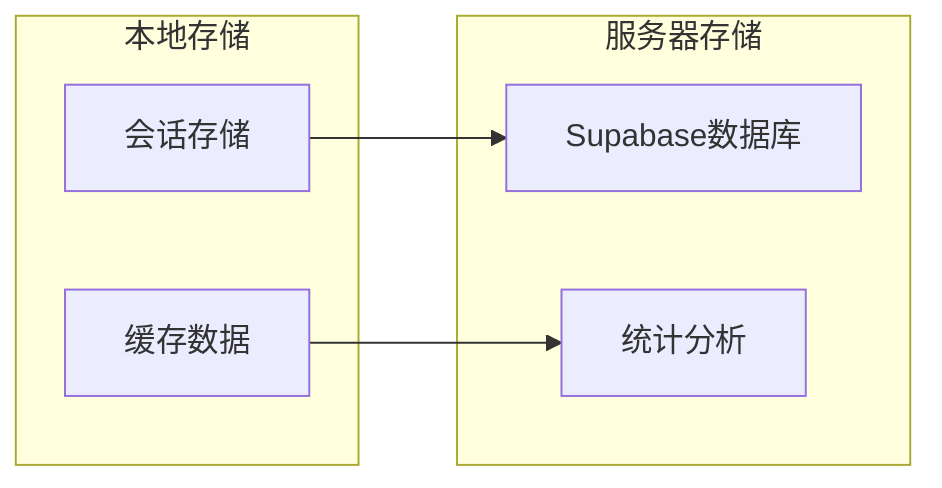

**图表来源**
- [app.js:23-64](file://ObjTest/app.js#L23-L64)

## 故障排除

### 常见问题及解决方案

#### 1. 问题加载失败
**症状**：测试页面空白或显示错误
**原因**：网络连接问题或文件路径错误
**解决方案**：
- 检查网络连接状态
- 验证文件路径正确性
- 清除浏览器缓存

#### 2. 评分异常
**症状**：总分计算错误或结果不正确
**原因**：数据格式错误或逻辑bug
**解决方案**：
- 验证问题数据格式
- 检查评分算法逻辑
- 添加数据验证机制

#### 3. 导出功能失效
**症状**：无法保存结果图片
**原因**：第三方库加载失败或浏览器兼容性问题
**解决方案**：
- 检查CDN连接状态
- 兼容性降级处理
- 提供手动截图指导

#### 4. 移动端显示异常
**症状**：布局错乱或触摸无响应
**原因**：CSS媒体查询问题或JavaScript兼容性
**解决方案**：
- 检查媒体查询语法
- 添加浏览器前缀
- 测试多设备兼容性

**章节来源**
- [app.js:23-64](file://ObjTest/app.js#L23-L64)
- [app.js:248-303](file://ObjTest/app.js#L248-L303)

## 总结

ObjTest客体化测试系统是一个功能完整、设计精良的心理测评工具。系统通过科学的评分算法、直观的用户界面和强大的扩展能力，为用户提供了一个可靠的自我探索平台。

### 核心优势

1. **科学性**：基于心理学理论构建的标准化量表
2. **易用性**：简洁直观的交互设计，支持多模态输入
3. **实时性**：即时评分和结果生成，提升用户体验
4. **可扩展性**：模块化架构便于功能扩展和定制
5. **跨平台**：优秀的移动端适配和响应式设计

### 技术亮点

- **完整的前端架构**：从数据管理到UI渲染的完整实现
- **灵活的评分系统**：支持动态调整和扩展
- **强大的导出功能**：支持结果图片导出和分享
- **优秀的性能表现**：优化的代码结构和资源管理

### 发展前景

系统为后续的功能扩展奠定了良好的基础，包括：
- 多语言支持
- 更丰富的报告类型
- 社交分享功能
- 专业版高级功能

通过持续的优化和扩展，ObjTest客体化测试系统将成为一个更加完善的心理测评平台。