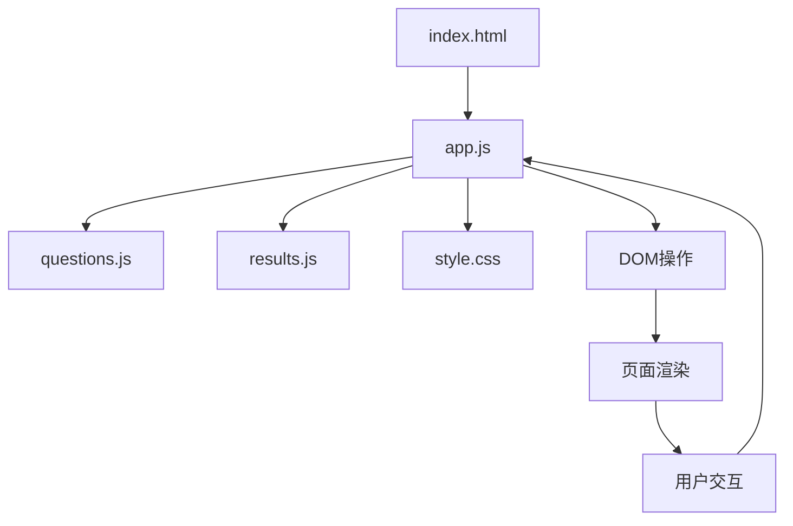
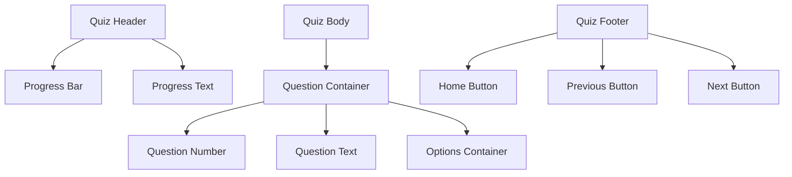
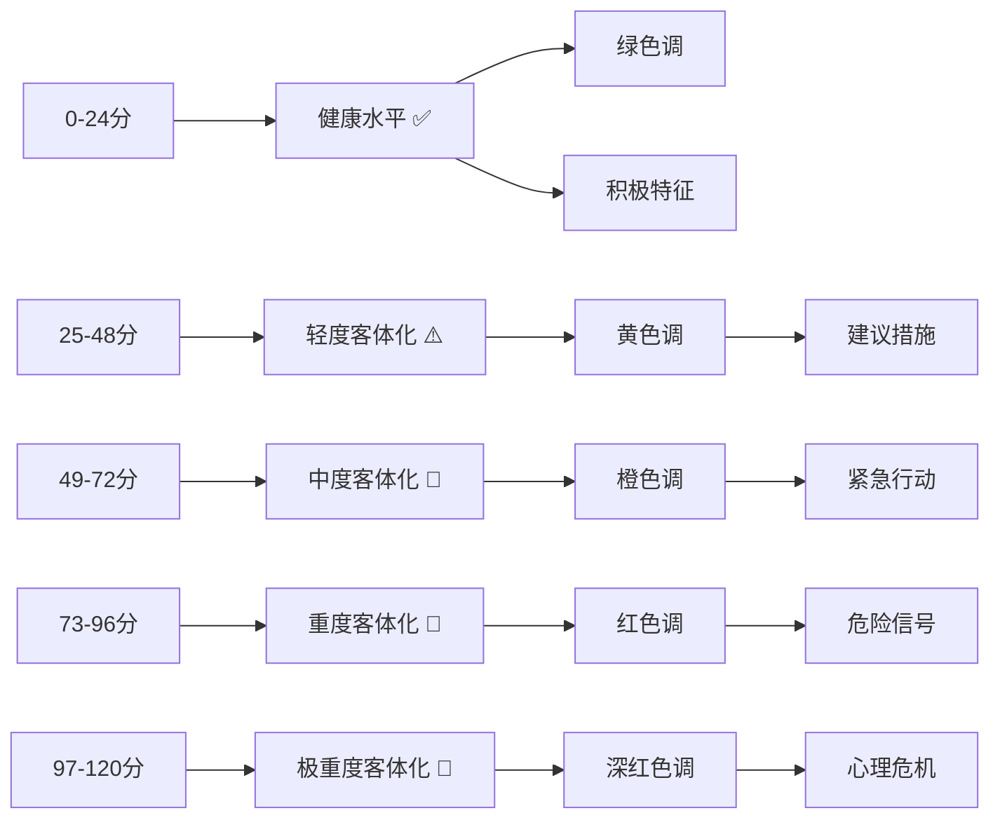
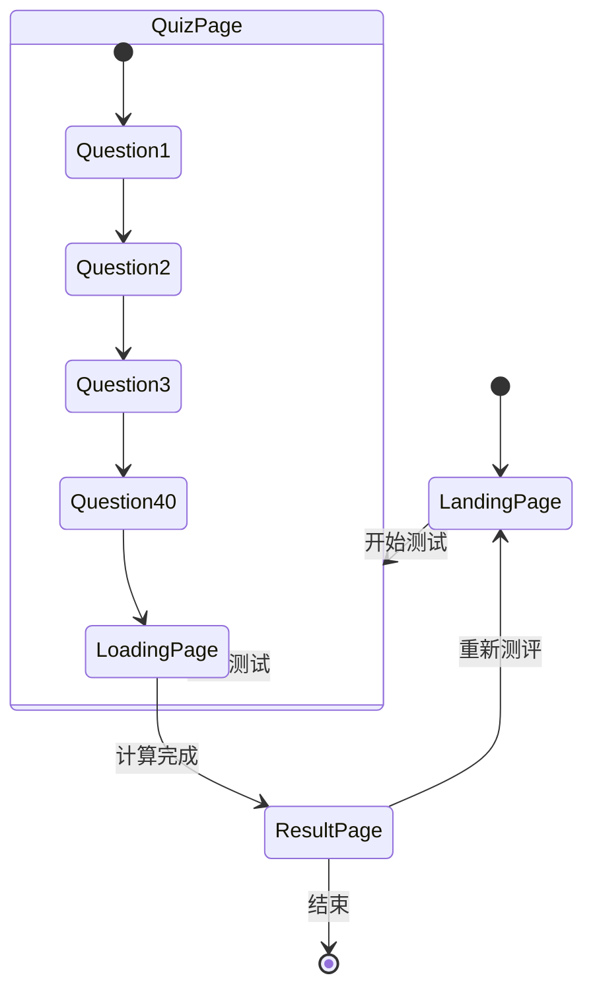
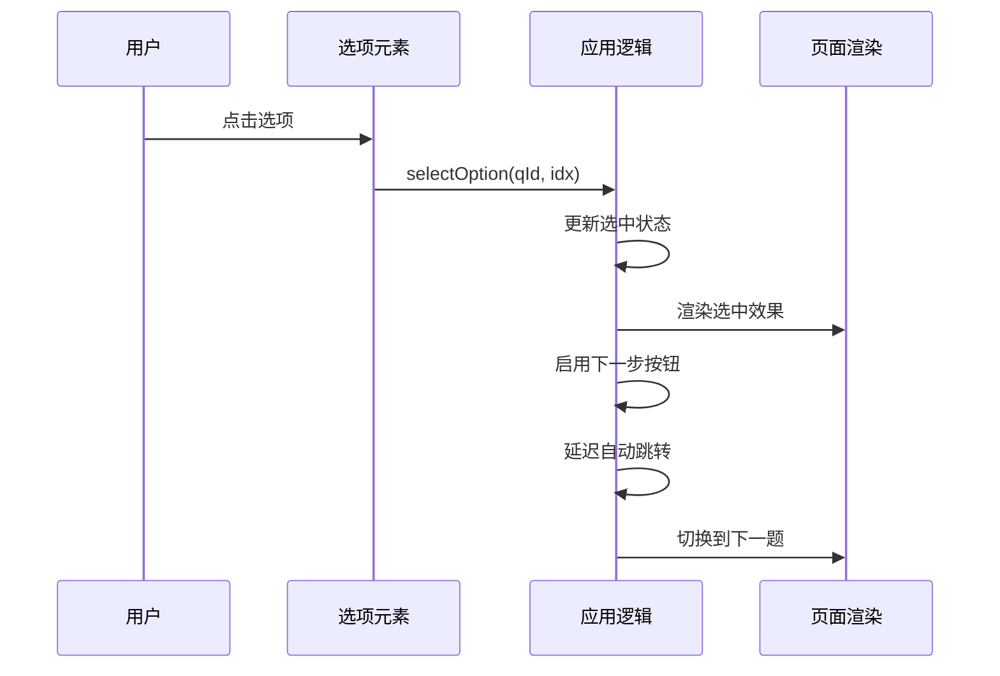
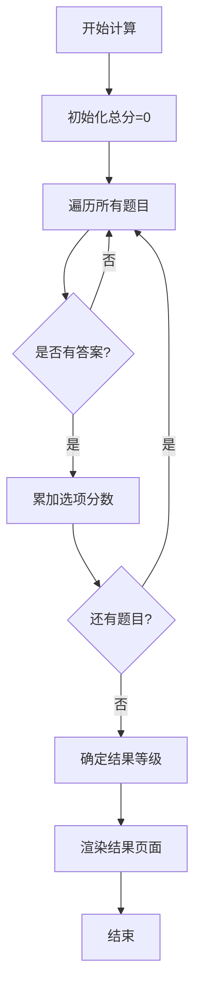
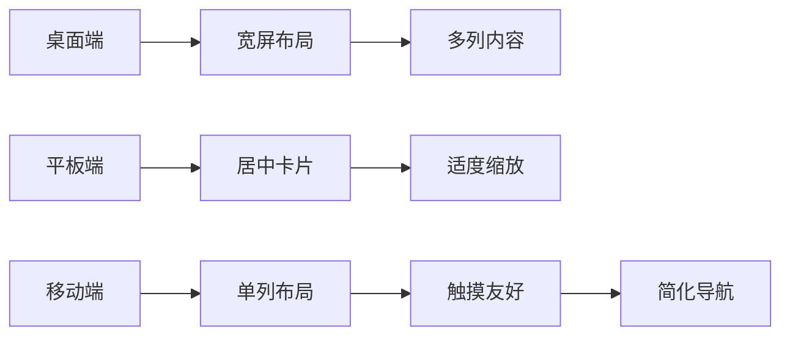

# 测试界面与交互设计

<cite>
**本文档引用的文件**
- [index.html](file://ObjTest/index.html)
- [app.js](file://ObjTest/app.js)
- [style.css](file://ObjTest/style.css)
- [questions.js](file://ObjTest/questions.js)
- [results.js](file://ObjTest/results.js)
- [客体化测试.md](file://ObjTest/客体化测试.md)
</cite>

## 目录
1. [项目概述](#项目概述)
2. [整体架构](#整体架构)
3. [页面设计详解](#页面设计详解)
4. [交互逻辑分析](#交互逻辑分析)
5. [视觉设计系统](#视觉设计系统)
6. [响应式设计实现](#响应式设计实现)
7. [性能优化策略](#性能优化策略)
8. [扩展与定制指南](#扩展与定制指南)
9. [故障排除](#故障排除)
10. [总结](#总结)

## 项目概述

ObjTest是一个专注于自我客体化测评的心理学测试应用。该项目采用现代化的前端技术栈，提供了流畅的用户体验和专业的视觉设计。测试包含40个精心设计的问题，旨在评估用户将自己客体化的程度，即把自身当作工具、物品或他人实现目的的手段。

### 核心特性
- **沉浸式渐变背景动画**：营造温暖的心理学氛围
- **完整的测试流程**：从开始页到结果页的完整体验
- **智能进度跟踪**：实时显示测试进度和完成状态
- **结果可视化**：通过颜色编码和等级划分展示结果
- **移动端优化**：全面的响应式设计支持各种设备

## 整体架构

### 技术栈
项目采用纯前端技术实现，无需后端服务器：
- **HTML5**：语义化页面结构
- **CSS3**：现代样式和动画效果
- **JavaScript ES6+**：核心业务逻辑
- **JSON数据格式**：问题和结果数据存储

### 文件组织结构
```
ObjTest/
├── index.html          # 应用入口和页面结构
├── app.js             # 核心JavaScript逻辑
├── style.css          # 主样式表
├── questions.js       # 测试题目数据
├── results.js         # 结果分类和描述
└── 客体化测试.md      # 测试说明文档
```

### 数据流架构


**图表来源**
- [index.html:1-170](file://ObjTest/index.html#L1-L170)
- [app.js:1-327](file://ObjTest/app.js#L1-L327)

## 页面设计详解

### 开始页（Landing Page）

开始页是用户进入测试的第一印象，设计重点在于建立信任感和安全感。

#### 设计要点
- **渐变背景**：使用暖色调圆锥渐变营造温馨氛围
- **卡片式布局**：半透明背景和毛玻璃效果增加层次感
- **清晰的信息架构**：测试说明、评分规则、免责声明
- **参与人数统计**：增强社会认同感

#### 关键元素
- **标题系统**：使用衬线字体突出专业性
- **副标题**：简洁明了地说明测试目的
- **评分说明框**：结构化展示测试规则
- **开始按钮**：采用圆角矩形设计，带有图标增强可点击性

### 测试页（Quiz Page）

测试页采用固定头部和底部的设计，确保用户始终了解进度和导航。

#### 布局结构


**图表来源**
- [index.html:62-99](file://ObjTest/index.html#L62-L99)

#### 交互设计
- **选项选择反馈**：选中状态通过边框颜色和指示器变化体现
- **键盘导航支持**：方向键和数字键实现无障碍操作
- **自动跳转机制**：选择选项后自动进入下一题
- **进度同步**：题目编号与进度条实时更新

### 加载页（Loading Page）

加载页通过动态文本和旋转动画缓解用户的等待焦虑。

#### 动画序列
1. **初始状态**：显示"正在评估您的状态..."
2. **第一阶段**："分析内在边界..."
3. **第二阶段**："计算自我价值依赖度..."
4. **第三阶段**："生成综合评估结果..."

#### 用户体验优化
- **渐进式信息**：分阶段显示处理步骤
- **视觉反馈**：旋转加载动画提供即时响应
- **时间控制**：2.5秒延迟后自动跳转结果页

### 结果页（Result Page）

结果页采用卡片式设计，通过颜色编码和等级划分直观展示测试结果。

#### 结果分类系统


**图表来源**
- [results.js:8-54](file://ObjTest/results.js#L8-L54)

#### 视觉层次
- **主标题**：使用大号字体突出结果等级
- **分数显示**：醒目的数字强调结果重要性
- **颜色编码**：不同等级使用对应的颜色主题
- **内容分区**：特征描述、心理状态、建议措施三段式布局

## 交互逻辑分析

### 状态管理

应用采用简单而高效的状态管理模式：



**图表来源**
- [app.js:86-92](file://ObjTest/app.js#L86-L92)
- [app.js:189-205](file://ObjTest/app.js#L189-L205)

### 事件处理机制

#### 键盘导航支持
应用实现了完整的键盘导航：
- **方向键**：左右键用于前后题切换
- **回车键**：确认当前选择
- **数字键**：1-4快速选择选项
- **自动验证**：确保只有有效操作才会触发

#### 选项选择流程


**图表来源**
- [app.js:147-169](file://ObjTest/app.js#L147-L169)

### 数据处理流程

#### 分数计算算法


**图表来源**
- [app.js:207-217](file://ObjTest/app.js#L207-L217)

## 视觉设计系统

### 色彩体系

#### 主题色彩
- **基础背景色**：`#fdfbf7` - 淡雅米白色
- **强调色**：`#d4a373` - 温暖驼色
- **辅助色**：`#eaddcf` - 浅驼色
- **深色文字**：`#4a4036` - 深棕色
- **浅色文字**：`#8b7d6b` - 中等棕色

#### 等级色彩编码
- **健康水平**：`#4ade80` - 绿色，象征生命力
- **轻度客体化**：`#facc15` - 黄色，警示注意
- **中度客体化**：`#fb923c` - 橙色，需要关注
- **重度客体化**：`#ef4444` - 红色，危险信号
- **极重度客体化**：`#b91c1c` - 深红色，紧急状态

### 字体系统

#### 字体选择策略
- **主字体**：`Noto Sans SC` - 中文无衬线字体，确保可读性
- **标题字体**：`Playfair Display` - 衬线字体，提升专业感

#### 字号层级
- **主标题**：2.2rem - 强调测试主题
- **副标题**：1.1rem - 说明性文字
- **题目文本**：1.4rem - 重要信息突出
- **选项文字**：1.05rem - 适中字号便于阅读
- **辅助信息**：0.8-0.9rem - 细节说明

### 视觉层次设计

#### 层次结构
1. **背景层**：渐变背景提供深度感
2. **内容层**：卡片式布局突出主要内容
3. **装饰层**：阴影和边框增加立体感
4. **交互层**：按钮和链接提供操作反馈

#### 对比度设计
- **文字与背景**：确保至少4.5:1的对比度
- **重要元素**：使用颜色和尺寸创造视觉焦点
- **一致性**：统一的圆角和阴影风格

## 响应式设计实现

### 移动端适配策略

#### 断点设计
应用采用以下关键断点：
- **375px**：最小移动设备适配
- **600px**：平板设备优化
- **1440px**：桌面设备最佳体验

#### 核心适配原则


**图表来源**
- [style.css:576-612](file://ObjTest/style.css#L576-L612)

#### 具体适配措施

##### 卡片布局调整
- **内边距**：从40px减少到20px
- **圆角**：从20px调整到12px
- **阴影**：适当减小以适应小屏幕

##### 文字尺寸优化
- **主标题**：从2.2rem调整到1.8rem
- **题目文本**：从1.4rem调整到1.15rem
- **选项文字**：从1.05rem调整到0.95rem

##### 交互元素优化
- **按钮尺寸**：增大触摸目标区域
- **间距调整**：增加元素间的空白
- **导航简化**：移除不必要的装饰元素

### 触摸友好的交互设计

#### 触摸目标优化
- **最小尺寸**：44px × 44px
- **间距要求**：至少8px的触摸间隔
- **反馈机制**：即时的视觉和触觉反馈

#### 手势支持
- **滑动导航**：支持左右滑动切换题目
- **长按反馈**：提供按压状态提示
- **双击禁用**：防止误触操作

## 性能优化策略

### 加载性能优化

#### 资源加载策略
- **预连接优化**：提前建立字体服务的连接
- **异步脚本**：确保JavaScript异步加载不阻塞页面
- **CDN加速**：使用内容分发网络加速资源加载

#### 内存管理
- **DOM复用**：避免频繁创建和销毁DOM元素
- **事件委托**：使用事件冒泡减少监听器数量
- **垃圾回收**：及时清理不再使用的变量和引用

### 运行时性能

#### 动画优化
- **硬件加速**：使用transform和opacity属性
- **帧率控制**：限制动画频率在60fps
- **性能监控**：使用requestAnimationFrame优化

#### 渲染优化
- **防抖处理**：输入事件的防抖处理
- **虚拟滚动**：对于大量数据的列表优化
- **懒加载**：图片和内容的延迟加载

## 扩展与定制指南

### 主题定制方法

#### CSS变量系统
应用使用CSS自定义属性实现主题定制：

```css
:root {
  --bg-primary: #fdfbf7;      /* 主背景色 */
  --accent-main: #d4a373;     /* 强调色 */
  --text-main: #4a4036;       /* 主文字色 */
  --card-bg: rgba(255,255,255,0.85); /* 卡片背景 */
  --radius-lg: 20px;          /* 大圆角 */
}
```

#### 主题切换实现
```javascript
function switchTheme(themeName) {
  const themeMap = {
    'warm': {
      '--bg-primary': '#fdfbf7',
      '--accent-main': '#d4a373',
      '--text-main': '#4a4036'
    },
    'cool': {
      '--bg-primary': '#f0f8ff',
      '--accent-main': '#4682b4',
      '--text-main': '#2f4f4f'
    }
  };
  
  const root = document.documentElement;
  Object.entries(themeMap[themeName]).forEach(([prop, value]) => {
    root.style.setProperty(prop, value);
  });
}
```

### 界面自定义指南

#### 字体定制
- **中文字体**：推荐使用`Noto Sans SC`或`PingFang SC`
- **西文字体**：推荐使用`Inter`或`Roboto`
- **字体加载**：使用`font-display: swap`确保快速渲染

#### 动画定制
- **过渡时长**：建议使用`0.3s`到`0.5s`
- **缓动函数**：使用`ease-in-out`获得自然感觉
- **性能优先**：优先使用`transform`和`opacity`

### 功能扩展建议

#### 新增测试类型
```javascript
const testTypes = {
  objtest: {
    questions: questions,
    results: resultTiers,
    template: 'objtest-template'
  },
  anotherTest: {
    questions: anotherQuestions,
    results: anotherResultTiers,
    template: 'another-template'
  }
};
```

#### 数据持久化
```javascript
// 本地存储实现
function saveProgress(testType, progress) {
  localStorage.setItem(`test_progress_${testType}`, JSON.stringify(progress));
}

function loadProgress(testType) {
  const progress = localStorage.getItem(`test_progress_${testType}`);
  return progress ? JSON.parse(progress) : null;
}
```

## 故障排除

### 常见问题诊断

#### 页面加载问题
**症状**：页面空白或加载缓慢
**解决方案**：
1. 检查网络连接和CDN可用性
2. 验证CSS和JavaScript文件路径
3. 清除浏览器缓存
4. 检查浏览器控制台错误

#### 交互功能异常
**症状**：按钮无响应或导航失效
**排查步骤**：
1. 确认JavaScript文件正确加载
2. 检查事件监听器绑定
3. 验证DOM元素存在性
4. 检查CSS类名冲突

#### 移动端适配问题
**症状**：触摸区域过小或布局错乱
**修复方法**：
1. 检查viewport配置
2. 验证触摸目标尺寸
3. 测试不同设备分辨率
4. 检查媒体查询语法

### 性能问题优化

#### 内存泄漏检测
```javascript
// 使用Performance API检测内存使用
if ('memory' in performance) {
  console.log('内存使用:', performance.memory.usedJSHeapSize);
}

// 监控DOM节点数量
setInterval(() => {
  console.log('DOM节点数:', document.querySelectorAll('*').length);
}, 5000);
```

#### 加载性能监控
```javascript
// 监控关键资源加载时间
const observer = new PerformanceObserver((list) => {
  for (const entry of list.getEntries()) {
    console.log(`${entry.name}: ${entry.loadTime}`);
  }
});
observer.observe({entryTypes: ['resource']});
```

## 总结

ObjTest测试界面与交互设计展现了现代Web应用的最佳实践。通过精心设计的视觉系统、流畅的交互体验和完善的响应式适配，为用户提供了专业而舒适的测试环境。

### 设计亮点

1. **心理学导向的视觉设计**：温暖的色彩搭配和柔和的动画营造安全的测试氛围
2. **完整的用户体验流程**：从开始到结果的无缝衔接，减少用户认知负担
3. **无障碍设计考虑**：键盘导航、高对比度和触摸友好的交互
4. **性能优化**：合理的资源管理和运行时优化确保流畅体验

### 技术优势

- **纯前端实现**：无需服务器即可运行，部署简单
- **模块化架构**：清晰的文件分离便于维护和扩展
- **数据驱动设计**：通过JSON数据实现内容的灵活管理
- **渐进式增强**：基础功能在所有浏览器中可用

### 未来发展方向

1. **个性化定制**：允许用户自定义主题和界面布局
2. **数据分析功能**：添加趋势分析和历史记录对比
3. **社交分享**：集成社交媒体分享功能
4. **多语言支持**：国际化版本开发
5. **移动端原生体验**：开发PWA应用提升移动端体验

通过持续的优化和迭代，ObjTest将成为一个功能完善、用户体验优秀的心理学测试平台，为用户提供有价值的自我探索工具。