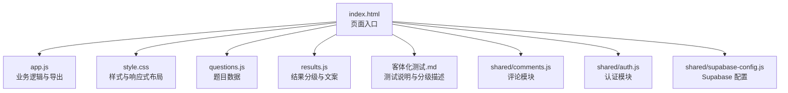
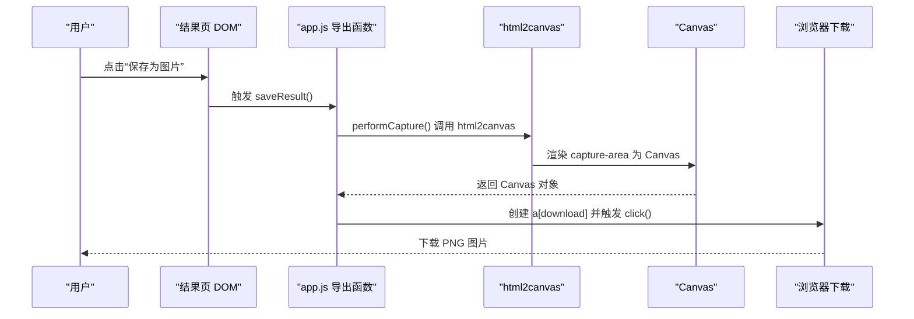
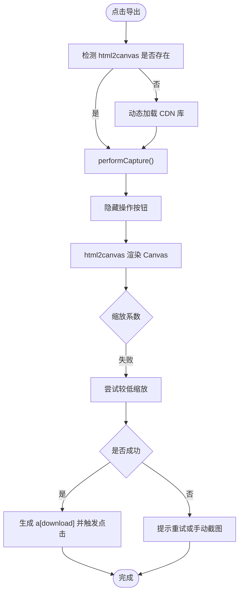
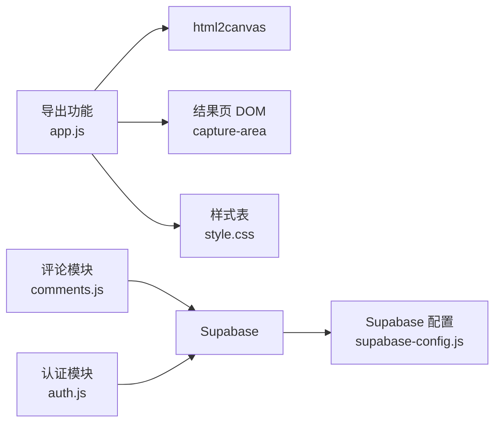

# 结果导出与分享功能

<cite>
**本文引用的文件**
- [app.js](file://ObjTest/app.js)
- [index.html](file://ObjTest/index.html)
- [style.css](file://ObjTest/style.css)
- [questions.js](file://ObjTest/questions.js)
- [results.js](file://ObjTest/results.js)
- [客体化测试.md](file://ObjTest/客体化测试.md)
- [auth.js](file://shared/auth.js)
- [comments.js](file://shared/comments.js)
- [supabase-config.js](file://shared/supabase-config.js)
</cite>

## 目录
1. [简介](#简介)
2. [项目结构](#项目结构)
3. [核心组件](#核心组件)
4. [架构概览](#架构概览)
5. [详细组件分析](#详细组件分析)
6. [依赖关系分析](#依赖关系分析)
7. [性能考量](#性能考量)
8. [故障排查指南](#故障排查指南)
9. [结论](#结论)
10. [附录](#附录)

## 简介
本文件聚焦于 ObjTest 的“结果导出与分享”功能，围绕以下目标展开：
- 解析图片保存功能的实现原理与 Canvas 渲染技术
- 详解 html2canvas 集成方案与参数配置
- 说明截图质量控制、尺寸适配、背景透明度设置与文件格式转换
- 解释结果页面的可打印性优化与二维码展示
- 提供导出功能定制指南、样式调整方法与第三方分享平台集成方案

## 项目结构
ObjTest 采用前端单页应用结构，核心页面包含开始页、答题页、加载页与结果页。结果页包含可导出区域与二维码展示区，并通过评论模块实现社交互动。

图表来源
- [index.html:1-170](file://ObjTest/index.html#L1-L170)
- [app.js:1-327](file://ObjTest/app.js#L1-L327)
- [style.css:1-612](file://ObjTest/style.css#L1-L612)
- [questions.js:1-403](file://ObjTest/questions.js#L1-L403)
- [results.js:1-55](file://ObjTest/results.js#L1-L55)
- [客体化测试.md:1-521](file://ObjTest/客体化测试.md#L1-L521)
- [comments.js:1-769](file://shared/comments.js#L1-L769)
- [auth.js:1-800](file://shared/auth.js#L1-L800)
- [supabase-config.js:1-26](file://shared/supabase-config.js#L1-L26)

章节来源
- [index.html:1-170](file://ObjTest/index.html#L1-L170)
- [app.js:1-327](file://ObjTest/app.js#L1-L327)
- [style.css:1-612](file://ObjTest/style.css#L1-L612)

## 核心组件
- 导出功能核心：位于结果页的可导出区域与导出按钮，调用 html2canvas 进行截图并下载 PNG 文件。
- 结果页面：包含评分、分级标题、特征描述、心理状态与建议内容，以及二维码与作者信息展示区。
- 评论与社交：结果页底部嵌入评论区，支持登录后发表与点赞。
- 认证与 Supabase：统一认证与数据库访问，支撑参与人数统计、结果浏览追踪与评论存储。

章节来源
- [index.html:110-158](file://ObjTest/index.html#L110-L158)
- [app.js:248-303](file://ObjTest/app.js#L248-L303)
- [results.js:8-54](file://ObjTest/results.js#L8-L54)
- [comments.js:208-281](file://shared/comments.js#L208-L281)
- [supabase-config.js:5-25](file://shared/supabase-config.js#L5-L25)

## 架构概览
结果导出与分享涉及前端渲染、Canvas 截图、文件下载与社交展示四个层面。下图展示从用户点击导出到最终下载的端到端流程。

图表来源
- [app.js:248-303](file://ObjTest/app.js#L248-L303)

## 详细组件分析

### 导出功能实现（html2canvas 集成）
- 触发入口：结果页的“保存为图片”按钮绑定到导出函数。
- 动态加载依赖：若未检测到 html2canvas，则动态注入 CDN 资源后执行截图。
- 截图区域：以结果页的可导出容器为目标，避免导出操作按钮。
- 参数配置：
  - useCORS：允许跨域资源
  - allowTaint：禁止污染画布
  - scale：缩放系数，提升清晰度
  - backgroundColor：设置背景色，避免透明背景导致的视觉问题
  - logging：关闭日志输出
- 回退策略：首次失败时尝试降低缩放系数，仍失败则提示用户重试或手动截图。
- 文件命名：包含时间戳，便于区分不同导出结果。
- 文件格式：PNG，保证无损压缩与透明背景支持。

图表来源
- [app.js:248-303](file://ObjTest/app.js#L248-L303)

章节来源
- [app.js:248-303](file://ObjTest/app.js#L248-L303)

### Canvas 渲染与质量控制
- 缩放系数（scale）：默认使用较高倍数以提升清晰度，同时在失败时回退到较低倍数。
- 背景颜色（backgroundColor）：设置为浅色背景，避免透明背景导致的视觉差异。
- 跨域与污染（useCORS/allowTaint）：允许跨域资源加载，同时禁止污染画布，确保安全与一致性。
- 日志控制（logging）：关闭日志输出，避免干扰用户界面。

章节来源
- [app.js:269-300](file://ObjTest/app.js#L269-L300)

### 尺寸适配与布局
- 结果页容器具备固定最大宽度与内边距，确保在不同设备上的可读性与可导出性。
- 移动端与桌面端的媒体查询优化，保证在小屏设备上也能完整导出关键信息。
- 导出区域（capture-area）包含评分、标题、特征、心理状态与建议，以及二维码与作者信息。

章节来源
- [index.html:110-158](file://ObjTest/index.html#L110-L158)
- [style.css:369-490](file://ObjTest/style.css#L369-L490)
- [style.css:576-611](file://ObjTest/style.css#L576-L611)

### 文件格式与命名
- 输出格式：PNG，支持透明背景与高质量图像。
- 文件命名：包含年月日时分秒的时间戳，便于用户管理与溯源。

章节来源
- [app.js:279-289](file://ObjTest/app.js#L279-L289)

### 结果页面可打印性优化
- 结构化内容：评分、标题、特征、心理状态与建议分区块展示，便于阅读与导出。
- 二维码与作者信息：固定位置展示，增强传播与溯源。
- 响应式设计：在移动端与桌面端均保持良好的可读性与可导出性。

章节来源
- [index.html:110-158](file://ObjTest/index.html#L110-L158)
- [style.css:443-490](file://ObjTest/style.css#L443-L490)

### 社交分享机制与二维码
- 二维码展示：结果页底部包含二维码图片与“扫码测评”文字，便于用户分享。
- 评论区：结果页嵌入评论模块，支持登录后发表与点赞，形成社交互动闭环。
- 认证与数据库：通过 Supabase 实现用户认证与数据持久化，保障功能可用性。

章节来源
- [index.html:145-154](file://ObjTest/index.html#L145-L154)
- [comments.js:208-281](file://shared/comments.js#L208-L281)
- [auth.js:35-40](file://shared/auth.js#L35-L40)
- [supabase-config.js:5-25](file://shared/supabase-config.js#L5-L25)

## 依赖关系分析
- 导出功能依赖 html2canvas 库，通过动态加载确保按需引入。
- 结果页面依赖样式表以保证导出时的视觉一致性。
- 评论与认证模块依赖 Supabase，提供用户态与数据存储能力。

图表来源
- [app.js:248-303](file://ObjTest/app.js#L248-L303)
- [index.html:110-158](file://ObjTest/index.html#L110-L158)
- [style.css:1-612](file://ObjTest/style.css#L1-L612)
- [comments.js:20-25](file://shared/comments.js#L20-L25)
- [auth.js:35-40](file://shared/auth.js#L35-L40)
- [supabase-config.js:5-25](file://shared/supabase-config.js#L5-L25)

章节来源
- [app.js:248-303](file://ObjTest/app.js#L248-L303)
- [comments.js:20-25](file://shared/comments.js#L20-L25)
- [auth.js:35-40](file://shared/auth.js#L35-L40)
- [supabase-config.js:5-25](file://shared/supabase-config.js#L5-L25)

## 性能考量
- 动态加载 html2canvas：减少初始包体积，按需加载。
- 缩放系数回退：在失败时自动降低缩放，提升成功率与用户体验。
- 背景颜色设置：避免透明背景带来的渲染差异，提高一致性。
- 响应式布局：在移动端与桌面端均保持良好体验，减少重复渲染。

## 故障排查指南
- 导出失败或空白图
  - 检查 html2canvas 是否成功加载与渲染
  - 确认目标元素（capture-area）可见且包含内容
  - 尝试降低缩放系数或更换背景色
  - 若仍失败，提示用户重试或手动截图
- 跨域资源无法加载
  - 确保资源支持 CORS 或使用代理
  - 避免 allowTaint 导致的安全限制
- 二维码或作者信息未显示
  - 检查图片路径与加载状态
  - 确认结果页容器包含二维码与作者信息区块

章节来源
- [app.js:291-299](file://ObjTest/app.js#L291-L299)
- [index.html:145-154](file://ObjTest/index.html#L145-L154)

## 结论
ObjTest 的结果导出与分享功能以 html2canvas 为核心，结合动态加载、参数优化与回退策略，实现了高质量、可定制的图片导出体验。配合结果页面的结构化展示与二维码展示，以及评论与认证模块，形成了完整的社交分享闭环。通过样式与响应式设计的优化，确保在多设备环境下的一致性与可用性。

## 附录

### 导出功能定制指南
- 调整缩放系数：在导出函数中修改缩放参数以平衡清晰度与性能
- 更改背景色：根据主题调整背景颜色，确保导出一致性
- 自定义文件名：在导出函数中修改文件名生成逻辑
- 扩展导出区域：在结果页容器中添加或移除内容，影响导出范围

章节来源
- [app.js:269-289](file://ObjTest/app.js#L269-L289)

### 样式调整方法
- 修改结果页容器的最大宽度与内边距，以适配不同分辨率
- 调整移动端与桌面端的媒体查询，优化在小屏设备上的展示
- 统一字体与字号，确保导出时的视觉一致性

章节来源
- [style.css:369-490](file://ObjTest/style.css#L369-L490)
- [style.css:576-611](file://ObjTest/style.css#L576-L611)

### 第三方分享平台集成方案
- 社交媒体分享：可在结果页增加分享按钮，调用平台 API 或使用通用分享接口
- 评论与互动：通过评论模块实现用户互动，增强传播效果
- 认证与数据：借助 Supabase 实现用户态与数据持久化，保障分享与互动的可靠性

章节来源
- [comments.js:208-281](file://shared/comments.js#L208-L281)
- [auth.js:35-40](file://shared/auth.js#L35-L40)
- [supabase-config.js:5-25](file://shared/supabase-config.js#L5-L25)