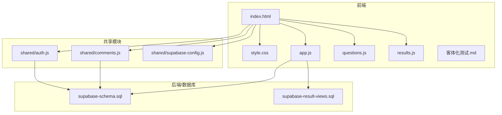
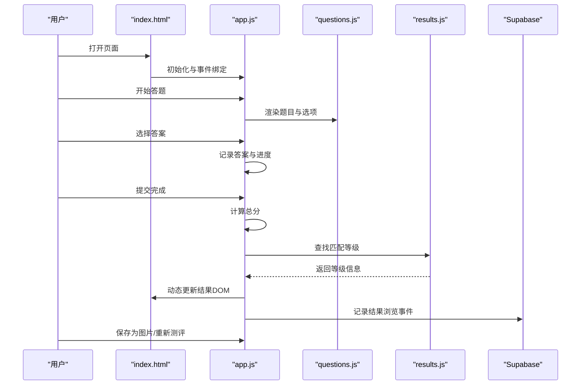
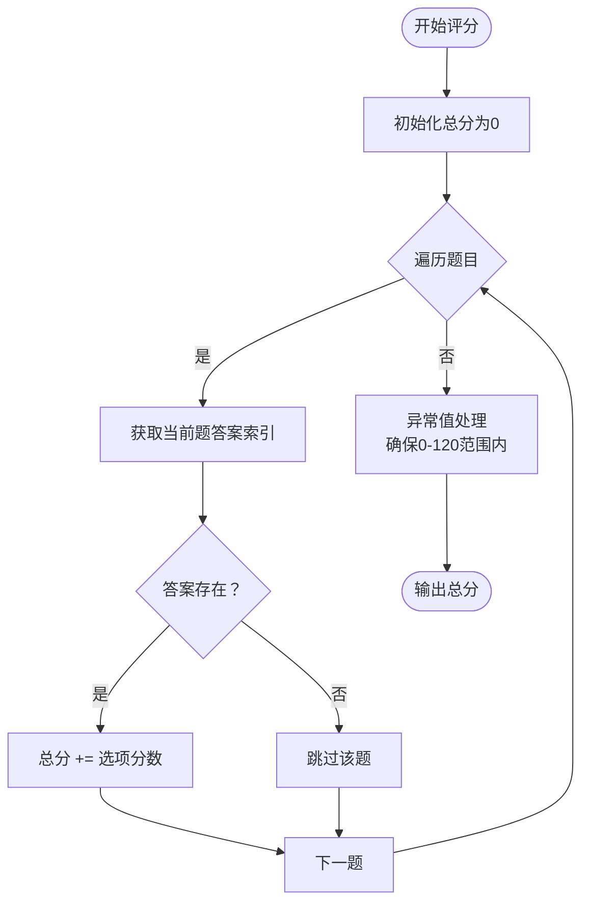
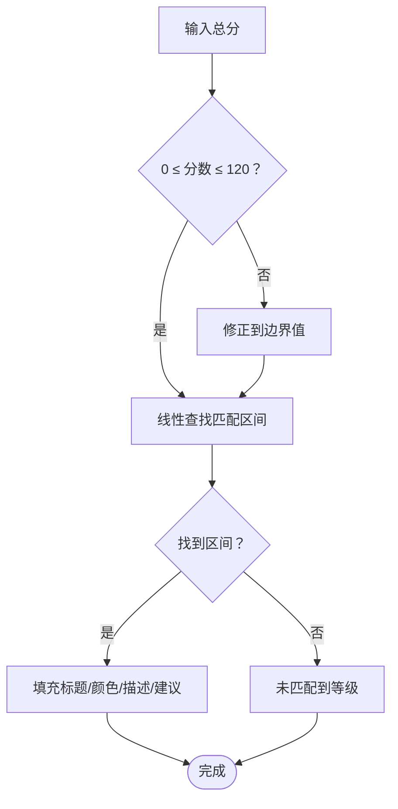
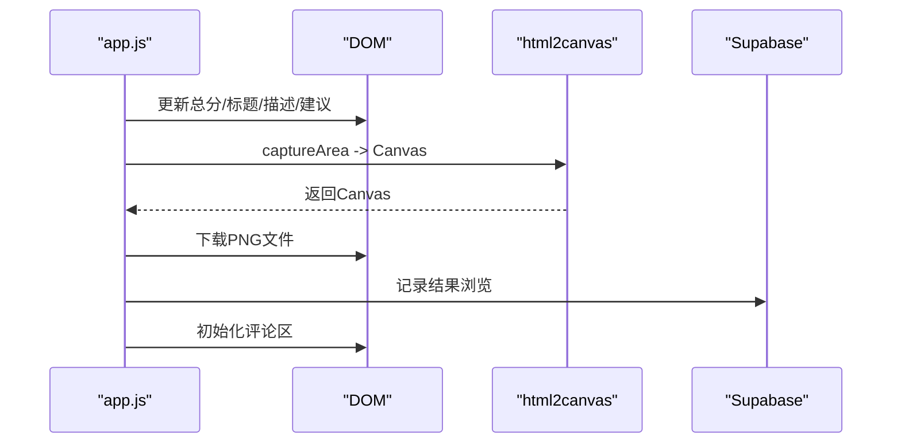
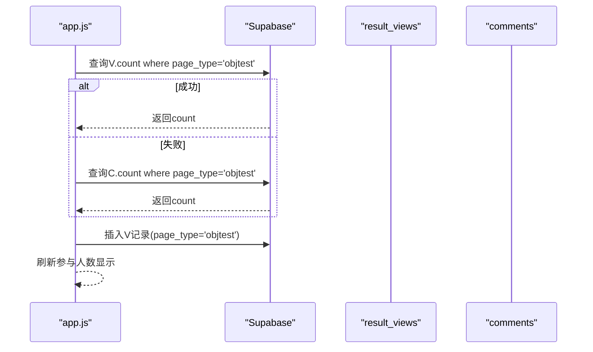
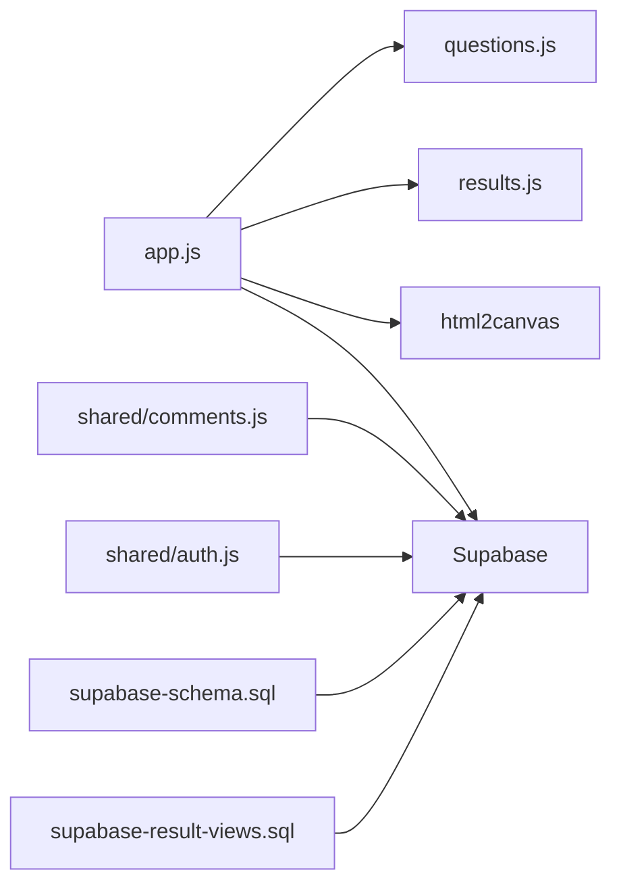

# 评分算法与结果分析

<cite>
**本文档引用的文件**
- [ObjTest/app.js](file://ObjTest/app.js)
- [ObjTest/questions.js](file://ObjTest/questions.js)
- [ObjTest/results.js](file://ObjTest/results.js)
- [ObjTest/index.html](file://ObjTest/index.html)
- [ObjTest/style.css](file://ObjTest/style.css)
- [ObjTest/客体化测试.md](file://ObjTest/客体化测试.md)
- [shared/comments.js](file://shared/comments.js)
- [shared/auth.js](file://shared/auth.js)
- [shared/supabase-config.js](file://shared/supabase-config.js)
- [supabase-schema.sql](file://supabase-schema.sql)
- [supabase-result-views.sql](file://supabase-result-views.sql)
</cite>

## 目录
1. [简介](#简介)
2. [项目结构](#项目结构)
3. [核心组件](#核心组件)
4. [架构概览](#架构概览)
5. [详细组件分析](#详细组件分析)
6. [依赖关系分析](#依赖关系分析)
7. [性能考量](#性能考量)
8. [故障排除指南](#故障排除指南)
9. [结论](#结论)
10. [附录](#附录)

## 简介
本文件面向“ObjTest自我客体化测评”系统，提供评分算法与结果分析的技术文档。内容涵盖量化评分设计原理、总分计算方法、等级划分标准、异常值处理策略、结果解读算法与个性化建议生成机制，以及结果报告的动态生成流程、文本模板系统与多语言支持实现路径。同时给出评分规则调整指南、新等级定义方法与结果分析扩展开发方案。

## 项目结构
ObjTest位于仓库根目录下的ObjTest子目录，采用前端单页应用架构，结合Supabase进行数据存储与认证。核心文件包括问题清单、评分规则、结果展示逻辑、样式与模板说明，以及评论与认证集成模块。

**图表来源**
- [ObjTest/index.html:1-170](file://ObjTest/index.html#L1-L170)
- [ObjTest/app.js:1-327](file://ObjTest/app.js#L1-L327)
- [ObjTest/questions.js:1-403](file://ObjTest/questions.js#L1-L403)
- [ObjTest/results.js:1-55](file://ObjTest/results.js#L1-L55)
- [shared/comments.js:1-769](file://shared/comments.js#L1-L769)
- [shared/auth.js:1-800](file://shared/auth.js#L1-L800)
- [shared/supabase-config.js:1-26](file://shared/supabase-config.js#L1-L26)
- [supabase-schema.sql:1-97](file://supabase-schema.sql#L1-L97)
- [supabase-result-views.sql:1-32](file://supabase-result-views.sql#L1-L32)

**章节来源**
- [ObjTest/index.html:1-170](file://ObjTest/index.html#L1-L170)
- [ObjTest/app.js:1-327](file://ObjTest/app.js#L1-L327)
- [ObjTest/questions.js:1-403](file://ObjTest/questions.js#L1-L403)
- [ObjTest/results.js:1-55](file://ObjTest/results.js#L1-L55)
- [shared/comments.js:1-769](file://shared/comments.js#L1-L769)
- [shared/auth.js:1-800](file://shared/auth.js#L1-L800)
- [shared/supabase-config.js:1-26](file://shared/supabase-config.js#L1-L26)
- [supabase-schema.sql:1-97](file://supabase-schema.sql#L1-L97)
- [supabase-result-views.sql:1-32](file://supabase-result-views.sql#L1-L32)

## 核心组件
- 评分算法引擎：负责遍历题目集合，累加选项得分，得出总分。
- 等级划分器：依据预设区间将总分映射到不同等级，输出标题、描述、心理状态与建议。
- 结果渲染器：将等级信息注入DOM，动态更新页面元素，并触发评论区初始化。
- 参与人数统计与结果浏览追踪：通过Supabase记录页面类型为“objtest”的浏览事件，提供参与人数展示。
- 结果海报生成：使用html2canvas将结果区域截图导出PNG，支持缩放与容错重试。
- 文本模板系统：结果页包含“主要特征”“心理状态”“建议与行动”三段模板，由等级配置驱动。
- 多语言支持：当前页面以中文为主，若需国际化，可在问题与结果模板中引入i18n键值映射与切换逻辑。

**章节来源**
- [ObjTest/app.js:207-242](file://ObjTest/app.js#L207-L242)
- [ObjTest/results.js:8-54](file://ObjTest/results.js#L8-L54)
- [ObjTest/index.html:110-158](file://ObjTest/index.html#L110-L158)
- [ObjTest/app.js:248-303](file://ObjTest/app.js#L248-L303)

## 架构概览
系统采用前后端分离的静态前端+Supabase后端模式。前端负责交互、评分与结果展示；后端提供认证、评论、存储与浏览统计等功能。数据流如下：

**图表来源**
- [ObjTest/index.html:160-166](file://ObjTest/index.html#L160-L166)
- [ObjTest/app.js:86-242](file://ObjTest/app.js#L86-L242)
- [ObjTest/questions.js:1-403](file://ObjTest/questions.js#L1-L403)
- [ObjTest/results.js:8-54](file://ObjTest/results.js#L8-L54)

## 详细组件分析

### 评分算法与总分计算
- 数据结构：题目数组，每题包含唯一ID、题干与四个选项，每个选项含文本与分数。
- 计算逻辑：遍历题目，按已选项索引取对应分数并累加，得到总分。
- 范围约束：总分范围为0-120分（40题×最高3分），超出范围将被截断至最近边界（见异常值处理）。

**图表来源**
- [ObjTest/app.js:207-217](file://ObjTest/app.js#L207-L217)
- [ObjTest/questions.js:1-403](file://ObjTest/questions.js#L1-L403)

**章节来源**
- [ObjTest/app.js:207-217](file://ObjTest/app.js#L207-L217)
- [ObjTest/questions.js:1-403](file://ObjTest/questions.js#L1-L403)

### 等级划分与结果解读
- 等级区间：0-24、25-48、49-72、73-96、97-120五个区间，分别对应健康、轻度、中度、重度、极重度客体化。
- 结果字段：标题、颜色、主要特征、心理状态、建议与行动。
- 解读算法：线性扫描匹配区间，命中即停止；颜色用于视觉强调。

**图表来源**
- [ObjTest/app.js:219-242](file://ObjTest/app.js#L219-L242)
- [ObjTest/results.js:8-54](file://ObjTest/results.js#L8-L54)

**章节来源**
- [ObjTest/app.js:219-242](file://ObjTest/app.js#L219-L242)
- [ObjTest/results.js:8-54](file://ObjTest/results.js#L8-L54)

### 结果报告动态生成与海报导出
- DOM更新：将总分、等级标题、颜色、描述、心理状态、建议注入对应容器。
- 海报导出：使用html2canvas捕获结果区域，支持缩放与容错重试，生成PNG下载链接。
- 评论区集成：结果页加载完成后初始化评论模块，支持登录、点赞、回复与图片附件。

**图表来源**
- [ObjTest/app.js:219-242](file://ObjTest/app.js#L219-L242)
- [ObjTest/app.js:248-303](file://ObjTest/app.js#L248-L303)
- [ObjTest/index.html:156-158](file://ObjTest/index.html#L156-L158)
- [shared/comments.js:208-281](file://shared/comments.js#L208-L281)

**章节来源**
- [ObjTest/app.js:219-242](file://ObjTest/app.js#L219-L242)
- [ObjTest/app.js:248-303](file://ObjTest/app.js#L248-L303)
- [ObjTest/index.html:156-158](file://ObjTest/index.html#L156-L158)
- [shared/comments.js:208-281](file://shared/comments.js#L208-L281)

### 参与人数统计与结果浏览追踪
- 统计来源：优先查询result_views表中page_type='objtest'的精确计数；若失败则回退到comments表的page_type='objtest'计数。
- 记录行为：每次进入结果页时插入一条浏览记录，随后刷新计数展示。
- 安全策略：通过Supabase RLS控制读写权限，匿名与登录用户均可写入。

**图表来源**
- [ObjTest/app.js:23-64](file://ObjTest/app.js#L23-L64)
- [supabase-result-views.sql:1-32](file://supabase-result-views.sql#L1-L32)

**章节来源**
- [ObjTest/app.js:23-64](file://ObjTest/app.js#L23-L64)
- [supabase-result-views.sql:1-32](file://supabase-result-views.sql#L1-L32)

### 文本模板系统与多语言支持
- 模板结构：结果页包含“主要特征”“心理状态”“建议与行动”三个区块，内容来自等级配置。
- 多语言扩展：建议在questions.js与results.js中引入i18n键值映射，通过语言切换函数动态替换文本；同时在模板中保留占位符以便国际化。

**章节来源**
- [ObjTest/index.html:118-131](file://ObjTest/index.html#L118-L131)
- [ObjTest/results.js:8-54](file://ObjTest/results.js#L8-L54)

### 个性化建议生成机制
- 建议来源：每个等级配置包含针对性建议，如“每周实践”“紧急行动”等，覆盖自我觉察、边界设定与专业求助等维度。
- 扩展思路：可引入用户画像（如性别、年龄、关系状态）与AI提示词工程，动态组合更个性化的行动清单。

**章节来源**
- [ObjTest/results.js:24-51](file://ObjTest/results.js#L24-L51)

## 依赖关系分析
- 前端依赖：index.html引入Supabase SDK与共享模块；app.js依赖questions.js与results.js；comments.js与auth.js提供评论与认证能力。
- 后端依赖：supabase-schema.sql定义profiles、comments与storage策略；supabase-result-views.sql定义浏览统计表与策略。
- 运行时依赖：html2canvas用于截图导出；Supabase客户端通过shared/supabase-config.js全局初始化。

**图表来源**
- [ObjTest/app.js:1-327](file://ObjTest/app.js#L1-L327)
- [ObjTest/questions.js:1-403](file://ObjTest/questions.js#L1-L403)
- [ObjTest/results.js:1-55](file://ObjTest/results.js#L1-L55)
- [shared/comments.js:1-769](file://shared/comments.js#L1-L769)
- [shared/auth.js:1-800](file://shared/auth.js#L1-L800)
- [shared/supabase-config.js:1-26](file://shared/supabase-config.js#L1-L26)
- [supabase-schema.sql:1-97](file://supabase-schema.sql#L1-L97)
- [supabase-result-views.sql:1-32](file://supabase-result-views.sql#L1-L32)

**章节来源**
- [ObjTest/app.js:1-327](file://ObjTest/app.js#L1-L327)
- [shared/comments.js:1-769](file://shared/comments.js#L1-L769)
- [shared/auth.js:1-800](file://shared/auth.js#L1-L800)
- [shared/supabase-config.js:1-26](file://shared/supabase-config.js#L1-L26)
- [supabase-schema.sql:1-97](file://supabase-schema.sql#L1-L97)
- [supabase-result-views.sql:1-32](file://supabase-result-views.sql#L1-L32)

## 性能考量
- 评分计算：O(n)线性扫描，n为题目数量（固定40题），常数极小，性能开销可忽略。
- DOM更新：批量注入文本与样式，避免重复查询；结果页切换时仅更新必要节点。
- 图片导出：默认使用较高scale进行截图，若失败自动降级重试，兼顾质量与稳定性。
- 网络请求：参与人数统计与结果浏览记录均为轻量查询/插入，建议在结果页延迟触发以减少首屏阻塞。

[本节为通用指导，无需特定文件来源]

## 故障排除指南
- 参与人数统计不可用：检查Supabase连接与result_views表策略是否生效；若comments表回退也失败，确认数据库迁移脚本执行情况。
- 结果海报导出失败：确认html2canvas脚本加载成功；若高倍率失败，系统会自动降低scale重试；仍失败时提示用户截图保存。
- 评论功能异常：检查comments表与storage策略是否完整执行；若提示“未完成升级”，需先运行supabase-community-upgrade.sql。
- 认证问题：确认shared/supabase-config.js中的URL与Key正确；检查Supabase Dashboard的认证服务状态。

**章节来源**
- [ObjTest/app.js:23-64](file://ObjTest/app.js#L23-L64)
- [ObjTest/app.js:248-303](file://ObjTest/app.js#L248-L303)
- [shared/comments.js:333-344](file://shared/comments.js#L333-L344)
- [shared/supabase-config.js:1-26](file://shared/supabase-config.js#L1-L26)

## 结论
ObjTest系统以简洁高效的前端架构实现了自我客体化测评的完整闭环：从题目呈现、评分计算、等级判定到结果展示与社交互动。其评分规则清晰、等级划分合理、结果模板直观，具备良好的可维护性与扩展性。建议后续在个性化建议、多语言支持与数据分析方面持续优化，以提升用户体验与研究价值。

[本节为总结性内容，无需特定文件来源]

## 附录

### 评分规则调整指南
- 修改题目分数：在questions.js中调整选项score值，注意保持相邻选项分数差合理，避免极端跳变。
- 调整等级区间：在results.js中修改resultTiers的minScore/maxScore，确保区间连续且覆盖0-120。
- 更新文案：在results.js中修改对应等级的title/description/psychState/advice，保持风格一致。
- 影响范围：上述改动将直接影响总分分布、等级映射与结果文案，建议进行A/B测试或专家评审。

**章节来源**
- [ObjTest/questions.js:1-403](file://ObjTest/questions.js#L1-L403)
- [ObjTest/results.js:8-54](file://ObjTest/results.js#L8-L54)

### 新等级定义方法
- 新增区间：在resultTiers末尾追加新区间对象，设置minScore、maxScore、title、color与文案。
- 验证覆盖：确保新区间与现有区间无缝衔接，且总分上限为120。
- 视觉统一：为新等级指定合适颜色，保证与现有主题一致。

**章节来源**
- [ObjTest/results.js:8-54](file://ObjTest/results.js#L8-L54)

### 结果分析扩展开发方案
- 数据采集：在result_views表中增加更多维度字段（如设备、地区、时间），便于趋势分析。
- 仪表盘：基于Supabase视图与实时订阅构建可视化面板，展示等级分布与变化曲线。
- AI辅助：引入提示词工程与LLM，对用户回答进行语义分析，生成更深入的洞察与建议。
- 多语言：在questions.js与results.js中引入i18n键值映射，支持动态切换语言。

**章节来源**
- [supabase-result-views.sql:1-32](file://supabase-result-views.sql#L1-L32)
- [ObjTest/results.js:8-54](file://ObjTest/results.js#L8-L54)