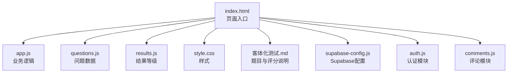
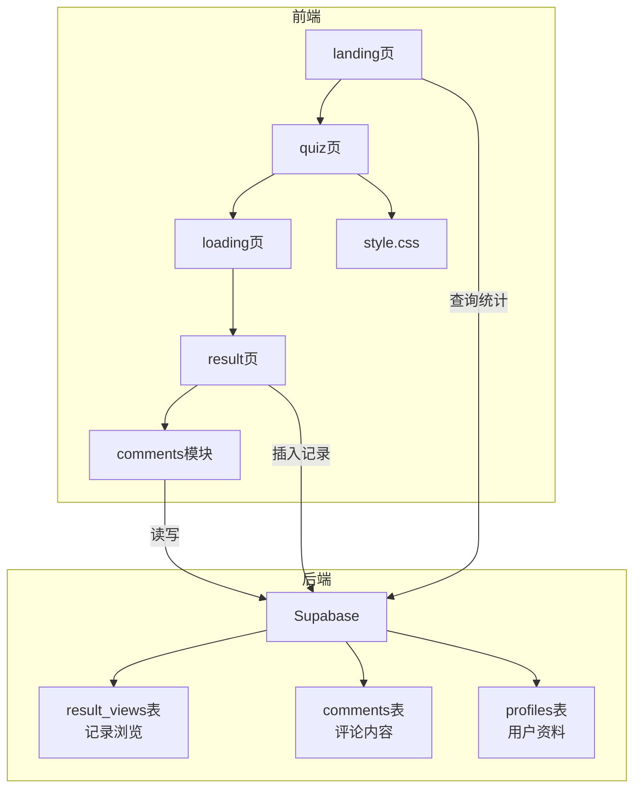
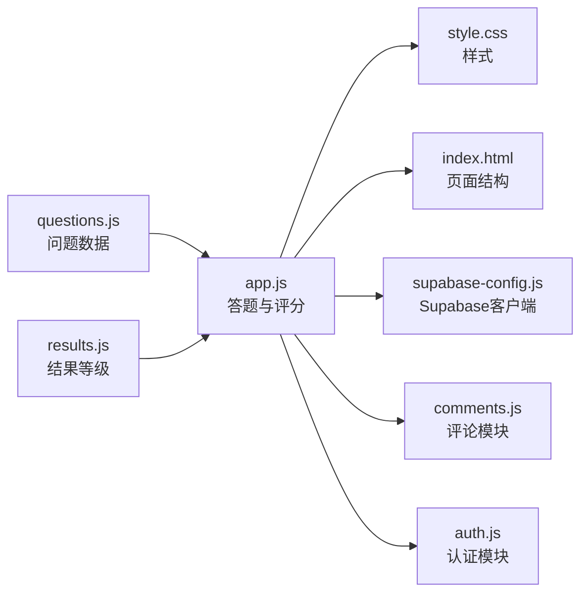
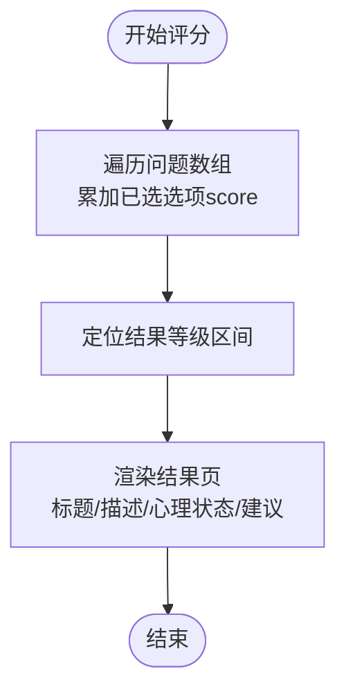

# 问题管理系统

<cite>
**本文引用的文件**
- [app.js](file://ObjTest/app.js)
- [questions.js](file://ObjTest/questions.js)
- [results.js](file://ObjTest/results.js)
- [index.html](file://ObjTest/index.html)
- [style.css](file://ObjTest/style.css)
- [客体化测试.md](file://ObjTest/客体化测试.md)
- [supabase-config.js](file://shared/supabase-config.js)
- [auth.js](file://shared/auth.js)
- [comments.js](file://shared/comments.js)
</cite>

## 目录
1. [简介](#简介)
2. [项目结构](#项目结构)
3. [核心组件](#核心组件)
4. [架构总览](#架构总览)
5. [详细组件分析](#详细组件分析)
6. [依赖关系分析](#依赖关系分析)
7. [性能考量](#性能考量)
8. [故障排查指南](#故障排查指南)
9. [结论](#结论)
10. [附录](#附录)

## 简介
本文件为“ObjTest问题管理系统”的技术文档，聚焦于40道客体化问题的前端实现与运行机制。系统采用纯前端架构，通过本地问题数据驱动答题流程，计算总分并映射到结果等级，最终输出评估报告。文档将深入解析：
- 40道客体化问题的数据结构设计与评分规则
- 答案选项处理、跳转逻辑与进度跟踪
- 结果等级划分与呈现策略
- 参与人数统计与结果浏览追踪
- 评论区集成与异常处理机制
- 新问题添加流程、验证规则与批量导入思路

## 项目结构
ObjTest目录包含前端页面、样式与问题数据，以及共享的认证与评论模块。整体结构如下：

图表来源
- [index.html:1-170](file://ObjTest/index.html#L1-L170)
- [app.js:1-327](file://ObjTest/app.js#L1-L327)
- [questions.js:1-403](file://ObjTest/questions.js#L1-L403)
- [results.js:1-55](file://ObjTest/results.js#L1-L55)
- [style.css:1-612](file://ObjTest/style.css#L1-L612)
- [客体化测试.md:1-521](file://ObjTest/客体化测试.md#L1-L521)
- [supabase-config.js:1-26](file://shared/supabase-config.js#L1-L26)
- [auth.js:1-800](file://shared/auth.js#L1-L800)
- [comments.js:1-769](file://shared/comments.js#L1-L769)

章节来源
- [index.html:1-170](file://ObjTest/index.html#L1-L170)
- [app.js:1-327](file://ObjTest/app.js#L1-L327)
- [questions.js:1-403](file://ObjTest/questions.js#L1-L403)
- [results.js:1-55](file://ObjTest/results.js#L1-L55)
- [style.css:1-612](file://ObjTest/style.css#L1-L612)
- [客体化测试.md:1-521](file://ObjTest/客体化测试.md#L1-L521)
- [supabase-config.js:1-26](file://shared/supabase-config.js#L1-L26)
- [auth.js:1-800](file://shared/auth.js#L1-L800)
- [comments.js:1-769](file://shared/comments.js#L1-L769)

## 核心组件
- 页面与路由
  - landing页：展示计分说明、参与人数与开始按钮
  - quiz页：逐题答题、进度条与导航
  - loading页：计算评分前的过渡界面
  - result页：总分、等级标题、描述、心理状态与建议
- 数据与逻辑
  - 问题数组questions：包含40题，每题含id、text与options（含score）
  - 结果等级数组resultTiers：按分数区间映射等级标题、颜色、描述、心理状态与建议
  - 全局状态：currentQuestion、answers（qId->idx）、totalScore
- 外部服务
  - Supabase：参与人数统计、结果浏览记录、评论与用户资料

章节来源
- [index.html:34-158](file://ObjTest/index.html#L34-L158)
- [app.js:1-327](file://ObjTest/app.js#L1-L327)
- [questions.js:1-403](file://ObjTest/questions.js#L1-L403)
- [results.js:1-55](file://ObjTest/results.js#L1-L55)
- [supabase-config.js:1-26](file://shared/supabase-config.js#L1-L26)

## 架构总览
系统采用“静态页面 + 本地数据 + Supabase后端”的混合架构。前端负责交互与评分，后端负责持久化与统计。

图表来源
- [index.html:1-170](file://ObjTest/index.html#L1-L170)
- [app.js:23-64](file://ObjTest/app.js#L23-L64)
- [comments.js:208-345](file://shared/comments.js#L208-L345)
- [supabase-config.js:1-26](file://shared/supabase-config.js#L1-L26)

## 详细组件分析

### 问题数据结构与评分规则
- 数据结构
  - 每题对象包含：id（唯一标识）、text（问题文本）、options（数组）
  - 每个选项对象包含：text（选项文本）、score（数值分数）
- 评分规则
  - 总分 = 所有已选题的选项score之和
  - 40题，每题1个选项，总分范围0-120
- 难度分级
  - 通过resultTiers按分数区间映射等级标题、颜色、描述、心理状态与建议
  - 分级区间：0-24、25-48、49-72、73-96、97-120

章节来源
- [questions.js:1-403](file://ObjTest/questions.js#L1-L403)
- [results.js:8-54](file://ObjTest/results.js#L8-L54)
- [客体化测试.md:13-21](file://ObjTest/客体化测试.md#L13-L21)

### 答案选项处理与跳转逻辑
- 选择选项
  - 用户点击选项后，记录answers[qId]=idx，并高亮选中项
  - 若为最后一题，按钮文案切换为“查看结果”
- 导航控制
  - 上一题/下一题按钮禁用状态由currentQuestion与是否有答案决定
  - 键盘支持：方向键左右切换，数字键1-4快速选择
- 进度跟踪
  - 进度条宽度 = (currentQuestion / questions.length) * 100%
  - 顶部显示“当前题号/总题数”

章节来源
- [app.js:147-187](file://ObjTest/app.js#L147-L187)
- [index.html:62-99](file://ObjTest/index.html#L62-L99)

### 计算与结果呈现
- 计算总分
  - 遍历问题数组，累加answers[qId]对应的选项score
- 结果映射
  - 二分查找或顺序扫描定位resultTiers区间，获取对应等级
- 结果页渲染
  - 展示总分、等级标题（带颜色）、描述、心理状态与建议
  - 提供保存为图片与重新测评功能
  - 评论区延迟初始化，便于结果页加载完成

章节来源
- [app.js:207-242](file://ObjTest/app.js#L207-L242)
- [results.js:8-54](file://ObjTest/results.js#L8-L54)
- [index.html:110-158](file://ObjTest/index.html#L110-L158)

### 参与人数统计与浏览追踪
- 参与人数
  - landing页加载时查询result_views表（或comments表回退），渲染“已有X人参与测试”
- 浏览追踪
  - 每次进入result页时插入一条result_views记录，同时刷新参与人数
- 异常处理
  - 查询失败时输出错误日志，提示“参与人数统计暂不可用”

章节来源
- [app.js:23-64](file://ObjTest/app.js#L23-L64)
- [supabase-config.js:1-26](file://shared/supabase-config.js#L1-L26)

### 评论区集成与交互
- 初始化
  - result页加载后延迟初始化评论区，绑定页面类型为“objtest”
- 发布与回复
  - 支持文字与图片（最大5MB），提交时乐观更新列表，失败回滚
  - 回复支持最多3层嵌套，超过3层扁平化展示
- 点赞与删除
  - 点赞去重，权限校验失败时提示升级SQL脚本
  - 删除评论时级联删除其回复
- 用户态
  - 未登录时显示登录提示，登录后显示头像与昵称

章节来源
- [app.js:238-242](file://ObjTest/app.js#L238-L242)
- [comments.js:208-345](file://shared/comments.js#L208-L345)
- [comments.js:511-643](file://shared/comments.js#L511-L643)
- [comments.js:645-708](file://shared/comments.js#L645-L708)
- [auth.js:292-417](file://shared/auth.js#L292-L417)

### 保存结果为图片
- 功能说明
  - 使用html2canvas捕获结果区域，生成PNG并触发下载
  - 失败时自动降级重试，最终提示用户手动截图
- 注意事项
  - 临时隐藏操作按钮，避免被截图包含

章节来源
- [app.js:248-303](file://ObjTest/app.js#L248-L303)

### 键盘导航与无障碍
- 方向键：左/右切换题，Enter确认已选答案
- 数字键：1-4快速选择对应选项
- 选项高亮与按钮状态联动，提升可访问性

章节来源
- [app.js:305-325](file://ObjTest/app.js#L305-L325)

## 依赖关系分析

图表来源
- [questions.js:1-403](file://ObjTest/questions.js#L1-L403)
- [results.js:1-55](file://ObjTest/results.js#L1-L55)
- [app.js:1-327](file://ObjTest/app.js#L1-L327)
- [style.css:1-612](file://ObjTest/style.css#L1-L612)
- [index.html:1-170](file://ObjTest/index.html#L1-L170)
- [supabase-config.js:1-26](file://shared/supabase-config.js#L1-L26)
- [comments.js:1-769](file://shared/comments.js#L1-L769)
- [auth.js:1-800](file://shared/auth.js#L1-L800)

章节来源
- [app.js:1-327](file://ObjTest/app.js#L1-L327)
- [questions.js:1-403](file://ObjTest/questions.js#L1-L403)
- [results.js:1-55](file://ObjTest/results.js#L1-L55)
- [index.html:1-170](file://ObjTest/index.html#L1-L170)
- [style.css:1-612](file://ObjTest/style.css#L1-L612)
- [supabase-config.js:1-26](file://shared/supabase-config.js#L1-L26)
- [comments.js:1-769](file://shared/comments.js#L1-L769)
- [auth.js:1-800](file://shared/auth.js#L1-L800)

## 性能考量
- 评分计算
  - 时间复杂度O(n)，n为问题数量（40题），线性遍历，性能优异
- DOM更新
  - 渲染时使用淡入效果与节流（延时渲染），减少闪烁
- 图片导出
  - 默认缩放2，失败自动降级至1.2，兼顾质量与性能
- 评论加载
  - 初始加载限制120条，分页加载更多，避免一次性渲染过多节点

章节来源
- [app.js:207-217](file://ObjTest/app.js#L207-L217)
- [app.js:94-145](file://ObjTest/app.js#L94-L145)
- [app.js:259-303](file://ObjTest/app.js#L259-L303)
- [comments.js:309-345](file://shared/comments.js#L309-L345)

## 故障排查指南
- 参与人数统计失败
  - 检查Supabase连接与result_views表是否存在；若不存在回退到comments表
  - 查看浏览器控制台错误日志
- 保存结果失败
  - 确认html2canvas脚本加载成功；若失败自动降级重试
  - 建议用户手动截图保存
- 评论功能不可用
  - 检查是否执行了升级SQL脚本；若提示“未完成升级”，请先执行相关脚本
  - 点赞/删除失败时，检查数据库权限与comment_likes表是否存在
- 认证相关问题
  - 邮箱验证码发送频繁、超时或无效时，根据错误消息提示重试或更换邮箱
  - 密码长度不足或格式不正确时，按提示调整

章节来源
- [app.js:23-64](file://ObjTest/app.js#L23-L64)
- [app.js:248-303](file://ObjTest/app.js#L248-L303)
- [comments.js:333-344](file://shared/comments.js#L333-L344)
- [comments.js:634-638](file://shared/comments.js#L634-L638)
- [comments.js:680-687](file://shared/comments.js#L680-L687)
- [auth.js:115-147](file://shared/auth.js#L115-L147)

## 结论
ObjTest问题管理系统以简洁高效的前端架构实现了完整的客体化测评流程。通过本地问题数据与Supabase后端的结合，系统具备良好的扩展性与可维护性。建议后续在以下方面持续优化：
- 新问题添加流程标准化与自动化校验
- 批量导入功能的可视化与错误提示
- 结果导出格式多样化（PDF/Word）
- 评论区权限与内容审核机制完善

## 附录

### 新问题添加流程与验证规则
- 添加步骤
  - 在questions.js中新增题对象，确保id连续且唯一
  - 为每个选项设置合理score值，保证总分范围符合预期
  - 在index.html中更新计分说明与页面文案
  - 在客体化测试.md中同步更新题目与评分说明
- 验证规则
  - 每题仅允许1个选项被选中
  - score应为整数，避免浮点导致的统计偏差
  - 选项数量建议固定为4，便于键盘快捷键与UI布局统一
- 批量导入思路
  - 设计JSON模板，包含id、text、options（含text与score）
  - 前端提供导入界面，校验模板字段与数据类型
  - 导入后进行重复id检测与score范围校验，失败则提示具体问题

章节来源
- [questions.js:1-403](file://ObjTest/questions.js#L1-L403)
- [客体化测试.md:13-21](file://ObjTest/客体化测试.md#L13-L21)
- [index.html:39-47](file://ObjTest/index.html#L39-L47)

### 评分与等级映射流程图

图表来源
- [app.js:207-242](file://ObjTest/app.js#L207-L242)
- [results.js:8-54](file://ObjTest/results.js#L8-L54)