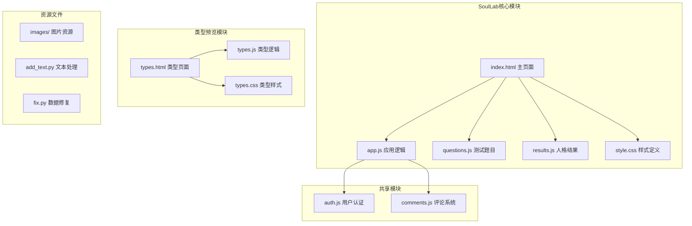
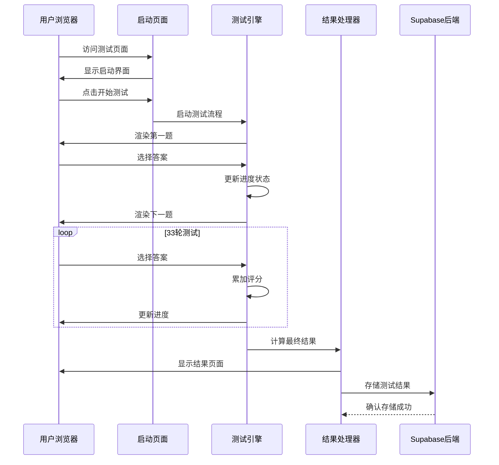
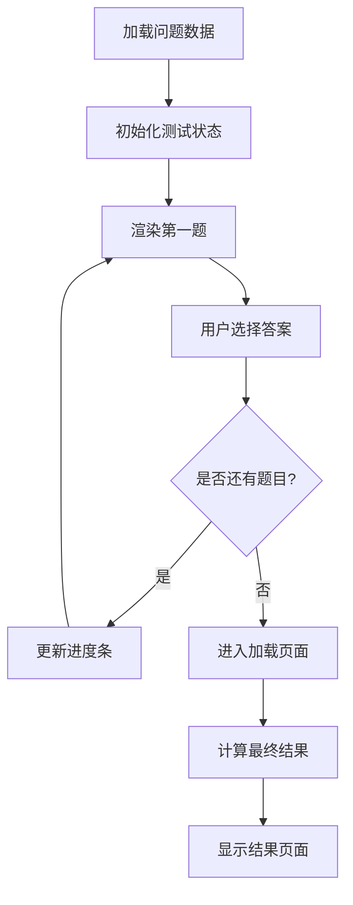
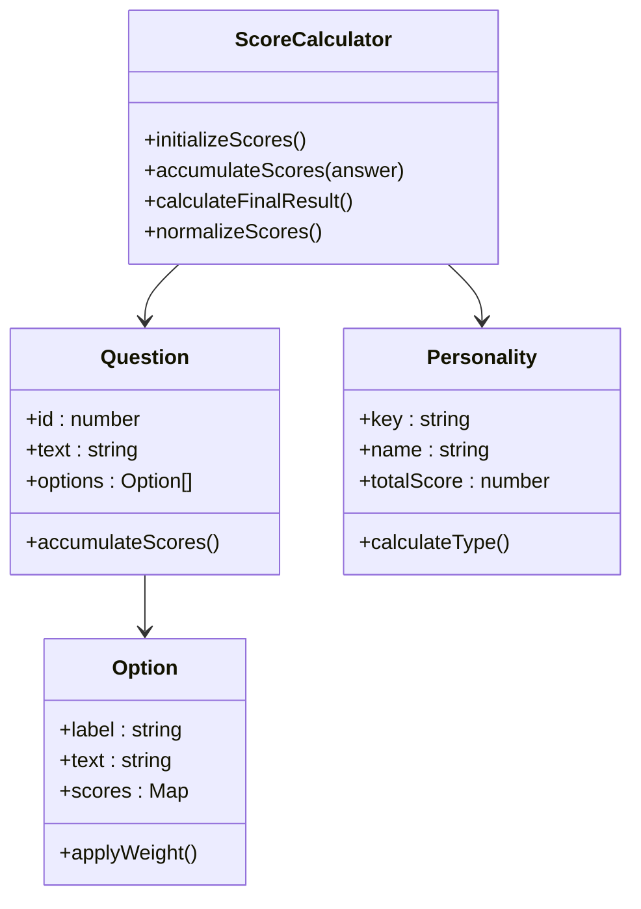
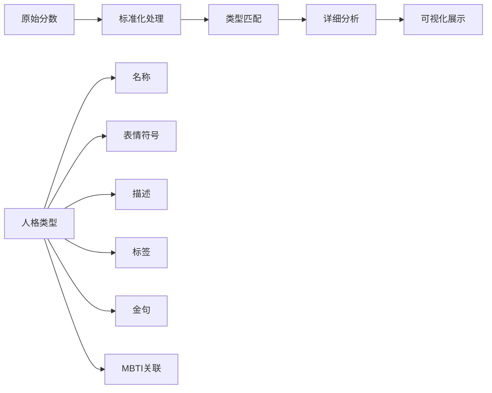
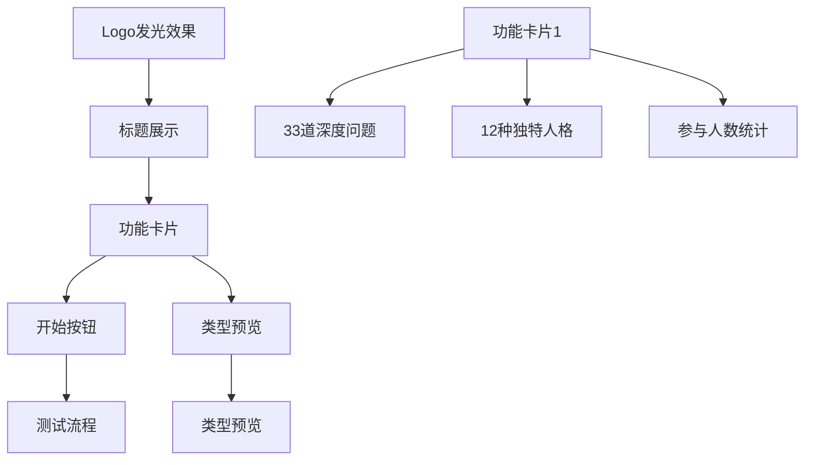
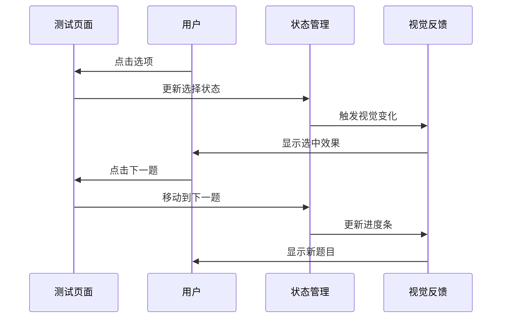
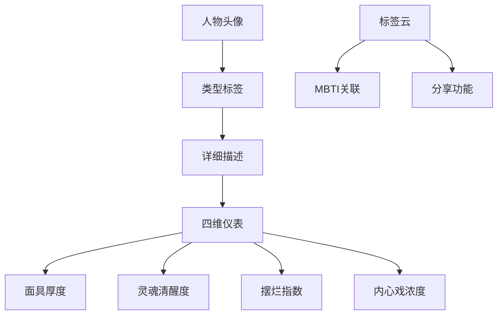
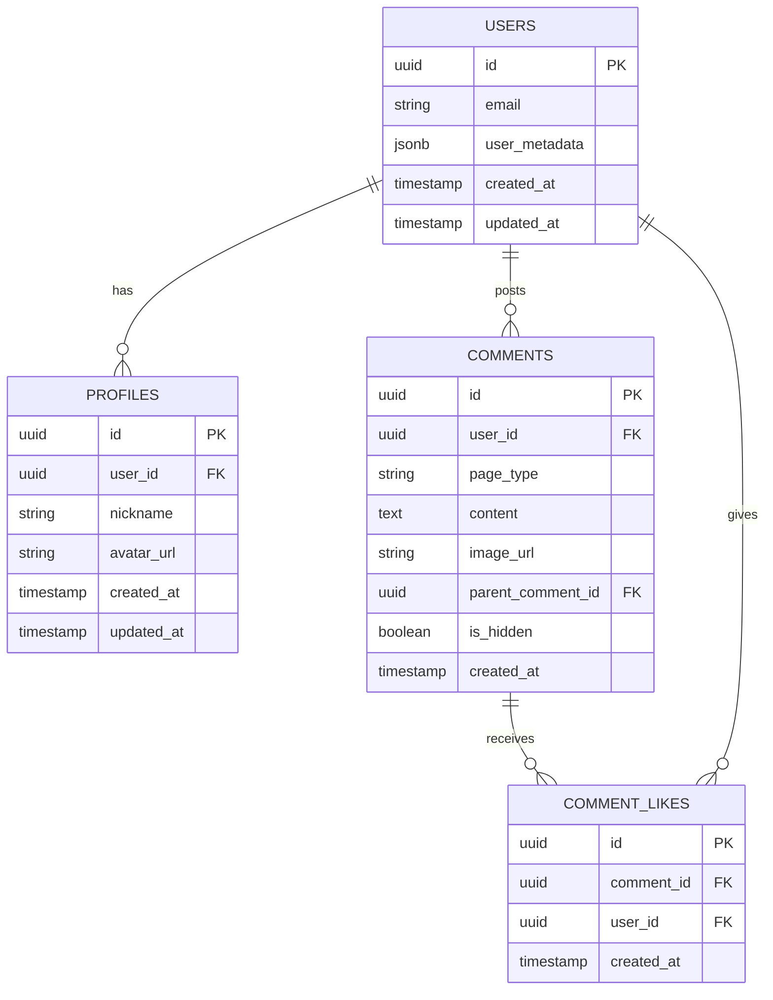
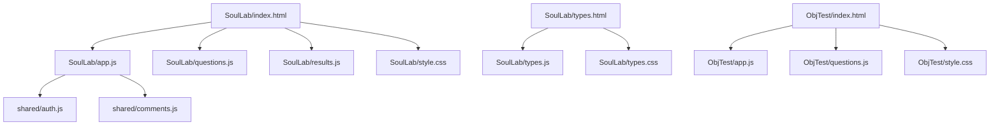

# SoulLab人格测试系统

<cite>
**本文档引用的文件**
- [SoulLab/index.html](file://SoulLab/index.html)
- [SoulLab/app.js](file://SoulLab/app.js)
- [SoulLab/questions.js](file://SoulLab/questions.js)
- [SoulLab/results.js](file://SoulLab/results.js)
- [SoulLab/style.css](file://SoulLab/style.css)
- [SoulLab/types.html](file://SoulLab/types.html)
- [SoulLab/types.js](file://SoulLab/types.js)
- [SoulLab/types.css](file://SoulLab/types.css)
- [shared/auth.js](file://shared/auth.js)
- [shared/comments.js](file://shared/comments.js)
</cite>

## 目录
1. [简介](#简介)
2. [项目结构](#项目结构)
3. [核心组件](#核心组件)
4. [架构概览](#架构概览)
5. [详细组件分析](#详细组件分析)
6. [依赖关系分析](#依赖关系分析)
7. [性能考虑](#性能考虑)
8. [故障排除指南](#故障排除指南)
9. [结论](#结论)
10. [附录](#附录)

## 简介

SoulLab人格测试系统是一个融合灵性觉醒、MBTI与SBTI的创新人格测试平台。该系统通过33道深度心理问题，为用户提供12种独特的人格类型分析，涵盖从精致面具者到恒久觉察者的完整人格谱系。

系统采用现代化的前端技术栈，结合粒子动画、响应式设计和实时数据存储，为用户提供了沉浸式的心理探索体验。测试结果不仅包含详细的个性分析，还提供了可视化的仪表板展示和社交分享功能。

## 项目结构

SoulLab项目采用模块化架构设计，主要包含以下核心目录：

**图表来源**
- [SoulLab/index.html:1-271](file://SoulLab/index.html#L1-L271)
- [SoulLab/app.js:1-613](file://SoulLab/app.js#L1-L613)
- [SoulLab/questions.js:1-352](file://SoulLab/questions.js#L1-L352)
- [SoulLab/results.js:1-140](file://SoulLab/results.js#L1-L140)

**章节来源**
- [SoulLab/index.html:1-271](file://SoulLab/index.html#L1-L271)
- [SoulLab/types.html:1-125](file://SoulLab/types.html#L1-L125)

## 核心组件

### 1. 测试引擎组件

系统的核心测试引擎由三个关键组件构成：

- **问题管理器**: 负责33道深度心理问题的加载、渲染和状态管理
- **评分算法器**: 实现基于选项权重的智能评分系统
- **结果处理器**: 将原始分数转换为12种人格类型的详细分析

### 2. 用户界面组件

系统提供完整的用户界面层次结构：

- **启动页面**: 展示测试介绍和开始按钮
- **测试页面**: 实时进度跟踪和选项选择
- **加载页面**: 结果计算过程的视觉反馈
- **结果页面**: 详细的人格分析和可视化展示

### 3. 数据存储组件

采用Supabase作为后端服务，实现用户认证、评论系统和结果统计的持久化存储。

**章节来源**
- [SoulLab/app.js:1-613](file://SoulLab/app.js#L1-L613)
- [SoulLab/questions.js:1-352](file://SoulLab/questions.js#L1-L352)
- [SoulLab/results.js:1-140](file://SoulLab/results.js#L1-L140)

## 架构概览

SoulLab采用前后端分离的现代Web架构，实现了高度模块化和可扩展的设计：

**图表来源**
- [SoulLab/app.js:182-405](file://SoulLab/app.js#L182-L405)
- [SoulLab/questions.js:20-352](file://SoulLab/questions.js#L20-L352)

系统架构的关键特点：

1. **事件驱动设计**: 基于DOM事件和JavaScript回调的异步处理模式
2. **状态管理模式**: 使用全局变量管理测试状态和用户数据
3. **模块化代码结构**: 每个功能模块独立封装，便于维护和扩展
4. **响应式数据绑定**: 自动更新UI状态以反映数据变化

## 详细组件分析

### 测试引擎组件

#### 问题管理系统

问题管理系统负责33道深度心理问题的完整生命周期管理：

**图表来源**
- [SoulLab/questions.js:20-352](file://SoulLab/questions.js#L20-L352)
- [SoulLab/app.js:193-351](file://SoulLab/app.js#L193-L351)

每个问题包含：
- **唯一标识**: 1-33的序号
- **深度文本**: 33道直击灵魂的问题描述
- **选项集合**: 3-4个选择项，每个选项包含权重分配
- **评分映射**: 将选项映射到12种人格类型的分数

#### 评分算法实现

评分算法采用多维度累加机制：

**图表来源**
- [SoulLab/app.js:334-351](file://SoulLab/app.js#L334-L351)
- [SoulLab/results.js:6-139](file://SoulLab/results.js#L6-L139)

评分算法特点：
- **多维度评分**: 每个选项对12种人格类型都有不同的权重
- **累积计算**: 33道题目的分数在过程中持续累加
- **标准化处理**: 最终结果通过标准化算法得出准确的人格类型

#### 结果处理器

结果处理器将原始分数转换为可理解的人格分析：

**图表来源**
- [SoulLab/app.js:353-405](file://SoulLab/app.js#L353-L405)
- [SoulLab/results.js:6-139](file://SoulLab/results.js#L6-L139)

### 用户界面组件

#### 启动页面设计

启动页面采用极简主义设计理念，突出测试的核心价值：

**图表来源**
- [SoulLab/index.html:42-87](file://SoulLab/index.html#L42-L87)
- [SoulLab/style.css:169-277](file://SoulLab/style.css#L169-L277)

#### 测试页面交互

测试页面提供流畅的用户体验：

**图表来源**
- [SoulLab/app.js:240-299](file://SoulLab/app.js#L240-L299)
- [SoulLab/style.css:572-675](file://SoulLab/style.css#L572-L675)

#### 结果页面展示

结果页面采用仪表板设计，直观展示人格特征：

**图表来源**
- [SoulLab/index.html:142-238](file://SoulLab/index.html#L142-L238)
- [SoulLab/style.css:743-800](file://SoulLab/style.css#L743-L800)

### 数据存储与管理

#### Supabase集成

系统使用Supabase作为后端服务，实现以下功能：

- **用户认证**: 基于JWT的用户登录和会话管理
- **评论系统**: 支持用户评论和点赞功能
- **结果统计**: 跟踪测试参与人数和结果分布
- **媒体存储**: 图片和文件的云端存储

#### 数据模型设计

**图表来源**
- [shared/auth.js:1-800](file://shared/auth.js#L1-L800)
- [shared/comments.js:1-769](file://shared/comments.js#L1-L769)

**章节来源**
- [SoulLab/app.js:1-613](file://SoulLab/app.js#L1-L613)
- [SoulLab/questions.js:1-352](file://SoulLab/questions.js#L1-L352)
- [SoulLab/results.js:1-140](file://SoulLab/results.js#L1-L140)
- [shared/auth.js:1-800](file://shared/auth.js#L1-L800)
- [shared/comments.js:1-769](file://shared/comments.js#L1-L769)

## 依赖关系分析

### 前端依赖关系

系统采用模块化设计，各组件之间的依赖关系清晰明确：

**图表来源**
- [SoulLab/index.html:249-255](file://SoulLab/index.html#L249-L255)
- [SoulLab/types.html:120-122](file://SoulLab/types.html#L120-L122)

### 外部依赖

系统依赖以下关键外部库和服务：

- **Supabase JavaScript SDK**: 用于后端API通信
- **html2canvas**: 用于结果海报生成
- **百度统计**: 用于网站流量分析

### 模块耦合度

系统设计遵循低耦合高内聚原则：

- **测试模块**: 与UI层松耦合，便于独立测试
- **数据模块**: 通过接口抽象，支持多种数据源
- **UI模块**: 采用CSS变量和主题系统，易于定制

**章节来源**
- [SoulLab/app.js:13-18](file://SoulLab/app.js#L13-L18)
- [SoulLab/index.html:249-255](file://SoulLab/index.html#L249-L255)

## 性能考虑

### 前端性能优化

系统采用多项性能优化策略：

1. **懒加载机制**: 图片和资源按需加载
2. **动画优化**: 使用requestAnimationFrame优化动画性能
3. **内存管理**: 及时清理DOM元素和事件监听器
4. **缓存策略**: 使用查询参数避免重复加载

### 移动端适配

系统提供完整的响应式设计：

- **断点设计**: 针对不同屏幕尺寸的布局调整
- **触摸优化**: 适配移动端触摸交互
- **性能考虑**: 移动设备上的性能优化

### 数据传输优化

- **增量更新**: 只传输必要的数据变更
- **压缩传输**: 使用Gzip压缩减少传输体积
- **缓存策略**: 合理利用浏览器缓存

## 故障排除指南

### 常见问题诊断

#### 测试无法开始

**症状**: 点击开始按钮无响应

**可能原因**:
1. JavaScript文件加载失败
2. DOM元素未正确初始化
3. 浏览器兼容性问题

**解决方案**:
1. 检查浏览器控制台错误信息
2. 验证JavaScript文件路径正确性
3. 确认DOM元素ID与代码一致

#### 结果页面空白

**症状**: 测试完成后显示空白页面

**可能原因**:
1. 评分算法异常
2. 结果数据缺失
3. DOM渲染错误

**解决方案**:
1. 检查控制台是否有JavaScript错误
2. 验证personality对象完整性
3. 确认DOM元素存在且可访问

#### 评论功能异常

**症状**: 评论系统无法正常工作

**可能原因**:
1. Supabase配置错误
2. 数据库权限问题
3. 网络连接异常

**解决方案**:
1. 检查Supabase连接配置
2. 验证数据库表结构
3. 确认网络连接状态

**章节来源**
- [shared/comments.js:333-344](file://shared/comments.js#L333-L344)
- [shared/auth.js:522-550](file://shared/auth.js#L522-L550)

## 结论

SoulLab人格测试系统展现了现代Web应用开发的最佳实践。通过精心设计的架构、创新的功能特性和优秀的用户体验，该系统成功地将复杂的心理学概念转化为易用的交互式工具。

系统的主要优势包括：

1. **技术创新**: 融合灵性觉醒、MBTI与SBTI的独特人格分类体系
2. **用户体验**: 流畅的交互设计和沉浸式的视觉效果
3. **技术架构**: 模块化设计和可扩展的代码结构
4. **数据安全**: 基于Supabase的可靠后端服务

未来可以考虑的改进方向：
- 增加多语言支持
- 扩展测试题库
- 增强个性化定制功能
- 优化移动端体验

## 附录

### 开发指南

#### 添加新测试题目

1. 在questions.js中添加新问题对象
2. 确保问题ID连续且唯一
3. 为每个选项设置合理的权重
4. 测试新题目的逻辑正确性

#### 添加新个性类型

1. 在results.js中添加新类型定义
2. 提供完整的描述和标签
3. 设计相应的图像资源
4. 更新相关的样式定义

#### 自定义样式主题

1. 修改CSS变量值
2. 更新颜色方案
3. 调整字体和间距
4. 测试响应式效果

### 部署注意事项

- 确保Supabase配置正确
- 验证CDN资源可用性
- 测试跨域请求配置
- 准备备份和恢复方案