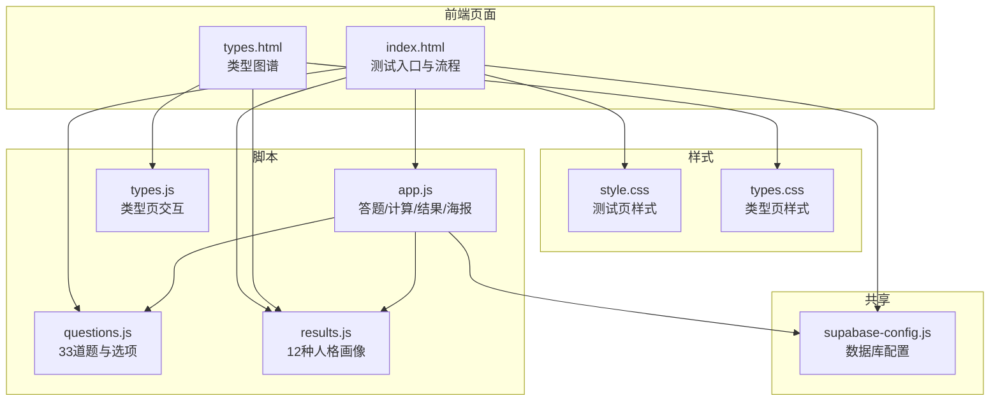
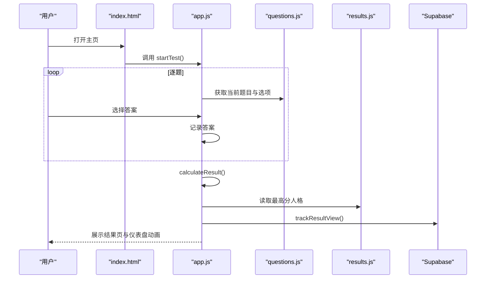
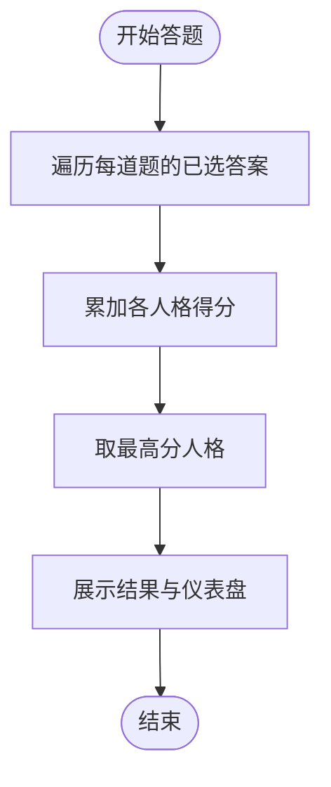
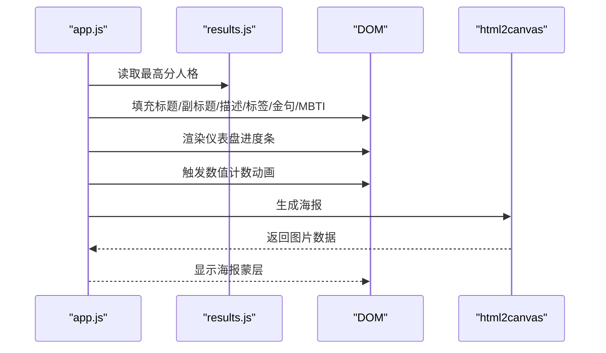
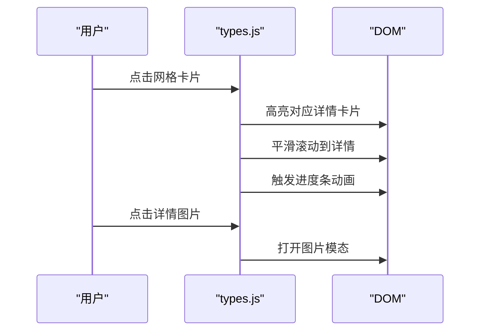
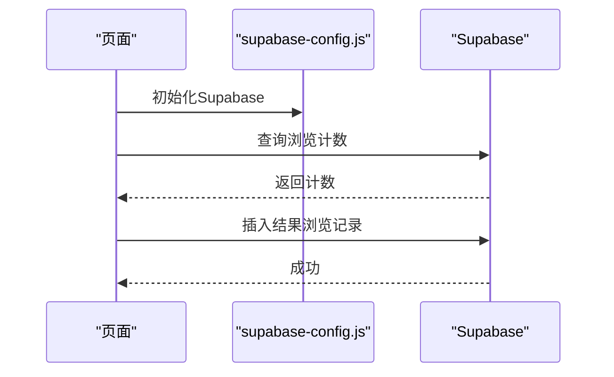
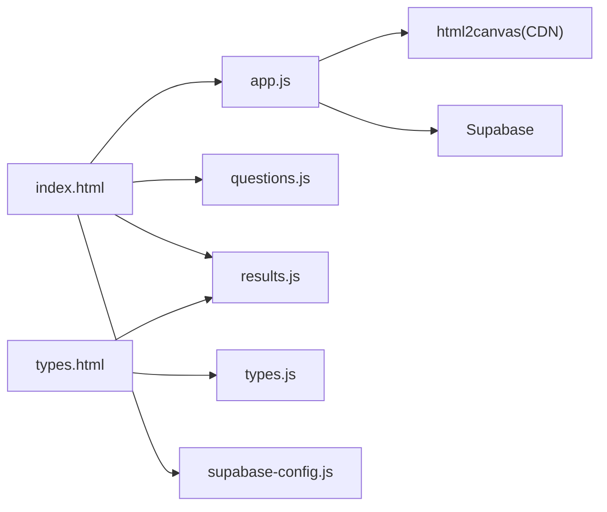

# 人格类型系统

<cite>
**本文引用的文件**
- [index.html](file://SoulLab/index.html)
- [style.css](file://SoulLab/style.css)
- [app.js](file://SoulLab/app.js)
- [questions.js](file://SoulLab/questions.js)
- [results.js](file://SoulLab/results.js)
- [types.html](file://SoulLab/types.html)
- [types.css](file://SoulLab/types.css)
- [types.js](file://SoulLab/types.js)
- [supabase-config.js](file://shared/supabase-config.js)
</cite>

## 目录
1. [简介](#简介)
2. [项目结构](#项目结构)
3. [核心组件](#核心组件)
4. [架构总览](#架构总览)
5. [详细组件分析](#详细组件分析)
6. [依赖分析](#依赖分析)
7. [性能考量](#性能考量)
8. [故障排查指南](#故障排查指南)
9. [结论](#结论)
10. [附录](#附录)

## 简介
本项目是一个融合“灵性觉醒 × MBTI × SBTI恶搞体系”的12种人格类型测试系统，包含33道题目的互动式人格测试、实时计算与结果展示、类型图谱浏览页面以及结果海报生成等功能。系统通过前端JavaScript实现完整的答题流程与可视化呈现，并使用Supabase进行参与人数统计与结果浏览追踪。

## 项目结构
- 主页与测试流程：index.html + style.css + app.js
- 人格题库：questions.js
- 人格画像与评分：results.js
- 类型图谱页面：types.html + types.css + types.js
- 数据与认证：shared/supabase-config.js
- 其他资源：images/（各类型角色图）、评论与登录模块（由共享脚本引入）

图表来源
- [index.html:1-271](file://SoulLab/index.html#L1-L271)
- [types.html:1-125](file://SoulLab/types.html#L1-L125)
- [style.css:1-800](file://SoulLab/style.css#L1-L800)
- [types.css:1-800](file://SoulLab/types.css#L1-L800)
- [app.js:1-613](file://SoulLab/app.js#L1-L613)
- [questions.js:1-352](file://SoulLab/questions.js#L1-L352)
- [results.js:1-140](file://SoulLab/results.js#L1-L140)
- [types.js:1-266](file://SoulLab/types.js#L1-L266)
- [supabase-config.js:1-26](file://shared/supabase-config.js#L1-L26)

章节来源
- [index.html:1-271](file://SoulLab/index.html#L1-L271)
- [types.html:1-125](file://SoulLab/types.html#L1-L125)

## 核心组件
- 人格题库：33道题，每题3-4个选项，选项包含对12种人格的加权分数映射。
- 计算引擎：遍历已选答案，累加各人格的得分，取最高分者为结果。
- 结果展示：名称、副标题、标签、四象限仪表盘、描述、金句、MBTI关联。
- 类型图谱：网格预览 + 详情卡片 + 滚动高亮 + 图片模态。
- 参与统计：基于Supabase的浏览计数与结果追踪。
- 结果海报：html2canvas离屏渲染，跨域安全处理，生成分享图片。

章节来源
- [questions.js:1-352](file://SoulLab/questions.js#L1-L352)
- [app.js:334-424](file://SoulLab/app.js#L334-L424)
- [results.js:6-139](file://SoulLab/results.js#L6-L139)
- [types.js:71-231](file://SoulLab/types.js#L71-L231)
- [supabase-config.js:1-26](file://shared/supabase-config.js#L1-L26)

## 架构总览
系统采用前后端分离的前端架构：
- 前端负责用户交互、答题流程、计算与可视化。
- Supabase负责数据存储与统计（浏览计数、结果追踪）。
- 使用CDN引入第三方库（如html2canvas）实现海报生成。

图表来源
- [index.html:253-256](file://SoulLab/index.html#L253-L256)
- [app.js:182-405](file://SoulLab/app.js#L182-L405)
- [questions.js:20-352](file://SoulLab/questions.js#L20-L352)
- [results.js:6-139](file://SoulLab/results.js#L6-L139)
- [supabase-config.js:9-25](file://shared/supabase-config.js#L9-L25)

## 详细组件分析

### 1) 人格题库与评分算法
- 题目结构：每题包含题号、文本、选项数组；选项包含标签与对各人格的加权分数映射。
- 评分规则：遍历所有已选答案，将每个选项的分数映射累加到对应人格键上，最终取最高分者。
- 仪表盘维度：面具厚度、灵魂清醒度、摆烂指数、内心戏浓度，均以百分比形式展示。

图表来源
- [app.js:334-351](file://SoulLab/app.js#L334-L351)
- [questions.js:20-352](file://SoulLab/questions.js#L20-L352)

章节来源
- [questions.js:1-352](file://SoulLab/questions.js#L1-L352)
- [app.js:334-405](file://SoulLab/app.js#L334-L405)

### 2) 结果页与可视化
- 名称/副标题/标签/描述/金句/MBTI关联均来自人格定义。
- 仪表盘动画：数值从0计数到目标值，进度条宽度动画延迟执行。
- 结果海报：离屏克隆结果页，移除评论区与操作按钮，预加载角色图并处理跨域，生成PNG并弹出蒙层提示保存。

图表来源
- [app.js:353-546](file://SoulLab/app.js#L353-L546)
- [results.js:6-139](file://SoulLab/results.js#L6-L139)

章节来源
- [app.js:353-546](file://SoulLab/app.js#L353-L546)
- [results.js:6-139](file://SoulLab/results.js#L6-L139)

### 3) 类型图谱页面
- 网格卡片：展示每种人格的头像、名称、副标题，点击跳转详情。
- 详情卡片：包含标签、仪表盘、描述、金句、MBTI说明；支持IntersectionObserver滚动进入时的可见动画与进度条填充。
- Hash导航：根据URL锚点高亮对应详情卡片并滚动定位。
- 图片模态：点击详情中的角色图可放大查看。

图表来源
- [types.js:71-231](file://SoulLab/types.js#L71-L231)
- [types.html:65-82](file://SoulLab/types.html#L65-L82)

章节来源
- [types.js:71-231](file://SoulLab/types.js#L71-L231)
- [types.html:65-82](file://SoulLab/types.html#L65-L82)

### 4) 参与统计与结果追踪
- Supabase配置：全局初始化，提供客户端实例与兼容旧命名。
- 参与人数：优先查询结果浏览视图表，若失败回退到评论表；渲染到页面元素。
- 结果浏览：每次结果页展示后插入一条浏览记录并刷新计数。

图表来源
- [supabase-config.js:5-25](file://shared/supabase-config.js#L5-L25)
- [app.js:33-80](file://SoulLab/app.js#L33-L80)
- [app.js:63-74](file://SoulLab/app.js#L63-L74)

章节来源
- [supabase-config.js:1-26](file://shared/supabase-config.js#L1-L26)
- [app.js:33-80](file://SoulLab/app.js#L33-L80)
- [app.js:63-74](file://SoulLab/app.js#L63-L74)

### 5) 类型扩展与自定义开发
- 新增类型步骤：
  1) 在人格定义中新增键值（如 newtype），设置名称、表情、图像、副标题、仪表盘、标签、描述、金句、MBTI说明。
  2) 在题库中为相关选项添加该键的分数映射。
  3) 若需在类型页展示，确保results.js与types.js中引用一致。
- 权重分配建议：
  - 仪表盘四个维度应与类型核心特征一致，便于用户直观理解。
  - 选项分数应覆盖类型边界，避免极端偏置。
- 匹配逻辑：
  - 保持现有累加取最高分策略，避免复杂排序与并列处理。
- 结果解释：
  - 描述与金句应与MBTI关联形成互补，帮助用户建立跨体系理解。

章节来源
- [results.js:6-139](file://SoulLab/results.js#L6-L139)
- [questions.js:20-352](file://SoulLab/questions.js#L20-L352)

### 6) 类型页面设计与交互细节
- 设计风格：深色宇宙主题，渐变与发光效果，卡片悬停与高亮反馈。
- 交互细节：
  - 网格卡片悬停放大与阴影，箭头显隐。
  - 详情卡片可见动画与进度条延迟填充。
  - Hash导航高亮与滚动定位。
  - 图片模态打开/关闭的过渡动画。

章节来源
- [types.css:1-800](file://SoulLab/types.css#L1-L800)
- [types.js:71-231](file://SoulLab/types.js#L71-L231)

### 7) 类型关系图谱与统计
- 关系图谱：可基于12种类型的核心标签与MBTI关联构建概念图，辅助用户理解类型间的差异与联系。
- 统计数据：参与人数、结果浏览次数、各类型分布（可扩展Supabase视图与查询）。

章节来源
- [results.js:6-139](file://SoulLab/results.js#L6-L139)
- [app.js:33-80](file://SoulLab/app.js#L33-L80)

### 8) 翻译支持与文化适应性
- 文案本地化：名称、副标题、描述、金句、MBTI说明均可翻译。
- 文化适配：MBTI说明与标签可按目标语言调整，保持概念一致性。
- 教育内容：可在类型详情中加入“类型教育”链接或说明，引导用户理解测试的娱乐与探索属性。

章节来源
- [results.js:6-139](file://SoulLab/results.js#L6-L139)

## 依赖分析
- 外部库：html2canvas（CDN引入）用于海报生成。
- 数据库：Supabase用于浏览计数与结果追踪。
- 共享模块：认证与评论脚本通过共享文件引入，统一配置。

图表来源
- [app.js:436-444](file://SoulLab/app.js#L436-L444)
- [index.html:249-256](file://SoulLab/index.html#L249-L256)
- [types.html:120-121](file://SoulLab/types.html#L120-L121)

章节来源
- [app.js:436-444](file://SoulLab/app.js#L436-L444)
- [index.html:249-256](file://SoulLab/index.html#L249-L256)
- [types.html:120-121](file://SoulLab/types.html#L120-L121)

## 性能考量
- DOM操作优化：类型页使用IntersectionObserver减少滚动重绘；结果页仪表盘动画采用延迟与缓动函数。
- 资源加载：角色图使用懒加载与缓存戳，避免重复请求；海报生成前预加载图片并处理跨域。
- 计算复杂度：评分仅遍历已选答案，时间复杂度O(n)，n为题数，空间复杂度O(k)，k为类型数。
- 网络请求：参与统计与结果追踪为轻量写入，建议合并请求或节流。

章节来源
- [types.js:155-177](file://SoulLab/types.js#L155-L177)
- [app.js:407-424](file://SoulLab/app.js#L407-L424)
- [app.js:446-546](file://SoulLab/app.js#L446-L546)

## 故障排查指南
- Supabase未加载：
  - 现象：控制台报错“Supabase SDK未加载”，参与人数统计不可用。
  - 排查：检查CDN链接与网络；确认初始化脚本顺序。
- 海报生成失败：
  - 现象：生成失败提示或空白图片。
  - 排查：检查html2canvas版本；预加载图片跨域设置；降低渲染比例重试。
- 类型页滚动异常：
  - 现象：Hash导航不生效或滚动错位。
  - 排查：确认锚点格式与元素ID一致；等待布局完成后滚动。
- 仪表盘动画不触发：
  - 现象：进度条不填充，数值不计数。
  - 排查：检查元素ID与数据绑定；确认动画延迟与Observer触发时机。

章节来源
- [supabase-config.js:12-17](file://shared/supabase-config.js#L12-L17)
- [app.js:446-546](file://SoulLab/app.js#L446-L546)
- [types.js:182-214](file://SoulLab/types.js#L182-L214)

## 结论
本系统以简洁的前端架构实现了完整的“人格测试 + 类型图谱 + 结果可视化 + 统计追踪”闭环。通过清晰的题库与评分规则、丰富的视觉反馈与可扩展的人格定义，既保证了用户体验，也为后续类型扩展与国际化提供了良好基础。

## 附录
- 术语说明：
  - MBTI：迈尔斯-布里格斯类型指标
  - SBTI：系统性行为类型识别（恶搞体系）
  - 仪表盘：面具厚度、灵魂清醒度、摆烂指数、内心戏浓度
- 开发建议：
  - 为每种类型补充“类型教育”说明，强调测试的探索性质。
  - 增加类型间对比视图，帮助用户理解差异。
  - 提供导出/分享能力（如JSON或PDF），便于二次使用。