# 数据存储与管理系统技术文档

<cite>
**本文档引用的文件**
- [supabase-config.js](file://shared/supabase-config.js)
- [supabase-schema.sql](file://supabase-schema.sql)
- [supabase-result-views.sql](file://supabase-result-views.sql)
- [supabase-community-upgrade.sql](file://supabase-community-upgrade.sql)
- [supabase-repair.sql](file://supabase-repair.sql)
- [supabase-admin-delete-user.sql](file://supabase-admin-delete-user.sql)
- [app.js](file://SoulLab/app.js)
- [questions.js](file://SoulLab/questions.js)
- [app.js](file://ObjTest/app.js)
- [questions.js](file://ObjTest/questions.js)
- [auth.js](file://shared/auth.js)
- [comments.js](file://shared/comments.js)
- [comments.css](file://shared/comments.css)
- [index.html](file://admin/index.html)
</cite>

## 目录
1. [项目概述](#项目概述)
2. [系统架构](#系统架构)
3. [核心组件](#核心组件)
4. [数据模型设计](#数据模型设计)
5. [Supabase集成](#supabase集成)
6. [测试数据存储](#测试数据存储)
7. [用户答案保存](#用户答案保存)
8. [结果记录与统计](#结果记录与统计)
9. [评论系统](#评论系统)
10. [数据安全与隐私保护](#数据安全与隐私保护)
11. [查询优化策略](#查询优化策略)
12. [缓存策略](#缓存策略)
13. [实时数据同步](#实时数据同步)
14. [离线支持](#离线支持)
15. [数据完整性检查](#数据完整性检查)
16. [性能监控](#性能监控)
17. [数据导出与管理工具](#数据导出与管理工具)
18. [备份与恢复](#备份与恢复)
19. [数据迁移](#数据迁移)
20. [合规性管理](#合规性管理)
21. [故障排除指南](#故障排除指南)
22. [总结](#总结)

## 项目概述

SoulLab数据存储与管理系统是一个基于Supabase的全栈应用程序，专门为"觉醒诗社"平台提供数据存储、管理和分析功能。系统包含两个主要测试模块：SoulLab灵魂人格测试和ObjTest客体化测评，以及完整的用户认证、评论管理和后台管理系统。

该系统采用现代化的前端技术栈，结合Supabase提供的实时数据库、认证服务和对象存储，实现了高效的数据管理解决方案。系统设计注重用户体验、数据安全性和可扩展性。

## 系统架构

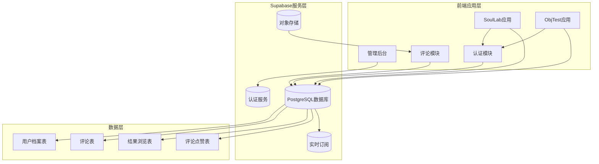
```mermaid
graph TB
subgraph "前端应用层"
SL[SoulLab应用]
OT[ObjTest应用]
ADM[管理后台]
AUTH[认证模块]
COMM[评论模块]
end
subgraph "Supabase服务层"
DB[(PostgreSQL数据库)]
AUTH_DB[(认证服务)]
STORAGE[(对象存储)]
REALTIME[(实时订阅)]
end
subgraph "数据层"
PROFILES[用户档案表]
COMMENTS[评论表]
RESULT_VIEWS[结果浏览表]
COMMENT_LIKES[评论点赞表]
end
SL --> AUTH
OT --> AUTH
ADM --> AUTH_DB
AUTH --> DB
COMM --> DB
SL --> DB
OT --> DB
DB --> PROFILES
DB --> COMMENTS
DB --> RESULT_VIEWS
DB --> COMMENT_LIKES
DB --> REALTIME
STORAGE --> COMM
```

**图表来源**
- [supabase-config.js:1-26](file://shared/supabase-config.js#L1-L26)
- [supabase-schema.sql:6-97](file://supabase-schema.sql#L6-L97)

## 核心组件

### 应用程序入口点

系统包含三个主要的应用程序组件：

1. **SoulLab应用** - 提供33道灵魂人格测试题目
2. **ObjTest应用** - 提供客体化测评系统
3. **管理后台** - 提供管理员功能界面

每个组件都通过统一的Supabase配置进行数据访问，确保数据一致性和安全性。

### 数据访问层

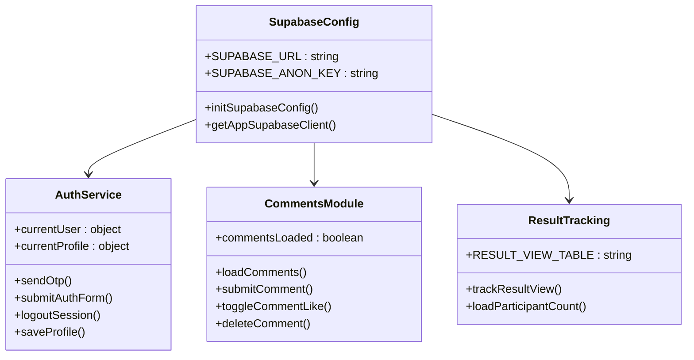
```mermaid
classDiagram
class SupabaseConfig {
+SUPABASE_URL : string
+SUPABASE_ANON_KEY : string
+initSupabaseConfig()
+getAppSupabaseClient()
}
class AuthService {
+currentUser : object
+currentProfile : object
+sendOtp()
+submitAuthForm()
+logoutSession()
+saveProfile()
}
class CommentsModule {
+commentsLoaded : boolean
+loadComments()
+submitComment()
+toggleCommentLike()
+deleteComment()
}
class ResultTracking {
+trackResultView()
+loadParticipantCount()
+RESULT_VIEW_TABLE : string
}
SupabaseConfig --> AuthService
SupabaseConfig --> CommentsModule
SupabaseConfig --> ResultTracking
```

**图表来源**
- [supabase-config.js:5-25](file://shared/supabase-config.js#L5-L25)
- [auth.js:419-800](file://shared/auth.js#L419-L800)
- [comments.js:20-769](file://shared/comments.js#L20-L769)

**章节来源**
- [supabase-config.js:1-26](file://shared/supabase-config.js#L1-L26)
- [app.js:13-18](file://SoulLab/app.js#L13-L18)
- [app.js:10-15](file://ObjTest/app.js#L10-L15)

## 数据模型设计

### 核心数据表结构

系统采用规范化的关系型数据库设计，包含以下核心表：

#### 用户档案表 (profiles)
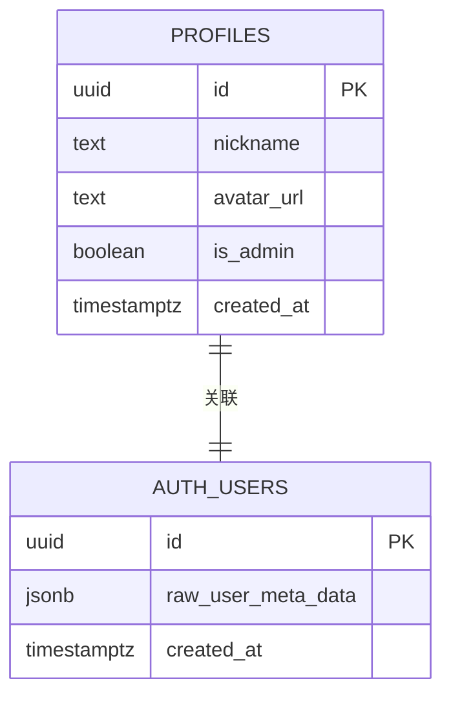
```mermaid
erDiagram
PROFILES {
uuid id PK
text nickname
text avatar_url
boolean is_admin
timestamptz created_at
}
AUTH_USERS {
uuid id PK
jsonb raw_user_meta_data
timestamptz created_at
}
PROFILES ||--|| AUTH_USERS : "关联"
```

**图表来源**
- [supabase-schema.sql:7-13](file://supabase-schema.sql#L7-L13)

#### 评论表 (comments)
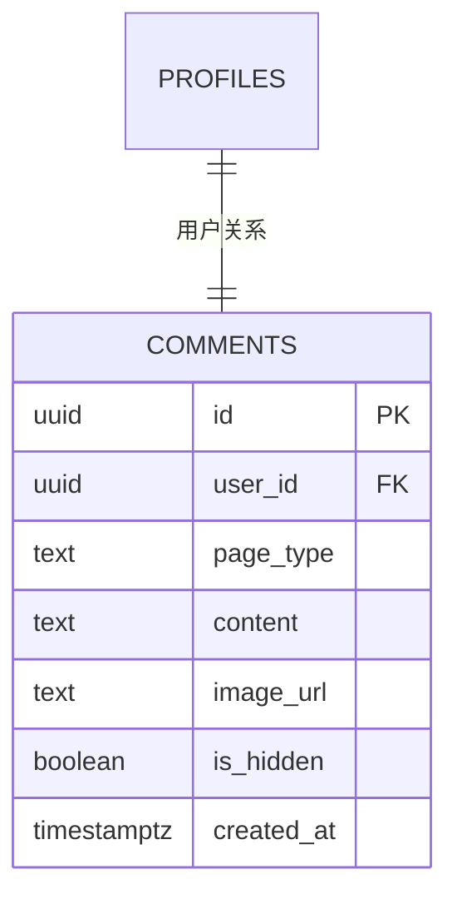
```mermaid
erDiagram
COMMENTS {
uuid id PK
uuid user_id FK
text page_type
text content
text image_url
boolean is_hidden
timestamptz created_at
}
PROFILES ||--|| COMMENTS : "用户关系"
```

**图表来源**
- [supabase-schema.sql:43-51](file://supabase-schema.sql#L43-L51)

#### 结果浏览表 (result_views)
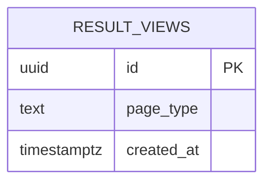
```mermaid
erDiagram
RESULT_VIEWS {
uuid id PK
text page_type
timestamptz created_at
}
```

**图表来源**
- [supabase-result-views.sql:1-5](file://supabase-result-views.sql#L1-L5)

#### 评论点赞表 (comment_likes)
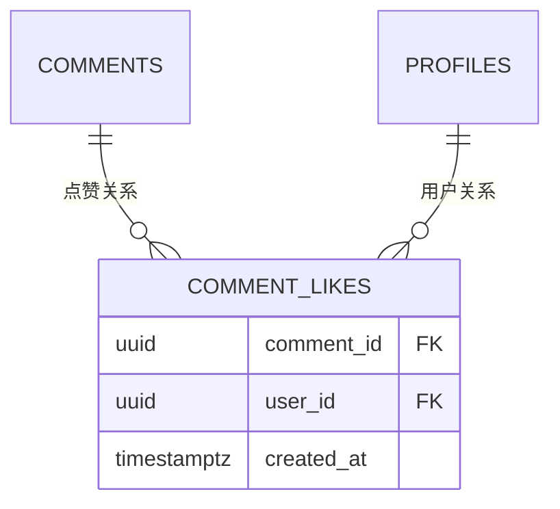
```mermaid
erDiagram
COMMENT_LIKES {
uuid comment_id FK
uuid user_id FK
timestamptz created_at
}
COMMENTS ||--o{ COMMENT_LIKES : "点赞关系"
PROFILES ||--o{ COMMENT_LIKES : "用户关系"
```

**图表来源**
- [supabase-community-upgrade.sql:9-14](file://supabase-community-upgrade.sql#L9-L14)

**章节来源**
- [supabase-schema.sql:6-97](file://supabase-schema.sql#L6-L97)
- [supabase-result-views.sql:1-32](file://supabase-result-views.sql#L1-L32)
- [supabase-community-upgrade.sql:1-77](file://supabase-community-upgrade.sql#L1-L77)

## Supabase集成

### 配置管理

系统采用集中式的Supabase配置管理，确保所有组件使用统一的数据库连接参数：

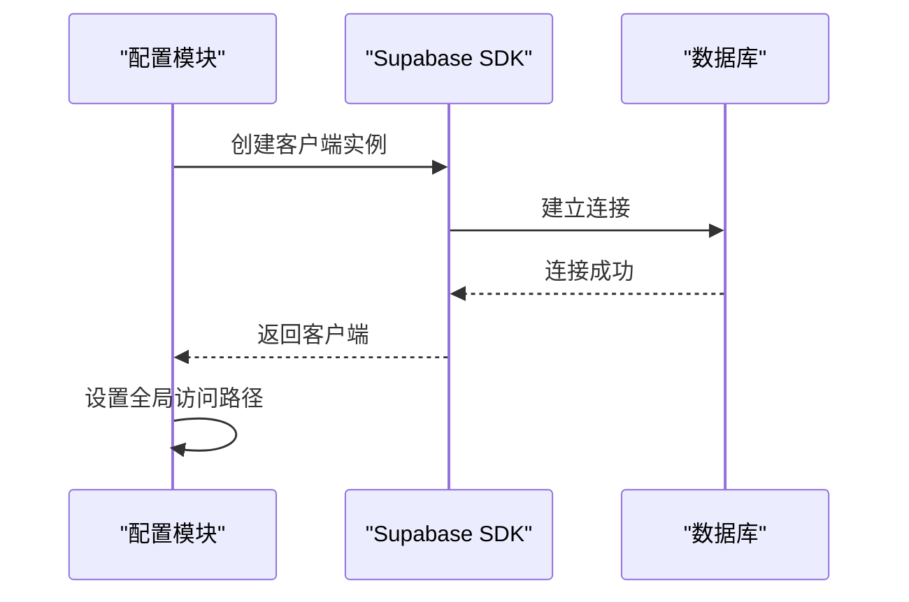
```mermaid
sequenceDiagram
participant Config as "配置模块"
participant Supabase as "Supabase SDK"
participant DB as "数据库"
Config->>Supabase : 创建客户端实例
Supabase->>DB : 建立连接
DB-->>Supabase : 连接成功
Supabase-->>Config : 返回客户端
Config->>Config : 设置全局访问路径
```

**图表来源**
- [supabase-config.js:19-25](file://shared/supabase-config.js#L19-L25)

### 认证集成

系统集成了Supabase的认证服务，提供完整的用户身份验证和授权功能：

- **邮箱验证码登录**：支持OTP验证码登录方式
- **密码认证**：标准的用户名密码认证
- **用户元数据管理**：动态管理用户属性和偏好
- **角色权限控制**：管理员权限和普通用户权限分离

**章节来源**
- [supabase-config.js:9-25](file://shared/supabase-config.js#L9-L25)
- [auth.js:35-40](file://shared/auth.js#L35-L40)

## 测试数据存储

### SoulLab测试数据存储

SoulLab应用实现了完整的测试数据存储机制：

#### 问题数据结构
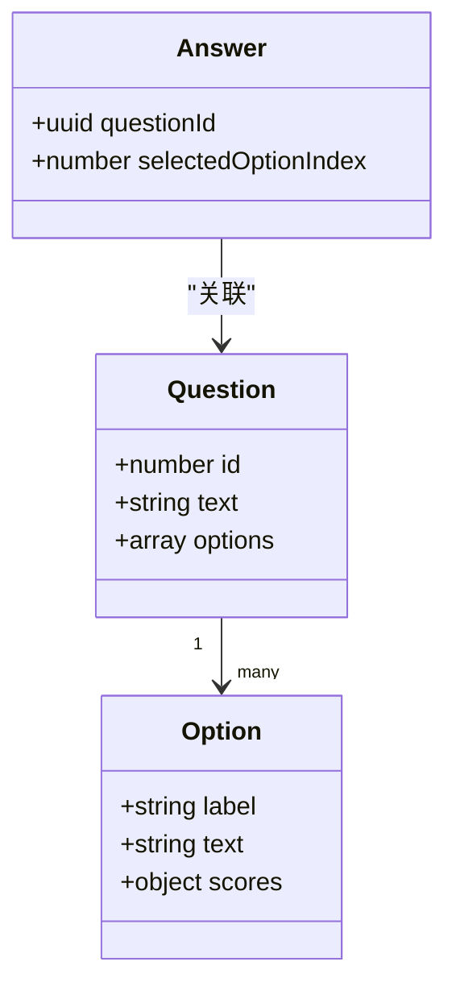
```mermaid
classDiagram
class Question {
+number id
+string text
+array options
}
class Option {
+string label
+string text
+object scores
}
class Answer {
+uuid questionId
+number selectedOptionIndex
}
Question "1" --> "many" Option
Answer --> Question : "关联"
```

**图表来源**
- [questions.js:20-352](file://SoulLab/questions.js#L20-L352)

#### 答案计算与存储
系统在测试结束后计算用户的人格类型得分，并将结果存储到数据库中：

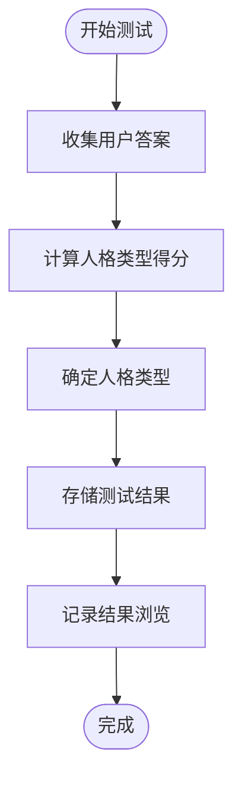
```mermaid
flowchart TD
Start([开始测试]) --> AnswerQuestions["收集用户答案"]
AnswerQuestions --> CalculateScores["计算人格类型得分"]
CalculateScores --> DetermineType["确定人格类型"]
DetermineType --> StoreResult["存储测试结果"]
StoreResult --> TrackViews["记录结果浏览"]
TrackViews --> End([完成])
```

**图表来源**
- [app.js:334-351](file://SoulLab/app.js#L334-L351)
- [app.js:63-74](file://SoulLab/app.js#L63-L74)

**章节来源**
- [questions.js:1-352](file://SoulLab/questions.js#L1-L352)
- [app.js:334-405](file://SoulLab/app.js#L334-L405)

### ObjTest测试数据存储

ObjTest应用提供了不同的测试逻辑，专注于自我价值和边界意识的评估：

#### 测评指标计算
系统通过40个问题评估用户的自我价值感、边界意识和人际关系模式：

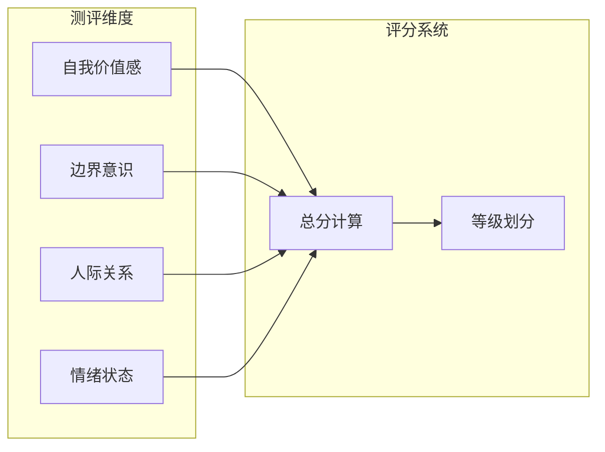
```mermaid
graph LR
subgraph "测评维度"
Self[自我价值感]
Bound[边界意识]
Rel[人际关系]
Emo[情绪状态]
end
subgraph "评分系统"
Score[总分计算]
Tier[等级划分]
end
Self --> Score
Bound --> Score
Rel --> Score
Emo --> Score
Score --> Tier
```

**图表来源**
- [questions.js:1-403](file://ObjTest/questions.js#L1-L403)

**章节来源**
- [questions.js:1-403](file://ObjTest/questions.js#L1-L403)
- [app.js:207-217](file://ObjTest/app.js#L207-L217)

## 用户答案保存

### 实时数据同步

系统实现了用户答案的实时保存和同步机制：

#### 答案持久化流程
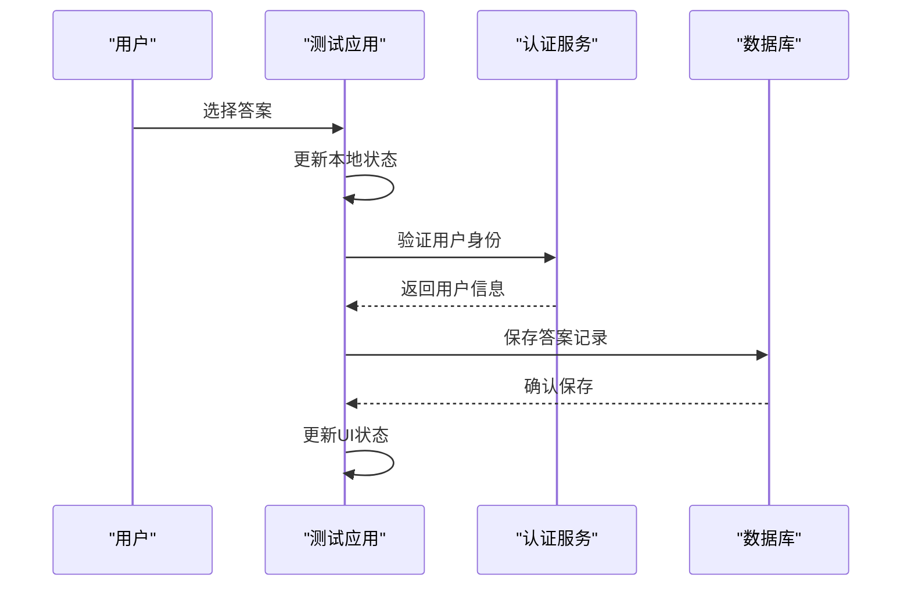
```mermaid
sequenceDiagram
participant User as "用户"
participant App as "测试应用"
participant Auth as "认证服务"
participant DB as "数据库"
User->>App : 选择答案
App->>App : 更新本地状态
App->>Auth : 验证用户身份
Auth-->>App : 返回用户信息
App->>DB : 保存答案记录
DB-->>App : 确认保存
App->>App : 更新UI状态
```

**图表来源**
- [app.js:240-257](file://SoulLab/app.js#L240-L257)

#### 数据一致性保证
系统通过以下机制确保数据一致性：
- **乐观锁**：防止并发更新冲突
- **事务处理**：确保相关操作的原子性
- **错误重试**：在网络异常时自动重试
- **状态回滚**：失败时恢复到之前状态

**章节来源**
- [app.js:240-257](file://SoulLab/app.js#L240-L257)
- [auth.js:567-677](file://shared/auth.js#L567-L677)

## 结果记录与统计

### 参与人数统计

系统提供了实时的参与人数统计功能：

#### 统计数据收集
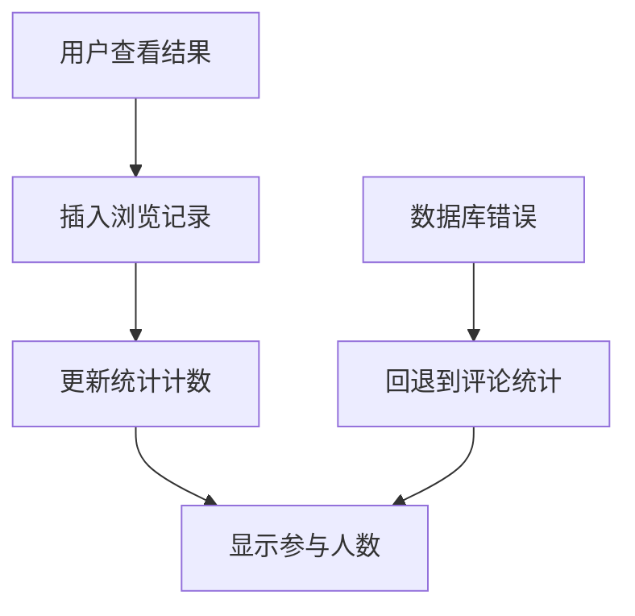
```mermaid
flowchart TD
ViewEvent[用户查看结果] --> InsertView[插入浏览记录]
InsertView --> UpdateCount[更新统计计数]
UpdateCount --> DisplayCount[显示参与人数]
Error[数据库错误] --> Fallback[回退到评论统计]
Fallback --> DisplayCount
```

**图表来源**
- [app.js:33-61](file://SoulLab/app.js#L33-L61)

#### 统计数据存储
系统使用专门的`result_views`表来跟踪测试结果的浏览情况：

| 字段名 | 类型 | 描述 | 索引 |
|--------|------|------|------|
| id | uuid | 主键标识 | PK |
| page_type | text | 页面类型 (soullab/objtest) | |
| created_at | timestamptz | 创建时间 | |

**章节来源**
- [supabase-result-views.sql:1-32](file://supabase-result-views.sql#L1-L32)
- [app.js:33-70](file://SoulLab/app.js#L33-L70)

## 评论系统

### 评论数据模型

评论系统是SoulLab平台的重要组成部分，提供了完整的用户互动功能：

#### 评论表设计
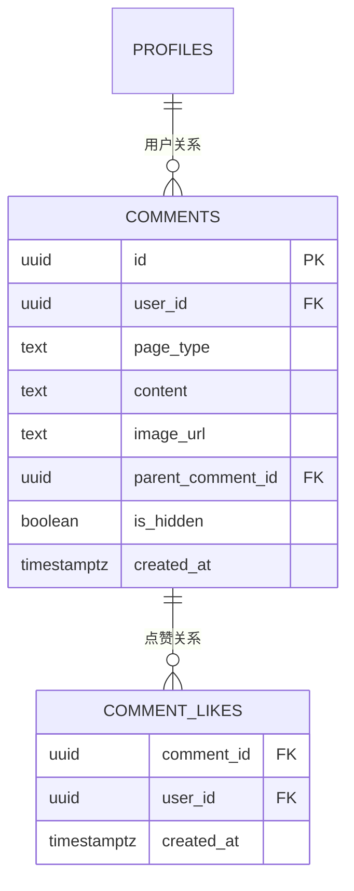
```mermaid
erDiagram
COMMENTS {
uuid id PK
uuid user_id FK
text page_type
text content
text image_url
uuid parent_comment_id FK
boolean is_hidden
timestamptz created_at
}
COMMENT_LIKES {
uuid comment_id FK
uuid user_id FK
timestamptz created_at
}
COMMENTS ||--o{ COMMENT_LIKES : "点赞关系"
PROFILES ||--o{ COMMENTS : "用户关系"
```

**图表来源**
- [supabase-schema.sql:43-51](file://supabase-schema.sql#L43-L51)
- [supabase-community-upgrade.sql:9-14](file://supabase-community-upgrade.sql#L9-L14)

### 评论功能特性

#### 嵌套回复系统
系统支持最多3层的嵌套回复结构，提供丰富的讨论体验：

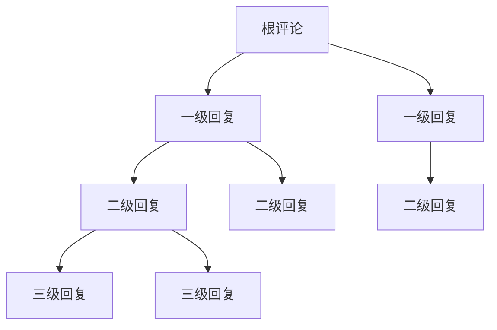
```mermaid
graph TD
Root[根评论] --> Reply1[一级回复]
Root --> Reply2[一级回复]
Reply1 --> SubReply1[二级回复]
Reply1 --> SubReply2[二级回复]
Reply2 --> SubReply3[二级回复]
SubReply1 --> DeepReply1[三级回复]
SubReply1 --> DeepReply2[三级回复]
```

**图表来源**
- [comments.js:133-164](file://shared/comments.js#L133-L164)

#### 评论管理功能
管理员可以通过管理后台对评论进行完全控制：

- **评论审核**：隐藏或显示特定评论
- **用户管理**：设置用户权限和角色
- **内容过滤**：根据关键词和用户进行筛选
- **批量操作**：支持批量删除和状态变更

**章节来源**
- [comments.js:1-769](file://shared/comments.js#L1-L769)
- [index.html:274-688](file://admin/index.html#L274-L688)

## 数据安全与隐私保护

### 行级安全策略

系统采用了严格的行级安全(RLS)策略来保护用户数据：

#### 用户档案安全策略
```sql
-- 公开读取用户档案
CREATE POLICY "公开读取 profiles"
ON public.profiles FOR SELECT
USING (true);

-- 本人可更新档案
CREATE POLICY "本人更新 profiles"
ON public.profiles FOR UPDATE
USING (auth.uid() = id);

-- 本人可插入档案
CREATE POLICY "本人插入 profiles"
ON public.profiles FOR INSERT
WITH CHECK (auth.uid() = id);
```

#### 评论安全策略
```sql
-- 公开读取未隐藏评论
CREATE POLICY "公开读取未隐藏评论"
ON public.comments
FOR SELECT
USING (is_hidden = false);

-- 登录用户可发表评论
CREATE POLICY "登录用户发表评论"
ON public.comments
FOR INSERT
WITH CHECK (auth.uid() = user_id);

-- 本人可删除评论
CREATE POLICY "本人删除评论"
ON public.comments
FOR DELETE
USING (auth.uid() = user_id);
```

**章节来源**
- [supabase-schema.sql:15-81](file://supabase-schema.sql#L15-L81)

### 数据加密与传输安全

系统采用以下安全措施：

- **HTTPS强制**：所有数据传输均通过加密通道
- **JWT令牌**：使用JSON Web Tokens进行身份验证
- **密码哈希**：用户密码采用安全的哈希算法存储
- **SQL注入防护**：使用参数化查询防止注入攻击
- **XSS防护**：对用户输入进行严格过滤和转义

## 查询优化策略

### 索引优化

系统针对高频查询场景建立了专门的索引：

#### 评论查询优化
```sql
-- 评论表复合索引
CREATE INDEX idx_comments_page_parent_created_at
ON public.comments (page_type, parent_comment_id, created_at DESC);

-- 评论点赞查询优化
CREATE INDEX idx_comment_likes_comment_id
ON public.comment_likes (comment_id, created_at DESC);

CREATE INDEX idx_comment_likes_user_id
ON public.comment_likes (user_id, created_at DESC);
```

#### 结果浏览统计优化
```sql
-- 结果浏览表索引
CREATE INDEX idx_result_views_page_type_created_at
ON public.result_views (page_type, created_at DESC);
```

**章节来源**
- [supabase-community-upgrade.sql:6-23](file://supabase-community-upgrade.sql#L6-L23)
- [supabase-result-views.sql:7-8](file://supabase-result-views.sql#L7-L8)

### 查询性能监控

系统提供了查询性能监控功能：

- **查询时间统计**：记录关键查询的执行时间
- **慢查询日志**：自动记录执行时间超过阈值的查询
- **索引使用分析**：监控索引的使用效率
- **查询计划分析**：定期分析查询执行计划

## 缓存策略

### 多层缓存架构

系统采用了多层缓存策略来提高数据访问性能：

#### 前端缓存
- **内存缓存**：存储当前页面的用户数据
- **本地存储**：持久化用户偏好和临时数据
- **CDN缓存**：静态资源的全球分发缓存

#### 后端缓存
- **数据库查询缓存**：缓存常用的聚合查询结果
- **会话缓存**：存储用户会话信息
- **对象存储缓存**：缓存用户头像和评论图片

### 缓存失效策略

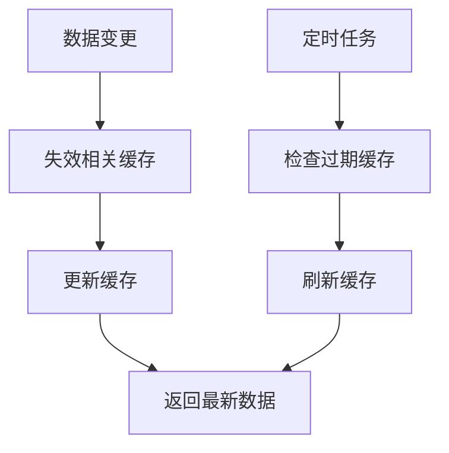
```mermaid
flowchart TD
DataChange[数据变更] --> InvalidateCache[失效相关缓存]
InvalidateCache --> UpdateCache[更新缓存]
UpdateCache --> ServeRequest[返回最新数据]
Timer[定时任务] --> CheckStale[检查过期缓存]
CheckStale --> RefreshCache[刷新缓存]
RefreshCache --> ServeRequest
```

**图表来源**
- [comments.js:166-181](file://shared/comments.js#L166-L181)

## 实时数据同步

### WebSocket连接管理

系统利用Supabase的实时订阅功能实现数据的实时同步：

#### 实时事件监听
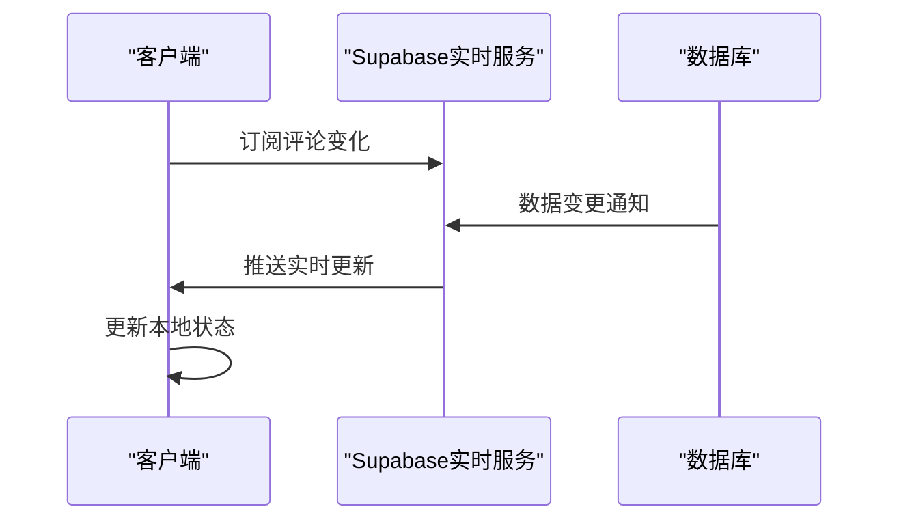
```mermaid
sequenceDiagram
participant Client as "客户端"
participant Supabase as "Supabase实时服务"
participant DB as "数据库"
Client->>Supabase : 订阅评论变化
DB->>Supabase : 数据变更通知
Supabase->>Client : 推送实时更新
Client->>Client : 更新本地状态
```

**图表来源**
- [comments.js:309-345](file://shared/comments.js#L309-L345)

#### 离线状态处理
系统支持离线模式下的数据同步：

- **本地队列**：缓存离线期间的操作请求
- **冲突解决**：自动解决并发更新冲突
- **状态同步**：恢复连接后同步所有变更

## 离线支持

### PWA功能实现

系统实现了渐进式Web应用(PWA)功能，提供类似原生应用的离线体验：

#### Service Worker管理
- **缓存策略**：智能缓存静态资源和API响应
- **网络降级**：在网络不可用时提供基础功能
- **后台同步**：在后台自动同步离线数据

#### 本地数据存储
- **IndexedDB**：存储大量结构化数据
- **LocalStorage**：存储用户偏好和配置
- **SessionStorage**：存储临时会话数据

## 数据完整性检查

### 数据验证机制

系统建立了多层次的数据验证机制：

#### 前端验证
- **输入格式验证**：确保用户输入符合预期格式
- **业务规则验证**：检查数据是否符合业务逻辑
- **实时反馈**：提供即时的验证反馈

#### 后端验证
- **数据库约束**：使用外键和唯一性约束
- **存储过程**：通过数据库函数确保数据一致性
- **触发器**：自动维护相关数据的完整性

### 数据一致性保证

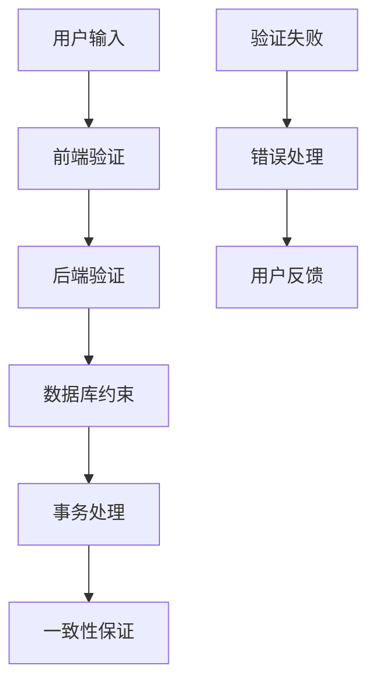
```mermaid
flowchart TD
Input[用户输入] --> FrontendValidation[前端验证]
FrontendValidation --> BackendValidation[后端验证]
BackendValidation --> DatabaseConstraints[数据库约束]
DatabaseConstraints --> Transaction[事务处理]
Transaction --> ConsistencyGuarantee[一致性保证]
Error[验证失败] --> ErrorHandling[错误处理]
ErrorHandling --> UserFeedback[用户反馈]
```

**图表来源**
- [auth.js:522-677](file://shared/auth.js#L522-L677)

**章节来源**
- [auth.js:115-147](file://shared/auth.js#L115-L147)

## 性能监控

### 监控指标体系

系统建立了全面的性能监控指标：

#### 前端性能指标
- **页面加载时间**：测量关键页面的加载性能
- **交互响应时间**：监控用户操作的响应速度
- **内存使用情况**：跟踪JavaScript内存占用
- **网络请求统计**：分析API调用性能

#### 后端性能指标
- **数据库查询性能**：监控SQL查询执行时间
- **API响应时间**：测量接口的响应延迟
- **并发处理能力**：评估系统的并发处理能力
- **资源使用率**：监控CPU、内存和存储使用情况

### 性能优化策略

系统采用以下优化策略：

- **异步加载**：延迟加载非关键资源
- **懒加载**：按需加载评论和图片
- **压缩优化**：启用Gzip和Brotli压缩
- **CDN加速**：使用内容分发网络加速静态资源

## 数据导出与管理工具

### 数据导出功能

系统提供了多种数据导出方式：

#### 批量数据导出
- **CSV格式导出**：支持用户数据和评论数据的批量导出
- **JSON格式导出**：提供原始数据格式的完整导出
- **自定义筛选**：支持按时间范围和用户状态筛选数据

#### 管理工具集成
- **后台管理界面**：提供可视化的数据管理功能
- **批量操作**：支持批量删除、更新和状态变更
- **数据统计报表**：生成详细的使用统计和分析报告

**章节来源**
- [index.html:594-660](file://admin/index.html#L594-L660)

## 备份与恢复

### 自动备份策略

系统建立了完善的备份和恢复机制：

#### 数据库备份
- **定期自动备份**：每日自动创建数据库备份
- **增量备份**：只备份自上次备份以来的变化
- **跨区域复制**：在多个地理位置存储备份数据

#### 备份恢复流程
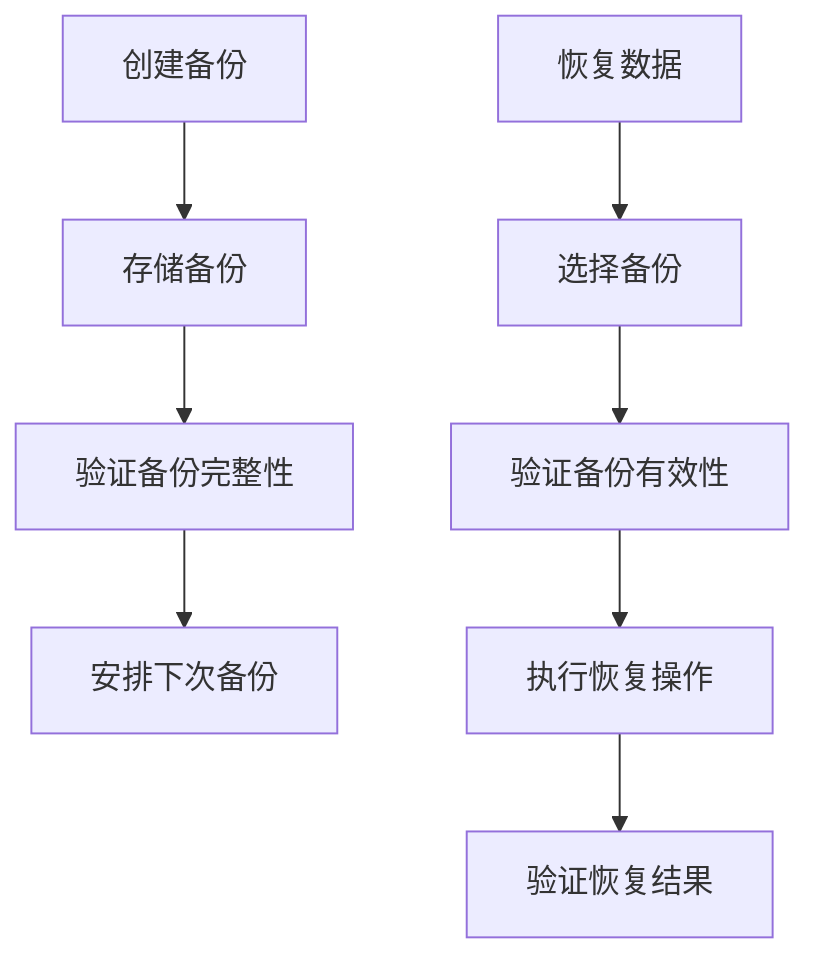
```mermaid
flowchart TD
Backup[创建备份] --> Store[存储备份]
Store --> Verify[验证备份完整性]
Verify --> Schedule[安排下次备份]
Restore[恢复数据] --> SelectBackup[选择备份]
SelectBackup --> Validate[验证备份有效性]
Validate --> ExecuteRestore[执行恢复操作]
ExecuteRestore --> VerifyRestore[验证恢复结果]
```

**图表来源**
- [supabase-repair.sql:1-184](file://supabase-repair.sql#L1-L184)

### 灾难恢复计划

系统制定了详细的灾难恢复计划：

- **RTO目标**：定义数据恢复的时间目标
- **RPO目标**：确定可接受的数据丢失量
- **恢复测试**：定期测试恢复流程的有效性
- **应急预案**：制定应对各种故障场景的预案

## 数据迁移

### 迁移策略

系统提供了灵活的数据迁移功能：

#### 版本升级管理
- **向后兼容**：确保新版本能够处理旧版本数据
- **数据转换**：自动转换不兼容的数据格式
- **迁移脚本**：提供完整的数据库结构升级脚本

#### 平滑迁移
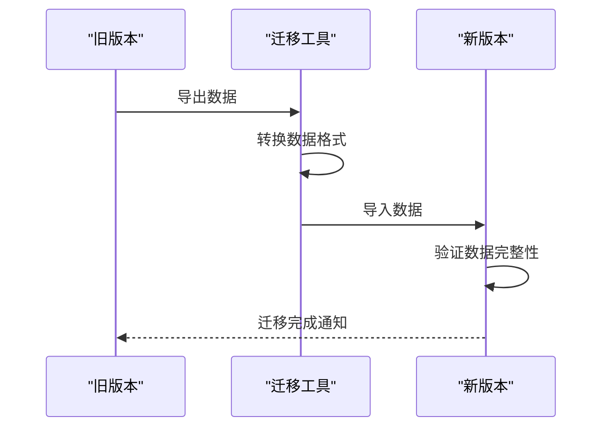
```mermaid
sequenceDiagram
participant Old as "旧版本"
participant Migration as "迁移工具"
participant New as "新版本"
Old->>Migration : 导出数据
Migration->>Migration : 转换数据格式
Migration->>New : 导入数据
New->>New : 验证数据完整性
New-->>Old : 迁移完成通知
```

**图表来源**
- [supabase-community-upgrade.sql:25-44](file://supabase-community-upgrade.sql#L25-L44)

**章节来源**
- [supabase-schema.sql:24-39](file://supabase-schema.sql#L24-L39)
- [supabase-community-upgrade.sql:1-77](file://supabase-community-upgrade.sql#L1-L77)

## 合规性管理

### 数据保护合规

系统遵循相关的数据保护法规：

#### GDPR合规
- **数据最小化**：只收集必要的用户数据
- **用户同意**：明确获取用户的数据使用同意
- **数据删除权**：支持用户删除其个人数据
- **数据转移权**：允许用户导出其个人数据

#### 安全合规
- **数据加密**：在传输和存储过程中加密敏感数据
- **访问控制**：实施严格的访问权限控制
- **审计日志**：记录所有数据访问和修改操作
- **安全培训**：定期对开发和运维人员进行安全培训

### 隐私保护措施

系统采取了多项隐私保护措施：

- **匿名化处理**：对非必要个人信息进行匿名化
- **数据脱敏**：在开发和测试环境中使用脱敏数据
- **隐私设置**：允许用户控制其个人信息的可见性
- **第三方集成**：严格审查第三方服务的隐私政策

## 故障排除指南

### 常见问题诊断

#### 数据库连接问题
- **检查连接字符串**：确认Supabase URL和密钥正确
- **验证网络连接**：确保服务器能够访问Supabase服务
- **检查防火墙设置**：确认端口和IP访问权限

#### 认证问题
- **验证用户状态**：检查用户账户是否激活
- **检查邮箱验证**：确认用户邮箱已完成验证
- **重置密码流程**：提供密码重置的完整流程

#### 性能问题
- **分析查询日志**：识别慢查询和性能瓶颈
- **检查索引使用**：验证查询是否有效使用索引
- **监控资源使用**：跟踪CPU、内存和存储使用情况

### 错误处理机制

系统建立了完善的错误处理和恢复机制：

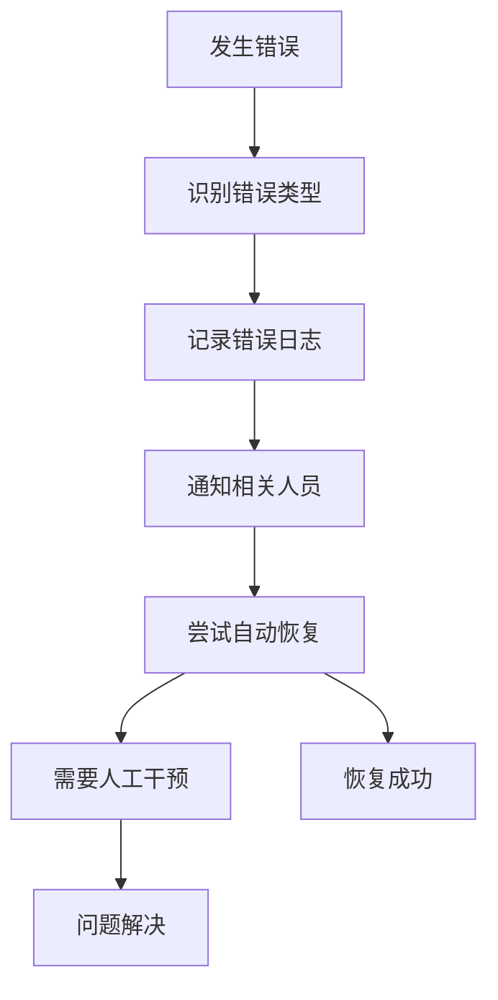
```mermaid
flowchart TD
Error[发生错误] --> Identify[识别错误类型]
Identify --> Log[记录错误日志]
Log --> Notify[通知相关人员]
Notify --> AttemptRecovery[尝试自动恢复]
AttemptRecovery --> ManualIntervention[需要人工干预]
ManualIntervention --> Resolution[问题解决]
AttemptRecovery --> Success[恢复成功]
```

**图表来源**
- [auth.js:115-147](file://shared/auth.js#L115-L147)

**章节来源**
- [auth.js:149-152](file://shared/auth.js#L149-L152)
- [comments.js:334-344](file://shared/comments.js#L334-L344)

## 总结

SoulLab数据存储与管理系统是一个功能完整、安全可靠的全栈应用程序。系统通过精心设计的数据模型、完善的认证机制、高效的查询优化和全面的安全策略，为用户提供了一个稳定可靠的数据管理平台。

### 主要优势

1. **架构设计合理**：采用分层架构，职责分离明确
2. **数据安全可靠**：实施多层次的安全防护措施
3. **性能优化到位**：通过索引优化和缓存策略提升性能
4. **扩展性强**：模块化设计便于功能扩展和维护
5. **用户体验优秀**：提供流畅的交互体验和实时数据同步

### 技术亮点

- **Supabase集成**：充分利用云原生数据库的优势
- **实时同步**：通过WebSocket实现实时数据更新
- **行级安全**：确保数据访问的精确控制
- **多层缓存**：提升系统的整体性能表现
- **完整的监控**：提供全面的性能和错误监控

该系统为"觉醒诗社"平台提供了坚实的数据基础设施，支持未来的功能扩展和技术演进。通过持续的优化和改进，系统将继续为用户提供高质量的服务体验。