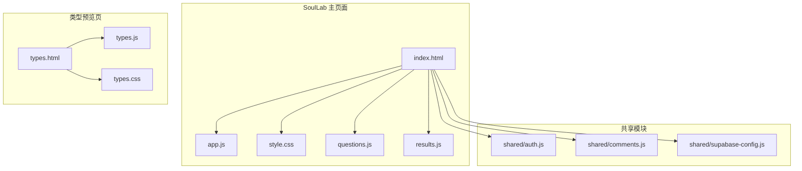
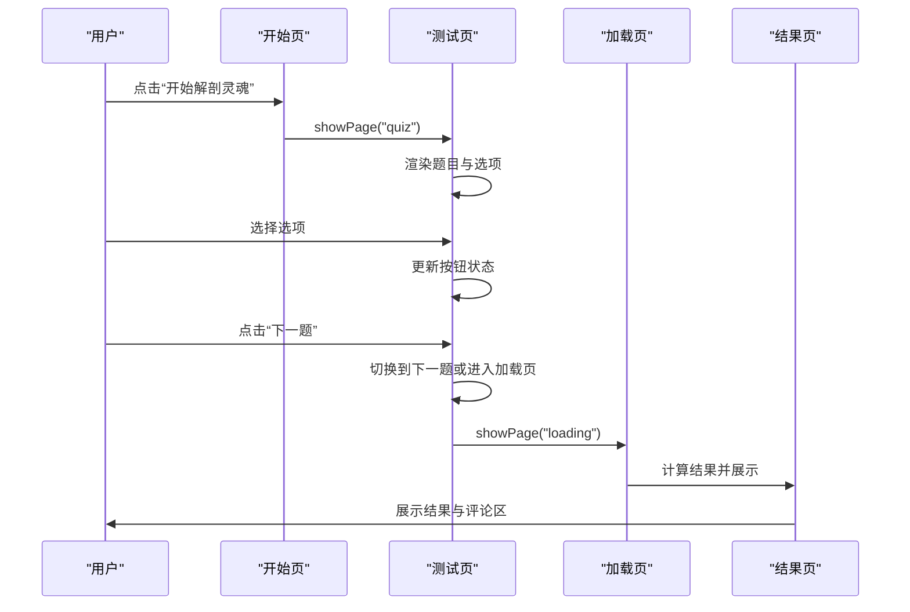
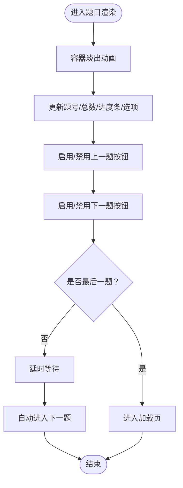
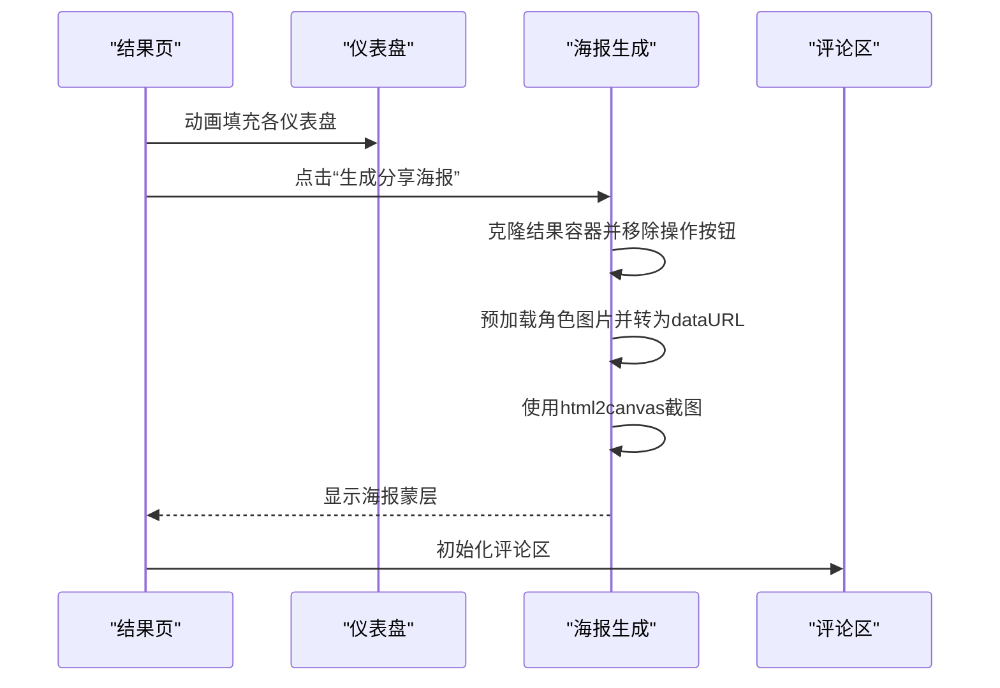
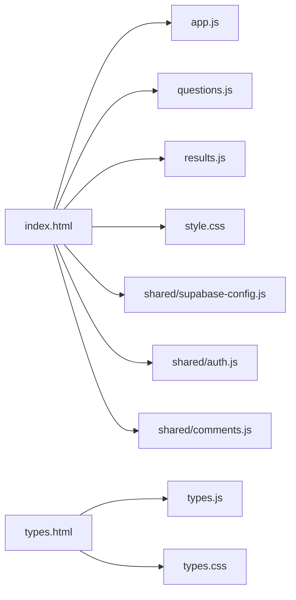

# 测试界面与交互

<cite>
**本文引用的文件**
- [SoulLab/index.html](file://SoulLab/index.html)
- [SoulLab/app.js](file://SoulLab/app.js)
- [SoulLab/style.css](file://SoulLab/style.css)
- [SoulLab/questions.js](file://SoulLab/questions.js)
- [SoulLab/results.js](file://SoulLab/results.js)
- [SoulLab/types.html](file://SoulLab/types.html)
- [SoulLab/types.js](file://SoulLab/types.js)
- [SoulLab/types.css](file://SoulLab/types.css)
- [shared/auth.js](file://shared/auth.js)
- [shared/comments.js](file://shared/comments.js)
- [shared/supabase-config.js](file://shared/supabase-config.js)
</cite>

## 目录
1. [简介](#简介)
2. [项目结构](#项目结构)
3. [核心组件](#核心组件)
4. [架构总览](#架构总览)
5. [详细组件分析](#详细组件分析)
6. [依赖关系分析](#依赖关系分析)
7. [性能考量](#性能考量)
8. [故障排查指南](#故障排查指南)
9. [结论](#结论)
10. [附录](#附录)

## 简介
本文件面向SoulLab测试界面与交互系统，围绕开始页、测试页、加载页、结果页四大核心页面，系统梳理HTML结构设计、CSS样式实现、Canvas粒子动画、进度条控制、按钮交互逻辑、页面切换机制、页面状态管理、事件处理机制、DOM操作最佳实践、响应式布局与移动端适配、界面自定义选项、主题切换支持以及无障碍访问优化建议。文档同时结合共享模块（认证、评论、Supabase配置）说明系统集成方式与扩展点。

## 项目结构
SoulLab位于仓库根目录下的SoulLab子目录，包含测试主页面、类型预览页及其配套脚本与样式；共享模块位于shared目录，提供认证、评论与Supabase配置能力。整体采用“页面 + 核心逻辑 + 共享模块”的分层组织。

图表来源
- [SoulLab/index.html](file://SoulLab/index.html)
- [SoulLab/app.js](file://SoulLab/app.js)
- [SoulLab/style.css](file://SoulLab/style.css)
- [SoulLab/questions.js](file://SoulLab/questions.js)
- [SoulLab/results.js](file://SoulLab/results.js)
- [SoulLab/types.html](file://SoulLab/types.html)
- [SoulLab/types.js](file://SoulLab/types.js)
- [SoulLab/types.css](file://SoulLab/types.css)
- [shared/auth.js](file://shared/auth.js)
- [shared/comments.js](file://shared/comments.js)
- [shared/supabase-config.js](file://shared/supabase-config.js)

章节来源
- [SoulLab/index.html:1-271](file://SoulLab/index.html#L1-L271)
- [SoulLab/types.html:1-125](file://SoulLab/types.html#L1-L125)

## 核心组件
- 页面容器与切换
  - 页面容器类与激活状态：通过页面元素的active类控制显示与淡入/淡出过渡。
  - 页面切换函数：统一入口控制页面显隐与滚动位置。
- 测试流程控制
  - 当前题目索引与答案存储：全局状态维护答题进度与选择。
  - 渲染题目与选项：动态生成题目文本、选项与选中态。
  - 自动前进与按钮联动：根据是否为最后一题切换按钮文案与行为。
- 加载与结果页
  - 加载页：轮播提示语与延迟计算结果。
  - 结果页：填充人格类型信息、角色图像、仪表盘动画、标签与引用、MBTI说明、评论区挂载。
- Canvas粒子背景
  - 全局Canvas粒子系统：窗口尺寸变更时重绘，粒子边界反弹与连线绘制。
- 交互与事件
  - 键盘导航：方向键与回车键快速选择与前进。
  - 图片模态框：点击查看大图。
  - Toast通知：轻提示反馈。
- 共享模块集成
  - Supabase配置：全局初始化客户端。
  - 认证与评论：登录状态渲染、评论区挂载与渲染。

章节来源
- [SoulLab/app.js:158-188](file://SoulLab/app.js#L158-L188)
- [SoulLab/app.js:193-235](file://SoulLab/app.js#L193-L235)
- [SoulLab/app.js:278-299](file://SoulLab/app.js#L278-L299)
- [SoulLab/app.js:304-332](file://SoulLab/app.js#L304-L332)
- [SoulLab/app.js:353-405](file://SoulLab/app.js#L353-L405)
- [SoulLab/app.js:83-153](file://SoulLab/app.js#L83-L153)
- [SoulLab/app.js:559-576](file://SoulLab/app.js#L559-L576)
- [SoulLab/app.js:581-604](file://SoulLab/app.js#L581-L604)
- [shared/supabase-config.js:5-25](file://shared/supabase-config.js#L5-L25)
- [shared/auth.js:292-314](file://shared/auth.js#L292-L314)
- [shared/comments.js:208-281](file://shared/comments.js#L208-L281)

## 架构总览
系统采用“页面容器 + 状态管理 + 事件处理 + 共享模块”的分层架构：
- 视图层：HTML页面结构与CSS样式，负责布局、动画与视觉反馈。
- 逻辑层：JavaScript模块封装页面切换、答题流程、结果计算与展示、Canvas粒子与交互。
- 数据层：问题与结果数据文件，提供题目与人格画像定义。
- 集成层：共享模块提供认证、评论与Supabase配置，贯穿页面生命周期。

图表来源
- [SoulLab/app.js:182-188](file://SoulLab/app.js#L182-L188)
- [SoulLab/app.js:278-299](file://SoulLab/app.js#L278-L299)
- [SoulLab/app.js:304-332](file://SoulLab/app.js#L304-L332)
- [SoulLab/app.js:353-405](file://SoulLab/app.js#L353-L405)

## 详细组件分析

### 开始页（Landing）
- 结构要点
  - 顶部返回主页按钮、粒子Canvas背景、登录状态占位、标题与副标题、介绍卡片、开始测试与浏览类型按钮。
- 样式要点
  - 顶部发光圆环、标题渐变文本、介绍卡片悬停效果、按钮渐变与发光。
- 交互要点
  - 开始测试按钮绑定onclick事件，触发startTest()。
  - 浏览类型按钮跳转到类型预览页。
- 用户体验
  - 顶部返回按钮便于中断流程；粒子背景营造沉浸氛围；按钮悬停与渐变增强触控反馈。

章节来源
- [SoulLab/index.html:42-87](file://SoulLab/index.html#L42-L87)
- [SoulLab/style.css:169-340](file://SoulLab/style.css#L169-L340)

### 测试页（Quiz）
- 结构要点
  - 顶部固定进度条与题号、中部题目容器、底部固定导航按钮（返回主页、上一题、下一题）。
- 样式要点
  - 进度条容器与填充、题号与题文、选项卡片悬停与选中态、底部导航固定定位与模糊背景。
- 交互要点
  - 选项点击更新选中态与按钮可用性；自动前进逻辑在非最后一题时延时自动进入下一题。
  - 上一题/下一题按钮禁用状态与文案切换（最后一题显示“查看结果”）。
  - 键盘导航：字母键选择、方向键/回车前进。
- 页面切换
  - 最后一题时进入加载页，否则继续渲染下一题。

图表来源
- [SoulLab/app.js:193-235](file://SoulLab/app.js#L193-L235)
- [SoulLab/app.js:278-299](file://SoulLab/app.js#L278-L299)
- [SoulLab/app.js:259-273](file://SoulLab/app.js#L259-L273)
- [SoulLab/app.js:559-576](file://SoulLab/app.js#L559-L576)

章节来源
- [SoulLab/index.html:89-126](file://SoulLab/index.html#L89-L126)
- [SoulLab/style.css:494-742](file://SoulLab/style.css#L494-L742)
- [SoulLab/app.js:193-235](file://SoulLab/app.js#L193-L235)
- [SoulLab/app.js:259-273](file://SoulLab/app.js#L259-L273)
- [SoulLab/app.js:559-576](file://SoulLab/app.js#L559-L576)

### 加载页（Loading）
- 结构要点
  - 中央旋转球体动画与提示语容器。
- 交互要点
  - 轮播提示语数组定时切换；3.6秒后计算结果并进入结果页。
- 用户体验
  - 动画与提示语缓解等待焦虑，营造“灵魂解析”氛围。

章节来源
- [SoulLab/index.html:128-140](file://SoulLab/index.html#L128-L140)
- [SoulLab/app.js:304-332](file://SoulLab/app.js#L304-L332)

### 结果页（Result）
- 结构要点
  - 角色图像、类型标签、标题与副标题、描述、标签、名言、MBTI说明、结果仪表盘、分享与重新测试按钮、作者信息与二维码、评论区挂载容器。
- 交互要点
  - 仪表盘数值动画：逐帧递增到目标值。
  - 分享海报：动态截图生成，支持跨域图片预加载与蒙层展示。
  - 重新测试：返回开始页。
- 用户体验
  - 仪表盘动画与标签增强可视化；一键分享简化社交传播；评论区承载社区互动。

图表来源
- [SoulLab/app.js:353-405](file://SoulLab/app.js#L353-L405)
- [SoulLab/app.js:407-424](file://SoulLab/app.js#L407-L424)
- [SoulLab/app.js:433-546](file://SoulLab/app.js#L433-L546)
- [SoulLab/index.html:142-238](file://SoulLab/index.html#L142-L238)

章节来源
- [SoulLab/index.html:142-238](file://SoulLab/index.html#L142-L238)
- [SoulLab/results.js:6-139](file://SoulLab/results.js#L6-L139)
- [SoulLab/app.js:353-405](file://SoulLab/app.js#L353-L405)
- [SoulLab/app.js:407-424](file://SoulLab/app.js#L407-L424)
- [SoulLab/app.js:433-546](file://SoulLab/app.js#L433-L546)

### Canvas粒子动画
- 实现要点
  - 全局Canvas尺寸随窗口变化；粒子边界反弹；连线阈值与透明度衰减；requestAnimationFrame循环绘制。
- 性能与体验
  - 限定粒子数量与绘制频率；连线绘制在主循环内完成；背景不阻塞交互。

章节来源
- [SoulLab/app.js:83-153](file://SoulLab/app.js#L83-L153)
- [SoulLab/style.css:114-122](file://SoulLab/style.css#L114-L122)

### 类型预览页（Types）
- 结构要点
  - 顶部导航（返回主页、标题、开始测试）、网格卡片预览、详情列表、底部CTA、作者信息。
- 交互要点
  - 粒子背景复用；导航滚动阴影；网格卡片点击高亮；详情卡片IntersectionObserver懒加载与仪表盘动画；哈希导航高亮与滚动。
- 用户体验
  - 卡片悬停与箭头指示增强可发现性；详情卡片可见性动画与高亮突出关键信息。

章节来源
- [SoulLab/types.html:27-124](file://SoulLab/types.html#L27-L124)
- [SoulLab/types.js:8-55](file://SoulLab/types.js#L8-L55)
- [SoulLab/types.js:60-66](file://SoulLab/types.js#L60-L66)
- [SoulLab/types.js:71-231](file://SoulLab/types.js#L71-L231)
- [SoulLab/types.css:107-800](file://SoulLab/types.css#L107-L800)

### 页面状态管理与事件处理
- 状态管理
  - 全局变量维护当前题目索引、答案映射与得分映射；页面切换统一通过showPage()控制。
- 事件处理
  - 键盘事件监听测试页；图片模态框开关；Toast提示；评论区初始化钩子。
- DOM操作最佳实践
  - 使用模板字符串与一次性插入减少重排；延迟动画与渐变过渡；条件禁用按钮避免误操作。

章节来源
- [SoulLab/app.js:4-6](file://SoulLab/app.js#L4-L6)
- [SoulLab/app.js:158-177](file://SoulLab/app.js#L158-L177)
- [SoulLab/app.js:559-576](file://SoulLab/app.js#L559-L576)
- [SoulLab/app.js:581-604](file://SoulLab/app.js#L581-L604)
- [SoulLab/app.js:548-554](file://SoulLab/app.js#L548-L554)
- [shared/comments.js:208-281](file://shared/comments.js#L208-L281)

### 响应式布局与移动端适配
- 响应式策略
  - 使用clamp()实现字体与间距的流式缩放；Flex与Grid布局适配不同屏幕；固定定位的导航在移动端保持可用。
- 移动端适配
  - 选项卡片与按钮在窄屏下保持可点击区域；进度条与仪表盘在小屏下保持清晰可读；模态框与图片预览在移动端具备良好交互。
- 可访问性
  - 提供键盘导航与焦点顺序；按钮具备明确语义与标题属性；颜色对比度符合基础要求。

章节来源
- [SoulLab/style.css:219-229](file://SoulLab/style.css#L219-L229)
- [SoulLab/style.css:511-526](file://SoulLab/style.css#L511-L526)
- [SoulLab/types.css:276-279](file://SoulLab/types.css#L276-L279)

### 界面自定义与主题支持
- 设计令牌与主题
  - CSS变量集中定义色彩、渐变、阴影、半径、字体与过渡；通过变量组合形成统一风格。
- 自定义建议
  - 可通过覆盖CSS变量实现主题切换；为不同页面增加body类以区分样式上下文；为按钮与卡片增加hover/active状态变量以增强一致性。

章节来源
- [SoulLab/style.css:4-83](file://SoulLab/style.css#L4-L83)
- [SoulLab/types.css:4-68](file://SoulLab/types.css#L4-L68)

### 无障碍访问优化
- 键盘可达性
  - 测试页支持键盘选择与前进/后退；按钮具备title属性与可读文案。
- 屏幕阅读器友好
  - 语义化标签与标题层次；图片alt文本；模态框具备关闭提示。
- 可感知反馈
  - 选中态与禁用态具备视觉差异；Toast提示及时反馈操作结果。

章节来源
- [SoulLab/app.js:559-576](file://SoulLab/app.js#L559-L576)
- [SoulLab/index.html:35-40](file://SoulLab/index.html#L35-L40)
- [SoulLab/app.js:548-554](file://SoulLab/app.js#L548-L554)

## 依赖关系分析
- 页面与脚本
  - index.html引入questions.js与results.js；app.js负责页面切换、答题流程与结果展示。
  - types.html引入types.js与types.css；复用部分共享模块。
- 共享模块
  - shared/supabase-config.js提供全局Supabase客户端；shared/auth.js提供认证UI与状态；shared/comments.js提供评论区渲染与交互。
- 外部资源
  - CDN引入html2canvas用于海报生成；CDN引入@supabase/supabase-js；字体资源通过Google Fonts加载。

图表来源
- [SoulLab/index.html:249-255](file://SoulLab/index.html#L249-L255)
- [SoulLab/types.html:120-121](file://SoulLab/types.html#L120-L121)
- [shared/supabase-config.js:5-25](file://shared/supabase-config.js#L5-L25)

章节来源
- [SoulLab/index.html:249-255](file://SoulLab/index.html#L249-L255)
- [SoulLab/types.html:120-121](file://SoulLab/types.html#L120-L121)
- [shared/supabase-config.js:5-25](file://shared/supabase-config.js#L5-L25)

## 性能考量
- Canvas绘制
  - 限定粒子数量与绘制频率，避免过度重绘；连线绘制在主循环内完成，注意阈值与透明度衰减计算。
- DOM操作
  - 批量插入与一次性更新，减少重排与重绘；延迟动画与渐变过渡提升流畅度。
- 资源加载
  - html2canvas截图需考虑跨域与超时；图片预加载与dataURL转换避免污染；字体资源预连接提升首屏渲染。
- 交互反馈
  - Toast提示与按钮禁用避免重复提交；键盘导航减少鼠标依赖，提升效率。

## 故障排查指南
- Supabase初始化失败
  - 检查CDN是否可用与全局变量是否正确注入；确认URL与密钥配置。
- 评论功能异常
  - 检查数据库表是否存在与权限是否正确；确认升级SQL脚本执行情况；查看错误提示并按指引修复。
- 海报生成失败
  - 检查html2canvas版本与跨域设置；尝试降级scale参数；确认图片资源可访问。
- 键盘导航无效
  - 确认测试页为激活状态；检查事件监听绑定与页面焦点。

章节来源
- [shared/supabase-config.js:5-25](file://shared/supabase-config.js#L5-L25)
- [shared/comments.js:333-344](file://shared/comments.js#L333-L344)
- [shared/comments.js:634-638](file://shared/comments.js#L634-L638)
- [SoulLab/app.js:433-546](file://SoulLab/app.js#L433-L546)
- [SoulLab/app.js:559-576](file://SoulLab/app.js#L559-L576)

## 结论
SoulLab测试界面与交互系统通过清晰的页面结构、统一的状态管理与事件处理、丰富的视觉与动画效果，实现了从开始到结果的完整用户体验闭环。系统在移动端与桌面端均具备良好的适配性，并通过共享模块提供了认证、评论与数据层的可扩展能力。未来可在主题切换、无障碍细节与性能优化方面进一步完善。

## 附录
- 问题与结果数据
  - 33道题目与12种人格画像定义分别由questions.js与results.js提供，支撑测试与结果展示。
- 类型预览页
  - types.html/types.js/types.css共同实现类型卡片与详情展示，配合粒子背景与懒加载动画。

章节来源
- [SoulLab/questions.js:20-352](file://SoulLab/questions.js#L20-L352)
- [SoulLab/results.js:6-139](file://SoulLab/results.js#L6-L139)
- [SoulLab/types.html:27-124](file://SoulLab/types.html#L27-L124)
- [SoulLab/types.js:71-231](file://SoulLab/types.js#L71-L231)
- [SoulLab/types.css:107-800](file://SoulLab/types.css#L107-L800)