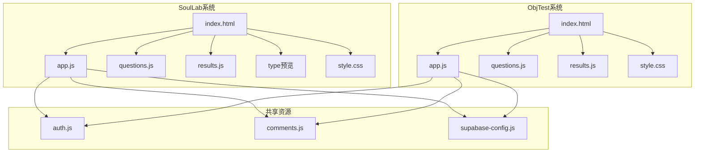
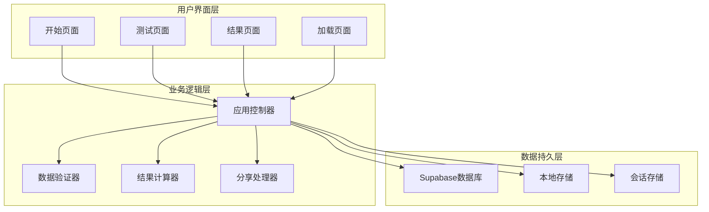
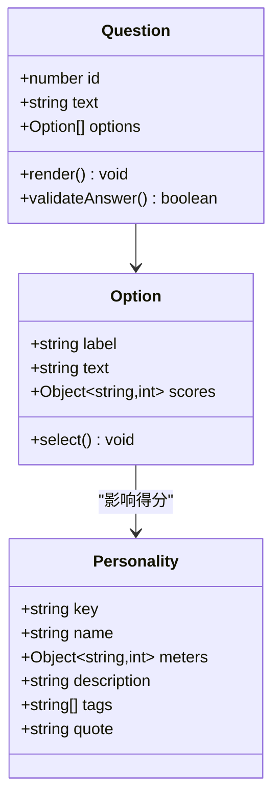
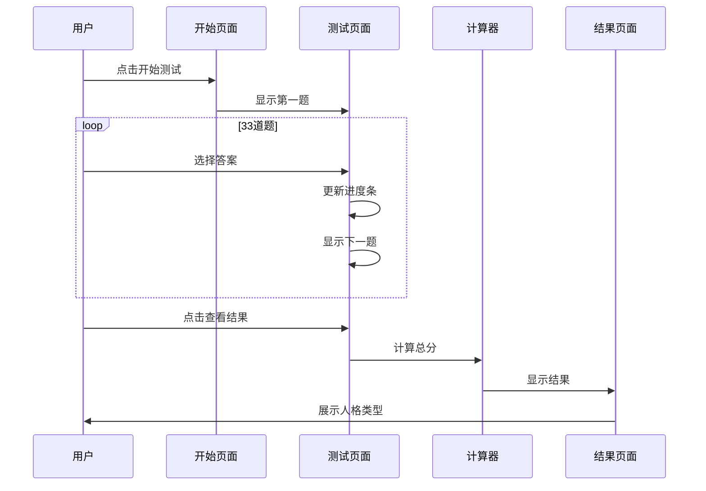
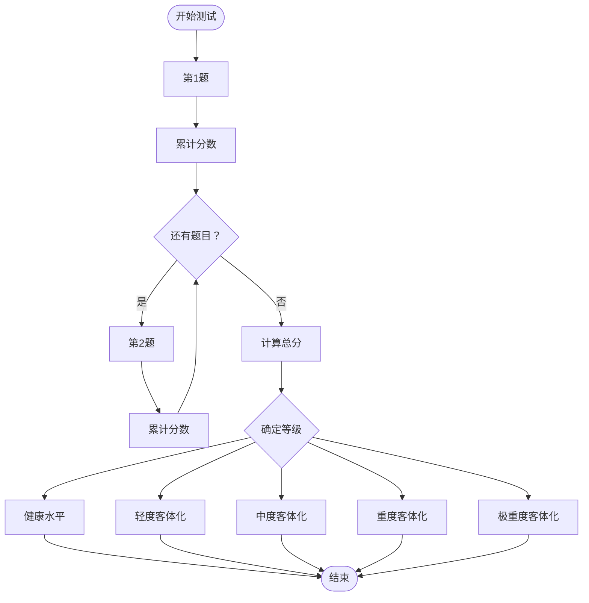
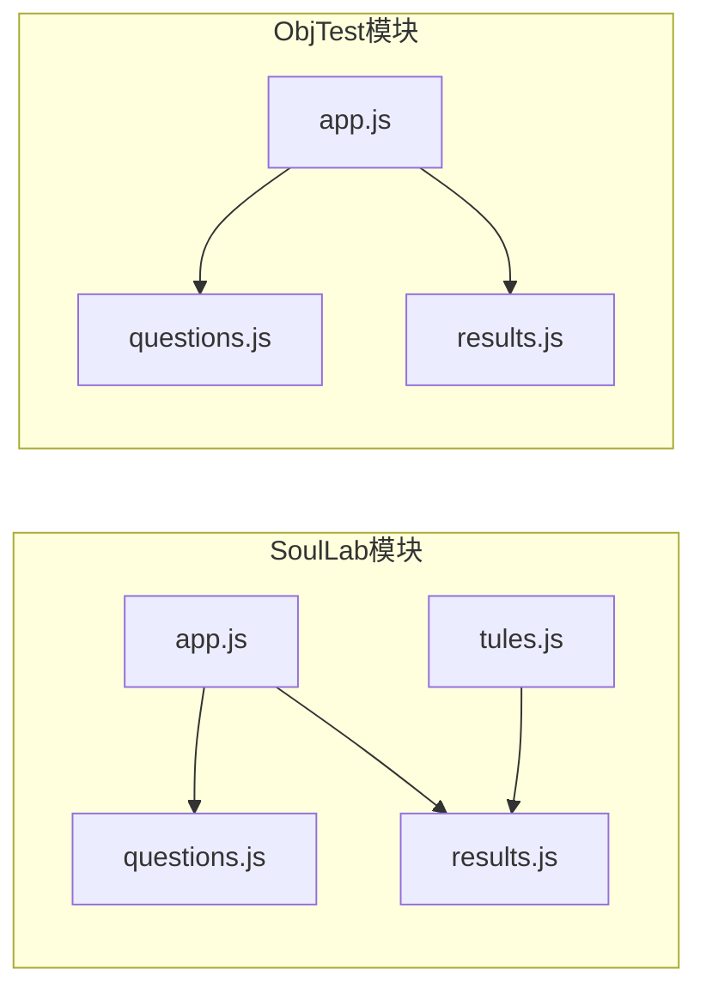

# 测试题目系统

<cite>
**本文档引用的文件**
- [SoulLab/questions.js](file://SoulLab/questions.js)
- [SoulLab/app.js](file://SoulLab/app.js)
- [SoulLab/index.html](file://SoulLab/index.html)
- [SoulLab/results.js](file://SoulLab/results.js)
- [SoulLab/types.js](file://SoulLab/types.js)
- [SoulLab/types.html](file://SoulLab/types.html)
- [SoulLab/style.css](file://SoulLab/style.css)
- [ObjTest/questions.js](file://ObjTest/questions.js)
- [ObjTest/app.js](file://ObjTest/app.js)
- [ObjTest/index.html](file://ObjTest/index.html)
- [ObjTest/results.js](file://ObjTest/results.js)
- [ObjTest/style.css](file://ObjTest/style.css)
- [SoulLab/README.md](file://SoulLab/README.md)
- [ObjTest/客体化测试.md](file://ObjTest/客体化测试.md)
</cite>

## 目录
1. [简介](#简介)
2. [项目结构](#项目结构)
3. [核心组件](#核心组件)
4. [架构概览](#架构概览)
5. [详细组件分析](#详细组件分析)
6. [依赖关系分析](#依赖关系分析)
7. [性能考量](#性能考量)
8. [故障排除指南](#故障排除指南)
9. [结论](#结论)
10. [附录](#附录)

## 简介
本项目包含两个独立的心理学测试系统：
- **SoulLab测试系统**：基于33道深度心理问题的12种人格类型测试，融合灵性觉醒、MBTI与SBTI元素
- **ObjTest客体化测试系统**：基于40道题目的自我客体化程度评估，采用连续评分制

两个系统均采用前后端分离架构，使用JavaScript实现交互逻辑，CSS实现视觉样式，通过Supabase进行数据存储与统计。

## 项目结构
项目采用模块化组织方式，每个测试系统包含独立的HTML页面、样式文件、JavaScript逻辑文件和数据文件：

**图表来源**
- [SoulLab/index.html:1-271](file://SoulLab/index.html#L1-L271)
- [ObjTest/index.html:1-170](file://ObjTest/index.html#L1-L170)

**章节来源**
- [SoulLab/index.html:1-271](file://SoulLab/index.html#L1-L271)
- [ObjTest/index.html:1-170](file://ObjTest/index.html#L1-L170)

## 核心组件
两个测试系统都包含相似的核心组件架构：

### 数据层组件
- **题目数据结构**：JSON格式的题目数组，包含题目ID、文本、选项和评分机制
- **结果定义**：预定义的测试结果类型和描述
- **评分系统**：基于选项权重的累积评分机制

### 业务逻辑层组件
- **应用控制器**：处理用户交互、状态管理和流程控制
- **渲染引擎**：动态生成页面内容和UI组件
- **结果处理器**：计算最终结果和生成报告

### 视觉呈现层组件
- **主题样式**：针对不同测试类型的定制化视觉设计
- **响应式布局**：适配多种设备和屏幕尺寸
- **动画效果**：流畅的页面过渡和交互反馈

**章节来源**
- [SoulLab/questions.js:1-352](file://SoulLab/questions.js#L1-L352)
- [SoulLab/app.js:1-613](file://SoulLab/app.js#L1-L613)
- [ObjTest/questions.js:1-403](file://ObjTest/questions.js#L1-L403)
- [ObjTest/app.js:1-327](file://ObjTest/app.js#L1-L327)

## 架构概览
两个测试系统采用相同的三层架构模式：

**图表来源**
- [SoulLab/app.js:1-613](file://SoulLab/app.js#L1-L613)
- [ObjTest/app.js:1-327](file://ObjTest/app.js#L1-L327)

## 详细组件分析

### SoulLab测试系统

#### 题目数据结构分析
SoulLab系统包含33道精心设计的心理学题目，每道题包含：
- **题目ID**：唯一标识符，用于追踪用户回答
- **题目文本**：直指内心的深度问题
- **选项配置**：4个选项，每个选项对应不同的人格类型得分
- **评分机制**：多选项得分累加到对应人格类型

**图表来源**
- [SoulLab/questions.js:20-352](file://SoulLab/questions.js#L20-L352)
- [SoulLab/results.js:6-140](file://SoulLab/results.js#L6-L140)

#### 评分机制设计
系统采用多维度评分机制：
- **人格类型映射**：12种人格类型（mask, hoard, escape, rebel, edge, crash, chill, clown, mama, hustle, chaos, awake）
- **分数累加**：每个选项为特定人格类型增加相应分数
- **最终判定**：总分最高的类型作为用户的人格类型

#### 用户交互流程

**图表来源**
- [SoulLab/app.js:182-405](file://SoulLab/app.js#L182-L405)

**章节来源**
- [SoulLab/questions.js:1-352](file://SoulLab/questions.js#L1-L352)
- [SoulLab/results.js:1-140](file://SoulLab/results.js#L1-L140)
- [SoulLab/app.js:334-405](file://SoulLab/app.js#L334-L405)

### ObjTest客体化测试系统

#### 连续评分机制
ObjTest系统采用连续评分制：
- **40道题目**：每题4个选项，分数范围0-3分
- **总分计算**：所有题目得分累加，范围0-120分
- **结果分级**：根据总分范围划分五个等级

**图表来源**
- [ObjTest/app.js:207-217](file://ObjTest/app.js#L207-L217)
- [ObjTest/results.js:8-55](file://ObjTest/results.js#L8-L55)

#### 结果分类体系
系统将客体化程度分为五个等级：
- **健康水平**（0-24分）：稳定的自我价值感
- **轻度客体化**（25-48分）：偶尔过度在意他人评价
- **中度客体化**（49-72分）：显著依赖外部评价
- **重度客体化**（73-96分）：严重依赖他人
- **极重度客体化**（97-120分）：完全失去自我主体性

**章节来源**
- [ObjTest/questions.js:1-403](file://ObjTest/questions.js#L1-L403)
- [ObjTest/app.js:207-217](file://ObjTest/app.js#L207-L217)
- [ObjTest/results.js:1-55](file://ObjTest/results.js#L1-L55)

### 类型预览系统
SoulLab系统包含专门的类型预览功能：
- **网格展示**：12种人格类型的卡片网格
- **详情展示**：每种人格的详细描述和特征
- **交互导航**：支持锚点导航和滚动高亮
- **可视化指标**：四个维度的可视化展示

**章节来源**
- [SoulLab/types.js:71-231](file://SoulLab/types.js#L71-L231)
- [SoulLab/types.html:1-125](file://SoulLab/types.html#L1-L125)

## 依赖关系分析

### 外部依赖
两个系统都依赖以下外部资源：
- **Supabase客户端**：用于数据存储和统计
- **html2canvas**：用于结果海报生成
- **百度统计**：网站访问统计

### 内部模块依赖

**图表来源**
- [SoulLab/app.js:253-255](file://SoulLab/app.js#L253-L255)
- [ObjTest/app.js:164-168](file://ObjTest/app.js#L164-L168)

**章节来源**
- [SoulLab/app.js:1-613](file://SoulLab/app.js#L1-L613)
- [ObjTest/app.js:1-327](file://ObjTest/app.js#L1-L327)

## 性能考量
系统在性能方面采用了多项优化措施：

### 前端性能优化
- **懒加载资源**：图片和脚本按需加载
- **Canvas动画**：使用硬件加速的粒子效果
- **CSS变量**：统一的主题变量管理
- **响应式设计**：移动端优先的布局策略

### 数据处理优化
- **增量计算**：实时更新进度和状态
- **内存管理**：及时清理DOM节点
- **缓存策略**：图片资源的缓存处理

### 网络性能优化
- **CDN资源**：第三方库通过CDN加载
- **按需加载**：html2canvas仅在需要时加载
- **压缩传输**：CSS和JavaScript文件压缩

## 故障排除指南

### 常见问题诊断
1. **题目不显示**
   - 检查questions.js文件格式
   - 验证JSON语法正确性
   - 确认文件编码为UTF-8

2. **结果计算错误**
   - 检查scores对象初始化
   - 验证选项评分权重
   - 确认累计计算逻辑

3. **页面样式异常**
   - 检查CSS文件加载
   - 验证主题变量定义
   - 确认媒体查询兼容性

### 调试工具使用
- **浏览器开发者工具**：检查JavaScript错误
- **网络面板**：监控资源加载状态
- **控制台日志**：输出调试信息

**章节来源**
- [SoulLab/app.js:334-405](file://SoulLab/app.js#L334-L405)
- [ObjTest/app.js:207-217](file://ObjTest/app.js#L207-L217)

## 结论
本测试题目系统展现了现代Web应用的最佳实践：

### 技术优势
- **模块化设计**：清晰的组件分离和职责划分
- **用户体验**：流畅的交互流程和视觉反馈
- **可扩展性**：灵活的数据结构和插件化架构
- **跨平台兼容**：响应式设计适配多设备

### 应用价值
- **心理学研究**：提供专业的心理测评工具
- **个人发展**：帮助用户了解自我认知
- **教育用途**：适用于心理学教学和培训
- **自我探索**：促进个人成长和意识提升

### 发展建议
- **功能增强**：添加更多测试类型和评估维度
- **数据分析**：集成统计分析和趋势跟踪
- **多语言支持**：国际化和本地化改进
- **移动端优化**：原生应用开发和PWA支持

## 附录

### 题目设计原则
1. **心理学基础**：基于成熟的心理学理论和研究
2. **文化适应性**：考虑不同文化背景下的适用性
3. **语言表达**：使用简洁明了、易于理解的语言
4. **避免偏见**：确保题目不带有性别、年龄、种族等偏见

### 扩展开发指南
1. **新增题目**：遵循现有数据结构格式
2. **修改评分**：调整选项权重以反映新的理论
3. **添加类型**：扩展人格类型定义和描述
4. **界面定制**：修改CSS变量和主题样式

### 质量评估标准
1. **信度检验**：内部一致性系数和重测信度
2. **效度分析**：内容效度、构念效度和标准效度
3. **统计分析**：描述性统计和差异性检验
4. **用户反馈**：收集和分析用户使用体验

**章节来源**
- [SoulLab/README.md:1-35](file://SoulLab/README.md#L1-L35)
- [ObjTest/客体化测试.md:1-521](file://ObjTest/客体化测试.md#L1-L521)