# 结果分析与展示

<cite>
**本文引用的文件**
- [SoulLab/app.js](file://SoulLab/app.js)
- [SoulLab/questions.js](file://SoulLab/questions.js)
- [SoulLab/results.js](file://SoulLab/results.js)
- [SoulLab/types.js](file://SoulLab/types.js)
- [SoulLab/index.html](file://SoulLab/index.html)
- [SoulLab/types.html](file://SoulLab/types.html)
- [shared/auth.js](file://shared/auth.js)
- [shared/comments.js](file://shared/comments.js)
- [shared/supabase-config.js](file://shared/supabase-config.js)
- [shared/auth.css](file://shared/auth.css)
- [shared/comments.css](file://shared/comments.css)
- [SoulLab/style.css](file://SoulLab/style.css)
</cite>

## 目录
1. [简介](#简介)
2. [项目结构](#项目结构)
3. [核心组件](#核心组件)
4. [架构总览](#架构总览)
5. [详细组件分析](#详细组件分析)
6. [依赖分析](#依赖分析)
7. [性能考虑](#性能考虑)
8. [故障排除指南](#故障排除指南)
9. [结论](#结论)
10. [附录](#附录)

## 简介
本项目为“SoulLab结果分析与展示系统”，围绕“灵性修行版人格测试”展开，提供从题目作答、评分算法、结果计算、类型匹配到个性化结果页与分享海报的完整闭环。系统采用前端纯静态页面与 Supabase 数据服务结合的方式，实现结果统计、参与人数计数、评论互动、用户认证与头像管理、以及结果海报生成等功能。

## 项目结构
- 前端页面与脚本
  - 主页与测试流程：index.html + app.js + questions.js + results.js + style.css
  - 人格类型预览：types.html + types.js + results.js + types.css
  - 共享模块：auth.js（认证）、comments.js（评论）、supabase-config.js（Supabase配置）
  - 样式：shared/auth.css、shared/comments.css、SoulLab/style.css、SoulLab/types.css
- 数据与服务
  - Supabase：认证、评论、结果浏览计数、头像存储等
  - html2canvas：结果页截图生成海报

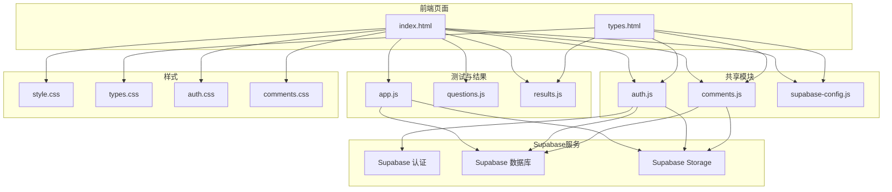

**图表来源**
- [SoulLab/index.html:1-271](file://SoulLab/index.html#L1-L271)
- [SoulLab/types.html:1-125](file://SoulLab/types.html#L1-L125)
- [SoulLab/app.js:1-613](file://SoulLab/app.js#L1-L613)
- [SoulLab/questions.js:1-352](file://SoulLab/questions.js#L1-L352)
- [SoulLab/results.js:1-140](file://SoulLab/results.js#L1-L140)
- [shared/auth.js:1-800](file://shared/auth.js#L1-L800)
- [shared/comments.js:1-769](file://shared/comments.js#L1-L769)
- [shared/supabase-config.js:1-26](file://shared/supabase-config.js#L1-L26)
- [SoulLab/style.css:1-200](file://SoulLab/style.css#L1-L200)
- [shared/auth.css:1-200](file://shared/auth.css#L1-L200)
- [shared/comments.css:1-200](file://shared/comments.css#L1-L200)

**章节来源**
- [SoulLab/index.html:1-271](file://SoulLab/index.html#L1-L271)
- [SoulLab/types.html:1-125](file://SoulLab/types.html#L1-L125)

## 核心组件
- 测试流程与状态管理
  - 当前题目索引、答题记录、各人格累计分数
  - 页面切换、进度条、键盘快捷键
- 评分与结果计算
  - 遍历题目答案，累加各人格的得分
  - 找出最高分人格作为最终结果
- 结果页渲染
  - 类型徽章、标题、副标题、描述、金句、MBTI标签、四象限仪表盘
  - 图片点击放大、评论区初始化
- 分享与海报生成
  - 使用 html2canvas 截图，生成可保存的海报
- 参与人数统计与浏览追踪
  - Supabase 表 result_views 计数，降级到 comments 表计数
- 用户认证与头像
  - Supabase 登录/注册、头像选择与上传、昵称编辑
- 评论系统
  - 评论加载、点赞、回复、图片附件、@提及高亮

**章节来源**
- [SoulLab/app.js:1-613](file://SoulLab/app.js#L1-L613)
- [SoulLab/questions.js:1-352](file://SoulLab/questions.js#L1-L352)
- [SoulLab/results.js:1-140](file://SoulLab/results.js#L1-L140)
- [shared/auth.js:1-800](file://shared/auth.js#L1-L800)
- [shared/comments.js:1-769](file://shared/comments.js#L1-L769)

## 架构总览
系统采用“前端SPA + Supabase后端”的轻量架构：
- 前端负责交互、动画、结果计算与展示
- Supabase 提供认证、数据存储、对象存储、实时能力
- 通过 Supabase 配置模块统一注入客户端实例

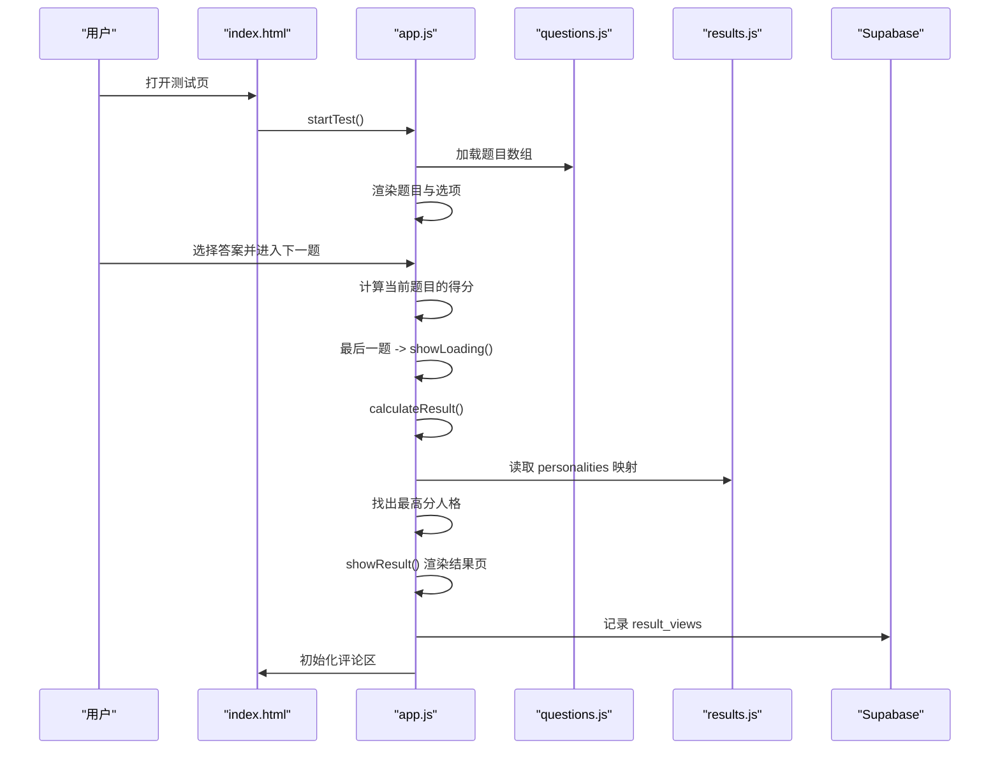

**图表来源**
- [SoulLab/index.html:1-271](file://SoulLab/index.html#L1-L271)
- [SoulLab/app.js:182-405](file://SoulLab/app.js#L182-L405)
- [SoulLab/questions.js:20-351](file://SoulLab/questions.js#L20-L351)
- [SoulLab/results.js:6-139](file://SoulLab/results.js#L6-L139)

## 详细组件分析

### 评分算法与结果计算
- 输入：题目数组 questions.js，每题包含若干选项，选项包含对各人格的得分映射
- 算法步骤：
  - 初始化各人格分数为0
  - 遍历已作答题目，累加对应选项的各人格得分
  - 选取最高分人格作为最终类型
- 输出：结果页展示该类型名称、标签、描述、金句、MBTI说明与四象限仪表盘

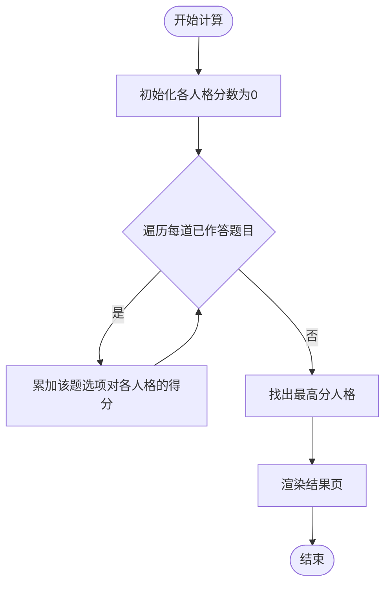

**图表来源**
- [SoulLab/app.js:334-351](file://SoulLab/app.js#L334-L351)
- [SoulLab/questions.js:20-351](file://SoulLab/questions.js#L20-L351)
- [SoulLab/results.js:6-139](file://SoulLab/results.js#L6-L139)

**章节来源**
- [SoulLab/app.js:334-351](file://SoulLab/app.js#L334-L351)
- [SoulLab/questions.js:20-351](file://SoulLab/questions.js#L20-L351)
- [SoulLab/results.js:6-139](file://SoulLab/results.js#L6-L139)

### 结果页展示与仪表盘
- 展示内容：类型徽章、标题、副标题、描述、标签、金句、MBTI说明
- 仪表盘：面具厚度、灵魂清醒度、摆烂指数、内心戏浓度四个维度，逐项动画计数
- 交互：图片点击放大、评论区初始化、重新测试、生成海报

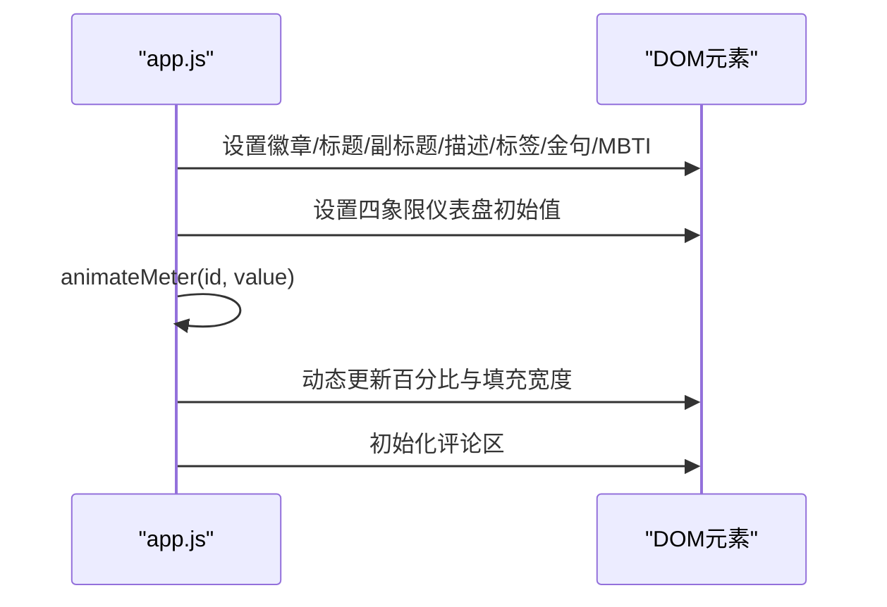

**图表来源**
- [SoulLab/app.js:353-424](file://SoulLab/app.js#L353-L424)
- [SoulLab/index.html:142-238](file://SoulLab/index.html#L142-L238)

**章节来源**
- [SoulLab/app.js:353-424](file://SoulLab/app.js#L353-L424)
- [SoulLab/index.html:142-238](file://SoulLab/index.html#L142-L238)

### 类型匹配与个性化报告
- 类型定义：results.js 中定义12种人格的名称、表情、图像、副标题、四象限、描述、标签、金句、MBTI说明
- 匹配逻辑：根据最高分人格在 personalities 中查找并渲染
- 报告生成：结果页包含标签云、MBTI说明、金句，便于二次解读与分享

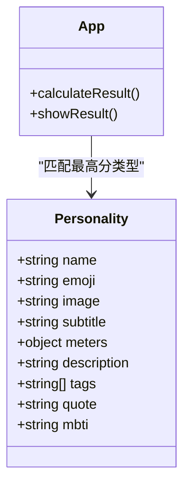

**图表来源**
- [SoulLab/results.js:6-139](file://SoulLab/results.js#L6-L139)
- [SoulLab/app.js:334-405](file://SoulLab/app.js#L334-L405)

**章节来源**
- [SoulLab/results.js:6-139](file://SoulLab/results.js#L6-L139)
- [SoulLab/app.js:334-405](file://SoulLab/app.js#L334-L405)

### 仪表盘展示与数值分析
- 仪表盘由四个计量条组成，分别对应面具厚度、灵魂清醒度、摆烂指数、内心戏浓度
- 动画计数：从0到目标值，步进与定时器控制，视觉上形成“计数动画”
- 数值解读：结合类型描述与MBTI说明，帮助用户理解自身倾向

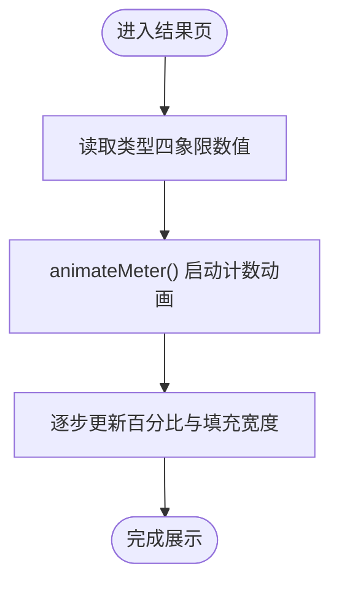

**图表来源**
- [SoulLab/app.js:407-424](file://SoulLab/app.js#L407-L424)

**章节来源**
- [SoulLab/app.js:407-424](file://SoulLab/app.js#L407-L424)

### 趋势预测与结果解读
- 本项目未实现时间序列趋势预测功能；当前为一次性结果展示
- 结果解读依赖类型描述与MBTI说明，辅以金句与标签云，帮助用户进行自我反思

**章节来源**
- [SoulLab/results.js:6-139](file://SoulLab/results.js#L6-L139)

### 结果数据存储与历史记录
- 参与人数统计：Supabase 表 result_views，按 page_type=soullab 计数
- 降级策略：若 result_views 查询失败，则尝试 comments 表按 page_type 计数
- 历史记录：当前未实现个人测试历史记录存储；未来可扩展 profiles 或 results 表

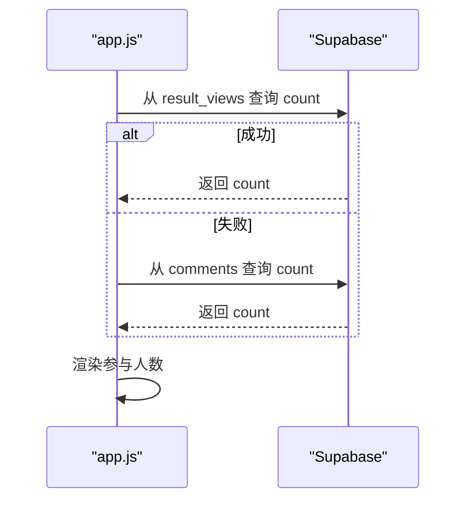

**图表来源**
- [SoulLab/app.js:33-74](file://SoulLab/app.js#L33-L74)

**章节来源**
- [SoulLab/app.js:33-74](file://SoulLab/app.js#L33-L74)

### 分享功能与导出机制
- 分享海报：使用 html2canvas 对结果页进行截图，生成 PNG 并弹出蒙层展示
- 截图优化：预加载角色图、替换为 dataURL、离屏容器、固定宽度与缩放
- 导出：提示长按保存，失败时提示重试或截图保存

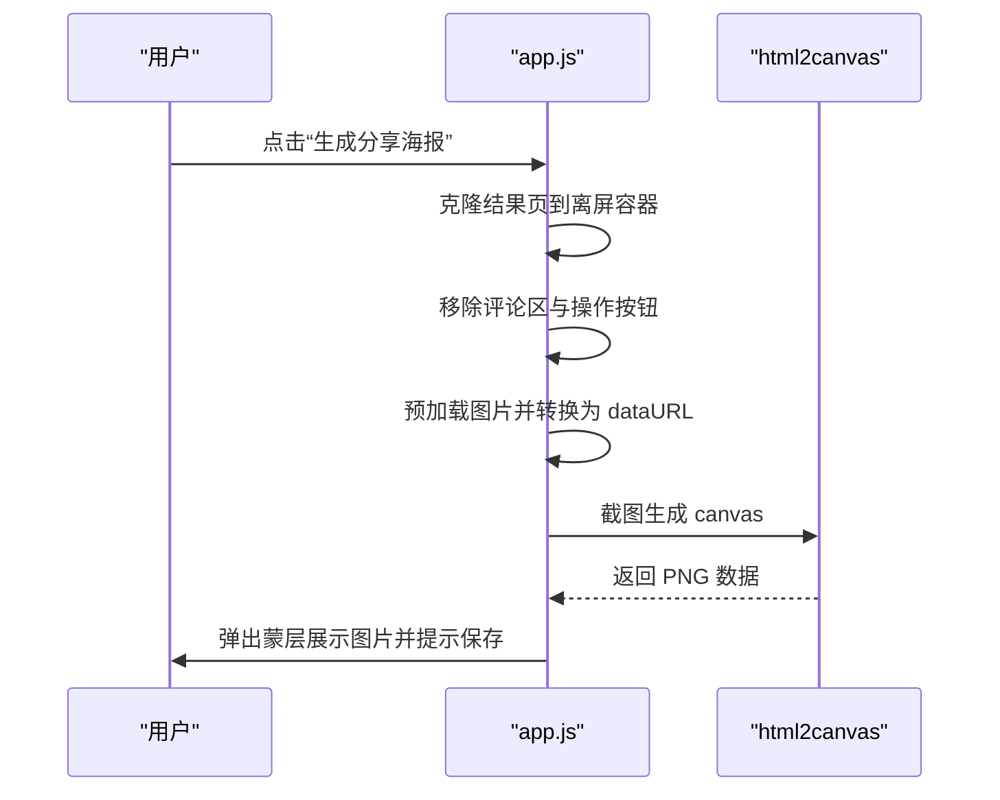

**图表来源**
- [SoulLab/app.js:433-546](file://SoulLab/app.js#L433-L546)

**章节来源**
- [SoulLab/app.js:433-546](file://SoulLab/app.js#L433-L546)

### 评论区与社交互动
- 评论加载：按 page_type 排序加载，支持嵌套回复与层级控制
- 点赞：基于 comment_likes 表，支持去重与权限检测
- 图片附件：支持评论图片上传与预览
- @提及高亮：正则匹配并高亮用户名

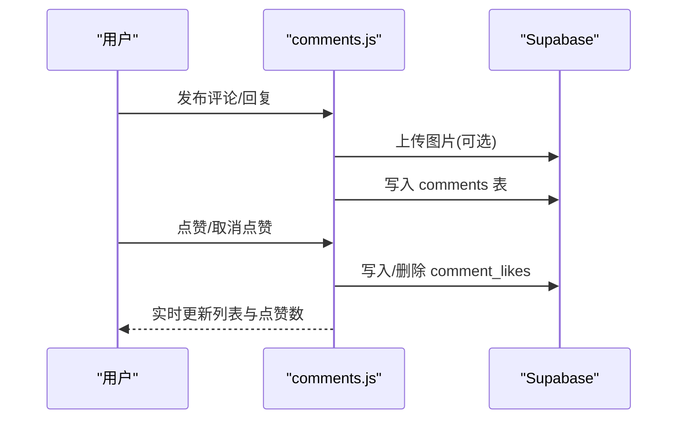

**图表来源**
- [shared/comments.js:511-643](file://shared/comments.js#L511-L643)
- [shared/comments.js:645-688](file://shared/comments.js#L645-L688)

**章节来源**
- [shared/comments.js:1-769](file://shared/comments.js#L1-L769)

### 用户认证与隐私保护
- 认证流程：登录/注册、邮箱验证码、密码重置
- 头像管理：支持 Emoji 与图片头像，图片上传至 Supabase Storage
- 隐私策略：昵称与头像字段存储于 profiles 表，支持字段兼容与降级
- 安全措施：密码长度校验、超时控制、错误信息本地化

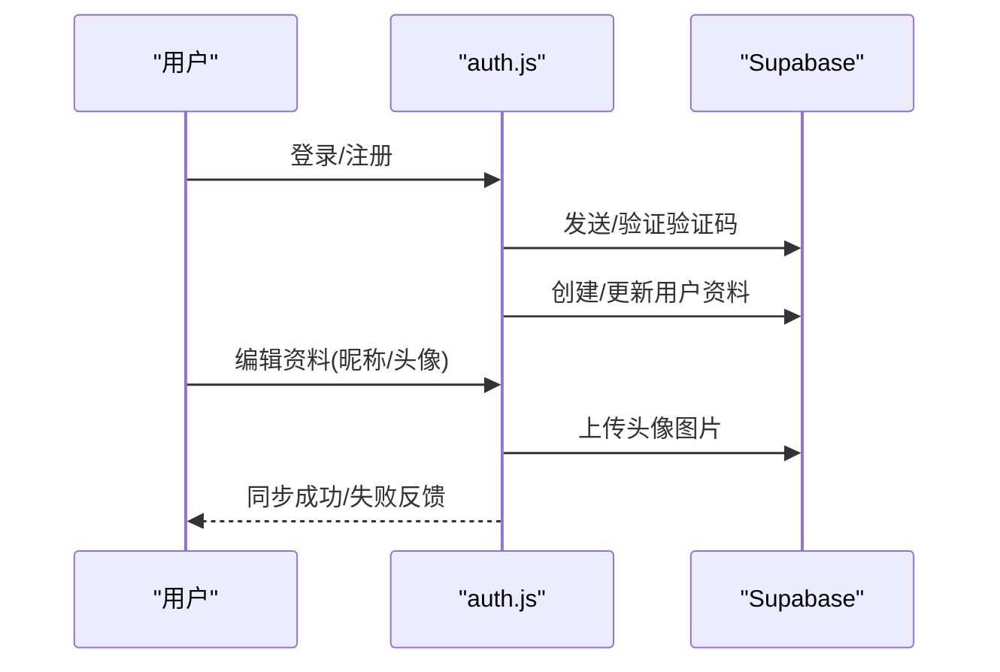

**图表来源**
- [shared/auth.js:522-799](file://shared/auth.js#L522-L799)
- [shared/supabase-config.js:1-26](file://shared/supabase-config.js#L1-L26)

**章节来源**
- [shared/auth.js:1-800](file://shared/auth.js#L1-L800)
- [shared/supabase-config.js:1-26](file://shared/supabase-config.js#L1-L26)

### 人格类型预览与导航
- 类型网格：懒加载图片、带入场动画
- 详情页：滚动观察器触发动画、哈希导航高亮、点击卡片高亮
- 交互：图片点击放大、返回测试

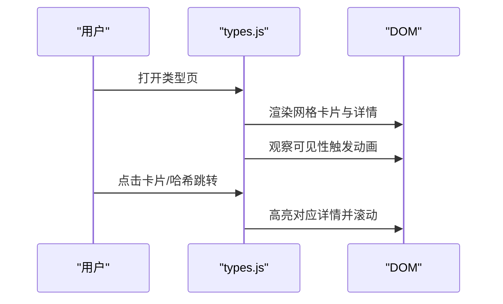

**图表来源**
- [SoulLab/types.js:71-231](file://SoulLab/types.js#L71-L231)
- [SoulLab/types.html:1-125](file://SoulLab/types.html#L1-L125)

**章节来源**
- [SoulLab/types.js:1-266](file://SoulLab/types.js#L1-L266)
- [SoulLab/types.html:1-125](file://SoulLab/types.html#L1-L125)

## 依赖分析
- 模块耦合
  - app.js 依赖 questions.js（题目）、results.js（类型）、shared/comments.js（评论）、shared/auth.js（认证）
  - types.js 依赖 results.js（类型）、shared/auth.js（认证）
  - index.html 与 types.html 作为入口，引入各自脚本与样式
- 外部依赖
  - Supabase SDK：认证、数据库、存储
  - html2canvas：截图生成海报
- 可能的循环依赖
  - 未发现直接循环依赖；模块职责清晰，均为单向依赖

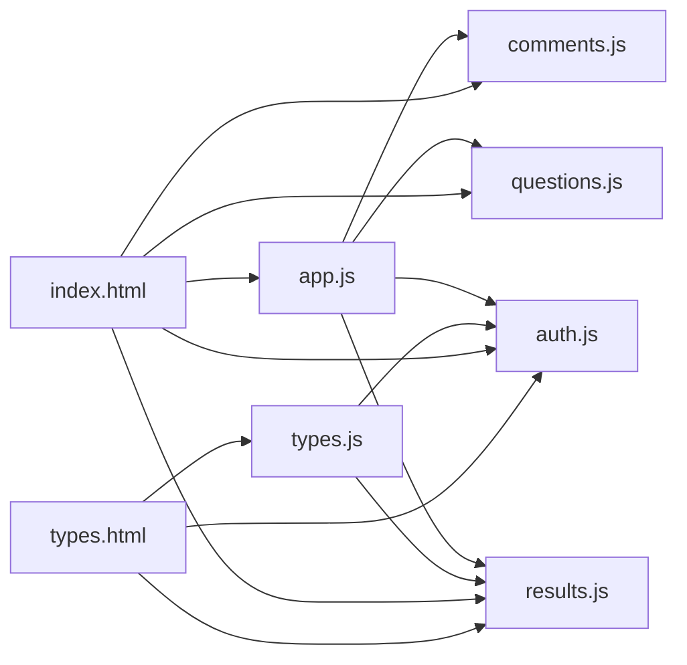

**图表来源**
- [SoulLab/app.js:1-613](file://SoulLab/app.js#L1-L613)
- [SoulLab/questions.js:1-352](file://SoulLab/questions.js#L1-L352)
- [SoulLab/results.js:1-140](file://SoulLab/results.js#L1-L140)
- [SoulLab/types.js:1-266](file://SoulLab/types.js#L1-L266)
- [SoulLab/index.html:1-271](file://SoulLab/index.html#L1-L271)
- [SoulLab/types.html:1-125](file://SoulLab/types.html#L1-L125)

**章节来源**
- [SoulLab/app.js:1-613](file://SoulLab/app.js#L1-L613)
- [SoulLab/types.js:1-266](file://SoulLab/types.js#L1-L266)

## 性能考虑
- 动画与渲染
  - 使用 requestAnimationFrame 控制粒子与仪表盘动画，减少主线程阻塞
  - 结果页加载时延迟初始化评论，避免首屏阻塞
- 资源加载
  - 图片懒加载与缓存时间戳参数，避免重复请求
  - html2canvas 截图前预加载图片并转换为 dataURL，降低跨域污染风险
- 网络与超时
  - Supabase 请求统一超时控制，防止长时间等待
  - 评论与认证模块对常见错误进行降级与提示

**章节来源**
- [SoulLab/app.js:83-153](file://SoulLab/app.js#L83-L153)
- [SoulLab/app.js:407-424](file://SoulLab/app.js#L407-L424)
- [shared/auth.js:242-252](file://shared/auth.js#L242-L252)
- [shared/comments.js:544-643](file://shared/comments.js#L544-L643)

## 故障排除指南
- Supabase SDK 未加载
  - 现象：控制台报错，无法初始化客户端
  - 处理：检查 CDN 地址与网络连通性
  - 参考：[shared/supabase-config.js:12-17](file://shared/supabase-config.js#L12-L17)
- 评论功能未启用
  - 现象：评论区显示“未完成升级”或“未启用”
  - 处理：执行数据库升级脚本，确保表与权限配置完成
  - 参考：[shared/comments.js:335-344](file://shared/comments.js#L335-L344)
- 点赞功能失败
  - 现象：点赞按钮无响应或提示权限不足
  - 处理：确认数据库权限与升级脚本执行情况
  - 参考：[shared/comments.js:680-687](file://shared/comments.js#L680-L687)
- 海报生成失败
  - 现象：截图失败或跨域污染
  - 处理：降低 scale、预加载图片、使用 dataURL 替换跨域资源
  - 参考：[SoulLab/app.js:518-527](file://SoulLab/app.js#L518-L527)
- 参与人数统计异常
  - 现象：人数显示为“暂不可用”
  - 处理：检查 result_views 表是否存在，或降级到 comments 表
  - 参考：[SoulLab/app.js:45-54](file://SoulLab/app.js#L45-L54)

**章节来源**
- [shared/supabase-config.js:12-17](file://shared/supabase-config.js#L12-L17)
- [shared/comments.js:335-344](file://shared/comments.js#L335-L344)
- [shared/comments.js:680-687](file://shared/comments.js#L680-L687)
- [SoulLab/app.js:518-527](file://SoulLab/app.js#L518-L527)
- [SoulLab/app.js:45-54](file://SoulLab/app.js#L45-L54)

## 结论
SoulLab结果分析与展示系统以简洁的前端架构与 Supabase 服务实现了完整的测试体验闭环：从题目作答、评分计算、类型匹配到结果展示、评论互动与分享导出。系统在交互体验、动画表现与数据安全方面具备良好设计，同时为后续扩展（如历史记录、趋势分析、模板定制）预留了清晰的接口与模块边界。

## 附录
- 结果模板定制
  - 在 results.js 中新增或修改 personality 条目，即可扩展类型模板
  - 修改 style.css 中主题变量可快速调整视觉风格
- 报告格式化
  - 结果页 HTML 结构清晰，便于二次开发与格式化输出
- 分享链接生成
  - 当前通过海报截图分享；未来可扩展短链服务与社交媒体分享接口
- 隐私保护策略
  - 用户资料与头像存储于 Supabase，遵循最小化原则；错误信息本地化，避免泄露敏感信息

**章节来源**
- [SoulLab/results.js:6-139](file://SoulLab/results.js#L6-L139)
- [SoulLab/style.css:1-200](file://SoulLab/style.css#L1-L200)
- [shared/auth.js:115-147](file://shared/auth.js#L115-L147)