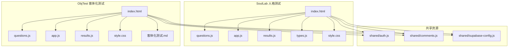
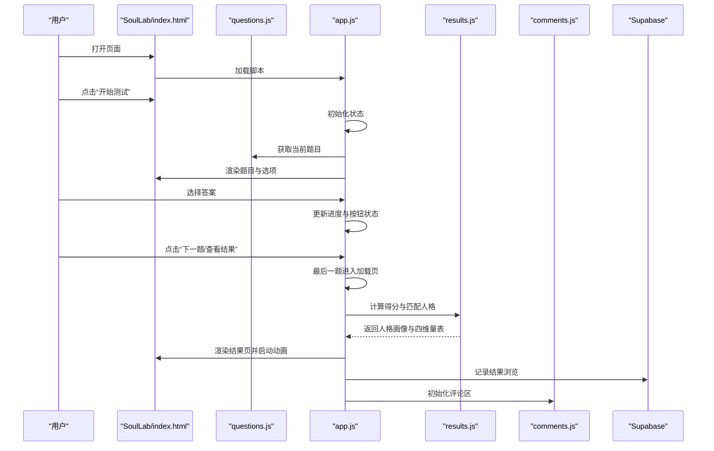
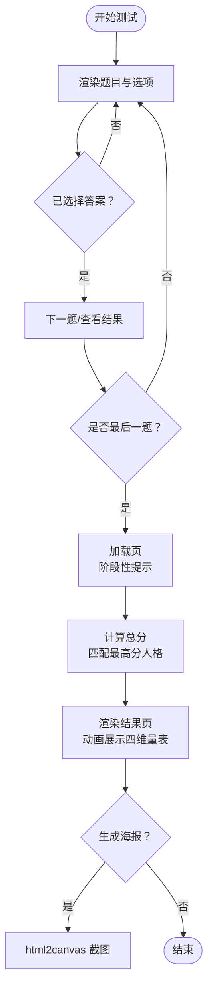
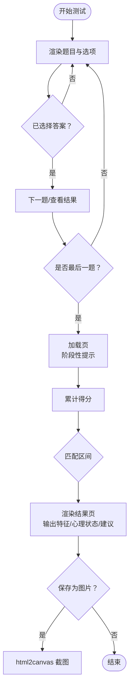
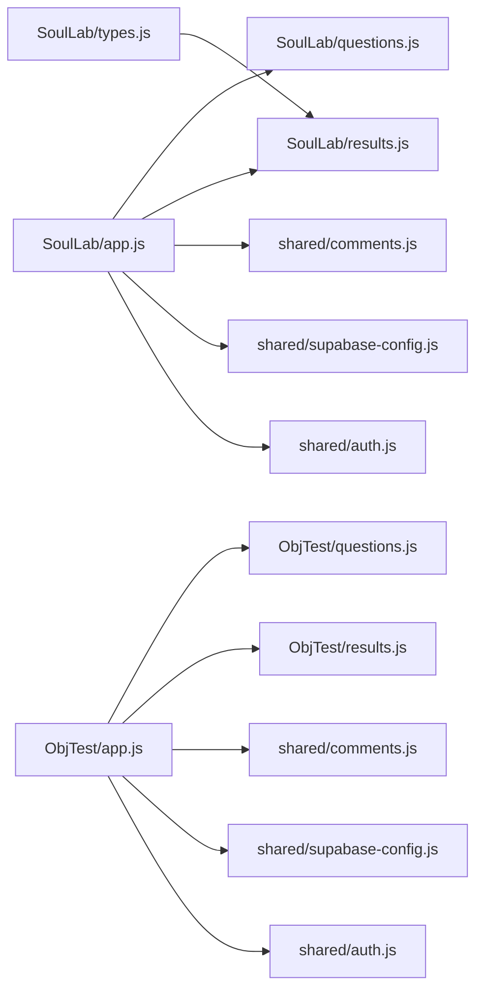

# 测试模块

<cite>
**本文引用的文件**
- [SoulLab/index.html](file://SoulLab/index.html)
- [SoulLab/questions.js](file://SoulLab/questions.js)
- [SoulLab/app.js](file://SoulLab/app.js)
- [SoulLab/results.js](file://SoulLab/results.js)
- [SoulLab/types.js](file://SoulLab/types.js)
- [SoulLab/style.css](file://SoulLab/style.css)
- [ObjTest/index.html](file://ObjTest/index.html)
- [ObjTest/questions.js](file://ObjTest/questions.js)
- [ObjTest/app.js](file://ObjTest/app.js)
- [ObjTest/results.js](file://ObjTest/results.js)
- [ObjTest/style.css](file://ObjTest/style.css)
- [ObjTest/客体化测试.md](file://ObjTest/客体化测试.md)
- [shared/auth.js](file://shared/auth.js)
- [shared/comments.js](file://shared/comments.js)
- [shared/supabase-config.js](file://shared/supabase-config.js)
</cite>

## 目录
1. [简介](#简介)
2. [项目结构](#项目结构)
3. [核心组件](#核心组件)
4. [架构总览](#架构总览)
5. [详细组件分析](#详细组件分析)
6. [依赖关系分析](#依赖关系分析)
7. [性能考量](#性能考量)
8. [故障排查指南](#故障排查指南)
9. [结论](#结论)
10. [附录](#附录)

## 简介
本文件面向测试模块的开发者与维护者，系统化梳理“SoulLab 人格测试”与“ObjTest 客体化测试”的实现机制与扩展方法。内容涵盖：
- 33道深度心理问题的设计原理与评分映射
- 12种人格类型的评分算法与结果分析逻辑
- 40道核心客体化问题的量化评分系统、分级解读与建议
- 测试流程、进度跟踪、结果导出与数据可视化方案
- 扩展指南与新测试类型开发教程

## 项目结构
测试模块由两个独立的前端应用组成：
- SoulLab 人格测试：融合灵性、MBTI 与 SB/TI 的 33题人格探索，输出12种人格画像与四维量表。
- ObjTest 客体化测试：40题自评问卷，量化自我客体化程度并给出分级建议。

图表来源
- [SoulLab/index.html:1-271](file://SoulLab/index.html#L1-L271)
- [ObjTest/index.html:1-170](file://ObjTest/index.html#L1-L170)

章节来源
- [SoulLab/index.html:1-271](file://SoulLab/index.html#L1-L271)
- [ObjTest/index.html:1-170](file://ObjTest/index.html#L1-L170)

## 核心组件
- 问题数据层：SoulLab 的 questions.js 与 ObjTest 的 questions.js 分别承载题目与选项的结构化数据。
- 应用逻辑层：app.js 负责页面导航、答题流程、评分计算、结果展示与导出。
- 结果定义层：SoulLab 的 results.js 定义12种人格画像与四维量表；ObjTest 的 results.js 定义五级评分区间与建议。
- 展示与交互：index.html 与 types.js 提供页面结构、动画与交互；style.css 提供视觉风格。
- 数据追踪：通过 Supabase 计数表记录结果浏览次数，用于统计与展示。

章节来源
- [SoulLab/questions.js:1-352](file://SoulLab/questions.js#L1-L352)
- [SoulLab/app.js:1-613](file://SoulLab/app.js#L1-L613)
- [SoulLab/results.js:1-140](file://SoulLab/results.js#L1-L140)
- [SoulLab/types.js:1-266](file://SoulLab/types.js#L1-L266)
- [ObjTest/questions.js:1-403](file://ObjTest/questions.js#L1-L403)
- [ObjTest/app.js:1-327](file://ObjTest/app.js#L1-L327)
- [ObjTest/results.js:1-55](file://ObjTest/results.js#L1-L55)

## 架构总览
整体采用“静态页面 + 模块化脚本”的前端架构，通过 DOM 操作与本地状态管理实现测试流程；结果页通过动态注入与动画增强用户体验；评论区与登录状态通过共享模块集成。

图表来源
- [SoulLab/index.html:253-255](file://SoulLab/index.html#L253-L255)
- [SoulLab/app.js:182-405](file://SoulLab/app.js#L182-L405)
- [SoulLab/results.js:1-140](file://SoulLab/results.js#L1-L140)
- [shared/comments.js](file://shared/comments.js)
- [shared/supabase-config.js](file://shared/supabase-config.js)

## 详细组件分析

### SoulLab 人格测试
- 设计理念与题目设计
  - 33道题围绕“面具/觉醒/摆烂/内心戏”等主题，覆盖社交、认知、存在与关系维度。
  - 每题选项映射到12种人格的加权得分，形成多维评分矩阵。
- 评分与匹配
  - 计算阶段对每题已选项的 scores 字典进行累加，得到各人格总分，取最高分作为结果。
  - 结果页展示人格名称、副标题、描述、标签、名言、MBTI/原型关联与四维量表。
- 进度与交互
  - 页面包含进度条与题号显示；支持键盘导航（A/B/C/D）与方向键。
  - 加载页提供阶段性提示文案，营造沉浸式体验。
- 可视化与导出
  - 四维量表采用渐进动画展示数值；结果页支持生成海报（html2canvas）。
  - 图片模态框支持放大查看。
- 数据追踪
  - 通过 Supabase 计数表记录“soullab”页面结果浏览次数，并在结果页触发记录。

图表来源
- [SoulLab/app.js:278-405](file://SoulLab/app.js#L278-L405)
- [SoulLab/questions.js:20-352](file://SoulLab/questions.js#L20-L352)
- [SoulLab/results.js:6-139](file://SoulLab/results.js#L6-L139)

章节来源
- [SoulLab/questions.js:1-352](file://SoulLab/questions.js#L1-L352)
- [SoulLab/app.js:1-613](file://SoulLab/app.js#L1-L613)
- [SoulLab/results.js:1-140](file://SoulLab/results.js#L1-L140)
- [SoulLab/types.js:1-266](file://SoulLab/types.js#L1-L266)
- [SoulLab/style.css:1-200](file://SoulLab/style.css#L1-L200)

### ObjTest 客体化测试
- 评分系统
  - 40题，每题4个选项，分别对应0~3分，总分范围0-120。
  - 五级区间：健康（0-24）、轻度（25-48）、中度（49-72）、重度（73-96）、极重度（97-120）。
- 结果解读与建议
  - 每个区间包含“特征”“心理状态”“建议”，颜色区分风险等级。
- 进度与交互
  - 页面包含进度文本与进度条；支持键盘导航（数字键1-4）与方向键。
  - 加载页提供阶段性提示文案。
- 可视化与导出
  - 结果页展示总分、标题、描述、心理状态与建议；支持保存为图片（html2canvas）。
- 数据追踪
  - 通过 Supabase 计数表记录“objtest”页面结果浏览次数。

图表来源
- [ObjTest/app.js:171-242](file://ObjTest/app.js#L171-L242)
- [ObjTest/questions.js:1-403](file://ObjTest/questions.js#L1-L403)
- [ObjTest/results.js:8-55](file://ObjTest/results.js#L8-L55)

章节来源
- [ObjTest/questions.js:1-403](file://ObjTest/questions.js#L1-L403)
- [ObjTest/app.js:1-327](file://ObjTest/app.js#L1-L327)
- [ObjTest/results.js:1-55](file://ObjTest/results.js#L1-L55)
- [ObjTest/style.css:1-200](file://ObjTest/style.css#L1-L200)
- [ObjTest/客体化测试.md:1-521](file://ObjTest/客体化测试.md#L1-L521)

### 结果页与评论区集成
- 结果页通过共享模块初始化评论区，支持用户互动与讨论。
- 登录状态通过共享模块注入，便于统一认证与权限控制。

章节来源
- [SoulLab/index.html:251-252](file://SoulLab/index.html#L251-L252)
- [ObjTest/index.html:160-163](file://ObjTest/index.html#L160-L163)
- [shared/comments.js](file://shared/comments.js)
- [shared/auth.js](file://shared/auth.js)

## 依赖关系分析
- 模块耦合
  - app.js 与 questions.js 强耦合（读取题库），与 results.js 弱耦合（仅在结果页使用）。
  - types.js 依赖 results.js 的人格定义，负责预览页渲染与滚动高亮。
  - ObjTest 与 SoulLab 在页面结构与共享模块上保持一致的依赖关系。
- 外部依赖
  - html2canvas 用于截图导出（动态加载）。
  - Supabase 用于计数与结果浏览统计。
  - 百度统计脚本（SoulLab）用于流量统计。

图表来源
- [SoulLab/app.js:1-18](file://SoulLab/app.js#L1-L18)
- [ObjTest/app.js:10-15](file://ObjTest/app.js#L10-L15)
- [SoulLab/types.js:71-150](file://SoulLab/types.js#L71-L150)
- [shared/comments.js](file://shared/comments.js)
- [shared/supabase-config.js](file://shared/supabase-config.js)
- [shared/auth.js](file://shared/auth.js)

章节来源
- [SoulLab/app.js:1-18](file://SoulLab/app.js#L1-L18)
- [ObjTest/app.js:10-15](file://ObjTest/app.js#L10-L15)
- [SoulLab/types.js:71-150](file://SoulLab/types.js#L71-L150)

## 性能考量
- DOM 操作与动画
  - 使用 CSS 动画与渐变减少重绘；结果页的量表动画采用定时器逐步更新数值，避免一次性渲染大量元素。
- 资源加载
  - html2canvas 动态加载，仅在需要时引入，降低首屏负担。
- 数据处理
  - 评分计算为线性遍历，复杂度 O(N)，N 为题数；结果匹配为一次遍历，复杂度 O(M)，M 为人格数。
- 可访问性
  - 键盘导航支持（字母键与方向键），提升无障碍体验。

## 故障排查指南
- 结果页无法显示或截图失败
  - 检查 html2canvas 是否正确加载；若跨域图片导致污染，需预加载并转换为 dataURL。
  - 若截图失败，尝试降低缩放比例或重试。
- 进度条不更新
  - 确认当前题号与总题数正确传入；检查按钮禁用状态逻辑。
- 结果浏览计数异常
  - 检查 Supabase 配置与网络请求；确认计数表存在且字段命名一致。
- 评论区不显示
  - 确认共享模块已加载；检查页面类型参数与评论区初始化函数是否存在。

章节来源
- [SoulLab/app.js:436-546](file://SoulLab/app.js#L436-L546)
- [ObjTest/app.js:248-303](file://ObjTest/app.js#L248-L303)
- [SoulLab/app.js:33-74](file://SoulLab/app.js#L33-L74)
- [ObjTest/app.js:23-70](file://ObjTest/app.js#L23-L70)

## 结论
测试模块通过清晰的数据结构、简洁的前端逻辑与丰富的可视化，实现了高质量的心理测评体验。SoulLab 与 ObjTest 在设计风格、交互流程与数据追踪方面保持一致，便于扩展与维护。建议在后续迭代中：
- 引入本地缓存与离线支持，提升可用性。
- 增加结果导出格式（PDF/JSON）与分享模板。
- 优化移动端交互与无障碍体验。
- 扩展更多测试类型时，遵循统一的“题库 + 评分 + 结果定义 + 导出”范式。

## 附录

### 33道深度心理问题设计原理
- 主题维度
  - 社交面具与自我认同（面具厚度）
  - 觉醒与解构（灵魂清醒度）
  - 摆烂与随缘（摆烂指数）
  - 内心戏与情感表达（内心戏浓度）
- 评分映射
  - 每题选项对12种人格赋予不同权重，形成多维评分矩阵；最终取最高分作为结果。
- 代表性题干与选项分布
  - 参见题库文件中的具体题目与选项映射。

章节来源
- [SoulLab/questions.js:20-352](file://SoulLab/questions.js#L20-L352)
- [SoulLab/results.js:6-139](file://SoulLab/results.js#L6-L139)

### 12种人格类型的评分算法与结果分析
- 评分算法
  - 对每题已选项的 scores 字典进行累加，得到各人格总分，取最高分作为最终结果。
- 结果分析
  - 结果页展示名称、副标题、描述、标签、名言、MBTI/原型关联与四维量表。
  - 四维量表采用渐进动画展示数值，增强可视化效果。

章节来源
- [SoulLab/app.js:334-405](file://SoulLab/app.js#L334-L405)
- [SoulLab/results.js:6-139](file://SoulLab/results.js#L6-L139)

### 40道核心客体化问题的量化评分系统
- 计分规则
  - 每题0~3分，总分0-120。
- 分级标准
  - 健康（0-24）、轻度（25-48）、中度（49-72）、重度（73-96）、极重度（97-120）。
- 心理状态与建议
  - 每个区间包含“特征”“心理状态”“建议”，颜色区分风险等级。

章节来源
- [ObjTest/questions.js:1-403](file://ObjTest/questions.js#L1-L403)
- [ObjTest/results.js:8-55](file://ObjTest/results.js#L8-L55)
- [ObjTest/客体化测试.md:431-521](file://ObjTest/客体化测试.md#L431-L521)

### 详细分析报告生成与结果导出
- 生成流程
  - 结果页通过 html2canvas 截图，支持保存为 PNG；图片生成后弹出蒙层提示保存。
- 注意事项
  - 跨域图片需预加载并转换为 dataURL；失败时自动降级重试。
- 评论区与作者信息
  - 结果页集成评论区与作者信息，便于用户互动与溯源。

章节来源
- [SoulLab/app.js:446-546](file://SoulLab/app.js#L446-L546)
- [ObjTest/app.js:259-303](file://ObjTest/app.js#L259-L303)
- [SoulLab/index.html:236-238](file://SoulLab/index.html#L236-L238)
- [ObjTest/index.html:156-158](file://ObjTest/index.html#L156-L158)

### 测试逻辑实现与进度跟踪机制
- 测试逻辑
  - app.js 负责页面切换、答题状态管理、进度更新与结果计算。
- 进度跟踪
  - 通过 Supabase 计数表记录“soullab/objtest”页面结果浏览次数，结果页触发插入。

章节来源
- [SoulLab/app.js:33-74](file://SoulLab/app.js#L33-L74)
- [ObjTest/app.js:23-70](file://ObjTest/app.js#L23-L70)

### 数据可视化方案
- 量表动画
  - 结果页四维量表采用定时器逐步更新数值，配合 CSS 动画增强体验。
- 预览页
  - types.js 通过 IntersectionObserver 实现滚动高亮与量表动画。

章节来源
- [SoulLab/app.js:407-424](file://SoulLab/app.js#L407-L424)
- [SoulLab/types.js:155-177](file://SoulLab/types.js#L155-L177)

### 扩展指南与新测试类型开发教程
- 新增测试类型步骤
  - 准备题库：questions.js，包含 id、text、options（每题0~n个选项，含分数或映射）。
  - 编写逻辑：app.js，实现 startTest、renderQuestion、nextQuestion、prevQuestion、calculateScore/showResult/saveResult 等。
  - 定义结果：results.js，包含分级区间与建议（ObjTest）或人格画像与量表（SoulLab）。
  - 页面与样式：index.html 与 style.css，遵循现有结构与命名规范。
  - 集成评论与登录：引入 shared/comments.js 与 shared/auth.js。
  - 数据追踪：在结果页调用 trackResultView，记录浏览次数。
- 评分策略建议
  - 量化评分：每题固定分值（0~k），总分范围明确。
  - 多维映射：SoulLab 场景下，每题对多个人格赋权，最终取最高分。
  - 分级解读：提供清晰的区间定义与建议，颜色与文案强化风险提示。
- 可视化与导出
  - 优先采用 html2canvas 截图；注意跨域图片处理。
  - 保持统一的交互与动画风格，提升一致性。

章节来源
- [SoulLab/questions.js:20-352](file://SoulLab/questions.js#L20-L352)
- [SoulLab/app.js:182-405](file://SoulLab/app.js#L182-L405)
- [SoulLab/results.js:6-139](file://SoulLab/results.js#L6-L139)
- [ObjTest/questions.js:1-403](file://ObjTest/questions.js#L1-L403)
- [ObjTest/app.js:86-242](file://ObjTest/app.js#L86-L242)
- [ObjTest/results.js:8-55](file://ObjTest/results.js#L8-L55)
- [shared/comments.js](file://shared/comments.js)
- [shared/auth.js](file://shared/auth.js)