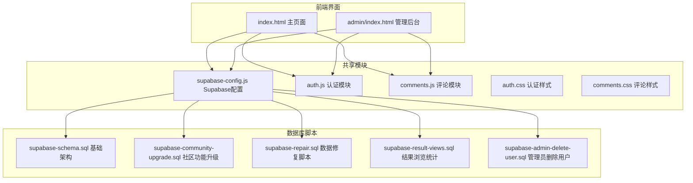
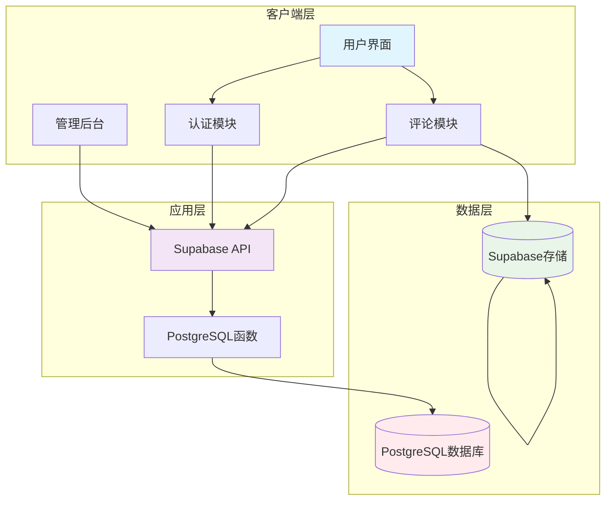
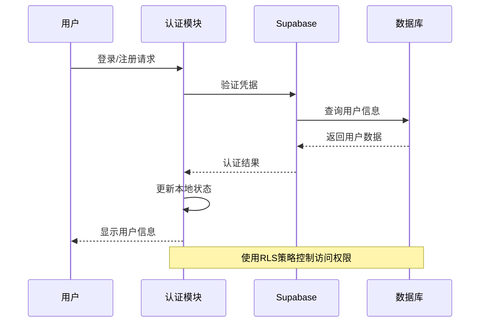
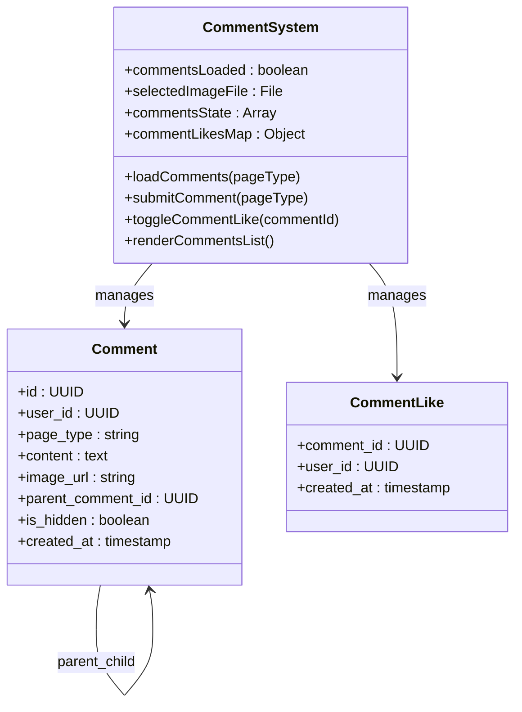
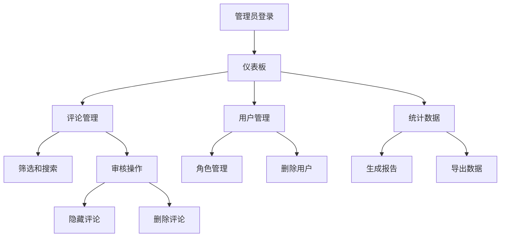
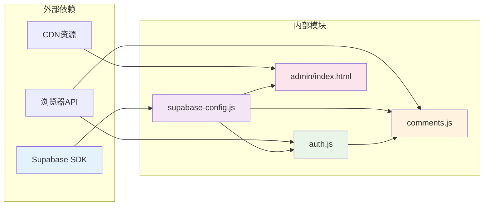

# 社区系统

<cite>
**本文档引用的文件**
- [shared/comments.js](file://shared/comments.js)
- [shared/auth.js](file://shared/auth.js)
- [shared/supabase-config.js](file://shared/supabase-config.js)
- [shared/comments.css](file://shared/comments.css)
- [shared/auth.css](file://shared/auth.css)
- [supabase-schema.sql](file://supabase-schema.sql)
- [supabase-community-upgrade.sql](file://supabase-community-upgrade.sql)
- [supabase-repair.sql](file://supabase-repair.sql)
- [supabase-result-views.sql](file://supabase-result-views.sql)
- [supabase-admin-delete-user.sql](file://supabase-admin-delete-user.sql)
- [admin/index.html](file://admin/index.html)
- [index.html](file://index.html)
</cite>

## 目录
1. [简介](#简介)
2. [项目结构](#项目结构)
3. [核心组件](#核心组件)
4. [架构概览](#架构概览)
5. [详细组件分析](#详细组件分析)
6. [依赖关系分析](#依赖关系分析)
7. [性能考虑](#性能考虑)
8. [故障排除指南](#故障排除指南)
9. [结论](#结论)
10. [附录](#附录)

## 简介

这是一个基于 Supabase 构建的社区互动系统，主要面向"觉醒诗社"网站，提供完整的评论功能、图片上传管理和管理员审核机制。系统采用前后端分离架构，前端使用原生 JavaScript 和 HTML/CSS，后端基于 Supabase 的 PostgreSQL 数据库和存储服务。

该系统的核心特性包括：
- 实时评论展示和交互
- 图片上传和安全存储
- 管理员审核和内容治理
- 用户认证和头像管理
- 响应式设计和用户体验优化

## 项目结构

项目采用模块化组织方式，主要分为以下几部分：

**图表来源**
- [index.html:1-1171](file://index.html#L1-L1171)
- [admin/index.html:1-688](file://admin/index.html#L1-L688)
- [shared/supabase-config.js:1-26](file://shared/supabase-config.js#L1-L26)

**章节来源**
- [index.html:1-1171](file://index.html#L1-L1171)
- [admin/index.html:1-688](file://admin/index.html#L1-L688)
- [shared/supabase-config.js:1-26](file://shared/supabase-config.js#L1-L26)

## 核心组件

### 1. Supabase 配置模块
负责初始化和管理 Supabase 客户端连接，提供统一的数据访问接口。

### 2. 认证模块
实现用户登录、注册、头像管理和会话状态维护，支持多种头像类型（emoji、图片、URL）。

### 3. 评论模块
提供完整的评论功能，包括嵌套回复、图片上传、点赞系统和实时渲染。

### 4. 管理后台
为管理员提供评论审核、用户管理、数据统计等功能界面。

**章节来源**
- [shared/supabase-config.js:1-26](file://shared/supabase-config.js#L1-L26)
- [shared/auth.js:1-800](file://shared/auth.js#L1-L800)
- [shared/comments.js:1-769](file://shared/comments.js#L1-L769)
- [admin/index.html:1-688](file://admin/index.html#L1-L688)

## 架构概览

系统采用三层架构设计，确保功能模块的清晰分离和可维护性：

**图表来源**
- [shared/auth.js:419-800](file://shared/auth.js#L419-L800)
- [shared/comments.js:20-25](file://shared/comments.js#L20-L25)
- [admin/index.html:304-310](file://admin/index.html#L304-L310)

系统的关键特性包括：

1. **实时性**: 使用 Supabase 的实时订阅功能实现评论的即时更新
2. **安全性**: 通过 Row Level Security (RLS) 策略控制数据访问权限
3. **可扩展性**: 模块化设计便于功能扩展和维护
4. **响应式**: 支持移动端和桌面端的适配

## 详细组件分析

### 认证系统

认证系统提供了完整的用户身份验证和管理功能：

**图表来源**
- [shared/auth.js:567-677](file://shared/auth.js#L567-L677)
- [shared/auth.js:783-800](file://shared/auth.js#L783-L800)

#### 核心功能
- **用户认证**: 支持邮箱密码登录和验证码登录
- **头像管理**: 支持 emoji、图片和 URL 三种头像类型
- **会话管理**: 维护用户登录状态和配置信息
- **权限控制**: 基于角色的访问控制和数据隔离

**章节来源**
- [shared/auth.js:1-800](file://shared/auth.js#L1-L800)
- [shared/auth.css:1-462](file://shared/auth.css#L1-L462)

### 评论系统

评论系统是整个社区功能的核心，提供了丰富的交互体验：

**图表来源**
- [shared/comments.js:15-125](file://shared/comments.js#L15-L125)
- [shared/comments.js:441-497](file://shared/comments.js#L441-L497)

#### 功能特性
- **嵌套回复**: 支持最多3层的评论回复结构
- **图片上传**: 安全的图片存储和预览功能
- **实时渲染**: 乐观更新和即时反馈机制
- **@提及**: 自动识别和高亮用户提及

**章节来源**
- [shared/comments.js:1-769](file://shared/comments.js#L1-L769)
- [shared/comments.css:1-704](file://shared/comments.css#L1-L704)

### 管理后台

管理员后台提供了完整的社区治理工具：

**图表来源**
- [admin/index.html:274-581](file://admin/index.html#L274-L581)

#### 管理功能
- **评论审核**: 实时查看和管理所有评论
- **用户管理**: 查看用户信息和权限控制
- **数据统计**: 系统使用情况和社区活跃度统计
- **批量操作**: 支持快速审核和批量处理

**章节来源**
- [admin/index.html:1-688](file://admin/index.html#L1-L688)

## 依赖关系分析

系统各模块之间的依赖关系如下：

**图表来源**
- [shared/supabase-config.js:5-25](file://shared/supabase-config.js#L5-L25)
- [shared/auth.js:35-40](file://shared/auth.js#L35-L40)
- [shared/comments.js:20-25](file://shared/comments.js#L20-L25)

### 关键依赖点
1. **Supabase SDK**: 所有数据操作的基础依赖
2. **浏览器兼容性**: 依赖现代浏览器的 API 支持
3. **CDN 资源**: 外部库和字体资源的加载

**章节来源**
- [shared/supabase-config.js:1-26](file://shared/supabase-config.js#L1-L26)
- [shared/auth.js:35-40](file://shared/auth.js#L35-L40)
- [shared/comments.js:20-25](file://shared/comments.js#L20-L25)

## 性能考虑

### 数据加载优化
- **分页加载**: 评论列表采用分页策略，避免一次性加载大量数据
- **缓存机制**: 用户头像和评论状态在本地缓存，减少重复请求
- **懒加载**: 图片采用懒加载策略，提升页面加载速度

### 实时性能
- **乐观更新**: 评论提交采用乐观更新，立即显示用户反馈
- **增量渲染**: 只更新变化的部分，避免全量重绘
- **防抖处理**: 输入和搜索操作使用防抖，减少不必要的请求

### 存储优化
- **图片压缩**: 上传前进行图片大小限制和格式验证
- **CDN 加速**: 使用 Supabase 存储的 CDN 功能加速图片加载
- **缓存控制**: 合理设置缓存策略，平衡加载速度和内容新鲜度

## 故障排除指南

### 常见问题及解决方案

#### 1. 评论功能不可用
**症状**: 评论区域显示"功能未完成升级"
**原因**: 数据库缺少必要的表和策略
**解决方法**: 
1. 在 Supabase SQL Editor 中运行 `supabase-community-upgrade.sql`
2. 确认 `comments` 表和 `comment_likes` 表已创建
3. 验证 RLS 策略已正确配置

#### 2. 图片上传失败
**症状**: 上传图片时出现错误提示
**原因**: 存储桶权限或网络问题
**解决方法**:
1. 检查 `comment-images` 存储桶是否存在
2. 验证存储策略是否正确配置
3. 确认网络连接稳定

#### 3. 认证失败
**症状**: 登录或注册时出现错误
**原因**: Supabase 配置或用户状态问题
**解决方法**:
1. 检查 Supabase URL 和 API Key 配置
2. 确认用户邮箱已验证
3. 清除浏览器缓存后重试

#### 4. 管理后台无法登录
**症状**: 管理员登录失败
**原因**: 用户权限或数据库配置问题
**解决方法**:
1. 确认用户在 `profiles` 表中具有 `is_admin` 权限
2. 检查管理员元数据配置
3. 验证 `admin_delete_user` 函数存在且可执行

**章节来源**
- [shared/comments.js:47-65](file://shared/comments.js#L47-L65)
- [shared/auth.js:115-147](file://shared/auth.js#L115-L147)
- [admin/index.html:398-427](file://admin/index.html#L398-L427)

## 结论

该社区互动系统展现了现代 Web 应用的最佳实践，通过合理的架构设计和功能实现，为用户提供了一个完整、安全、高效的社区交流平台。

### 主要优势
1. **模块化设计**: 清晰的功能分离便于维护和扩展
2. **安全性保障**: 基于 Supabase 的安全模型和 RLS 策略
3. **用户体验**: 响应式设计和流畅的交互体验
4. **可扩展性**: 良好的架构为未来功能扩展奠定基础

### 技术亮点
- 实时评论系统和图片上传功能
- 完整的管理员治理工具
- 响应式设计和移动端优化
- 安全的用户认证和权限管理

该系统为类似社区平台的开发提供了优秀的参考模板，其模块化架构和安全设计原则值得在其他项目中借鉴。

## 附录

### 数据库架构说明

系统使用 PostgreSQL 作为主数据库，结合 Supabase 的各种服务提供完整的功能支持。

#### 核心表结构
- **profiles**: 用户个人信息表，包含昵称、头像等信息
- **comments**: 评论内容表，支持嵌套回复和图片附件
- **comment_likes**: 评论点赞关联表，记录用户点赞关系

#### 安全策略
- **Row Level Security**: 通过 RLS 策略控制数据访问权限
- **角色权限**: 基于角色的访问控制，区分普通用户和管理员
- **数据隔离**: 确保用户只能访问和修改自己的数据

### 开发和部署建议

#### 开发环境搭建
1. 确保 Node.js 和 npm 已安装
2. 在 Supabase 控制台创建项目
3. 部署数据库脚本到 Supabase
4. 配置环境变量和域名

#### 生产环境部署
1. 使用 HTTPS 提供安全连接
2. 配置 CDN 加速静态资源
3. 设置适当的缓存策略
4. 监控系统性能和错误日志

#### 维护和更新
1. 定期备份数据库和存储内容
2. 监控系统性能指标
3. 及时更新依赖包和安全补丁
4. 根据用户反馈持续改进功能