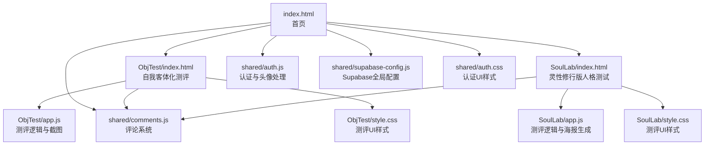
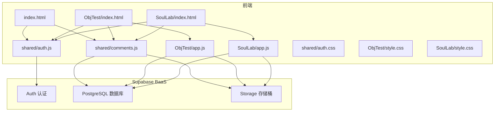
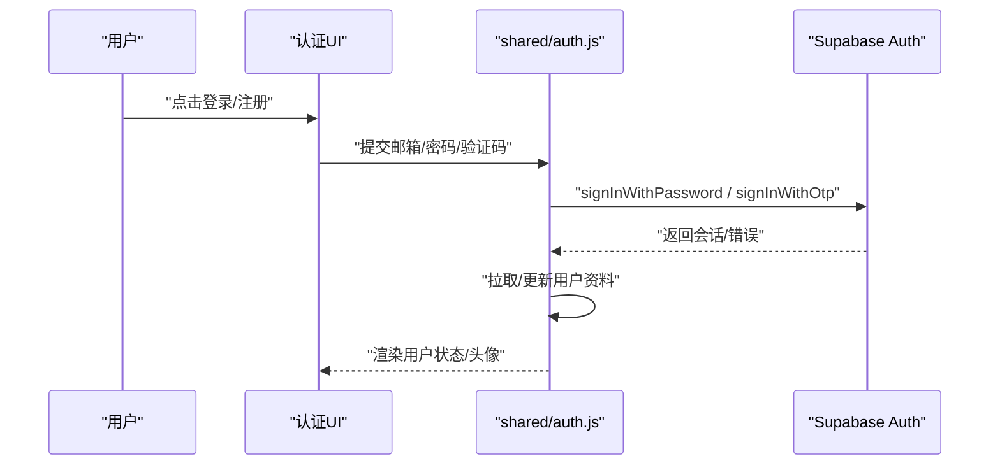
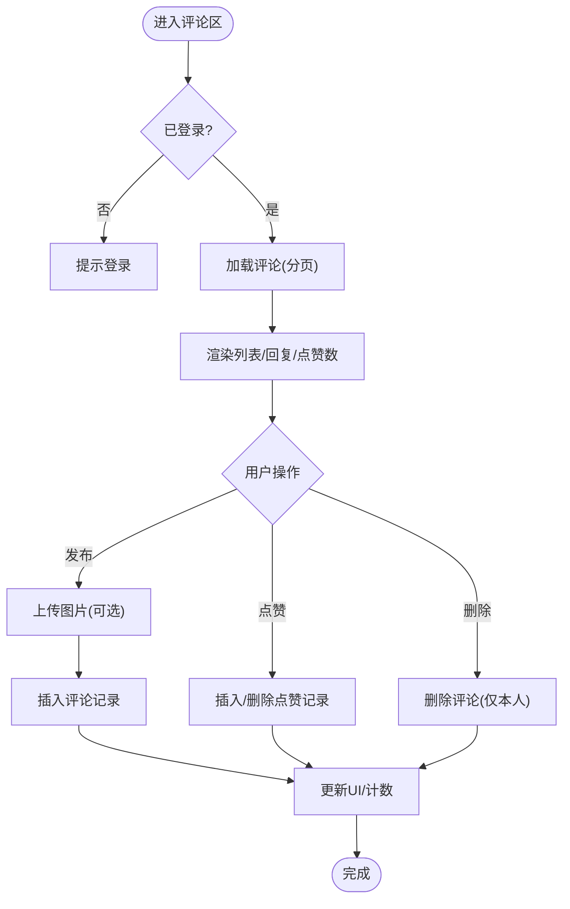
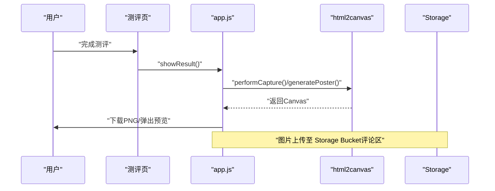
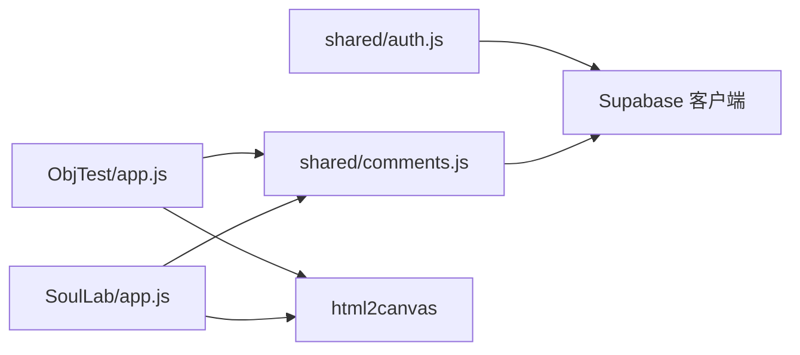

# 技术栈

<cite>
**本文引用的文件**
- [index.html](file://index.html)
- [ObjTest/index.html](file://ObjTest/index.html)
- [ObjTest/app.js](file://ObjTest/app.js)
- [SoulLab/index.html](file://SoulLab/index.html)
- [SoulLab/app.js](file://SoulLab/app.js)
- [shared/supabase-config.js](file://shared/supabase-config.js)
- [shared/auth.js](file://shared/auth.js)
- [shared/comments.js](file://shared/comments.js)
- [shared/auth.css](file://shared/auth.css)
- [ObjTest/style.css](file://ObjTest/style.css)
- [SoulLab/style.css](file://SoulLab/style.css)
- [supabase-schema.sql](file://supabase-schema.sql)
- [supabase-community-upgrade.sql](file://supabase-community-upgrade.sql)
</cite>

## 目录
1. [简介](#简介)
2. [项目结构](#项目结构)
3. [核心组件](#核心组件)
4. [架构总览](#架构总览)
5. [详细组件分析](#详细组件分析)
6. [依赖关系分析](#依赖关系分析)
7. [性能考量](#性能考量)
8. [故障排查指南](#故障排查指南)
9. [结论](#结论)
10. [附录](#附录)

## 简介
本技术栈文档面向“觉醒诗社”项目，系统梳理前端与后端即服务（BaaS）技术选型与实现要点。重点说明以下方面：
- Supabase 作为后端即服务（BaaS）平台的选择理由与技术优势
- 前端技术栈：HTML5、CSS3、JavaScript ES6+、Canvas API 等
- 第三方库与工具：html2canvas 截图、响应式设计框架等
- 版本兼容性与浏览器支持策略
- 技术选型决策依据与替代方案对比

## 项目结构
项目采用多页面单页应用（SPA）风格的静态网站组织方式，核心页面包括首页、两个测评应用页（自我客体化测评、灵性修行版人格测试），以及共享的认证与评论模块。

图表来源
- [index.html:1-800](file://index.html#L1-L800)
- [ObjTest/index.html:1-170](file://ObjTest/index.html#L1-L170)
- [SoulLab/index.html:1-271](file://SoulLab/index.html#L1-L271)
- [ObjTest/app.js:1-327](file://ObjTest/app.js#L1-L327)
- [SoulLab/app.js:1-613](file://SoulLab/app.js#L1-L613)
- [shared/auth.js:1-1470](file://shared/auth.js#L1-L1470)
- [shared/comments.js:1-769](file://shared/comments.js#L1-L769)
- [shared/supabase-config.js:1-26](file://shared/supabase-config.js#L1-L26)
- [shared/auth.css:1-462](file://shared/auth.css#L1-L462)
- [ObjTest/style.css:1-612](file://ObjTest/style.css#L1-L612)
- [SoulLab/style.css:1-800](file://SoulLab/style.css#L1-L800)

章节来源
- [index.html:1-800](file://index.html#L1-L800)
- [ObjTest/index.html:1-170](file://ObjTest/index.html#L1-L170)
- [SoulLab/index.html:1-271](file://SoulLab/index.html#L1-L271)

## 核心组件
- Supabase 全局配置与客户端初始化
- 认证模块（登录/注册/用户资料/头像）
- 评论模块（分页、点赞、回复、图片上传）
- 测评应用（自我客体化测评、灵性修行版人格测试）
- 截图与海报生成功能（html2canvas）

章节来源
- [shared/supabase-config.js:1-26](file://shared/supabase-config.js#L1-L26)
- [shared/auth.js:1-1470](file://shared/auth.js#L1-L1470)
- [shared/comments.js:1-769](file://shared/comments.js#L1-L769)
- [ObjTest/app.js:1-327](file://ObjTest/app.js#L1-L327)
- [SoulLab/app.js:1-613](file://SoulLab/app.js#L1-L613)

## 架构总览
整体架构采用“静态前端 + BaaS”的轻量后端模式：
- 前端通过 Supabase JS SDK 与后端交互（数据库、存储、认证）
- 评论与用户资料等数据通过 Supabase 数据表与策略管理
- 评论图片通过 Supabase Storage Bucket 提供公共访问
- 测评结果页支持截图与海报生成，依赖 html2canvas

图表来源
- [shared/auth.js:1-1470](file://shared/auth.js#L1-L1470)
- [shared/comments.js:1-769](file://shared/comments.js#L1-L769)
- [ObjTest/app.js:1-327](file://ObjTest/app.js#L1-L327)
- [SoulLab/app.js:1-613](file://SoulLab/app.js#L1-L613)
- [supabase-schema.sql:1-97](file://supabase-schema.sql#L1-L97)
- [supabase-community-upgrade.sql:1-77](file://supabase-community-upgrade.sql#L1-L77)

## 详细组件分析

### Supabase 作为后端即服务（BaaS）平台
- 选择理由
  - 一体化认证与数据库：内置 Auth 与 PostgreSQL，开箱即用
  - 行级安全策略（RLS）：通过策略控制读写权限，保障数据安全
  - 对象存储（Storage）：统一管理评论图片，支持公开访问与上传策略
  - 低运维成本：无需自建后端，专注前端与业务逻辑
- 技术优势
  - Supabase JS SDK：在浏览器端直接调用，简化前后端交互
  - 触发器与策略：自动化创建用户资料、权限控制精细化
  - 社区生态：丰富的文档与示例，便于扩展与维护

章节来源
- [shared/supabase-config.js:1-26](file://shared/supabase-config.js#L1-L26)
- [supabase-schema.sql:1-97](file://supabase-schema.sql#L1-L97)
- [supabase-community-upgrade.sql:1-77](file://supabase-community-upgrade.sql#L1-L77)

### 认证模块（登录/注册/用户资料/头像）
- 功能要点
  - 支持邮箱验证码登录/注册，带冷却与超时控制
  - 用户资料包含昵称与头像，头像支持 Emoji 与图片两种形态
  - 自动头像映射与本地草稿缓存，提升体验
- 与 Supabase 的集成
  - 使用 Supabase Auth 管理会话与用户元数据
  - 用户资料写入 profiles 表，RLS 控制读写
  - 头像图片上传至 Storage Bucket，生成公开链接

图表来源
- [shared/auth.js:522-677](file://shared/auth.js#L522-L677)
- [shared/supabase-config.js:1-26](file://shared/supabase-config.js#L1-L26)

章节来源
- [shared/auth.js:1-1470](file://shared/auth.js#L1-L1470)
- [shared/auth.css:1-462](file://shared/auth.css#L1-L462)

### 评论模块（分页、点赞、回复、图片上传）
- 功能要点
  - 评论列表分页加载，支持回复与点赞
  - 图片上传至 Storage Bucket，生成公开链接
  - 头像与昵称动态映射，支持权限降级与错误提示
- 与 Supabase 的集成
  - 评论表与点赞表通过策略控制读写
  - 通过 RLS 与策略实现“公开读取未隐藏评论”“本人删除评论”等规则
  - 升级脚本补充父评论字段与索引，完善嵌套回复能力

图表来源
- [shared/comments.js:309-345](file://shared/comments.js#L309-L345)
- [shared/comments.js:511-643](file://shared/comments.js#L511-L643)
- [shared/comments.js:645-688](file://shared/comments.js#L645-L688)
- [shared/comments.js:690-708](file://shared/comments.js#L690-L708)

章节来源
- [shared/comments.js:1-769](file://shared/comments.js#L1-L769)
- [supabase-community-upgrade.sql:1-77](file://supabase-community-upgrade.sql#L1-L77)

### 测评应用（自我客体化测评、灵性修行版人格测试）
- 功能要点
  - 问卷答题、进度条、自动下一题
  - 结果页展示评分与描述，支持截图保存与海报生成
- 截图与海报生成
  - 使用 html2canvas 将结果区域渲染为图片
  - 灵性测试页额外进行跨域图片预处理与离屏容器渲染，确保截图质量

图表来源
- [ObjTest/app.js:248-303](file://ObjTest/app.js#L248-L303)
- [SoulLab/app.js:433-546](file://SoulLab/app.js#L433-L546)

章节来源
- [ObjTest/app.js:1-327](file://ObjTest/app.js#L1-L327)
- [SoulLab/app.js:1-613](file://SoulLab/app.js#L1-L613)

### 前端技术栈与第三方库
- HTML5/CSS3/JavaScript ES6+
  - 使用语义化 HTML、现代 CSS（变量、动画、媒体查询）、ES6+ 语法与模块化组织
- Canvas API
  - 首页背景星空画布、灵性测试页粒子背景
- 第三方库
  - html2canvas：用于截图与海报生成
- 响应式设计
  - 通过媒体查询与弹性布局适配桌面与移动端

章节来源
- [index.html:1-800](file://index.html#L1-L800)
- [ObjTest/style.css:1-612](file://ObjTest/style.css#L1-L612)
- [SoulLab/style.css:1-800](file://SoulLab/style.css#L1-L800)
- [SoulLab/app.js:83-153](file://SoulLab/app.js#L83-L153)

### 版本兼容性与浏览器支持
- 浏览器支持
  - 项目广泛使用现代 Web API（Fetch、Promise、Canvas、CSS 变量、媒体查询），适合主流现代浏览器
  - 移动端通过媒体查询与触摸友好的交互优化体验
- 第三方资源
  - Supabase JS SDK 与 html2canvas 通过 CDN 引入，需确保网络可达与跨域策略正确

章节来源
- [ObjTest/index.html:160-166](file://ObjTest/index.html#L160-L166)
- [SoulLab/index.html:249-267](file://SoulLab/index.html#L249-L267)

### 技术选型决策依据与替代方案对比
- 为什么选择 Supabase
  - 快速迭代：无需自建后端，快速上线认证、数据库、存储
  - 安全可控：RLS 与策略实现细粒度权限控制
  - 生态完善：与前端框架解耦，易于扩展
- 替代方案
  - 自建 Node.js + Express + PostgreSQL：灵活性更高但开发与运维成本更高
  - Firebase：认证与 Firestore 方案成熟，但在对象存储与复杂策略方面不如 Supabase 灵活
  - Vercel/Cloudflare Workers：适合边缘计算场景，但本项目更偏向传统 Web 应用

## 依赖关系分析
- 组件耦合
  - 认证与评论模块通过 Supabase 客户端共享，降低重复依赖
  - 测评应用复用评论模块，形成统一的数据与 UI 体验
- 外部依赖
  - Supabase JS SDK、html2canvas、CDN 字体与图标

图表来源
- [shared/auth.js:1-1470](file://shared/auth.js#L1-L1470)
- [shared/comments.js:1-769](file://shared/comments.js#L1-L769)
- [ObjTest/app.js:1-327](file://ObjTest/app.js#L1-L327)
- [SoulLab/app.js:1-613](file://SoulLab/app.js#L1-L613)

章节来源
- [shared/auth.js:1-1470](file://shared/auth.js#L1-L1470)
- [shared/comments.js:1-769](file://shared/comments.js#L1-L769)
- [ObjTest/app.js:1-327](file://ObjTest/app.js#L1-L327)
- [SoulLab/app.js:1-613](file://SoulLab/app.js#L1-L613)

## 性能考量
- 资源加载
  - 使用 CDN 加速 Supabase SDK 与 html2canvas，减少首屏等待
  - 图片懒加载与预加载策略（如首页背景图）提升感知速度
- 渲染优化
  - Canvas 动画与 CSS 动画结合，合理使用 will-change 与 transform 以提升流畅度
  - 评论分页与懒加载，避免一次性渲染大量节点
- 存储与缓存
  - Storage Bucket 提供 CDN 缓存，缩短图片加载时间
  - 本地头像草稿与计数缓存，减少重复请求

## 故障排查指南
- Supabase SDK 未加载
  - 现象：控制台报错提示 SDK 未加载
  - 处理：确认 CDN 地址可用，检查网络与跨域设置
- 认证失败或会话异常
  - 现象：登录/注册失败、超时、验证码无效
  - 处理：检查网络超时配置、邮箱发送频率限制、验证码有效期
- 评论功能未启用
  - 现象：评论区提示“未完成升级”
  - 处理：执行社区升级 SQL 脚本，确保策略与索引创建完成
- 截图失败
  - 现象：html2canvas 报错或跨域污染
  - 处理：预加载图片并转换为 dataURL，调整 scale 与背景色参数

章节来源
- [shared/supabase-config.js:12-17](file://shared/supabase-config.js#L12-L17)
- [shared/auth.js:115-147](file://shared/auth.js#L115-L147)
- [shared/comments.js:333-344](file://shared/comments.js#L333-L344)
- [ObjTest/app.js:269-303](file://ObjTest/app.js#L269-L303)
- [SoulLab/app.js:480-527](file://SoulLab/app.js#L480-L527)

## 结论
本项目通过 Supabase 实现“零后端”架构，结合现代前端技术与第三方库，构建了具备认证、评论、截图与海报生成功能的完整体验。其优势在于快速交付、安全可控与低运维成本；同时在性能与兼容性方面具备良好表现。未来可在权限模型、图片压缩与缓存策略等方面持续优化。

## 附录
- Supabase 数据库与策略
  - 用户资料表、评论表、点赞表与存储桶策略
- 升级脚本
  - 评论嵌套、索引、唯一昵称与点赞策略

章节来源
- [supabase-schema.sql:1-97](file://supabase-schema.sql#L1-L97)
- [supabase-community-upgrade.sql:1-77](file://supabase-community-upgrade.sql#L1-L77)