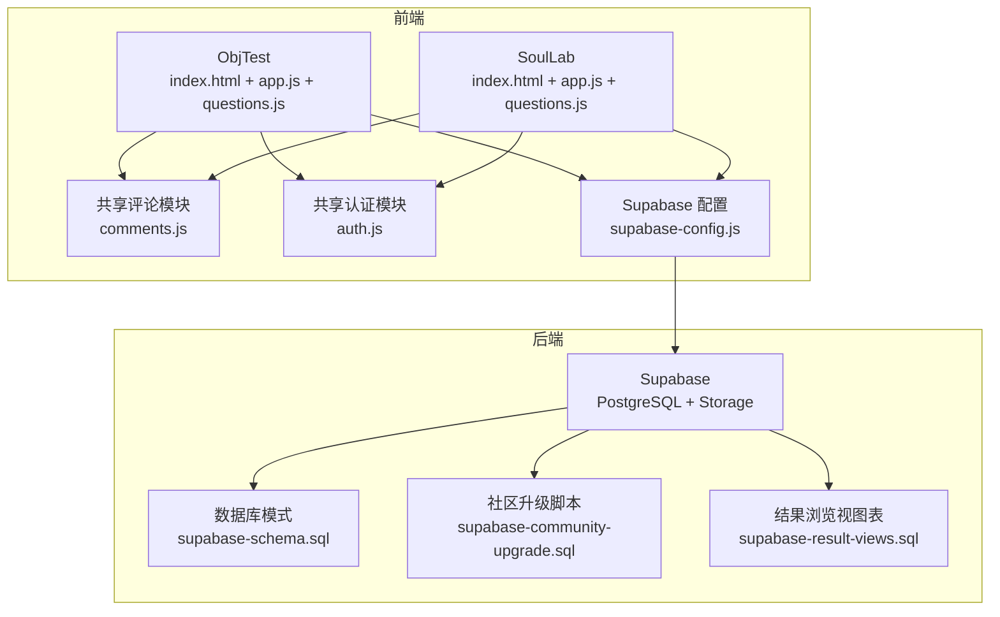
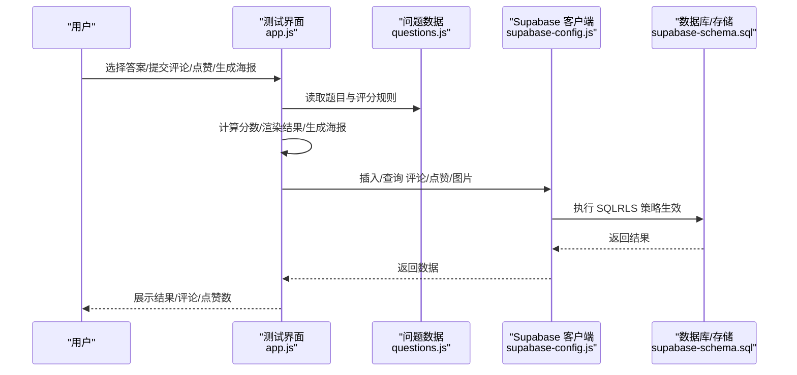
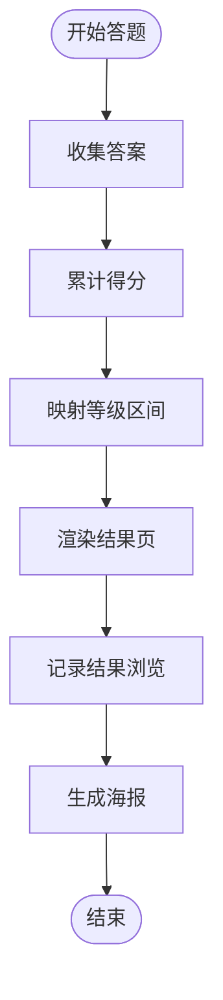
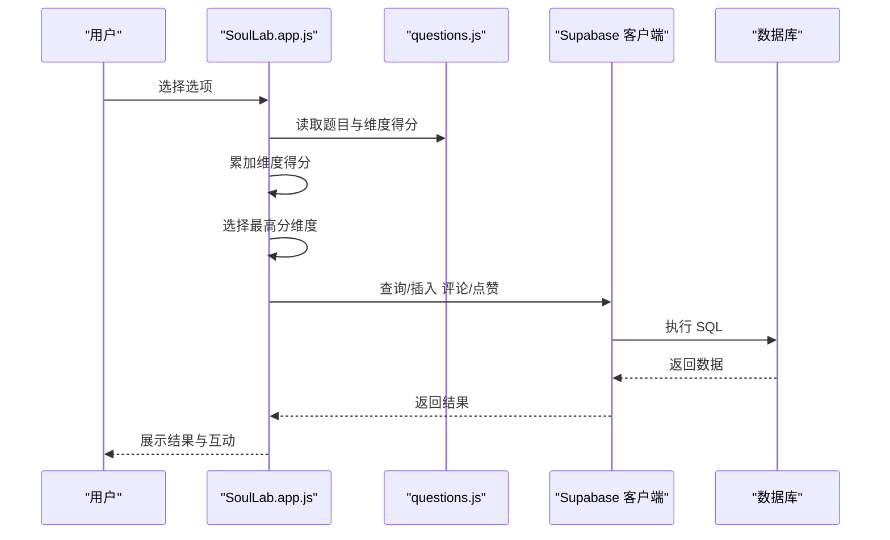
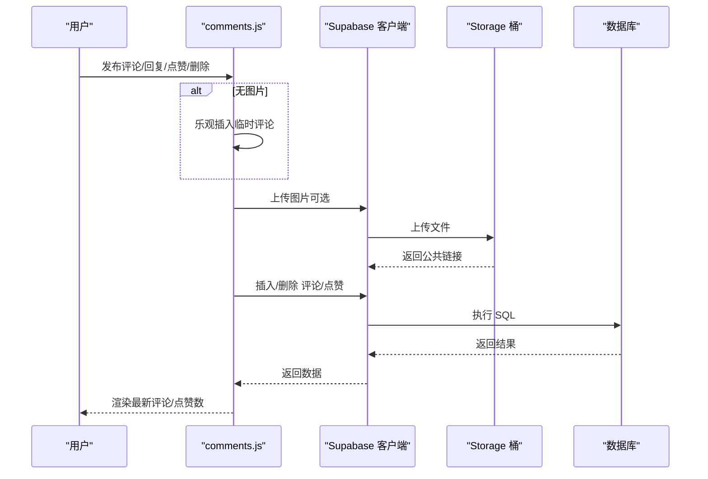
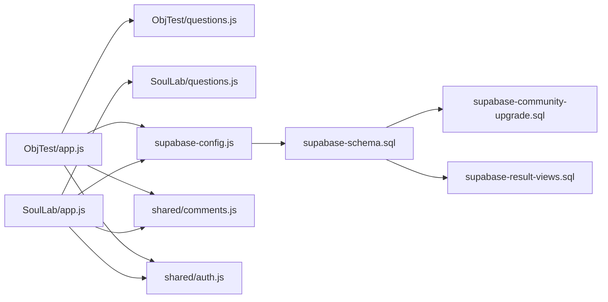

# 数据流

<cite>
**本文引用的文件**
- [ObjTest/app.js](file://ObjTest/app.js)
- [ObjTest/questions.js](file://ObjTest/questions.js)
- [ObjTest/index.html](file://ObjTest/index.html)
- [SoulLab/app.js](file://SoulLab/app.js)
- [SoulLab/questions.js](file://SoulLab/questions.js)
- [SoulLab/index.html](file://SoulLab/index.html)
- [shared/comments.js](file://shared/comments.js)
- [shared/auth.js](file://shared/auth.js)
- [shared/supabase-config.js](file://shared/supabase-config.js)
- [supabase-schema.sql](file://supabase-schema.sql)
- [supabase-community-upgrade.sql](file://supabase-community-upgrade.sql)
- [supabase-result-views.sql](file://supabase-result-views.sql)
</cite>

## 目录
1. [简介](#简介)
2. [项目结构](#项目结构)
3. [核心组件](#核心组件)
4. [架构总览](#架构总览)
5. [详细组件分析](#详细组件分析)
6. [依赖关系分析](#依赖关系分析)
7. [性能考量](#性能考量)
8. [故障排查指南](#故障排查指南)
9. [结论](#结论)
10. [附录](#附录)

## 简介
本文件面向“觉醒诗社”项目，系统梳理数据在应用内的产生、传输、处理与存储流程，重点覆盖：
- 用户输入如何转化为测试数据
- 测试结果如何评分与分析
- 评论数据如何实现实时可见与交互
- 数据库事务与一致性保障
- 缓存策略与性能优化
- 数据流向图与时序图
- 错误处理与数据恢复机制

## 项目结构
项目采用“功能模块 + 共享层”的组织方式：
- 功能模块：ObjTest（自我客体化测评）、SoulLab（灵性人格测试）
- 共享层：认证与评论模块、Supabase 配置
- 数据层：Supabase（PostgreSQL + Storage）

**图表来源**
- [ObjTest/index.html:1-170](file://ObjTest/index.html#L1-L170)
- [SoulLab/index.html:1-271](file://SoulLab/index.html#L1-L271)
- [shared/supabase-config.js:1-26](file://shared/supabase-config.js#L1-L26)
- [supabase-schema.sql:1-97](file://supabase-schema.sql#L1-L97)
- [supabase-community-upgrade.sql:1-77](file://supabase-community-upgrade.sql#L1-L77)
- [supabase-result-views.sql:1-32](file://supabase-result-views.sql#L1-L32)

**章节来源**
- [ObjTest/index.html:1-170](file://ObjTest/index.html#L1-L170)
- [SoulLab/index.html:1-271](file://SoulLab/index.html#L1-L271)
- [shared/supabase-config.js:1-26](file://shared/supabase-config.js#L1-L26)

## 核心组件
- 测试引擎（ObjTest/SoulLab）：负责问题呈现、答案收集、评分计算、结果展示与海报生成
- 评论系统（comments.js）：负责评论加载、发布、点赞、回复、图片上传与展示
- 认证系统（auth.js）：负责登录/注册、会话管理、资料同步、头像处理
- Supabase 配置（supabase-config.js）：统一初始化 Supabase 客户端
- 数据库模式（supabase-schema.sql、supabase-community-upgrade.sql、supabase-result-views.sql）：定义表结构、RLS 策略、索引与升级脚本

**章节来源**
- [ObjTest/app.js:1-327](file://ObjTest/app.js#L1-L327)
- [SoulLab/app.js:1-613](file://SoulLab/app.js#L1-L613)
- [shared/comments.js:1-769](file://shared/comments.js#L1-L769)
- [shared/auth.js:1-800](file://shared/auth.js#L1-L800)
- [shared/supabase-config.js:1-26](file://shared/supabase-config.js#L1-L26)
- [supabase-schema.sql:1-97](file://supabase-schema.sql#L1-L97)
- [supabase-community-upgrade.sql:1-77](file://supabase-community-upgrade.sql#L1-L77)
- [supabase-result-views.sql:1-32](file://supabase-result-views.sql#L1-L32)

## 架构总览
整体数据流分为四段：
1) 用户输入与交互：浏览器事件驱动，收集答案与操作
2) 前端处理与本地状态：计算分数、渲染结果、生成海报
3) 后端持久化与查询：写入结果浏览计数、评论、点赞、图片；读取参与人数、评论列表
4) 实时可见与一致性：通过 Supabase RLS 与索引保障访问与排序

**图表来源**
- [ObjTest/app.js:1-327](file://ObjTest/app.js#L1-L327)
- [SoulLab/app.js:1-613](file://SoulLab/app.js#L1-L613)
- [shared/supabase-config.js:1-26](file://shared/supabase-config.js#L1-L26)
- [supabase-schema.sql:1-97](file://supabase-schema.sql#L1-L97)

## 详细组件分析

### 测试引擎（ObjTest）
- 输入采集：逐题选择答案，记录在内存对象中
- 评分计算：累加各题选项对应的分数，映射到等级区间
- 结果展示：渲染标题、描述、建议，并记录结果浏览次数
- 参与人数统计：优先从结果浏览视图表读取，若不可用则回退到评论表计数
- 海报生成：使用 html2canvas 截图并下载

**图表来源**
- [ObjTest/app.js:207-242](file://ObjTest/app.js#L207-L242)
- [ObjTest/questions.js:1-403](file://ObjTest/questions.js#L1-L403)

**章节来源**
- [ObjTest/app.js:1-327](file://ObjTest/app.js#L1-L327)
- [ObjTest/questions.js:1-403](file://ObjTest/questions.js#L1-L403)
- [ObjTest/index.html:1-170](file://ObjTest/index.html#L1-L170)

### 测试引擎（SoulLab）
- 输入采集：逐题选择选项，记录到内存对象
- 评分计算：按选项对多个人格维度累加分值，取最高分维度为最终类型
- 结果展示：渲染类型标签、描述、标签、名言、MBTI 等，并带仪表盘动画
- 参与人数统计：同 ObjTest
- 海报生成：克隆结果页 DOM，移除评论与操作区，使用 html2canvas 生成图片

**图表来源**
- [SoulLab/app.js:334-405](file://SoulLab/app.js#L334-L405)
- [SoulLab/questions.js:1-352](file://SoulLab/questions.js#L1-L352)

**章节来源**
- [SoulLab/app.js:1-613](file://SoulLab/app.js#L1-L613)
- [SoulLab/questions.js:1-352](file://SoulLab/questions.js#L1-L352)
- [SoulLab/index.html:1-271](file://SoulLab/index.html#L1-L271)

### 评论系统（comments.js）
- 初始化：根据页面类型（soullab/objtest）加载评论
- 发布评论：乐观 UI（无图时先插入临时占位），随后异步上传图片并写入数据库
- 点赞：切换本地状态，调用后端增删点赞记录
- 删除：本地快照回滚，调用后端删除
- 图片上传：上传到 Storage 桶，生成公开链接
- 错误处理：针对缺失表、权限不足、Schema 缓存等问题给出提示与降级

**图表来源**
- [shared/comments.js:511-643](file://shared/comments.js#L511-L643)
- [shared/comments.js:645-688](file://shared/comments.js#L645-L688)
- [shared/comments.js:690-708](file://shared/comments.js#L690-L708)

**章节来源**
- [shared/comments.js:1-769](file://shared/comments.js#L1-L769)

### 认证系统（auth.js）
- OTP 注册/登录：发送验证码、校验、设置密码、同步用户资料
- 资料同步：更新用户元数据与 profiles 表，兼容字段差异
- 头像处理：emoji 与图片两种头像源，支持上传与缓存
- 错误映射：将底层错误消息转换为用户可读提示

**章节来源**
- [shared/auth.js:1-800](file://shared/auth.js#L1-L800)

### Supabase 配置与数据库模式
- 配置：统一初始化 Supabase 客户端，提供全局访问路径
- 模式：定义 profiles、comments、Storage 桶与 RLS 策略
- 升级：新增评论回复字段、点赞表、索引与策略
- 结果浏览：新增 result_views 表与策略，用于统计参与人数

**章节来源**
- [shared/supabase-config.js:1-26](file://shared/supabase-config.js#L1-L26)
- [supabase-schema.sql:1-97](file://supabase-schema.sql#L1-L97)
- [supabase-community-upgrade.sql:1-77](file://supabase-community-upgrade.sql#L1-L77)
- [supabase-result-views.sql:1-32](file://supabase-result-views.sql#L1-L32)

## 依赖关系分析
- 前端模块依赖 Supabase 客户端进行数据持久化
- 评论模块依赖认证模块提供的用户信息
- 测试模块依赖问题数据与结果映射
- 数据库层通过 RLS 与索引保障访问控制与查询性能

**图表来源**
- [ObjTest/app.js:1-327](file://ObjTest/app.js#L1-L327)
- [SoulLab/app.js:1-613](file://SoulLab/app.js#L1-L613)
- [shared/supabase-config.js:1-26](file://shared/supabase-config.js#L1-L26)
- [supabase-schema.sql:1-97](file://supabase-schema.sql#L1-L97)
- [supabase-community-upgrade.sql:1-77](file://supabase-community-upgrade.sql#L1-L77)
- [supabase-result-views.sql:1-32](file://supabase-result-views.sql#L1-L32)

**章节来源**
- [ObjTest/app.js:1-327](file://ObjTest/app.js#L1-L327)
- [SoulLab/app.js:1-613](file://SoulLab/app.js#L1-L613)
- [shared/comments.js:1-769](file://shared/comments.js#L1-L769)
- [shared/auth.js:1-800](file://shared/auth.js#L1-L800)
- [shared/supabase-config.js:1-26](file://shared/supabase-config.js#L1-L26)
- [supabase-schema.sql:1-97](file://supabase-schema.sql#L1-L97)
- [supabase-community-upgrade.sql:1-77](file://supabase-community-upgrade.sql#L1-L77)
- [supabase-result-views.sql:1-32](file://supabase-result-views.sql#L1-L32)

## 性能考量
- 乐观 UI：评论发布时先本地插入临时占位，减少等待时间
- 图片延迟加载：海报生成时预加载图片，避免跨域污染
- 分页与索引：评论按创建时间倒序，配合复合索引提升查询性能
- RLS 与缓存：RLS 策略在服务端生效，结合浏览器缓存与本地状态减少重复请求
- 资源压缩：Storage 桶设置缓存控制，降低带宽消耗

[本节为通用指导，不直接分析具体文件]

## 故障排查指南
- 评论功能未启用：检查升级脚本是否执行，确认 comments 表与 comment_likes 表存在
- 点赞失败：检查权限策略是否完整，确认用户已登录
- 参与人数统计异常：确认 result_views 表与策略是否存在
- 图片上传失败：检查 Storage 桶权限与缓存控制
- 认证超时：检查网络与 Supabase 配置，确认客户端初始化成功

**章节来源**
- [shared/comments.js:47-65](file://shared/comments.js#L47-L65)
- [shared/comments.js:627-643](file://shared/comments.js#L627-L643)
- [supabase-community-upgrade.sql:1-77](file://supabase-community-upgrade.sql#L1-L77)
- [supabase-result-views.sql:1-32](file://supabase-result-views.sql#L1-L32)
- [shared/supabase-config.js:1-26](file://shared/supabase-config.js#L1-L26)

## 结论
本项目通过清晰的模块划分与 Supabase 的 RLS/Storage 能力，实现了从用户输入到结果展示、再到评论互动的完整数据闭环。前端采用乐观 UI 与本地状态管理提升体验，后端通过策略与索引保障安全与性能。建议持续关注升级脚本的执行与监控指标，确保数据一致性与用户体验稳定。

[本节为总结性内容，不直接分析具体文件]

## 附录

### 数据库事务与一致性
- 评论发布：乐观插入临时记录，随后异步上传图片并写入数据库，失败时回滚本地状态
- 点赞：切换本地状态后异步写入/删除点赞记录，失败时回滚本地状态
- 删除：本地快照回滚，失败时恢复本地状态
- 参与人数：优先从 result_views 表统计，回退到 comments 表

**章节来源**
- [shared/comments.js:564-643](file://shared/comments.js#L564-L643)
- [shared/comments.js:645-688](file://shared/comments.js#L645-L688)
- [shared/comments.js:690-708](file://shared/comments.js#L690-L708)
- [ObjTest/app.js:23-64](file://ObjTest/app.js#L23-L64)
- [SoulLab/app.js:33-80](file://SoulLab/app.js#L33-L80)

### 缓存策略与性能优化
- 乐观 UI：减少首屏等待，提升交互流畅度
- 图片预加载：避免跨域污染，提高截图质量
- 索引与策略：按 page_type、parent_comment_id、created_at 建立索引，提升查询性能
- Storage 缓存控制：设置合理的缓存时间，降低带宽成本

**章节来源**
- [shared/comments.js:529-546](file://shared/comments.js#L529-L546)
- [shared/comments.js:590-600](file://shared/comments.js#L590-L600)
- [supabase-community-upgrade.sql:6-23](file://supabase-community-upgrade.sql#L6-L23)
- [supabase-schema.sql:85-97](file://supabase-schema.sql#L85-L97)