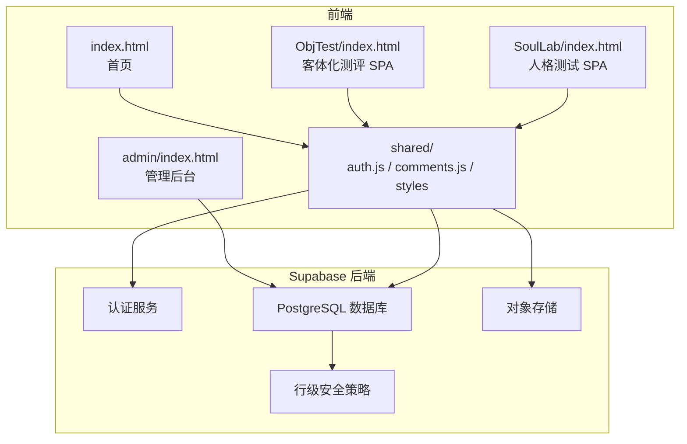
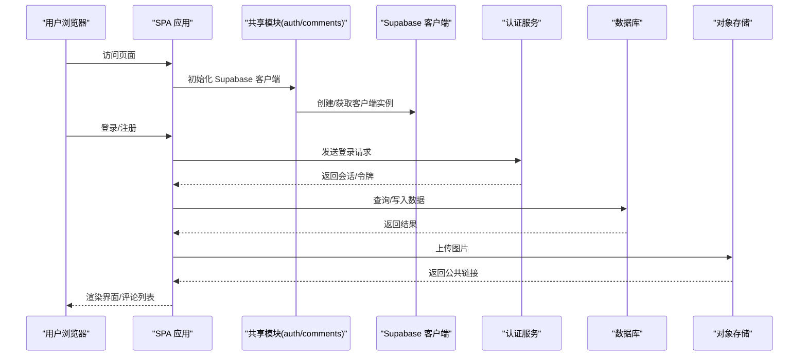
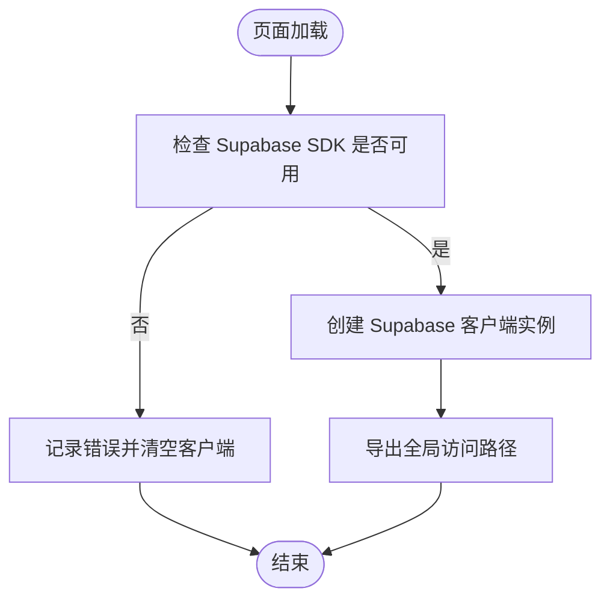
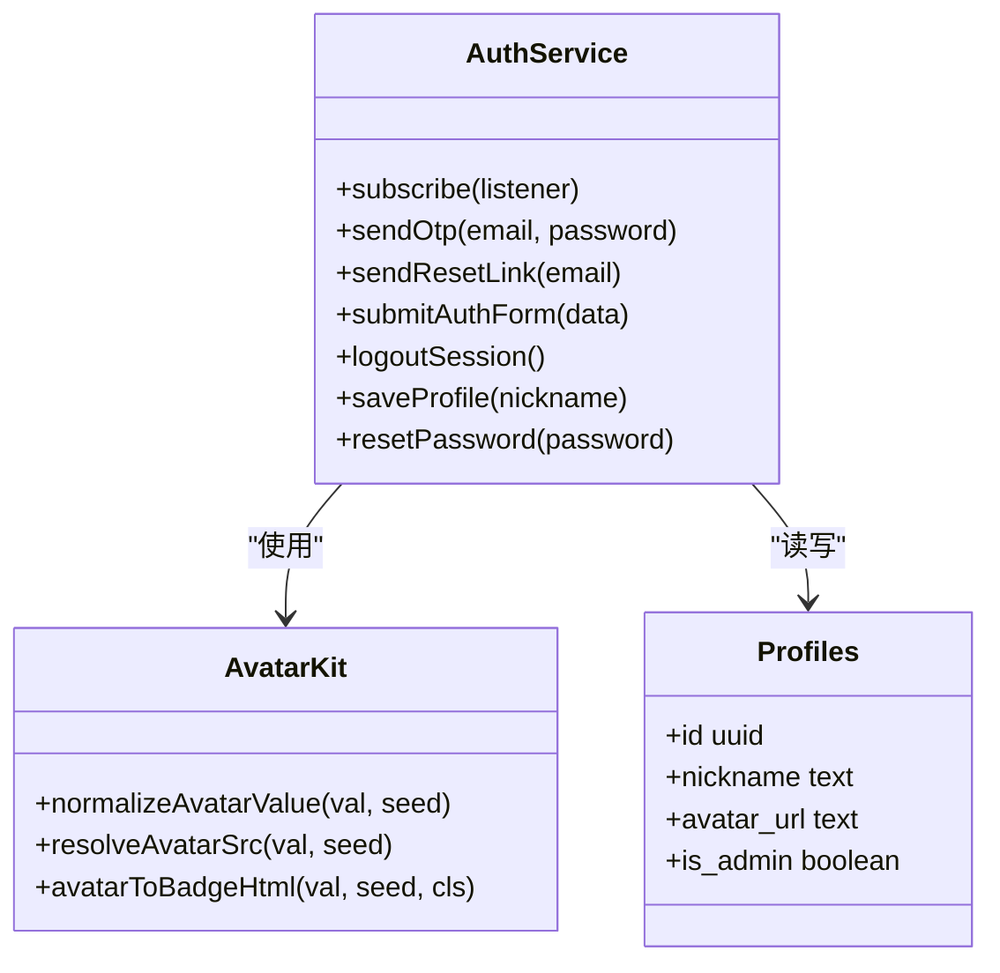
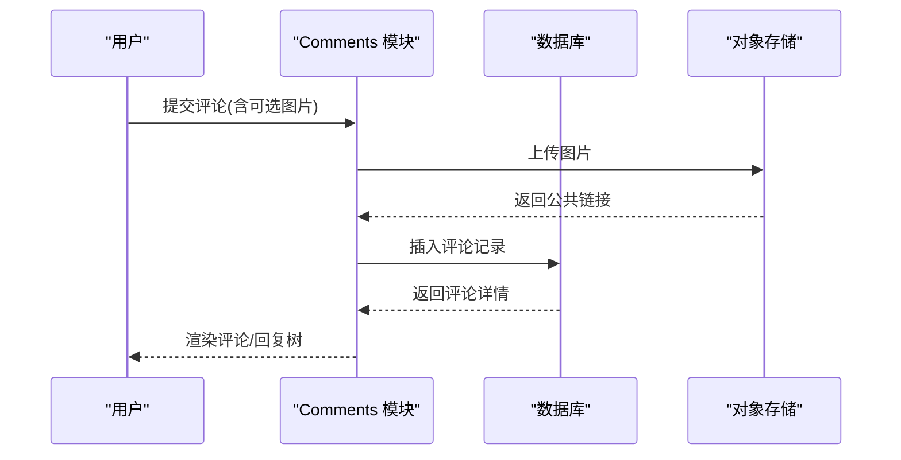
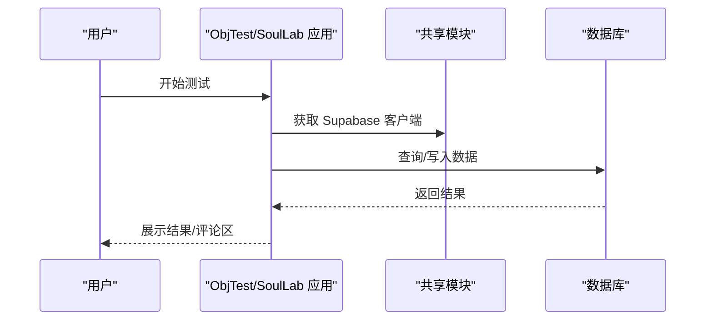
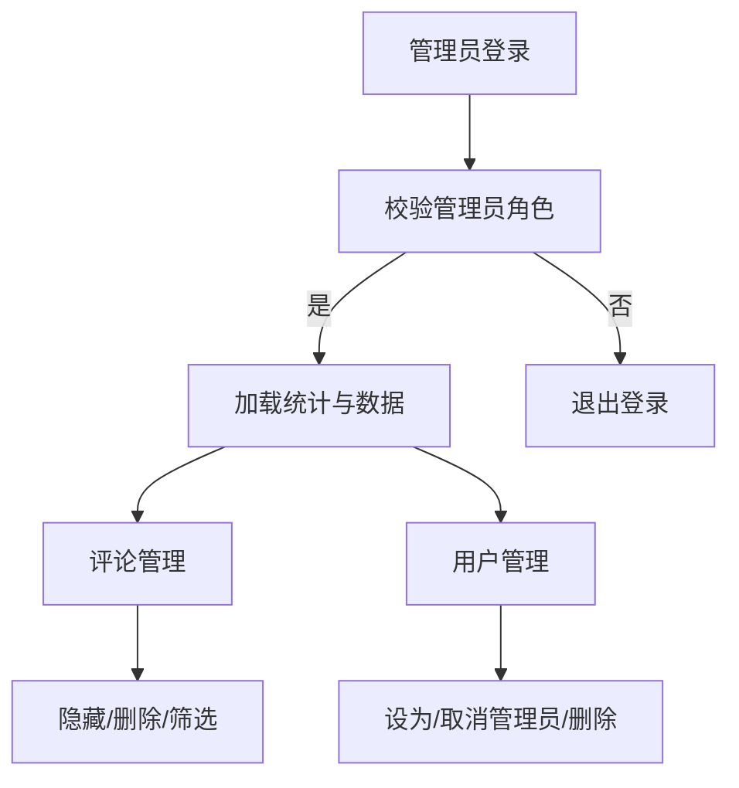
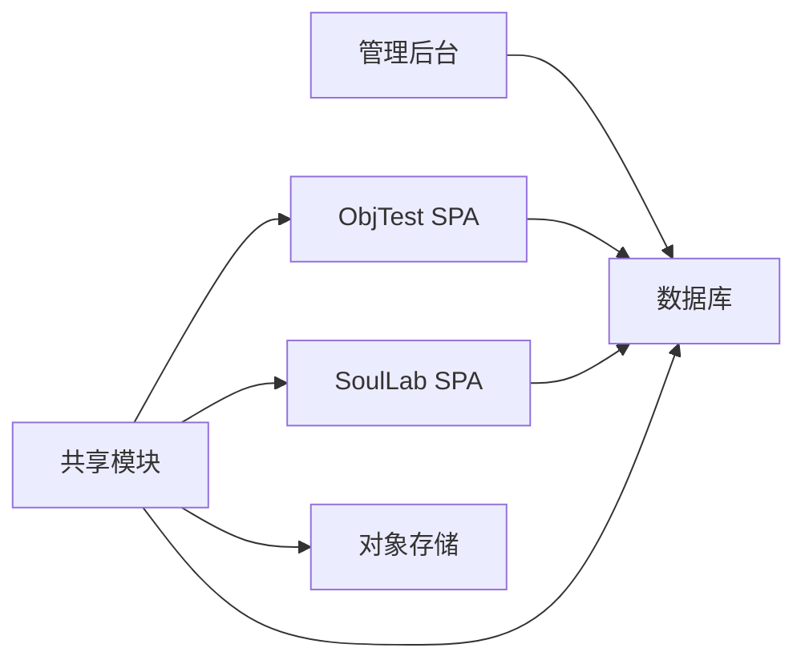

# 整体设计

<cite>
**本文引用的文件**
- [index.html](file://index.html)
- [supabase-config.js](file://shared/supabase-config.js)
- [auth.js](file://shared/auth.js)
- [comments.js](file://shared/comments.js)
- [auth.css](file://shared/auth.css)
- [comments.css](file://shared/comments.css)
- [supabase-schema.sql](file://supabase-schema.sql)
- [supabase-community-upgrade.sql](file://supabase-community-upgrade.sql)
- [ObjTest/index.html](file://ObjTest/index.html)
- [ObjTest/app.js](file://ObjTest/app.js)
- [SoulLab/index.html](file://SoulLab/index.html)
- [SoulLab/app.js](file://SoulLab/app.js)
- [admin/index.html](file://admin/index.html)
</cite>

## 目录
1. [引言](#引言)
2. [项目结构](#项目结构)
3. [核心组件](#核心组件)
4. [架构总览](#架构总览)
5. [详细组件分析](#详细组件分析)
6. [依赖关系分析](#依赖关系分析)
7. [性能考虑](#性能考虑)
8. [故障排除指南](#故障排除指南)
9. [结论](#结论)

## 引言
本设计文档面向“觉醒诗社”项目，系统性阐述其基于 Supabase 的无服务器架构与前端 SPA 设计。项目采用单页应用（SPA）模式，结合模块化组织与响应式设计原则，通过 Supabase 实现认证、数据库与存储的统一管理，并提供评论区与管理后台等核心功能。文档旨在帮助开发者快速理解系统边界、组件职责与交互流程，便于后续扩展与维护。

## 项目结构
项目采用“根目录 + 功能模块 + 共享资源”的组织方式：
- 根目录包含首页与全局资源
- ObjTest 与 SoulLab 为两个独立的 SPA 页面，分别承载“自我客体化测评”和“灵性修行版人格测试”
- shared 目录存放跨页面共享的认证、评论与样式资源
- admin 目录提供管理后台，用于评论与用户管理
- supabase-* 脚本用于数据库结构与策略初始化

图表来源
- [index.html](file://index.html)
- [ObjTest/index.html](file://ObjTest/index.html)
- [SoulLab/index.html](file://SoulLab/index.html)
- [admin/index.html](file://admin/index.html)
- [supabase-schema.sql](file://supabase-schema.sql)

章节来源
- [index.html](file://index.html)
- [ObjTest/index.html](file://ObjTest/index.html)
- [SoulLab/index.html](file://SoulLab/index.html)
- [admin/index.html](file://admin/index.html)

## 核心组件
- Supabase 配置与客户端封装：统一初始化与访问 Supabase 客户端，确保各模块共享同一实例
- 认证模块：负责登录/注册、OTP 验证、用户资料同步、头像与昵称管理
- 评论模块：负责评论的增删查、点赞、回复树、图片上传与展示
- 页面应用：ObjTest 与 SoulLab 的 SPA 应用逻辑，包含题目渲染、评分计算、结果页展示与分享
- 管理后台：评论与用户管理、状态统计、权限控制

章节来源
- [supabase-config.js](file://shared/supabase-config.js)
- [auth.js](file://shared/auth.js)
- [comments.js](file://shared/comments.js)
- [ObjTest/app.js](file://ObjTest/app.js)
- [SoulLab/app.js](file://SoulLab/app.js)
- [admin/index.html](file://admin/index.html)

## 架构总览
系统采用“前端 SPA + Supabase 后端”的无服务器架构：
- 前端 SPA：通过 Supabase JS SDK 与后端进行数据交互，实现认证、数据库查询与存储上传
- Supabase 后端：提供认证服务、PostgreSQL 数据库、对象存储与行级安全策略
- 数据一致性：通过 RLS 策略与 RPC/函数保障数据访问与业务规则的一致性

图表来源
- [supabase-config.js](file://shared/supabase-config.js)
- [auth.js](file://shared/auth.js)
- [comments.js](file://shared/comments.js)
- [ObjTest/app.js](file://ObjTest/app.js)
- [SoulLab/app.js](file://SoulLab/app.js)

## 详细组件分析

### Supabase 配置与客户端封装
- 统一初始化：在共享模块中创建全局 Supabase 客户端实例，避免重复初始化与跨模块不一致
- 兼容访问：提供多种访问路径（window.supabaseClient、window.db、supabase），兼容不同模块的调用习惯
- 错误处理：检测 SDK 是否加载成功，若失败则输出错误并清空客户端引用

图表来源
- [supabase-config.js](file://shared/supabase-config.js)

章节来源
- [supabase-config.js](file://shared/supabase-config.js)

### 认证模块（Auth）
- 功能要点
  - OTP 登录：支持邮箱验证码登录，带冷却与超时控制
  - 密码重置：支持通过邮箱发送重置链接
  - 用户资料：昵称、头像（emoji 或自定义图片）、元数据同步
  - 头像处理：emoji 与 URL 头像的标准化与渲染
  - 会话管理：登录态监听、登出、本地状态同步
- 数据模型
  - profiles 表：用户资料（昵称、头像、管理员标识）
  - auth.users：Supabase 认证用户表
- 安全策略
  - RLS：公开读取 profiles；仅本人可更新/插入
  - 注册触发器：新用户自动创建 profile

图表来源
- [auth.js](file://shared/auth.js)
- [supabase-schema.sql](file://supabase-schema.sql)

章节来源
- [auth.js](file://shared/auth.js)
- [supabase-schema.sql](file://supabase-schema.sql)

### 评论模块（Comments）
- 功能要点
  - 评论 CRUD：支持文本与图片评论，父子回复树
  - 点赞：基于 comment_likes 表，支持点赞/取消
  - 图片上传：通过 Supabase Storage 上传至 comment-images 桶
  - 列表渲染：分页与展开/折叠回复，@提及高亮
  - 权限控制：RLS 策略限制可见性与操作权限
- 数据模型
  - comments 表：评论内容、关联用户、页面类型、父评论 ID、隐藏状态
  - comment_likes 表：点赞记录
  - profiles 表：用户资料
- 升级脚本
  - supabase-community-upgrade.sql：新增父评论字段、点赞表与索引，完善 RLS 策略

图表来源
- [comments.js](file://shared/comments.js)
- [supabase-schema.sql](file://supabase-schema.sql)
- [supabase-community-upgrade.sql](file://supabase-community-upgrade.sql)

章节来源
- [comments.js](file://shared/comments.js)
- [supabase-schema.sql](file://supabase-schema.sql)
- [supabase-community-upgrade.sql](file://supabase-community-upgrade.sql)

### 页面应用（ObjTest 与 SoulLab）
- ObjTest
  - 题目加载与导航、答案收集、分数计算、结果页渲染、参与人数统计与海报保存
  - 与评论模块集成：结果页初始化评论区
- SoulLab
  - 33 题人格测试，多维度指标仪表盘，角色海报生成与分享
  - 与评论模块集成：结果页初始化评论区
- 共享逻辑
  - 使用 Supabase 客户端进行数据访问
  - 通过 URL 参数控制自动开始

图表来源
- [ObjTest/app.js](file://ObjTest/app.js)
- [SoulLab/app.js](file://SoulLab/app.js)
- [supabase-config.js](file://shared/supabase-config.js)

章节来源
- [ObjTest/app.js](file://ObjTest/app.js)
- [SoulLab/app.js](file://SoulLab/app.js)

### 管理后台（Admin）
- 功能要点
  - 管理员登录：基于 Supabase 认证，校验管理员角色
  - 评论管理：搜索、筛选、隐藏/恢复、删除
  - 用户管理：搜索、设为/取消管理员、删除用户
  - 统计面板：用户数、评论数、隐藏数、管理员数、结果浏览量
- 数据访问
  - 通过 Supabase 客户端直接访问数据库与存储
  - 使用 RPC 删除用户（admin_delete_user）

图表来源
- [admin/index.html](file://admin/index.html)

章节来源
- [admin/index.html](file://admin/index.html)

## 依赖关系分析
- 模块耦合
  - 共享模块（auth.js、comments.js、supabase-config.js）被 ObjTest 与 SoulLab 页面引用，形成低耦合高内聚
  - 管理后台直接依赖 Supabase 客户端，不依赖共享模块中的业务逻辑
- 外部依赖
  - Supabase JS SDK：认证、数据库、存储
  - html2canvas：结果页截图与海报生成
- 数据依赖
  - 数据库结构与策略由 supabase-schema.sql 与 supabase-community-upgrade.sql 管理
  - RLS 策略保证数据安全与访问控制

图表来源
- [supabase-config.js](file://shared/supabase-config.js)
- [auth.js](file://shared/auth.js)
- [comments.js](file://shared/comments.js)
- [ObjTest/index.html](file://ObjTest/index.html)
- [SoulLab/index.html](file://SoulLab/index.html)
- [admin/index.html](file://admin/index.html)

章节来源
- [supabase-config.js](file://shared/supabase-config.js)
- [auth.js](file://shared/auth.js)
- [comments.js](file://shared/comments.js)
- [ObjTest/index.html](file://ObjTest/index.html)
- [SoulLab/index.html](file://SoulLab/index.html)
- [admin/index.html](file://admin/index.html)

## 性能考虑
- 前端性能
  - SPA 模式减少页面刷新，提升交互流畅度
  - 评论列表分页与懒加载，降低首屏渲染压力
  - 图片上传采用缓存控制与缩略图策略
- 数据库性能
  - 为评论表建立复合索引，优化查询性能
  - 通过 RLS 策略减少不必要的过滤开销
- 存储性能
  - 对象存储桶按需访问，避免未授权访问
  - 图片上传使用 upsert 与缓存控制，提升并发稳定性

## 故障排除指南
- 认证相关
  - SDK 未加载：检查 Supabase CDN 是否可用，确认初始化顺序
  - OTP 发送失败：检查速率限制与网络超时，适当延长超时时间
  - 密码重置：确认重置链接的 redirect URL 设置正确
- 评论相关
  - 评论表缺失：执行 supabase-community-upgrade.sql 完成升级
  - 点赞失败：检查 comment_likes 表权限与 RLS 策略
  - 图片上传失败：检查对象存储桶权限与文件大小限制
- 管理后台
  - 管理员登录失败：确认用户 metadata 中 is_admin 字段或 profiles 表中 is_admin 字段
  - RPC 删除用户：确认已部署 admin_delete_user 函数

章节来源
- [auth.js](file://shared/auth.js)
- [comments.js](file://shared/comments.js)
- [supabase-community-upgrade.sql](file://supabase-community-upgrade.sql)
- [admin/index.html](file://admin/index.html)

## 结论
“觉醒诗社”项目通过 SPA 与 Supabase 的组合，实现了认证、数据库与存储的统一管理，具备良好的模块化与可扩展性。认证模块提供完善的登录与资料管理能力，评论模块支持丰富的互动功能，管理后台满足运营与维护需求。建议在后续迭代中持续完善数据库索引与缓存策略，增强错误提示与监控告警，以进一步提升用户体验与系统稳定性。