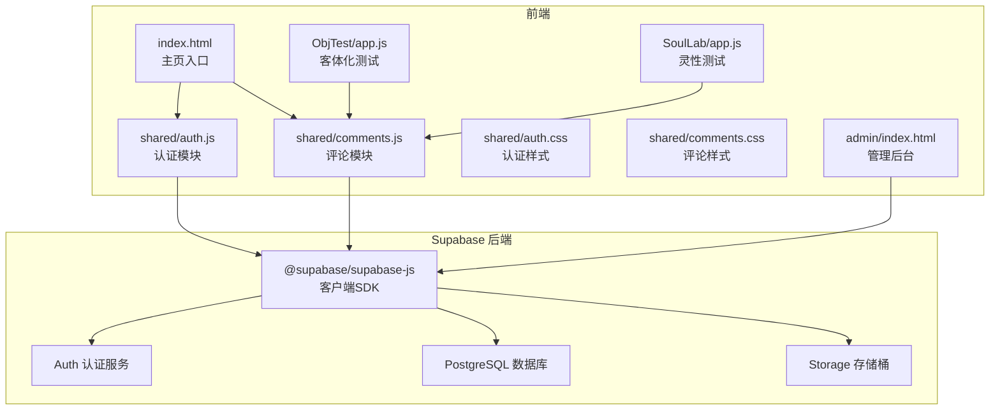
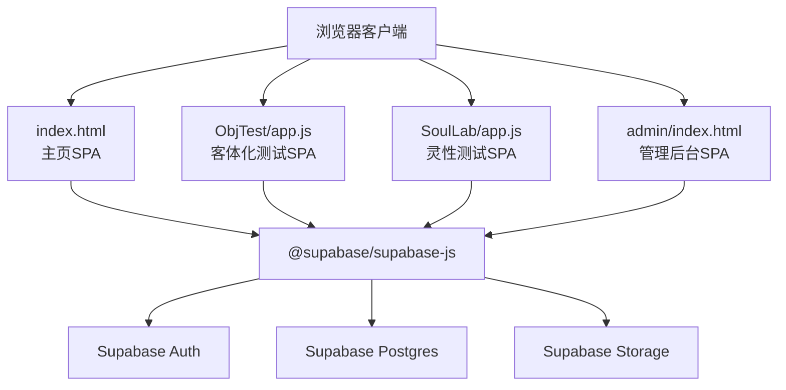
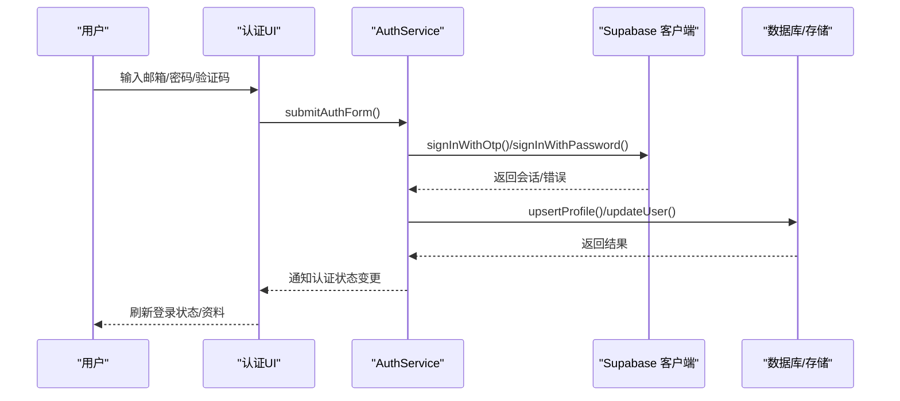
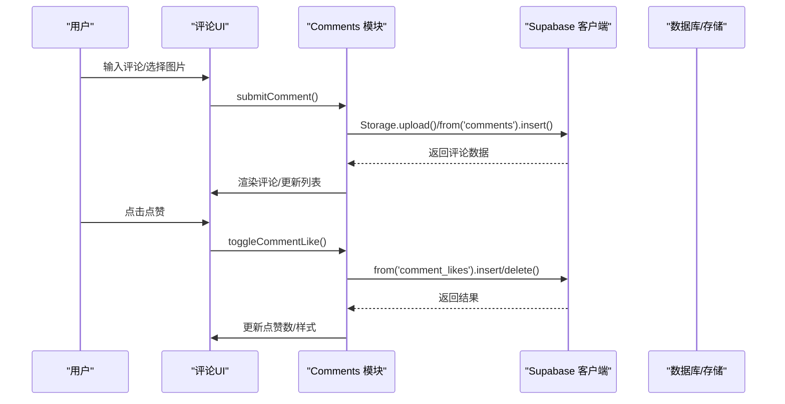
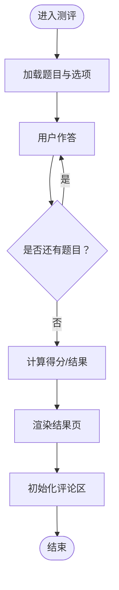
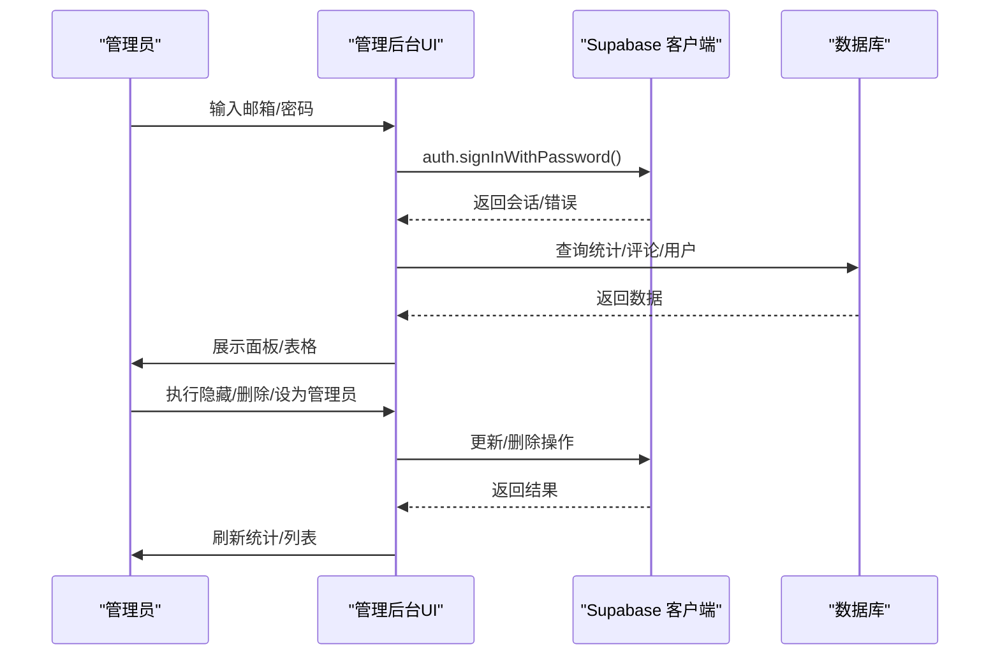
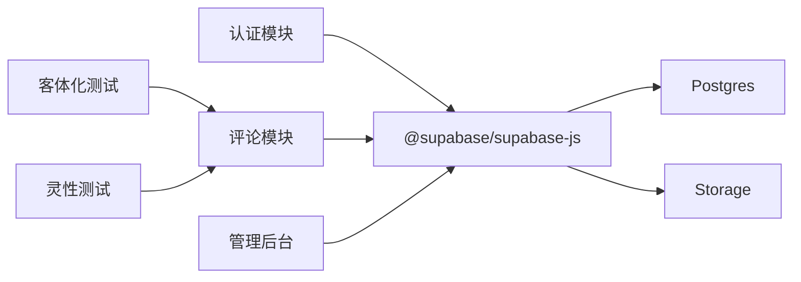

# 系统架构

<cite>
**本文引用的文件**
- [index.html](file://index.html)
- [shared/supabase-config.js](file://shared/supabase-config.js)
- [shared/auth.js](file://shared/auth.js)
- [shared/comments.js](file://shared/comments.js)
- [shared/auth.css](file://shared/auth.css)
- [shared/comments.css](file://shared/comments.css)
- [ObjTest/app.js](file://ObjTest/app.js)
- [SoulLab/app.js](file://SoulLab/app.js)
- [admin/index.html](file://admin/index.html)
- [supabase-schema.sql](file://supabase-schema.sql)
- [supabase-community-upgrade.sql](file://supabase-community-upgrade.sql)
</cite>

## 目录
1. [简介](#简介)
2. [项目结构](#项目结构)
3. [核心组件](#核心组件)
4. [架构总览](#架构总览)
5. [详细组件分析](#详细组件分析)
6. [依赖关系分析](#依赖关系分析)
7. [性能考量](#性能考量)
8. [故障排查指南](#故障排查指南)
9. [结论](#结论)

## 简介
本系统为“觉醒诗社”网站，采用基于 Supabase 的无服务器（Serverless）架构，结合前端 SPA 应用与 Supabase 数据库服务实现用户认证、内容展示、互动评论与管理后台等功能。系统通过 Supabase 提供的身份认证、数据库与存储能力，实现低运维成本、高扩展性的全栈解决方案。前端由多个独立的功能模块组成，包括主页、测评工具（客体化测试与灵性测试）、评论区与管理后台，模块之间通过共享的 Supabase 客户端与认证状态进行解耦协作。

## 项目结构
系统采用模块化组织方式：
- 前端入口与公共资源：主页入口、样式与共享脚本
- 功能模块：客体化测试、灵性测试、评论区、管理后台
- 数据层：Supabase 数据库与存储策略

图表来源
- [index.html](file://index.html)
- [shared/auth.js](file://shared/auth.js)
- [shared/comments.js](file://shared/comments.js)
- [ObjTest/app.js](file://ObjTest/app.js)
- [SoulLab/app.js](file://SoulLab/app.js)
- [admin/index.html](file://admin/index.html)

章节来源
- [index.html](file://index.html)
- [shared/supabase-config.js](file://shared/supabase-config.js)

## 核心组件
- Supabase 全局配置：统一初始化 Supabase 客户端，提供全局访问路径，确保各模块共享同一实例。
- 认证模块：负责用户登录/注册、会话管理、资料编辑、头像处理与错误提示。
- 评论模块：负责评论加载、发布、点赞、回复、图片上传与展示。
- 测评模块：客体化测试与灵性测试，负责题目渲染、计分、结果展示与评论联动。
- 管理后台：评论与用户管理，支持筛选、隐藏/恢复、删除等操作。
- 数据层：通过 SQL 脚本定义表结构、RLS 策略与存储策略，保障数据安全与一致性。

章节来源
- [shared/supabase-config.js](file://shared/supabase-config.js)
- [shared/auth.js](file://shared/auth.js)
- [shared/comments.js](file://shared/comments.js)
- [ObjTest/app.js](file://ObjTest/app.js)
- [SoulLab/app.js](file://SoulLab/app.js)
- [admin/index.html](file://admin/index.html)
- [supabase-schema.sql](file://supabase-schema.sql)
- [supabase-community-upgrade.sql](file://supabase-community-upgrade.sql)

## 架构总览
系统采用“前端 SPA + Supabase 后端”的无服务器架构：
- 前端通过 Supabase JS SDK 与后端通信，无需自建 API 层。
- 认证通过 Supabase Auth 实现，支持邮箱验证码登录与密码重置。
- 数据库采用 PostgreSQL，配合 Row Level Security（RLS）实现细粒度权限控制。
- 存储使用 Supabase Storage，提供公开可读与登录上传策略。
- 管理后台独立部署，具备管理员权限校验与评论/用户管理能力。

图表来源
- [index.html](file://index.html)
- [ObjTest/app.js](file://ObjTest/app.js)
- [SoulLab/app.js](file://SoulLab/app.js)
- [admin/index.html](file://admin/index.html)
- [shared/supabase-config.js](file://shared/supabase-config.js)

## 详细组件分析

### 认证模块（Auth）
职责与特性：
- 统一获取 Supabase 客户端，兼容多处初始化路径。
- 支持邮箱验证码登录与密码登录，注册流程自动创建默认昵称与头像。
- 头像支持 Emoji、URL 与本地上传三种来源，提供头像预览与保存。
- 错误消息本地化与网络超时处理，增强用户体验。
- 订阅认证状态变化，驱动 UI 更新与资料同步。

图表来源
- [shared/auth.js](file://shared/auth.js)
- [shared/supabase-config.js](file://shared/supabase-config.js)

章节来源
- [shared/auth.js](file://shared/auth.js)
- [shared/auth.css](file://shared/auth.css)

### 评论模块（Comments）
职责与特性：
- 评论加载与渲染，支持分页与排序。
- 发布评论（支持文本与图片），采用乐观更新提升响应速度。
- 点赞/取消点赞，基于 comment_likes 表实现。
- 回复树形结构，支持展开/折叠与图片放大查看。
- 管理员可隐藏/删除评论；普通用户可删除自己的评论。
- 与认证模块联动，根据登录状态动态显示输入框与操作按钮。

图表来源
- [shared/comments.js](file://shared/comments.js)
- [shared/supabase-config.js](file://shared/supabase-config.js)

章节来源
- [shared/comments.js](file://shared/comments.js)
- [shared/comments.css](file://shared/comments.css)

### 测评模块（客体化测试与灵性测试）
职责与特性：
- 客体化测试：加载题目、记录答案、计算分数、生成结果页，并初始化评论区。
- 灵性测试：加载题目、记录答案、计算各维度分数、生成结果页与可视化仪表盘，并初始化评论区。
- 参与人数统计：通过 result_views 表记录浏览次数，回退到评论数统计。
- 结果海报生成：使用 html2canvas 截图生成分享海报。

图表来源
- [ObjTest/app.js](file://ObjTest/app.js)
- [SoulLab/app.js](file://SoulLab/app.js)

章节来源
- [ObjTest/app.js](file://ObjTest/app.js)
- [SoulLab/app.js](file://SoulLab/app.js)

### 管理后台（Admin）
职责与特性：
- 管理员登录校验，基于用户 metadata/is_admin 字段判断。
- 仪表盘统计：用户数、评论数、隐藏评论数、管理员数、结果浏览量。
- 评论管理：搜索、筛选、隐藏/恢复、删除。
- 用户管理：搜索、设为/取消管理员、删除用户（调用 RPC）。
- 与 Supabase 的 RLS 和策略配合，确保权限隔离。

图表来源
- [admin/index.html](file://admin/index.html)

章节来源
- [admin/index.html](file://admin/index.html)

### 数据层（Supabase Schema 与策略）
- profiles 表：用户资料，RLS 策略允许公开读取与本人更新。
- comments 表：评论内容，RLS 策略允许公开读取未隐藏评论，登录用户可发表，本人可删除，管理员可读写隐藏。
- comment_likes 表：点赞记录，RLS 策略允许公开读取与认证用户增删。
- Storage：comment-images 桶，登录用户可上传，公开可读。
- 升级脚本：新增父评论字段、索引、点赞表与策略，保证功能完整性与性能。

章节来源
- [supabase-schema.sql](file://supabase-schema.sql)
- [supabase-community-upgrade.sql](file://supabase-community-upgrade.sql)

## 依赖关系分析
- 模块耦合与内聚
  - 认证与评论模块通过共享 Supabase 客户端耦合，但各自职责清晰，内聚度高。
  - 测评模块与评论模块通过 initComments() 解耦集成，避免直接依赖。
  - 管理后台独立于前台，仅依赖 Supabase 的查询与更新接口。
- 外部依赖
  - @supabase/supabase-js：统一的后端通信入口。
  - html2canvas：用于结果页截图生成。
- 循环依赖
  - 未发现循环依赖，模块间通过函数回调与事件通知进行松耦合交互。

图表来源
- [shared/auth.js](file://shared/auth.js)
- [shared/comments.js](file://shared/comments.js)
- [ObjTest/app.js](file://ObjTest/app.js)
- [SoulLab/app.js](file://SoulLab/app.js)
- [admin/index.html](file://admin/index.html)
- [shared/supabase-config.js](file://shared/supabase-config.js)

## 性能考量
- 乐观更新：评论发布时先本地渲染，再异步提交，减少等待时间。
- 图片上传：限制最大尺寸，使用缓存控制与公共 URL，降低带宽与延迟。
- 分页与索引：评论按时间倒序分页加载，建立复合索引优化查询。
- RLS 与策略：通过策略限制查询范围，避免全表扫描。
- 前端懒加载：html2canvas 按需加载，避免不必要的资源消耗。

## 故障排查指南
常见问题与定位方法：
- 认证失败
  - 检查 Supabase URL 与密钥配置是否正确。
  - 确认网络环境与 CDN 可用性。
  - 查看错误消息本地化提示，定位具体原因（如速率限制、超时、邮箱格式等）。
- 评论功能异常
  - 确认 comments 表与 comment_likes 表是否存在及策略是否生效。
  - 检查 Storage 权限与桶是否存在。
  - 若出现 schema 缓存问题，尝试重试或清理缓存。
- 管理后台无法登录
  - 确认用户 metadata/is_admin 字段或 profiles 表中的 is_admin 字段。
  - 检查 RPC 删除用户函数是否可用。
- 性能问题
  - 优化图片尺寸与格式，减少传输体积。
  - 使用分页与索引，避免一次性加载过多数据。
  - 对热点查询添加合适的索引与缓存策略。

章节来源
- [shared/auth.js](file://shared/auth.js)
- [shared/comments.js](file://shared/comments.js)
- [admin/index.html](file://admin/index.html)
- [supabase-schema.sql](file://supabase-schema.sql)
- [supabase-community-upgrade.sql](file://supabase-community-upgrade.sql)

## 结论
本系统通过 Supabase 的无服务器架构实现了低耦合、高扩展的前后端一体化方案。前端模块化设计使得功能边界清晰、维护便捷；后端通过 RLS 与存储策略保障了数据安全与性能。整体架构在保证开发效率的同时，兼顾了用户体验与可运维性。建议后续持续关注 Supabase 的版本演进与性能优化，结合业务增长逐步完善监控与备份策略。