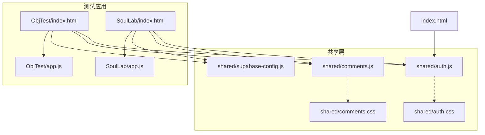
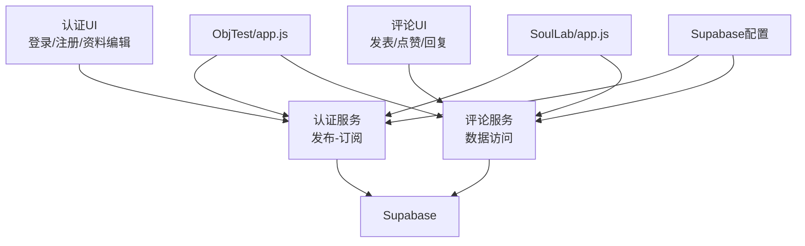
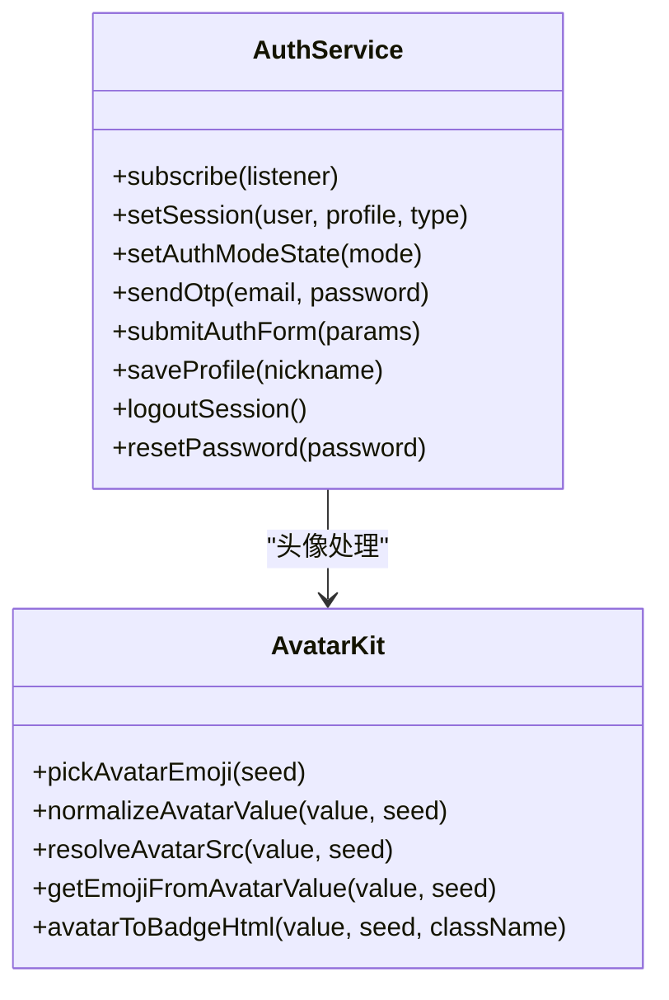
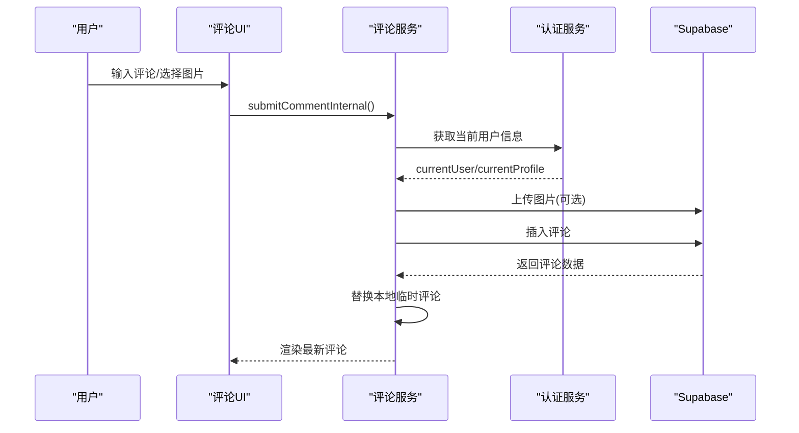
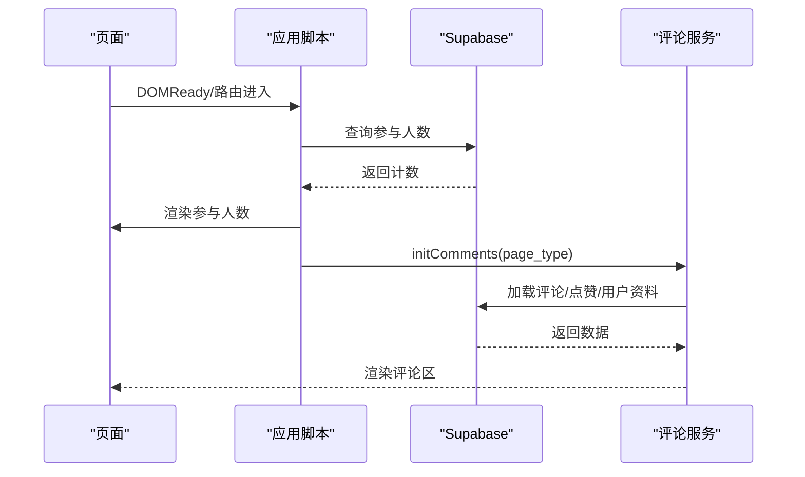
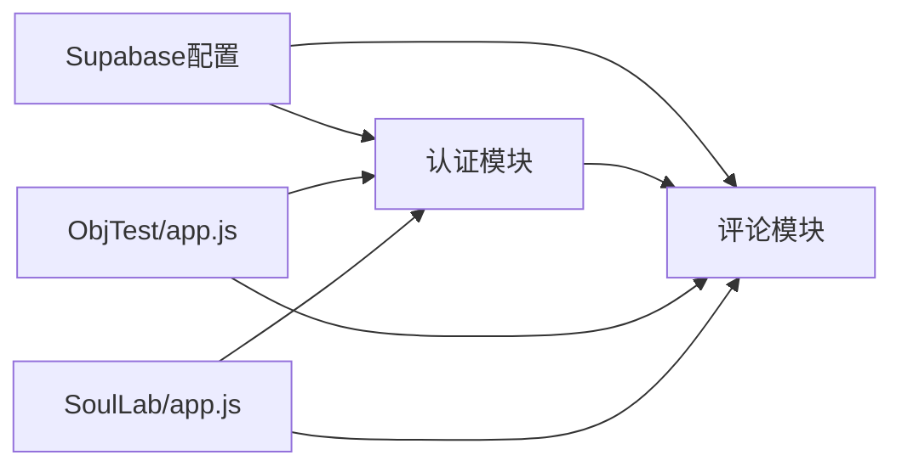

# 组件交互

<cite>
**本文引用的文件**
- [shared/auth.js](file://shared/auth.js)
- [shared/comments.js](file://shared/comments.js)
- [shared/supabase-config.js](file://shared/supabase-config.js)
- [shared/auth.css](file://shared/auth.css)
- [shared/comments.css](file://shared/comments.css)
- [ObjTest/app.js](file://ObjTest/app.js)
- [ObjTest/index.html](file://ObjTest/index.html)
- [SoulLab/app.js](file://SoulLab/app.js)
- [SoulLab/index.html](file://SoulLab/index.html)
- [index.html](file://index.html)
</cite>

## 目录
1. [引言](#引言)
2. [项目结构](#项目结构)
3. [核心组件](#核心组件)
4. [架构总览](#架构总览)
5. [详细组件分析](#详细组件分析)
6. [依赖关系分析](#依赖关系分析)
7. [性能考量](#性能考量)
8. [故障排查指南](#故障排查指南)
9. [结论](#结论)
10. [附录](#附录)

## 引言
本文件面向“觉醒诗社”项目，聚焦组件间的交互关系与数据流，系统阐述认证模块如何为其他模块提供用户状态管理、测试模块如何与数据库进行数据交互、评论系统如何实现实时同步，并给出事件驱动架构（发布-订阅与状态管理）的设计原则与接口约定。文档通过组件交互图与数据流图，串联从用户操作到最终数据持久化的完整链路，帮助开发者与产品人员快速理解系统运作机制。

## 项目结构
项目采用按功能域划分的组织方式：
- shared：跨页面共享的认证与评论模块、Supabase全局配置与样式
- ObjTest：自我客体化测评应用
- SoulLab：灵性修行版人格测试应用
- 根目录：首页与数据库升级脚本

图表来源
- [shared/auth.js](file://shared/auth.js)
- [shared/comments.js](file://shared/comments.js)
- [shared/supabase-config.js](file://shared/supabase-config.js)
- [shared/auth.css](file://shared/auth.css)
- [shared/comments.css](file://shared/comments.css)
- [ObjTest/index.html](file://ObjTest/index.html)
- [ObjTest/app.js](file://ObjTest/app.js)
- [SoulLab/index.html](file://SoulLab/index.html)
- [SoulLab/app.js](file://SoulLab/app.js)
- [index.html](file://index.html)

章节来源
- [shared/auth.js](file://shared/auth.js)
- [shared/comments.js](file://shared/comments.js)
- [shared/supabase-config.js](file://shared/supabase-config.js)
- [shared/auth.css](file://shared/auth.css)
- [shared/comments.css](file://shared/comments.css)
- [ObjTest/index.html](file://ObjTest/index.html)
- [ObjTest/app.js](file://ObjTest/app.js)
- [SoulLab/index.html](file://SoulLab/index.html)
- [SoulLab/app.js](file://SoulLab/app.js)
- [index.html](file://index.html)

## 核心组件
- 认证模块（Auth）
  - 提供用户状态（currentUser、currentProfile）、登录/注册/OTP、头像与昵称管理、登出、密码重置等能力
  - 通过发布-订阅模式向其他模块广播状态变化
- 评论模块（Comments）
  - 负责评论列表加载、点赞、回复、删除、图片上传与展示
  - 与认证模块联动，依据登录态控制输入与交互
- Supabase全局配置（Supabase-config）
  - 在全局初始化Supabase客户端，供认证与评论模块统一调用
- 测试应用（ObjTest/SoulLab）
  - 通过各自应用脚本驱动页面交互，结束后初始化评论区并上报参与人数

章节来源
- [shared/auth.js](file://shared/auth.js)
- [shared/comments.js](file://shared/comments.js)
- [shared/supabase-config.js](file://shared/supabase-config.js)
- [ObjTest/app.js](file://ObjTest/app.js)
- [SoulLab/app.js](file://SoulLab/app.js)

## 架构总览
整体采用“共享模块 + 应用页面”的分层架构：
- 共享层提供认证与评论两大原子能力，统一接入Supabase
- 应用层负责业务流程编排（答题、评分、结果页、评论初始化）
- 页面通过事件回调与状态订阅实现松耦合交互

图表来源
- [shared/auth.js](file://shared/auth.js)
- [shared/comments.js](file://shared/comments.js)
- [shared/supabase-config.js](file://shared/supabase-config.js)
- [ObjTest/app.js](file://ObjTest/app.js)
- [SoulLab/app.js](file://SoulLab/app.js)

## 详细组件分析

### 认证模块（Auth）设计与交互
- 状态模型
  - 当前用户：currentUser
  - 用户资料：currentProfile
  - 认证模式：authMode（登录/注册）
  - OTP冷却：otpCooldownSeconds
  - 头像草稿：profileAvatarDraft
- 发布-订阅
  - 通过内部监听器集合与notify分发，向订阅者广播状态快照
  - 订阅者包括评论模块、页面UI等
- 数据访问
  - 通过getAuthClient获取Supabase客户端实例
  - 提供登录、注册（含OTP）、更新用户元数据、更新资料、登出、重置密码等方法
- 头像与昵称
  - AvatarKit提供头像标准化与emoji头像生成
  - 保存资料时同时更新Supabase profiles表与用户元数据

图表来源
- [shared/auth.js](file://shared/auth.js)

章节来源
- [shared/auth.js](file://shared/auth.js)

### 评论模块（Comments）设计与交互
- 状态模型
  - commentsState：本地评论列表
  - commentLikesMap：点赞映射
  - commentsProfileMap：用户资料映射
  - 分页参数：COMMENTS_PAGE_SIZE、commentsCurrentPage、commentsTotalCount
- 数据访问
  - 通过getCommentsClient获取Supabase客户端
  - 加载评论、点赞、回复、删除、图片上传与展示
- 实时性与乐观更新
  - 发布评论时，若无图片则先插入本地临时评论，再异步替换为真实ID
  - 点赞时先更新本地状态，再异步请求数据库，失败则回滚
- 与认证模块集成
  - 评论输入区根据登录态动态显示/隐藏
  - 评论作者头像与昵称来自认证模块提供的头像标准化与资料映射

图表来源
- [shared/comments.js](file://shared/comments.js)
- [shared/auth.js](file://shared/auth.js)

章节来源
- [shared/comments.js](file://shared/comments.js)

### 测试应用（ObjTest/SoulLab）与数据库交互
- 参与人数统计
  - 两应用均通过Supabase查询“result_views”表统计参与人数
  - 若不存在则回退到“comments”表计数
- 结果页与评论初始化
  - 两应用在结果页展示后延迟初始化评论区
  - 评论区按page_type区分（objtest/soullab）

图表来源
- [ObjTest/app.js](file://ObjTest/app.js)
- [SoulLab/app.js](file://SoulLab/app.js)
- [shared/comments.js](file://shared/comments.js)

章节来源
- [ObjTest/app.js](file://ObjTest/app.js)
- [SoulLab/app.js](file://SoulLab/app.js)

### Supabase全局配置
- 在页面加载时初始化Supabase客户端并挂载到window对象
- 为认证与评论模块提供统一的数据访问入口

章节来源
- [shared/supabase-config.js](file://shared/supabase-config.js)

## 依赖关系分析
- 认证模块依赖Supabase进行用户认证与资料存储
- 评论模块依赖Supabase进行评论、点赞、用户资料与图片存储
- 测试应用依赖Supabase进行参与人数统计与评论初始化
- 页面通过脚本顺序加载共享模块与应用脚本，形成稳定的依赖链

图表来源
- [shared/supabase-config.js](file://shared/supabase-config.js)
- [shared/auth.js](file://shared/auth.js)
- [shared/comments.js](file://shared/comments.js)
- [ObjTest/app.js](file://ObjTest/app.js)
- [SoulLab/app.js](file://SoulLab/app.js)

章节来源
- [shared/supabase-config.js](file://shared/supabase-config.js)
- [shared/auth.js](file://shared/auth.js)
- [shared/comments.js](file://shared/comments.js)
- [ObjTest/app.js](file://ObjTest/app.js)
- [SoulLab/app.js](file://SoulLab/app.js)

## 性能考量
- 评论加载与分页
  - 使用LIMIT与排序减少一次性数据量，提升首屏渲染速度
- 乐观更新
  - 发布评论与点赞先更新本地状态，降低感知延迟；失败时回滚
- 图片上传
  - 评论图片上传后生成公开URL，避免重复下载与跨域问题
- 认证与头像
  - AvatarKit对头像进行标准化与缓存，减少重复计算

## 故障排查指南
- 认证失败
  - 检查Supabase SDK是否加载成功与配置是否正确
  - 关注错误消息归一化函数提示，定位具体问题（邮箱格式、速率限制、超时等）
- 评论功能不可用
  - 确认数据库升级脚本是否执行（评论表与点赞表是否存在）
  - 检查权限策略是否允许当前角色进行读写
- 图片上传失败
  - 检查文件大小限制与存储桶权限
- 点赞/评论异常
  - 观察本地状态与服务器状态是否一致，必要时回滚本地变更

章节来源
- [shared/auth.js](file://shared/auth.js)
- [shared/comments.js](file://shared/comments.js)

## 结论
本项目通过共享的认证与评论模块，结合Supabase实现统一的数据访问与状态管理，测试应用在结果页无缝集成评论区并统计参与人数。发布-订阅与乐观更新机制提升了用户体验与系统韧性。建议后续持续完善数据库权限与Schema迁移流程，确保功能升级的稳定性与一致性。

## 附录

### 事件驱动与状态管理模式
- 发布-订阅
  - 认证模块维护监听器集合，通过notify广播状态快照
  - 订阅者在回调中更新UI或执行副作用
- 状态管理
  - 认证状态：currentUser、currentProfile、authMode、otpCooldownSeconds
  - 评论状态：commentsState、commentLikesMap、commentsProfileMap
- 接口约定
  - 所有外部依赖通过getAuthClient/getCommentsClient获取客户端实例
  - 错误处理统一通过withTimeout与错误消息归一化

章节来源
- [shared/auth.js](file://shared/auth.js)
- [shared/comments.js](file://shared/comments.js)