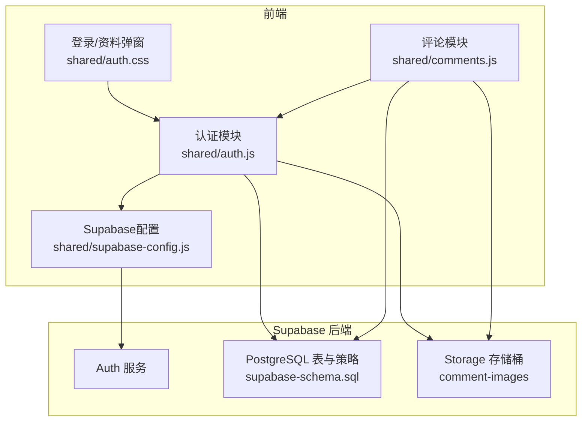
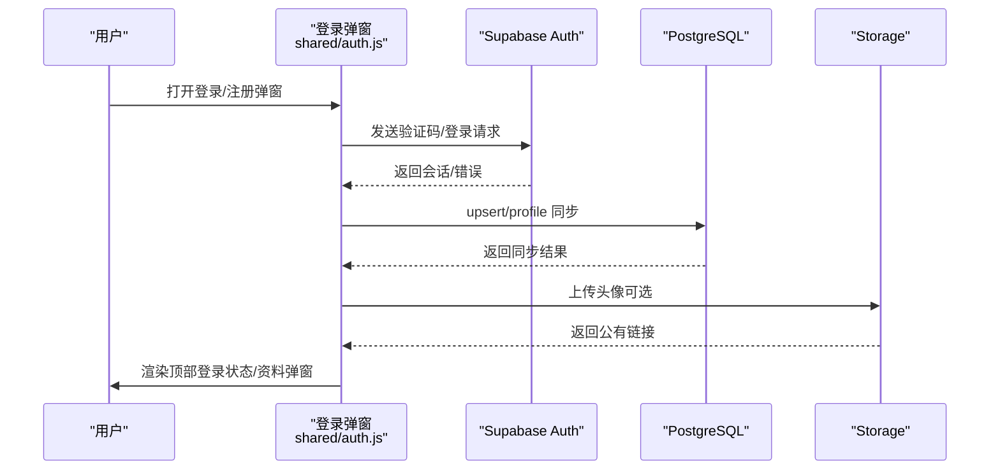
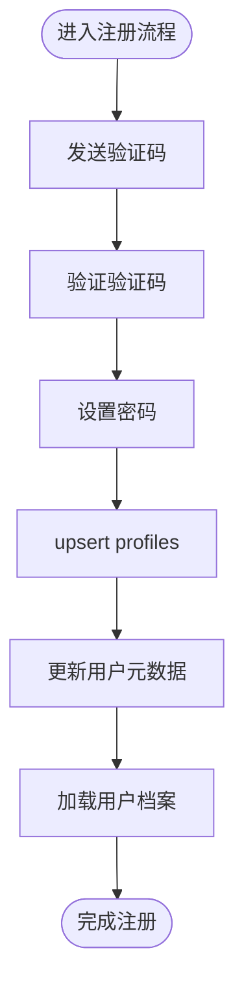
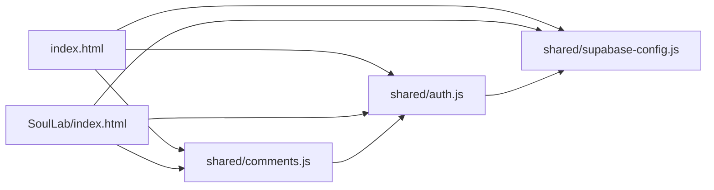

# 认证系统

<cite>
**本文引用的文件**
- [shared/auth.js](file://shared/auth.js)
- [shared/supabase-config.js](file://shared/supabase-config.js)
- [shared/auth.css](file://shared/auth.css)
- [shared/comments.js](file://shared/comments.js)
- [supabase-schema.sql](file://supabase-schema.sql)
- [supabase-community-upgrade.sql](file://supabase-community-upgrade.sql)
- [supabase-repair.sql](file://supabase-repair.sql)
- [index.html](file://index.html)
- [SoulLab/index.html](file://SoulLab/index.html)
</cite>

## 目录
1. [简介](#简介)
2. [项目结构](#项目结构)
3. [核心组件](#核心组件)
4. [架构总览](#架构总览)
5. [详细组件分析](#详细组件分析)
6. [依赖关系分析](#依赖关系分析)
7. [性能考量](#性能考量)
8. [故障排查指南](#故障排查指南)
9. [结论](#结论)
10. [附录](#附录)

## 简介
本认证系统基于 Supabase Auth 与 Storage 构建，提供邮箱+验证码的一次性登录与邮箱+密码的常规登录两种路径；支持用户资料与头像管理（含默认头像、emoji 头像与自定义图片上传），并在前端通过本地状态与 Supabase 同步实现会话持久化与 UI 实时更新。系统同时配合 Supabase 数据库的 RLS 策略与存储策略，确保权限控制与资源访问安全。

## 项目结构
认证系统主要由以下部分组成：
- Supabase 初始化与全局配置：负责创建 Supabase 客户端实例并暴露统一访问入口。
- 认证模块：封装登录、注册（验证码）、密码重置、会话监听、资料同步、头像处理等能力。
- UI 模板与样式：提供登录弹窗、资料编辑弹窗、顶部登录状态栏等交互界面。
- 评论模块：复用认证状态进行评论发布、点赞等操作。
- 数据库与策略：定义 profiles、comments、comment_likes 等表及 RLS 策略，并在升级脚本中完善字段与索引。

图表来源
- [shared/auth.js:948-986](file://shared/auth.js#L948-L986)
- [shared/supabase-config.js:5-25](file://shared/supabase-config.js#L5-L25)
- [shared/auth.css:1-462](file://shared/auth.css#L1-L462)
- [shared/comments.js:1-579](file://shared/comments.js#L1-L579)
- [supabase-schema.sql:1-97](file://supabase-schema.sql#L1-L97)

章节来源
- [shared/auth.js:1-1470](file://shared/auth.js#L1-L1470)
- [shared/supabase-config.js:1-26](file://shared/supabase-config.js#L1-L26)
- [shared/auth.css:1-462](file://shared/auth.css#L1-L462)
- [shared/comments.js:1-579](file://shared/comments.js#L1-L579)
- [supabase-schema.sql:1-97](file://supabase-schema.sql#L1-L97)

## 核心组件
- Supabase 初始化与客户端
  - 在全局作用域初始化 Supabase 客户端，提供 window.supabaseClient 与兼容旧模块的 window.db 访问路径。
  - 提供统一的 getAuthClient() 辅助函数，优先使用 supabase.auth，其次尝试 window.supabaseClient.auth 或 window.db.auth。
- 认证服务（AuthService）
  - 会话状态管理：维护 currentUser、currentProfile，并通过订阅者通知 UI 更新。
  - 登录/注册流程：支持邮箱+密码登录与邮箱+验证码注册；注册流程包含验证码发送、校验与资料同步。
  - 密码重置：通过 Supabase 发送重置链接并更新用户密码。
  - 资料与头像：生成默认昵称、头像标准化与存储、头像预览与上传、头像字段兼容（avatar_url/avatar/avatar_emoji）。
  - 错误处理：统一消息归一化与超时控制，增强用户体验。
- UI 组件（AuthUI）
  - 登录弹窗、注册验证码区域、忘记密码、资料编辑弹窗、顶部登录状态栏渲染。
  - 事件绑定与交互逻辑（切换模式、提交表单、头像选择、文件上传、保存资料、退出登录）。
- 评论模块（comments.js）
  - 依赖认证状态进行评论发布、回复、点赞等；若未登录则引导打开登录弹窗。
- 数据库与策略
  - profiles 表与触发器自动创建用户档案；RLS 策略限制读写范围。
  - comments 表与 comment_likes 表的 RLS 策略，支持公开读取、仅本人删除、管理员全权操作。
  - Storage 存储桶 comment-images 的上传与公开读策略。

章节来源
- [shared/supabase-config.js:5-25](file://shared/supabase-config.js#L5-L25)
- [shared/auth.js:35-40](file://shared/auth.js#L35-L40)
- [shared/auth.js:419-801](file://shared/auth.js#L419-L801)
- [shared/auth.js:803-848](file://shared/auth.js#L803-L848)
- [shared/auth.js:948-1056](file://shared/auth.js#L948-L1056)
- [shared/comments.js:1-579](file://shared/comments.js#L1-L579)
- [supabase-schema.sql:6-40](file://supabase-schema.sql#L6-L40)
- [supabase-schema.sql:42-81](file://supabase-schema.sql#L42-L81)
- [supabase-schema.sql:83-97](file://supabase-schema.sql#L83-L97)

## 架构总览
认证系统采用“前端模块 + Supabase 后端”的分层架构：
- 前端模块
  - shared/auth.js：集中处理认证业务逻辑与状态管理。
  - shared/auth.css：提供认证相关 UI 样式。
  - shared/comments.js：复用认证状态进行评论与点赞。
  - shared/supabase-config.js：初始化 Supabase 客户端并暴露统一访问入口。
- 后端服务
  - Supabase Auth：提供用户认证、会话管理、密码重置、OTP 验证等。
  - PostgreSQL：存储 profiles、comments、comment_likes 等数据，启用 RLS 策略。
  - Storage：提供公共可读的评论图片存储桶。

图表来源
- [shared/auth.js:522-677](file://shared/auth.js#L522-L677)
- [shared/auth.js:923-1056](file://shared/auth.js#L923-L1056)
- [shared/auth.js:703-717](file://shared/auth.js#L703-L717)

章节来源
- [shared/auth.js:522-677](file://shared/auth.js#L522-L677)
- [shared/auth.js:923-1056](file://shared/auth.js#L923-L1056)

## 详细组件分析

### Supabase 初始化与客户端
- 初始化逻辑
  - 若未检测到 Supabase SDK，则记录错误并置空客户端。
  - 使用提供的 URL 与 ANON KEY 创建客户端实例，并向 window 暴露 supabaseClient 与 db。
- 访问路径
  - getAuthClient() 优先级：supabase.auth → window.supabaseClient.auth → window.db.auth → null。

章节来源
- [shared/supabase-config.js:5-25](file://shared/supabase-config.js#L5-L25)
- [shared/auth.js:35-40](file://shared/auth.js#L35-L40)

### 认证服务（AuthService）
- 会话状态
  - currentUser、currentProfile 本地缓存，配合 onAuthStateChange 监听 Supabase 会话变化。
  - 通过 notify/subscribe 将状态变更推送给 UI 组件。
- 登录与注册
  - 邮箱+密码登录：调用 Supabase signInWithPassword，成功后同步资料并加载用户档案。
  - 邮箱+验证码注册：sendOtp 发送验证码，submitAuthForm 验证并完成注册、设置密码、同步资料。
- 密码重置
  - sendResetLink 发送重置链接，resetPassword 更新用户密码并清理 auth_action 参数。
- 资料与头像
  - 默认昵称生成、头像标准化（emoji/URL）、头像字段兼容（avatar_url/avatar/avatar_emoji）。
  - 保存资料时，若上传图片则写入 Storage 并获取公有链接，随后更新用户元数据与 profiles。
- 错误处理与超时
  - normalizeAuthErrorMessage 对常见错误进行友好提示。
  - withTimeout 包裹关键异步操作，避免长时间阻塞 UI。

图表来源
- [shared/auth.js:522-677](file://shared/auth.js#L522-L677)
- [shared/auth.js:923-1056](file://shared/auth.js#L923-L1056)

章节来源
- [shared/auth.js:419-801](file://shared/auth.js#L419-L801)
- [shared/auth.js:923-1056](file://shared/auth.js#L923-L1056)

### UI 组件（AuthUI 与模板）
- 登录弹窗
  - 支持登录/注册双模式切换，注册模式显示验证码区域与发送按钮。
  - 输入联动与提交状态控制，密码可见性切换。
- 资料编辑弹窗
  - 头像预览（emoji/图片）、emoji 选择网格、文件上传限制与预览。
- 顶部登录状态栏
  - 未登录显示登录按钮，已登录显示头像与昵称，点击进入资料编辑弹窗。
- 事件绑定
  - 打开/关闭弹窗、切换模式、提交表单、保存资料、退出登录等。

章节来源
- [shared/auth.js:292-417](file://shared/auth.js#L292-L417)
- [shared/auth.js:803-848](file://shared/auth.js#L803-L848)
- [shared/auth.js:1059-1098](file://shared/auth.js#L1059-L1098)
- [shared/auth.css:1-462](file://shared/auth.css#L1-L462)

### 评论模块（comments.js）
- 依赖认证状态
  - 未登录时打开登录弹窗；登录后允许发布评论、回复、点赞。
- 图片上传
  - 上传至 Storage comment-images，生成公有链接并写入数据库。
- 错误处理
  - 针对评论表结构缺失给出明确提示。

章节来源
- [shared/comments.js:1-579](file://shared/comments.js#L1-L579)

### 数据库与策略（supabase-schema.sql）
- profiles 表
  - 主键为 auth.users 的外键，启用 RLS。
  - 策略：公开读取、本人更新/插入。
  - 触发器：auth.users 插入后自动创建 profile。
- comments 表
  - 启用 RLS；公开读取未隐藏评论；登录用户可发表与删除自己的评论。
  - 管理员可读取全部、隐藏与删除评论。
- Storage
  - comment-images 存储桶；登录用户可上传，公开可读。

章节来源
- [supabase-schema.sql:6-40](file://supabase-schema.sql#L6-L40)
- [supabase-schema.sql:42-81](file://supabase-schema.sql#L42-L81)
- [supabase-schema.sql:83-97](file://supabase-schema.sql#L83-L97)

### 升级与修复脚本
- supabase-community-upgrade.sql
  - 添加评论回复字段、评论点赞表与索引，规范化昵称唯一性，完善 RLS 策略。
- supabase-repair.sql
  - 修复缺失的管理员策略与存储策略，确保系统一致性。

章节来源
- [supabase-community-upgrade.sql:1-77](file://supabase-community-upgrade.sql#L1-L77)
- [supabase-repair.sql:129-183](file://supabase-repair.sql#L129-L183)

## 依赖关系分析
- 模块耦合
  - shared/auth.js 依赖 shared/supabase-config.js 获取 Supabase 客户端。
  - shared/comments.js 依赖 shared/auth.js 的认证状态与弹窗控制。
  - shared/auth.js 依赖 Supabase Auth、PostgreSQL 与 Storage。
- 外部依赖
  - @supabase/supabase-js CDN 提供 SDK。
  - HTML 页面通过 script 标签引入配置与模块脚本。

图表来源
- [index.html:1-800](file://index.html#L1-L800)
- [SoulLab/index.html:1-271](file://SoulLab/index.html#L1-L271)
- [shared/supabase-config.js:5-25](file://shared/supabase-config.js#L5-L25)
- [shared/auth.js:1-1470](file://shared/auth.js#L1-L1470)
- [shared/comments.js:1-579](file://shared/comments.js#L1-L579)

章节来源
- [index.html:1-800](file://index.html#L1-L800)
- [SoulLab/index.html:1-271](file://SoulLab/index.html#L1-L271)
- [shared/supabase-config.js:5-25](file://shared/supabase-config.js#L5-L25)
- [shared/auth.js:1-1470](file://shared/auth.js#L1-L1470)
- [shared/comments.js:1-579](file://shared/comments.js#L1-L579)

## 性能考量
- 超时控制
  - 关键网络请求均包裹 withTimeout，避免长时间阻塞 UI。
- 异步并发
  - Promise.allSettled 并发执行资料同步与用户元数据更新，提升响应速度。
- 头像上传
  - 上传前进行文件大小限制与预览释放，减少内存占用。
- RLS 与索引
  - 通过 RLS 与索引优化查询性能，降低前端轮询成本。

[本节为通用指导，无需具体文件分析]

## 故障排查指南
- 常见错误与处理
  - 认证模块初始化失败：检查 Supabase SDK 是否加载成功。
  - 邮件发送频率限制/超时：等待冷却时间或更换邮箱。
  - 验证码无效/过期：重新获取验证码。
  - 密码强度不足：至少满足最小长度要求。
  - 资料同步/读取超时：刷新页面重试。
  - 用户已注册：直接登录。
- 锁竞争错误
  - resetPassword 对锁竞争进行特殊处理，避免因并发更新导致失败。
- Schema 缺失字段
  - 自动探测 profiles 头像字段并回退兼容，保证功能可用。

章节来源
- [shared/auth.js:115-147](file://shared/auth.js#L115-L147)
- [shared/auth.js:287-290](file://shared/auth.js#L287-L290)
- [shared/auth.js:195-232](file://shared/auth.js#L195-L232)
- [shared/auth.js:757-781](file://shared/auth.js#L757-L781)

## 结论
该认证系统以 Supabase 为核心，结合前端模块化设计与数据库 RLS 策略，实现了安全、易用且可扩展的身份验证与授权机制。通过统一的错误归一化、超时控制与头像兼容策略，系统在复杂场景下仍保持良好的用户体验与稳定性。配合评论模块与存储策略，形成从前端交互到后端数据的完整闭环。

[本节为总结性内容，无需具体文件分析]

## 附录
- 安全最佳实践
  - 使用 Supabase Auth 的内置策略与 RLS，避免在前端硬编码权限判断。
  - 对用户输入进行最小必要验证，结合 Supabase 后端约束。
  - 严格控制 Storage 的上传与读取策略，防止未授权访问。
- 权限控制机制
  - profiles：公开读取、本人更新/插入。
  - comments：公开读取未隐藏、登录用户发表与删除、管理员全权。
  - Storage：登录用户上传、公开读取。
- 会话超时处理
  - 前端通过 onAuthStateChange 监听会话变化，自动同步状态并提示用户重新登录。

章节来源
- [supabase-schema.sql:15-21](file://supabase-schema.sql#L15-L21)
- [supabase-schema.sql:56-81](file://supabase-schema.sql#L56-L81)
- [supabase-schema.sql:89-97](file://supabase-schema.sql#L89-L97)
- [shared/auth.js:973-985](file://shared/auth.js#L973-L985)