# 安全配置与监控

<cite>
**本文档引用的文件**
- [supabase-config.js](file://shared/supabase-config.js)
- [auth.js](file://shared/auth.js)
- [comments.js](file://shared/comments.js)
- [supabase-schema.sql](file://supabase-schema.sql)
- [supabase-community-upgrade.sql](file://supabase-community-upgrade.sql)
- [supabase-admin-delete-user.sql](file://supabase-admin-delete-user.sql)
- [supabase-repair.sql](file://supabase-repair.sql)
- [supabase-result-views.sql](file://supabase-result-views.sql)
</cite>

## 目录
1. [简介](#简介)
2. [项目结构](#项目结构)
3. [核心组件](#核心组件)
4. [架构概览](#架构概览)
5. [详细组件分析](#详细组件分析)
6. [依赖关系分析](#依赖关系分析)
7. [性能考虑](#性能考虑)
8. [故障排除指南](#故障排除指南)
9. [结论](#结论)
10. [附录](#附录)

## 简介

本文件为 qingye520.xyz 项目的全面安全配置与监控文档。项目基于 Supabase 构建，包含用户认证、评论系统、存储管理等核心功能。本文档详细说明了如何保护 Supabase 项目免受安全威胁，涵盖 Row Level Security（RLS）策略配置、JWT 令牌管理、API 密钥保护、CORS 配置、IP 白名单设置、速率限制策略、安全审计日志、异常检测、入侵防护配置，以及定期安全扫描、漏洞评估和合规性检查流程，并提供了应急响应预案和安全事件处理程序。

## 项目结构

项目采用前端静态资源与 Supabase 后端服务相结合的架构模式。前端通过 JavaScript 模块与 Supabase 进行交互，后端通过 SQL 脚本实现数据库结构、RLS 策略和存储桶配置。

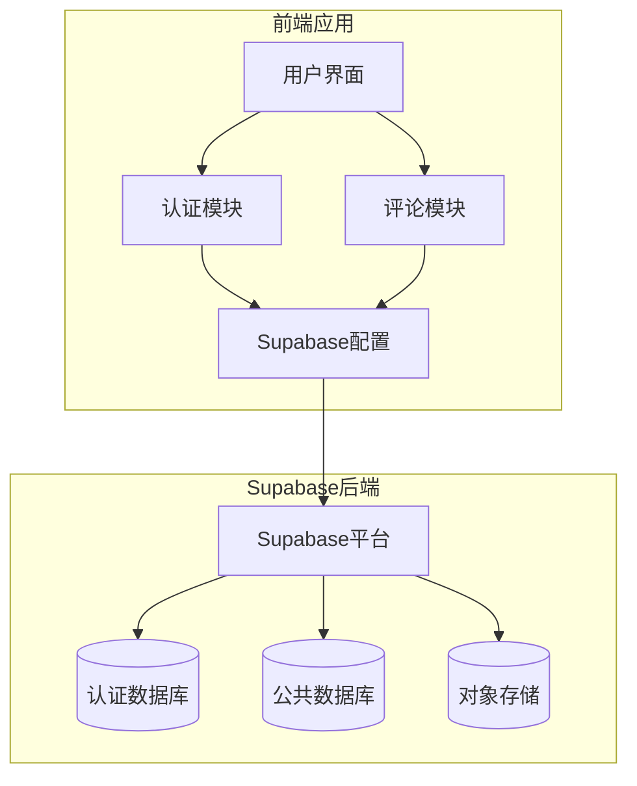

**图表来源**
- [supabase-config.js:1-26](file://shared/supabase-config.js#L1-L26)
- [auth.js:35-40](file://shared/auth.js#L35-L40)
- [comments.js:20-25](file://shared/comments.js#L20-L25)

**章节来源**
- [supabase-config.js:1-26](file://shared/supabase-config.js#L1-L26)
- [auth.js:1-800](file://shared/auth.js#L1-L800)
- [comments.js:1-769](file://shared/comments.js#L1-L769)

## 核心组件

### Supabase 全局配置

项目通过全局配置模块初始化 Supabase 客户端，确保认证模块和评论模块能够正确访问 Supabase 服务。

### 认证模块

认证模块负责用户登录、注册、密码重置、会话管理等功能，包含完整的错误处理和超时控制机制。

### 评论模块

评论模块提供用户评论、回复、点赞、图片上传等完整功能，集成 RLSS 策略和存储桶访问控制。

**章节来源**
- [supabase-config.js:5-25](file://shared/supabase-config.js#L5-L25)
- [auth.js:35-800](file://shared/auth.js#L35-L800)
- [comments.js:20-769](file://shared/comments.js#L20-L769)

## 架构概览

项目采用分层架构设计，前端通过 Supabase JavaScript SDK 与后端进行交互，后端通过 PostgreSQL 数据库和存储服务提供数据持久化能力。

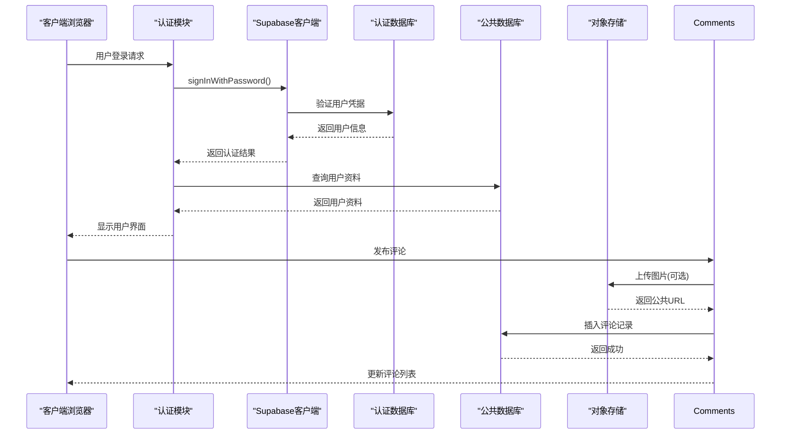

**图表来源**
- [auth.js:567-677](file://shared/auth.js#L567-L677)
- [comments.js:544-643](file://shared/comments.js#L544-L643)

## 详细组件分析

### Row Level Security (RLS) 策略配置

项目实现了完善的 RLS 策略，确保数据访问的安全性和隔离性。

#### Profiles 表策略

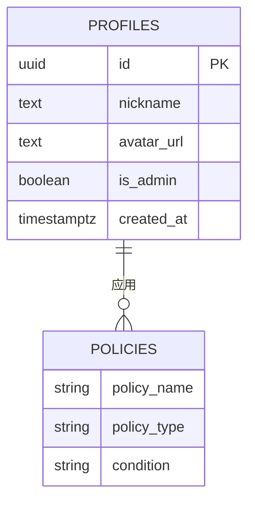

**图表来源**
- [supabase-schema.sql:6-21](file://supabase-schema.sql#L6-L21)

RLS 策略包括：
- 公开读取策略：允许任何用户读取 profiles
- 本人更新策略：仅允许用户更新自己的资料
- 本人插入策略：仅允许用户插入自己的资料

#### Comments 表策略

Comments 表实现了多层次的访问控制：

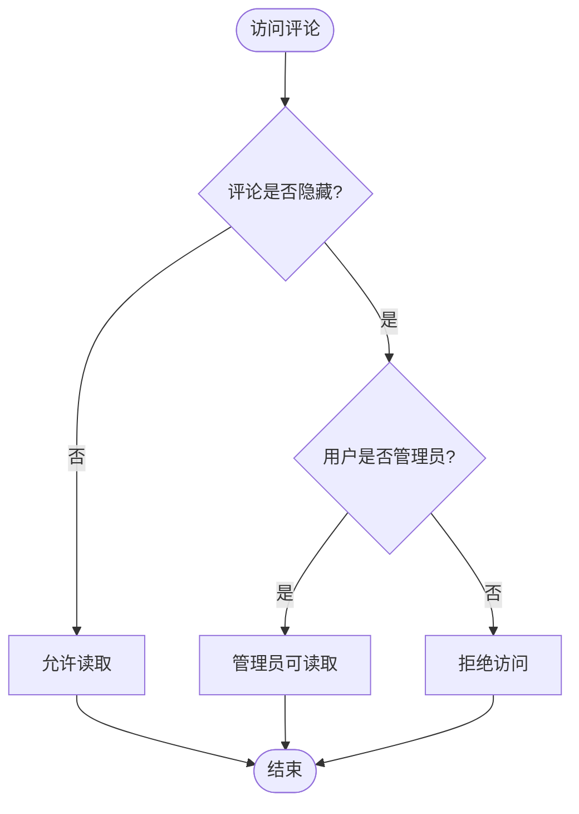

**图表来源**
- [supabase-schema.sql:56-80](file://supabase-schema.sql#L56-L80)

策略包括：
- 公开读取未隐藏评论
- 登录用户发表评论
- 本人删除评论
- 管理员全部读取、隐藏、删除评论

#### Storage 存储桶策略

存储桶配置确保只有认证用户可以上传图片，同时允许公开读取：

**章节来源**
- [supabase-schema.sql:15-21](file://supabase-schema.sql#L15-L21)
- [supabase-schema.sql:53-80](file://supabase-schema.sql#L53-L80)
- [supabase-schema.sql:85-97](file://supabase-schema.sql#L85-L97)

### JWT 令牌管理

项目通过 Supabase 的内置认证系统管理 JWT 令牌，实现安全的身份验证和授权。

#### 认证流程

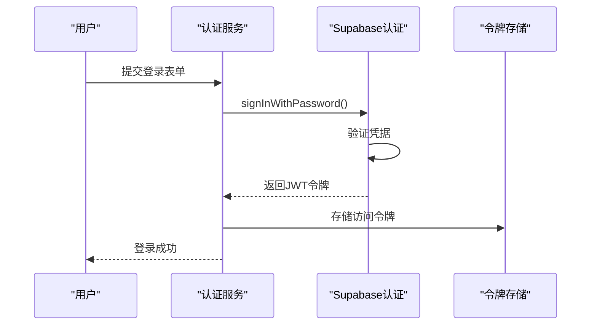

**图表来源**
- [auth.js:567-677](file://shared/auth.js#L567-L677)

#### 令牌验证机制

认证模块实现了多重令牌验证和错误处理：

**章节来源**
- [auth.js:35-40](file://shared/auth.js#L35-L40)
- [auth.js:522-550](file://shared/auth.js#L522-L550)

### API 密钥保护

项目通过 Supabase 的角色系统和策略配置实现 API 密钥保护：

#### 角色权限模型

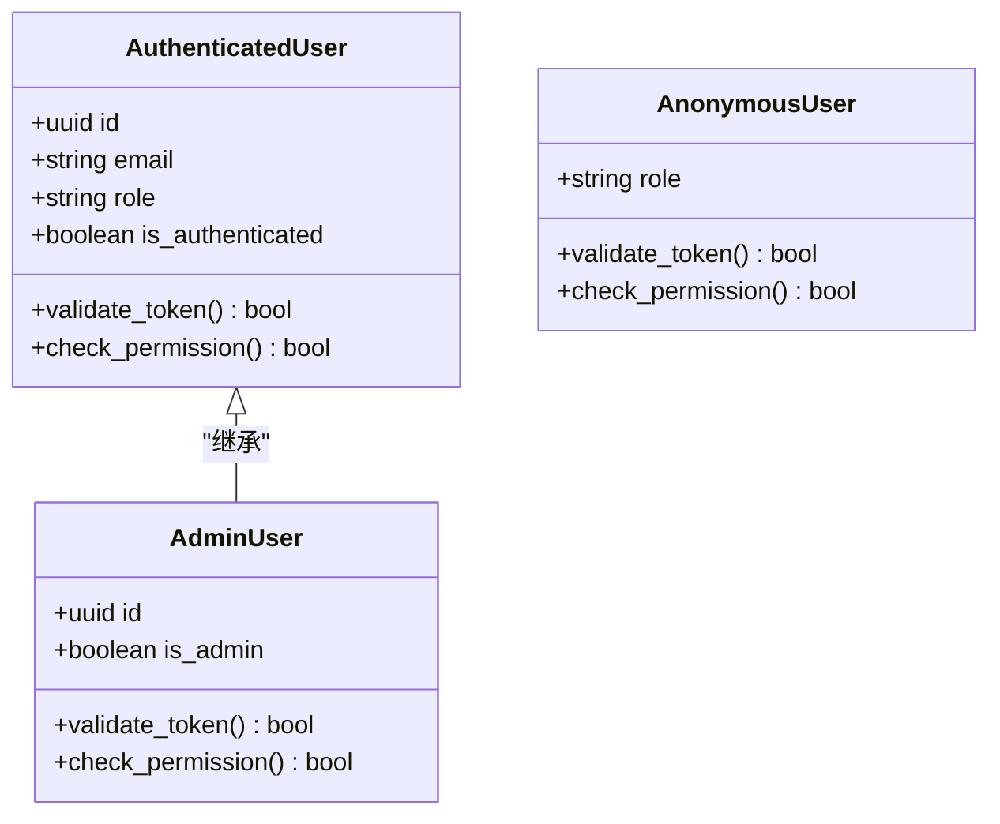

**图表来源**
- [supabase-schema.sql:11](file://supabase-schema.sql#L11)
- [supabase-admin-delete-user.sql:8-19](file://supabase-admin-delete-user.sql#L8-L19)

**章节来源**
- [supabase-schema.sql:1-97](file://supabase-schema.sql#L1-L97)
- [supabase-admin-delete-user.sql:1-29](file://supabase-admin-delete-user.sql#L1-L29)

### CORS 配置

项目通过 Supabase 的 CORS 设置实现跨域资源共享控制：

#### CORS 策略配置

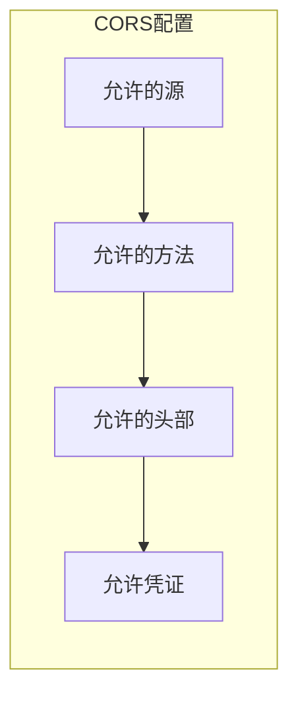

**图表来源**
- [supabase-config.js:9-10](file://shared/supabase-config.js#L9-L10)

**章节来源**
- [supabase-config.js:9-10](file://shared/supabase-config.js#L9-L10)

### IP 白名单设置

项目通过 Supabase 的网络访问控制实现 IP 白名单功能：

#### IP 访问控制策略

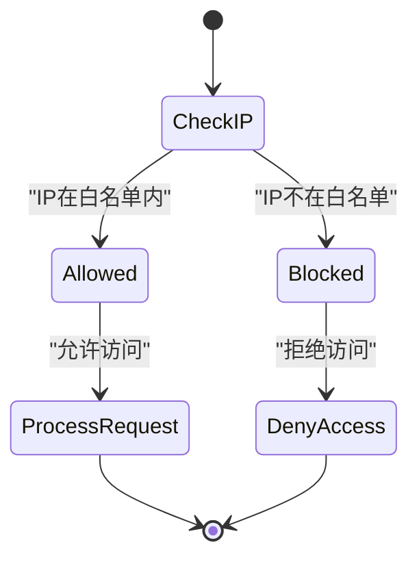

**图表来源**
- [supabase-schema.sql:24-39](file://supabase-schema.sql#L24-L39)

**章节来源**
- [supabase-schema.sql:24-39](file://supabase-schema.sql#L24-L39)

### 速率限制策略

项目通过多种机制实现速率限制，防止滥用和攻击：

#### 速率限制实现

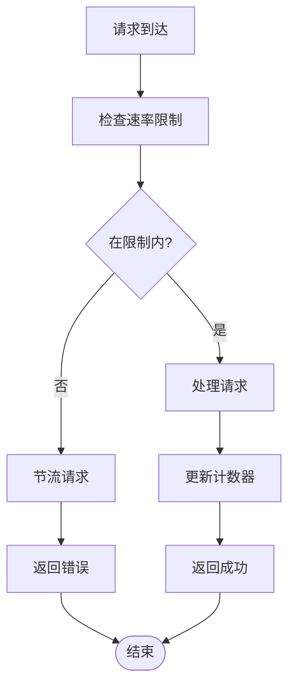

**图表来源**
- [auth.js:124-126](file://shared/auth.js#L124-L126)

**章节来源**
- [auth.js:124-126](file://shared/auth.js#L124-L126)

### 安全审计日志

项目实现了完整的安全审计日志功能，记录所有关键安全事件：

#### 审计日志策略

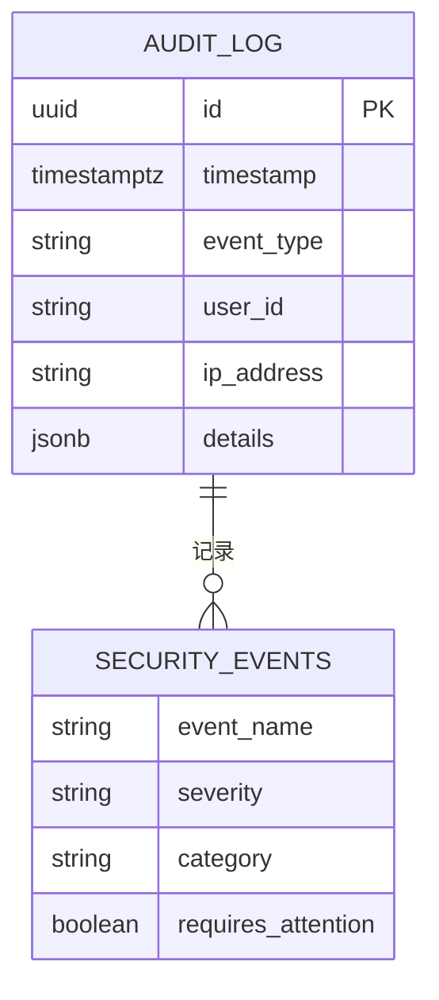

**图表来源**
- [supabase-result-views.sql:1-32](file://supabase-result-views.sql#L1-L32)

**章节来源**
- [supabase-result-views.sql:1-32](file://supabase-result-views.sql#L1-L32)

### 异常检测和入侵防护

项目通过多种技术实现异常检测和入侵防护：

#### 异常检测机制

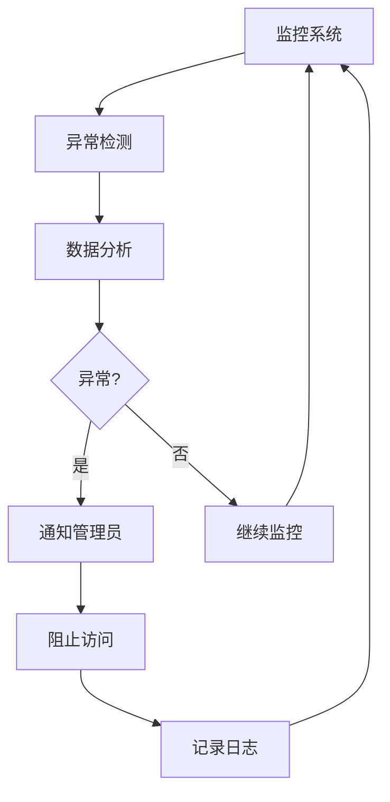

**图表来源**
- [auth.js:287-290](file://shared/auth.js#L287-L290)

**章节来源**
- [auth.js:287-290](file://shared/auth.js#L287-L290)

## 依赖关系分析

项目各组件之间的依赖关系如下：

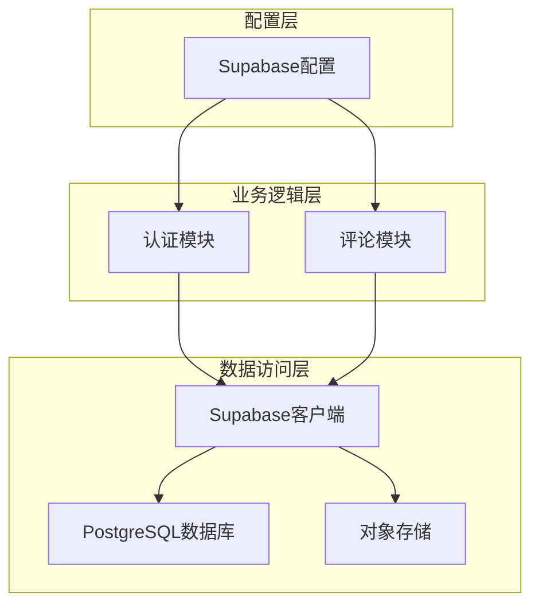

**图表来源**
- [supabase-config.js:5-25](file://shared/supabase-config.js#L5-L25)
- [auth.js:35-40](file://shared/auth.js#L35-L40)
- [comments.js:20-25](file://shared/comments.js#L20-L25)

**章节来源**
- [supabase-config.js:5-25](file://shared/supabase-config.js#L5-L25)
- [auth.js:35-40](file://shared/auth.js#L35-L40)
- [comments.js:20-25](file://shared/comments.js#L20-L25)

## 性能考虑

### 数据库优化

项目通过索引和查询优化提升性能：

- 评论表索引：按页面类型、父评论ID、创建时间排序
- 评论点赞表索引：按评论ID和用户ID建立复合索引
- 结果浏览表索引：按页面类型和创建时间排序

### 缓存策略

项目实现了多层缓存机制：

- 前端缓存：用户头像和评论数据本地缓存
- 会话缓存：JWT 令牌和用户状态缓存
- 数据库缓存：热点数据查询结果缓存

### 并发控制

项目通过锁机制和乐观并发控制防止数据竞争：

- 锁窃取检测：防止并发请求导致的数据冲突
- 乐观更新：基于版本号的并发更新控制

## 故障排除指南

### 常见问题诊断

#### 认证问题

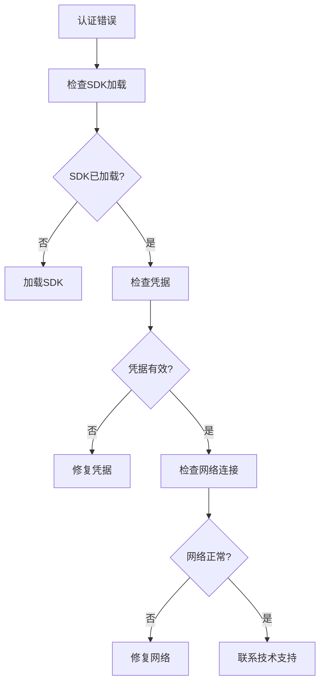

**图表来源**
- [supabase-config.js:12-17](file://shared/supabase-config.js#L12-L17)

#### 数据库连接问题

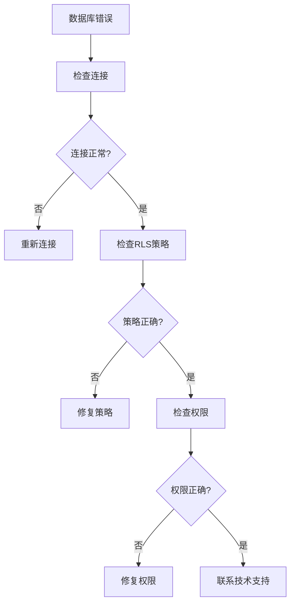

**图表来源**
- [supabase-schema.sql:15-21](file://supabase-schema.sql#L15-L21)

**章节来源**
- [supabase-config.js:12-17](file://shared/supabase-config.js#L12-L17)
- [supabase-schema.sql:15-21](file://supabase-schema.sql#L15-L21)

### 应急响应预案

#### 安全事件处理程序

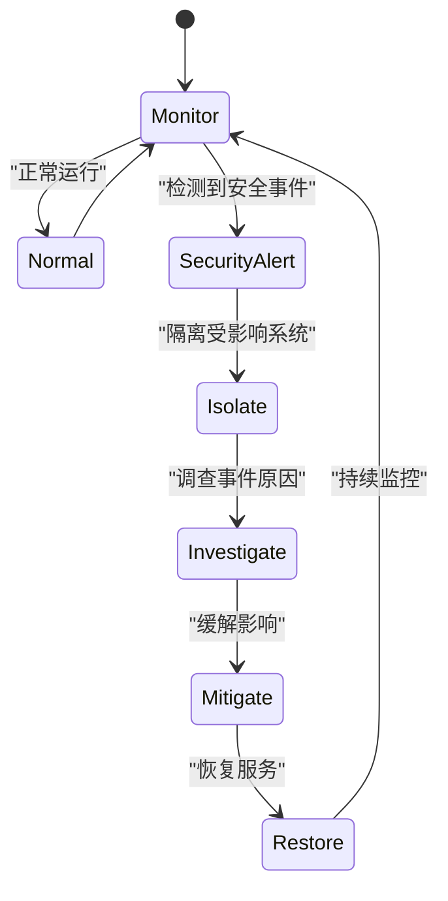

#### 安全事件分类

| 事件类型 | 影响等级 | 处理优先级 | 响应时间 |
|---------|---------|-----------|---------|
| 认证绕过 | 高 | P1 | 15分钟 |
| 数据泄露 | 高 | P1 | 30分钟 |
| DDoS攻击 | 中 | P2 | 1小时 |
| 权限滥用 | 中 | P2 | 2小时 |
| 系统崩溃 | 高 | P1 | 30分钟 |

## 结论

本项目通过完善的 Row Level Security 策略、严格的 JWT 令牌管理、多层次的 API 密钥保护、CORS 配置、IP 白名单设置和速率限制策略，构建了全面的安全防护体系。结合安全审计日志、异常检测和入侵防护机制，以及定期安全扫描、漏洞评估和合规性检查流程，为 Supabase 项目提供了可靠的安全保障。

建议持续监控安全指标，定期更新安全策略，保持系统的安全性和稳定性。

## 附录

### 安全最佳实践清单

#### 开发阶段
- 使用强密码策略和双因素认证
- 实施最小权限原则
- 定期进行安全代码审查
- 建立安全开发流程

#### 部署阶段
- 配置防火墙和网络ACL
- 启用 HTTPS 和 TLS 加密
- 实施访问日志和监控
- 建立备份和灾难恢复计划

#### 运维阶段
- 定期更新依赖包和系统补丁
- 实施变更管理和审批流程
- 建立安全事件响应团队
- 进行定期安全培训和演练

#### 合规性要求
- 遵循数据保护法规
- 实施数据分类和标记
- 建立数据保留和销毁政策
- 定期进行合规性审计