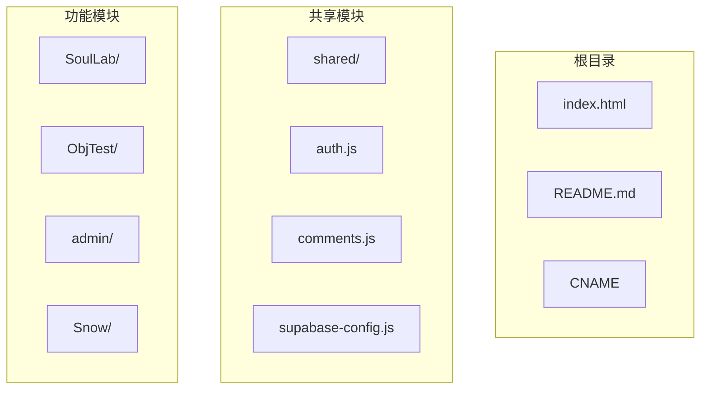
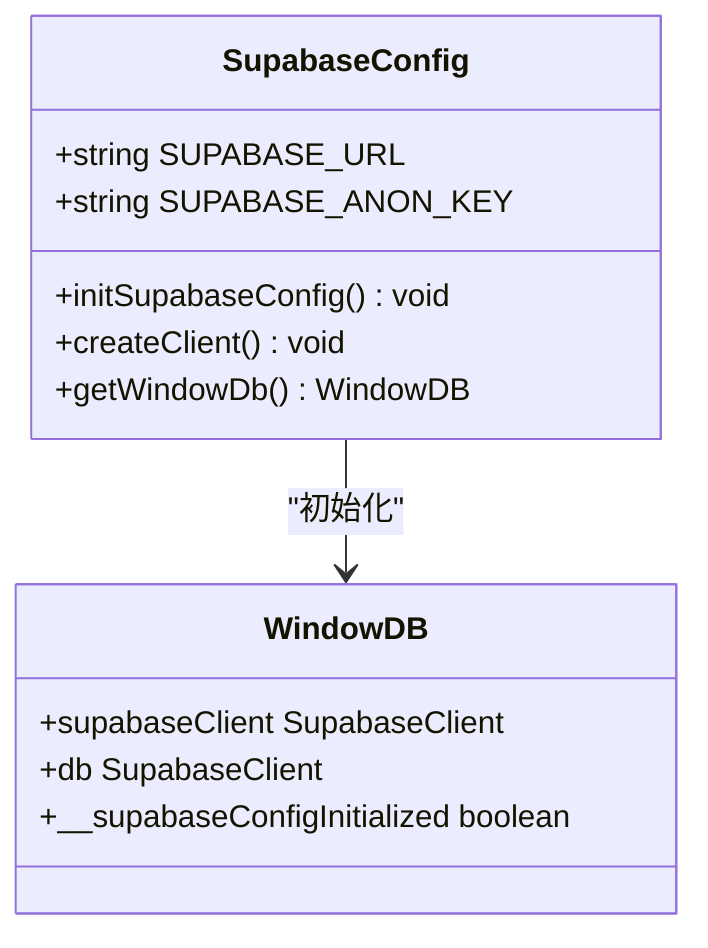
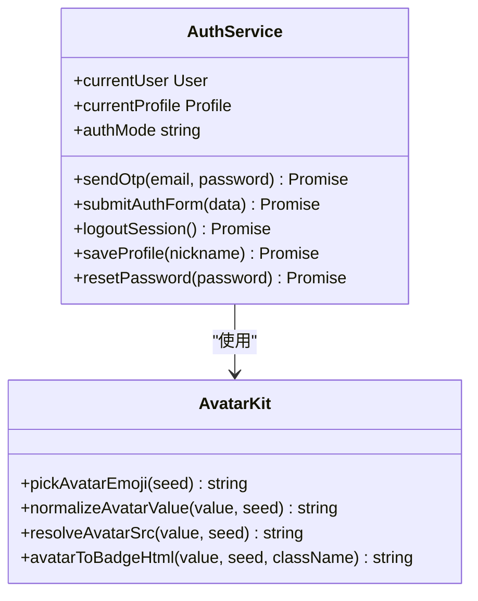
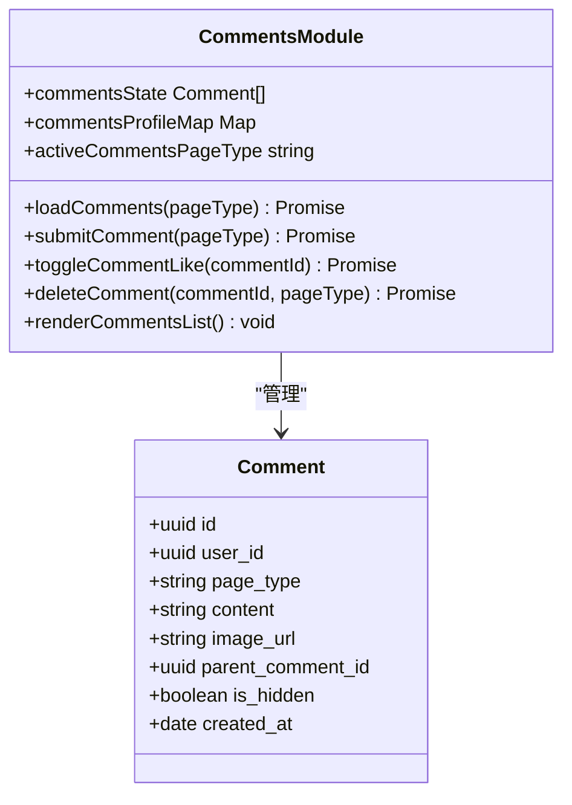
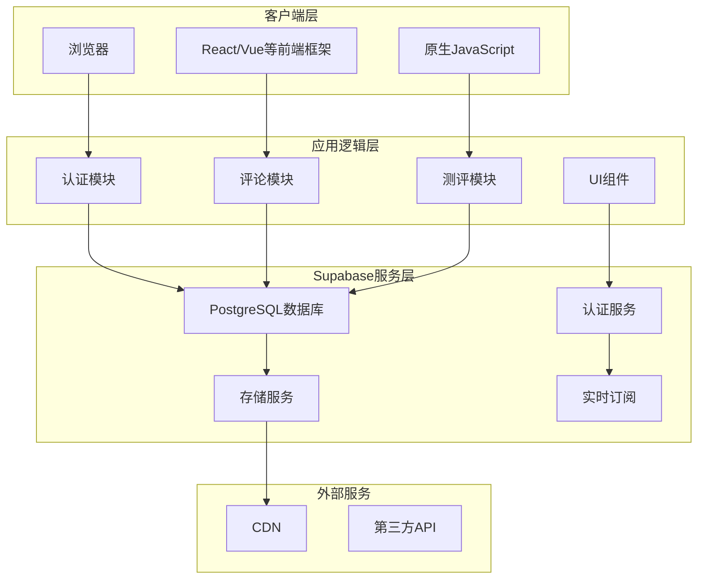
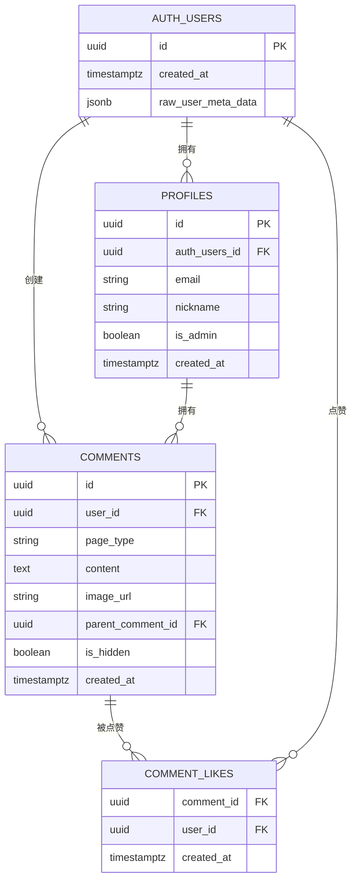
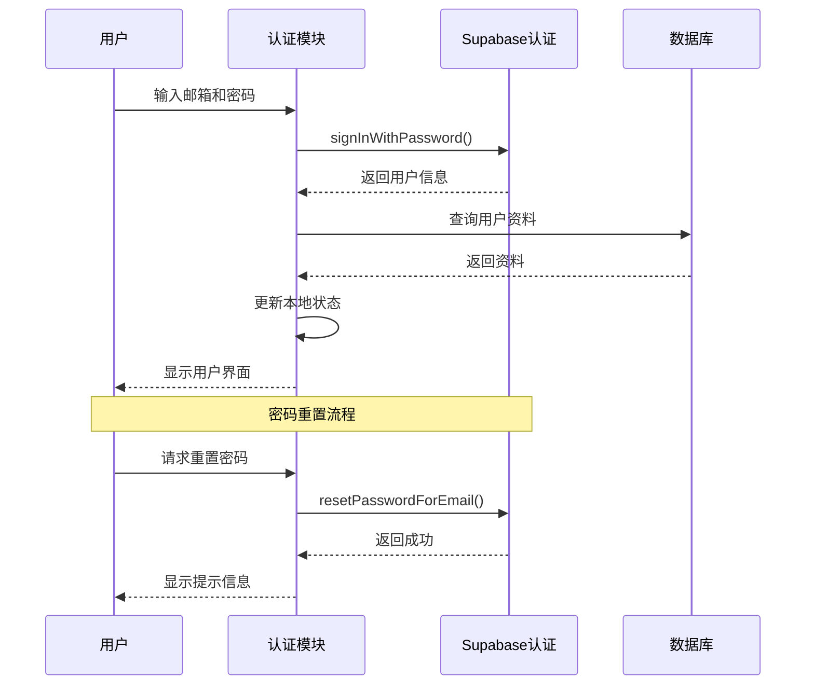
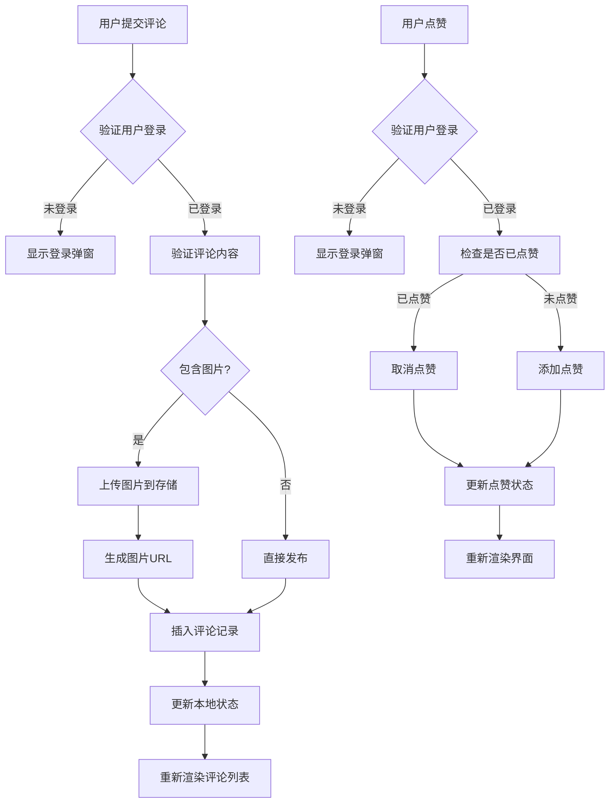
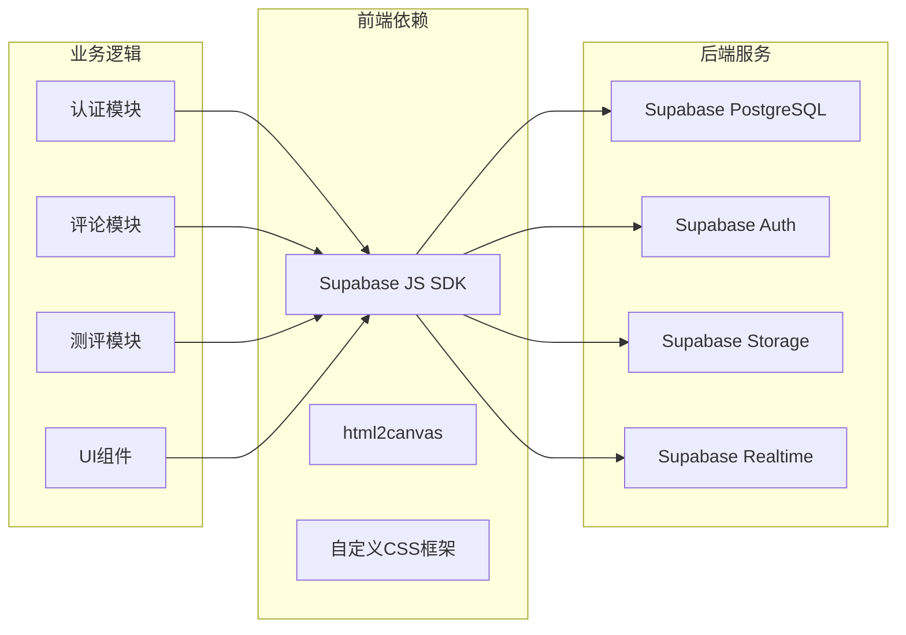

# 开发环境部署

<cite>
**本文档引用的文件**
- [index.html](file://index.html)
- [supabase-config.js](file://shared/supabase-config.js)
- [auth.js](file://shared/auth.js)
- [comments.js](file://shared/comments.js)
- [app.js (ObjTest)](file://ObjTest/app.js)
- [app.js (SoulLab)](file://SoulLab/app.js)
</cite>

## 更新摘要
**所做更改**
- 更新主页性能优化章节，反映星场画布优化、鼠标视差效果简化和CSS GPU优化
- 新增主页重构的技术细节说明
- 更新性能考虑部分以包含最新的优化策略
- 更新故障排除指南中的相关问题

## 目录
1. [简介](#简介)
2. [项目结构](#项目结构)
3. [核心组件](#核心组件)
4. [架构概览](#架构概览)
5. [详细组件分析](#详细组件分析)
6. [依赖关系分析](#依赖关系分析)
7. [性能考虑](#性能考虑)
8. [故障排除指南](#故障排除指南)
9. [结论](#结论)

## 简介

这是一个基于 Supabase 的全栈 Web 应用项目，包含觉醒诗社网站的核心功能。项目采用纯前端技术栈，通过 Supabase 提供的数据库、认证和存储服务实现完整的用户交互功能。

本项目主要包含以下核心功能：
- 用户认证系统（登录/注册/密码重置）
- 个性化用户资料管理
- 评论系统（支持图片上传和回复）
- 心理测评功能（客体化测试和灵魂实验室）
- 实时数据同步和响应式设计

## 项目结构

项目采用模块化的文件组织方式，主要分为以下几个部分：

**图表来源**
- [index.html](file://index.html)
- [supabase-config.js](file://shared/supabase-config.js)

**章节来源**
- [index.html](file://index.html)
- [supabase-config.js](file://shared/supabase-config.js)

## 核心组件

### Supabase 配置模块

项目使用全局 Supabase 配置模块来管理数据库连接和认证：

**图表来源**
- [supabase-config.js](file://shared/supabase-config.js)

### 认证系统模块

认证系统提供了完整的用户生命周期管理：

**图表来源**
- [auth.js](file://shared/auth.js)

### 评论系统模块

评论系统支持复杂的嵌套回复和图片上传功能：

**图表来源**
- [comments.js](file://shared/comments.js)

**章节来源**
- [supabase-config.js](file://shared/supabase-config.js)
- [auth.js](file://shared/auth.js)
- [comments.js](file://shared/comments.js)

## 架构概览

项目采用前后端分离的架构模式，前端通过 Supabase JavaScript SDK 与后端服务通信：

**图表来源**
- [auth.js](file://shared/auth.js)
- [comments.js](file://shared/comments.js)
- [supabase-config.js](file://shared/supabase-config.js)

## 详细组件分析

### 数据库架构设计

项目使用 PostgreSQL 作为主数据库，通过 Supabase 提供的 RLS（行级安全）策略实现数据隔离：

**图表来源**
- [supabase-schema.sql](file://supabase-schema.sql)
- [supabase-community-upgrade.sql](file://supabase-community-upgrade.sql)
- [supabase-result-views.sql](file://supabase-result-views.sql)

### 认证流程分析

**图表来源**
- [auth.js](file://shared/auth.js)

### 评论系统工作流程

**图表来源**
- [comments.js](file://shared/comments.js)

**章节来源**
- [supabase-schema.sql](file://supabase-schema.sql)
- [supabase-community-upgrade.sql](file://supabase-community-upgrade.sql)
- [supabase-result-views.sql](file://supabase-result-views.sql)
- [auth.js](file://shared/auth.js)
- [comments.js](file://shared/comments.js)

## 依赖关系分析

项目的主要依赖关系如下：

**图表来源**
- [supabase-config.js](file://shared/supabase-config.js)
- [auth.js](file://shared/auth.js)
- [comments.js](file://shared/comments.js)

**章节来源**
- [supabase-config.js](file://shared/supabase-config.js)
- [auth.js](file://shared/auth.js)
- [comments.js](file://shared/comments.js)

## 性能考虑

### 主页性能优化重构

**更新** 主页经历了重大性能优化重构，移除了复杂的视觉效果和动画系统，专注于核心体验优化。

#### 星空画布优化

1. **动态星数调节**
   - 移动端：80颗星星
   - 桌面端：150颗星星
   - 根据设备性能自动调整

2. **帧率控制**
   - 固定30FPS渲染节流
   - 页面隐藏时暂停渲染
   - 使用 requestAnimationFrame 优化

3. **渲染优化**
   - 对象池模式管理星星和流星
   - 减少DOM操作次数
   - 优化颜色计算和渐变

#### 鼠标视差效果简化

1. **平滑插值算法**
   - 使用数学插值替代复杂动画
   - 减少CPU占用
   - 优化性能表现

2. **GPU加速优化**
   - 使用 transform3d 替代复杂变换
   - 启用 will-change 属性
   - 优化CSS动画性能

#### CSS GPU优化

1. **硬件加速**
   - transform: translateZ(0)
   - backface-visibility: hidden
   - will-change: transform

2. **动画优化**
   - 使用CSS变量减少重排
   - 优化关键帧动画
   - 减少动画层数

### 数据库性能优化

1. **索引策略**
   - 评论表按 `page_type`、`parent_comment_id`、`created_at` 创建复合索引
   - 评论点赞表按 `comment_id` 和 `user_id` 创建索引
   - 用户昵称创建唯一索引确保唯一性

2. **查询优化**
   - 使用 LIMIT 限制返回结果数量
   - 通过 RLS 策略减少不必要的数据传输
   - 实现分页加载机制

3. **缓存策略**
   - 本地缓存用户会话信息
   - 缓存头像和图片资源
   - 实现乐观更新减少网络请求

### 前端性能优化

1. **资源加载**
   - 图片懒加载和预加载策略
   - CSS 和 JavaScript 按需加载
   - CDN 加速静态资源

2. **渲染优化**
   - 虚拟滚动处理大量评论
   - 组件级别的状态管理
   - 防抖和节流处理用户输入

**章节来源**
- [index.html](file://index.html)
- [supabase-config.js](file://shared/supabase-config.js)
- [auth.js](file://shared/auth.js)
- [comments.js](file://shared/comments.js)

## 故障排除指南

### 常见问题及解决方案

#### 1. 数据库连接问题

**症状**: 应用无法连接到 Supabase 数据库
**解决方案**:
- 检查 `SUPABASE_URL` 和 `SUPABASE_ANON_KEY` 配置
- 确认网络连接正常
- 验证 Supabase 项目状态

#### 2. 认证失败

**症状**: 用户登录或注册失败
**解决方案**:
- 检查邮箱格式和密码强度
- 确认邮箱验证流程
- 验证 Supabase Auth 配置

#### 3. 评论功能异常

**症状**: 评论无法发布或显示
**解决方案**:
- 执行 `supabase-community-upgrade.sql` 升级脚本
- 检查存储桶权限配置
- 验证 RLS 策略设置

#### 4. 图片上传失败

**症状**: 评论图片无法上传
**解决方案**:
- 检查存储桶 `comment-images` 配置
- 验证用户认证状态
- 确认文件大小限制

#### 5. 主页性能问题

**症状**: 主页加载缓慢或动画卡顿
**解决方案**:
- 检查浏览器性能监控
- 验证GPU加速是否启用
- 确认30FPS渲染节流正常工作
- 检查星场画布优化配置

**章节来源**
- [supabase-schema.sql](file://supabase-schema.sql)
- [supabase-community-upgrade.sql](file://supabase-community-upgrade.sql)
- [supabase-repair.sql](file://supabase-repair.sql)
- [index.html](file://index.html)

## 结论

本项目展示了如何使用 Supabase 构建完整的全栈 Web 应用。通过合理的数据库设计、完善的认证系统和丰富的前端功能，实现了高质量的用户体验。

### 主要优势

1. **开发效率高**: 使用 Supabase 减少了后端开发工作量
2. **安全性强**: 通过 RLS 策略和认证机制确保数据安全
3. **扩展性强**: 模块化设计便于功能扩展
4. **维护成本低**: 云服务托管减少了运维负担
5. **性能优化**: 主页重构后的显著性能提升

### 后续改进方向

1. **监控和日志**: 添加应用性能监控和错误追踪
2. **国际化**: 支持多语言界面
3. **移动端优化**: 针对移动设备的专门优化
4. **测试覆盖**: 增加自动化测试覆盖率
5. **性能监控**: 实时监控主页性能指标