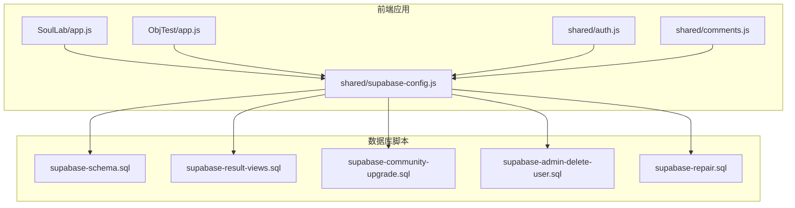
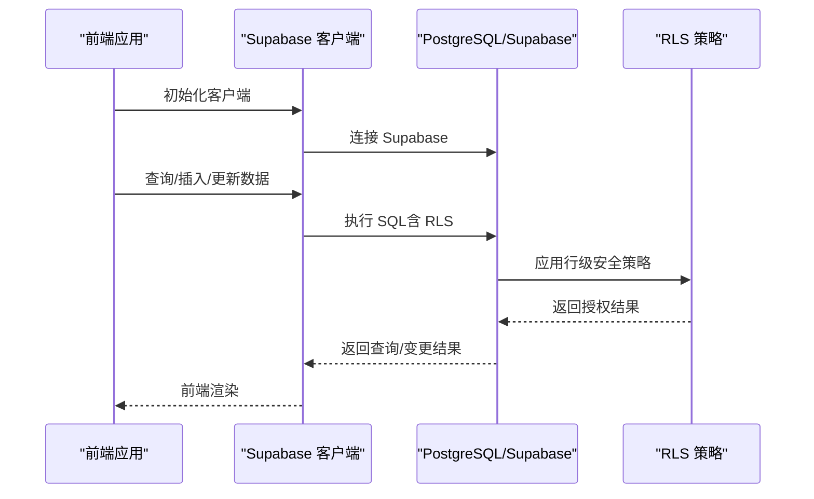
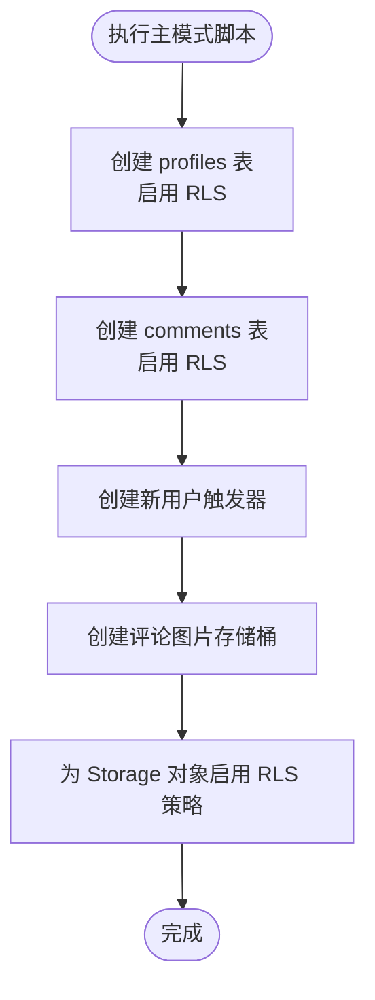
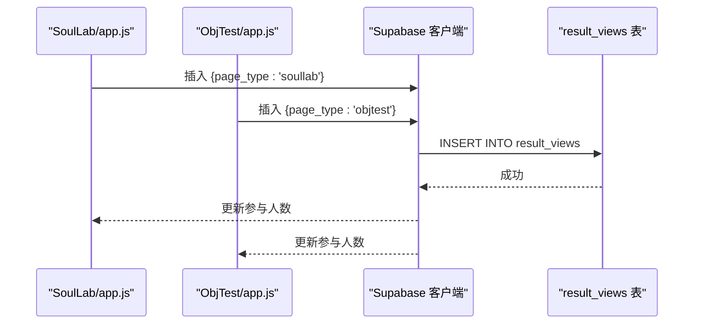
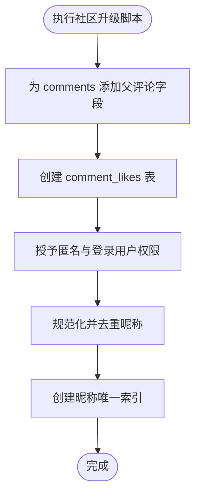
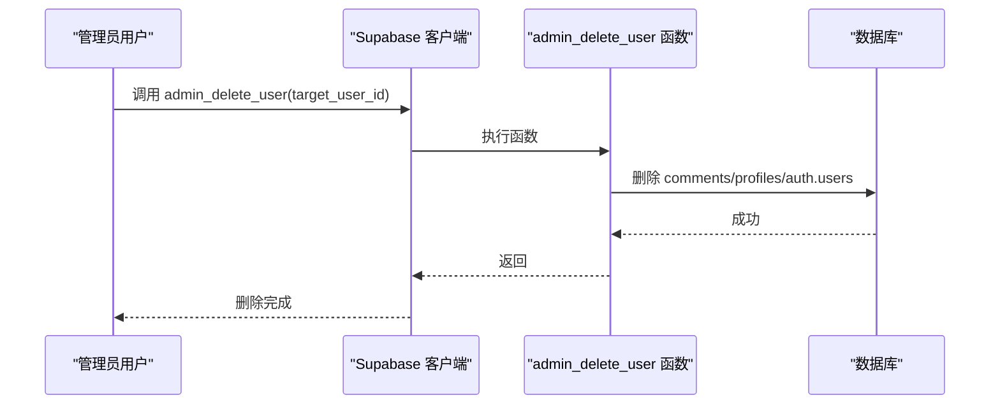
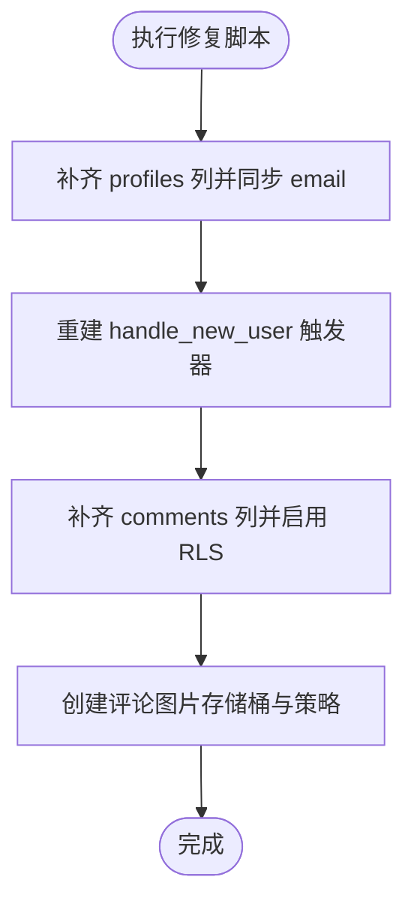
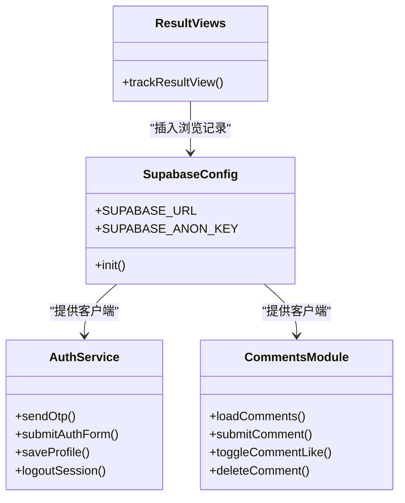
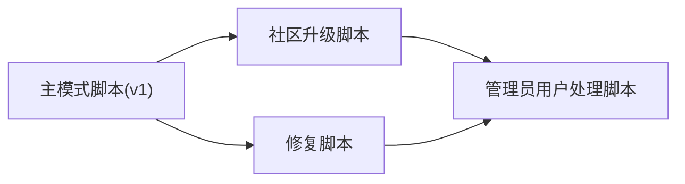

# 数据库迁移与维护

<cite>
**本文引用的文件**
- [supabase-schema.sql](file://supabase-schema.sql)
- [supabase-result-views.sql](file://supabase-result-views.sql)
- [supabase-community-upgrade.sql](file://supabase-community-upgrade.sql)
- [supabase-admin-delete-user.sql](file://supabase-admin-delete-user.sql)
- [supabase-repair.sql](file://supabase-repair.sql)
- [shared/auth.js](file://shared/auth.js)
- [shared/comments.js](file://shared/comments.js)
- [shared/supabase-config.js](file://shared/supabase-config.js)
- [SoulLab/app.js](file://SoulLab/app.js)
- [ObjTest/app.js](file://ObjTest/app.js)
</cite>

## 目录
1. [简介](#简介)
2. [项目结构](#项目结构)
3. [核心组件](#核心组件)
4. [架构总览](#架构总览)
5. [详细组件分析](#详细组件分析)
6. [依赖关系分析](#依赖关系分析)
7. [性能考量](#性能考量)
8. [故障排除指南](#故障排除指南)
9. [结论](#结论)
10. [附录](#附录)

## 简介
本文件面向数据库迁移与维护，系统性梳理本项目的数据库结构变更与数据迁移方案，涵盖主模式创建、结果浏览统计、社区升级、管理员用户处理以及修复脚本。文档同时提供版本管理建议、回滚策略、数据完整性检查方法，并给出定期维护任务、性能监控与故障排除指南，以及数据备份、恢复测试与灾难恢复演练流程。

## 项目结构
项目采用前端与数据库脚本分离的组织方式：
- 数据库脚本位于根目录，包含主模式、结果视图、社区升级、管理员用户处理与修复脚本。
- 前端通过共享模块访问 Supabase，实现认证、评论与结果浏览统计等功能。

图表来源
- [SoulLab/app.js](file://SoulLab/app.js)
- [ObjTest/app.js](file://ObjTest/app.js)
- [shared/auth.js](file://shared/auth.js)
- [shared/comments.js](file://shared/comments.js)
- [shared/supabase-config.js](file://shared/supabase-config.js)
- [supabase-schema.sql](file://supabase-schema.sql)
- [supabase-result-views.sql](file://supabase-result-views.sql)
- [supabase-community-upgrade.sql](file://supabase-community-upgrade.sql)
- [supabase-admin-delete-user.sql](file://supabase-admin-delete-user.sql)
- [supabase-repair.sql](file://supabase-repair.sql)

章节来源
- [supabase-schema.sql](file://supabase-schema.sql)
- [supabase-result-views.sql](file://supabase-result-views.sql)
- [supabase-community-upgrade.sql](file://supabase-community-upgrade.sql)
- [supabase-admin-delete-user.sql](file://supabase-admin-delete-user.sql)
- [supabase-repair.sql](file://supabase-repair.sql)
- [shared/supabase-config.js](file://shared/supabase-config.js)
- [shared/auth.js](file://shared/auth.js)
- [shared/comments.js](file://shared/comments.js)
- [SoulLab/app.js](file://SoulLab/app.js)
- [ObjTest/app.js](file://ObjTest/app.js)

## 核心组件
- 主模式创建脚本：定义用户档案、评论、存储桶与策略，启用行级安全策略。
- 结果浏览统计表：记录页面类型与浏览时间，便于统计参与人数。
- 社区升级脚本：扩展评论表、新增点赞表与索引，完善策略与唯一约束。
- 管理员用户处理函数：提供安全的管理员删除用户能力。
- 修复脚本：针对生产环境缺失列、策略与触发器进行补齐与修复。

章节来源
- [supabase-schema.sql](file://supabase-schema.sql)
- [supabase-result-views.sql](file://supabase-result-views.sql)
- [supabase-community-upgrade.sql](file://supabase-community-upgrade.sql)
- [supabase-admin-delete-user.sql](file://supabase-admin-delete-user.sql)
- [supabase-repair.sql](file://supabase-repair.sql)

## 架构总览
前端通过 Supabase 客户端访问数据库，应用层负责：
- 认证与用户资料同步（profiles 表）。
- 评论与点赞功能（comments、comment_likes 表）。
- 结果浏览统计（result_views 表）。
- 存储桶（comment-images）用于评论图片。

图表来源
- [shared/supabase-config.js](file://shared/supabase-config.js)
- [shared/auth.js](file://shared/auth.js)
- [shared/comments.js](file://shared/comments.js)
- [supabase-schema.sql](file://supabase-schema.sql)
- [supabase-community-upgrade.sql](file://supabase-community-upgrade.sql)
- [supabase-result-views.sql](file://supabase-result-views.sql)

## 详细组件分析

### 主模式创建（supabase-schema.sql）
- 目标：建立基础数据模型与安全策略。
- 关键点：
  - profiles 表：用户档案，启用 RLS，策略允许公开读取与本人更新/插入。
  - comments 表：评论，启用 RLS，策略允许公开读取未隐藏评论，登录用户可发表与删除。
  - 触发器：新用户注册时自动创建档案。
  - Storage：创建评论图片存储桶与策略。
- 版本管理建议：将该脚本作为 v1，后续变更以增量升级脚本补充。

图表来源
- [supabase-schema.sql](file://supabase-schema.sql)

章节来源
- [supabase-schema.sql](file://supabase-schema.sql)

### 结果浏览统计（supabase-result-views.sql）
- 目标：记录页面类型与浏览时间，用于统计参与人数。
- 关键点：
  - result_views 表：记录浏览事件。
  - 索引：按 page_type 与 created_at 排序，优化统计查询。
  - RLS：公开读取，匿名与登录用户可写入。
- 使用场景：SoulLab 与 ObjTest 页面加载时插入浏览记录。

图表来源
- [supabase-result-views.sql](file://supabase-result-views.sql)
- [SoulLab/app.js](file://SoulLab/app.js)
- [ObjTest/app.js](file://ObjTest/app.js)

章节来源
- [supabase-result-views.sql](file://supabase-result-views.sql)
- [SoulLab/app.js](file://SoulLab/app.js)
- [ObjTest/app.js](file://ObjTest/app.js)

### 社区升级（supabase-community-upgrade.sql）
- 目标：增强评论功能，支持回复、点赞与去重昵称。
- 关键点：
  - 扩展 comments 表：新增父评论字段与索引。
  - 新增 comment_likes 表：点赞关系，启用 RLS 并授予匿名与登录用户权限。
  - 去重与规范化：为 profiles 昵称生成唯一性，创建唯一索引。
  - 策略：为 comment_likes 增加公共读取、认证用户点赞与删除策略。
- 执行顺序：应在主模式脚本之后执行。

图表来源
- [supabase-community-upgrade.sql](file://supabase-community-upgrade.sql)

章节来源
- [supabase-community-upgrade.sql](file://supabase-community-upgrade.sql)

### 管理员用户处理（supabase-admin-delete-user.sql）
- 目标：提供安全的管理员删除用户能力，级联删除评论与档案。
- 关键点：
  - 函数：admin_delete_user，仅限认证且 is_admin=true 的用户调用。
  - 权限：撤销 public 权限，仅授予 authenticated。
  - 级联删除：评论、档案、auth.users。
- 安全性：使用安全定义器与严格权限控制。

图表来源
- [supabase-admin-delete-user.sql](file://supabase-admin-delete-user.sql)

章节来源
- [supabase-admin-delete-user.sql](file://supabase-admin-delete-user.sql)

### 修复脚本（supabase-repair.sql）
- 目标：修复生产环境缺失列、策略与触发器，确保一致性。
- 关键点：
  - 补齐 profiles 与 comments 缺失列，设置默认值与非空约束。
  - 同步 email 字段，创建 RLS 策略。
  - 重建 handle_new_user 触发器，确保新用户自动创建档案。
  - 为 Storage 对象创建策略。
- 适用场景：数据库结构损坏或迁移中断后的修复。

图表来源
- [supabase-repair.sql](file://supabase-repair.sql)

章节来源
- [supabase-repair.sql](file://supabase-repair.sql)

### 前端与数据库交互
- Supabase 客户端初始化：统一的 URL 与密钥配置。
- 认证与资料：auth.js 负责登录、注册、资料同步与头像上传。
- 评论与点赞：comments.js 负责加载、提交、点赞与删除，包含错误处理与权限提示。
- 结果浏览统计：SoulLab 与 ObjTest 在页面加载时插入浏览记录。

图表来源
- [shared/supabase-config.js](file://shared/supabase-config.js)
- [shared/auth.js](file://shared/auth.js)
- [shared/comments.js](file://shared/comments.js)
- [SoulLab/app.js](file://SoulLab/app.js)
- [ObjTest/app.js](file://ObjTest/app.js)

章节来源
- [shared/supabase-config.js](file://shared/supabase-config.js)
- [shared/auth.js](file://shared/auth.js)
- [shared/comments.js](file://shared/comments.js)
- [SoulLab/app.js](file://SoulLab/app.js)
- [ObjTest/app.js](file://ObjTest/app.js)

## 依赖关系分析
- 数据库脚本之间存在顺序依赖：
  - 主模式脚本（v1）为基线。
  - 社区升级脚本在 v1 基础上扩展功能。
  - 修复脚本用于生产修复。
  - 管理员用户处理脚本独立，供运维使用。
- 前端依赖 Supabase 客户端与数据库 RLS 策略，需保证脚本执行顺序与策略一致。

图表来源
- [supabase-schema.sql](file://supabase-schema.sql)
- [supabase-community-upgrade.sql](file://supabase-community-upgrade.sql)
- [supabase-repair.sql](file://supabase-repair.sql)
- [supabase-admin-delete-user.sql](file://supabase-admin-delete-user.sql)

章节来源
- [supabase-schema.sql](file://supabase-schema.sql)
- [supabase-community-upgrade.sql](file://supabase-community-upgrade.sql)
- [supabase-repair.sql](file://supabase-repair.sql)
- [supabase-admin-delete-user.sql](file://supabase-admin-delete-user.sql)

## 性能考量
- 索引设计：
  - comments 表：按 page_type、parent_comment_id、created_at 排序索引，支持高效分页与回复树查询。
  - comment_likes 表：按 comment_id 与 user_id 建立索引，优化点赞查询与去重。
  - result_views 表：按 page_type、created_at 建立复合索引，优化统计查询。
- RLS 开销：RLS 策略在每次查询时生效，应配合合适的索引与查询条件降低开销。
- 存储桶：评论图片使用独立存储桶，结合策略限制上传与读取，避免不必要的跨桶访问。

章节来源
- [supabase-community-upgrade.sql](file://supabase-community-upgrade.sql)
- [supabase-result-views.sql](file://supabase-result-views.sql)

## 故障排除指南
- 常见错误与定位：
  - 评论表缺失：前端检测到 PGRST205 错误时提示执行社区升级脚本。
  - 点赞表缺失或权限不足：前端检测到权限错误时提示执行社区升级脚本。
  - profiles 列缺失：前端通过字段探测与错误消息判断是否需要执行修复脚本。
- 修复步骤：
  - 执行修复脚本补齐缺失列与策略。
  - 执行社区升级脚本完善功能与权限。
  - 如需删除用户，使用管理员用户处理函数并确保调用者具备管理员权限。
- 日志与监控：
  - 前端捕获并提示错误，便于快速定位问题。
  - 数据库层面可通过查询日志与慢查询分析工具定位性能瓶颈。

章节来源
- [shared/comments.js](file://shared/comments.js)
- [shared/auth.js](file://shared/auth.js)
- [supabase-repair.sql](file://supabase-repair.sql)
- [supabase-community-upgrade.sql](file://supabase-community-upgrade.sql)
- [supabase-admin-delete-user.sql](file://supabase-admin-delete-user.sql)

## 结论
本项目通过一组有序的数据库脚本实现了从基础模式到增强功能的完整演进，并提供了修复与运维脚本保障生产环境稳定。配合前端模块化的数据访问与错误处理，整体具备良好的可维护性与安全性。建议在生产环境中严格执行脚本顺序与回滚策略，定期进行备份与恢复测试，确保业务连续性。

## 附录

### 数据库版本管理与回滚策略
- 版本命名：v1（主模式）、v2（社区升级）、v3（修复）等。
- 执行策略：先基线脚本，再增量升级；升级前备份。
- 回滚策略：
  - 主模式回滚：删除新增对象与策略，保留基线结构。
  - 社区升级回滚：删除新增列、索引与策略，恢复到升级前状态。
  - 修复脚本：可重复执行以恢复缺失项，必要时结合备份回滚。

章节来源
- [supabase-schema.sql](file://supabase-schema.sql)
- [supabase-community-upgrade.sql](file://supabase-community-upgrade.sql)
- [supabase-repair.sql](file://supabase-repair.sql)

### 定期维护任务
- 数据完整性检查：定期校验 RLS 策略、索引与约束。
- 性能监控：关注 comments 与 comment_likes 的查询延迟与锁等待。
- 存储清理：定期清理过期评论图片与无用数据。

章节来源
- [supabase-community-upgrade.sql](file://supabase-community-upgrade.sql)
- [supabase-schema.sql](file://supabase-schema.sql)

### 数据备份、恢复测试与灾难恢复演练
- 备份策略：
  - 结构备份：导出数据库结构与策略。
  - 数据备份：定期导出关键表（profiles、comments、comment_likes、result_views）。
- 恢复测试：
  - 在隔离环境导入备份，验证 RLS 与索引是否恢复。
  - 执行修复脚本验证生产修复能力。
- 灾难恢复演练：
  - 模拟删除关键表或策略，验证回滚脚本与备份恢复流程。
  - 演练管理员删除用户函数，确保权限与级联删除正确。

章节来源
- [supabase-repair.sql](file://supabase-repair.sql)
- [supabase-admin-delete-user.sql](file://supabase-admin-delete-user.sql)