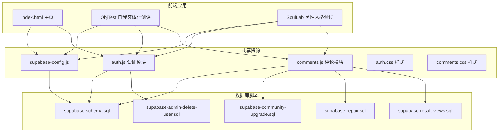
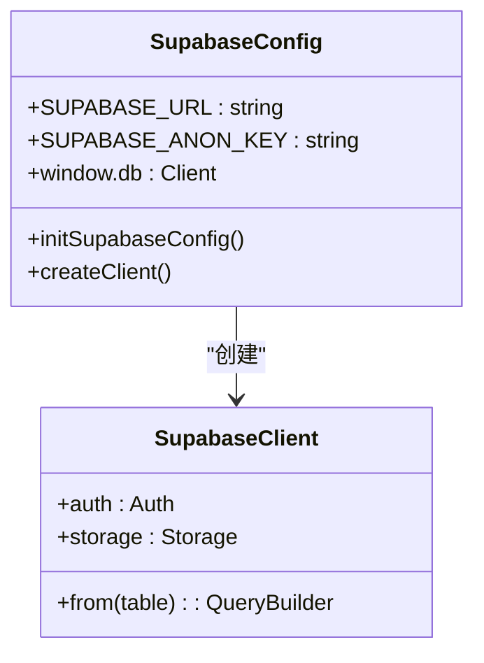
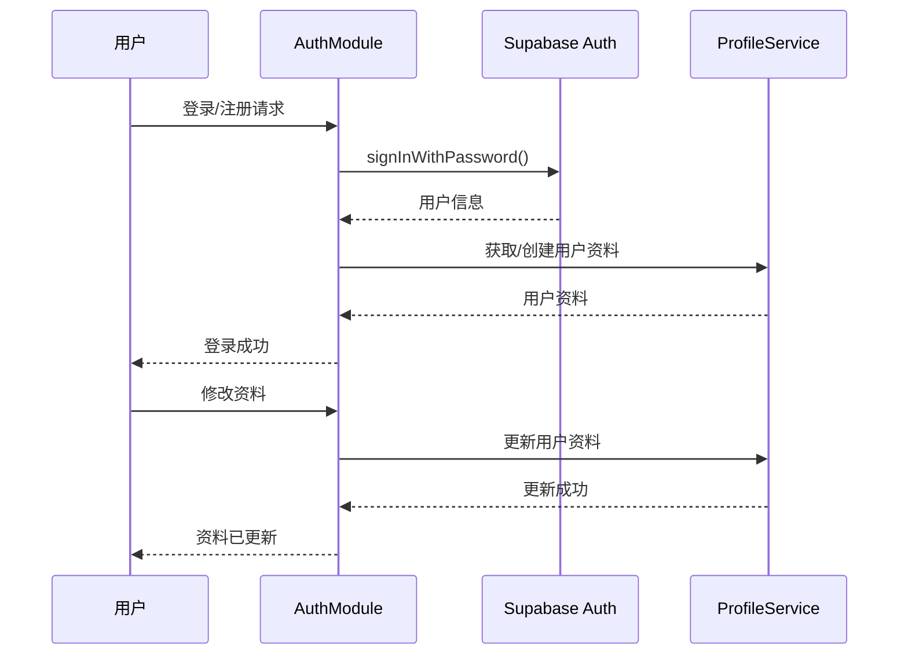
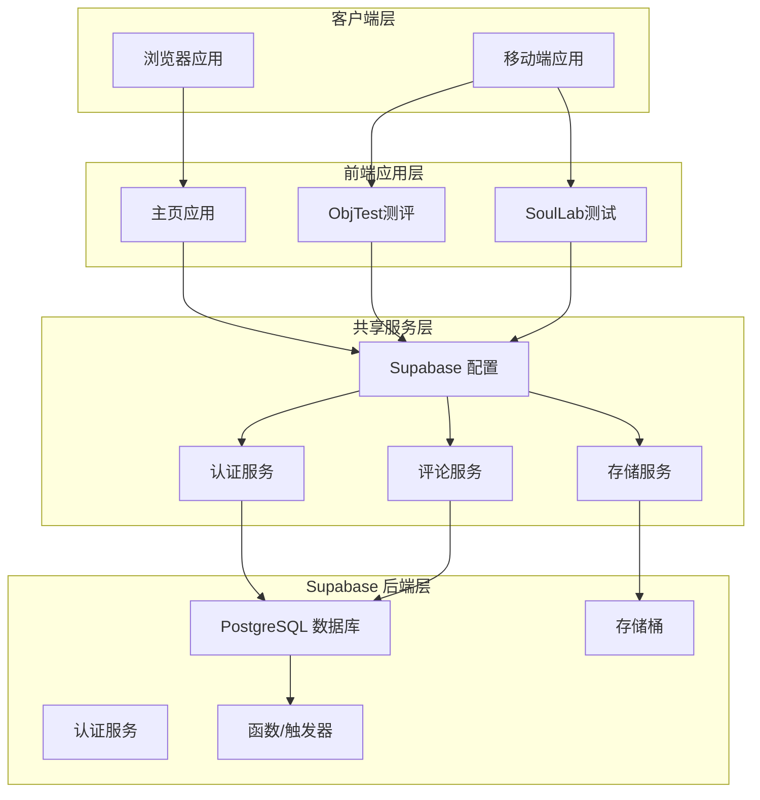
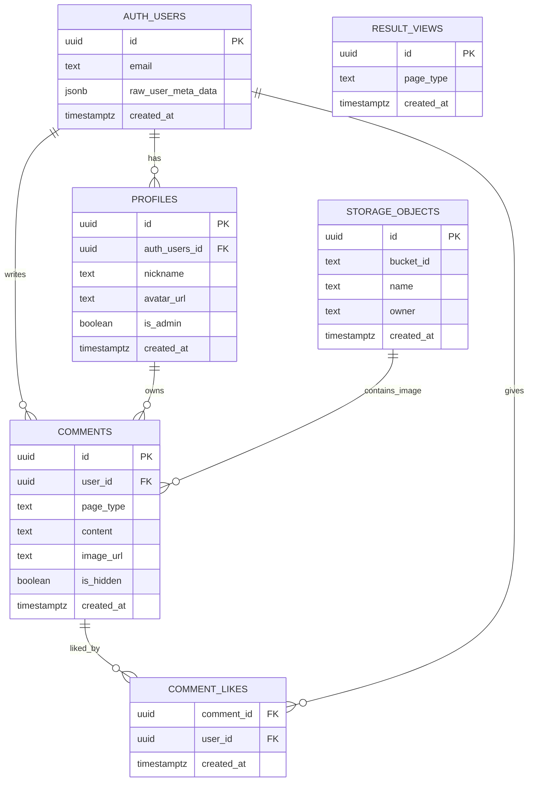
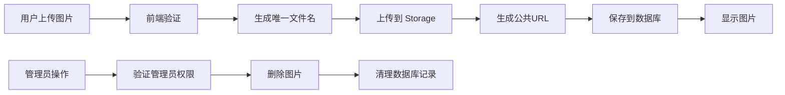
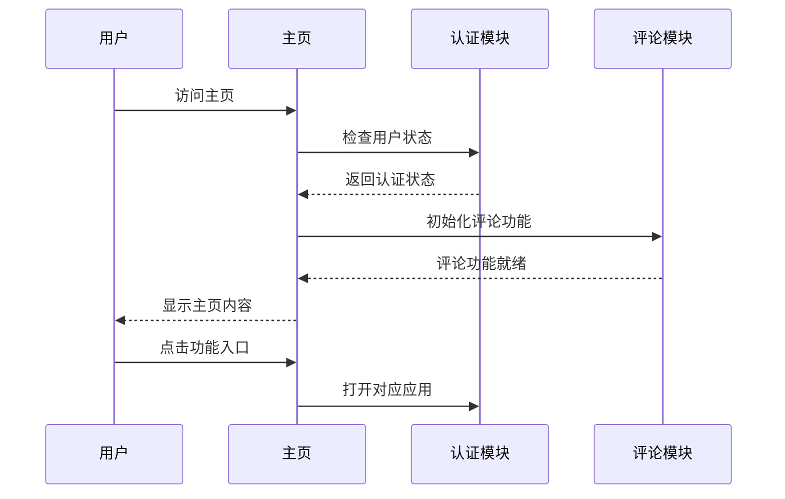
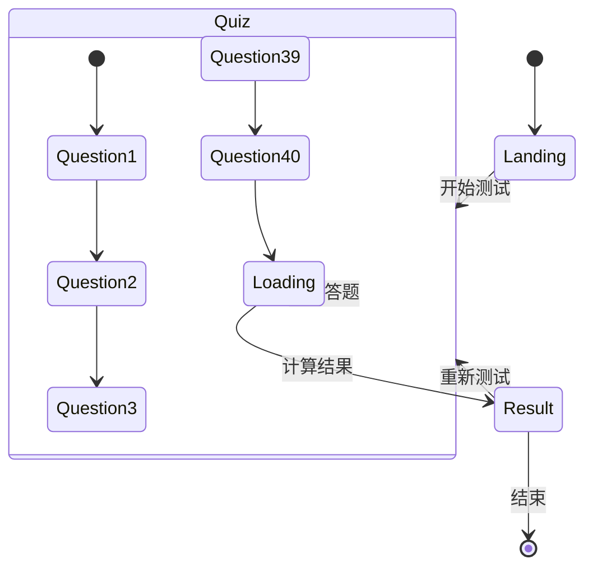
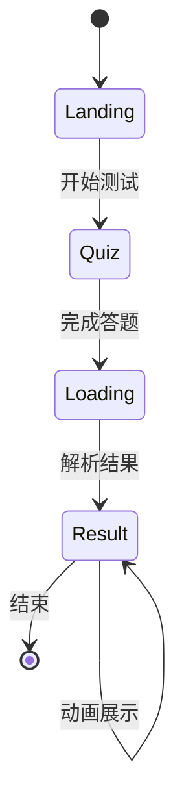

# 生产环境部署

<cite>
**本文档引用的文件**
- [supabase-config.js](file://shared/supabase-config.js)
- [supabase-schema.sql](file://supabase-schema.sql)
- [supabase-admin-delete-user.sql](file://supabase-admin-delete-user.sql)
- [supabase-community-upgrade.sql](file://supabase-community-upgrade.sql)
- [supabase-repair.sql](file://supabase-repair.sql)
- [supabase-result-views.sql](file://supabase-result-views.sql)
- [auth.js](file://shared/auth.js)
- [comments.js](file://shared/comments.js)
- [app.js (ObjTest)](file://ObjTest/app.js)
- [app.js (SoulLab)](file://SoulLab/app.js)
- [index.html](file://index.html)
- [ObjTest/index.html](file://ObjTest/index.html)
- [SoulLab/index.html](file://SoulLab/index.html)
</cite>

## 目录
1. [简介](#简介)
2. [项目结构](#项目结构)
3. [核心组件](#核心组件)
4. [架构概览](#架构概览)
5. [详细组件分析](#详细组件分析)
6. [依赖关系分析](#依赖关系分析)
7. [性能考虑](#性能考虑)
8. [故障排除指南](#故障排除指南)
9. [结论](#结论)
10. [附录](#附录)

## 简介

本项目是一个基于 Supabase 的心理测评平台，包含两个核心功能模块：自我客体化测评（ObjTest）和灵性修行版人格测试（SoulLab）。项目采用前后端分离架构，前端使用原生 JavaScript 和 HTML/CSS，后端基于 Supabase 提供的数据库、认证和存储服务。

该项目的核心目标是为用户提供深度的自我探索工具，通过科学的心理测评帮助用户更好地了解自己的内在世界。系统设计注重用户体验、数据安全和可扩展性。

## 项目结构

项目采用模块化组织方式，主要分为以下几个部分：



**图表来源**
- [index.html:1-1171](file://index.html#L1-L1171)
- [ObjTest/index.html:1-170](file://ObjTest/index.html#L1-L170)
- [SoulLab/index.html:1-271](file://SoulLab/index.html#L1-L271)

**章节来源**
- [index.html:1-1171](file://index.html#L1-L1171)
- [ObjTest/index.html:1-170](file://ObjTest/index.html#L1-L170)
- [SoulLab/index.html:1-271](file://SoulLab/index.html#L1-L271)

## 核心组件

### Supabase 配置管理

系统使用统一的 Supabase 配置模块，确保所有前端应用能够正确连接到 Supabase 服务。



**图表来源**
- [supabase-config.js:1-26](file://shared/supabase-config.js#L1-L26)

### 认证系统

认证模块提供了完整的用户身份验证、会话管理和资料管理功能：



**图表来源**
- [auth.js:522-799](file://shared/auth.js#L522-L799)

### 评论系统

评论模块实现了复杂的内容管理功能，包括嵌套回复、点赞系统和权限控制：

```mermaid
flowchart TD
A[用户提交评论] --> B{验证用户状态}
B --> |未登录| C[打开登录模态框]
B --> |已登录| D[验证评论内容]
D --> E{内容有效?}
E --> |否| F[显示错误信息]
E --> |是| G[上传图片(可选)]
G --> H[插入评论到数据库]
H --> I[更新本地状态]
I --> J[重新渲染评论列表]
K[用户点赞] --> L{验证用户状态}
L --> |未登录| M[打开登录模态框]
L --> |已登录| N[切换点赞状态]
N --> O[更新数据库]
O --> P[同步本地状态]
```

**图表来源**
- [comments.js:544-643](file://shared/comments.js#L544-L643)

**章节来源**
- [supabase-config.js:1-26](file://shared/supabase-config.js#L1-L26)
- [auth.js:1-800](file://shared/auth.js#L1-L800)
- [comments.js:1-769](file://shared/comments.js#L1-L769)

## 架构概览

系统采用现代 Web 架构，结合了前端单页应用模式和 Supabase 的无服务器后端服务：



**图表来源**
- [index.html:1-1171](file://index.html#L1-L1171)
- [ObjTest/index.html:160-166](file://ObjTest/index.html#L160-L166)
- [SoulLab/index.html:249-255](file://SoulLab/index.html#L249-L255)

## 详细组件分析

### 数据库架构设计

系统使用 PostgreSQL 作为核心数据库，通过 Supabase 提供的 Row Level Security (RLS) 实现细粒度的权限控制。

#### 核心数据表结构



**图表来源**
- [supabase-schema.sql:6-97](file://supabase-schema.sql#L6-L97)
- [supabase-community-upgrade.sql:9-14](file://supabase-community-upgrade.sql#L9-L14)
- [supabase-result-views.sql:1-5](file://supabase-result-views.sql#L1-L5)

#### 权限策略设计

系统实现了多层次的访问控制策略：

| 表名 | 策略名称 | 访问类型 | 条件 |
|------|----------|----------|------|
| profiles | 公开读取 profiles | SELECT | true |
| profiles | 本人更新 profiles | UPDATE | auth.uid() = id |
| profiles | 本人插入 profiles | INSERT | with check(auth.uid() = id) |
| comments | 公开读取未隐藏评论 | SELECT | is_hidden = false |
| comments | 登录用户发表评论 | INSERT | with check(auth.uid() = user_id) |
| comments | 本人删除评论 | DELETE | auth.uid() = user_id |
| comments | 管理员全部读取 | SELECT | exists(select 1 from profiles where id = auth.uid() and is_admin = true) |
| comment_likes | 公共读取点赞 | SELECT | true |
| comment_likes | 认证用户点赞 | INSERT | with check(auth.uid() = user_id) |
| comment_likes | 本人取消点赞 | DELETE | auth.uid() = user_id |

**章节来源**
- [supabase-schema.sql:15-81](file://supabase-schema.sql#L15-L81)
- [supabase-community-upgrade.sql:49-76](file://supabase-community-upgrade.sql#L49-L76)

### 存储系统配置

系统使用 Supabase Storage 服务管理用户上传的图片内容：



**图表来源**
- [comments.js:592-599](file://shared/comments.js#L592-L599)

**章节来源**
- [supabase-schema.sql:83-97](file://supabase-schema.sql#L83-L97)
- [comments.js:592-599](file://shared/comments.js#L592-L599)

### 前端应用架构

#### 主页应用 (index.html)

主页作为入口页面，集成了导航、用户状态管理和功能入口：



**图表来源**
- [index.html:1-1171](file://index.html#L1-L1171)

#### ObjTest 应用

ObjTest 是一个 40 题的自我客体化测评工具：



**图表来源**
- [ObjTest/app.js:86-242](file://ObjTest/app.js#L86-L242)

#### SoulLab 应用

SoulLab 是一个 33 题的灵性人格测试：



**图表来源**
- [SoulLab/app.js:182-405](file://SoulLab/app.js#L182-L405)

**章节来源**
- [index.html:1-1171](file://index.html#L1-L1171)
- [ObjTest/app.js:1-327](file://ObjTest/app.js#L1-L327)
- [SoulLab/app.js:1-613](file://SoulLab/app.js#L1-L613)

## 依赖关系分析

系统各组件之间的依赖关系如下：

```mermaid
graph TD
subgraph "外部依赖"
A[@supabase/supabase-js]
B[html2canvas]
C[本地存储]
end
subgraph "内部模块"
D[supabase-config.js]
E[auth.js]
F[comments.js]
G[ObjTest/app.js]
H[SoulLab/app.js]
end
A --> D
B --> G
B --> H
C --> E
D --> E
D --> F
D --> G
D --> H
E --> F
G --> F
H --> F
```

**图表来源**
- [ObjTest/index.html:160-166](file://ObjTest/index.html#L160-L166)
- [SoulLab/index.html:249-255](file://SoulLab/index.html#L249-L255)

**章节来源**
- [ObjTest/index.html:160-166](file://ObjTest/index.html#L160-L166)
- [SoulLab/index.html:249-255](file://SoulLab/index.html#L249-L255)

## 性能考虑

### 数据库性能优化

1. **索引策略**
   - 评论表按 `page_type` 和 `created_at` 建立复合索引
   - 评论点赞表建立多列索引优化查询性能
   - 用户资料表建立唯一索引确保昵称唯一性

2. **查询优化**
   - 使用 LIMIT 限制评论数量，避免大量数据传输
   - 实现分页加载机制，提升用户体验
   - 采用乐观更新减少数据库往返

3. **缓存策略**
   - 本地缓存用户资料和头像信息
   - 缓存热门内容减少数据库压力
   - 实现智能重试机制处理网络波动

### 前端性能优化

1. **资源加载**
   - 使用 CDN 加速静态资源加载
   - 实现懒加载和按需加载策略
   - 优化图片压缩和格式选择

2. **交互体验**
   - 实现骨架屏提升感知性能
   - 使用虚拟滚动处理大量数据
   - 优化动画和过渡效果

3. **内存管理**
   - 及时清理事件监听器
   - 合理管理 DOM 元素生命周期
   - 避免内存泄漏

## 故障排除指南

### 常见问题及解决方案

#### 认证相关问题

| 问题描述 | 可能原因 | 解决方案 |
|----------|----------|----------|
| 登录失败 | 网络连接问题 | 检查网络状态，重试登录 |
| 密码错误 | 输入错误 | 清除输入框，重新输入 |
| 邮箱未验证 | 验证邮件未收到 | 检查垃圾邮件，重新发送验证邮件 |
| 会话过期 | 长时间无操作 | 重新登录系统 |

#### 数据库连接问题

| 问题描述 | 可能原因 | 解决方案 |
|----------|----------|----------|
| 查询超时 | 数据库负载过高 | 优化查询语句，添加索引 |
| 权限不足 | RLS 策略配置错误 | 检查策略定义，重新授权 |
| 连接池耗尽 | 并发请求过多 | 实现请求队列，优化并发控制 |

#### 存储相关问题

| 问题描述 | 可能原因 | 解决方案 |
|----------|----------|----------|
| 图片上传失败 | 文件过大 | 检查文件大小限制，压缩图片 |
| 图片无法显示 | URL 过期 | 重新生成公共 URL |
| 存储空间不足 | 超出配额 | 清理历史数据，扩容存储 |

**章节来源**
- [auth.js:115-147](file://shared/auth.js#L115-L147)
- [comments.js:544-643](file://shared/comments.js#L544-L643)

## 结论

本项目展示了如何使用 Supabase 构建一个功能完整、性能优良的心理测评平台。通过合理的架构设计和严格的权限控制，系统能够在保证安全性的同时提供优秀的用户体验。

项目的主要优势包括：
- 基于 Supabase 的无服务器架构，降低运维成本
- 完善的权限控制系统，确保数据安全
- 优雅的前端交互设计，提升用户体验
- 可扩展的数据库设计，支持业务增长

对于生产环境部署，建议重点关注数据库性能优化、监控告警设置和备份策略制定，以确保系统的稳定性和可靠性。

## 附录

### 部署步骤清单

1. **环境准备**
   - 准备域名和 SSL 证书
   - 配置 CDN 和缓存策略
   - 设置负载均衡和高可用

2. **数据库初始化**
   - 执行 `supabase-schema.sql`
   - 运行 `supabase-community-upgrade.sql`
   - 配置存储桶和权限策略

3. **应用配置**
   - 更新 Supabase 配置参数
   - 配置环境变量和密钥
   - 设置 CORS 和安全头

4. **监控和维护**
   - 配置日志收集和分析
   - 设置性能监控和告警
   - 制定备份和恢复计划

### 最佳实践建议

1. **安全性**
   - 定期审查权限策略
   - 实施最小权限原则
   - 加强 API 密钥管理

2. **性能**
   - 监控数据库查询性能
   - 优化前端资源加载
   - 实施缓存策略

3. **可维护性**
   - 建立完善的文档体系
   - 制定变更管理流程
   - 定期进行安全审计