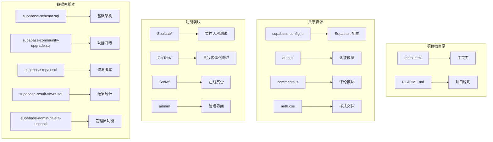
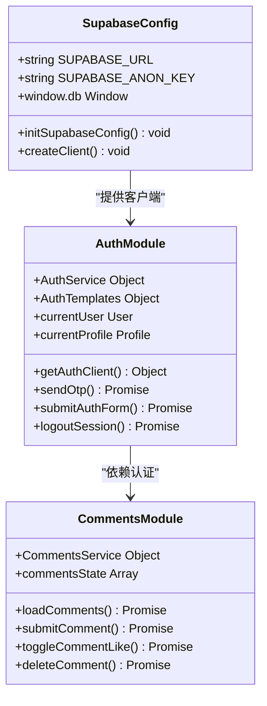
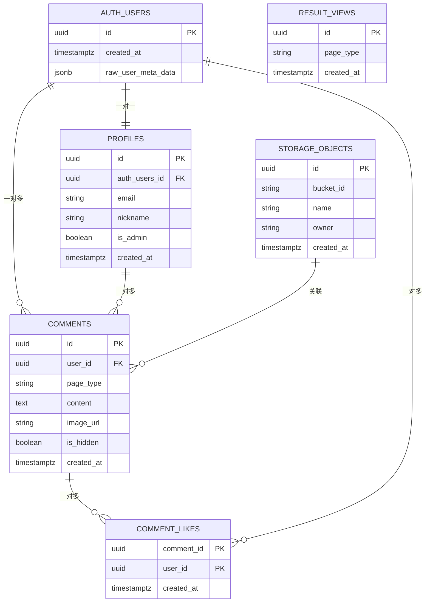
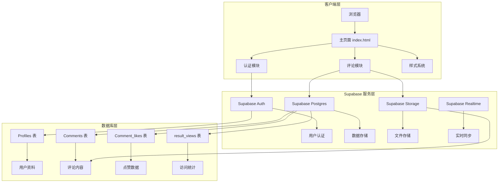
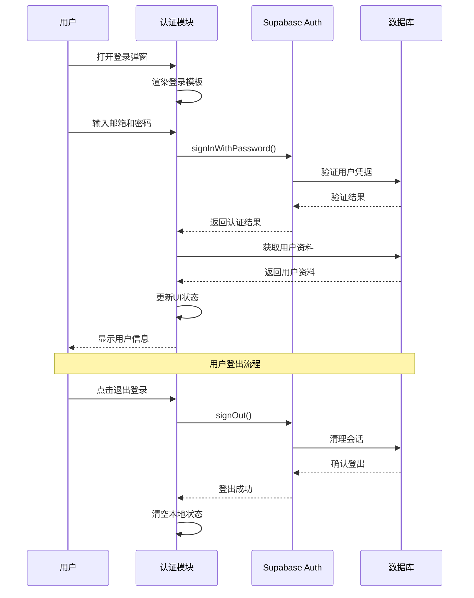
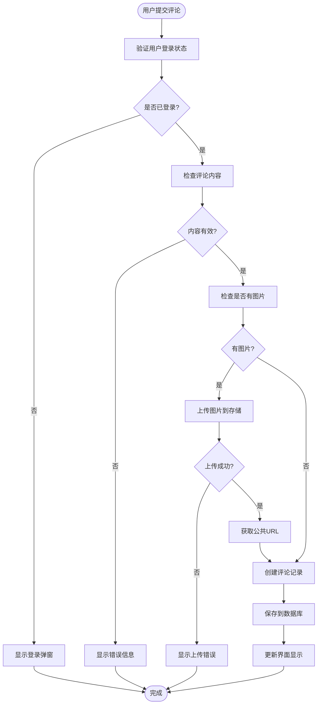
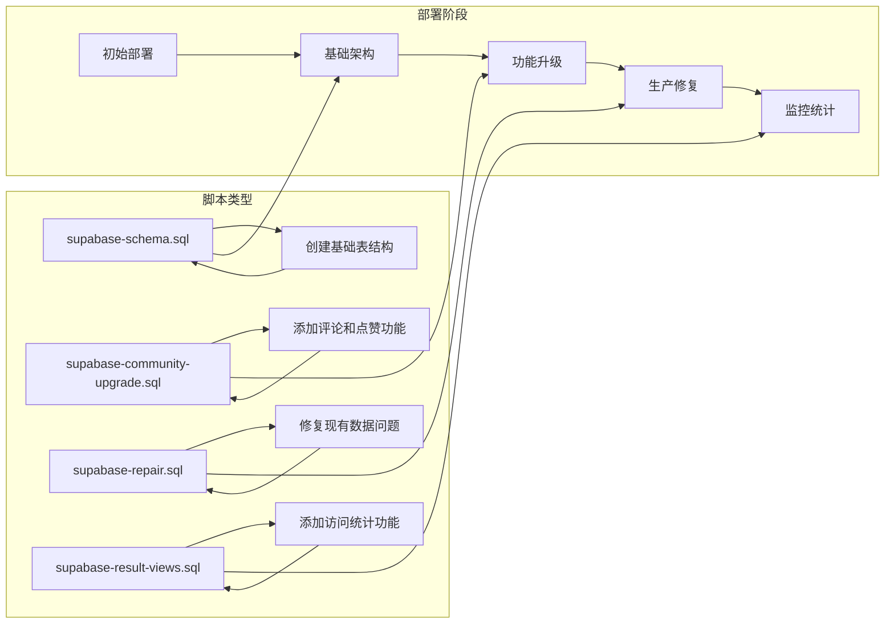

# 部署指南

<cite>
**本文档引用的文件**
- [README.md](file://README.md)
- [index.html](file://index.html)
- [shared/supabase-config.js](file://shared/supabase-config.js)
- [shared/auth.js](file://shared/auth.js)
- [shared/comments.js](file://shared/comments.js)
- [shared/auth.css](file://shared/auth.css)
- [supabase-schema.sql](file://supabase-schema.sql)
- [supabase-community-upgrade.sql](file://supabase-community-upgrade.sql)
- [supabase-repair.sql](file://supabase-repair.sql)
- [supabase-result-views.sql](file://supabase-result-views.sql)
- [supabase-admin-delete-user.sql](file://supabase-admin-delete-user.sql)
- [ObjTest/客体化测试.md](file://ObjTest/客体化测试.md)
</cite>

## 目录
1. [简介](#简介)
2. [项目结构](#项目结构)
3. [核心组件](#核心组件)
4. [架构概览](#架构概览)
5. [详细组件分析](#详细组件分析)
6. [依赖关系分析](#依赖关系分析)
7. [性能考虑](#性能考虑)
8. [故障排除指南](#故障排除指南)
9. [结论](#结论)
10. [附录](#附录)

## 简介

本指南面向开发者和运维人员，提供从开发环境到生产环境的完整部署方案。项目包含多个前端模块，采用 Supabase 作为后端服务，提供用户认证、评论系统、存储等功能。

项目特色：
- 基于 Supabase 的无服务器架构
- 多模块前端设计（灵性人格测试、自我客体化测评、在线赏雪等）
- 完整的用户认证和授权体系
- 评论系统和图片存储功能
- 实时数据同步和响应式设计

## 项目结构

项目采用模块化组织方式，主要目录结构如下：



**图表来源**
- [index.html:1-800](file://index.html#L1-L800)
- [shared/supabase-config.js:1-26](file://shared/supabase-config.js#L1-L26)
- [shared/auth.js:1-800](file://shared/auth.js#L1-L800)
- [shared/comments.js:1-769](file://shared/comments.js#L1-L769)

**章节来源**
- [README.md:1-26](file://README.md#L1-L26)
- [index.html:1-800](file://index.html#L1-L800)

## 核心组件

### Supabase 配置模块

项目使用全局配置模块管理 Supabase 连接信息：



**图表来源**
- [shared/supabase-config.js:5-26](file://shared/supabase-config.js#L5-L26)
- [shared/auth.js:419-800](file://shared/auth.js#L419-L800)
- [shared/comments.js:20-25](file://shared/comments.js#L20-L25)

### 数据库架构

项目采用 PostgreSQL + Supabase 的组合架构：



**图表来源**
- [supabase-schema.sql:6-97](file://supabase-schema.sql#L6-L97)
- [supabase-community-upgrade.sql:9-14](file://supabase-community-upgrade.sql#L9-L14)
- [supabase-result-views.sql:1-32](file://supabase-result-views.sql#L1-L32)

**章节来源**
- [shared/supabase-config.js:1-26](file://shared/supabase-config.js#L1-L26)
- [supabase-schema.sql:1-97](file://supabase-schema.sql#L1-L97)

## 架构概览

项目采用前后端分离的架构设计，前端通过 Supabase JavaScript SDK 与后端通信：



**图表来源**
- [index.html:1-800](file://index.html#L1-L800)
- [shared/auth.js:1-800](file://shared/auth.js#L1-L800)
- [shared/comments.js:1-769](file://shared/comments.js#L1-L769)
- [supabase-schema.sql:1-97](file://supabase-schema.sql#L1-L97)

## 详细组件分析

### 认证系统

认证系统提供完整的用户生命周期管理：



**图表来源**
- [shared/auth.js:567-677](file://shared/auth.js#L567-L677)
- [shared/auth.js:679-692](file://shared/auth.js#L679-L692)

### 评论系统

评论系统支持多级回复和图片上传：



**图表来源**
- [shared/comments.js:511-643](file://shared/comments.js#L511-L643)
- [shared/comments.js:589-626](file://shared/comments.js#L589-L626)

**章节来源**
- [shared/auth.js:1-800](file://shared/auth.js#L1-L800)
- [shared/comments.js:1-769](file://shared/comments.js#L1-L769)

### 数据库迁移策略

项目提供多套数据库脚本以适应不同部署阶段：



**图表来源**
- [supabase-schema.sql:1-97](file://supabase-schema.sql#L1-L97)
- [supabase-community-upgrade.sql:1-77](file://supabase-community-upgrade.sql#L1-L77)
- [supabase-repair.sql:1-184](file://supabase-repair.sql#L1-L184)
- [supabase-result-views.sql:1-32](file://supabase-result-views.sql#L1-L32)

**章节来源**
- [supabase-schema.sql:1-97](file://supabase-schema.sql#L1-L97)
- [supabase-community-upgrade.sql:1-77](file://supabase-community-upgrade.sql#L1-L77)
- [supabase-repair.sql:1-184](file://supabase-repair.sql#L1-L184)
- [supabase-result-views.sql:1-32](file://supabase-result-views.sql#L1-L32)

## 依赖关系分析

项目依赖关系呈现清晰的层次结构：

```mermaid
graph TB
subgraph "前端依赖"
A[index.html] --> B[shared/supabase-config.js]
A --> C[shared/auth.js]
A --> D[shared/comments.js]
A --> E[shared/auth.css]
end
subgraph "Supabase 依赖"
B --> F[@supabase/supabase-js SDK]
C --> F
D --> F
end
subgraph "功能模块"
G[SoulLab/index.html] --> C
G --> D
H[ObjTest/index.html] --> C
H --> D
I[Snow/index.html] --> C
I --> D
end
subgraph "数据库依赖"
F --> J[PostgreSQL 数据库]
F --> K[Supabase Auth]
F --> L[Supabase Storage]
end
subgraph "外部资源"
M[Google Fonts] --> A
N[DiceBear Avatars] --> C
end
```

**图表来源**
- [index.html:1-800](file://index.html#L1-L800)
- [shared/supabase-config.js:1-26](file://shared/supabase-config.js#L1-L26)
- [shared/auth.js:1-800](file://shared/auth.js#L1-L800)
- [shared/comments.js:1-769](file://shared/comments.js#L1-L769)

**章节来源**
- [index.html:1-800](file://index.html#L1-L800)
- [shared/supabase-config.js:1-26](file://shared/supabase-config.js#L1-L26)

## 性能考虑

### 前端性能优化

1. **资源加载优化**
   - 使用 `rel="preload"` 预加载关键资源
   - 合理设置图片的 `fetchpriority` 和 `loading="lazy"`
   - 采用 CSS-in-JS 的动态样式加载

2. **缓存策略**
   - 利用浏览器缓存机制
   - 设置合适的 Cache-Control 头
   - 实现渐进式缓存策略

3. **渲染性能**
   - 使用 CSS 动画替代 JavaScript 动画
   - 实现虚拟滚动处理大量评论
   - 采用防抖和节流优化用户输入

### 数据库性能优化

1. **索引策略**
   ```sql
   -- 评论查询优化索引
   CREATE INDEX idx_comments_page_parent_created_at 
   ON public.comments (page_type, parent_comment_id, created_at DESC);
   
   -- 点赞查询优化索引
   CREATE INDEX idx_comment_likes_comment_id 
   ON public.comment_likes (comment_id, created_at DESC);
   
   -- 用户昵称唯一性索引
   CREATE UNIQUE INDEX idx_profiles_nickname_unique 
   ON public.profiles (LOWER(nickname));
   ```

2. **查询优化**
   - 使用 LIMIT 控制查询结果数量
   - 实现分页加载机制
   - 优化 JOIN 查询路径

**章节来源**
- [shared/comments.js:15-18](file://shared/comments.js#L15-L18)
- [supabase-community-upgrade.sql:6-7](file://supabase-community-upgrade.sql#L6-L7)
- [supabase-community-upgrade.sql:19-23](file://supabase-community-upgrade.sql#L19-L23)

## 故障排除指南

### 常见问题及解决方案

#### Supabase 连接问题

**问题症状**：页面加载时出现 "Supabase SDK 未加载" 错误

**排查步骤**：
1. 检查 CDN 链接是否可达
2. 验证 Supabase URL 和密钥配置
3. 确认浏览器控制台网络请求

**解决方案**：
```javascript
// 检查 Supabase SDK 加载状态
if (!window.supabase || typeof window.supabase.createClient !== 'function') {
    console.error('Supabase SDK 未加载：请检查 @supabase/supabase-js CDN 是否可用');
    window.supabaseClient = null;
    window.db = null;
    return;
}
```

#### 认证功能异常

**问题症状**：登录/注册功能无法正常工作

**排查步骤**：
1. 检查 Supabase Auth 服务状态
2. 验证邮箱配置和发送权限
3. 确认用户表结构完整性

**解决方案**：
```javascript
// 认证客户端初始化检查
function getAuthClient() {
    if (typeof supabase !== 'undefined' && supabase?.auth) return supabase;
    if (window.supabaseClient?.auth) return window.supabaseClient;
    if (window.db?.auth) return window.db;
    return null;
}
```

#### 评论功能问题

**问题症状**：评论无法提交或显示异常

**排查步骤**：
1. 检查评论表是否存在
2. 验证用户权限状态
3. 确认存储桶配置

**解决方案**：
```javascript
// 评论功能可用性检查
if (!commentsFeatureAvailable) {
    alert('评论功能未完成升级，请先执行 SQL 脚本。');
    return;
}

// 存储桶权限检查
const { error: uploadError } = await client.storage
    .from('comment-images')
    .upload(fileName, selectedImageFile, { 
        cacheControl: '3600', 
        upsert: false 
    });
```

**章节来源**
- [shared/supabase-config.js:12-17](file://shared/supabase-config.js#L12-L17)
- [shared/auth.js:35-40](file://shared/auth.js#L35-L40)
- [shared/comments.js:548-551](file://shared/comments.js#L548-L551)

### 数据库修复脚本

当遇到数据库结构不一致时，使用修复脚本：

```sql
-- 运行修复脚本修复现有问题
-- 该脚本会检查并修复以下问题：
-- 1. 缺失的表结构
-- 2. 不完整的 RLS 策略
-- 3. 用户数据不一致
-- 4. 触发器缺失
```

**章节来源**
- [supabase-repair.sql:1-184](file://supabase-repair.sql#L1-L184)

## 结论

本部署指南提供了从开发到生产的完整实施路径。项目采用现代化的 Supabase 架构，具有良好的扩展性和维护性。

关键优势：
- **低维护成本**：基于 Supabase 的无服务器架构
- **快速开发**：完善的认证和存储功能
- **易于扩展**：模块化设计支持功能增量开发
- **安全可靠**：内置 RLS 和权限控制

建议的后续改进方向：
1. 添加 Docker 容器化部署支持
2. 实现 CI/CD 自动化流水线
3. 增强监控和日志系统
4. 优化移动端用户体验

## 附录

### 环境变量配置

项目目前使用硬编码的 Supabase 配置，建议迁移到环境变量管理：

```javascript
// 建议的环境变量配置
const SUPABASE_URL = process.env.SUPABASE_URL || '默认URL';
const SUPABASE_ANON_KEY = process.env.SUPABASE_ANON_KEY || '默认密钥';
```

### 数据库迁移最佳实践

1. **版本控制**：每个数据库变更都应有对应的 SQL 脚本
2. **回滚策略**：确保每个变更都有相应的回滚脚本
3. **测试验证**：在生产前在测试环境中验证变更
4. **备份策略**：执行重要变更前进行数据库备份

### 安全配置要点

1. **密钥管理**：使用环境变量存储敏感信息
2. **权限最小化**：遵循最小权限原则配置数据库权限
3. **输入验证**：对所有用户输入进行严格验证
4. **CORS 配置**：正确配置跨域资源共享策略