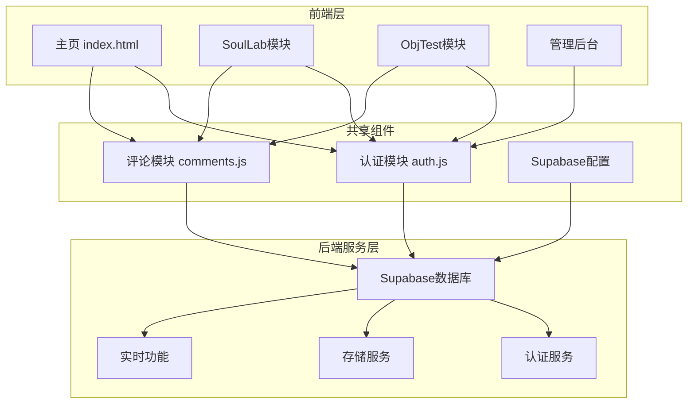
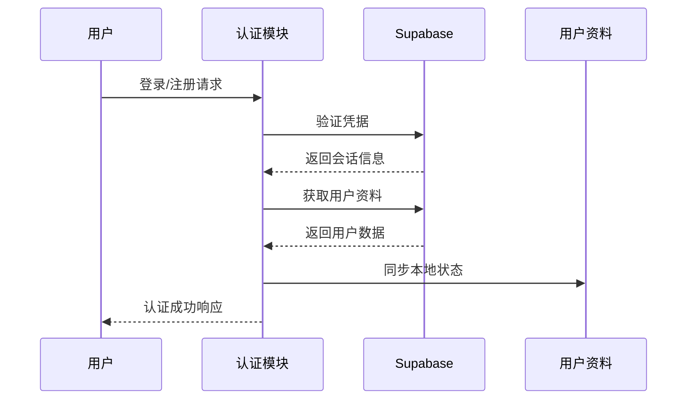
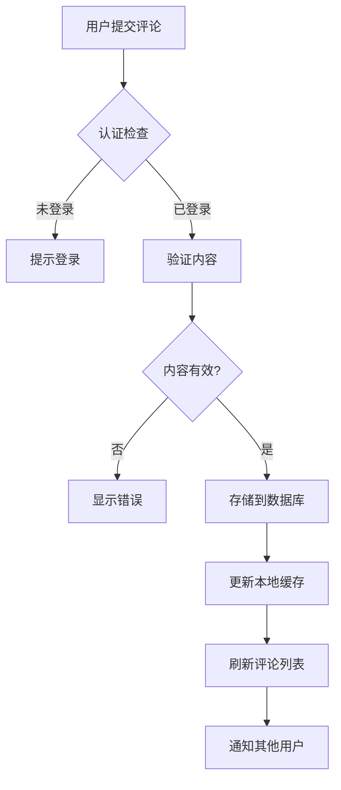
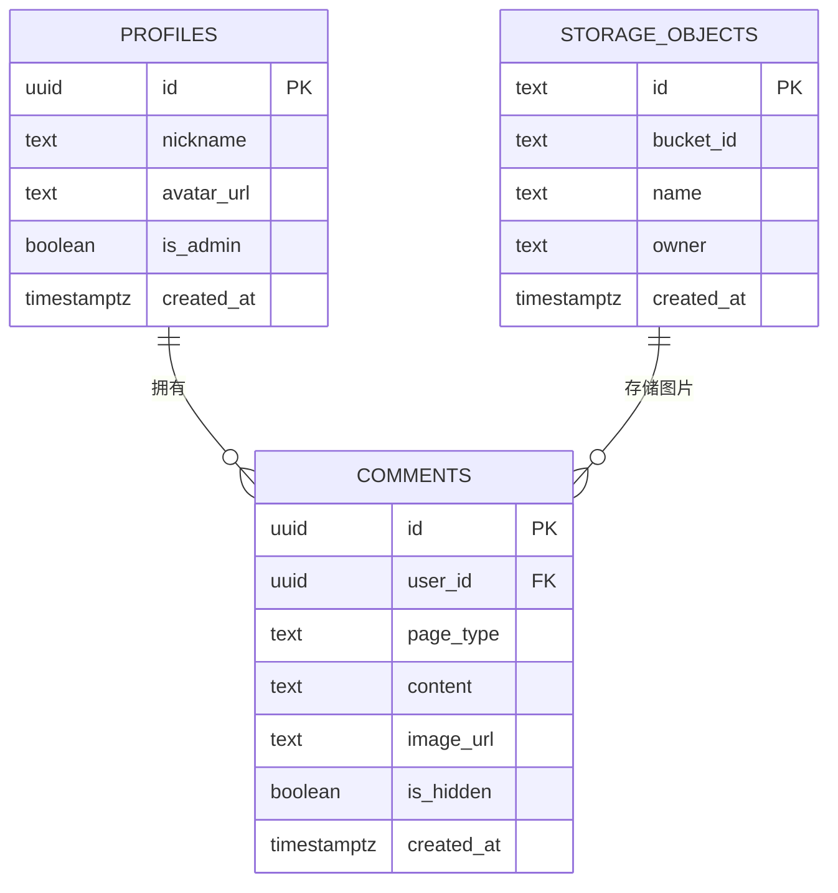
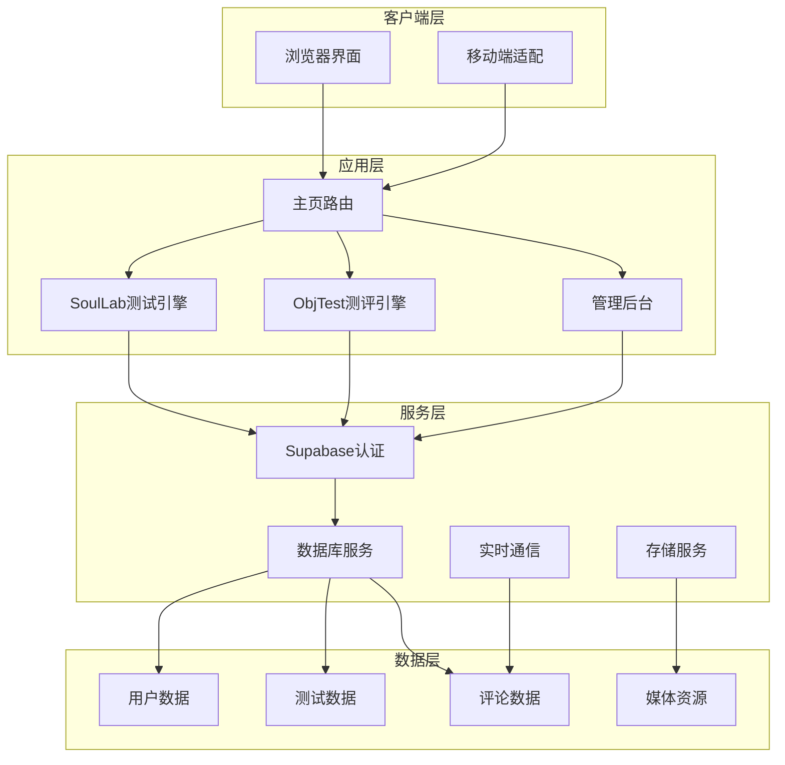
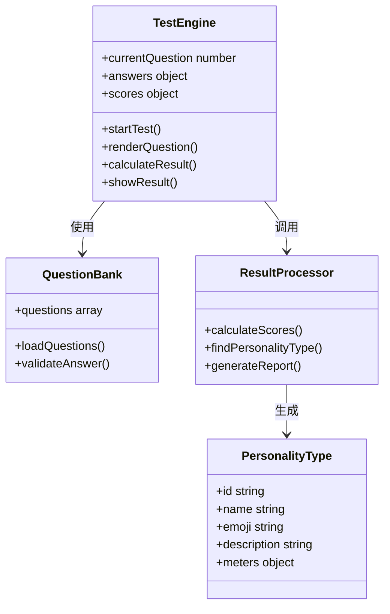
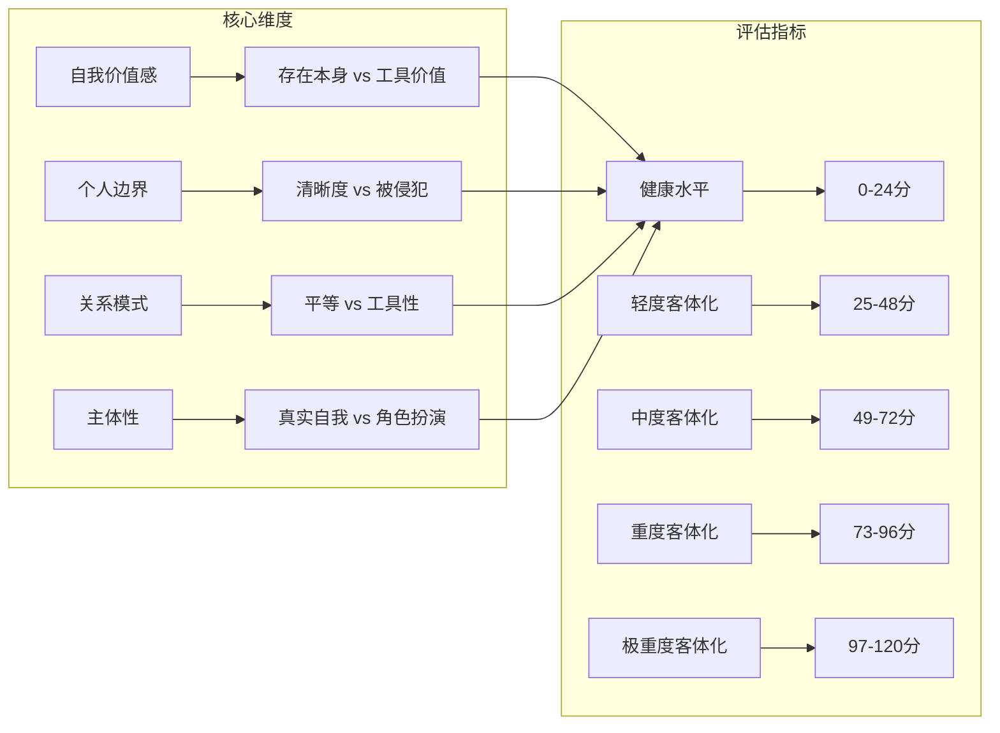
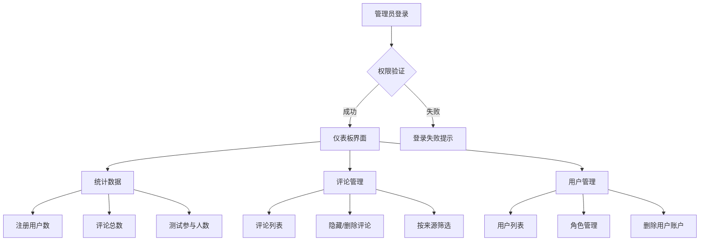
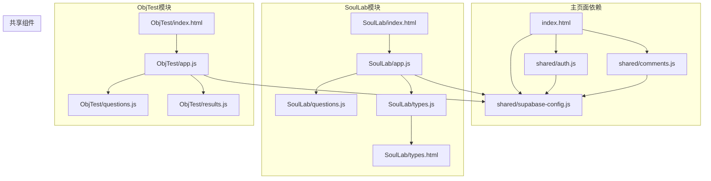
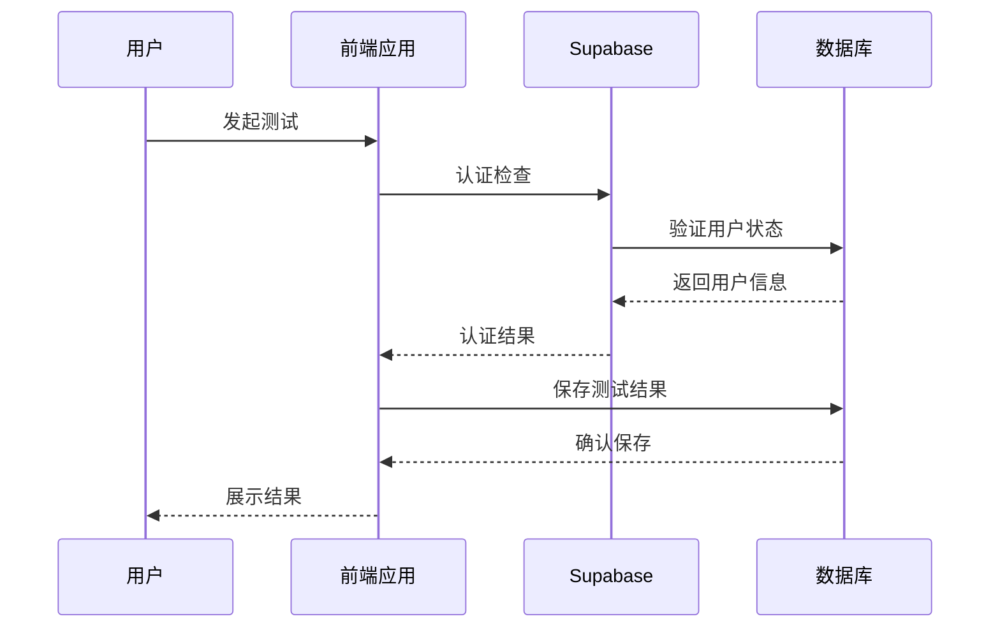

# 项目概述

<cite>
**本文档引用的文件**
- [index.html](file://index.html)
- [supabase-config.js](file://shared/supabase-config.js)
- [auth.js](file://shared/auth.js)
- [comments.js](file://shared/comments.js)
- [supabase-schema.sql](file://supabase-schema.sql)
- [SoulLab/index.html](file://SoulLab/index.html)
- [SoulLab/app.js](file://SoulLab/app.js)
- [SoulLab/questions.js](file://SoulLab/questions.js)
- [SoulLab/types.html](file://SoulLab/types.html)
- [SoulLab/types.js](file://SoulLab/types.js)
- [ObjTest/index.html](file://ObjTest/index.html)
- [ObjTest/app.js](file://ObjTest/app.js)
- [ObjTest/questions.js](file://ObjTest/questions.js)
- [ObjTest/results.js](file://ObjTest/results.js)
- [ObjTest/客体化测试.md](file://ObjTest/客体化测试.md)
- [admin/index.html](file://admin/index.html)
</cite>

## 目录
1. [项目简介](#项目简介)
2. [项目结构](#项目结构)
3. [核心组件](#核心组件)
4. [架构概览](#架构概览)
5. [详细组件分析](#详细组件分析)
6. [依赖关系分析](#依赖关系分析)
7. [性能考量](#性能考量)
8. [故障排除指南](#故障排除指南)
9. [结论](#结论)
10. [附录](#附录)

## 项目简介

觉醒诗社心理测评平台是一个基于Supabase的全栈心理测评系统，致力于通过技术手段促进心理健康意识和自我认知。该项目包含两大核心模块：

### 核心模块

**SoulLab人格测试**（灵性修行版）
- 基于33道深度问题的个性化人格测评
- 融合灵性觉醒、MBTI与SBTI元素的独特测评体系
- 提供12种人格类型的详细解读和可视化展示
- 包含面具厚度、灵魂清醒度、摆烂指数、内心戏浓度等维度分析

**ObjTest客体化测试**（自我客体化测评）
- 专门评估个体将自己客体化（当作工具、物品或他人实现目的的手段）的程度
- 40道精心设计的问题，涵盖自我价值感、个人边界、关系模式等多个维度
- 提供从健康到极重度的五个等级评估结果
- 重点关注人际关系中的主体性维护

### 教育意义与社会价值

该项目通过以下方式体现其教育意义和社会价值：
- **心理健康普及**：以轻松有趣的方式降低心理测评的门槛，让更多人关注自身心理健康
- **自我认知提升**：通过深度问题引导用户反思自己的行为模式和思维习惯
- **关系质量改善**：帮助用户识别和改善不健康的人际关系模式
- **心理危机预警**：及时发现潜在的心理健康问题，提供早期干预线索

## 项目结构

项目采用模块化设计，主要分为以下几个层次：

**图表来源**
- [index.html:1-1171](file://index.html#L1-L1171)
- [shared/auth.js:1-1470](file://shared/auth.js#L1-L1470)
- [shared/comments.js:1-697](file://shared/comments.js#L1-L697)

### 文件组织结构

项目采用按功能模块划分的目录结构：

- **根目录**：主页面和全局配置
- **SoulLab/**：人格测试模块（包含测试界面、逻辑处理、类型展示）
- **ObjTest/**：客体化测试模块（包含测试界面、逻辑处理、结果展示）
- **shared/**：共享的认证、评论和数据库配置
- **admin/**：管理后台界面

**章节来源**
- [index.html:1-1171](file://index.html#L1-L1171)
- [SoulLab/index.html:1-271](file://SoulLab/index.html#L1-L271)
- [ObjTest/index.html:1-170](file://ObjTest/index.html#L1-L170)
- [admin/index.html:1-688](file://admin/index.html#L1-L688)

## 核心组件

### 认证系统

项目采用基于Supabase的认证系统，提供完整的用户身份验证和授权功能：

**图表来源**
- [shared/auth.js:567-677](file://shared/auth.js#L567-L677)
- [shared/supabase-config.js:1-26](file://shared/supabase-config.js#L1-L26)

### 评论系统

集成化的评论功能支持用户互动和社区建设：

**图表来源**
- [shared/comments.js:439-571](file://shared/comments.js#L439-L571)

### 数据模型

项目使用PostgreSQL数据库存储用户数据、测试结果和评论内容：

**图表来源**
- [supabase-schema.sql:6-97](file://supabase-schema.sql#L6-L97)

**章节来源**
- [shared/auth.js:1-1470](file://shared/auth.js#L1-L1470)
- [shared/comments.js:1-697](file://shared/comments.js#L1-L697)
- [supabase-schema.sql:1-97](file://supabase-schema.sql#L1-L97)

## 架构概览

项目采用前后端分离的架构设计，结合现代Web技术和云服务：

**图表来源**
- [index.html:1-1171](file://index.html#L1-L1171)
- [SoulLab/app.js:1-613](file://SoulLab/app.js#L1-L613)
- [ObjTest/app.js:1-327](file://ObjTest/app.js#L1-L327)

### 技术栈选择

**前端技术**
- 原生JavaScript + HTML5 + CSS3
- Canvas图形渲染
- 响应式设计
- 现代浏览器兼容性

**后端技术**
- Supabase（PostgreSQL + 云函数）
- 服务器less架构
- 自动扩展能力

**安全特性**
- JWT令牌认证
- 行级安全策略
- 数据库权限控制
- CORS跨域安全

**章节来源**
- [index.html:1-1171](file://index.html#L1-L1171)
- [shared/supabase-config.js:1-26](file://shared/supabase-config.js#L1-L26)
- [supabase-schema.sql:1-97](file://supabase-schema.sql#L1-L97)

## 详细组件分析

### SoulLab人格测试模块

#### 核心功能架构

**图表来源**
- [SoulLab/app.js:1-613](file://SoulLab/app.js#L1-L613)
- [SoulLab/questions.js:1-352](file://SoulLab/questions.js#L1-L352)

#### 33道深度问题设计

SoulLab测试包含33个精心设计的问题，覆盖以下核心主题：

| 问题类别 | 核心主题 | 示例问题 |
|---------|----------|----------|
| 价值认知 | 自我价值感 | "你觉得周围人每天操心的事情就像NPC在走程序" |
| 社交模式 | 人际边界 | "朋友扛不住了来找你哭，说'活着没意思'" |
| 存在意义 | 生命态度 | "如果明天是地球最后一天，你此刻的状态" |
| 心理防御 | 面具与真实 | "把'活在当下''非二元觉知'这种词挂嘴边的人" |

#### 12种人格类型分类

系统将用户归类为12种独特的人格类型：

1. **精致面具者** (mask) - 灵性面具者 + FAKE伪人
2. **知识囤积者** (hoard) - 知识囤积者 + THIN-K思考者  
3. **浪漫逃避者** (escape) - 浪漫逃避者 + LOVE-R多情者
4. **愤世解构者** (rebel) - 逻辑解构者 + SHIT愤世者
5. **边缘观察者** (edge) - 边缘觉察者 + SOLO孤儿
6. **绝望坠落者** (crash) - 绝望坠落者 + DEAD死者
7. **佛系摆烂者** (chill) - OJBK无所谓人 + ZZZZ装死者 + MONK僧人
8. **社交小丑者** (clown) - JOKE-R小丑 + SEXY尤物 + ESFP表演者
9. **操心圣母者** (mama) - MUM妈妈 + ISFJ守护者 + ENFJ主人公
10. **人间清醒者** (hustle) - CTRL拿捏者 + BOSS + ENTJ指挥官
11. **混沌野草者** (chaos) - FUCK草者 + WOC握草人 + MALO吗喽
12. **恒久观察者** (awake) - 恒久观察者 + 纯粹意志者

**章节来源**
- [SoulLab/app.js:334-405](file://SoulLab/app.js#L334-L405)
- [SoulLab/questions.js:1-352](file://SoulLab/questions.js#L1-L352)

### ObjTest客体化测试模块

#### 测评维度设计

ObjTest测试专注于评估个体的客体化程度，包含以下关键维度：

**图表来源**
- [ObjTest/results.js:8-55](file://ObjTest/results.js#L8-L55)

#### 40道测评题目设计

测试题目围绕以下核心主题设计：

| 主题领域 | 关键问题 | 评分标准 |
|---------|----------|----------|
| 自我价值 | "我觉得自己的价值主要取决于" | 0-3分递增 |
| 边界意识 | "我的个人边界（时间、空间、隐私）" | 0-3分递增 |
| 关系质量 | "在亲密关系中，我感觉自己是" | 0-3分递增 |
| 主体性 | "我能在关系中做真实的自己" | 0-3分递增 |
| 控制感 | "我对生活的掌控感" | 0-3分递增 |
| 空虚感 | "我感到空虚和麻木的频率" | 0-3分递增 |

#### 结果分级系统

| 分数区间 | 人格类型 | 特征描述 | 心理状态 | 建议措施 |
|---------|----------|----------|----------|----------|
| 0-24分 | 健康水平 | 稳定的自我价值感，清晰边界 | 内在价值感稳定，关系平等 | 保持现状，定期自我检视 |
| 25-48分 | 轻度客体化 | 偶尔过度在意他人评价 | 压力下易自我怀疑 | 每周实践自我觉察练习 |
| 49-72分 | 中度客体化 | 自我价值感依赖外部评价 | "我必须有用才有价值" | 紧急行动：预约心理咨询 |
| 73-96分 | 重度客体化 | 自我价值感严重依赖他人 | "我只是工具，没用就没价值" | 危险信号：需要专业干预 |
| 97-120分 | 极重度客体化 | 完全失去自我主体性 | "我不配活着" | 心理危机紧急状态 |

**章节来源**
- [ObjTest/app.js:207-242](file://ObjTest/app.js#L207-L242)
- [ObjTest/questions.js:1-403](file://ObjTest/questions.js#L1-L403)
- [ObjTest/results.js:1-55](file://ObjTest/results.js#L1-L55)

### 管理后台系统

#### 功能特性

管理后台提供全面的内容管理和用户治理功能：

**图表来源**
- [admin/index.html:398-660](file://admin/index.html#L398-L660)

#### 核心管理功能

1. **评论管理**
   - 实时评论监控和审核
   - 按来源（SoulLab/ObjTest）分类管理
   - 隐藏/删除违规内容
   - 用户头像和昵称显示

2. **用户管理**
   - 用户注册统计和分析
   - 角色权限管理（管理员/普通用户）
   - 用户头像和资料审核
   - 账户删除和清理

3. **系统状态监控**
   - 数据库连接状态
   - 功能可用性检测
   - 错误日志和告警

**章节来源**
- [admin/index.html:1-688](file://admin/index.html#L1-L688)

## 依赖关系分析

### 前端依赖关系

**图表来源**
- [index.html:1-1171](file://index.html#L1-L1171)
- [SoulLab/index.html:1-271](file://SoulLab/index.html#L1-L271)
- [ObjTest/index.html:1-170](file://ObjTest/index.html#L1-L170)

### 数据流依赖

**图表来源**
- [SoulLab/app.js:63-74](file://SoulLab/app.js#L63-L74)
- [ObjTest/app.js:53-64](file://ObjTest/app.js#L53-L64)

**章节来源**
- [shared/supabase-config.js:1-26](file://shared/supabase-config.js#L1-L26)
- [SoulLab/app.js:1-613](file://SoulLab/app.js#L1-L613)
- [ObjTest/app.js:1-327](file://ObjTest/app.js#L1-L327)

## 性能考量

### 前端性能优化

1. **资源加载优化**
   - 使用CDN加速静态资源
   - 图片懒加载和缓存策略
   - Canvas动画性能调优

2. **内存管理**
   - 及时清理事件监听器
   - 合理使用DOM操作
   - 避免内存泄漏

3. **网络优化**
   - 请求合并和去重
   - 缓存策略实现
   - 错误重试机制

### 后端性能考虑

1. **数据库优化**
   - 合理的索引设计
   - 查询语句优化
   - 连接池管理

2. **API性能**
   - 无状态设计
   - 响应时间监控
   - 错误处理优化

## 故障排除指南

### 常见问题诊断

#### 认证问题
- **问题**：登录失败或会话丢失
- **解决方案**：检查Supabase配置、网络连接、浏览器Cookie设置

#### 数据加载问题
- **问题**：测试数据无法加载或显示异常
- **解决方案**：验证数据库连接、检查SQL脚本执行情况、确认RDS策略配置

#### 评论功能问题
- **问题**：评论无法发布或显示异常
- **解决方案**：检查Storage权限、验证用户认证状态、确认评论表结构

#### 性能问题
- **问题**：页面加载缓慢或响应迟滞
- **解决方案**：优化图片资源、减少DOM操作、实施缓存策略

**章节来源**
- [shared/auth.js:115-147](file://shared/auth.js#L115-L147)
- [shared/comments.js:42-61](file://shared/comments.js#L42-L61)

## 结论

觉醒诗社心理测评平台是一个设计精良、功能完善的全栈心理测评系统。通过结合SoulLab人格测试和ObjTest客体化测试两大模块，项目不仅提供了专业的心理测评工具，更重要的是通过技术手段促进了心理健康意识的普及。

### 项目优势

1. **技术创新**：采用现代Web技术和云服务架构，具有良好的可扩展性和维护性
2. **用户体验**：简洁直观的界面设计，流畅的交互体验
3. **教育价值**：通过有趣的测评形式提高用户对心理健康的关注度
4. **社会意义**：为心理健康教育和预防提供技术支持

### 发展前景

项目具备良好的发展基础，未来可以在以下方面进一步完善：
- 增加更多测评模块和类型
- 优化移动端用户体验
- 集成AI辅助分析功能
- 扩展社区互动功能

## 附录

### 快速开始指南

1. **环境准备**
   - 确保浏览器支持现代JavaScript特性
   - 准备稳定的网络连接
   - 准备邮箱地址用于注册

2. **访问方式**
   - 直接访问项目主页
   - 选择感兴趣的测评模块
   - 完成简单的注册流程

3. **使用建议**
   - 选择安静的时间环境
   - 诚实回答每个问题
   - 仔细阅读结果解读
   - 如有需要寻求专业帮助

### 技术规范

- **浏览器兼容性**：Chrome、Firefox、Safari最新版本
- **移动端支持**：iOS Safari、Android Chrome
- **性能要求**：建议网络带宽不低于5Mbps
- **存储要求**：本地存储空间无特殊要求